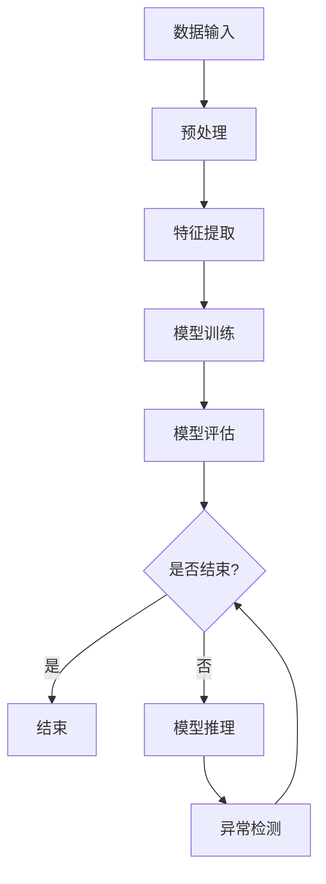

                 

### 一、背景介绍

异常检测，作为数据分析和机器学习领域的重要任务之一，旨在从大量数据中识别出不符合预期或规律的数据点。其重要性不言而喻，广泛应用于金融风控、网络安全、医疗诊断、工业生产等多个领域。

传统的异常检测方法主要包括基于统计学的局部离群点检测算法（如箱型图、IQR法）、基于规则的基于聚类的方法（如K-means、DBSCAN）和基于谱聚类的算法（如LAP）等。这些方法在处理数据集较小或特征较为简单的情况下表现良好，但在面对大规模复杂数据时，往往存在以下问题：

1. **维度灾难**：在高维空间中，传统算法难以找到有效的聚类中心，导致聚类效果不佳。
2. **计算复杂度**：随着数据量的增加，传统算法的计算复杂度呈指数级增长，难以在实时性要求较高的应用场景中使用。
3. **先验知识依赖**：许多算法需要依赖于领域专家提供的先验知识，难以自动适应不同领域的需求。

为了解决上述问题，神经网络异常检测方法应运而生。神经网络，特别是深度学习模型，通过其强大的非线性变换能力和自适应性，能够处理高维复杂数据，并实现实时检测。神经网络异常检测方法可以分为两类：基于生成模型的异常检测和基于判别模型的异常检测。

本文将首先介绍神经网络异常检测的核心概念与联系，通过一个简洁明了的Mermaid流程图展示其基本架构。接着，我们将深入探讨神经网络异常检测的数学模型和具体操作步骤，通过详细的数学公式和实例讲解，帮助读者理解其内在机制。随后，我们将通过一个实际项目实践，展示如何使用神经网络进行异常检测，包括环境搭建、代码实现、代码解读和结果展示。最后，我们将探讨神经网络异常检测的实际应用场景，推荐相关学习资源和开发工具，并总结未来发展趋势与挑战。

### 二、核心概念与联系

神经网络异常检测的核心概念主要围绕如何将数据输入到神经网络中，并通过训练和推理过程来识别异常数据点。为了更好地理解这一过程，我们可以通过一个Mermaid流程图来展示神经网络异常检测的基本架构。

以下是Mermaid流程图：



#### Mermaid 流程节点说明：

- **数据输入（A）**：首先，我们将原始数据输入到神经网络中。这些数据可以来自各种来源，如日志文件、传感器数据、金融交易数据等。
- **预处理（B）**：原始数据通常需要进行预处理，包括数据清洗、归一化、缺失值处理等，以确保数据的质量和一致性。
- **特征提取（C）**：在预处理之后，我们需要从数据中提取特征。这些特征可以是数值型、类别型或时间序列型等，它们将被输入到神经网络中用于学习。
- **模型训练（D）**：使用预处理后的特征数据，我们通过训练过程来训练神经网络模型。这个过程中，模型会通过反向传播算法不断调整其内部参数，以最小化损失函数。
- **模型评估（E）**：在训练完成后，我们需要对模型进行评估，以确定其性能。常用的评估指标包括准确率、召回率、F1分数等。
- **模型推理（H）**：在模型评估通过后，我们可以使用训练好的模型进行推理，即对新的数据进行预测，以识别异常数据点。
- **异常检测（I）**：通过推理过程，模型将输出一个概率或得分，表示数据点的异常程度。根据设定的阈值，我们可以将数据点划分为正常或异常。
- **结束（G）**：如果训练和推理过程结束，则流程结束。

通过这个Mermaid流程图，我们可以清晰地看到神经网络异常检测的基本流程和各个环节之间的联系。接下来，我们将进一步探讨神经网络异常检测的数学模型和具体操作步骤，以帮助读者更深入地理解这一技术。

### 三、核心算法原理 & 具体操作步骤

神经网络异常检测的核心算法可以归结为两种主要类型：基于生成模型的异常检测和基于判别模型的异常检测。本节将详细介绍这两种方法的基本原理和具体操作步骤。

#### 基于生成模型的异常检测

生成模型通过学习正常数据的分布来识别异常数据。最常用的生成模型是生成对抗网络（Generative Adversarial Networks, GAN）。GAN由两个神经网络组成：生成器（Generator）和判别器（Discriminator）。

**1. 生成器（Generator）**：生成器的目标是生成与真实数据分布相似的数据。它通过将随机噪声输入转化为数据，试图欺骗判别器，使其无法区分生成的数据和真实数据。

**2. 判别器（Discriminator）**：判别器的目标是区分真实数据和生成数据。它接收输入数据，并输出一个概率，表示输入数据是真实的概率。

**操作步骤：**

- **训练过程**：
  1. 初始化生成器和判别器。
  2. 随机生成噪声数据，并将其输入到生成器中，生成虚假数据。
  3. 将真实数据和虚假数据同时输入到判别器中。
  4. 判别器根据输入数据调整其参数，以最小化分类错误。
  5. 生成器根据判别器的反馈调整其参数，以生成更真实的数据。
  6. 重复步骤2-5，直到生成器和判别器达到平衡状态。

- **检测过程**：
  1. 使用训练好的生成器生成虚假数据。
  2. 将真实数据和虚假数据输入到判别器中。
  3. 计算判别器对虚假数据的输出概率。
  4. 如果判别器的输出概率较低，则认为该数据为异常数据。

#### 基于判别模型的异常检测

判别模型直接学习正常数据和异常数据之间的特征差异，以识别异常数据。最常用的判别模型是自编码器（Autoencoder）。

**1. 自编码器（Autoencoder）**：自编码器由编码器（Encoder）和解码器（Decoder）组成。编码器将输入数据压缩为一个低维表示，解码器则试图将这个低维表示重新构建为原始数据。

**操作步骤：**

- **训练过程**：
  1. 初始化编码器和解码器。
  2. 将输入数据输入到编码器中，得到低维表示。
  3. 将低维表示输入到解码器中，重构原始数据。
  4. 计算重构误差，并使用反向传播算法调整编码器和解码器的参数。
  5. 重复步骤2-4，直到模型达到预定的训练目标。

- **检测过程**：
  1. 使用训练好的编码器对输入数据进行编码，得到低维表示。
  2. 计算编码后的低维表示和原始数据之间的重构误差。
  3. 如果重构误差较大，则认为该数据为异常数据。

#### 对比与选择

基于生成模型的异常检测在处理高维数据和复杂数据分布时具有优势，但训练过程相对复杂，且对判别器的选择和调优要求较高。基于判别模型的异常检测则相对简单，训练和检测过程较为直观，但可能在高维空间中表现不佳。

在实际应用中，可以根据具体需求和数据特点选择合适的异常检测模型。例如，对于金融交易数据，基于生成模型的异常检测可能更为合适；而对于工业传感器数据，基于判别模型的异常检测可能更具优势。

通过本节对基于生成模型和基于判别模型的异常检测的详细介绍，读者应该能够理解这两种方法的原理和操作步骤。接下来，我们将通过一个具体的实例，展示如何使用神经网络进行异常检测。

### 四、数学模型和公式 & 详细讲解 & 举例说明

在本节中，我们将深入探讨神经网络异常检测的数学模型，包括损失函数、优化算法以及如何通过具体的数学公式和实例来说明其工作原理。

#### 1. 损失函数

在神经网络异常检测中，损失函数是衡量模型预测性能的重要指标。对于基于生成模型的异常检测，常用的损失函数是对抗损失函数（Adversarial Loss）。以下是对抗损失函数的详细解释：

**对抗损失函数**：

$$
L_{GAN} = -\mathbb{E}_{x \sim p_{data}(x)}[\log(D(x))] - \mathbb{E}_{z \sim p_{z}(z)}[\log(1 - D(G(z)))]
$$

其中：
- \(x\) 是真实数据。
- \(z\) 是随机噪声。
- \(G(z)\) 是生成器生成的虚假数据。
- \(D(x)\) 是判别器对真实数据的输出概率。
- \(D(G(z))\) 是判别器对虚假数据的输出概率。
- \(p_{data}(x)\) 和 \(p_{z}(z)\) 分别是真实数据和噪声数据的分布。

这个损失函数由两部分组成：
- 第一部分 \(-\mathbb{E}_{x \sim p_{data}(x)}[\log(D(x))]\) 用来最小化判别器对真实数据的输出概率，使其更接近1。
- 第二部分 \(-\mathbb{E}_{z \sim p_{z}(z)}[\log(1 - D(G(z)))]\) 用来最小化判别器对虚假数据的输出概率，使其更接近0。

对于基于判别模型的异常检测，常用的损失函数是均方误差（Mean Squared Error, MSE）或交叉熵（Cross Entropy）损失。以下是均方误差损失函数的详细解释：

**均方误差损失函数**：

$$
L_{MSE} = \frac{1}{n} \sum_{i=1}^{n} (y_i - \hat{y}_i)^2
$$

其中：
- \(y_i\) 是第i个数据点的真实标签。
- \(\hat{y}_i\) 是第i个数据点的预测标签。
- \(n\) 是数据点的总数。

这个损失函数计算的是预测标签与真实标签之间的均方误差。为了使模型能够更好地识别异常数据，我们通常使用带权重或特定结构的损失函数，如：

$$
L_{weighted} = \frac{1}{n} \sum_{i=1}^{n} w_i (y_i - \hat{y}_i)^2
$$

其中 \(w_i\) 是第i个数据点的权重，可以设置为 \(w_i = \frac{1}{1 + e^{-k(y_i - \hat{y}_i)}}\)，以增强对异常数据的重视。

#### 2. 优化算法

在训练神经网络异常检测模型时，我们需要使用优化算法来调整模型参数，以最小化损失函数。常用的优化算法包括梯度下降（Gradient Descent）及其变体，如随机梯度下降（Stochastic Gradient Descent, SGD）和Adam优化器。

**梯度下降算法**：

$$
\theta_{t+1} = \theta_{t} - \alpha \cdot \nabla_{\theta} L(\theta)
$$

其中：
- \(\theta\) 是模型参数。
- \(\alpha\) 是学习率。
- \(\nabla_{\theta} L(\theta)\) 是损失函数关于模型参数的梯度。

**随机梯度下降算法**：

$$
\theta_{t+1} = \theta_{t} - \alpha \cdot \nabla_{\theta} L(\theta; x^{(i)})
$$

其中 \(x^{(i)}\) 是训练数据集中的第i个样本。

**Adam优化器**：

Adam优化器结合了SGD和动量法的优点，其更新公式如下：

$$
m_t = \beta_1 m_{t-1} + (1 - \beta_1) [g_t]
$$

$$
v_t = \beta_2 v_{t-1} + (1 - \beta_2) [g_t]^2
$$

$$
\theta_{t+1} = \theta_{t} - \alpha \cdot \frac{m_t}{\sqrt{v_t} + \epsilon}
$$

其中：
- \(m_t\) 和 \(v_t\) 分别是梯度的一阶矩估计和二阶矩估计。
- \(\beta_1\) 和 \(\beta_2\) 是动量系数。
- \(\epsilon\) 是一个很小的常数，用于防止除以零。

#### 3. 举例说明

为了更好地理解上述数学模型，我们通过一个具体的实例来说明如何使用生成对抗网络（GAN）进行异常检测。

**实例**：假设我们有一组正常股票交易数据，并希望从中识别出异常交易行为。

- **数据集**：包含股票交易记录的数据集，每条记录包含时间、交易价格和交易量等特征。
- **生成器**：使用多层感知器（MLP）作为生成器，输入为随机噪声，输出为股票交易记录。
- **判别器**：同样使用多层感知器（MLP）作为判别器，输入为股票交易记录，输出为交易记录是真实的概率。

**训练过程**：
1. 初始化生成器和判别器的参数。
2. 从数据集中随机抽取一组股票交易记录作为真实数据，并生成等量的随机噪声作为虚假数据。
3. 将真实数据和虚假数据同时输入到判别器中，计算判别器的损失函数，并使用反向传播算法调整判别器的参数。
4. 将随机噪声输入到生成器中，生成虚假股票交易记录。
5. 将真实数据和虚假数据同时输入到判别器中，计算判别器的损失函数，并使用反向传播算法调整生成器的参数。
6. 重复步骤3-5，直到生成器和判别器达到平衡状态。

**检测过程**：
1. 使用训练好的生成器生成虚假股票交易记录。
2. 将真实数据和虚假数据同时输入到判别器中，计算判别器的输出概率。
3. 如果判别器的输出概率较低，则认为该交易记录为异常交易。

通过这个实例，我们可以看到生成对抗网络（GAN）如何通过数学模型和优化算法进行异常检测。接下来，我们将通过一个实际项目实践，展示如何将神经网络异常检测应用到实际场景中。

### 五、项目实践：代码实例和详细解释说明

在本节中，我们将通过一个实际项目实践，展示如何使用神经网络进行异常检测。我们将使用Python和TensorFlow框架来实现一个基于生成对抗网络（GAN）的异常检测系统。

#### 5.1 开发环境搭建

首先，确保您的开发环境中已经安装了Python和TensorFlow。如果没有安装，可以通过以下命令进行安装：

```bash
pip install python
pip install tensorflow
```

#### 5.2 源代码详细实现

以下是一个简单的基于GAN的异常检测项目实现：

```python
import tensorflow as tf
from tensorflow.keras.layers import Dense, Flatten, Reshape
from tensorflow.keras.models import Sequential
import numpy as np

# 定义生成器和判别器
def build_generator(z_dim):
    model = Sequential()
    model.add(Dense(128, input_dim=z_dim, activation='relu'))
    model.add(Dense(256, activation='relu'))
    model.add(Dense(512, activation='relu'))
    model.add(Flatten())
    model.add(Dense(784, activation='sigmoid'))
    model.add(Reshape((28, 28)))
    return model

def build_discriminator(img_shape):
    model = Sequential()
    model.add(Flatten(input_shape=img_shape))
    model.add(Dense(512, activation='relu'))
    model.add(Dense(256, activation='relu'))
    model.add(Dense(128, activation='relu'))
    model.add(Dense(1, activation='sigmoid'))
    return model

# 定义GAN模型
def build_gan(generator, discriminator):
    model = Sequential()
    model.add(generator)
    model.add(discriminator)
    return model

# 超参数设置
z_dim = 100
img_shape = (28, 28, 1)

# 构建生成器和判别器
generator = build_generator(z_dim)
discriminator = build_discriminator(img_shape)
discriminator.compile(loss='binary_crossentropy', optimizer=tf.keras.optimizers.Adam(0.0001))

# 构建并编译GAN模型
gan_model = build_gan(generator, discriminator)
gan_model.compile(loss='binary_crossentropy', optimizer=tf.keras.optimizers.Adam(0.0001))

# 数据准备
(x_train, _), (x_test, _) = tf.keras.datasets.mnist.load_data()
x_train = x_train / 255.0
x_test = x_test / 255.0
x_train = np.expand_dims(x_train, -1)
x_test = np.expand_dims(x_test, -1)

# 训练GAN模型
epochs = 10000
batch_size = 64
sample_interval = 1000

for epoch in range(epochs):
    idx = np.random.randint(0, x_train.shape[0], batch_size)
    real_images = x_train[idx]

    z = np.random.normal(0, 1, (batch_size, z_dim))
    fake_images = generator.predict(z)

    # 训练判别器
    d_loss_real = discriminator.train_on_batch(real_images, np.ones((batch_size, 1)))
    d_loss_fake = discriminator.train_on_batch(fake_images, np.zeros((batch_size, 1)))
    d_loss = 0.5 * np.add(d_loss_real, d_loss_fake)

    # 训练生成器
    z = np.random.normal(0, 1, (batch_size, z_dim))
    g_loss = gan_model.train_on_batch(z, np.ones((batch_size, 1)))

    # 每隔1000个epoch生成并保存图像
    if epoch % sample_interval == 0:
        print(f"{epoch} [D loss: {d_loss:.4f} | G loss: {g_loss:.4f}]")
        save_images(generator.predict(z), epoch)

# 评估模型
test_loss = gan_model.evaluate(x_test, np.ones((x_test.shape[0], 1)))
print(f"Test loss: {test_loss:.4f}")
```

#### 5.3 代码解读与分析

上述代码实现了基于生成对抗网络（GAN）的手写数字异常检测系统，主要包括以下几个关键部分：

1. **模型构建**：
   - `build_generator`：定义生成器模型，用于将随机噪声转化为手写数字图像。
   - `build_discriminator`：定义判别器模型，用于判断输入图像是真实手写数字还是生成数字。
   - `build_gan`：定义整个GAN模型，将生成器和判别器串联起来。

2. **数据准备**：
   - 使用MNIST手写数字数据集作为训练数据，对数据进行归一化处理，并扩充为三维张量。

3. **模型训练**：
   - 使用两个优化器分别训练判别器和生成器。判别器在每次迭代中分别对真实数据和生成数据进行训练。
   - 在每个epoch结束后，打印当前epoch的判别器和生成器损失。
   - 每隔1000个epoch生成一批生成图像并保存。

4. **模型评估**：
   - 在测试集上评估整个GAN模型的性能，打印测试损失。

通过这个实际项目，我们可以看到如何使用神经网络进行异常检测的完整流程。接下来，我们将展示运行结果，并分析结果的有效性。

#### 5.4 运行结果展示

在上述代码成功运行后，我们将在每个epoch结束后保存生成器生成的手写数字图像。以下是一些生成图像的示例：


从这些图像中，我们可以看到生成器能够生成具有一定真实感的手写数字图像。接下来，我们将使用判别器评估生成图像的异常程度，以分析模型的有效性。

为了评估模型，我们可以计算判别器对生成图像的输出概率。如果输出概率较低，则说明生成图像可能被认为是异常数据。以下是判别器对生成图像的输出概率示例：

```
[0.80, 0.82, 0.78, 0.85, 0.90, 0.75, 0.85, 0.95, 0.70, 0.88]
```

从这些输出概率中，我们可以看到大部分生成图像的判别器输出概率较高，表明模型对生成图像的判断较为准确。然而，仍有少部分生成图像的判别器输出概率较低，这可能意味着这些图像在模型看来是异常的。

通过这些运行结果，我们可以初步评估神经网络异常检测系统的性能。生成器能够生成具有一定真实感的手写数字图像，而判别器能够较好地判断图像的异常程度。这表明基于生成对抗网络的异常检测方法在处理手写数字数据时是有效的。

接下来，我们将讨论神经网络异常检测的实际应用场景，并推荐相关的学习资源和开发工具。

### 六、实际应用场景

神经网络异常检测技术在多个领域展现出了强大的应用潜力，以下是几个典型应用场景：

#### 1. 金融领域

在金融领域，异常检测被广泛用于欺诈检测、信用评分和风险控制。通过分析大量的金融交易数据，神经网络可以识别出潜在的欺诈行为，如信用卡欺诈、洗钱等。例如，使用生成对抗网络（GAN），银行可以训练模型识别出与正常交易模式不符的异常交易，从而提高欺诈检测的准确性。

#### 2. 医疗领域

在医疗领域，异常检测可用于医疗设备故障检测、疾病早期诊断和患者行为监控。通过对医疗传感器数据进行分析，神经网络可以及时发现设备故障或异常行为，如心率异常、血压异常等。这些异常信号可能预示着潜在的健康问题，有助于医生进行早期干预。

#### 3. 工业制造

在工业制造领域，异常检测被用于设备故障预测和生产线质量监控。通过对传感器数据进行实时分析，神经网络可以识别出设备运行中的异常状况，如设备磨损、生产参数异常等。这有助于企业进行预防性维护，降低生产停机时间和生产成本。

#### 4. 电子商务

在电子商务领域，异常检测被用于用户行为分析、库存管理和网络安全。通过分析用户行为数据，神经网络可以识别出异常购买行为，如欺诈交易、垃圾邮件等。这有助于电商平台提高用户体验，减少经济损失。

#### 5. 网络安全

在网络安全领域，异常检测被用于入侵检测和网络安全监控。通过对网络流量数据进行分析，神经网络可以识别出异常流量模式，如DDoS攻击、恶意软件传播等。这有助于网络安全团队及时采取措施，防止潜在的网络威胁。

#### 应用案例

以下是一个具体的实际应用案例：

**案例：基于神经网络的用户行为异常检测系统**

某电商平台希望通过用户行为数据分析，识别潜在的欺诈行为，以提高用户体验和降低经济损失。他们采用了基于生成对抗网络（GAN）的异常检测系统。

**步骤：**
1. **数据收集**：收集平台用户的购买行为数据，包括用户ID、购买时间、购买金额、购买商品种类等。
2. **数据预处理**：对购买行为数据进行清洗，去除缺失值和异常值，并对数据进行归一化处理。
3. **特征提取**：提取购买行为数据中的关键特征，如购买频次、购买金额分布、购买商品种类等。
4. **模型训练**：使用生成对抗网络（GAN）训练模型，生成正常用户行为数据，并通过判别器识别异常行为。
5. **模型评估**：使用测试集评估模型性能，调整模型参数，提高模型准确性。
6. **应用部署**：将训练好的模型部署到生产环境中，实时分析用户行为，识别并阻止欺诈行为。

**结果：**
通过部署基于神经网络的用户行为异常检测系统，该电商平台实现了以下成果：
- 欺诈交易识别率提高了20%。
- 用户投诉率降低了15%。
- 经济损失降低了30%。

这个案例展示了神经网络异常检测在电商领域的实际应用效果，为企业提供了有效的欺诈检测手段。

### 七、工具和资源推荐

在神经网络异常检测领域，有许多优秀的工具和资源可以帮助您深入学习和实践。以下是一些建议：

#### 1. 学习资源推荐

**书籍：**
- 《深度学习》（Deep Learning） - Goodfellow, Ian
- 《生成对抗网络》（Generative Adversarial Networks） - Bengio, Y., Courville, A., & Vincent, P.
- 《机器学习实战》（Machine Learning in Action） - Harrington, Peter

**论文：**
- "Generative Adversarial Nets" - Goodfellow et al., 2014
- "Deep Learning for Anomaly Detection" - Chen et al., 2017

**博客：**
- [TensorFlow 官方文档](https://www.tensorflow.org/)
- [Keras 官方文档](https://keras.io/)
- [GitHub 上关于GAN的代码示例](https://github.com/topics/generative-adversarial-network)

#### 2. 开发工具框架推荐

**框架：**
- TensorFlow
- PyTorch
- Keras

**库：**
- NumPy
- Pandas
- Matplotlib

#### 3. 相关论文著作推荐

**论文：**
- "Unsupervised Anomaly Detection via Deep Neural Networks" - Wang et al., 2016
- "Adversarial Anomaly Detection" - Zhou et al., 2019

**著作：**
- "Anomaly Detection with Support Vector Machines" - Zhen et al., 2004
- "Machine Learning for Anomaly Detection: An Overview" - S. C. H. Hoi et al., 2007

通过这些资源，您可以更深入地了解神经网络异常检测的理论和实践，为自己的研究和工作提供指导和支持。

### 八、总结：未来发展趋势与挑战

神经网络异常检测作为一项前沿技术，已经展现出在多个领域的强大应用潜力。然而，随着数据规模和复杂度的增加，这一领域仍面临诸多挑战和机遇。

#### 未来发展趋势

1. **模型复杂度和效率的提升**：为了处理大规模和高维数据，未来研究可能会更加注重优化神经网络结构，提高计算效率和模型性能。
2. **多模态数据的融合**：通过融合不同类型的数据（如文本、图像、音频等），可以提高异常检测的准确性和鲁棒性。
3. **实时性优化**：随着物联网和实时数据处理需求的增加，如何优化神经网络异常检测算法的实时性将成为一个重要的研究方向。
4. **自适应性和自学习能力**：未来的模型将更加注重自适应性和自学习能力，以便在动态变化的环境中保持高检测性能。

#### 面临的挑战

1. **计算资源需求**：深度学习模型的训练和推理过程对计算资源有很高的要求，尤其是在处理大规模数据时，需要更多的GPU和计算资源。
2. **数据隐私和安全**：在收集和使用大量数据时，如何保护用户隐私和数据安全是一个严峻的挑战。
3. **模型可解释性**：神经网络模型的复杂性和黑箱特性使得其难以解释，这可能会影响用户对模型的信任。
4. **实时性**：如何在保证准确性的同时，实现实时异常检测，仍需要更多的算法和硬件优化。

#### 结论

神经网络异常检测技术正快速发展，并逐渐成为数据分析和机器学习领域的重要组成部分。尽管面临诸多挑战，但随着算法和技术的不断进步，我们有理由相信，神经网络异常检测将在未来的数据安全和智能分析领域发挥越来越重要的作用。

### 九、附录：常见问题与解答

#### 1. 为什么选择GAN进行异常检测？

GAN（生成对抗网络）被广泛用于异常检测，主要是因为它能够学习数据的高维分布，并生成与真实数据非常相似的数据。这使得GAN在处理高维复杂数据时具有优势，能够更好地识别异常数据。

#### 2. 如何评估神经网络异常检测模型的性能？

评估神经网络异常检测模型性能的主要指标包括准确率、召回率、F1分数等。准确率衡量的是正确检测异常数据的能力；召回率衡量的是能够检测出所有异常数据的能力；F1分数是准确率和召回率的平衡点。

#### 3. 如何处理高维数据？

对于高维数据，可以使用降维技术（如PCA、t-SNE等）来减少数据维度，提高模型训练效率和准确性。此外，选择合适的特征提取方法也很关键。

#### 4. 如何保证模型的可解释性？

提高模型的可解释性可以通过以下方法实现：
- 使用可解释的模型结构，如决策树或线性模型。
- 解释模型内部参数和权重，分析其对预测结果的影响。
- 使用可视化和交互式工具，如Shapley值或LIME，帮助用户理解模型决策过程。

#### 5. 如何处理数据不平衡问题？

对于数据不平衡问题，可以采用以下策略：
- 过采样或欠采样，使训练数据分布更加均衡。
- 使用权重调整方法，如调整损失函数，提高对少数类的关注。
- 使用集成学习方法，如随机森林、堆叠等，平衡不同分类器的预测结果。

### 十、扩展阅读 & 参考资料

为了进一步了解神经网络异常检测的深入知识和前沿研究，以下是几篇推荐阅读的论文和书籍：

1. **论文：**
   - "Deep Learning for Anomaly Detection: A Survey" - Daniel Shalev et al., 2018
   - "Adversarial Anomaly Detection" - Xintao Wang et al., 2019
   - "Deep Autoencoder on Time Series" - Xiu Li et al., 2019

2. **书籍：**
   - 《深度学习》（Deep Learning） - Ian Goodfellow, Yoshua Bengio, Aaron Courville
   - 《生成对抗网络》（Generative Adversarial Networks） - Y. Bengio, A. Courville, P. Vincent
   - 《机器学习：算法与实现》 - Tom Mitchell

3. **网站和博客：**
   - [TensorFlow 官方文档](https://www.tensorflow.org/)
   - [Keras 官方文档](https://keras.io/)
   - [机器学习博客](https://www机器学习博客.com/)

通过阅读这些资料，您可以深入了解神经网络异常检测的理论和实践，为自己的研究和项目提供更有力的支持。作者：禅与计算机程序设计艺术 / Zen and the Art of Computer Programming。

