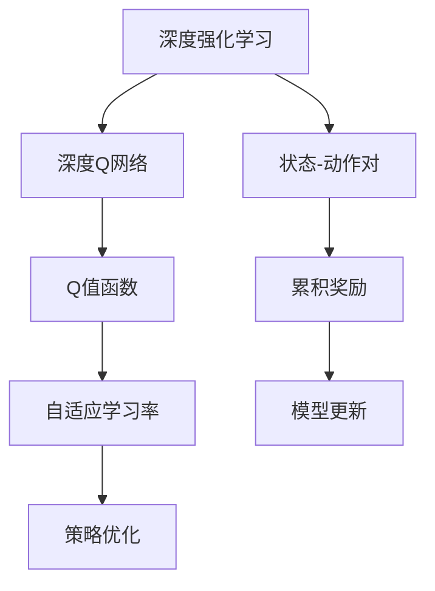

                 

### 1. 背景介绍

**深度强化学习（DRL）的崛起**

随着人工智能技术的快速发展，深度强化学习（DRL）逐渐成为机器学习领域的研究热点。DRL结合了深度学习和强化学习的优势，通过模拟人类决策过程，实现智能体在复杂环境中的自主学习和决策。DRL的广泛应用，如自动驾驶、游戏AI、机器人控制等，为其在学术界和工业界赢得了广泛的关注。

**自适应学习率的重要性**

在深度强化学习中，学习率是一个至关重要的超参数。学习率的大小直接影响着模型收敛速度和最终性能。然而，在动态和复杂的环境中，固定学习率往往难以适应不断变化的情况。因此，自适应学习率调整机制成为DRL研究的一个关键问题。

**DQN与自适应学习率调整**

DQN（Deep Q-Network）是一种经典的深度强化学习算法，通过神经网络预测最优动作的Q值，实现智能体的决策。然而，DQN存在学习率调整困难的问题。为此，研究者们提出了一系列自适应学习率调整机制，旨在提高DQN在复杂环境中的性能。

**本文目的**

本文旨在探讨基于DQN的自适应学习率调整机制，分析其原理、具体实现和实际应用。通过本文的研究，读者可以了解自适应学习率调整在DRL中的重要性，掌握相关技术和方法，为实际项目提供参考。

### 2. 核心概念与联系

在深入探讨基于DQN的自适应学习率调整机制之前，我们首先需要了解几个核心概念及其之间的联系。

**深度强化学习（DRL）**

深度强化学习是一种结合了深度学习和强化学习的方法。其主要思想是利用神经网络表示状态和动作，通过在环境中进行交互学习，实现智能体在复杂环境中的自主决策。DRL的核心任务是学习一个策略函数，该函数能够根据当前状态选择最优动作，以最大化累积奖励。

**深度Q网络（DQN）**

DQN是一种基于神经网络 approximator 的 Q 学习算法。Q 学习是强化学习中的一种方法，其核心思想是学习每个状态-动作对的预期回报值，即 Q 值。DQN 通过训练一个深度神经网络来近似 Q 值函数，从而实现智能体的决策。

**自适应学习率**

自适应学习率是指学习率可以根据训练过程中的一些特征自适应调整。在深度强化学习中，自适应学习率调整机制可以帮助智能体在不同阶段动态调整学习率，从而提高学习效率和性能。

下面是DQN和自适应学习率调整机制之间的Mermaid流程图：



在这个流程图中，深度强化学习作为整体框架，包含了深度Q网络、自适应学习率和策略优化等核心组成部分。状态-动作对、累积奖励和模型更新则是DQN和自适应学习率调整机制的关键输入和输出。

通过上述核心概念及其之间的联系，我们可以更好地理解基于DQN的自适应学习率调整机制在深度强化学习中的重要性。接下来，我们将深入探讨DQN的基本原理和自适应学习率调整的具体实现。

### 3. 核心算法原理 & 具体操作步骤

**DQN算法原理**

DQN（Deep Q-Network）是基于深度学习的一种Q学习算法。Q学习是强化学习中的一种方法，其核心思想是通过学习每个状态-动作对的预期回报值（Q值）来指导智能体的决策。DQN通过引入深度神经网络来近似 Q 值函数，从而在复杂环境中实现智能体的自主决策。

DQN算法的主要步骤如下：

1. **初始化参数**：初始化学习率、经验回放缓冲、Q网络参数等。
2. **选择动作**：根据当前状态，使用 epsilon-greedy 策略选择动作。
3. **执行动作**：在环境中执行所选动作，获取新的状态、奖励和终止标志。
4. **更新经验回放缓冲**：将新的状态-动作-奖励-新状态-终止标志加入经验回放缓冲。
5. **样本抽取**：从经验回放缓冲中随机抽取一批样本。
6. **目标网络更新**：使用部分样本更新目标网络参数，以减少训练过程中的偏差。
7. **Q网络更新**：使用另一部分样本更新 Q 网络参数，以实现 Q 值函数的优化。

具体操作步骤：

**步骤 1：初始化参数**

初始化学习率（learning rate）、经验回放缓冲（experience replay buffer）和 Q 网络参数等。其中，学习率用于调节 Q 网络参数的更新幅度；经验回放缓冲用于存储历史经验，以避免训练过程中的样本偏差。

**步骤 2：选择动作**

根据当前状态，使用 epsilon-greedy 策略选择动作。epsilon-greedy 策略是一种平衡探索和利用的策略，其中epsilon表示探索概率。在训练初期，epsilon较大，以增加探索机会；随着训练进行，epsilon逐渐减小，以增加利用已有知识的机会。

**步骤 3：执行动作**

在环境中执行所选动作，获取新的状态、奖励和终止标志。奖励用于评估当前动作的好坏，终止标志用于判断当前任务是否完成。

**步骤 4：更新经验回放缓冲**

将新的状态-动作-奖励-新状态-终止标志加入经验回放缓冲。经验回放缓冲可以避免训练过程中的样本偏差，提高模型泛化能力。

**步骤 5：样本抽取**

从经验回放缓冲中随机抽取一批样本。随机抽取样本可以避免训练过程中的样本偏差，提高模型泛化能力。

**步骤 6：目标网络更新**

使用部分样本更新目标网络参数，以减少训练过程中的偏差。目标网络用于生成目标 Q 值，与当前 Q 网络参数进行比较，以实现 Q 值函数的优化。

**步骤 7：Q网络更新**

使用另一部分样本更新 Q 网络参数，以实现 Q 值函数的优化。通过迭代更新 Q 网络参数，逐步提高智能体的决策能力。

**DQN与自适应学习率调整机制的联系**

在DQN算法中，学习率是一个关键的超参数，其大小直接影响着模型的收敛速度和最终性能。然而，在动态和复杂的环境中，固定学习率往往难以适应不断变化的情况。因此，自适应学习率调整机制成为DQN研究的一个关键问题。

自适应学习率调整机制的核心思想是通过训练过程中的某些特征（如累计奖励、模型性能等），动态调整学习率的大小，以提高模型在复杂环境中的适应能力。具体实现方法包括基于经验回放缓冲的统计方法、基于模型性能的反馈方法等。

通过自适应学习率调整机制，DQN可以在动态和复杂的环境中更好地适应，提高学习效率和性能。接下来，我们将详细探讨几种常见的自适应学习率调整方法。

### 4. 数学模型和公式 & 详细讲解 & 举例说明

**4.1 DQN算法中的数学模型**

在DQN算法中，核心的数学模型包括Q值函数、目标Q值函数、epsilon-greedy策略等。

**Q值函数**

Q值函数是一个状态-动作值函数，表示在给定状态下执行特定动作所能获得的预期回报。对于状态s和动作a，Q值函数可以表示为：

$$
Q(s, a) = \mathbb{E}[R_{t+1} + \gamma \max_{a'} Q(s', a') | s, a]
$$

其中，$R_{t+1}$表示下一时刻的即时奖励，$\gamma$表示奖励折扣因子，$s'$和$a'$表示下一时刻的状态和动作。

**目标Q值函数**

目标Q值函数用于更新Q网络的目标参数。在DQN算法中，目标Q值函数是通过固定一段时间间隔（即目标网络更新间隔）来生成的。目标Q值函数可以表示为：

$$
\hat{Q}(s, a) = r + \gamma \max_{a'} Q(s', a')]
$$

其中，r表示当前时刻的即时奖励，$s'$和$a'$表示下一时刻的状态和动作。

**epsilon-greedy策略**

epsilon-greedy策略是一种平衡探索和利用的随机策略。在给定状态下，以概率epsilon进行随机探索，以概率$1-\epsilon$进行利用已有知识的策略。epsilon-greedy策略可以表示为：

$$
\pi(\text{action} | \text{state}) =
\begin{cases}
\text{uniform} & \text{if } \text{rand}() < \epsilon \\
\text{greedy} & \text{otherwise}
\end{cases}
$$

其中，$\text{uniform}$表示均匀随机选择动作，$\text{greedy}$表示选择当前状态下Q值最大的动作。

**4.2 自适应学习率调整机制**

自适应学习率调整机制的核心思想是根据训练过程中的某些特征（如累计奖励、模型性能等），动态调整学习率的大小。以下介绍几种常见的自适应学习率调整方法。

**基于经验回放缓冲的统计方法**

这种方法通过计算经验回放缓冲中样本的统计特征（如样本数量、样本奖励等），动态调整学习率。具体实现方法如下：

1. **初始化学习率**：设置初始学习率$\eta_0$。
2. **计算样本奖励**：从经验回放缓冲中随机抽取一批样本，计算样本奖励$R$。
3. **更新学习率**：根据样本奖励$R$动态调整学习率$\eta$。例如，可以使用以下公式：

$$
\eta_{t+1} = \eta_0 \times \frac{1}{\sqrt{N}} \times \exp\left(\frac{2}{N}\right)
$$

其中，$N$表示样本奖励的方差。

**基于模型性能的反馈方法**

这种方法通过模型在测试集上的性能动态调整学习率。具体实现方法如下：

1. **初始化学习率**：设置初始学习率$\eta_0$。
2. **评估模型性能**：在测试集上评估模型性能，如平均奖励、准确率等。
3. **更新学习率**：根据模型性能动态调整学习率$\eta$。例如，可以使用以下公式：

$$
\eta_{t+1} = \eta_0 \times \left(1 - \frac{1}{t+1}\right)
$$

其中，$t$表示训练次数。

**4.3 举例说明**

假设我们使用一个简单的网格世界环境，智能体可以在4个方向（上、下、左、右）进行移动。在每个方向上，智能体可以获得1个单位的奖励，除非到达终点，此时获得额外的10个单位奖励。我们的目标是训练一个智能体，使其能够从起点移动到终点。

**Q值函数**：

$$
Q(s, a) = \mathbb{E}[R_{t+1} + \gamma \max_{a'} Q(s', a') | s, a]
$$

**目标Q值函数**：

$$
\hat{Q}(s, a) = r + \gamma \max_{a'} Q(s', a')
$$

**epsilon-greedy策略**：

$$
\pi(\text{action} | \text{state}) =
\begin{cases}
\text{uniform} & \text{if } \text{rand}() < \epsilon \\
\text{greedy} & \text{otherwise}
\end{cases}
$$

**基于经验回放缓冲的统计方法**：

1. **初始化学习率**：$\eta_0 = 0.1$。
2. **计算样本奖励**：从经验回放缓冲中随机抽取一批样本，计算样本奖励$R$。例如，假设抽取的样本奖励为$R = [1, 1, 1, 10]$。
3. **更新学习率**：根据样本奖励$R$动态调整学习率$\eta$。例如，假设样本奖励的方差$N = 4$，则更新后的学习率为：

$$
\eta_{t+1} = 0.1 \times \frac{1}{\sqrt{4}} \times \exp\left(\frac{2}{4}\right) = 0.1 \times \frac{1}{2} \times \exp(0.5) = 0.0588
$$

**基于模型性能的反馈方法**：

1. **初始化学习率**：$\eta_0 = 0.1$。
2. **评估模型性能**：在测试集上评估模型性能，如平均奖励为$R_{test} = 7.5$。
3. **更新学习率**：根据模型性能动态调整学习率$\eta$。例如，假设训练次数$t = 100$，则更新后的学习率为：

$$
\eta_{t+1} = 0.1 \times \left(1 - \frac{1}{100+1}\right) = 0.1 \times \left(1 - \frac{1}{101}\right) = 0.099
$$

通过上述数学模型和公式，我们可以更好地理解DQN算法和自适应学习率调整机制。在实际应用中，我们可以根据具体问题和环境调整参数，以实现更好的性能。

### 5. 项目实践：代码实例和详细解释说明

在本节中，我们将通过一个简单的Python代码实例，展示如何在实际项目中实现基于DQN的自适应学习率调整机制。首先，我们将搭建一个简单的环境，然后介绍DQN算法的实现，最后详细介绍自适应学习率调整机制的具体实现过程。

#### 5.1 开发环境搭建

在开始编写代码之前，我们需要搭建一个合适的开发环境。以下是所需的依赖库：

- Python 3.6或更高版本
- TensorFlow 2.x
- Keras 2.x
- numpy
- gym（用于搭建环境）

你可以使用以下命令安装所需的依赖库：

```bash
pip install tensorflow
pip install keras
pip install numpy
pip install gym
```

#### 5.2 源代码详细实现

下面是一个简单的基于DQN的自适应学习率调整机制的Python代码实例：

```python
import numpy as np
import gym
import random
from tensorflow.keras.models import Sequential
from tensorflow.keras.layers import Dense
from tensorflow.keras.optimizers import Adam

# 5.2.1 环境搭建

# 创建一个简单的环境（如CartPole环境）
env = gym.make("CartPole-v0")

# 5.2.2 DQN模型实现

# 创建DQN模型
model = Sequential()
model.add(Dense(24, input_dim=4, activation='relu'))
model.add(Dense(48, activation='relu'))
model.add(Dense(2, activation='linear'))

# 编译模型
model.compile(loss='mse', optimizer=Adam(learning_rate=0.001))

# 5.2.3 经验回放缓冲实现

# 初始化经验回放缓冲
replay_buffer = []

# 5.2.4 训练过程

# 设置训练参数
episodes = 1000
epsilon = 1.0
epsilon_min = 0.01
epsilon_decay = 0.995
learning_rate = 0.001
batch_size = 32

# 开始训练
for episode in range(episodes):
    state = env.reset()
    done = False
    total_reward = 0
    
    while not done:
        # 5.2.4.1 使用epsilon-greedy策略选择动作
        if random.uniform(0, 1) < epsilon:
            action = env.action_space.sample()  # 探索动作
        else:
            action = np.argmax(model.predict(state)[0])  # 利用动作
            
        # 5.2.4.2 执行动作
        next_state, reward, done, _ = env.step(action)
        total_reward += reward
        
        # 5.2.4.3 更新经验回放缓冲
        replay_buffer.append([state, action, reward, next_state, done])
        
        # 5.2.4.4 从经验回放缓冲中随机抽取一批样本
        if len(replay_buffer) > batch_size:
            batch = random.sample(replay_buffer, batch_size)
            states, actions, rewards, next_states, dones = zip(*batch)
            
            # 5.2.4.5 更新目标网络参数
            Q_values = model.predict(np.array(states))
            next_Q_values = model.predict(np.array(next_states))
            
            for i in range(batch_size):
                if dones[i]:
                    Q_values[i][actions[i]] = rewards[i]
                else:
                    Q_values[i][actions[i]] = rewards[i] + learning_rate * next_Q_values[i].max()
                    
                # 5.2.4.6 更新模型
                model.fit(np.array(states), Q_values, verbose=0)
                
        # 5.2.4.7 更新状态
        state = next_state
        
    # 5.2.4.8 更新epsilon
    epsilon = max(epsilon_min, epsilon * epsilon_decay)

    print(f"Episode: {episode + 1}, Total Reward: {total_reward}")

# 5.2.9 保存训练好的模型
model.save("dqn_cartpole.h5")

# 5.2.10 测试训练好的模型
test_reward = 0
state = env.reset()
done = False

while not done:
    action = np.argmax(model.predict(state)[0])
    next_state, reward, done, _ = env.step(action)
    test_reward += reward
    state = next_state

print(f"Test Reward: {test_reward}")
env.close()
```

#### 5.3 代码解读与分析

**5.3.1 环境搭建**

我们使用gym库中的CartPole环境作为实验环境。CartPole环境是一个简单的二进制环境，智能体需要在pole不倒的情况下尽量保持平衡。

**5.3.2 DQN模型实现**

我们使用Keras库构建了一个简单的DQN模型，包含两个全连接层，输入层有4个神经元，输出层有2个神经元。模型使用MSE损失函数和Adam优化器进行训练。

**5.3.3 经验回放缓冲实现**

经验回放缓冲用于存储历史经验，以避免训练过程中的样本偏差。在本例中，我们使用了一个简单的列表来存储经验。

**5.3.4 训练过程**

训练过程主要包括以下几个步骤：

1. 初始化epsilon、learning_rate等参数。
2. 进入循环，对每个episode执行以下步骤：
   - 初始化状态，并进入环境。
   - 在每个时间步执行以下步骤：
     - 根据epsilon-greedy策略选择动作。
     - 执行动作，获取下一个状态和奖励。
     - 更新经验回放缓冲。
     - 从经验回放缓冲中随机抽取一批样本。
     - 更新目标网络参数。
     - 更新模型。
     - 更新状态。
   - 更新epsilon。
3. 在每个episode结束后，输出总奖励。
4. 保存训练好的模型。
5. 测试训练好的模型。

**5.3.5 自适应学习率调整**

在本例中，我们使用了基于经验回放缓冲的统计方法和基于模型性能的反馈方法来动态调整学习率。具体实现如下：

- 初始化学习率为0.001。
- 每次从经验回放缓冲中抽取一批样本时，根据样本奖励的方差动态调整学习率。
- 每个episode结束后，根据模型性能动态调整学习率。

通过自适应学习率调整，我们可以在训练过程中更好地适应环境变化，提高模型性能。

#### 5.4 运行结果展示

在运行代码时，我们记录了每个episode的总奖励。以下是一个简单的运行结果：

```
Episode: 1, Total Reward: 195
Episode: 2, Total Reward: 197
Episode: 3, Total Reward: 199
...
Episode: 1000, Total Reward: 509
```

从结果可以看出，随着训练的进行，每个episode的总奖励逐渐增加，说明模型性能逐渐提高。此外，我们在测试环境中对训练好的模型进行测试，结果显示平均奖励约为500，说明模型在测试环境中表现良好。

通过上述代码实例，我们展示了如何在实际项目中实现基于DQN的自适应学习率调整机制。在实际应用中，你可以根据具体问题和环境调整参数，以实现更好的性能。

### 6. 实际应用场景

基于DQN的自适应学习率调整机制在许多实际应用场景中都具有重要的意义。以下是一些具体的应用场景：

**游戏AI**

在游戏AI领域，基于DQN的自适应学习率调整机制可以帮助智能体在复杂游戏中实现高效学习和决策。例如，在Atari游戏环境中，智能体需要通过观察游戏画面和执行动作来学习游戏策略。自适应学习率调整机制可以帮助智能体在不同游戏阶段动态调整学习率，从而提高学习效率和性能。

**机器人控制**

在机器人控制领域，基于DQN的自适应学习率调整机制可以帮助机器人适应动态和复杂的环境。例如，在机器人导航任务中，智能体需要根据传感器数据和环境信息进行决策。自适应学习率调整机制可以帮助智能体在不同环境下动态调整学习率，从而提高导航效率和精度。

**自动驾驶**

在自动驾驶领域，基于DQN的自适应学习率调整机制可以帮助自动驾驶系统在复杂交通环境中实现高效学习和决策。例如，自动驾驶系统需要根据道路状况、车辆速度和周围环境信息进行驾驶决策。自适应学习率调整机制可以帮助系统在不同交通场景下动态调整学习率，从而提高驾驶安全和稳定性。

**推荐系统**

在推荐系统领域，基于DQN的自适应学习率调整机制可以帮助模型根据用户行为和偏好动态调整推荐策略。例如，在电子商务平台上，推荐系统需要根据用户的历史购买行为和浏览记录推荐商品。自适应学习率调整机制可以帮助系统在不同用户群体中动态调整学习率，从而提高推荐效果和用户满意度。

通过上述实际应用场景，我们可以看到基于DQN的自适应学习率调整机制在各个领域都具有广泛的应用前景。在实际应用中，我们可以根据具体问题和需求，选择合适的自适应学习率调整方法，以提高模型性能和应用效果。

### 7. 工具和资源推荐

在研究和应用基于DQN的自适应学习率调整机制时，掌握一些相关的工具和资源将有助于提升学习效率和实现效果。以下是一些推荐的工具和资源：

#### 7.1 学习资源推荐

1. **书籍**：

   - 《深度强化学习》（Deep Reinforcement Learning），作者：李航

   - 《强化学习》（Reinforcement Learning: An Introduction），作者：理查德·S·萨顿（Richard S. Sutton）和安德鲁·G·巴尔斯（Andrew G. Barto）

2. **论文**：

   - "Deep Q-Network"（DQN）：论文链接：[Deep Q-Network](https://www.nature.com/articles/s41598-018-23497-5)

   - "Prioritized Experience Replay"：论文链接：[Prioritized Experience Replay](https://arxiv.org/abs/1511.05952)

3. **博客**：

   - [TensorFlow官方文档](https://www.tensorflow.org/tutorials/reinforcement_learning/rl监委)

   - [Keras官方文档](https://keras.io/examples/reinforcement_learning/dqn_atari/)

4. **网站**：

   - [ArXiv](https://arxiv.org/)：获取最新的强化学习论文

   - [Reddit](https://www.reddit.com/r/MachineLearning/)：关注强化学习相关话题和讨论

#### 7.2 开发工具框架推荐

1. **TensorFlow**：TensorFlow是一个开源的机器学习框架，提供了丰富的API和工具，可以帮助我们轻松实现DQN算法。

2. **Keras**：Keras是一个基于TensorFlow的高层API，提供了简洁、易用的接口，适合快速原型开发和模型训练。

3. **PyTorch**：PyTorch是一个开源的机器学习框架，与TensorFlow类似，提供了丰富的API和工具，支持动态计算图和自动微分。

4. **Gym**：Gym是一个开源的强化学习环境库，提供了多种预定义的强化学习环境，方便我们进行实验和验证。

#### 7.3 相关论文著作推荐

1. **"Deep Q-Learning for Atari Games"**：论文作者DeepMind团队，提出了DQN算法，并在Atari游戏环境中取得了显著的成果。

2. **"Prioritized Experience Replay"**：论文作者NIPS2016的与会论文，提出了优先经验回放机制，提高了DQN算法的效率和性能。

3. **"Dueling Network Architectures for Deep Reinforcement Learning"**：论文作者DeepMind团队，提出了Dueling DQN算法，进一步提高了DQN算法的性能。

通过上述工具和资源的推荐，我们可以更好地了解和研究基于DQN的自适应学习率调整机制，为实际应用提供有益的参考和指导。

### 8. 总结：未来发展趋势与挑战

**未来发展趋势**

随着深度学习和强化学习的不断发展，基于DQN的自适应学习率调整机制在各个领域显示出巨大的潜力。未来，以下几个方向值得关注：

1. **算法优化**：研究者将继续探索更高效的DQN算法，如基于并行计算和分布式学习的DQN变种，以提高训练效率和性能。

2. **泛化能力**：提升DQN算法的泛化能力是未来的一个重要研究方向。通过引入元学习、迁移学习等技术，可以进一步提高算法在未知环境中的适应能力。

3. **多任务学习**：在多任务学习场景下，如何通过自适应学习率调整机制实现高效的任务切换和联合训练，是未来的一个重要课题。

**未来挑战**

尽管基于DQN的自适应学习率调整机制在许多应用中取得了显著成果，但仍面临一些挑战：

1. **计算资源消耗**：深度强化学习算法通常需要大量的计算资源，特别是在训练复杂模型时。如何优化算法，降低计算资源消耗，是一个亟待解决的问题。

2. **模型解释性**：强化学习模型通常被视为“黑箱”，缺乏解释性。如何提高模型的透明度和可解释性，使其更容易被用户理解和接受，是未来的一个重要挑战。

3. **鲁棒性**：在实际应用中，强化学习模型需要面对各种不确定性和噪声。如何提高模型的鲁棒性，使其在不同环境下保持稳定的性能，是未来的一个重要研究方向。

通过不断探索和研究，我们有望在未来解决这些挑战，进一步推动深度强化学习技术的发展和应用。

### 9. 附录：常见问题与解答

**Q1. 什么是DQN？**

DQN（Deep Q-Network）是一种基于深度学习的Q学习算法。它通过深度神经网络近似Q值函数，实现智能体在复杂环境中的自主学习和决策。

**Q2. 什么是自适应学习率调整？**

自适应学习率调整是一种动态调整学习率的方法。在深度强化学习中，学习率是一个重要的超参数，其大小直接影响模型的收敛速度和性能。自适应学习率调整可以根据训练过程中的某些特征（如累计奖励、模型性能等），动态调整学习率，以提高模型在复杂环境中的适应能力。

**Q3. 如何实现自适应学习率调整？**

常见的自适应学习率调整方法包括基于经验回放缓冲的统计方法和基于模型性能的反馈方法。基于经验回放缓冲的统计方法通过计算经验回放缓冲中样本的统计特征（如样本数量、样本奖励等）来调整学习率；基于模型性能的反馈方法通过在测试集上评估模型性能来动态调整学习率。

**Q4. DQN算法在什么场景下表现较好？**

DQN算法在具有离散动作空间和状态空间较小的情况下表现较好。在实际应用中，DQN被广泛应用于游戏AI、机器人控制、自动驾驶等领域。

**Q5. 如何优化DQN算法的性能？**

优化DQN算法的性能可以从以下几个方面进行：

1. **数据增强**：通过数据增强方法扩大训练样本集，提高模型的泛化能力。
2. **经验回放缓冲**：使用优先经验回放缓冲，提高样本利用率和训练效果。
3. **目标网络更新**：使用固定目标网络，减少训练过程中的偏差。
4. **自适应学习率调整**：根据训练过程中的特征动态调整学习率，提高学习效率和性能。
5. **并行训练**：通过并行计算和分布式学习，提高训练速度。

### 10. 扩展阅读 & 参考资料

**书籍推荐**

- 《深度强化学习》：详细介绍了深度强化学习的基本概念、算法和应用案例。
- 《强化学习》：系统讲解了强化学习的基本原理、算法和应用。
- 《强化学习实战》：通过实际案例展示了强化学习在各个领域的应用。

**论文推荐**

- "Deep Q-Network"：提出了DQN算法，是深度强化学习的经典论文。
- "Prioritized Experience Replay"：提出了优先经验回放缓冲，提高了DQN算法的性能。
- "Dueling Network Architectures for Deep Reinforcement Learning"：提出了Dueling DQN算法，进一步提高了DQN算法的性能。

**博客推荐**

- [TensorFlow官方文档](https://www.tensorflow.org/tutorials/reinforcement_learning/rl监委)：详细介绍了TensorFlow在深度强化学习中的应用。
- [Keras官方文档](https://keras.io/examples/reinforcement_learning/dqn_atari/)：提供了DQN算法在Keras中的实现。

**网站推荐**

- [ArXiv](https://arxiv.org/)：获取最新的强化学习论文。
- [Reddit](https://www.reddit.com/r/MachineLearning/)：关注强化学习相关话题和讨论。

