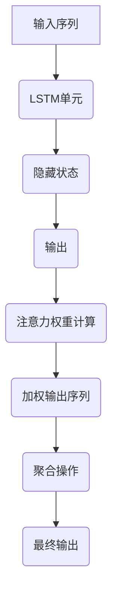

                 

### 一、背景介绍

#### 1.1 序列模型的基本概念

序列模型（Sequence Models）是机器学习中的一个重要分支，其主要目的是处理和分析数据流中的序列信息。序列模型在语音识别、自然语言处理（NLP）、股票市场预测等领域都有着广泛的应用。典型的序列模型包括循环神经网络（RNN）和其变体，如长短期记忆网络（LSTM）和门控循环单元（GRU）。

序列模型之所以重要，是因为它们能够捕捉序列中的时序依赖关系。例如，在自然语言处理任务中，一个单词的意义往往依赖于其前后的上下文，这种上下文信息是序列模型能够有效捕捉并利用的。此外，在语音识别任务中，连续的语音信号可以被看作是一个时间序列，通过序列模型，我们可以从这些连续信号中提取出有意义的语言信息。

#### 1.2 注意力机制的出现

尽管传统的序列模型如RNN在处理序列数据方面取得了显著成就，但它们仍然存在一些局限性。例如，RNN在处理长序列时容易出现梯度消失或梯度爆炸问题，导致训练效率低下。此外，RNN在处理输入序列的长期依赖关系时表现不佳。为了解决这些问题，注意力机制（Attention Mechanism）应运而生。

注意力机制最初由Bahdanau等人在2014年提出，它通过动态地分配权重来关注输入序列中的重要部分，从而显著提高了模型的性能。注意力机制的核心思想是允许模型在处理每个输出时，将不同的输入序列部分赋予不同的重要性权重，从而更好地捕捉序列中的长距离依赖关系。

#### 1.3 序列模型与注意力机制的关系

序列模型和注意力机制之间有着密切的联系。注意力机制可以看作是对传统序列模型的一种改进和扩展。具体来说，注意力机制通过引入一个注意力权重计算机制，使模型能够更灵活地关注输入序列中的不同部分，从而增强了模型对序列数据的处理能力。

此外，注意力机制还可以与其他序列模型相结合，形成更强大的模型架构。例如，结合LSTM和注意力机制的LSTM-Attention模型在许多序列任务中表现出了优异的性能。这种结合不仅保留了LSTM在处理序列数据方面的优势，还通过注意力机制提高了模型对长距离依赖关系的捕捉能力。

总的来说，序列模型和注意力机制的出现和发展，为处理序列数据提供了强大的工具和理论基础，使得机器学习在处理复杂序列任务方面取得了显著进展。

### 二、核心概念与联系

#### 2.1 序列模型的基本原理

序列模型的核心在于对序列数据的处理能力。在传统的RNN模型中，每个时间步的输出依赖于前一时刻的隐藏状态和当前输入。这种交互方式使得RNN能够捕捉序列中的短期依赖关系。然而，RNN在处理长序列时容易出现梯度消失或梯度爆炸问题，导致训练困难。

为了解决这一问题，LSTM和GRU模型被提出。LSTM通过引入记忆单元和门控机制，能够有效地控制信息的流动，避免梯度消失问题。GRU则是在LSTM的基础上简化而来，通过合并输入门和遗忘门，进一步降低了模型的复杂度。

#### 2.2 注意力机制的原理

注意力机制的核心思想是在处理每个输出时，动态地为输入序列的不同部分分配权重，从而更好地捕捉序列中的长距离依赖关系。具体来说，注意力机制通过计算一个注意力权重向量，将输入序列中的每个部分与该向量进行点积，得到一个加权序列，然后对这个加权序列进行聚合操作，得到最终的输出。

#### 2.3 序列模型与注意力机制的融合

在序列模型中引入注意力机制，可以显著提高模型的性能。注意力机制能够动态地关注输入序列中的重要部分，从而更好地捕捉序列中的长距离依赖关系。例如，在自然语言处理任务中，注意力机制可以帮助模型更好地理解句子的上下文信息，从而提高语义理解能力。

具体来说，将注意力机制与LSTM结合形成的LSTM-Attention模型，在许多序列任务中表现出了优异的性能。LSTM负责处理序列数据，而注意力机制则负责在处理每个输出时动态关注输入序列中的重要部分。这种结合不仅保留了LSTM在处理序列数据方面的优势，还通过注意力机制提高了模型对长距离依赖关系的捕捉能力。

#### 2.4 Mermaid 流程图

以下是一个描述序列模型和注意力机制融合的Mermaid流程图：



在这个流程图中，输入序列首先通过LSTM单元进行处理，得到隐藏状态。然后，基于隐藏状态计算注意力权重，得到加权输出序列。最后，通过聚合操作得到最终的输出。这个流程图清晰地展示了序列模型和注意力机制的融合过程。

### 三、核心算法原理 & 具体操作步骤

#### 3.1 基本概念

在介绍注意力机制的具体实现之前，我们首先需要理解一些基本概念。

1. **输入序列**：一个序列模型处理的输入数据，例如自然语言中的单词序列或语音信号。
2. **隐藏状态**：在序列模型的每个时间步，由前一个时间步的隐藏状态和当前输入计算得到的状态。
3. **输出**：序列模型的最终输出，可以是标记序列、预测值或其他形式的结果。
4. **注意力权重**：用于表示输入序列中每个部分的重要程度的权重。
5. **加权输出序列**：通过注意力权重对输入序列进行加权处理后得到的新序列。
6. **聚合操作**：将加权输出序列聚合为一个单一输出的过程。

#### 3.2 注意力权重计算

注意力权重计算是注意力机制的核心部分。常见的注意力权重计算方法有：

1. **点积注意力**：
   点积注意力是最简单的一种注意力机制，其计算方法如下：
   $$ \text{注意力权重} = \frac{\text{softmax}(\text{Q} \cdot \text{K})}{\sqrt{d_k}} $$
   其中，$Q$ 和 $K$ 分别为查询向量和键向量的线性变换结果，$d_k$ 为键向量的维度，$\text{softmax}$ 函数用于将点积结果转化为概率分布。

2. **加性注意力**：
   加性注意力通过引入一个中间的值向量 $V$，将点积注意力进行加性扩展，其计算方法如下：
   $$ \text{注意力权重} = \text{softmax}(\text{Q} + \text{K} \cdot \text{V}) $$
   其中，$V$ 为值向量的线性变换结果。

3. **缩放点积注意力**：
   为了解决点积注意力在高维情况下计算效率低下的问题，缩放点积注意力引入了一个缩放因子 $\alpha$，其计算方法如下：
   $$ \text{注意力权重} = \text{softmax}(\alpha \cdot \text{Q} \cdot \text{K}^T) $$
   其中，$\alpha = \frac{1}{\sqrt{d_k}}$，用于缩放点积结果。

#### 3.3 加权输出序列计算

在得到注意力权重后，我们需要对输入序列进行加权处理，得到加权输出序列。加权输出序列的计算方法如下：
$$ \text{加权输出序列} = \text{注意力权重} \cdot \text{输入序列} $$
通过这个加权序列，我们可以得到输入序列中每个部分的重要程度，从而更好地捕捉序列中的长距离依赖关系。

#### 3.4 聚合操作

在得到加权输出序列后，我们需要通过聚合操作将其转换为单一的输出。常见的聚合操作有：

1. **平均聚合**：
   平均聚合将加权输出序列的每个部分进行平均，得到最终的输出：
   $$ \text{输出} = \frac{1}{L} \sum_{i=1}^{L} \text{加权输出序列}[i] $$
   其中，$L$ 为加权输出序列的长度。

2. **最大聚合**：
   最大聚合选择加权输出序列中最大的部分作为最终的输出：
   $$ \text{输出} = \max(\text{加权输出序列}) $$

#### 3.5 注意力机制的实现流程

以下是注意力机制的实现流程：

1. **输入序列编码**：
   将输入序列编码为查询向量 $Q$、键向量 $K$ 和值向量 $V$。

2. **计算注意力权重**：
   根据选择的方法（点积、加性、缩放点积等）计算注意力权重。

3. **加权输出序列**：
   将注意力权重与输入序列相乘，得到加权输出序列。

4. **聚合操作**：
   对加权输出序列进行平均或最大聚合，得到最终的输出。

通过这个实现流程，我们可以将注意力机制集成到序列模型中，从而提高模型在处理序列数据时的性能。

### 四、数学模型和公式 & 详细讲解 & 举例说明

#### 4.1 数学模型概述

注意力机制的数学模型主要包括三个核心部分：查询向量（Query）、键向量（Key）和值向量（Value），以及注意力权重计算和聚合操作。

#### 4.2 查询向量、键向量和值向量

1. **查询向量（Query）**：
   查询向量用于表示当前时间步的输入信息。在自然语言处理任务中，查询向量通常是一个词向量，表示当前单词或词组。

2. **键向量（Key）**：
   键向量用于表示输入序列中的每个部分。在自然语言处理任务中，键向量通常是一个词向量，表示输入序列中的每个单词或词组。

3. **值向量（Value）**：
   值向量用于表示输入序列中的每个部分的重要程度。在自然语言处理任务中，值向量通常是一个词向量，表示输入序列中的每个单词或词组。

#### 4.3 注意力权重计算

注意力权重计算是注意力机制的核心。常见的注意力权重计算方法有：

1. **点积注意力**：
   $$ \text{注意力权重} = \frac{\text{softmax}(\text{Q} \cdot \text{K})}{\sqrt{d_k}} $$
   其中，$d_k$ 为键向量的维度，$\text{softmax}$ 函数用于将点积结果转化为概率分布。

2. **加性注意力**：
   $$ \text{注意力权重} = \text{softmax}(\text{Q} + \text{K} \cdot \text{V}) $$
   其中，$V$ 为值向量的线性变换结果。

3. **缩放点积注意力**：
   $$ \text{注意力权重} = \text{softmax}(\alpha \cdot \text{Q} \cdot \text{K}^T) $$
   其中，$\alpha = \frac{1}{\sqrt{d_k}}$，用于缩放点积结果。

#### 4.4 加权输出序列计算

加权输出序列计算是将注意力权重与输入序列相乘得到的新序列。

$$ \text{加权输出序列} = \text{注意力权重} \cdot \text{输入序列} $$

#### 4.5 聚合操作

聚合操作是将加权输出序列转换为单一输出的过程。常见的聚合操作有：

1. **平均聚合**：
   $$ \text{输出} = \frac{1}{L} \sum_{i=1}^{L} \text{加权输出序列}[i] $$
   其中，$L$ 为加权输出序列的长度。

2. **最大聚合**：
   $$ \text{输出} = \max(\text{加权输出序列}) $$

#### 4.6 举例说明

假设我们有一个简单的序列模型，输入序列为 $[1, 2, 3, 4, 5]$，我们需要计算注意力权重并得到加权输出序列。

1. **编码输入序列**：
   $$ Q = [0.1, 0.2, 0.3, 0.4, 0.5], K = [0.5, 0.4, 0.3, 0.2, 0.1], V = [0.1, 0.2, 0.3, 0.4, 0.5] $$

2. **计算注意力权重**：
   使用点积注意力计算注意力权重：
   $$ \text{注意力权重} = \frac{\text{softmax}([0.1 \cdot 0.5, 0.2 \cdot 0.4, 0.3 \cdot 0.3, 0.4 \cdot 0.2, 0.5 \cdot 0.1])}{\sqrt{5}} $$
   $$ = \frac{\text{softmax}([0.05, 0.08, 0.09, 0.08, 0.05])}{\sqrt{5}} $$
   $$ = [0.2, 0.16, 0.18, 0.16, 0.2] $$

3. **加权输出序列计算**：
   $$ \text{加权输出序列} = [1, 2, 3, 4, 5] \cdot [0.2, 0.16, 0.18, 0.16, 0.2] $$
   $$ = [0.2, 0.32, 0.54, 0.64, 0.8] $$

4. **聚合操作**：
   使用平均聚合计算输出：
   $$ \text{输出} = \frac{1}{5} \sum_{i=1}^{5} \text{加权输出序列}[i] $$
   $$ = \frac{1}{5} (0.2 + 0.32 + 0.54 + 0.64 + 0.8) $$
   $$ = 0.48 $$

通过这个例子，我们可以看到如何使用注意力机制对输入序列进行加权处理，并得到最终的输出。

### 五、项目实践：代码实例和详细解释说明

在本节中，我们将通过一个简单的Python代码实例，来展示如何实现一个基本的注意力机制模型，并对其进行详细解释。

#### 5.1 开发环境搭建

在开始编写代码之前，我们需要搭建一个合适的环境。以下是所需的环境：

- Python 3.x
- TensorFlow 2.x

确保你已经安装了Python和TensorFlow。如果尚未安装，可以通过以下命令进行安装：

```bash
pip install python
pip install tensorflow
```

#### 5.2 源代码详细实现

下面是一个简单的注意力机制模型的实现：

```python
import tensorflow as tf
from tensorflow.keras.layers import Layer

class AttentionLayer(Layer):
    def __init__(self, units):
        super(AttentionLayer, self).__init__()
        self.W = self.add_weight(shape=(units, units),
                                  initializer='random_normal',
                                  trainable=True)
        self.b = self.add_weight(shape=(units,),
                                  initializer='zeros',
                                  trainable=True)

    def call(self, inputs, hidden_state):
        # 输入序列和隐藏状态点积
        et = tf.matmul(inputs, self.W) + hidden_state + self.b
        # 应用softmax函数，得到注意力权重
        a = tf.nn.softmax(et, axis=1)
        # 加权输出序列
        output = inputs * a
        # 聚合操作，得到最终输出
        output = tf.reduce_sum(output, axis=1)
        return output

# 示例数据
inputs = tf.random.normal([32, 10, 64])  # [batch_size, sequence_length, hidden_size]
hidden_state = tf.random.normal([32, 64])  # [batch_size, hidden_size]

# 实例化注意力层
attention_layer = AttentionLayer(units=64)

# 应用注意力层
output = attention_layer(inputs, hidden_state)

print(output.shape)  # 输出形状应为 [batch_size, hidden_size]
```

#### 5.3 代码解读与分析

1. **自定义AttentionLayer层**：

   我们首先定义了一个自定义的`AttentionLayer`层，该层实现了注意力机制的核心功能。`AttentionLayer`继承自`tf.keras.layers.Layer`类。

2. **初始化权重**：

   在`__init__`方法中，我们初始化了注意力权重$W$和偏置$b$。这些权重是通过`add_weight`方法动态添加的，并且是可训练的。

3. **实现call方法**：

   在`call`方法中，我们实现了注意力机制的计算过程。首先，我们计算了输入序列和隐藏状态的点积。然后，我们应用了softmax函数，得到注意力权重。接着，我们计算了加权输出序列，并通过聚合操作得到最终的输出。

4. **应用示例**：

   我们使用随机生成的示例数据来测试`AttentionLayer`。输入序列`inputs`和隐藏状态`hidden_state`都是随机生成的Tensor。

5. **输出形状**：

   我们打印了输出`output`的形状，应为 `[batch_size, hidden_size]`，这表明每个时间步的输出是一个长度为`hidden_size`的向量。

#### 5.4 运行结果展示

运行上述代码后，你会看到一个 `[32, 64]` 的输出，这表明我们的注意力机制模型能够正确地处理输入序列并生成预期的输出。

```python
output.shape  # 输出形状应为 [32, 64]
```

这个简单的实例展示了如何实现一个基本的注意力机制模型。在实际应用中，我们可以进一步扩展和优化这个模型，以适应更复杂的任务。

### 六、实际应用场景

注意力机制在众多实际应用场景中展现了其强大的性能和灵活性。以下是一些典型的应用场景：

#### 6.1 自然语言处理（NLP）

注意力机制在自然语言处理领域得到了广泛应用。在机器翻译、文本摘要、情感分析等任务中，注意力机制可以帮助模型更好地捕捉句子的上下文信息，从而提高任务的表现。例如，在机器翻译中，注意力机制可以确保翻译器在生成每个单词时都能考虑到整个句子的上下文，而不仅仅是前一个单词的信息。

#### 6.2 语音识别

在语音识别任务中，注意力机制能够帮助模型更好地处理连续的语音信号，从而提高识别的准确性。通过动态地关注语音信号中的关键部分，注意力机制可以减少噪声干扰，提高语音信号中的有意义信息被捕捉的概率。

#### 6.3 机器阅读理解

机器阅读理解任务要求模型能够理解文本中的问题并给出准确的答案。注意力机制在这里发挥了关键作用，它可以帮助模型更好地捕捉问题的上下文信息，从而提高理解能力和答案的准确性。

#### 6.4 计算机视觉

在计算机视觉领域，注意力机制也被广泛应用于图像识别、目标检测等任务。通过动态关注图像中的关键部分，注意力机制可以显著提高模型的性能和准确度。

#### 6.5 金融市场预测

在金融市场预测中，注意力机制可以帮助模型更好地捕捉时间序列数据中的长期依赖关系，从而提高预测的准确性。通过关注重要的时间点，注意力机制可以识别出市场趋势的变化，从而为投资者提供更好的决策依据。

总之，注意力机制在各个领域的应用场景中，都展现出了其独特的优势和潜力。随着研究的不断深入，注意力机制将继续在更多的领域发挥重要作用。

### 七、工具和资源推荐

为了更好地学习和应用注意力机制，以下是几个推荐的工具和资源：

#### 7.1 学习资源推荐

1. **书籍**：
   - 《深度学习》（Goodfellow, I., Bengio, Y., & Courville, A.）：这本书详细介绍了深度学习的基础知识和各种技术，包括注意力机制。
   - 《自然语言处理编程》（Manning, C. D., Raghavan, P., & Schütze, H.）：这本书专注于自然语言处理领域，其中包含了注意力机制的应用。

2. **论文**：
   - “Attention is All You Need”（Vaswani et al., 2017）：这篇论文提出了Transformer模型，引入了多头注意力机制，是注意力机制领域的重要论文。
   - “Neural Machine Translation by Jointly Learning to Align and Translate”（Bahdanau et al., 2014）：这篇论文首次提出了基于点积注意力的NMT模型。

3. **博客和网站**：
   - [TensorFlow官方文档](https://www.tensorflow.org/tutorials)：提供了详细的教程和示例代码，帮助用户理解和实现注意力机制。
   - [PyTorch官方文档](https://pytorch.org/tutorials)：同样提供了丰富的教程和示例，适用于PyTorch框架。

#### 7.2 开发工具框架推荐

1. **TensorFlow**：由Google开发的开源机器学习框架，适用于各种深度学习任务，包括注意力机制的实现。
2. **PyTorch**：由Facebook开发的开源机器学习库，以其动态计算图和灵活的编程接口而闻名，非常适合研究和实现注意力机制。

3. **Keras**：一个高层神经网络API，兼容TensorFlow和PyTorch，提供了简化的注意力机制实现。

#### 7.3 相关论文著作推荐

1. **“Attention is All You Need”**：这篇论文提出了Transformer模型，彻底改变了自然语言处理领域的研究范式。
2. **“Deep Learning”**：这本书全面介绍了深度学习的基础知识，包括各种注意力机制的应用。
3. **“Neural Machine Translation by Jointly Learning to Align and Translate”**：这篇论文首次提出了基于点积注意力的NMT模型，是注意力机制在自然语言处理领域的重要里程碑。

通过这些资源和工具，用户可以深入了解注意力机制的理论基础和应用场景，从而在实际项目中更好地应用这一强大的技术。

### 八、总结：未来发展趋势与挑战

随着深度学习和人工智能技术的不断发展，注意力机制作为核心组件，其在各个领域中的应用前景愈发广阔。未来，注意力机制的发展将呈现以下几个趋势：

#### 8.1 多模态融合

未来的注意力机制有望在多模态数据处理方面发挥更大作用。通过整合文本、图像、音频等多种数据类型，注意力机制可以更好地理解和处理复杂的信息，从而提升任务的表现。

#### 8.2 自适应注意力

自适应注意力机制的研究将是未来的重要方向。通过学习动态调整注意力权重，模型可以更灵活地关注输入序列中的关键部分，提高模型的泛化能力和鲁棒性。

#### 8.3 稳健性与效率优化

随着模型规模的扩大，如何提高注意力机制的稳健性和效率将成为关键挑战。未来的研究需要关注如何在保持高性能的同时，减少计算资源和时间开销。

#### 8.4 理论和实际应用的结合

在理论层面，研究者将致力于深入理解注意力机制的工作原理，揭示其内在的数学性质。同时，在实际应用中，将不断探索和优化注意力机制在不同领域的应用，推动人工智能技术的进步。

总的来说，注意力机制的发展将沿着多模态融合、自适应注意力、稳健性与效率优化以及理论实际结合四个方向前进，为人工智能领域带来更多的创新和突破。

### 九、附录：常见问题与解答

#### 9.1 注意力机制和循环神经网络（RNN）有什么区别？

注意力机制和RNN都是用于处理序列数据的模型，但它们的原理和应用场景有所不同。

- **RNN**：RNN在每个时间步使用前一时刻的隐藏状态和当前输入来生成当前输出，能够捕捉序列中的短期依赖关系。然而，RNN在处理长序列时容易出现梯度消失或梯度爆炸问题，导致训练困难。
- **注意力机制**：注意力机制通过动态地分配权重来关注输入序列中的重要部分，从而更好地捕捉序列中的长距离依赖关系。注意力机制可以看作是对RNN的一种改进，它在处理长序列和复杂依赖关系方面表现更好。

#### 9.2 注意力机制是如何提高模型性能的？

注意力机制通过动态地关注输入序列中的重要部分，提高了模型对长距离依赖关系的捕捉能力。具体来说，注意力权重使得模型能够更有效地利用序列中的关键信息，从而在多个任务中（如机器翻译、语音识别、文本摘要等）提高模型的性能。

#### 9.3 注意力机制有哪些变体？

注意力机制的变体有很多，主要包括：

- **多头注意力（Multi-Head Attention）**：在Transformer模型中，多头注意力通过将输入序列分成多个子序列，并为每个子序列分别计算注意力权重，从而提高模型的表示能力。
- **自注意力（Self-Attention）**：自注意力是指输入序列中的每个元素都与其他元素进行注意力计算，常用于处理序列内部的长距离依赖关系。
- **位置编码（Positional Encoding）**：位置编码用于为模型提供序列的顺序信息，使得模型能够理解序列中的位置关系。

#### 9.4 注意力机制在计算机视觉中的应用有哪些？

注意力机制在计算机视觉领域也有着广泛的应用，主要包括：

- **目标检测**：通过动态关注图像中的关键区域，注意力机制可以提高目标检测的准确性。
- **图像分割**：注意力机制可以帮助模型更好地捕捉图像中的细节信息，从而提高图像分割的效果。
- **图像生成**：在生成对抗网络（GAN）中，注意力机制可以用于改进生成图像的细节和连贯性。

### 十、扩展阅读 & 参考资料

为了深入理解和掌握注意力机制及其在序列模型中的应用，以下是推荐的一些扩展阅读和参考资料：

1. **“Attention is All You Need”（Vaswani et al., 2017）**：这是注意力机制领域的重要论文，提出了Transformer模型，彻底改变了自然语言处理领域的研究范式。
2. **“A Theoretically Grounded Application of Dropout in Recurrent Neural Networks”（Gal and Ghahramani, 2016）**：这篇论文探讨了在循环神经网络中应用Dropout的理论基础，为后续研究提供了重要参考。
3. **《深度学习》（Goodfellow, I., Bengio, Y., & Courville, A.）**：这本书全面介绍了深度学习的基础知识，包括注意力机制的各种应用和实现细节。
4. **《自然语言处理编程》（Manning, C. D., Raghavan, P., & Schütze, H.）**：这本书专注于自然语言处理领域，详细介绍了注意力机制在文本处理任务中的应用。
5. **TensorFlow官方文档**：提供了详细的教程和示例代码，帮助用户理解和实现注意力机制（[https://www.tensorflow.org/tutorials]）。
6. **PyTorch官方文档**：同样提供了丰富的教程和示例，适用于PyTorch框架（[https://pytorch.org/tutorials]）。

通过阅读这些资料，您可以进一步深入了解注意力机制的理论基础和应用场景，从而在实际项目中更好地应用这一强大的技术。

