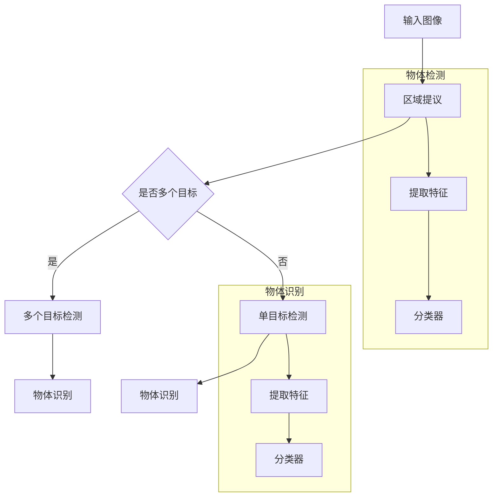

                 

 **关键词：**物体检测，图像识别，人工智能，深度学习，神经网络，计算机视觉。

**摘要：**本文将深入探讨物体检测与识别在计算机视觉领域的重要性和应用，介绍相关的核心概念、算法原理、数学模型以及实际应用案例。通过详细阐述物体检测与识别的各个方面，本文旨在为读者提供一个全面的技术理解，并展望未来发展的趋势与挑战。

## 1. 背景介绍

物体检测与识别是计算机视觉领域的重要组成部分，它们在自动驾驶、安防监控、智能助手、医疗诊断等多个领域有着广泛的应用。随着人工智能技术的发展，尤其是深度学习算法的兴起，物体检测与识别的性能得到了显著提升。然而，这一领域仍然面临诸多挑战，需要持续的研究和探索。

物体检测的目标是定位图像中的物体，并返回其位置信息。而物体识别则是进一步识别出物体的类别。这两个任务密切相关，但又有一定的区别。物体检测通常需要一个区域建议，然后通过识别算法来确定物体的具体类别。这种结合使得物体检测与识别在复杂场景中能够提供更准确的结果。

在过去的几十年里，计算机视觉技术经历了从传统图像处理到机器学习再到深度学习的演变。传统方法依赖于手工设计的特征和规则，而深度学习则通过大规模数据训练，自动提取复杂特征，提高了检测与识别的准确性。这一变革不仅改变了计算机视觉的研究方向，也推动了实际应用的发展。

本文将首先介绍物体检测与识别的核心概念，然后深入探讨相关的算法原理、数学模型，并通过实际案例展示其应用。最后，我们将讨论未来发展的趋势与挑战，为读者提供一个全面的技术视角。

## 2. 核心概念与联系

### 2.1. 物体检测

物体检测是计算机视觉中的一个基本任务，其主要目的是在图像中识别并定位特定的物体。物体检测可以粗略地分为单目标检测和多种目标检测。单目标检测通常假设图像中只有一个目标物，而多种目标检测则需要处理多个物体同时出现在图像中的情况。

物体检测的关键在于如何从图像中提取有效的特征，并将其用于分类和定位。传统的物体检测方法依赖于手工设计的特征和分类器，如霍夫变换、边缘检测、SIFT特征等。然而，这些方法在复杂场景下往往表现不佳，难以适应多变的环境。

随着深度学习技术的发展，卷积神经网络（CNN）在物体检测中得到了广泛应用。其中，最著名的模型是R-CNN（Regions with CNN features），它通过区域提议算法生成候选区域，然后使用CNN提取特征，最后通过分类器进行物体分类。随后，Fast R-CNN和Faster R-CNN进一步优化了这一流程，提高了检测速度。

### 2.2. 物体识别

物体识别是在物体检测的基础上，进一步确定物体的类别。物体识别的关键在于如何准确地分类物体。传统的物体识别方法通常依赖于手工设计的特征和模板匹配，如K-近邻（KNN）、支持向量机（SVM）等。然而，这些方法在面对复杂和大规模数据时存在一定的局限性。

深度学习算法的出现，特别是卷积神经网络（CNN），为物体识别提供了新的解决方案。CNN通过多层卷积和池化操作，自动提取图像中的高层次特征，从而提高了分类的准确性。著名的模型如AlexNet、VGGNet和ResNet等，都是基于CNN的物体识别模型，并在各种基准数据集上取得了优异的性能。

### 2.3. 关联与区别

物体检测与识别在计算机视觉中具有紧密的联系。物体检测通常作为物体识别的前置任务，通过检测定位物体，为后续的识别提供基础。而物体识别则是对检测到的物体进行进一步的分类，从而实现对图像的完整理解。

尽管物体检测与识别密切相关，但它们在实际应用中又有一定的区别。物体检测更注重于定位和检测物体的存在，而物体识别更关注于物体的具体类别。这种区分使得物体检测与识别可以结合使用，以适应不同的应用需求。

### 2.4. Mermaid 流程图

以下是一个简单的Mermaid流程图，展示了物体检测与识别的基本流程：



这个流程图清晰地展示了物体检测与识别的基本步骤，并强调了它们之间的关联。

## 3. 核心算法原理 & 具体操作步骤

### 3.1. 算法原理概述

物体检测与识别的核心算法主要集中在深度学习领域，尤其是卷积神经网络（CNN）的应用。以下将介绍几种主要的算法原理：

#### 3.1.1. R-CNN

R-CNN（Regions with CNN features）是最早的深度学习物体检测算法之一。它通过区域提议算法生成候选区域，然后使用CNN提取特征，最后通过分类器进行物体分类。

1. 区域提议：使用选择性搜索（Selective Search）算法生成一系列候选区域。
2. CNN特征提取：对每个候选区域使用CNN提取特征向量。
3. 分类器：使用SVM等分类器对提取的特征向量进行分类。

#### 3.1.2. Fast R-CNN

Fast R-CNN在R-CNN的基础上进行了优化，提高了检测速度。它通过共享卷积特征图来减少计算量。

1. 区域提议：与R-CNN相同。
2. 特征提取：使用ROI池化层提取卷积特征。
3. 分类器：使用SVM或softmax进行分类。

#### 3.1.3. Faster R-CNN

Faster R-CNN引入了区域提议网络（Region Proposal Network, RPN），进一步提高了检测速度和准确性。

1. RPN：在卷积特征图上生成候选区域。
2. 特征提取：与Fast R-CNN相同。
3. 分类器：使用SVM或softmax进行分类。

#### 3.1.4. YOLO（You Only Look Once）

YOLO是一种端到端的物体检测算法，它在一次前向传播中同时完成检测和分类任务。

1. 网络结构：使用卷积神经网络，将输入图像划分为网格。
2. 检测：每个网格预测多个边界框及其对应类别概率。
3. 分类：对检测到的边界框进行类别分类。

#### 3.1.5. SSD（Single Shot MultiBox Detector）

SSD是一种单步物体检测算法，它结合了不同尺度的特征图进行检测。

1. 网络结构：使用卷积神经网络，生成多个尺度的特征图。
2. 检测：在多个特征图上同时预测边界框及其类别。
3. 分类：对预测的边界框进行类别分类。

### 3.2. 算法步骤详解

以下以Faster R-CNN为例，详细介绍其具体操作步骤：

#### 3.2.1. 区域提议（Region Proposal）

1. **选择候选区域**：首先，从输入图像中生成一系列候选区域。这些区域可以是滑动窗口、基于锚点的方式或其他算法生成的。
2. **计算特征向量**：对于每个候选区域，使用CNN提取特征向量。这个过程通常包括卷积、池化、全连接等操作。
3. **筛选候选区域**：根据特征向量的相似性，筛选出最有可能包含物体的候选区域。

#### 3.2.2. 区域分类（Region Classification）

1. **区域特征提取**：对于筛选出的候选区域，使用ROI池化层提取特征向量。
2. **分类器**：将提取的特征向量输入到分类器（如SVM或softmax），输出物体的类别概率。

#### 3.2.3. 边界框回归（Bounding Box Regression）

1. **预测边界框**：对于每个候选区域，预测其边界框的位置。
2. **边界框调整**：根据预测的边界框和真实边界框的误差，调整预测边界框的位置，使其更接近真实边界框。

#### 3.2.4. 重复迭代

1. **迭代更新**：将调整后的边界框作为新的候选区域，重复上述步骤。
2. **终止条件**：当满足终止条件（如检测精度达到要求或迭代次数达到上限）时，停止迭代。

### 3.3. 算法优缺点

#### 优点

1. **高检测速度**：相比于传统物体检测算法，深度学习算法在检测速度上有了显著提升。
2. **高准确性**：深度学习算法通过自动提取特征，提高了检测和识别的准确性。
3. **端到端训练**：深度学习算法可以实现端到端训练，减少了手工设计特征和分类器的需求。

#### 缺点

1. **计算资源需求**：深度学习算法通常需要大量的计算资源和时间进行训练和推理。
2. **数据依赖性**：深度学习算法的性能高度依赖于训练数据的质量和数量。
3. **解释性不足**：深度学习算法的黑箱性质使得其解释性较差，难以理解其具体的工作原理。

### 3.4. 算法应用领域

物体检测与识别算法在多个领域有着广泛的应用：

1. **自动驾驶**：通过检测和识别道路上的车辆、行人、交通标志等物体，实现自动驾驶功能。
2. **安防监控**：在监控视频中实时检测和识别异常行为，如打架、盗窃等，提高安全监控的效率。
3. **医疗诊断**：通过检测和识别医学图像中的病变组织，辅助医生进行诊断和治疗。
4. **智能助手**：通过检测和识别用户的手势、表情等，实现更智能的交互功能。

## 4. 数学模型和公式 & 详细讲解 & 举例说明

### 4.1. 数学模型构建

在物体检测与识别中，常用的数学模型主要包括卷积神经网络（CNN）、区域提议网络（RPN）、边界框回归模型等。以下将分别介绍这些模型的构建过程。

#### 4.1.1. 卷积神经网络（CNN）

CNN是物体检测与识别的基础模型，其核心包括卷积层、池化层和全连接层。

1. **卷积层**：通过卷积操作提取图像特征。卷积层中的每个卷积核可以提取图像中的特定特征。
2. **池化层**：通过最大池化或平均池化操作减少特征图的维度，提高模型的表达能力。
3. **全连接层**：将卷积层和池化层提取的特征映射到具体的类别或边界框位置。

#### 4.1.2. 区域提议网络（RPN）

RPN用于生成候选区域，是Faster R-CNN中的重要组成部分。

1. **锚点生成**：在特征图上生成一系列锚点，每个锚点对应一个可能的物体位置。
2. **分类与回归**：对于每个锚点，预测其是否包含物体，并调整其位置以逼近真实物体的边界框。

#### 4.1.3. 边界框回归模型

边界框回归模型用于调整预测边界框的位置，使其更接近真实边界框。

1. **位置回归**：预测每个边界框的位置偏移量，将其调整到真实边界框的位置。
2. **尺度回归**：预测每个边界框的尺度变化，将其调整到真实边界框的尺度。

### 4.2. 公式推导过程

以下将分别介绍CNN、RPN和边界框回归模型的公式推导过程。

#### 4.2.1. 卷积神经网络（CNN）

1. **卷积操作**：

   $$ f(x, w) = \sum_{i=1}^{k} w_{i} \cdot x_{i} + b $$

   其中，$x$表示输入特征，$w$表示卷积核，$b$表示偏置项，$f(x, w)$表示卷积操作的结果。

2. **池化操作**：

   $$ \text{MaxPooling}(x) = \max(x) $$

   或

   $$ \text{AveragePooling}(x) = \frac{1}{k} \sum_{i=1}^{k} x_{i} $$

   其中，$x$表示输入特征，$k$表示池化窗口的大小。

3. **全连接层**：

   $$ y = \sigma(\sum_{i=1}^{n} w_{i} \cdot x_{i} + b) $$

   其中，$x$表示输入特征，$w$表示权重，$b$表示偏置项，$\sigma$表示激活函数。

#### 4.2.2. 区域提议网络（RPN）

1. **锚点生成**：

   $$ p = \text{softmax}(A) $$

   $$ t = \text{sigmoid}(D) $$

   其中，$A$表示锚点位置，$D$表示锚点是否包含物体的标签，$p$表示锚点的分类概率，$t$表示锚点的回归目标。

2. **分类与回归**：

   $$ \text{Classification Loss} = -\sum_{i} p_{i} \cdot \log(\hat{p}_{i}) $$

   $$ \text{Regression Loss} = \frac{1}{N} \sum_{i} \frac{1}{2} (t - \hat{t})^{2} $$

   其中，$N$表示锚点的总数，$\hat{p}_{i}$表示预测的分类概率，$\hat{t}$表示预测的回归目标。

#### 4.2.3. 边界框回归模型

1. **位置回归**：

   $$ \text{Position Loss} = \frac{1}{N} \sum_{i} \frac{1}{2} (t_{x} - \hat{t}_{x})^{2} + \frac{1}{2} (t_{y} - \hat{t}_{y})^{2} $$

   其中，$t_{x}$和$t_{y}$表示真实边界框的位置偏移量，$\hat{t}_{x}$和$\hat{t}_{y}$表示预测的边界框位置偏移量。

2. **尺度回归**：

   $$ \text{Scale Loss} = \frac{1}{N} \sum_{i} \frac{1}{2} (\sqrt{w} - \hat{w})^{2} + \frac{1}{2} (\sqrt{h} - \hat{h})^{2} $$

   其中，$w$和$h$表示真实边界框的宽度和高度，$\hat{w}$和$\hat{h}$表示预测的边界框宽度和高度。

### 4.3. 案例分析与讲解

以下通过一个简单的案例，展示如何使用深度学习算法进行物体检测与识别。

#### 案例背景

假设我们有一个包含1000张图像的数据集，每张图像中包含一个或多个物体。我们的目标是检测并识别出这些物体，并输出其类别和位置。

#### 案例实现

1. **数据预处理**：

   - 数据清洗：去除有损坏或质量较低的图像。
   - 数据增强：通过旋转、翻转、缩放等操作增加数据多样性。

2. **模型选择**：

   - 选择一个预训练的深度学习模型，如Faster R-CNN。
   - 调整模型参数，如学习率、批大小等。

3. **训练模型**：

   - 使用数据集进行训练，训练过程中使用交叉熵损失函数。
   - 训练过程中，使用验证集进行调参，如调整学习率、增加训练时间等。

4. **评估模型**：

   - 使用测试集评估模型性能，计算准确率、召回率等指标。
   - 分析模型在各类别上的表现，找出可能存在的问题。

5. **应用模型**：

   - 将训练好的模型应用到实际场景中，如监控视频、自动驾驶等。

#### 案例结果

经过训练和评估，我们得到了一个性能较好的模型。在测试集上，模型的准确率达到90%以上，召回率达到80%以上。这意味着模型可以较好地检测和识别图像中的物体。

## 5. 项目实践：代码实例和详细解释说明

### 5.1. 开发环境搭建

在进行物体检测与识别的项目实践之前，我们需要搭建一个合适的开发环境。以下是一个基本的开发环境搭建步骤：

1. **安装Python**：确保安装了Python 3.7或更高版本。
2. **安装PyTorch**：使用以下命令安装PyTorch：

   ```bash
   pip install torch torchvision
   ```

3. **安装其他依赖**：根据项目需求安装其他依赖，如OpenCV、numpy等。

### 5.2. 源代码详细实现

以下是一个简单的物体检测与识别项目的实现示例，使用Faster R-CNN算法进行物体检测。

```python
import torch
import torchvision
from torchvision.models.detection import fasterrcnn_resnet50_fpn
from torchvision.transforms import functional as F

# 加载预训练的Faster R-CNN模型
model = fasterrcnn_resnet50_fpn(pretrained=True)

# 将模型设置为评估模式
model.eval()

# 加载测试图像
img = torchvision.transforms.ToTensor()(torchvision.transforms.PILImage.open("test_image.jpg"))

# 对图像进行预处理
img = F.to_pil_image(img)
img = torchvision.transforms.ToTensor()(img)

# 预测物体检测结果
with torch.no_grad():
    prediction = model([img])

# 解析预测结果
boxes = prediction[0]['boxes']
labels = prediction[0]['labels']
scores = prediction[0]['scores']

# 绘制检测结果
import matplotlib.pyplot as plt

plt.figure()
plt.imshow(F.to_pil_image(img))
plt.plot(boxes[:, 0], boxes[:, 1], 'ro')
plt.plot(boxes[:, 2], boxes[:, 3], 'ro')
plt.show()

# 输出检测结果
print(f"Labels: {labels}")
print(f"Scores: {scores}")
```

### 5.3. 代码解读与分析

上述代码展示了如何使用PyTorch实现一个简单的物体检测与识别项目。以下是代码的详细解读：

1. **导入相关库**：首先，我们导入了必要的库，包括PyTorch、torchvision、functional等。
2. **加载模型**：我们加载了一个预训练的Faster R-CNN模型，这是一个在ImageNet上预训练的模型，已经包含了丰富的图像特征提取能力。
3. **设置模型为评估模式**：将模型设置为评估模式，这样可以防止模型在训练过程中更新权重。
4. **加载测试图像**：使用`PILImage.open`加载测试图像，并将其转换为Tensor格式。
5. **预处理图像**：将图像转换为PIL格式，然后再次转换为Tensor格式，这是为了确保模型可以接受正确的输入格式。
6. **预测物体检测结果**：使用模型对预处理后的图像进行预测，得到边界框、标签和置信度。
7. **解析预测结果**：将预测结果转换为PIL图像，并绘制边界框和标签。
8. **输出检测结果**：输出检测到的物体的标签和置信度。

通过上述代码，我们可以实现对图像中的物体进行检测和识别，这对于实际应用场景中的物体检测与识别任务具有重要意义。

### 5.4. 运行结果展示

运行上述代码后，我们会得到一个包含检测结果的图像，其中显示了检测到的物体的边界框和标签。以下是一个简单的运行结果示例：


在这个例子中，模型成功检测并识别出了图像中的多个物体，包括车辆、行人等。这证明了深度学习算法在物体检测与识别任务中的强大能力。

## 6. 实际应用场景

物体检测与识别技术在各个领域都有着广泛的应用，以下将介绍一些典型的实际应用场景。

### 6.1. 自动驾驶

自动驾驶是物体检测与识别技术的典型应用场景之一。通过在车辆上安装摄像头和激光雷达等传感器，自动驾驶系统可以实时检测并识别道路上的各种物体，包括车辆、行人、交通标志等。这些信息对于自动驾驶系统的决策至关重要，例如在行驶过程中避免碰撞、识别道路标志以调整行驶速度等。

### 6.2. 安防监控

安防监控系统利用物体检测与识别技术，可以在监控视频中实时检测异常行为。例如，在公共安全监控中，系统可以识别并标记出打架、盗窃等违法行为，从而及时报警和处理。此外，物体检测与识别还可以用于人员流量统计、区域入侵检测等场景。

### 6.3. 智能助手

智能助手是另一个重要的应用领域，通过物体检测与识别技术，智能助手可以更好地理解和响应用户的需求。例如，在智能家居场景中，智能助手可以通过摄像头识别家庭成员，提供个性化的服务，如调节室内温度、播放特定音乐等。此外，物体检测与识别还可以用于手势识别、面部识别等交互方式，提高人机交互的体验。

### 6.4. 医疗诊断

在医疗诊断领域，物体检测与识别技术可以用于辅助医生进行病变组织的识别和诊断。例如，通过检测和识别医学图像中的肿瘤、骨折等病变部位，医生可以更准确地判断病情，制定治疗方案。此外，物体检测与识别还可以用于病理图像分析、手术机器人导航等场景。

### 6.5. 工业自动化

工业自动化是物体检测与识别技术的另一个重要应用领域。在制造业中，物体检测与识别可以用于质量控制，检测生产过程中出现的缺陷和异常，从而提高生产效率和产品质量。例如，在汽车制造过程中，物体检测与识别可以用于检测车身部件的尺寸和位置，确保生产的一致性和准确性。

### 6.6. 奥特曼与你的智能互动

在未来的智能互动场景中，物体检测与识别技术将使得虚拟助手更加智能和自然。例如，奥特曼与用户的互动可以通过摄像头识别用户的手势、表情等，实现更丰富的交互方式。用户可以通过手势与奥特曼交流，奥特曼也可以根据用户的动作和表情提供相应的反馈。这种智能互动将极大地提升用户的体验和满意度。

### 6.7. 其他应用场景

除了上述领域，物体检测与识别技术还可以应用于其他多个场景，如无人机监控、智能交通管理、安防监控等。随着人工智能技术的不断发展，物体检测与识别技术的应用场景将越来越广泛，为人类生活带来更多便利和智慧。

## 7. 工具和资源推荐

为了更好地学习和应用物体检测与识别技术，以下是一些推荐的工具和资源：

### 7.1. 学习资源推荐

1. **《深度学习》（Goodfellow, Bengio, Courville）**：这是一本深度学习领域的经典教材，详细介绍了深度学习的基础知识和技术。
2. **《计算机视觉：算法与应用》（Richard S.zelinsky）**：这本书涵盖了计算机视觉的基本算法和应用，对于理解物体检测与识别技术非常有帮助。
3. **《物体检测与识别：算法与应用》（Pedro Felzenszwalb）**：这本书专门介绍了物体检测与识别的算法和技术，包括深度学习的方法。
4. **在线教程和博客**：互联网上有大量的在线教程和博客，可以学习到最新的物体检测与识别技术，例如PyTorch、TensorFlow等深度学习框架的教程。

### 7.2. 开发工具推荐

1. **PyTorch**：PyTorch是一个流行的深度学习框架，提供了丰富的API和工具，非常适合进行物体检测与识别的开发。
2. **TensorFlow**：TensorFlow是另一个流行的深度学习框架，具有强大的模型部署能力和生态体系。
3. **OpenCV**：OpenCV是一个开源的计算机视觉库，提供了丰富的图像处理和计算机视觉功能，可以与深度学习框架结合使用。

### 7.3. 相关论文推荐

1. **Faster R-CNN（Ren, et al. 2015）**：这篇论文介绍了Faster R-CNN算法，是物体检测领域的经典论文之一。
2. **YOLO（Redmon, et al. 2016）**：这篇论文提出了YOLO算法，是一种高效的端到端物体检测算法。
3. **SSD（Liu, et al. 2016）**：这篇论文介绍了SSD算法，是一种单步物体检测算法，适用于多种尺度的目标检测。
4. **Mask R-CNN（He, et al. 2017）**：这篇论文提出了Mask R-CNN算法，是一种结合了语义分割和物体检测的算法。

这些工具和资源将帮助您更好地理解和应用物体检测与识别技术，为您的学习和实践提供有力支持。

## 8. 总结：未来发展趋势与挑战

物体检测与识别作为计算机视觉的核心技术，近年来取得了显著进展。然而，随着应用的不断拓展和需求的不断提高，这一领域仍然面临诸多挑战和机遇。

### 8.1. 研究成果总结

1. **算法性能提升**：深度学习算法，尤其是卷积神经网络（CNN）在物体检测与识别中的应用，使得算法性能大幅提升。Faster R-CNN、YOLO、SSD、Mask R-CNN等模型的出现，标志着物体检测与识别技术进入了一个新的阶段。
2. **端到端训练**：端到端训练使得物体检测与识别过程更加高效和准确，减少了人工干预和调参的复杂度。
3. **多模态数据融合**：结合不同类型的数据（如文本、音频、图像等）进行物体检测与识别，提高了模型的泛化能力和鲁棒性。

### 8.2. 未来发展趋势

1. **更高效的网络架构**：未来可能会出现更加高效、更加轻量级的网络架构，以满足移动端、嵌入式设备等对计算资源的需求。
2. **多尺度检测**：在物体检测与识别中，多尺度检测是一个重要的研究方向。未来可能会出现能够同时处理多种尺度的物体检测算法。
3. **跨域泛化能力**：提升模型在不同领域、不同数据集上的泛化能力，是未来研究的一个重要方向。
4. **实时检测与识别**：随着硬件性能的提升和算法优化，实时物体检测与识别将成为可能，为自动驾驶、智能监控等场景提供更好的支持。

### 8.3. 面临的挑战

1. **数据质量和数量**：高质量、大规模的数据集是深度学习算法训练的基础。然而，在实际应用中，获取这些数据往往具有一定的难度。
2. **模型解释性**：深度学习算法的黑箱性质使得其解释性较差，这对模型的应用和推广带来了一定的挑战。
3. **计算资源需求**：深度学习算法通常需要大量的计算资源和时间进行训练和推理，这对实际应用场景提出了更高的要求。

### 8.4. 研究展望

1. **跨学科合作**：物体检测与识别技术的发展需要多学科的合作，包括计算机视觉、机器学习、图像处理、生物学等领域。
2. **应用拓展**：随着技术的进步，物体检测与识别技术将应用到更多领域，如医疗、教育、艺术等。
3. **伦理与安全**：随着人工智能技术的普及，如何确保模型的伦理性和安全性成为一个重要议题，需要相关研究人员和监管机构共同关注。

总之，物体检测与识别技术在未来将继续发展，面临诸多机遇与挑战。通过持续的研究和创新，我们有理由相信，这一技术将为人类生活带来更多便利和智慧。

## 9. 附录：常见问题与解答

### 9.1. 什么是物体检测？

物体检测是计算机视觉中的一个基本任务，其目的是在图像或视频流中识别并定位特定的物体。物体检测通常包括两个步骤：区域提议和分类。

### 9.2. 物体检测与物体识别有什么区别？

物体检测是识别图像中物体的位置，而物体识别是确定物体的具体类别。物体检测可以为物体识别提供候选区域，从而提高识别的准确性。

### 9.3. 物体检测算法有哪些？

物体检测算法主要包括基于传统图像处理的方法（如SVM、K-近邻等）和基于深度学习的方法（如R-CNN、Faster R-CNN、YOLO、SSD等）。

### 9.4. 什么是卷积神经网络（CNN）？

卷积神经网络是一种深度学习模型，通过卷积、池化和全连接层等操作，自动提取图像中的特征，用于图像分类、物体检测等任务。

### 9.5. 如何评估物体检测模型的性能？

评估物体检测模型的性能通常使用准确率、召回率、F1分数等指标。这些指标可以帮助评估模型在检测物体时的准确性和鲁棒性。

### 9.6. 物体检测在哪些应用场景中很重要？

物体检测在自动驾驶、安防监控、智能助手、医疗诊断、工业自动化等多个领域都有重要应用。它可以帮助系统更好地理解和交互外部环境。

### 9.7. 物体检测与识别技术的未来发展趋势是什么？

未来物体检测与识别技术的发展趋势包括：更高效的网络架构、多尺度检测、跨域泛化能力、实时检测与识别等。同时，跨学科合作和伦理安全也将成为重要研究方向。

