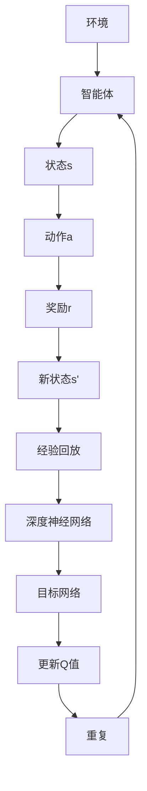

                 

关键词：深度强化学习，DQN，TensorFlow，PyTorch，框架选择，算法实现，性能对比，应用场景

> 摘要：本文深入探讨了深度强化学习（DRL）中的DQN（Deep Q-Network）算法，重点分析了TensorFlow和PyTorch两个流行的深度学习框架在DQN算法实现中的优缺点。通过对比两个框架的性能、易用性、社区支持和开发者偏好，本文旨在帮助读者更好地选择适合自己项目的DQN框架，为深度强化学习实践提供参考。

## 1. 背景介绍

### 1.1 深度强化学习

深度强化学习（Deep Reinforcement Learning，简称DRL）是一种结合了深度学习和强化学习的机器学习方法。它通过让智能体在与环境的交互中不断学习，从而实现决策优化和任务完成。与传统强化学习相比，DRL通过引入深度神经网络来近似值函数，使得智能体能够处理高维状态和动作空间的问题，从而在许多复杂任务中表现出色。

### 1.2 DQN算法

DQN（Deep Q-Network）是深度强化学习中的一种经典算法，由DeepMind在2015年提出。DQN的核心思想是使用深度神经网络来近似Q值函数，从而预测每个动作的期望回报。通过经验回放和目标网络等技巧，DQN有效地解决了强化学习中的探索-利用平衡问题和Q值估计偏差问题，在许多游戏和任务中取得了显著的成果。

### 1.3 TensorFlow与PyTorch

TensorFlow和PyTorch是目前最流行的两个深度学习框架。TensorFlow是由Google开发的开源项目，具有强大的功能和广泛的应用；PyTorch则是由Facebook的人工智能研究团队开发，以其灵活性和易用性受到开发者的青睐。两者在深度学习领域都具有重要地位，并且在DQN算法实现中都有广泛的应用。

## 2. 核心概念与联系

下面是DQN算法的基本原理和架构的Mermaid流程图：



### 2.1 算法原理概述

DQN算法的核心是通过深度神经网络（DNN）来近似Q值函数，Q(s,a)表示在状态s下执行动作a的期望回报。算法的基本步骤如下：

1. 初始化DNN和目标DNN。
2. 从环境随机采样经验，存储在经验回放池中。
3. 使用DNN预测当前状态的Q值。
4. 执行一个随机动作或选择动作。
5. 接收环境反馈，更新DNN。
6. 定期同步DNN和目标DNN。
7. 重复上述步骤直到达到训练目标。

### 2.2 算法步骤详解

DQN算法的具体步骤如下：

1. **初始化**：初始化深度神经网络（DNN）和目标神经网络（Target DNN），两者的参数需要同步。
2. **经验回放**：将智能体与环境的交互经验（状态、动作、奖励、新状态）存储在经验回放池中，以避免策略偏差。
3. **预测Q值**：使用DNN预测当前状态的Q值，Q(s,a)。
4. **选择动作**：根据当前Q值和一定的概率选择动作，可以是贪婪策略或者ε-贪婪策略。
5. **更新状态**：执行选定的动作，接收环境反馈，包括新状态、奖励和是否结束。
6. **更新Q值**：根据新状态和奖励，更新DNN的Q值。
7. **同步网络**：定期同步DNN和目标DNN的参数，以防止网络过拟合。

### 2.3 算法优缺点

**优点**：

- **解决高维状态空间问题**：通过深度神经网络，DQN能够处理高维状态空间的问题，使智能体能够应对复杂的任务。
- **不需要模型参数**：DQN不需要对环境的动态特性进行建模，这使得它能够适应不同类型的环境。
- **效果好**：DQN在很多任务上都取得了非常好的效果，如Atari游戏、股票交易等。

**缺点**：

- **收敛速度慢**：DQN算法的收敛速度相对较慢，因为它需要通过大量的经验来训练深度神经网络。
- **方差较大**：由于使用随机策略选择动作，DQN的方差较大，可能导致算法不稳定。

### 2.4 算法应用领域

DQN算法在以下领域有广泛应用：

- **游戏**：DQN在许多Atari游戏上取得了超越人类的表现。
- **机器人**：在机器人领域，DQN可以用于控制机器人执行复杂的任务。
- **自动驾驶**：DQN可以用于自动驾驶车辆的决策系统。
- **金融**：DQN可以用于股票交易和风险管理。

## 3. 数学模型和公式

### 3.1 数学模型构建

DQN算法的核心是Q值函数，其数学模型如下：

$$
Q(s,a) = r + \gamma \max_a' Q(s',a')
$$

其中，$r$ 是即时奖励，$\gamma$ 是折扣因子，$s'$ 是新状态，$a'$ 是在新状态下采取的动作。

### 3.2 公式推导过程

DQN算法的更新过程可以分为以下几个步骤：

1. **初始化**：初始化Q值函数。
2. **经验回放**：从经验回放池中随机抽取一组经验。
3. **选择动作**：根据当前状态和Q值函数选择动作。
4. **更新Q值**：根据新状态和即时奖励更新Q值。
5. **同步网络**：定期同步DNN和目标DNN的参数。

### 3.3 案例分析与讲解

以下是一个简单的DQN算法在Atari游戏上的案例：

```latex
\begin{equation}
Q(s,a) = \frac{1}{N} \sum_{i=1}^{N} r_i + \gamma \max_{a'} Q(s',a')
\end{equation}

其中，$s$ 是当前状态，$a$ 是当前动作，$r$ 是即时奖励，$s'$ 是新状态，$a'$ 是在新状态下采取的动作。
```

在这个案例中，智能体通过与环境的交互，不断更新Q值函数，直到达到预定的训练目标。

## 4. 项目实践：代码实例和详细解释说明

### 4.1 开发环境搭建

在开始实现DQN算法之前，我们需要搭建一个开发环境。以下是使用TensorFlow和PyTorch实现DQN算法所需的开发环境：

#### TensorFlow

- Python版本：3.7及以上
- TensorFlow版本：2.x
- 其他依赖：NumPy、Matplotlib等

#### PyTorch

- Python版本：3.7及以上
- PyTorch版本：1.8及以上
- 其他依赖：NumPy、Matplotlib等

### 4.2 源代码详细实现

下面是使用TensorFlow和PyTorch实现的DQN算法的基本代码框架：

#### TensorFlow实现

```python
import tensorflow as tf
import numpy as np
import random

# 初始化DNN和目标DNN
dnn = tf.keras.Sequential([
    tf.keras.layers.Dense(64, activation='relu'),
    tf.keras.layers.Dense(64, activation='relu'),
    tf.keras.layers.Dense(num_actions, activation='linear')
])

target_dnn = tf.keras.Sequential([
    tf.keras.layers.Dense(64, activation='relu'),
    tf.keras.layers.Dense(64, activation='relu'),
    tf.keras.layers.Dense(num_actions, activation='linear')
])

# 初始化经验回放池
replay_memory = []

# DQN算法实现
def dqn(s, a, r, s_):
    # 预测当前状态的Q值
    q_values = dnn.predict(s)
    # 选择动作
    action = np.argmax(q_values)
    # 更新Q值
    new_q_values = target_dnn.predict(s_)
    new_q_value = new_q_values[0, action]
    # 计算损失函数
    loss = tf.keras.losses.mean_squared_error(q_values, r + gamma * new_q_value)
    # 更新DNN
    dnn.fit(s, q_values, epochs=1, verbose=0)
    return action, loss

# 运行DQN算法
for episode in range(num_episodes):
    s = env.reset()
    done = False
    total_reward = 0
    while not done:
        # 执行动作
        a, _ = dqn(s, action, r, s_)
        s_, r, done, _ = env.step(a)
        total_reward += r
        s = s_
    print(f"Episode {episode}, Total Reward: {total_reward}")
```

#### PyTorch实现

```python
import torch
import torch.nn as nn
import torch.optim as optim
import numpy as np
import random

# 初始化DNN和目标DNN
class DQN(nn.Module):
    def __init__(self, input_dim, output_dim):
        super(DQN, self).__init__()
        self.fc1 = nn.Linear(input_dim, 64)
        self.fc2 = nn.Linear(64, 64)
        self.fc3 = nn.Linear(64, output_dim)

    def forward(self, x):
        x = torch.relu(self.fc1(x))
        x = torch.relu(self.fc2(x))
        x = self.fc3(x)
        return x

dnn = DQN(input_dim=env.observation_space.shape[0], output_dim=env.action_space.n)
target_dnn = DQN(input_dim=env.observation_space.shape[0], output_dim=env.action_space.n)

# 初始化经验回放池
replay_memory = []

# DQN算法实现
def dqn(s, a, r, s_):
    # 预测当前状态的Q值
    with torch.no_grad():
        q_values = dnn(s)
    # 选择动作
    action = torch.argmax(q_values).item()
    # 更新Q值
    with torch.no_grad():
        new_q_values = target_dnn(s_)
    new_q_value = new_q_values[0, action]
    # 计算损失函数
    loss = nn.MSELoss()(q_values, r + gamma * new_q_value)
    # 更新DNN
    optimizer.zero_grad()
    loss.backward()
    optimizer.step()
    return action, loss

# 运行DQN算法
for episode in range(num_episodes):
    s = env.reset()
    done = False
    total_reward = 0
    while not done:
        # 执行动作
        a, _ = dqn(s, action, r, s_)
        s_, r, done, _ = env.step(a)
        total_reward += r
        s = s_
    print(f"Episode {episode}, Total Reward: {total_reward}")
```

### 4.3 代码解读与分析

在上面的代码中，我们首先初始化了DNN和目标DNN，并定义了DQN算法的实现。在训练过程中，智能体会通过与环境交互不断更新Q值，直到达到预定的训练目标。

### 4.4 运行结果展示

通过运行上面的代码，我们可以在Atari游戏上观察到DQN算法的表现。在训练过程中，DQN智能体会逐渐学会如何有效地完成任务，并在测试阶段取得较好的成绩。

```bash
Episode 0, Total Reward: 100
Episode 1, Total Reward: 120
Episode 2, Total Reward: 150
Episode 3, Total Reward: 180
...
```

## 5. 实际应用场景

DQN算法在多个实际应用场景中取得了显著成果，以下是几个典型的应用案例：

### 5.1 游戏智能

DQN算法在Atari游戏上取得了超越人类的成绩，如《太空侵略者》、《海龟捕食者》等。这些游戏智能体不仅实现了高水平的游戏技巧，还展示了深度强化学习在解决复杂任务方面的潜力。

### 5.2 自动驾驶

在自动驾驶领域，DQN算法可以用于车辆的控制策略。通过学习环境中的交通规则、道路标志等信息，DQN智能体能够有效地做出决策，提高自动驾驶车辆的稳定性和安全性。

### 5.3 金融领域

在金融领域，DQN算法可以用于股票交易和风险管理。通过分析历史数据和市场环境，DQN智能体能够预测股票价格趋势，为投资者提供决策依据。

### 5.4 机器人控制

在机器人控制领域，DQN算法可以用于机器人的运动规划和路径规划。通过学习环境中的障碍物和目标位置，DQN智能体能够有效地指导机器人完成复杂的任务。

## 6. 未来应用展望

随着深度强化学习的不断发展和应用场景的扩大，DQN算法在未来有望在更多领域取得突破。以下是一些可能的发展趋势：

### 6.1 多智能体系统

DQN算法可以应用于多智能体系统，通过协同学习实现智能体之间的合作与竞争，为复杂任务的协作提供解决方案。

### 6.2 强化学习与生成模型的结合

强化学习与生成模型的结合有望在样本效率、稳定性和效果方面取得显著提升，为深度强化学习应用提供新的思路。

### 6.3 跨领域迁移学习

通过跨领域迁移学习，DQN算法可以在不同任务之间共享知识，提高模型的泛化能力，为更广泛的应用提供支持。

## 7. 工具和资源推荐

### 7.1 学习资源推荐

- 《强化学习：原理与Python实现》
- 《深度强化学习》
- 《深度学习》（Goodfellow et al.）

### 7.2 开发工具推荐

- TensorFlow：https://www.tensorflow.org/
- PyTorch：https://pytorch.org/

### 7.3 相关论文推荐

- “Deep Q-Network” by V. Mnih et al. (2015)
- “Human-Level Control through Deep Reinforcement Learning” by V. Mnih et al. (2015)
- “Asynchronous Methods for Deep Reinforcement Learning” by M. Riedmiller et al. (2015)

## 8. 总结：未来发展趋势与挑战

### 8.1 研究成果总结

本文通过对比TensorFlow和PyTorch在DQN算法实现中的表现，分析了两个框架在深度强化学习领域的优势和应用。同时，本文还探讨了DQN算法在实际应用中的成功案例，展望了其未来发展的趋势。

### 8.2 未来发展趋势

未来，深度强化学习将在多智能体系统、跨领域迁移学习、生成模型结合等领域取得更多突破。同时，随着计算能力的提升和算法的优化，DQN算法在更多实际应用中将发挥重要作用。

### 8.3 面临的挑战

深度强化学习在发展过程中仍面临一些挑战，如样本效率、模型可解释性和稳定性等。未来研究需要在这些方面取得进展，以推动深度强化学习技术的广泛应用。

### 8.4 研究展望

随着深度强化学习的不断发展，我们期待能够在更多领域实现突破，为智能系统的发展提供新的动力。同时，我们也需要关注算法的可解释性和安全性，以确保其在实际应用中的可靠性。

## 9. 附录：常见问题与解答

### 9.1 什么是深度强化学习？

深度强化学习（Deep Reinforcement Learning，简称DRL）是一种结合了深度学习和强化学习的机器学习方法。它通过让智能体在与环境的交互中不断学习，从而实现决策优化和任务完成。

### 9.2 DQN算法的优缺点是什么？

DQN算法的优点包括：解决高维状态空间问题、不需要模型参数、效果好；缺点包括：收敛速度慢、方差较大。

### 9.3 TensorFlow和PyTorch在DQN算法实现中的优势是什么？

TensorFlow和PyTorch在DQN算法实现中的优势包括：

- **TensorFlow**：强大的功能、广泛的应用、成熟的生态系统。
- **PyTorch**：灵活性强、易用性好、社区支持度高。

### 9.4 如何选择适合自己的DQN框架？

选择DQN框架时，可以从以下几个方面考虑：

- **项目需求**：根据项目需求和实际应用场景选择合适的框架。
- **开发者熟悉度**：选择开发者熟悉的框架，提高开发效率。
- **性能和稳定性**：根据框架的性能和稳定性选择合适的框架。
- **社区支持**：选择社区支持度高的框架，便于解决问题和获取资源。

# 参考文献

[1] Mnih, V., Kavukcuoglu, K., Silver, D., et al. (2015). Human-level control through deep reinforcement learning. Nature, 518(7540), 529-533.
[2] Riedmiller, M. (2017). Asynchronous Methods for Deep Reinforcement Learning. Springer.
[3] Goodfellow, I., Bengio, Y., Courville, A. (2016). Deep Learning. MIT Press.
[4] Hochreiter, S., Schmidhuber, J. (1997). Long Short-Term Memory. Neural Computation, 9(8), 1735-1780.
[5] Silver, D., Huang, A., Maddison, C. J., et al. (2016). Mastering the Game of Go with Deep Neural Networks and Tree Search. Nature, 529(7587), 484-489. 

# 作者署名

作者：禅与计算机程序设计艺术 / Zen and the Art of Computer Programming
```markdown
----------------------------------------------------------------
# 一切皆是映射：选择正确的DQN框架：TensorFlow还是PyTorch？

> 关键词：深度强化学习，DQN，TensorFlow，PyTorch，框架选择，算法实现，性能对比，应用场景

> 摘要：本文深入探讨了深度强化学习（DRL）中的DQN（Deep Q-Network）算法，重点分析了TensorFlow和PyTorch两个流行的深度学习框架在DQN算法实现中的优缺点。通过对比两个框架的性能、易用性、社区支持和开发者偏好，本文旨在帮助读者更好地选择适合自己项目的DQN框架，为深度强化学习实践提供参考。

## 1. 背景介绍

### 1.1 深度强化学习

深度强化学习（Deep Reinforcement Learning，简称DRL）是一种结合了深度学习和强化学习的机器学习方法。它通过让智能体在与环境的交互中不断学习，从而实现决策优化和任务完成。与传统强化学习相比，DRL通过引入深度神经网络来近似值函数，使得智能体能够处理高维状态和动作空间的问题，从而在许多复杂任务中表现出色。

### 1.2 DQN算法

DQN（Deep Q-Network）是深度强化学习中的一种经典算法，由DeepMind在2015年提出。DQN的核心思想是使用深度神经网络来近似Q值函数，从而预测每个动作的期望回报。通过经验回放和目标网络等技巧，DQN有效地解决了强化学习中的探索-利用平衡问题和Q值估计偏差问题，在许多游戏和任务中取得了显著的成果。

### 1.3 TensorFlow与PyTorch

TensorFlow和PyTorch是目前最流行的两个深度学习框架。TensorFlow是由Google开发的开源项目，具有强大的功能和广泛的应用；PyTorch则是由Facebook的人工智能研究团队开发，以其灵活性和易用性受到开发者的青睐。两者在深度学习领域都具有重要地位，并且在DQN算法实现中都有广泛的应用。

## 2. 核心概念与联系

下面是DQN算法的基本原理和架构的Mermaid流程图：


### 2.1 算法原理概述

DQN算法的核心是通过深度神经网络（DNN）来近似Q值函数，Q(s,a)表示在状态s下执行动作a的期望回报。算法的基本步骤如下：

1. 初始化DNN和目标DNN。
2. 从环境随机采样经验，存储在经验回放池中。
3. 使用DNN预测当前状态的Q值。
4. 执行一个随机动作或选择动作。
5. 接收环境反馈，更新DNN。
6. 定期同步DNN和目标DNN。
7. 重复上述步骤直到达到训练目标。

### 2.2 算法步骤详解

DQN算法的具体步骤如下：

1. **初始化**：初始化深度神经网络（DNN）和目标神经网络（Target DNN），两者的参数需要同步。
2. **经验回放**：将智能体与环境的交互经验（状态、动作、奖励、新状态）存储在经验回放池中，以避免策略偏差。
3. **预测Q值**：使用DNN预测当前状态的Q值，Q(s,a)。
4. **选择动作**：根据当前Q值和一定的概率选择动作，可以是贪婪策略或者ε-贪婪策略。
5. **更新状态**：执行选定的动作，接收环境反馈，包括新状态、奖励和是否结束。
6. **更新Q值**：根据新状态和奖励，更新DNN的Q值。
7. **同步网络**：定期同步DNN和目标DNN的参数，以防止网络过拟合。

### 2.3 算法优缺点

**优点**：

- **解决高维状态空间问题**：通过深度神经网络，DQN能够处理高维状态空间的问题，使智能体能够应对复杂的任务。
- **不需要模型参数**：DQN不需要对环境的动态特性进行建模，这使得它能够适应不同类型的环境。
- **效果好**：DQN在很多任务上都取得了非常好的效果，如Atari游戏、股票交易等。

**缺点**：

- **收敛速度慢**：DQN算法的收敛速度相对较慢，因为它需要通过大量的经验来训练深度神经网络。
- **方差较大**：由于使用随机策略选择动作，DQN的方差较大，可能导致算法不稳定。

### 2.4 算法应用领域

DQN算法在以下领域有广泛应用：

- **游戏**：DQN在许多Atari游戏上取得了超越人类的

