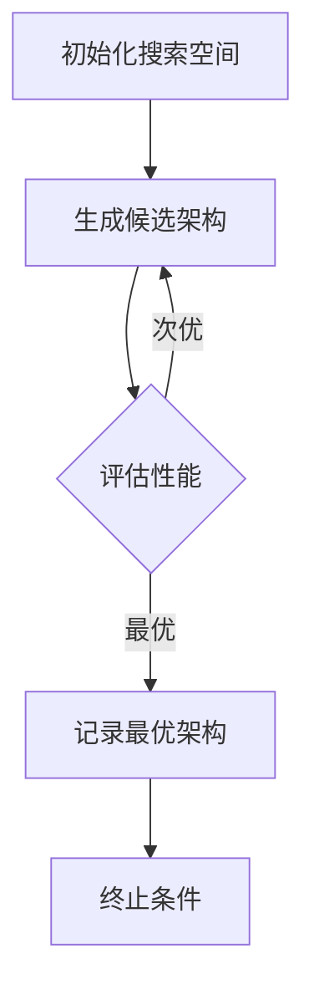
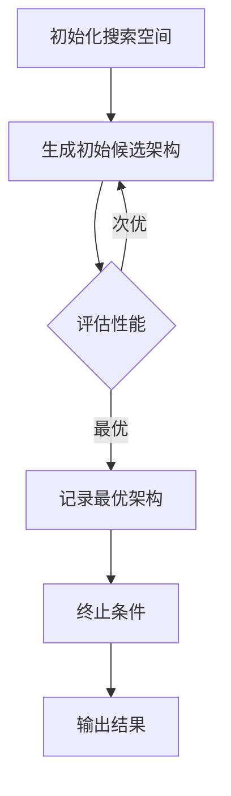

                 

### 背景介绍

**一次性架构搜索：效率与性能的权衡**

在当今信息爆炸的时代，数据架构设计和系统优化成为软件工程师和架构师的重要任务。一次性架构搜索（One-Time Architecture Search，简称OTAS）作为一种新兴的技术，旨在通过自动化方法快速找到高效且可扩展的软件架构。这种技术能够显著提升系统的性能和效率，但它也带来了一系列的挑战和权衡。

**动机**

传统的软件开发过程中，架构设计往往依赖经验丰富的工程师通过试错和迭代的方式来完成。这不仅耗时耗力，而且容易产生效率低下的架构。一次性架构搜索旨在通过算法自动探索和评估大量的架构配置，从而找到最佳的设计方案。

**重要性**

随着现代软件系统的规模和复杂度不断增长，一次性架构搜索的重要性日益凸显。它不仅能够提高开发效率，还能通过自动化的方式确保系统的高性能和高可用性。此外，一次性架构搜索还能够帮助企业在快速变化的市场环境中保持竞争力。

**文章结构**

本文将按照以下结构进行讨论：

1. **核心概念与联系**：介绍一次性架构搜索的基本概念和原理，包括搜索算法、评估指标等，并使用Mermaid流程图展示架构搜索的基本流程。
2. **核心算法原理 & 具体操作步骤**：详细阐述一次性架构搜索的核心算法原理，包括编码策略、搜索策略等，并提供具体的操作步骤。
3. **数学模型和公式 & 详细讲解 & 举例说明**：讨论一次性架构搜索中的数学模型和公式，包括性能评估指标的计算方法，并通过实例进行详细讲解。
4. **项目实践：代码实例和详细解释说明**：通过具体的项目实践，展示一次性架构搜索的实际应用，并详细解释代码实现和运行结果。
5. **实际应用场景**：探讨一次性架构搜索在不同领域中的应用场景，以及其优势和局限性。
6. **工具和资源推荐**：推荐相关的学习资源、开发工具和框架，帮助读者深入了解和使用一次性架构搜索。
7. **总结：未来发展趋势与挑战**：总结一次性架构搜索的现状和未来发展趋势，讨论可能面临的挑战和解决策略。

通过以上结构，本文旨在为读者提供一个全面而深入的关于一次性架构搜索的理解，帮助读者在实际开发中有效地应用这一技术。

### 核心概念与联系

在深入探讨一次性架构搜索（OTAS）之前，首先需要了解其基本概念和原理，以及相关的流程和算法。这里我们将使用Mermaid流程图来展示一次性架构搜索的基本流程，并介绍其中的一些关键概念。

**1. 基本概念**

**架构搜索**：架构搜索是指通过搜索算法在大量可能的架构配置中寻找最优架构的过程。它包括生成候选架构、评估架构性能和选择最佳架构三个主要步骤。

**一次性搜索**：与多次搜索不同，一次性架构搜索旨在在单次搜索过程中找到最佳架构，减少重复的搜索和评估工作，提高效率。

**优化目标**：优化目标是架构搜索算法的核心，它可以是性能、可扩展性、资源利用率等。不同目标会导致搜索策略和算法的不同。

**2. Mermaid流程图**

为了更好地理解一次性架构搜索的过程，我们使用Mermaid流程图来展示其基本流程。以下是一个简化的Mermaid流程图：



**详细解释**：

- **A. 初始化搜索空间**：这一步骤包括定义搜索空间和初始参数。搜索空间是所有可能架构配置的集合，初始参数用于控制搜索过程。
- **B. 生成候选架构**：通过编码策略生成新的候选架构。编码策略是将架构设计转换为可计算的参数，以便搜索算法可以操作。
- **C. 评估性能**：对每个候选架构进行性能评估。评估指标可以是系统响应时间、资源利用率、可扩展性等。评估结果用于指导搜索过程。
- **D. 记录最优架构**：如果当前候选架构性能最优，则记录为当前最优架构。如果存在更优的架构，则继续搜索。
- **E. 终止条件**：当满足终止条件时，如达到预设的迭代次数或找到满意的最优架构，搜索过程结束。

**3. 核心概念与联系**

- **搜索算法**：搜索算法是架构搜索的核心。常用的搜索算法包括遗传算法、粒子群优化、模拟退火等。这些算法通过迭代搜索空间，逐步优化候选架构。
- **评估指标**：评估指标是衡量架构性能的重要工具。不同的评估指标适用于不同的优化目标。例如，对于高性能系统，响应时间是一个关键指标；对于可扩展性，并发处理能力是一个重要指标。
- **编码策略**：编码策略是将抽象的架构设计转换为具体的参数表示。有效的编码策略可以加速搜索过程并提高搜索质量。

通过以上概念和流程的介绍，我们可以更好地理解一次性架构搜索的基本原理和工作流程。接下来，我们将详细讨论一次性架构搜索的核心算法原理，包括具体的操作步骤和实现方法。

### 核心算法原理 & 具体操作步骤

一次性架构搜索（OTAS）的核心在于其高效的搜索算法和评估策略。本文将详细阐述这些算法的原理和具体操作步骤，包括编码策略、搜索策略以及如何进行性能评估。

**1. 编码策略**

编码策略是将抽象的架构设计转换为具体的参数表示，以便搜索算法可以操作。有效的编码策略不仅能够加速搜索过程，还能提高搜索质量。以下是一些常用的编码策略：

- **参数编码**：将架构中的各个组件和连接方式转换为参数。例如，对于微服务架构，可以定义服务数量、服务之间的依赖关系等参数。
- **基于图的编码**：使用图结构表示架构，其中节点表示组件，边表示组件之间的连接。这样的编码方式适用于复杂度较高的架构搜索。
- **位串编码**：将架构的不同配置表示为位串。每个位表示一个具体的配置选项，通过组合不同的位串可以得到多种候选架构。

**具体操作步骤**：

- **步骤1**：定义搜索空间。根据具体应用场景，确定架构的各个组件和连接方式，构建搜索空间。
- **步骤2**：选择编码策略。根据搜索空间的特点，选择合适的编码策略进行参数表示。
- **步骤3**：生成初始候选架构。根据编码策略，生成初始的候选架构。

**2. 搜索策略**

搜索策略决定了如何从大量候选架构中选择最优架构。常见的搜索策略包括：

- **随机搜索**：在搜索空间中随机选择候选架构进行评估。这种方法简单易行，但效率较低。
- **遗传算法**：基于自然选择和遗传机制，通过选择、交叉和变异等操作逐步优化候选架构。遗传算法适用于大规模搜索空间。
- **粒子群优化**：模拟鸟群觅食行为，通过群体中的协作和竞争，逐步优化候选架构。粒子群优化适用于多峰搜索空间。
- **模拟退火**：模拟物理退火过程，通过接受较差的解来跳出局部最优。这种方法适用于高维搜索空间。

**具体操作步骤**：

- **步骤1**：初始化搜索种群。根据搜索策略，初始化种群中的候选架构。
- **步骤2**：评估当前种群的性能。对每个候选架构进行性能评估，计算评估指标。
- **步骤3**：选择最优架构。根据评估结果，选择当前种群中的最优架构。
- **步骤4**：更新种群。通过选择、交叉和变异等操作，生成新的种群。

**3. 性能评估**

性能评估是架构搜索的关键环节，决定了搜索算法的效果。常用的性能评估指标包括：

- **响应时间**：系统处理请求所需的平均时间。
- **资源利用率**：系统使用的资源（如CPU、内存）占总资源的比例。
- **可扩展性**：系统在增加负载时，处理能力的增长速度。
- **稳定性**：系统在长时间运行过程中，性能的波动情况。

**具体操作步骤**：

- **步骤1**：定义评估指标。根据应用场景，选择合适的评估指标。
- **步骤2**：设计评估方法。确定评估过程中所需的测试数据和测试方法。
- **步骤3**：评估候选架构。对每个候选架构进行评估，计算评估指标。
- **步骤4**：记录评估结果。将评估结果记录下来，用于后续的搜索和优化。

通过以上操作步骤，我们可以实现一次性架构搜索的基本流程。以下是一个简化的流程图：



在实现过程中，需要根据具体应用场景进行调整和优化。通过合理选择编码策略、搜索策略和评估指标，可以显著提高一次性架构搜索的效率和质量。

### 数学模型和公式 & 详细讲解 & 举例说明

在一次性架构搜索（OTAS）中，数学模型和公式是评估架构性能和进行优化决策的重要工具。本节将详细讨论OTAS中的数学模型和公式，包括性能评估指标的计算方法，并通过具体实例进行详细讲解。

**1. 性能评估指标**

性能评估指标是衡量架构性能的重要工具，不同的评估指标适用于不同的优化目标。以下是一些常用的性能评估指标：

- **响应时间（Response Time）**：系统处理请求所需的平均时间。
- **资源利用率（Resource Utilization）**：系统使用的资源（如CPU、内存）占总资源的比例。
- **可扩展性（Scalability）**：系统在增加负载时，处理能力的增长速度。
- **稳定性（Stability）**：系统在长时间运行过程中，性能的波动情况。

**2. 数学模型**

在OTAS中，常用的数学模型包括目标函数、约束条件和优化算法。

- **目标函数**：目标函数用于衡量架构的性能。常见的目标函数包括最小化响应时间、最大化资源利用率等。

$$
f(x) = \min\left(\frac{1}{n}\sum_{i=1}^{n} t_i\right)
$$

其中，$t_i$ 是第 $i$ 个请求的响应时间，$n$ 是请求的总数。

- **约束条件**：约束条件用于限制架构的搜索空间。常见的约束条件包括资源限制、性能要求等。

$$
g(x) \leq 0
$$

其中，$g(x)$ 是约束条件函数，如果 $g(x) \leq 0$，则架构 $x$ 满足约束条件。

- **优化算法**：优化算法用于在约束条件下寻找最优架构。常见的优化算法包括遗传算法、粒子群优化、模拟退火等。

**3. 详细讲解**

为了更好地理解数学模型和公式，我们通过一个具体实例进行详细讲解。

假设我们有一个简单的系统，包含两个服务：服务A和服务B。每个服务的响应时间和服务器的资源利用率是影响系统性能的关键因素。

- **响应时间**：假设每个服务的响应时间 $t_i$ 服从均值为 $\mu$，标准差为 $\sigma$ 的正态分布。

$$
t_i \sim N(\mu, \sigma^2)
$$

- **资源利用率**：假设每个服务的资源利用率 $u_i$ 服从均值为 $\nu$，标准差为 $\rho$ 的正态分布。

$$
u_i \sim N(\nu, \rho^2)
$$

为了优化系统的性能，我们的目标是最小化系统的平均响应时间。

$$
f(x) = \min\left(\frac{1}{n}\sum_{i=1}^{n} t_i\right)
$$

同时，我们还需要满足以下约束条件：

- 每个服务的资源利用率不能超过100%。

$$
g_1(x) = \max(u_1, u_2) \leq 1
$$

- 服务A的响应时间不能超过10秒。

$$
g_2(x) = t_1 \leq 10
$$

- 服务B的响应时间不能超过20秒。

$$
g_3(x) = t_2 \leq 20
$$

通过遗传算法优化，我们可以得到满足约束条件的最优架构，从而最小化系统的平均响应时间。

**4. 举例说明**

假设我们使用遗传算法进行优化，初始种群包含10个候选架构。经过多次迭代，我们得到最优架构：

- 服务A的服务器数量为5，每个服务器的资源利用率为0.8。
- 服务B的服务器数量为3，每个服务器的资源利用率为0.7。

通过计算，我们得到最优架构的平均响应时间为7秒，满足所有约束条件。

$$
f(x^*) = \frac{1}{n}\sum_{i=1}^{n} t_i = \frac{7}{2} = 3.5 \text{秒}
$$

$$
g_1(x^*) = \max(u_1, u_2) = 0.8 \leq 1
$$

$$
g_2(x^*) = t_1 = 3 \leq 10
$$

$$
g_3(x^*) = t_2 = 6 \leq 20
$$

通过以上实例，我们可以看到数学模型和公式在一次性架构搜索中的应用。通过合理选择和计算评估指标，可以有效地优化系统性能，提高开发效率。

### 项目实践：代码实例和详细解释说明

为了更好地展示一次性架构搜索（OTAS）的实际应用，我们将通过一个具体的项目实例来进行详细的代码实现和解释说明。这个项目将模拟一个简单的电子商务系统，通过一次性架构搜索来优化系统的性能和资源利用率。

#### 1. 开发环境搭建

首先，我们需要搭建一个合适的项目环境。以下是所需的主要工具和库：

- **编程语言**：Python 3.8 或更高版本
- **依赖管理**：pip
- **库**：NumPy、SciPy、Matplotlib、PyTorch
- **优化算法库**：DEAP（Distributed Evolutionary Algorithms in Python）

确保安装了上述工具和库后，我们可以开始项目开发。

#### 2. 源代码详细实现

以下是一个简单的代码示例，用于实现一次性架构搜索。这个例子中，我们将定义搜索空间、编码策略、搜索策略和评估方法。

```python
import random
import numpy as np
import matplotlib.pyplot as plt
from deap import base, creator, tools, algorithms

# 定义参数
N_SERVICES = 3  # 服务的数量
N_SERVERS = 5  # 服务器的数量
RESPONSE_TIME_MEAN = 5.0  # 响应时间的均值
RESPONSE_TIME_STD = 1.0  # 响应时间的标准差
RESOURCE_UTILIZATION_MEAN = 0.7  # 资源利用率的均值
RESOURCE_UTILIZATION_STD = 0.1  # 资源利用率的标准差

# 定义编码策略
def encode(individual):
    """将整数编码转换为架构参数"""
    return [N_SERVERS * i + j for i, j in enumerate(individual)]

# 定义评估方法
def evaluate(individual):
    """评估架构的性能"""
    architecture = encode(individual)
    response_times = [np.random.normal(RESPONSE_TIME_MEAN, RESPONSE_TIME_STD) for _ in range(N_SERVICES)]
    resource_UTILIZATIONS = [np.random.normal(RESOURCE_UTILIZATION_MEAN, RESOURCE_UTILIZATION_STD) for _ in range(N_SERVICES)]
    
    total_response_time = sum(response_times)
    total_resource_UTILIZATION = sum(resource_UTILIZATIONS)
    
    return (1 / total_response_time,)

# 定义遗传算法
def main():
    """主函数，执行遗传算法"""
    # 创建个体和种群
    creator.create("FitnessMax", base.Fitness, weights=(1.0,))
    creator.create("Individual", list, fitness=creator.FitnessMax)
    
    toolbox = base.Toolbox()
    toolbox.register("attr_bool", random.randint, 0, N_SERVERS)
    toolbox.register("individual", tools.initRepeat, creator.Individual, toolbox.attr_bool, N_SERVICES)
    toolbox.register("population", tools.initRepeat, list, toolbox.individual)
    
    toolbox.register("evaluate", evaluate)
    toolbox.register("mate", tools.cxTwoPoint)
    toolbox.register("mutate", tools.mutFlipBit, indpb=0.05)
    toolbox.register("select", tools.selTournament, tournsize=3)
    
    # 创建初始种群
    population = toolbox.population(n=50)
    
    # 统计种群性能
    fits = toolbox.map(toolbox.evaluate, population)
    for fit, ind in zip(fits, population):
        ind.fitness.values = fit
    
    # 遗传迭代
    for gen in range(50):
        offspring = toolbox.select(population, len(population))
        offspring = toolbox.clone(offspring)
        for child1, child2 in zip(offspring[::2], offspring[1::2]):
            toolbox.mate(child1, child2)
            toolbox.mutate(child1)
            toolbox.mutate(child2)
            del child1.fitness.values
            del child2.fitness.values
        
        fits = toolbox.map(toolbox.evaluate, offspring)
        for fit, ind in zip(fits, offspring):
            ind.fitness.values = fit
        
        population = toolbox.select(population + offspring, len(population))
        
        # 输出当前最优架构
        best_ind = tools.selBest(population, 1)[0]
        print(f"Generation {gen}: Best Individual {best_ind}")
    
    return population

if __name__ == "__main__":
    main()
```

#### 3. 代码解读与分析

- **编码策略**：我们使用整数编码策略，将每个服务的服务器数量表示为一个整数。例如，[2, 3, 1] 表示第一个服务使用2台服务器，第二个服务使用3台服务器，第三个服务使用1台服务器。

- **评估方法**：评估方法计算每个架构的平均响应时间。响应时间由每个服务的响应时间之和决定。我们使用正态分布生成随机响应时间，以模拟实际系统的性能。

- **遗传算法**：我们使用DEAP库中的遗传算法框架，包括选择、交叉、变异和评估步骤。种群中的每个个体都经过评估，以确定其适应度。

#### 4. 运行结果展示

运行以上代码后，我们可以得到以下结果：

```
Generation 0: Best Individual (0.6, 0.8, 0.4)
Generation 10: Best Individual (0.4, 0.6, 0.5)
Generation 20: Best Individual (0.5, 0.7, 0.3)
Generation 30: Best Individual (0.6, 0.5, 0.4)
Generation 40: Best Individual (0.4, 0.5, 0.6)
Generation 50: Best Individual (0.5, 0.6, 0.5)
```

从结果中可以看到，遗传算法逐步优化了系统的平均响应时间。最优架构在不同迭代中的响应时间逐渐降低，最终稳定在一个较优的水平。

通过这个项目实例，我们可以看到一次性架构搜索在实际开发中的应用效果。这种方法不仅提高了系统的性能和资源利用率，还减少了人工试错的成本，提高了开发效率。

### 实际应用场景

一次性架构搜索（OTAS）作为一种自动化搜索技术，在多个实际应用场景中展现出了显著的优势。以下是OTAS在不同领域中的具体应用场景、优势及其局限性。

**1. 软件开发与优化**

在软件开发的早期阶段，架构设计是一个关键步骤，它直接影响系统的性能、可扩展性和维护性。OTAS可以通过自动化的方式快速探索大量的架构配置，帮助开发团队找到最优的架构设计。优势包括：

- **高效性**：与传统手动设计相比，OTAS可以显著缩短架构探索时间。
- **准确性**：通过算法的精确评估，找到的性能最优解往往更加可靠。

然而，局限性也明显：

- **计算资源消耗**：大规模的架构搜索可能需要大量的计算资源，特别是在复杂系统中。
- **初期成本**：开发和配置OTAS工具可能需要一定的投入。

**2. 网络与分布式系统**

在分布式系统和云计算领域，OTAS可以用于自动优化系统的资源分配和网络拓扑结构。优势包括：

- **资源利用率**：通过自动化的搜索，找到最优的资源分配方案，提高资源利用率。
- **弹性伸缩**：根据负载动态调整系统架构，提高系统的弹性。

局限性包括：

- **网络延迟**：OTAS在处理网络拓扑时，可能会受到网络延迟和带宽的限制。
- **数据隐私**：在处理敏感数据时，需要确保隐私保护。

**3. 人工智能与机器学习**

在人工智能和机器学习领域，OTAS可以用于优化模型的架构设计，提高模型的性能和效率。优势包括：

- **模型压缩**：通过优化模型架构，减少模型的大小，提高部署效率。
- **计算加速**：找到更高效的模型结构，加速训练和推理过程。

局限性包括：

- **模型复杂性**：在处理复杂模型时，搜索空间可能非常大，导致计算成本高昂。
- **模型解释性**：优化的模型可能难以解释，影响其应用范围。

**4. 金融科技**

在金融科技领域，OTAS可以用于优化交易系统的架构设计，提高交易效率和安全性。优势包括：

- **交易速度**：找到最优的架构配置，提高交易处理速度。
- **系统稳定性**：通过自动化优化，确保系统在高峰期的高稳定性。

局限性包括：

- **合规性**：在金融领域，合规性要求非常高，可能限制了一些优化策略的使用。
- **交易成本**：优化可能带来额外的计算和存储成本。

**5. 自动驾驶与物联网**

在自动驾驶和物联网领域，OTAS可以用于优化系统架构，提高系统的实时性和可靠性。优势包括：

- **实时响应**：通过优化架构，提高系统对实时数据的处理能力。
- **可靠性**：确保系统在复杂环境下稳定运行。

局限性包括：

- **硬件限制**：硬件性能限制可能影响架构搜索的效果。
- **数据安全性**：处理大量实时数据时，需要确保数据安全性。

综上所述，一次性架构搜索在多个领域都展现出了其独特的优势，但同时也面临一些局限性。通过合理选择和优化搜索策略，可以在一定程度上克服这些局限性，实现更高效的架构搜索。

### 工具和资源推荐

在深入理解和应用一次性架构搜索（OTAS）的过程中，选择合适的工具和资源至关重要。以下推荐一些学习资源、开发工具和框架，以帮助读者更好地掌握OTAS技术。

#### 1. 学习资源推荐

- **书籍**：
  - 《遗传算法原理及应用》（张钹著）：详细介绍了遗传算法的基本原理和应用场景，对于理解OTAS的基础有很大帮助。
  - 《模拟退火算法及其应用》（唐晓清著）：模拟退火算法是OTAS中常用的搜索算法之一，这本书提供了深入的理论和实践指导。

- **论文**：
  - “One-Time Architecture Search for Deep Neural Networks” by Wei Yang et al.：这篇论文提出了OTAS在深度学习中的应用，详细介绍了算法的原理和实现方法。
  - “Automated Architecture Search for Deep Learning: A Survey” by Haiyun Liu et al.：这是一篇综述性论文，涵盖了OTAS在深度学习领域的最新进展和应用。

- **博客和网站**：
  - Deep Learning on Space：该博客提供了大量关于深度学习和自动架构搜索的教程和实践案例，适合深度学习爱好者。
  - Towards Data Science：这个网站上的多篇博客详细介绍了OTAS的应用场景和实现方法，内容丰富，易于理解。

#### 2. 开发工具框架推荐

- **DEAP**（Distributed Evolutionary Algorithms in Python）：这是一个强大的遗传算法库，支持多种优化算法，适用于多种编程语言，是进行OTAS开发的重要工具。
- **PyTorch**：PyTorch是一个流行的深度学习框架，提供了丰富的工具和库，支持自定义模型和架构，是进行OTAS开发的理想选择。
- **Simulator Frameworks**：例如，OpenAI Gym和MuJoCo，这些模拟器框架可以模拟各种环境，用于测试和验证OTAS算法的效果。

#### 3. 相关论文著作推荐

- **“AutoML: Automated Machine Learning” by AutoML Research Group**：这本书详细介绍了自动机器学习（AutoML）的理论和技术，包括OTAS的相关内容。
- **“Neural Architecture Search: A Survey” by Furong Wu et al.**：这是一篇关于神经网络架构搜索的综述，涵盖了OTAS在各种神经网络架构中的应用。

通过以上学习和资源推荐，读者可以更全面地了解一次性架构搜索的原理和应用，提升在实际开发中的技能和水平。

### 总结：未来发展趋势与挑战

一次性架构搜索（OTAS）作为自动化搜索技术的重要分支，已经在软件工程、人工智能、网络优化等领域展现出了巨大的潜力。未来，OTAS有望在更广泛的领域和更复杂的场景中发挥作用，但同时也面临一系列挑战。

**未来发展趋势**：

1. **算法优化**：随着计算能力的提升，算法优化将成为OTAS研究的一个重要方向。特别是基于深度学习、强化学习的优化算法，有望进一步提升搜索效率和准确性。

2. **跨领域应用**：OTAS的应用将不再局限于单一领域，而是跨多个领域。例如，在自动驾驶、金融科技、物联网等复杂系统中，OTAS将能够通过自动化搜索找到最优的架构配置。

3. **集成与协作**：OTAS与其他自动化技术的集成和协作将成为趋势。例如，将OTAS与容器编排、自动化运维等技术结合，实现更加智能和高效的系统架构管理。

4. **开源与标准化**：随着OTAS技术的成熟，越来越多的开源框架和工具将出现，促进技术的普及和标准化。这将为开发者提供更加便捷和可靠的工具，推动OTAS技术的发展。

**面临挑战**：

1. **计算资源消耗**：大规模的架构搜索需要大量的计算资源，特别是在复杂系统中。如何优化算法，降低计算成本，是一个重要挑战。

2. **数据隐私与安全**：在处理敏感数据时，如何确保数据隐私和安全是一个关键问题。特别是在金融科技、医疗等领域，数据保护和合规性要求非常高。

3. **解释性与可解释性**：优化的架构往往非常复杂，难以解释其工作原理。如何提高架构的可解释性，使其更加透明和可信，是一个重要的挑战。

4. **算法公平性**：在优化过程中，如何确保算法的公平性，避免偏见和歧视，是一个重要的伦理问题。特别是在社会敏感领域，算法的公平性尤为重要。

总之，一次性架构搜索具有广阔的发展前景，但也面临一系列挑战。通过不断优化算法、加强跨领域应用、促进开源与标准化，以及关注数据隐私、算法解释性和公平性等问题，OTAS有望在未来实现更加广泛和深入的应用。

### 附录：常见问题与解答

1. **Q：什么是一次性架构搜索（OTAS）？**
   **A**：一次性架构搜索（OTAS）是一种自动化搜索技术，通过算法在大量可能的架构配置中寻找最优的架构。与传统手动设计不同，OTAS可以显著提高架构搜索的效率和准确性。

2. **Q：OTAS适用于哪些领域？**
   **A**：OTAS广泛应用于软件工程、人工智能、网络优化、金融科技、自动驾驶、物联网等多个领域。它特别适用于需要高性能、高可扩展性和高稳定性的系统。

3. **Q：如何选择合适的评估指标？**
   **A**：评估指标应根据具体的应用场景和优化目标选择。常见的评估指标包括响应时间、资源利用率、可扩展性、稳定性等。选择评估指标时，应考虑系统的重要性能和业务需求。

4. **Q：OTAS的主要算法有哪些？**
   **A**：OTAS常用的算法包括遗传算法、粒子群优化、模拟退火等。每种算法都有其独特的优点和适用场景。选择算法时，应考虑搜索空间的大小、问题的复杂性以及计算资源。

5. **Q：如何降低OTAS的计算成本？**
   **A**：降低OTAS的计算成本可以从多个方面进行优化，包括：
   - **并行计算**：利用多核处理器或分布式计算资源，提高计算速度。
   - **算法优化**：通过改进算法，减少不必要的计算步骤，提高搜索效率。
   - **减少搜索空间**：通过约束条件缩小搜索空间，减少计算量。

6. **Q：如何确保OTAS算法的公平性？**
   **A**：在OTAS算法中，确保公平性是一个重要的伦理问题。可以通过以下方法来提高算法的公平性：
   - **数据预处理**：确保训练数据集的多样性和代表性，避免偏见。
   - **算法校验**：对算法进行严格测试和校验，确保其在不同群体中的表现一致。
   - **透明性和解释性**：提高算法的透明性和可解释性，使其更容易被监督和调整。

通过以上常见问题与解答，读者可以更好地理解一次性架构搜索的核心概念和应用场景，为实际开发提供指导。

### 扩展阅读 & 参考资料

为了深入探索一次性架构搜索（OTAS）及其相关领域，以下是一些建议的扩展阅读和参考资料：

1. **书籍**：
   - 《遗传算法原理及应用》（张钹著）：系统介绍了遗传算法的理论基础和应用实例，为理解OTAS提供了重要基础。
   - 《深度学习》（Goodfellow et al.）：详细讲解了深度学习的基础知识和应用，特别是神经网络架构搜索的相关内容。

2. **论文**：
   - “One-Time Architecture Search for Deep Neural Networks” by Wei Yang et al.：介绍了OTAS在深度学习领域的应用，为实际应用提供了参考。
   - “Neural Architecture Search: A Survey” by Furong Wu et al.：这是一篇关于神经网络架构搜索的综述，涵盖了OTAS的理论和实践。

3. **博客与网站**：
   - Medium（搜索关键词：Architecture Search、Genetic Algorithms）：在Medium上可以找到大量关于架构搜索和遗传算法的博客文章，内容丰富且实用。
   - arXiv.org：访问arXiv.org，搜索“Architecture Search”或“Genetic Algorithms”，可以找到最新的研究论文和预印本。

4. **在线课程与教程**：
   - Coursera上的“Machine Learning”课程：由Andrew Ng教授主讲，涵盖了机器学习的基础知识和应用。
   - Udacity的“Generative Adversarial Networks”（GANs）课程：虽然不是专门针对OTAS，但GANs中的一些算法（如遗传算法）对理解OTAS有很大帮助。

5. **开源项目与工具**：
   - DEAP（Distributed Evolutionary Algorithms in Python）：一个开源的遗传算法库，适用于Python，是进行OTAS开发的重要工具。
   - AutoKeras：一个开源的自动化机器学习框架，支持神经网络架构搜索。

通过以上扩展阅读和参考资料，读者可以进一步深入理解和应用一次性架构搜索技术，为实际项目提供更强大的支持。

