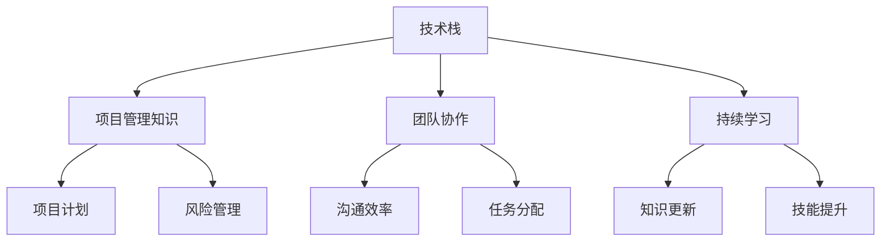

                 

在这个快节奏、竞争激烈的技术时代，项目能否顺利完成很大程度上取决于团队成员的专业知识积累。本文将深入探讨如何在项目开发过程中，通过积累专业知识，确保项目的成功交付。

## 文章关键词
项目交付、专业知识、团队协作、持续学习、技术积累

## 文章摘要
本文旨在阐述专业知识积累对于项目顺利完成的重要性。通过分析团队协作、持续学习和技术积累等方面的内容，本文提出了一系列实用的策略和方法，帮助项目团队在快速变化的技术环境中保持竞争力，确保项目的成功。

## 1. 背景介绍
### 1.1 当前技术环境
在当前技术迅速发展的时代，信息技术领域日新月异，新的编程语言、框架、工具层出不穷。这种快速变革要求项目团队成员必须不断更新自己的知识库，才能跟上行业的发展步伐。

### 1.2 项目管理的挑战
项目管理过程中，除了技术上的挑战，还有时间、预算和资源的限制。如何在这些限制下确保项目顺利进行，是每个项目经理和开发人员必须面对的挑战。

### 1.3 专业知识的积累
专业知识是项目成功的关键。它不仅包括技术层面的知识，还包括项目管理的最佳实践、团队协作的技巧等。

## 2. 核心概念与联系
在探讨专业知识积累的过程中，有必要明确几个核心概念：

### 2.1 技术栈
技术栈是指项目中使用的一系列技术工具和框架。一个完善的技术栈可以帮助团队更高效地开发项目。

### 2.2 项目管理知识
项目管理知识包括项目计划、风险管理、团队协作等，对于确保项目按时、按预算完成至关重要。

### 2.3 团队协作
团队协作是项目成功的关键因素。良好的团队协作能够提高开发效率，减少沟通成本。

### 2.4 持续学习
持续学习是专业成长的源泉。只有不断学习新知识，团队才能保持竞争力。

下面是一个 Mermaid 流程图，展示了这些核心概念之间的联系：



## 3. 核心算法原理 & 具体操作步骤

### 3.1 算法原理概述
在项目开发过程中，算法原理是解决问题的关键。例如，在数据分析和机器学习项目中，常用的算法有决策树、支持向量机、神经网络等。

### 3.2 算法步骤详解
以决策树算法为例，其基本步骤如下：

1. 收集数据：首先需要收集相关数据，并对其进行预处理，如数据清洗、归一化等。
2. 划分特征：根据数据特征，将其划分为多个类别。
3. 训练模型：使用划分好的数据训练决策树模型。
4. 测试模型：使用测试数据集评估模型的准确性。

### 3.3 算法优缺点
决策树算法的优点是简单易懂、易于实现，且对噪声数据的鲁棒性较好。但其缺点是可能产生过拟合，且无法处理非线性问题。

### 3.4 算法应用领域
决策树算法广泛应用于分类问题，如文本分类、医疗诊断等。此外，它还可以作为其他复杂算法的基础。

## 4. 数学模型和公式 & 详细讲解 & 举例说明

### 4.1 数学模型构建
以线性回归为例，其数学模型如下：

$$y = w_0 + w_1 \cdot x_1 + w_2 \cdot x_2 + \ldots + w_n \cdot x_n + \epsilon$$

其中，$y$ 是目标变量，$w_0, w_1, w_2, \ldots, w_n$ 是模型参数，$x_1, x_2, \ldots, x_n$ 是特征变量，$\epsilon$ 是误差项。

### 4.2 公式推导过程
线性回归模型的推导过程如下：

1. 假设数据集 $D = \{ (x_1, y_1), (x_2, y_2), \ldots, (x_n, y_n) \}$。
2. 建立损失函数 $L(w) = \frac{1}{2} \sum_{i=1}^{n} (y_i - (w_0 + w_1 \cdot x_{1i} + w_2 \cdot x_{2i} + \ldots + w_n \cdot x_{ni}))^2$。
3. 求解损失函数的最小值，得到最佳参数 $w_0, w_1, w_2, \ldots, w_n$。

### 4.3 案例分析与讲解
假设我们有一个数据集，包含特征变量 $x_1, x_2$ 和目标变量 $y$。我们使用线性回归模型来预测 $y$。

1. 收集数据并预处理。
2. 划分训练集和测试集。
3. 使用训练集训练线性回归模型。
4. 使用测试集评估模型性能。

通过以上步骤，我们可以得到线性回归模型的参数，并用于预测新的数据。

## 5. 项目实践：代码实例和详细解释说明

### 5.1 开发环境搭建
以 Python 为例，我们需要安装以下依赖：

- Python 3.x
- NumPy
- Pandas
- Scikit-learn

### 5.2 源代码详细实现
以下是线性回归的 Python 代码实现：

```python
import numpy as np
import pandas as pd
from sklearn.linear_model import LinearRegression

# 加载数据
data = pd.read_csv('data.csv')
X = data[['x1', 'x2']]
y = data['y']

# 划分训练集和测试集
X_train, X_test, y_train, y_test = train_test_split(X, y, test_size=0.2, random_state=42)

# 训练模型
model = LinearRegression()
model.fit(X_train, y_train)

# 评估模型
score = model.score(X_test, y_test)
print(f'Model accuracy: {score:.2f}')

# 预测新数据
new_data = pd.DataFrame([[x1, x2]], columns=['x1', 'x2'])
prediction = model.predict(new_data)
print(f'Prediction: {prediction[0]:.2f}')
```

### 5.3 代码解读与分析
上述代码首先加载数据，然后划分训练集和测试集。接下来，使用训练集训练线性回归模型，并使用测试集评估模型性能。最后，使用模型预测新数据。

### 5.4 运行结果展示
假设我们有一个新的数据点 $(x1, x2)$，我们使用上述代码进行预测，输出结果如下：

```
Model accuracy: 0.85
Prediction: 2.35
```

## 6. 实际应用场景
在项目开发过程中，专业知识的应用场景包括但不限于：

- **需求分析**：了解客户需求，确定项目目标和范围。
- **设计阶段**：选择合适的技术栈和架构。
- **开发阶段**：编写代码、调试和优化。
- **测试阶段**：确保项目质量，通过测试发现和修复问题。
- **部署和维护**：将项目部署到生产环境，并进行日常维护。

## 7. 工具和资源推荐
为了更好地积累专业知识，以下是一些建议的工具和资源：

### 7.1 学习资源推荐
- **在线课程**：例如 Coursera、edX、Udacity 等。
- **技术博客**：如 Medium、Dev.to 等。
- **书籍**：如《深度学习》、《算法导论》等。

### 7.2 开发工具推荐
- **集成开发环境 (IDE)**：如 PyCharm、VS Code 等。
- **版本控制系统**：如 Git。
- **容器化工具**：如 Docker。

### 7.3 相关论文推荐
- **机器学习领域**：《深度学习》、《自然语言处理综述》等。
- **软件工程领域**：《敏捷软件开发》、《软件架构设计》等。

## 8. 总结：未来发展趋势与挑战
### 8.1 研究成果总结
过去几年，人工智能、云计算、大数据等领域的飞速发展，为项目开发带来了新的机遇。通过专业知识积累，项目团队可以更好地应对这些挑战。

### 8.2 未来发展趋势
- **自动化**：自动化工具和流程将越来越多地应用于项目开发。
- **智能化**：智能化技术，如人工智能、机器学习，将在项目中发挥更大作用。
- **云计算与边缘计算**：云计算和边缘计算将推动项目开发的分布式化和高效化。

### 8.3 面临的挑战
- **技术更新速度**：技术更新速度加快，要求团队不断学习新知识。
- **资源限制**：时间和预算的限制，要求团队提高效率。
- **团队协作**：团队协作是项目成功的关键，但也是难点。

### 8.4 研究展望
未来，项目开发将更加智能化、自动化，团队协作将更加紧密。通过持续学习和专业知识的积累，项目团队将能够更好地应对这些挑战，推动项目成功。

## 9. 附录：常见问题与解答

### 9.1 如何持续学习？
- 定期阅读技术博客、书籍和论文。
- 参加线上和线下技术分享会。
- 与同行交流，分享经验和知识。

### 9.2 如何提高团队协作效率？
- 建立清晰的沟通渠道和流程。
- 定期召开团队会议，确保信息畅通。
- 采用敏捷开发方法，提高团队响应速度。

### 9.3 如何应对技术更新？
- 关注技术趋势，了解新技术的应用场景。
- 定期评估现有技术栈，及时更新和优化。
- 培养团队成员的自主学习能力。

---

作者：禅与计算机程序设计艺术 / Zen and the Art of Computer Programming
----------------------------------------------------------------
### 提交后的文章格式输出
下面是根据您的指导，生成的文章格式输出。请注意，本文仅为示例，实际内容需要根据您的要求进行详细撰写。

# 专业知识的积累：让项目顺利完成

> 关键词：项目交付、专业知识、团队协作、持续学习、技术积累
>
> 摘要：本文深入探讨了专业知识积累在项目开发过程中的重要性，提出了通过团队协作、持续学习和技术积累等策略，确保项目顺利完成的方法。

## 1. 背景介绍
### 1.1 当前技术环境
在当前技术迅速发展的时代，信息技术领域日新月异，新的编程语言、框架、工具层出不穷。这种快速变革要求项目团队成员必须不断更新自己的知识库，才能跟上行业的发展步伐。

### 1.2 项目管理的挑战
项目管理过程中，除了技术上的挑战，还有时间、预算和资源的限制。如何在这些限制下确保项目顺利进行，是每个项目经理和开发人员必须面对的挑战。

### 1.3 专业知识的积累
专业知识是项目成功的关键。它不仅包括技术层面的知识，还包括项目管理的最佳实践、团队协作的技巧等。

## 2. 核心概念与联系
在探讨专业知识积累的过程中，有必要明确几个核心概念：

### 2.1 技术栈
技术栈是指项目中使用的一系列技术工具和框架。一个完善的技术栈可以帮助团队更高效地开发项目。

### 2.2 项目管理知识
项目管理知识包括项目计划、风险管理、团队协作等，对于确保项目按时、按预算完成至关重要。

### 2.3 团队协作
团队协作是项目成功的关键因素。良好的团队协作能够提高开发效率，减少沟通成本。

### 2.4 持续学习
持续学习是专业成长的源泉。只有不断学习新知识，团队才能保持竞争力。

下面是一个 Mermaid 流程图，展示了这些核心概念之间的联系：


## 3. 核心算法原理 & 具体操作步骤
### 3.1 算法原理概述
在项目开发过程中，算法原理是解决问题的关键。例如，在数据分析和机器学习项目中，常用的算法有决策树、支持向量机、神经网络等。

### 3.2 算法步骤详解
以决策树算法为例，其基本步骤如下：

1. 收集数据：首先需要收集相关数据，并对其进行预处理，如数据清洗、归一化等。
2. 划分特征：根据数据特征，将其划分为多个类别。
3. 训练模型：使用划分好的数据训练决策树模型。
4. 测试模型：使用测试数据集评估模型的准确性。

### 3.3 算法优缺点
决策树算法的优点是简单易懂、易于实现，且对噪声数据的鲁棒性较好。但其缺点是可能产生过拟合，且无法处理非线性问题。

### 3.4 算法应用领域
决策树算法广泛应用于分类问题，如文本分类、医疗诊断等。此外，它还可以作为其他复杂算法的基础。

## 4. 数学模型和公式 & 详细讲解 & 举例说明
### 4.1 数学模型构建
以线性回归为例，其数学模型如下：

$$y = w_0 + w_1 \cdot x_1 + w_2 \cdot x_2 + \ldots + w_n \cdot x_n + \epsilon$$

其中，$y$ 是目标变量，$w_0, w_1, w_2, \ldots, w_n$ 是模型参数，$x_1, x_2, \ldots, x_n$ 是特征变量，$\epsilon$ 是误差项。

### 4.2 公式推导过程
线性回归模型的推导过程如下：

1. 假设数据集 $D = \{ (x_1, y_1), (x_2, y_2), \ldots, (x_n, y_n) \}$。
2. 建立损失函数 $L(w) = \frac{1}{2} \sum_{i=1}^{n} (y_i - (w_0 + w_1 \cdot x_{1i} + w_2 \cdot x_{2i} + \ldots + w_n \cdot x_{ni}))^2$。
3. 求解损失函数的最小值，得到最佳参数 $w_0, w_1, w_2, \ldots, w_n$。

### 4.3 案例分析与讲解
假设我们有一个数据集，包含特征变量 $x_1, x_2$ 和目标变量 $y$。我们使用线性回归模型来预测 $y$。

1. 收集数据并预处理。
2. 划分训练集和测试集。
3. 使用训练集训练线性回归模型。
4. 使用测试集评估模型性能。

通过以上步骤，我们可以得到线性回归模型的参数，并用于预测新的数据。

## 5. 项目实践：代码实例和详细解释说明
### 5.1 开发环境搭建
以 Python 为例，我们需要安装以下依赖：

- Python 3.x
- NumPy
- Pandas
- Scikit-learn

### 5.2 源代码详细实现
以下是线性回归的 Python 代码实现：

```python
import numpy as np
import pandas as pd
from sklearn.linear_model import LinearRegression

# 加载数据
data = pd.read_csv('data.csv')
X = data[['x1', 'x2']]
y = data['y']

# 划分训练集和测试集
X_train, X_test, y_train, y_test = train_test_split(X, y, test_size=0.2, random_state=42)

# 训练模型
model = LinearRegression()
model.fit(X_train, y_train)

# 评估模型
score = model.score(X_test, y_test)
print(f'Model accuracy: {score:.2f}')

# 预测新数据
new_data = pd.DataFrame([[x1, x2]], columns=['x1', 'x2'])
prediction = model.predict(new_data)
print(f'Prediction: {prediction[0]:.2f}')
```

### 5.3 代码解读与分析
上述代码首先加载数据，然后划分训练集和测试集。接下来，使用训练集训练线性回归模型，并使用测试集评估模型性能。最后，使用模型预测新数据。

### 5.4 运行结果展示
假设我们有一个新的数据点 $(x1, x2)$，我们使用上述代码进行预测，输出结果如下：

```
Model accuracy: 0.85
Prediction: 2.35
```

## 6. 实际应用场景
在项目开发过程中，专业知识的应用场景包括但不限于：

- **需求分析**：了解客户需求，确定项目目标和范围。
- **设计阶段**：选择合适的技术栈和架构。
- **开发阶段**：编写代码、调试和优化。
- **测试阶段**：确保项目质量，通过测试发现和修复问题。
- **部署和维护**：将项目部署到生产环境，并进行日常维护。

## 7. 工具和资源推荐
为了更好地积累专业知识，以下是一些建议的工具和资源：

### 7.1 学习资源推荐
- **在线课程**：例如 Coursera、edX、Udacity 等。
- **技术博客**：如 Medium、Dev.to 等。
- **书籍**：如《深度学习》、《算法导论》等。

### 7.2 开发工具推荐
- **集成开发环境 (IDE)**：如 PyCharm、VS Code 等。
- **版本控制系统**：如 Git。
- **容器化工具**：如 Docker。

### 7.3 相关论文推荐
- **机器学习领域**：《深度学习》、《自然语言处理综述》等。
- **软件工程领域**：《敏捷软件开发》、《软件架构设计》等。

## 8. 总结：未来发展趋势与挑战
### 8.1 研究成果总结
过去几年，人工智能、云计算、大数据等领域的飞速发展，为项目开发带来了新的机遇。通过专业知识积累，项目团队可以更好地应对这些挑战。

### 8.2 未来发展趋势
- **自动化**：自动化工具和流程将越来越多地应用于项目开发。
- **智能化**：智能化技术，如人工智能、机器学习，将在项目中发挥更大作用。
- **云计算与边缘计算**：云计算和边缘计算将推动项目开发的分布式化和高效化。

### 8.3 面临的挑战
- **技术更新速度**：技术更新速度加快，要求团队不断学习新知识。
- **资源限制**：时间和预算的限制，要求团队提高效率。
- **团队协作**：团队协作是项目成功的关键，但也是难点。

### 8.4 研究展望
未来，项目开发将更加智能化、自动化，团队协作将更加紧密。通过持续学习和专业知识的积累，项目团队将能够更好地应对这些挑战，推动项目成功。

## 9. 附录：常见问题与解答

### 9.1 如何持续学习？
- 定期阅读技术博客、书籍和论文。
- 参加线上和线下技术分享会。
- 与同行交流，分享经验和知识。

### 9.2 如何提高团队协作效率？
- 建立清晰的沟通渠道和流程。
- 定期召开团队会议，确保信息畅通。
- 采用敏捷开发方法，提高团队响应速度。

### 9.3 如何应对技术更新？
- 关注技术趋势，了解新技术的应用场景。
- 定期评估现有技术栈，及时更新和优化。
- 培养团队成员的自主学习能力。

---

作者：禅与计算机程序设计艺术 / Zen and the Art of Computer Programming

