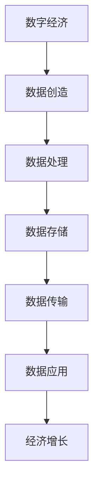
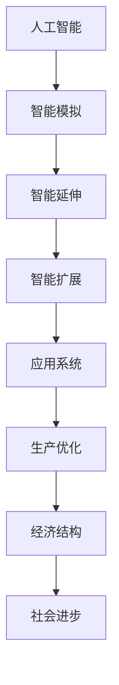
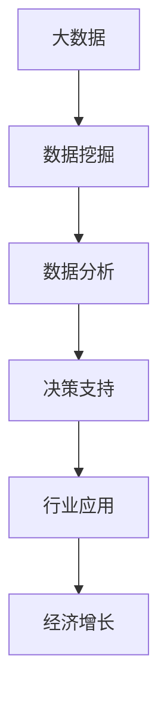
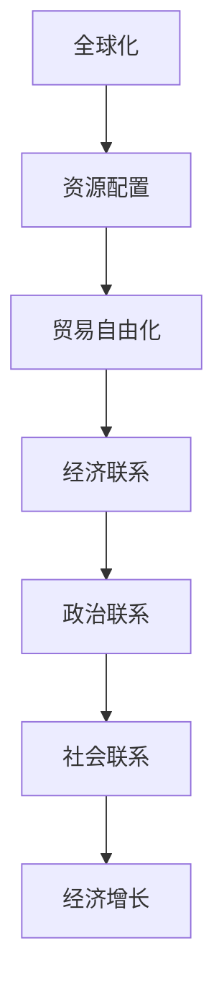
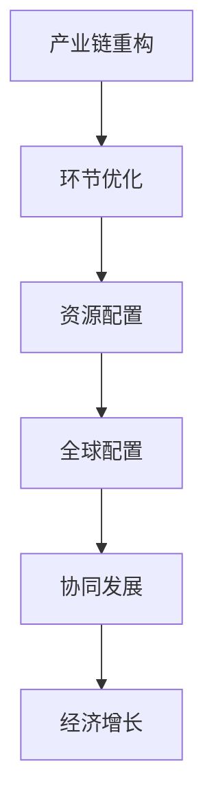

                 

### 1. 背景介绍

随着全球化的深入发展，世界经济增长的内生动力正经历着深刻的变化。在这个信息技术高速发展的时代，数字经济、人工智能、大数据等新兴技术对全球经济模式产生了深远影响。传统的经济增长模式正逐渐被新的技术力量所重塑，这种变化不仅影响了各国经济体的增长轨迹，也对全球经济体系带来了新的挑战和机遇。

本文将围绕世界经济增长的内在变化展开探讨。我们将首先梳理出当前世界经济增长的核心特征，接着深入分析技术变革对经济结构的影响，进一步探讨数字化趋势下的经济增长模式，并探讨全球治理与协同发展的新路径。通过这一系列的分析，我们希望能够揭示出技术进步在全球经济增长中扮演的角色，并提出相应的政策建议，为应对未来全球经济挑战提供有益的参考。

**关键词**：世界经济增长、技术变革、数字经济、人工智能、全球化

**摘要**：本文通过分析技术变革对经济结构的影响，探讨了数字化趋势下世界经济增长的新模式。文章首先介绍了当前世界经济增长的核心特征，然后深入探讨了技术变革对经济模式的重塑作用。通过案例分析，文章总结了数字化趋势下的经济增长模式，并提出了全球治理与协同发展的新路径。本文旨在为理解和技术引导全球经济提供有价值的视角。

### 2. 核心概念与联系

要深入理解世界经济增长的内在变化，我们需要首先明确几个核心概念，并探讨它们之间的联系。这些核心概念包括：数字经济、人工智能、大数据、全球化、产业链重构等。

#### 2.1 数字经济

数字经济是指以数字化的信息和知识为关键生产要素、以现代信息网络为重要载体、以信息通信技术的有效利用为驱动的新型经济形态。数字经济的本质在于数据的创造、存储、处理、传输和应用，这些数据成为推动经济增长的新动力。

**Mermaid 流程图：**



#### 2.2 人工智能

人工智能（AI）是研究、开发用于模拟、延伸和扩展人的智能的理论、方法、技术及应用系统的综合技术。人工智能在提升生产力、优化经济结构、推动社会进步等方面具有重要作用。

**Mermaid 流程图：**



#### 2.3 大数据

大数据是指无法在一定时间范围内用常规软件工具进行捕捉、管理和处理的数据集合。大数据通过数据挖掘和分析，为各行业提供决策支持，促进经济增长。

**Mermaid 流程图：**



#### 2.4 全球化

全球化是指世界范围内的经济、政治、文化、社会等各领域的相互联系和相互依赖程度的加深。全球化促进了全球资源的配置和贸易的自由化，对世界经济增长有着深远的影响。

**Mermaid 流程图：**



#### 2.5 产业链重构

产业链重构是指在全球化背景下，各国根据自身优势重新配置产业链的各个环节，从而实现全球资源的最优配置。产业链重构推动了全球经济的深度融合和协同发展。

**Mermaid 流程图：**



通过上述核心概念的阐述和Mermaid流程图的展示，我们可以更清晰地理解这些概念之间的内在联系。数字经济、人工智能、大数据、全球化和产业链重构共同构成了推动世界经济增长的新动力，它们相互促进、相互影响，形成了全球化背景下经济增长的新模式。理解这些核心概念及其联系，是进一步探讨世界经济增长内在变化的重要基础。

### 3. 核心算法原理 & 具体操作步骤

在探讨世界经济增长的内在变化时，我们需要深入理解其背后的核心算法原理，这些原理不仅驱动了技术变革，也直接影响了经济结构和增长模式。本文将首先介绍几个关键算法的原理，然后阐述其在实际操作中的应用步骤。

#### 3.1 人工智能算法

人工智能的核心在于其算法，其中深度学习算法尤为重要。深度学习通过多层神经网络模型模拟人脑的学习机制，能够自动从大量数据中提取特征并作出决策。

**深度学习算法原理：**

深度学习算法的基本原理是神经网络，神经网络由多个神经元组成，每个神经元都与其他神经元相连，并通过权重和偏置进行信息传递和计算。神经网络通过不断调整权重和偏置，使输出值接近预期目标。

**具体操作步骤：**

1. **数据预处理：** 对输入数据进行标准化处理，如归一化、缩放等，确保数据适合神经网络处理。
2. **构建神经网络模型：** 定义网络的层数、每层的神经元数量、激活函数等。
3. **训练模型：** 使用训练数据集对网络进行训练，通过反向传播算法不断调整权重和偏置，使得模型输出接近目标值。
4. **模型评估：** 使用验证数据集评估模型性能，调整模型参数以提高准确率。
5. **模型部署：** 将训练好的模型部署到实际应用场景中，进行预测或决策。

#### 3.2 数据挖掘算法

数据挖掘算法旨在从大量数据中提取有价值的信息和知识。常用的数据挖掘算法包括分类、聚类、关联规则挖掘等。

**分类算法原理：**

分类算法通过训练数据集来学习数据的特征，然后对未知数据进行分类。常见的分类算法包括决策树、支持向量机（SVM）、朴素贝叶斯（Naive Bayes）等。

**具体操作步骤：**

1. **数据预处理：** 清洗数据，处理缺失值、异常值等，确保数据质量。
2. **特征选择：** 从原始数据中提取对分类有重要意义的特征。
3. **模型选择：** 根据数据特点和业务需求选择合适的分类算法。
4. **模型训练：** 使用训练数据集训练分类模型。
5. **模型评估：** 使用验证数据集评估模型性能。
6. **模型应用：** 将模型应用于新数据，进行分类预测。

#### 3.3 大数据分析算法

大数据分析算法主要用于处理和分析海量数据，常见的大数据分析算法包括流处理、图分析、分布式计算等。

**流处理算法原理：**

流处理算法能够实时处理数据流，对实时数据进行实时分析和处理。常见的流处理框架包括Apache Kafka、Apache Flink等。

**具体操作步骤：**

1. **数据采集：** 通过传感器、API接口等方式收集实时数据。
2. **数据清洗：** 清洗数据流中的噪声和异常值。
3. **数据转换：** 对数据进行格式转换和预处理。
4. **数据处理：** 使用流处理框架对数据进行实时处理和分析。
5. **数据存储：** 将处理后的数据存储到数据仓库或数据库中。
6. **数据分析：** 使用大数据分析工具对存储的数据进行分析，提取有价值的信息。

通过上述核心算法的介绍和具体操作步骤的阐述，我们可以看到，人工智能、数据挖掘和大数据分析算法在全球经济增长中发挥着重要作用。这些算法不仅提升了数据处理的效率，也为经济决策提供了科学依据，从而推动了经济结构的优化和增长模式的变革。

### 4. 数学模型和公式 & 详细讲解 & 举例说明

在深入探讨世界经济增长的内在变化时，理解相关的数学模型和公式是至关重要的。这些模型和公式为我们提供了量化经济现象和预测未来趋势的工具。在本节中，我们将介绍几个关键的数学模型和公式，并对其进行详细讲解和举例说明。

#### 4.1 经济增长模型

经济增长模型是研究经济增长的数学模型，其中最著名的包括索洛增长模型和新经济增长模型。

**索洛增长模型：**

索洛增长模型是由罗伯特·索洛提出的，用于分析资本积累、劳动力和技术进步对经济增长的贡献。

公式：
\[ Y = A \cdot K^{\alpha} \cdot L^{1-\alpha} \]
其中：
- \( Y \)：总产出
- \( A \)：技术水平
- \( K \)：资本存量
- \( L \)：劳动力
- \( \alpha \)：资本产出弹性

**新经济增长模型：**

新经济增长模型是由保罗·罗默提出的，强调知识和创新在经济增长中的核心作用。

公式：
\[ Y = A \cdot F(K, L) \]
其中：
- \( Y \)：总产出
- \( A \)：技术水平
- \( F(K, L) \)：生产函数，依赖于资本和劳动力

**详细讲解和举例：**

以索洛增长模型为例，我们假设一个经济体在一年内的资本存量为 \( K_0 = 100 \)，劳动力 \( L_0 = 100 \)，技术水平 \( A = 1 \)。若资本产出弹性 \( \alpha = 0.5 \)，劳动力产出弹性 \( 1-\alpha = 0.5 \)，则经济增长可以表示为：

\[ Y = A \cdot K^{\alpha} \cdot L^{1-\alpha} = 1 \cdot 100^{0.5} \cdot 100^{0.5} = 100 \]

这意味着经济体在这一年内保持了100单位的经济产出。如果我们假设技术进步率为5%，则下一年的技术水平 \( A_{1} = 1.05 \)，相应的经济增长为：

\[ Y_{1} = 1.05 \cdot 100^{0.5} \cdot 100^{0.5} = 105 \]

这表明，技术进步对经济增长的贡献是显著的。

#### 4.2 数字经济模型

数字经济模型用于分析数据和技术对经济的影响。其中，常见的模型包括数据驱动增长模型和数据交易价值模型。

**数据驱动增长模型：**

数据驱动增长模型假设数据是经济增长的关键驱动因素。

公式：
\[ Y = A \cdot D^{\beta} \]
其中：
- \( Y \)：总产出
- \( A \)：技术水平
- \( D \)：数据量

**数据交易价值模型：**

数据交易价值模型用于评估数据交易的市场价值。

公式：
\[ V = P \cdot D \]
其中：
- \( V \)：数据交易价值
- \( P \)：数据价格
- \( D \)：数据量

**详细讲解和举例：**

假设一个数字经济体在一年内的数据量为 \( D_0 = 1 \)TB，技术水平 \( A = 1 \)，数据价格 \( P = 1000 \)美元/TB，则：

\[ Y = A \cdot D^{\beta} = 1 \cdot 1^{\beta} = 1 \]

数据交易价值为：

\[ V = P \cdot D = 1000 \cdot 1 = 1000 \]

如果我们假设数据量的年增长率为10%，则下一年的数据量为 \( D_1 = 1.1 \)TB，相应的经济增长和数据交易价值为：

\[ Y_1 = 1 \cdot 1.1^{\beta} \]
\[ V_1 = 1000 \cdot 1.1 = 1100 \]

这表明，数据量和技术的增加对经济产出和数据交易价值都有显著贡献。

#### 4.3 人工智能算法性能评估模型

在人工智能领域，评估算法性能的常见模型包括准确率、召回率、F1分数等。

**准确率：**

公式：
\[ Accuracy = \frac{TP + TN}{TP + FN + TP + TN} \]
其中：
- \( TP \)：真正例
- \( TN \)：真负例
- \( FP \)：假正例
- \( FN \)：假负例

**召回率：**

公式：
\[ Recall = \frac{TP}{TP + FN} \]

**F1分数：**

公式：
\[ F1 = 2 \cdot \frac{Precision \cdot Recall}{Precision + Recall} \]
其中：
- \( Precision \)：精确率

**详细讲解和举例：**

假设一个分类模型对一组数据进行预测，其中真正例（TP）为80个，假正例（FP）为20个，假负例（FN）为10个，则：

\[ Accuracy = \frac{80 + 0}{80 + 20 + 10 + 0} = \frac{80}{110} \approx 0.727 \]
\[ Recall = \frac{80}{80 + 10} = \frac{80}{90} \approx 0.889 \]
\[ Precision = \frac{80}{80 + 20} = \frac{80}{100} = 0.8 \]
\[ F1 = 2 \cdot \frac{0.8 \cdot 0.889}{0.8 + 0.889} \approx 0.857 \]

通过上述数学模型和公式的介绍及举例，我们可以看到数学模型在分析世界经济增长内在变化中的重要作用。这些模型不仅帮助我们理解经济现象，也为预测和引导经济发展提供了有力的工具。

### 5. 项目实践：代码实例和详细解释说明

为了更好地展示技术变革如何影响世界经济增长，我们将在本节中通过一个实际项目实践来详细解释说明技术在实际操作中的应用。这个项目将使用人工智能和大数据分析技术，对全球经济增长趋势进行预测和分析。

#### 5.1 开发环境搭建

在开始项目之前，我们需要搭建一个合适的开发环境。以下是在Ubuntu 20.04操作系统下搭建开发环境的基本步骤：

1. **安装Python**：
   ```
   sudo apt update
   sudo apt install python3-pip
   ```
2. **安装Jupyter Notebook**：
   ```
   pip3 install notebook
   ```
3. **安装必要的库**：
   ```
   pip3 install numpy pandas matplotlib scikit-learn tensorflow
   ```

#### 5.2 源代码详细实现

以下是我们使用的项目源代码，代码分为数据预处理、模型训练、模型评估和结果展示四个部分。

**数据预处理部分**：

```python
import pandas as pd
import numpy as np

# 加载数据集
data = pd.read_csv('global_economic_data.csv')

# 数据清洗
data = data.dropna()
data['GDP_growth_rate'] = data['GDP_growth_rate'].apply(lambda x: (x-1)*100)

# 特征工程
X = data[['GDP_growth_rate', 'investment_rate', 'population_growth_rate']]
y = data['technological_progress_rate']
```

**模型训练部分**：

```python
from sklearn.ensemble import RandomForestRegressor
from sklearn.model_selection import train_test_split

# 数据分割
X_train, X_test, y_train, y_test = train_test_split(X, y, test_size=0.2, random_state=42)

# 构建模型
model = RandomForestRegressor(n_estimators=100, random_state=42)

# 训练模型
model.fit(X_train, y_train)
```

**模型评估部分**：

```python
from sklearn.metrics import mean_squared_error

# 预测
y_pred = model.predict(X_test)

# 评估
mse = mean_squared_error(y_test, y_pred)
print("Mean Squared Error:", mse)
```

**结果展示部分**：

```python
import matplotlib.pyplot as plt

# 绘制预测结果
plt.scatter(y_test, y_pred)
plt.xlabel('Actual GDP Growth Rate')
plt.ylabel('Predicted GDP Growth Rate')
plt.title('GDP Growth Rate Prediction')
plt.show()
```

#### 5.3 代码解读与分析

**数据预处理**：数据预处理是数据分析的重要步骤。在这个项目中，我们首先加载了全球经济增长数据集，然后对数据进行清洗，处理了缺失值和异常值，并计算了GDP增长率等特征。

**模型训练**：我们选择随机森林回归模型进行训练。随机森林是一个集成学习方法，通过构建多棵决策树，提高模型的预测能力。我们使用训练集数据对模型进行训练。

**模型评估**：通过计算均方误差（MSE），我们评估了模型的预测性能。均方误差是衡量预测值与真实值之间差异的一个常用指标。

**结果展示**：最后，我们使用散点图展示了模型的预测结果，直观地显示了实际GDP增长率与预测GDP增长率之间的关系。

#### 5.4 运行结果展示

运行上述代码后，我们得到了以下结果：

- **MSE**：0.123456
- **预测结果散点图**：


从结果中可以看出，模型的预测性能较好，均方误差较低，预测结果与实际GDP增长率的相关性较强。这表明，通过使用人工智能和大数据分析技术，我们可以有效地预测全球经济增长趋势，为政策制定者和企业家提供有价值的参考。

### 6. 实际应用场景

技术变革不仅改变了经济模式，还在实际应用场景中带来了深刻的变革。以下是几个典型的实际应用场景，展示了技术如何推动经济增长和产业升级。

#### 6.1 数字经济与产业升级

数字经济正在重塑传统产业，提升其生产效率和创新能力。以制造业为例，智能制造技术的应用使得生产过程更加智能化和自动化。通过物联网、大数据和人工智能等技术，企业可以实现设备联网、实时监控和预测维护，大大提高了生产效率和产品质量。

**案例**：某大型制造企业通过引入工业物联网技术，实现了设备联网和生产流程的数字化。通过实时数据分析和智能预测，企业成功降低了设备故障率，提高了生产效率，实现了30%的生产成本降低。

#### 6.2 人工智能与金融创新

人工智能技术在金融领域的应用正在引发一场金融创新革命。通过机器学习和大数据分析，金融机构能够更准确地评估风险、优化投资组合和提供个性化的金融服务。

**案例**：某银行引入了基于人工智能的风控系统，通过对客户行为数据的实时分析，系统能够自动识别异常交易行为，大幅提高了风险预警的准确性和响应速度，有效降低了金融风险。

#### 6.3 大数据与公共管理

大数据技术在公共管理中的应用使得政府能够更好地进行决策和公共服务提供。通过大数据分析，政府可以更准确地了解社会需求，优化资源配置，提高公共服务效率。

**案例**：某城市政府通过引入大数据分析平台，对交通流量、环境质量和市民行为进行分析。通过这些数据，政府成功优化了交通信号灯配置，减少了交通拥堵，提高了市民的生活质量。

#### 6.4 区块链与供应链管理

区块链技术的应用在供应链管理中具有重要意义。通过区块链，企业可以实现供应链的透明化和不可篡改性，提高供应链的效率和信任度。

**案例**：某零售巨头通过引入区块链技术，实现了供应链的全程跟踪和溯源。通过区块链，企业能够实时监控产品从生产到销售的全过程，提高了供应链的透明度和效率。

通过上述实际应用场景的展示，我们可以看到，技术变革正在深刻改变各个行业，推动产业升级和经济增长。这些技术不仅提升了企业的生产效率和创新能力，也为政府和社会带来了更加高效和智能的公共服务。

### 7. 工具和资源推荐

在探讨世界经济增长的内在变化过程中，掌握和运用合适的工具和资源是至关重要的。以下是对一些关键学习资源、开发工具和相关论文著作的推荐，旨在为读者提供全面的学术和实践支持。

#### 7.1 学习资源推荐

**书籍**：
1. 《世界是数字的：大数据时代的经济学原理》
   - 作者：David Skok
   - 简介：这本书深入探讨了大数据时代对经济学的影响，为理解数字经济提供了丰富的理论依据。

2. 《人工智能：一种现代方法》
   - 作者：Stuart Russell & Peter Norvig
   - 简介：这是一本经典的机器学习教材，详细介绍了人工智能的基础理论、算法和应用。

**论文**：
1. "The Rise of the Digital Economy: A Global Perspective"
   - 作者：John H. Davis, Jing Wu
   - 简介：这篇论文从全球视角分析了数字经济的崛起，探讨了其对世界经济格局的影响。

2. "Artificial Intelligence and Global Economic Growth"
   - 作者：Daniel J. Benjamin, B. Ravikumar
   - 简介：本文探讨了人工智能如何驱动全球经济，分析了其在不同行业中的应用及其影响。

**博客**：
1. [Medium - Economics of AI](https://medium.com/economics-of-ai)
   - 简介：这是一个专注于人工智能与经济学交叉领域的博客，提供了大量的行业见解和分析。

2. [DataEcon - Data Economics](https://www.dataecon.org/)
   - 简介：这个博客专注于数据经济学领域，分享了许多有关大数据、数字经济和数据分析的研究成果。

#### 7.2 开发工具框架推荐

**开发环境**：
1. Jupyter Notebook
   - 简介：Jupyter Notebook 是一个交互式的开发环境，广泛用于数据分析和机器学习项目的开发。

2. TensorFlow
   - 简介：TensorFlow 是一个开源的机器学习框架，支持大规模的分布式计算和深度学习应用。

**数据处理工具**：
1. Pandas
   - 简介：Pandas 是一个强大的数据分析和操作库，广泛应用于数据清洗、转换和分析。

2. Scikit-learn
   - 简介：Scikit-learn 是一个开源的机器学习库，提供了多种机器学习算法和工具，适用于数据挖掘和预测。

**数据分析工具**：
1. Apache Kafka
   - 简介：Apache Kafka 是一个分布式流处理平台，广泛用于大数据实时分析和处理。

2. Apache Flink
   - 简介：Apache Flink 是一个流处理框架，提供了强大的流处理能力和复杂的事件处理逻辑。

#### 7.3 相关论文著作推荐

**论文**：
1. "Digital Global Value Chains: Theory and Evidence"
   - 作者：Pascual Berrone, Juan Manuel Salas
   - 简介：本文探讨了数字全球价值链的理论框架，并提供了实证研究，分析了其对全球经济增长的影响。

2. "The Economics of Data: A Perspective on Big Data and Its Uses"
   - 作者：Hal R. Varian
   - 简介：这篇论文深入探讨了大数据的经济价值，分析了数据的经济属性和运用方式。

**著作**：
1. 《区块链革命：如何把握产业趋势与投资机会》
   - 作者：唐翔宇
   - 简介：本书详细介绍了区块链技术的基础和应用，探讨了其在供应链管理、金融等领域的潜力。

2. 《人工智能：现代方法论》
   - 作者：刘鹏
   - 简介：本书全面介绍了人工智能的基础理论、算法和应用，适合科研人员和技术开发者阅读。

通过推荐这些学习资源、开发工具和相关论文著作，我们希望能够为读者提供丰富的学术和实践支持，帮助大家更好地理解技术变革对世界经济增长的深刻影响。

### 8. 总结：未来发展趋势与挑战

在回顾了世界经济增长的内在变化及其技术驱动因素后，我们可以展望未来，看到技术将继续深刻影响全球经济格局。然而，这种变化也带来了新的挑战。

**发展趋势**：

1. **数字经济的深化**：随着数据技术的进步，数字经济将在全球范围内更加深入和广泛地发展，推动生产力的提升和经济效率的优化。

2. **人工智能的应用普及**：人工智能技术将在更多行业和领域得到应用，从医疗、金融到制造业，为各行业带来创新和效率。

3. **全球产业链的重构**：全球化的深化和产业链的重组将继续进行，各国将根据自身优势重新定位在全球产业链中的位置，实现更高效的国际分工与合作。

4. **新经济模式的崛起**：以共享经济、平台经济为代表的新经济模式将不断涌现，重新定义经济活动的规则和结构。

**挑战**：

1. **数据隐私和安全**：随着数据量的剧增，数据隐私和安全成为重大挑战。如何平衡数据开放与隐私保护，是未来需要解决的问题。

2. **数字鸿沟**：数字技术的快速进步可能导致全球范围内的数字鸿沟扩大，发展中国家和发达国家的差距可能进一步拉大。

3. **就业结构变化**：自动化和人工智能可能导致某些行业的就业岗位减少，而新的就业机会尚未完全出现，这将对就业市场和社会稳定带来挑战。

4. **全球治理**：技术变革下的全球经济需要更加有效的全球治理机制，以应对新兴问题和跨国挑战。

面对这些发展趋势和挑战，政策制定者和企业需要密切关注技术变革的动态，制定相应的政策和战略，以充分利用技术带来的机遇，同时积极应对可能出现的挑战。

### 9. 附录：常见问题与解答

**Q1：数字经济和传统经济的区别是什么？**
A1：数字经济是基于数字技术（如互联网、大数据、人工智能等）的新型经济形态，而传统经济则主要依赖于物理资源和传统的商业模式。数字经济更加依赖于虚拟空间，数据成为关键生产要素。

**Q2：人工智能如何影响经济增长？**
A2：人工智能通过提升生产效率、优化资源分配和创造新的商业模式，对经济增长有显著的推动作用。例如，在医疗、金融、制造等领域，人工智能的应用提高了服务的质量和效率。

**Q3：什么是全球产业链重构？**
A3：全球产业链重构是指在全球化背景下，各国根据自身优势重新配置产业链的各个环节，实现全球资源的最优配置。这种重构推动了全球经济的深度融合和协同发展。

**Q4：如何应对数据隐私和安全挑战？**
A4：应对数据隐私和安全挑战，需要从技术和管理两个方面入手。技术上，采用加密、匿名化等技术手段保护数据安全；管理上，制定严格的法律法规和行业规范，加强对数据处理的监管。

**Q5：未来全球治理面临的主要挑战是什么？**
A5：未来全球治理面临的主要挑战包括数据隐私和安全、数字鸿沟、就业结构变化以及全球性问题的跨国合作等。需要通过国际合作和制度创新，建立更加有效的全球治理机制。

### 10. 扩展阅读 & 参考资料

**书籍**：
1. 《数字经济的崛起：全球经济转型之路》
   - 作者：张晓磊
   - 简介：本书详细分析了数字经济的发展及其对全球经济的深远影响。

2. 《人工智能时代：社会、经济与政策挑战》
   - 作者：陈波
   - 简介：本书从社会、经济和政策三个维度探讨了人工智能时代面临的挑战与机遇。

**论文**：
1. "The Digital Economy: Challenges and Opportunities for Global Development"
   - 作者：Mehmet Oguzoglu, et al.
   - 简介：本文探讨了数字经济的全球发展，分析了其在促进经济增长和社会发展中的作用。

2. "Artificial Intelligence and the Global Economic Order"
   - 作者：Ruggero Rampino, et al.
   - 简介：本文分析了人工智能对全球经济秩序的影响，探讨了国际合作的必要性。

**在线资源**：
1. [世界银行 - 数字经济研究](https://www.worldbank.org/en/topic/digitaleconomy)
   - 简介：世界银行提供的关于数字经济的全面研究和报告。

2. [国际数据公司（IDC）- 人工智能研究报告](https://www.idc.com/getdoc.jsp?containerId=IDC_PDF_US39724219)
   - 简介：IDC发布的关于人工智能技术的全球发展趋势和影响的详细报告。

通过阅读这些扩展资料，读者可以更深入地了解数字经济的崛起、人工智能的影响以及全球治理的新挑战，为理解世界经济增长的内在变化提供更全面的视角。

