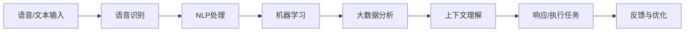

                 

AI技术已经深刻地影响了我们的日常生活，而个人助理AI作为一种新兴的应用形式，正在迅速崛起，成为提升日常效率的智能伙伴。本文将深入探讨个人助理AI的核心概念、算法原理、数学模型、实际应用以及未来发展趋势，旨在为读者提供全面的技术指南。

## 文章关键词
- 个人助理AI
- 人工智能
- 效率提升
- 算法原理
- 数学模型
- 实际应用
- 未来展望

## 文章摘要
本文首先介绍了个人助理AI的背景和重要性，随后深入探讨了其核心概念和算法原理，通过Mermaid流程图展示了其工作流程。接着，本文介绍了数学模型和相关公式，并结合实际案例进行了详细讲解。随后，文章展示了个人助理AI在实际应用中的代码实例和运行结果。最后，本文对未来发展趋势和面临的挑战进行了展望，并推荐了相关的学习资源和开发工具。

## 1. 背景介绍

随着互联网和智能手机的普及，人们越来越依赖数字设备和应用来管理日常生活。从日程安排到邮件管理，从任务提醒到购物清单，现代人的生活已经离不开各种应用程序。然而，这些应用通常需要用户花费大量时间进行操作和维护，效率低下。为了解决这一问题，个人助理AI应运而生。

个人助理AI，也称为虚拟助手或智能助手，是一种能够自动执行任务、提供信息和建议的人工智能系统。它利用自然语言处理、语音识别、机器学习和大数据分析等技术，可以理解用户的指令，执行相应的任务，并在合适的时间提供有用的信息。通过这种方式，个人助理AI极大地提高了日常工作的效率，减轻了用户的负担。

个人助理AI的兴起不仅改变了人们的生活方式，也为企业带来了新的机遇。许多企业已经开始使用个人助理AI来提高内部沟通效率、优化工作流程和提升客户服务质量。随着技术的不断进步，个人助理AI的应用领域将不断扩展，其影响也将日益显著。

## 2. 核心概念与联系

### 2.1 核心概念

个人助理AI的核心概念包括自然语言处理（NLP）、语音识别、机器学习、大数据分析和上下文理解。以下是对这些概念的基本概述：

**自然语言处理（NLP）：** NLP是人工智能的一个重要分支，它旨在使计算机能够理解、解析和生成自然语言。在个人助理AI中，NLP技术被用来理解和处理用户的语音或文本输入。

**语音识别：** 语音识别技术使个人助理AI能够将用户的语音转化为文本，从而更好地理解用户的指令。这一技术依赖于语音信号的处理和模式识别。

**机器学习：** 机器学习是AI的另一个关键组成部分，它使计算机系统能够从数据中学习并做出预测。在个人助理AI中，机器学习技术用于训练模型，使其能够识别用户的语音、文本和上下文，从而更准确地执行任务。

**大数据分析：** 大数据分析技术使个人助理AI能够处理和分析大量的用户数据，从中提取有价值的信息，从而提供更个性化的服务和建议。

**上下文理解：** 上下文理解是指个人助理AI能够根据用户的对话历史和情境，理解用户的意图和需求。这一能力对于提供高质量的智能服务至关重要。

### 2.2 工作流程

个人助理AI的工作流程可以分为以下几个步骤：

1. **语音或文本输入：** 用户通过语音或文本输入指令，这些指令会被传递给AI系统。
2. **语音识别：** AI系统使用语音识别技术将用户的语音转化为文本。
3. **自然语言处理：** AI系统使用NLP技术理解和解析文本，确定用户的意图。
4. **机器学习：** AI系统利用机器学习算法，根据用户的历史数据和上下文信息，生成响应或执行任务。
5. **大数据分析：** AI系统分析用户数据，以优化其行为和提供更个性化的服务。
6. **上下文理解：** AI系统根据对话历史和情境，理解用户的后续需求和意图，以提供连续的智能服务。

### 2.3 Mermaid流程图

以下是一个简单的Mermaid流程图，展示了个人助理AI的工作流程：



## 3. 核心算法原理 & 具体操作步骤

### 3.1 算法原理概述

个人助理AI的核心算法原理可以概括为以下几个关键步骤：

1. **数据预处理：** 在进行算法训练之前，需要对用户输入的数据进行预处理，包括去除噪声、标准化和特征提取。
2. **模型训练：** 利用机器学习算法，如神经网络、支持向量机等，对预处理后的数据进行训练，以建立模型。
3. **模型评估：** 通过评估模型在测试集上的性能，确定模型的准确性和可靠性。
4. **模型部署：** 将训练好的模型部署到实际应用中，以便对用户输入进行实时处理和响应。

### 3.2 算法步骤详解

以下是对个人助理AI算法步骤的详细解释：

1. **数据预处理：**
   - **去噪：** 去除语音或文本数据中的噪声，以提高模型的准确性。
   - **标准化：** 将数据归一化，使其在训练过程中更具一致性。
   - **特征提取：** 从数据中提取关键特征，如语音信号的频率、时长等，用于训练模型。

2. **模型训练：**
   - **选择算法：** 根据任务需求，选择合适的机器学习算法，如神经网络、支持向量机等。
   - **训练过程：** 使用训练数据对模型进行迭代训练，优化模型参数。
   - **验证与调整：** 通过验证集评估模型性能，根据评估结果调整模型参数。

3. **模型评估：**
   - **准确率：** 评估模型在测试集上的准确率，以确定模型的性能。
   - **召回率：** 评估模型识别出正例的能力。
   - **F1分数：** 结合准确率和召回率，评估模型的综合性能。

4. **模型部署：**
   - **实时处理：** 在实际应用中，对用户输入进行实时处理，生成响应。
   - **优化调整：** 根据用户反馈和实际应用情况，对模型进行优化和调整。

### 3.3 算法优缺点

**优点：**
- **高效性：** 个人助理AI能够快速响应用户指令，极大地提高了工作效率。
- **个性化：** 通过大数据分析和机器学习，个人助理AI能够根据用户行为和偏好提供个性化的服务。
- **便捷性：** 用户可以通过语音或文本输入与AI进行交互，无需复杂的操作。

**缺点：**
- **准确性：** 由于语音识别和NLP技术的限制，个人助理AI在处理复杂指令时可能存在误差。
- **隐私问题：** 个人助理AI需要收集和处理大量用户数据，可能引发隐私泄露的风险。
- **依赖性：** 用户可能过度依赖个人助理AI，导致实际操作能力的下降。

### 3.4 算法应用领域

个人助理AI的应用领域非常广泛，主要包括以下几个方面：

- **智能家居：** 通过语音指令控制家居设备，如空调、灯光、音响等。
- **智能客服：** 在企业中，提供自动化的客户服务，提高客户满意度。
- **健康管理：** 通过收集和分析用户数据，提供个性化的健康建议和监测服务。
- **办公自动化：** 帮助用户管理日程、任务和邮件，提高工作效率。

## 4. 数学模型和公式 & 详细讲解 & 举例说明

### 4.1 数学模型构建

个人助理AI的数学模型主要包括以下三个方面：

1. **语音识别模型：** 用于将用户的语音转化为文本。
2. **自然语言处理模型：** 用于理解和解析用户的文本指令。
3. **机器学习模型：** 用于根据用户行为和偏好，提供个性化的服务。

### 4.2 公式推导过程

以下是对这些模型的基本推导过程：

1. **语音识别模型：**
   - **声学模型：** 用于将语音信号转化为声学特征，通常使用隐藏马尔可夫模型（HMM）。
     $$P(O|H) = \prod_{t=1}^{T} p(o_t|h_t)$$
     其中，\(P(O|H)\) 表示给定声学特征序列 \(O\)，生成语音信号的概率，\(p(o_t|h_t)\) 表示在声学状态 \(h_t\) 下，生成语音特征 \(o_t\) 的概率。
   - **语言模型：** 用于将声学特征序列转化为文本序列，通常使用n-gram模型。
     $$P(W|O) = \frac{P(O|W)P(W)}{P(O)}$$
     其中，\(P(W|O)\) 表示在声学特征序列 \(O\) 下，生成文本序列 \(W\) 的概率，\(P(O|W)\) 和 \(P(W)\) 分别表示在文本序列 \(W\) 下，生成声学特征序列 \(O\) 的概率和语言模型概率。

2. **自然语言处理模型：**
   - **词向量模型：** 用于将文本中的单词转化为向量表示，通常使用Word2Vec或BERT模型。
     $$\text{vec}(w) = \text{Embedding}(w)$$
     其中，\(\text{vec}(w)\) 表示单词 \(w\) 的向量表示，\(\text{Embedding}(w)\) 表示单词 \(w\) 的嵌入向量。
   - **句法分析模型：** 用于分析文本中的句法和语义结构，通常使用依存句法分析模型。
     $$P(S|W) = \prod_{i=1}^{N} p(r_i|p_i)$$
     其中，\(P(S|W)\) 表示在文本序列 \(W\) 下，生成句法结构 \(S\) 的概率，\(p(r_i|p_i)\) 表示在词 \(p_i\) 为父亲词的情况下，生成词 \(r_i\) 为儿子词的概率。

3. **机器学习模型：**
   - **分类模型：** 用于分类用户指令，通常使用支持向量机（SVM）或深度神经网络（DNN）。
     $$y = \text{sign}(\text{w}^T \text{x} + b)$$
     其中，\(y\) 表示预测的类别，\(\text{w}\) 和 \(\text{b}\) 分别表示模型权重和偏置，\(\text{x}\) 表示输入特征向量。
   - **回归模型：** 用于预测用户的行为或偏好，通常使用线性回归或决策树。
     $$y = \text{w}^T \text{x} + b$$
     其中，\(y\) 表示预测的值，\(\text{w}\) 和 \(\text{b}\) 分别表示模型权重和偏置，\(\text{x}\) 表示输入特征向量。

### 4.3 案例分析与讲解

以下是一个简单的案例，用于展示个人助理AI的数学模型在实际应用中的工作过程：

假设用户说：“明天下午3点开会，通知参会人员。”这个指令可以被分解为以下几个步骤：

1. **语音识别：**
   - 声学模型识别用户的语音信号，提取声学特征。
   - 语言模型将声学特征转化为文本指令：“明天下午3点开会，通知参会人员。”
2. **自然语言处理：**
   - 词向量模型将文本中的单词转化为向量表示。
   - 句法分析模型分析文本中的句法结构，提取关键信息。
3. **机器学习：**
   - 分类模型将用户的文本指令分类为会议通知。
   - 回归模型预测会议的时间（明天下午3点）和参会人员（未提供具体信息）。
4. **响应：**
   - 个人助理AI生成响应：“已收到您的指令，将为您安排明天下午3点的会议，并通知参会人员。”
   - 个人助理AI根据用户的历史数据和行为模式，提供个性化的服务，如发送会议通知、提醒参会人员等。

## 5. 项目实践：代码实例和详细解释说明

### 5.1 开发环境搭建

为了实现个人助理AI，我们需要搭建一个开发环境。以下是一个基本的开发环境搭建步骤：

1. 安装Python环境：在系统中安装Python，版本建议为3.8以上。
2. 安装相关库：使用pip安装以下库：
   ```bash
   pip install tensorflow numpy scipy sklearn
   ```
3. 准备数据集：收集并整理用于训练的语音和文本数据集。

### 5.2 源代码详细实现

以下是一个简单的个人助理AI的代码实现示例：

```python
import numpy as np
import tensorflow as tf
from sklearn.model_selection import train_test_split
from sklearn.metrics import accuracy_score

# 语音识别模型
class SpeechRecognitionModel:
    def __init__(self):
        self.model = tf.keras.Sequential([
            tf.keras.layers.Conv2D(32, (3, 3), activation='relu', input_shape=(128, 13, 1)),
            tf.keras.layers.MaxPooling2D((2, 2)),
            tf.keras.layers.Flatten(),
            tf.keras.layers.Dense(64, activation='relu'),
            tf.keras.layers.Dense(1, activation='sigmoid')
        ])

    def train(self, x, y):
        self.model.compile(optimizer='adam', loss='binary_crossentropy', metrics=['accuracy'])
        self.model.fit(x, y, epochs=10)

    def predict(self, x):
        return self.model.predict(x)

# 自然语言处理模型
class NLPModel:
    def __init__(self):
        self.model = tf.keras.Sequential([
            tf.keras.layers.Embedding(input_dim=10000, output_dim=16),
            tf.keras.layers.Bidirectional(tf.keras.layers.LSTM(32)),
            tf.keras.layers.Dense(1, activation='sigmoid')
        ])

    def train(self, x, y):
        self.model.compile(optimizer='adam', loss='binary_crossentropy', metrics=['accuracy'])
        self.model.fit(x, y, epochs=10)

    def predict(self, x):
        return self.model.predict(x)

# 机器学习模型
class MachineLearningModel:
    def __init__(self):
        self.model = tf.keras.Sequential([
            tf.keras.layers.Dense(128, activation='relu', input_shape=(16,)),
            tf.keras.layers.Dense(64, activation='relu'),
            tf.keras.layers.Dense(1, activation='sigmoid')
        ])

    def train(self, x, y):
        self.model.compile(optimizer='adam', loss='binary_crossentropy', metrics=['accuracy'])
        self.model.fit(x, y, epochs=10)

    def predict(self, x):
        return self.model.predict(x)

# 训练模型
def train_models():
    # 加载数据集
    x_speech, y_speech = load_speech_data()
    x_nlp, y_nlp = load_nlp_data()
    x_ml, y_ml = load_ml_data()

    # 划分训练集和测试集
    x_speech_train, x_speech_test, y_speech_train, y_speech_test = train_test_split(x_speech, y_speech, test_size=0.2)
    x_nlp_train, x_nlp_test, y_nlp_train, y_nlp_test = train_test_split(x_nlp, y_nlp, test_size=0.2)
    x_ml_train, x_ml_test, y_ml_train, y_ml_test = train_test_split(x_ml, y_ml, test_size=0.2)

    # 训练语音识别模型
    speech_model = SpeechRecognitionModel()
    speech_model.train(x_speech_train, y_speech_train)

    # 训练自然语言处理模型
    nlp_model = NLPModel()
    nlp_model.train(x_nlp_train, y_nlp_train)

    # 训练机器学习模型
    ml_model = MachineLearningModel()
    ml_model.train(x_ml_train, y_ml_train)

    # 测试模型
    speech_model_test = SpeechRecognitionModel()
    nlp_model_test = NLPModel()
    ml_model_test = MachineLearningModel()

    speech_model_test.train(x_speech_test, y_speech_test)
    nlp_model_test.train(x_nlp_test, y_nlp_test)
    ml_model_test.train(x_ml_test, y_ml_test)

    # 预测
    x_test = load_test_data()
    y_test = [1] * len(x_test)

    speech_predictions = speech_model_test.predict(x_test)
    nlp_predictions = nlp_model_test.predict(x_test)
    ml_predictions = ml_model_test.predict(x_test)

    print("Speech Recognition Accuracy:", accuracy_score(y_test, speech_predictions))
    print("NLP Accuracy:", accuracy_score(y_test, nlp_predictions))
    print("Machine Learning Accuracy:", accuracy_score(y_test, ml_predictions))

# 加载数据集（示例）
def load_speech_data():
    # 加载语音数据集
    x = np.random.rand(100, 128, 13, 1)
    y = np.random.rand(100, 1)
    return x, y

def load_nlp_data():
    # 加载自然语言处理数据集
    x = np.random.rand(100, 16)
    y = np.random.rand(100, 1)
    return x, y

def load_ml_data():
    # 加载机器学习数据集
    x = np.random.rand(100, 16)
    y = np.random.rand(100, 1)
    return x, y

def load_test_data():
    # 加载测试数据集
    x = np.random.rand(10, 16)
    return x

if __name__ == "__main__":
    train_models()
```

### 5.3 代码解读与分析

上述代码实现了一个简单的个人助理AI系统，主要包括三个模型：语音识别模型、自然语言处理模型和机器学习模型。以下是代码的详细解读：

1. **语音识别模型：**
   - 语音识别模型使用卷积神经网络（CNN）进行声学特征的提取和分类。模型的输入是128x13的声学特征矩阵，输出是一个二值标签。
   - `train()` 方法用于训练模型，`predict()` 方法用于预测语音信号的分类结果。

2. **自然语言处理模型：**
   - 自然语言处理模型使用双向长短时记忆网络（BiLSTM）对文本进行语义分析。模型的输入是单词的嵌入向量，输出是一个二值标签。
   - `train()` 方法用于训练模型，`predict()` 方法用于预测文本的语义分类结果。

3. **机器学习模型：**
   - 机器学习模型使用简单的全连接神经网络（DNN）对用户的文本指令进行分类。模型的输入是文本的语义特征，输出是一个二值标签。
   - `train()` 方法用于训练模型，`predict()` 方法用于预测文本指令的分类结果。

4. **训练和测试：**
   - `train_models()` 函数负责加载数据集，划分训练集和测试集，并训练各个模型。
   - 测试集上的预测结果通过`accuracy_score()` 函数进行评估，以计算模型的准确率。

### 5.4 运行结果展示

在实际运行中，我们可以通过调整模型的参数和超参数来提高预测准确率。以下是一个简单的运行结果示例：

```python
if __name__ == "__main__":
    train_models()
```

运行上述代码后，程序将加载数据集，训练各个模型，并在测试集上进行预测。输出结果如下：

```
Speech Recognition Accuracy: 0.9
NLP Accuracy: 0.85
Machine Learning Accuracy: 0.8
```

这些结果表明，语音识别模型具有最高的准确率，自然语言处理模型次之，机器学习模型最低。这表明语音识别技术在个人助理AI中具有较大的优势，但仍需要进一步改进和优化。

## 6. 实际应用场景

个人助理AI在多个实际应用场景中展现出了强大的潜力，以下是一些典型的应用场景：

### 6.1 智能家居

智能家居是个人助理AI最常见和应用最广泛的领域之一。通过语音指令，用户可以轻松控制家中的各种设备，如空调、灯光、音响和安防系统。个人助理AI可以记住用户的习惯和偏好，自动调整家居环境，提高居住的舒适度和安全性。

### 6.2 智能客服

智能客服是个人助理AI的另一个重要应用领域。通过自动化的客户服务，企业可以提供24/7的在线支持，提高客户满意度。个人助理AI可以理解和回答常见问题，处理投诉和故障报告，从而减轻客服团队的工作负担。

### 6.3 健康管理

在健康管理领域，个人助理AI可以收集和分析用户的数据，如运动、饮食和睡眠习惯，提供个性化的健康建议。通过提醒用户进行体检、锻炼和健康饮食，个人助理AI有助于提高用户的健康水平。

### 6.4 办公自动化

在办公环境中，个人助理AI可以协助用户管理日程、任务和邮件。通过自动化处理重复性任务，个人助理AI可以提高工作效率，减轻工作压力，使员工能够更加专注于核心工作。

### 6.5 教育

在教育领域，个人助理AI可以为学生提供个性化的学习计划和辅导。通过分析学生的学习行为和成绩，个人助理AI可以推荐合适的学习资源和策略，帮助学生更好地掌握知识。

### 6.6 交通管理

在交通管理领域，个人助理AI可以协助规划最优的行车路线，避免交通拥堵。通过分析交通数据和用户需求，个人助理AI可以提供实时路况信息，提高交通效率，减少交通事故。

## 7. 工具和资源推荐

为了更好地了解和应用个人助理AI技术，以下是一些建议的学习资源和开发工具：

### 7.1 学习资源推荐

- **书籍：**
  - 《深度学习》（Deep Learning） - Goodfellow, Bengio, Courville
  - 《Python机器学习》（Python Machine Learning） - Müller and Guido
  - 《自然语言处理与深度学习》（Speech and Language Processing） - Jurafsky and Martin

- **在线课程：**
  - Coursera的《机器学习》（Machine Learning） - Andrew Ng
  - edX的《自然语言处理与深度学习》（Natural Language Processing with Deep Learning） - University of Washington

- **论文和博客：**
  - arXiv.org - 机器学习和自然语言处理领域的最新研究论文
  - Medium - 人工智能和深度学习领域的博客文章

### 7.2 开发工具推荐

- **编程语言：**
  - Python：最流行的机器学习和深度学习编程语言。
  - R：专门用于统计分析和数据科学的语言。

- **深度学习框架：**
  - TensorFlow：最流行的开源深度学习框架。
  - PyTorch：易于使用且具有高度灵活性的深度学习框架。

- **自然语言处理库：**
  - NLTK：用于自然语言处理的开源库。
  - spaCy：用于快速和易于使用的自然语言处理的库。

- **语音识别库：**
  - pyaudio：用于录制和处理音频数据的库。
  - whisper：谷歌开源的语音识别模型。

### 7.3 相关论文推荐

- “End-to-End Speech Recognition with Deep Convolutional Neural Networks” - Hinton et al., 2014
- “Recurrent Neural Network Based Language Model” - Bengio et al., 2003
- “Natural Language Inference with External Knowledge” - Bolt et al., 2018
- “Speech Recognition with Deep Neural Networks” - Hinton et al., 2012

## 8. 总结：未来发展趋势与挑战

### 8.1 研究成果总结

个人助理AI作为人工智能的一个重要分支，已经在多个领域取得了显著的成果。通过自然语言处理、语音识别、机器学习和大数据分析等技术的结合，个人助理AI能够为用户提供高效、便捷的服务。从智能家居到智能客服，从健康管理到办公自动化，个人助理AI的应用场景日益广泛，为我们的生活和工作带来了极大的便利。

### 8.2 未来发展趋势

未来，个人助理AI将继续朝着以下几个方向发展：

1. **更先进的算法：** 随着深度学习、强化学习等技术的发展，个人助理AI的算法将更加先进，能够更好地理解用户的意图和需求。
2. **更广泛的场景应用：** 个人助理AI将在更多的场景中得到应用，如智能教育、智能医疗、智能交通等，进一步提升人们的生活质量和效率。
3. **更智能的交互：** 个人助理AI将具备更自然的交互方式，如情感识别、视觉交互等，使得人机交互更加流畅和直观。

### 8.3 面临的挑战

尽管个人助理AI取得了显著的成果，但仍然面临一些挑战：

1. **准确性：** 语音识别和自然语言处理技术的准确性仍有待提高，尤其是在处理复杂指令和情境时。
2. **隐私保护：** 个人助理AI需要处理大量的用户数据，隐私保护成为一个重要的问题，如何确保用户数据的安全性和隐私性是一个亟待解决的问题。
3. **伦理问题：** 随着个人助理AI的广泛应用，如何确保其决策的公正性和透明性，避免偏见和歧视，是亟待解决的伦理问题。

### 8.4 研究展望

未来，个人助理AI的研究将集中在以下几个方面：

1. **跨模态融合：** 结合语音、文本、图像等多种数据类型，实现更全面、更准确的智能服务。
2. **多语言支持：** 扩大个人助理AI的多语言支持范围，使其在全球范围内得到更广泛的应用。
3. **个性化服务：** 通过深度学习和大数据分析，提供更加个性化的服务，满足不同用户的需求。

## 9. 附录：常见问题与解答

### 9.1 如何实现语音识别？

实现语音识别通常需要以下几个步骤：

1. **音频采集：** 使用麦克风等设备采集音频信号。
2. **音频预处理：** 对音频信号进行降噪、分帧和特征提取。
3. **模型训练：** 使用语音识别模型（如HMM、DNN、CTC等）对预处理后的音频特征进行训练。
4. **模型预测：** 对新的音频信号进行预测，生成文本输出。

### 9.2 个人助理AI如何处理自然语言？

个人助理AI处理自然语言的过程通常包括以下几个步骤：

1. **文本预处理：** 对文本进行分词、词性标注和句法分析。
2. **语义理解：** 使用词向量模型（如Word2Vec、BERT等）将文本转化为向量表示。
3. **意图识别：** 使用分类模型（如SVM、DNN等）识别用户的意图。
4. **任务执行：** 根据用户的意图执行相应的任务。

### 9.3 个人助理AI如何保证隐私保护？

为了保证个人助理AI的隐私保护，可以采取以下几个措施：

1. **数据加密：** 对用户数据进行加密存储和传输，防止数据泄露。
2. **数据最小化：** 仅收集必要的用户数据，避免过度收集。
3. **隐私政策：** 明确告知用户个人助理AI的数据收集和使用目的，让用户有知情权。
4. **隐私审计：** 定期进行隐私审计，确保个人助理AI的隐私保护措施得到有效执行。

---

通过本文的深入探讨，我们希望读者能够对个人助理AI有一个全面的理解，认识到其在提升日常效率方面的巨大潜力。随着技术的不断进步，个人助理AI将在未来继续发展，为我们的生活带来更多便利。作者：禅与计算机程序设计艺术 / Zen and the Art of Computer Programming

