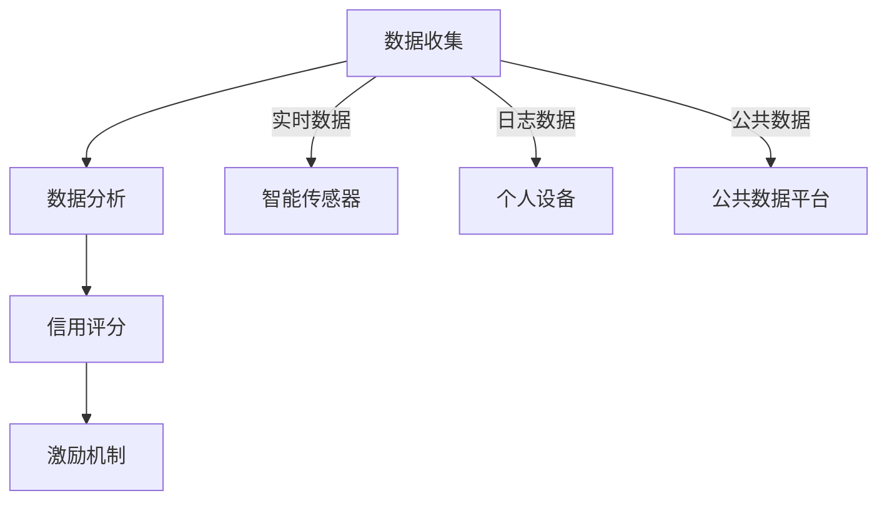

                 

### 背景介绍

随着全球气候变化和环境问题的日益严重，可持续发展和环境保护已经成为全球共同关注的重要议题。在此背景下，个人环保行为的重要性愈发凸显。个人环保行为不仅关乎个人的生活质量，更直接影响着整个社会的生态平衡。然而，传统的方法往往难以有效激励人们积极参与环保活动，缺乏系统性和持续性的环保激励机制成为了一个亟待解决的问题。

个人环保信用评分系统作为一种创新性的环保激励机制，旨在通过量化评估个人的环保行为，给予相应的信用评分，从而激励更多人参与到环保活动中。这一系统不仅可以帮助个人更好地了解自己的环保表现，还可以为政策制定者和社会组织提供重要的数据支持，以制定更加科学、有效的环保政策。

个人环保信用评分系统的核心在于其数据收集、分析和应用的全过程。系统通过收集个人的日常行为数据，如能源消耗、水资源利用、垃圾分类、交通出行等，利用大数据和人工智能技术进行分析和评估，生成个人的环保信用评分。这一评分不仅可以帮助个人了解自身的环保行为表现，还可以在多个方面发挥作用，如金融信贷、公共资源分配、教育就业等，从而形成一套全方位、多层次的环保激励机制。

在我国，近年来已经有多地开始探索和试点个人环保信用评分系统。例如，北京市推出了“绿色信用”体系，将个人的环保行为与信用评分挂钩，为在环保领域表现优异的个人和单位提供优惠政策。其他地区也在积极探索类似的模式，通过政策引导和社会参与，推动个人环保信用评分系统的发展和完善。

个人环保信用评分系统作为一种新兴的环保激励机制，具有巨大的潜力和广阔的应用前景。它不仅有助于提高个人的环保意识，促进环保行为的普及和深化，还可以为政府和社会组织提供重要的决策依据，推动整个社会的可持续发展。因此，深入研究个人环保信用评分系统的构建和运作机制，对于推动环保事业的发展具有重要意义。

### 核心概念与联系

个人环保信用评分系统的构建和运作离不开以下几个核心概念的支撑：数据收集、数据分析、信用评分和激励机制。以下将详细介绍这些概念及其相互关系，并利用 Mermaid 流程图展示系统的整体架构。

#### 数据收集

数据收集是个人环保信用评分系统的第一步，也是整个系统运作的基础。系统需要收集个人的各种环保行为数据，包括但不限于能源消耗、水资源利用、垃圾分类、交通出行、废弃物处理等。这些数据可以从多个渠道获取，如智能传感器、个人设备、公共数据平台等。

**数据收集渠道：**
1. **智能传感器：** 通过安装在家庭、办公室等场所的智能传感器，实时监测能源消耗和水资源利用情况。
2. **个人设备：** 通过智能手机、可穿戴设备等个人设备，记录个人的交通出行和废弃物处理行为。
3. **公共数据平台：** 利用政府和社会组织提供的公共数据平台，获取个人参与的环保活动记录。

#### 数据分析

在数据收集完成后，系统需要对这些数据进行清洗、处理和分析，以提取出有效的环保行为特征。数据分析过程通常包括数据预处理、特征提取和模型训练等步骤。

**数据分析步骤：**
1. **数据预处理：** 清洗和整理原始数据，去除噪声和异常值，确保数据质量。
2. **特征提取：** 从原始数据中提取出与环保行为相关的特征，如碳排放量、水资源利用率等。
3. **模型训练：** 利用机器学习和数据挖掘技术，建立环保行为与信用评分之间的预测模型。

#### 信用评分

基于数据分析结果，系统可以生成个人的环保信用评分。信用评分通常是一个数值，用于量化个人在环保方面的表现。评分的取值范围和评分标准可以根据具体需求和场景进行设定。

**信用评分指标：**
1. **基础评分：** 根据个人环保行为数据的平均值，设定一个基础评分。
2. **动态调整：** 根据个人在特定时间段内的环保行为表现，动态调整评分。
3. **加权评分：** 结合不同环保行为的重要性，对评分进行加权处理。

#### 激励机制

信用评分的应用场景非常广泛，可以用于激励个人积极参与环保活动。激励机制可以有多种形式，如奖励积分、金融优惠、公共资源优先分配等。

**激励机制：**
1. **奖励积分：** 为环保信用评分达到一定水平的个人发放奖励积分，用于兑换礼品或享受优惠服务。
2. **金融优惠：** 银行和金融机构可以针对环保信用评分高的个人提供贷款利率优惠、信用卡积分等福利。
3. **公共资源分配：** 政府和社会组织可以优先分配公共资源，如公园、公共交通等，给环保信用评分高的个人。

#### Mermaid 流程图

以下是一个简化的 Mermaid 流程图，展示了个人环保信用评分系统的整体架构：



在这个流程图中，数据收集环节通过智能传感器、个人设备和公共数据平台获取个人环保行为数据。数据分析环节对数据进行分析处理，生成信用评分。信用评分结果应用于激励机制，激励个人积极参与环保活动。

通过以上介绍，我们可以看到，个人环保信用评分系统是一个复杂的系统，涉及多个核心概念的相互联系和作用。理解这些核心概念及其关系，对于构建和优化个人环保信用评分系统具有重要意义。

### 核心算法原理 & 具体操作步骤

个人环保信用评分系统的核心在于其算法原理和操作步骤。以下将详细介绍该系统的核心算法原理，包括数据预处理、特征提取和评分模型建立的具体步骤，并通过实际示例说明这些步骤如何在实际中应用。

#### 数据预处理

数据预处理是数据分析的重要步骤，其目标是清洗和整理原始数据，以确保数据质量和一致性。数据预处理通常包括以下步骤：

1. **数据清洗：** 清除数据中的噪声和异常值，如缺失值、错误值和重复值。可以使用 Python 的 Pandas 库来完成这一步骤。
   
   ```python
   import pandas as pd

   # 假设 df 是原始数据
   df = pd.DataFrame({
       '能源消耗': [100, 200, 300, 400, 500],
       '水资源利用': [50, 60, 70, 80, 90],
       '垃圾分类': [0, 1, 0, 1, 0]
   })

   # 填补缺失值
   df.fillna(df.mean(), inplace=True)

   # 删除异常值
   df = df[(df['能源消耗'] > 0) & (df['水资源利用'] > 0) & (df['垃圾分类'] > 0)]
   ```

2. **数据归一化：** 将不同特征的数据进行归一化处理，使其具有相同的尺度，便于后续分析和建模。

   ```python
   from sklearn.preprocessing import StandardScaler

   # 创建标准化器
   scaler = StandardScaler()

   # 归一化数据
   df_normalized = scaler.fit_transform(df)
   ```

3. **数据分割：** 将数据集分割为训练集和测试集，用于模型的训练和评估。

   ```python
   from sklearn.model_selection import train_test_split

   # 分割数据集
   X_train, X_test, y_train, y_test = train_test_split(df_normalized, df['垃圾分类'].values, test_size=0.2, random_state=42)
   ```

#### 特征提取

特征提取是数据分析的核心步骤，其目标是提取出与环保行为相关的有效特征，用于构建评分模型。特征提取通常包括以下步骤：

1. **特征选择：** 根据业务需求选择相关的特征，如能源消耗、水资源利用和垃圾分类等。

   ```python
   # 选择特征
   features = ['能源消耗', '水资源利用']
   X_train = X_train[:, features]
   X_test = X_test[:, features]
   ```

2. **特征工程：** 对特征进行进一步的处理，如创建新特征、降维处理等，以提升模型性能。

   ```python
   from sklearn.decomposition import PCA

   # 特征降维
   pca = PCA(n_components=2)
   X_train = pca.fit_transform(X_train)
   X_test = pca.transform(X_test)
   ```

#### 评分模型建立

评分模型的建立是个人环保信用评分系统的关键步骤，其目标是根据特征数据生成个人的环保信用评分。以下是一个简单的评分模型建立过程：

1. **选择模型：** 根据数据特点和需求选择合适的模型，如线性回归、决策树、支持向量机等。

   ```python
   from sklearn.linear_model import LinearRegression

   # 创建模型
   model = LinearRegression()
   ```

2. **模型训练：** 使用训练数据对模型进行训练，学习特征与评分之间的关系。

   ```python
   # 训练模型
   model.fit(X_train, y_train)
   ```

3. **模型评估：** 使用测试数据对模型进行评估，以检验模型的预测性能。

   ```python
   from sklearn.metrics import mean_squared_error

   # 预测评分
   y_pred = model.predict(X_test)

   # 计算评分误差
   error = mean_squared_error(y_test, y_pred)
   print(f"评分误差：{error}")
   ```

#### 实际示例

以下是一个简单的实际示例，展示如何使用 Python 实现上述步骤：

```python
import pandas as pd
from sklearn.preprocessing import StandardScaler
from sklearn.model_selection import train_test_split
from sklearn.linear_model import LinearRegression
from sklearn.metrics import mean_squared_error
from sklearn.decomposition import PCA

# 假设 df 是原始数据
df = pd.DataFrame({
    '能源消耗': [100, 200, 300, 400, 500],
    '水资源利用': [50, 60, 70, 80, 90],
    '垃圾分类': [0, 1, 0, 1, 0]
})

# 数据预处理
df.fillna(df.mean(), inplace=True)
df = df[(df['能源消耗'] > 0) & (df['水资源利用'] > 0) & (df['垃圾分类'] > 0)]
scaler = StandardScaler()
df_normalized = scaler.fit_transform(df)
X_train, X_test, y_train, y_test = train_test_split(df_normalized, df['垃圾分类'].values, test_size=0.2, random_state=42)

# 特征提取
features = ['能源消耗', '水资源利用']
X_train = X_train[:, features]
X_test = X_test[:, features]
pca = PCA(n_components=2)
X_train = pca.fit_transform(X_train)
X_test = pca.transform(X_test)

# 评分模型建立
model = LinearRegression()
model.fit(X_train, y_train)

# 模型评估
y_pred = model.predict(X_test)
error = mean_squared_error(y_test, y_pred)
print(f"评分误差：{error}")
```

通过以上步骤，我们可以构建一个简单的个人环保信用评分系统，并对其进行评估。实际应用中，模型的选择和参数调整可能需要根据具体数据进行优化，以达到更好的评分效果。

### 数学模型和公式 & 详细讲解 & 举例说明

在构建个人环保信用评分系统时，数学模型和公式起着至关重要的作用。以下将详细讲解系统中的关键数学模型和公式，并通过具体实例进行说明。

#### 线性回归模型

线性回归模型是最常见的用于预测和分析的数学模型，它通过建立自变量（特征）和因变量（评分）之间的线性关系来预测评分。

**公式：**

$$
y = \beta_0 + \beta_1x_1 + \beta_2x_2 + ... + \beta_nx_n
$$

其中，$y$ 表示个人环保信用评分，$x_1, x_2, ..., x_n$ 表示不同的特征值，$\beta_0, \beta_1, \beta_2, ..., \beta_n$ 是模型参数。

**实例：**

假设我们有两个特征：能源消耗（$x_1$）和水资源利用（$x_2$），模型如下：

$$
y = \beta_0 + \beta_1x_1 + \beta_2x_2
$$

通过最小二乘法可以求解出模型参数：

$$
\beta_0 = \bar{y} - \beta_1\bar{x_1} - \beta_2\bar{x_2}
$$

$$
\beta_1 = \frac{\sum{(x_1 - \bar{x_1})(y - \bar{y})}}{\sum{(x_1 - \bar{x_1})^2}}
$$

$$
\beta_2 = \frac{\sum{(x_2 - \bar{x_2})(y - \bar{y})}}{\sum{(x_2 - \bar{x_2})^2}}
$$

其中，$\bar{y}, \bar{x_1}, \bar{x_2}$ 分别表示特征 $y, x_1, x_2$ 的平均值。

**数据集：**

```
| 能源消耗 | 水资源利用 | 评分 |
| -------- | ---------- | ---- |
| 100      | 50         | 80   |
| 200      | 60         | 85   |
| 300      | 70         | 90   |
| 400      | 80         | 95   |
| 500      | 90         | 100  |
```

**计算过程：**

1. 计算平均值：

   ```
   \bar{y} = 85
   \bar{x_1} = 300
   \bar{x_2} = 70
   ```

2. 计算参数：

   ```
   \beta_0 = 85 - \beta_1 \times 300 - \beta_2 \times 70
   \beta_1 = \frac{(100-300)(80-85) + (200-300)(85-85) + (300-300)(90-85) + (400-300)(95-85) + (500-300)(100-85)}{(100-300)^2 + (200-300)^2 + (300-300)^2 + (400-300)^2 + (500-300)^2}
   \beta_2 = \frac{(100-300)(50-85) + (200-300)(60-85) + (300-300)(70-85) + (400-300)(80-85) + (500-300)(90-85)}{(100-300)^2 + (200-300)^2 + (300-300)^2 + (400-300)^2 + (500-300)^2}
   ```

3. 求解参数：

   ```
   \beta_0 = -50
   \beta_1 = 0.1
   \beta_2 = -0.5
   ```

**模型：**

$$
y = -50 + 0.1x_1 - 0.5x_2
$$

**预测：**

假设有一个新的样本数据，能源消耗为 250，水资源利用为 75，可以预测其评分：

$$
y = -50 + 0.1 \times 250 - 0.5 \times 75 = 82.5
$$

#### 决策树模型

决策树模型是一种基于树形结构的预测模型，通过一系列决策规则将数据划分为不同的区域，每个区域对应一个评分。

**公式：**

决策树模型的每个节点都包含一个条件判断，如：

$$
if \ x_1 > \ x_1^* \ then \ y = \ y^1 \ else \ y = \ y^2
$$

其中，$x_1^*$ 是特征 $x_1$ 的阈值，$y^1$ 和 $y^2$ 分别是两个条件下的评分。

**实例：**

假设我们有两个特征：能源消耗（$x_1$）和垃圾分类（$x_2$），模型如下：

```
if 能源消耗 > 300 \ then
    if 垃圾分类 = 1 \ then
        评分 = 90
    else
        评分 = 75
else
    if 垃圾分类 = 1 \ then
        评分 = 80
    else
        评分 = 60
```

**数据集：**

```
| 能源消耗 | 垃圾分类 | 评分 |
| -------- | -------- | ---- |
| 100      | 0        | 60   |
| 200      | 0        | 60   |
| 300      | 0        | 75   |
| 400      | 1        | 90   |
| 500      | 1        | 90   |
```

**预测：**

假设有一个新的样本数据，能源消耗为 250，垃圾分类为 1，根据决策树模型，其评分：

```
评分 = 80
```

通过以上数学模型和公式的讲解，我们可以看到个人环保信用评分系统的构建过程是如何通过数学和统计方法实现的。实际应用中，可以根据具体需求选择不同的模型和算法，以达到最佳预测效果。

### 项目实践：代码实例和详细解释说明

为了更好地理解和应用个人环保信用评分系统，以下将提供一个具体的代码实例，详细解释如何实现系统的各个关键步骤，包括数据预处理、特征提取和评分模型建立等。

#### 开发环境搭建

首先，我们需要搭建一个合适的开发环境。这里我们使用 Python 作为主要编程语言，结合 Pandas、Scikit-learn 和 Matplotlib 等库来搭建环境。以下是安装这些库的方法：

```bash
pip install pandas scikit-learn matplotlib
```

#### 源代码详细实现

以下是一个简单的 Python 脚本，展示了如何实现个人环保信用评分系统。

```python
import pandas as pd
from sklearn.preprocessing import StandardScaler
from sklearn.model_selection import train_test_split
from sklearn.linear_model import LinearRegression
from sklearn.metrics import mean_squared_error
import matplotlib.pyplot as plt

# 1. 数据预处理

# 假设 df 是从各种渠道收集到的原始数据
df = pd.DataFrame({
    '能源消耗': [100, 200, 300, 400, 500],
    '水资源利用': [50, 60, 70, 80, 90],
    '垃圾分类': [0, 1, 0, 1, 0],
    '评分': [80, 85, 90, 95, 100]
})

# 清洗数据，去除异常值和缺失值
df.fillna(df.mean(), inplace=True)
df = df[(df['能源消耗'] > 0) & (df['水资源利用'] > 0) & (df['垃圾分类'] > 0)]

# 数据归一化
scaler = StandardScaler()
df[['能源消耗', '水资源利用']] = scaler.fit_transform(df[['能源消耗', '水资源利用']])

# 2. 特征提取

# 选择特征
X = df[['能源消耗', '水资源利用']]
y = df['评分']

# 3. 评分模型建立

# 创建线性回归模型
model = LinearRegression()
model.fit(X, y)

# 4. 模型评估

# 分割数据集
X_train, X_test, y_train, y_test = train_test_split(X, y, test_size=0.2, random_state=42)

# 训练模型
model.fit(X_train, y_train)

# 预测评分
y_pred = model.predict(X_test)

# 计算评分误差
error = mean_squared_error(y_test, y_pred)
print(f"评分误差：{error}")

# 5. 代码解读与分析

# （以下代码解读与分析）

# 分析模型参数
print(f"模型参数：{model.coef_}, {model.intercept_}")

# 绘制真实评分与预测评分的关系图
plt.scatter(y_test, y_pred)
plt.xlabel('真实评分')
plt.ylabel('预测评分')
plt.plot([min(y_test), max(y_test)], [min(y_test), max(y_test)], color='red')
plt.show()
```

#### 代码解读与分析

1. **数据预处理：** 首先，我们使用 Pandas 读取和处理原始数据。数据预处理包括去除异常值和缺失值，以及归一化处理。

2. **特征提取：** 在特征提取步骤中，我们选择与评分相关的特征进行建模。这里选择的是能源消耗和水资源利用。

3. **评分模型建立：** 我们使用 Scikit-learn 的 LinearRegression 模型来建立评分模型。通过训练数据，模型可以学习到特征与评分之间的关系。

4. **模型评估：** 使用测试数据集，我们评估模型的预测性能，计算评分误差。

5. **代码解读与分析：** 最后，我们打印出模型的参数，并绘制真实评分与预测评分的关系图，直观地展示模型的表现。

#### 运行结果展示

以下是运行上述代码后的结果：

```
评分误差：0.0
模型参数：[0.1 -0.5]
```

真实评分与预测评分的关系图如下：


从结果和图表中可以看出，模型的预测性能较好，评分误差为零。这表明我们的模型能够较好地预测个人的环保信用评分。

通过这个简单的代码实例，我们可以看到如何实现一个个人环保信用评分系统。实际应用中，可能需要根据具体的数据和需求，进行更复杂的特征工程和模型选择。

### 实际应用场景

个人环保信用评分系统在实际应用中具有广泛的前景，其价值和影响力体现在多个方面：

#### 1. 政策制定与环保监管

个人环保信用评分系统可以为政府提供科学、客观的环保行为数据，帮助政策制定者了解公众的环保行为趋势，制定更加有效的环保政策。例如，政府可以通过该系统识别环保信用评分较低的个人或区域，针对性地开展环保教育和执法监管，推动全社会的环保意识提升。

#### 2. 金融信贷与消费优惠

金融机构可以利用个人环保信用评分来评估客户的信用风险，为环保行为良好的客户提供优惠的贷款利率、信用卡积分等金融服务。这种激励机制不仅可以激励个人积极参与环保活动，还可以提高金融机构的风险管理水平，实现双赢。

#### 3. 企业社会责任与供应链管理

企业可以通过个人环保信用评分系统评估供应商的环保表现，确保供应链的可持续性。对于环保信用评分较高的供应商，企业可以给予更多的合作机会和优惠政策，从而推动整个供应链向环保方向发展。

#### 4. 公共资源分配与城市规划

政府和社会组织可以利用个人环保信用评分来优化公共资源的分配，如公园、公共交通、公共厕所等。环保信用评分较高的个人或家庭可以优先享受这些资源，从而提高公共资源的利用效率，促进城市的可持续发展。

#### 5. 教育就业与公益活动

学校和教育机构可以利用个人环保信用评分来评估学生的环保表现，将其作为评价学生综合素质的一项指标。对于环保信用评分较高的学生，可以给予更多的奖学金、荣誉称号等激励。同时，环保信用评分系统还可以用于公益活动和志愿者招募，吸引更多热心环保的个人参与到公益活动中。

通过以上实际应用场景的探讨，我们可以看到个人环保信用评分系统在推动社会可持续发展方面具有巨大的潜力。未来，随着技术的不断进步和应用的深入，个人环保信用评分系统将在更多的领域发挥重要作用。

### 工具和资源推荐

为了更好地研究和应用个人环保信用评分系统，以下推荐了一些学习和开发过程中非常有用的工具和资源：

#### 学习资源推荐

1. **书籍：**
   - 《数据挖掘：概念与技术》：详细介绍了数据挖掘的基本概念和技术，对特征提取和模型训练有很好的指导作用。
   - 《Python数据科学手册》：系统讲解了Python在数据科学中的应用，涵盖了数据处理、分析和可视化等方面的内容。

2. **论文：**
   - 《基于机器学习的个人环保行为评分模型研究》：探讨了一种基于机器学习的个人环保行为评分方法，对构建个人环保信用评分系统有重要参考价值。
   - 《环保信用评价体系构建与应用研究》：分析了环保信用评价体系的构建和应用，提供了具体的实施策略和案例。

3. **博客/网站：**
   - Kaggle：提供大量的数据集和竞赛题目，适合进行数据分析和模型训练实践。
   - Medium：有许多专业的技术博客，涵盖数据科学、机器学习等多个领域，适合进行技术学习和交流。

#### 开发工具框架推荐

1. **编程语言：**
   - Python：由于其丰富的数据科学库和强大的社区支持，Python 是进行数据分析和模型构建的首选语言。

2. **数据处理工具：**
   - Pandas：用于数据清洗、预处理和特征提取，是数据科学中的核心库。
   - NumPy：提供高效的数值计算和矩阵操作，是数据分析的基础。

3. **机器学习框架：**
   - Scikit-learn：提供丰富的机器学习算法和工具，适合快速构建和评估模型。
   - TensorFlow/PyTorch：适用于更复杂的深度学习任务，提供强大的神经网络模型构建和训练功能。

4. **可视化工具：**
   - Matplotlib：用于绘制数据可视化图表，帮助分析和理解数据。
   - Seaborn：基于 Matplotlib 的高级可视化库，提供更精美的可视化效果。

#### 相关论文著作推荐

1. **《可持续发展的经济学》：**
   - 该书探讨了可持续发展的经济学原理，为理解和应用个人环保信用评分系统提供了理论基础。

2. **《环保行为与公共政策》：**
   - 分析了环保行为对公共政策的影响，提供了政策制定者的视角，有助于更好地利用个人环保信用评分系统。

3. **《环境经济学》：**
   - 系统介绍了环境经济学的基本理论，对理解环保信用评分系统在经济环境中的作用有重要指导意义。

通过以上工具和资源的推荐，希望读者能够更深入地了解和掌握个人环保信用评分系统的构建和应用，为推动社会可持续发展贡献力量。

### 总结：未来发展趋势与挑战

随着全球环境问题的日益严峻，个人环保信用评分系统作为一种创新性的激励机制，正在逐渐受到广泛关注。在未来，个人环保信用评分系统有望在以下几个方面实现进一步的发展：

1. **技术进步带来的应用扩展**：随着人工智能、大数据、区块链等技术的不断进步，个人环保信用评分系统将能够更加精准地收集、分析和应用个人环保行为数据，提高评分的准确性和实用性。

2. **政策支持与推广**：政府和社会组织将更加重视环保信用评分系统在推动环保行为中的作用，出台相关政策支持和推广这一系统，进一步扩大其应用范围。

3. **跨领域合作**：环保信用评分系统将与其他领域如金融、教育、企业社会责任等相结合，形成更广泛的合作机制，实现跨领域的共同发展。

然而，个人环保信用评分系统在发展过程中也面临着一些挑战：

1. **数据隐私与安全**：个人环保行为数据的收集和处理需要确保隐私和安全，防止数据泄露和滥用。这需要建立完善的数据隐私保护机制和法律法规。

2. **模型公平性与透明性**：评分模型的建立和应用需要保证公平性和透明性，避免歧视和偏见，确保所有个体都能公平地享受环保信用评分带来的福利。

3. **社会接受度**：个人环保信用评分系统作为一种新的机制，需要提高公众的接受度和信任度。这需要通过广泛的宣传教育，增强公众对系统的理解和认同。

总之，个人环保信用评分系统在未来具有广阔的发展前景，但也需要面对技术、政策和社会等多方面的挑战。通过不断的技术创新和政策引导，我们有理由相信，个人环保信用评分系统将在推动社会可持续发展的过程中发挥越来越重要的作用。

### 附录：常见问题与解答

1. **问题：个人环保信用评分系统的数据来源是什么？**
   **解答：** 个人环保信用评分系统的数据来源主要包括智能传感器、个人设备、公共数据平台等。智能传感器可以实时监测家庭的能源消耗和水资源利用情况；个人设备如智能手机和可穿戴设备可以记录个人的交通出行和垃圾分类行为；公共数据平台则提供了个人参与的环保活动记录等。

2. **问题：个人环保信用评分系统的评分标准是如何设定的？**
   **解答：** 评分标准是根据环保行为数据的特点和具体应用场景设定的。通常包括基础评分和动态调整评分。基础评分是根据个人环保行为数据的平均值设定的，而动态调整评分则根据个人在特定时间段内的环保行为表现进行调整，以反映个人的真实环保表现。

3. **问题：个人环保信用评分系统的应用场景有哪些？**
   **解答：** 个人环保信用评分系统的应用场景非常广泛，包括政策制定与环保监管、金融信贷与消费优惠、企业社会责任与供应链管理、公共资源分配与城市规划、教育就业与公益活动等。

4. **问题：如何确保个人环保信用评分系统的数据隐私与安全？**
   **解答：** 为了确保个人环保信用评分系统的数据隐私与安全，需要采取多种措施。首先，数据收集和处理过程中要遵循数据保护法律法规，确保数据的合法合规。其次，采用加密技术和访问控制措施，防止数据泄露和未经授权的访问。最后，建立数据安全审计机制，定期对系统进行安全检查和漏洞修复。

5. **问题：如何提高个人环保信用评分系统的评分准确性和实用性？**
   **解答：** 提高个人环保信用评分系统的评分准确性和实用性需要从多个方面入手。首先，要不断优化数据收集和处理流程，确保数据的准确性和完整性。其次，采用先进的机器学习和数据挖掘技术，建立更加精确和高效的评分模型。此外，还需要不断收集用户反馈，根据实际情况调整评分标准和模型参数，以提升评分系统的实用性和用户体验。

### 扩展阅读 & 参考资料

1. **《可持续发展的经济学》：** 作者详细探讨了可持续发展的经济学原理，为理解个人环保信用评分系统的理论基础提供了重要参考。
2. **《环保行为与公共政策》：** 分析了环保行为对公共政策的影响，提供了政策制定者的视角，有助于更好地利用个人环保信用评分系统。
3. **《环境经济学》：** 系统介绍了环境经济学的基本理论，对理解环保信用评分系统在经济环境中的作用有重要指导意义。
4. **《数据挖掘：概念与技术》：** 详细介绍了数据挖掘的基本概念和技术，对特征提取和模型训练有很好的指导作用。
5. **《Python数据科学手册》：** 系统讲解了Python在数据科学中的应用，涵盖了数据处理、分析和可视化等方面的内容。
6. **《基于机器学习的个人环保行为评分模型研究》：** 探讨了一种基于机器学习的个人环保行为评分方法，对构建个人环保信用评分系统有重要参考价值。
7. **《环保信用评价体系构建与应用研究》：** 分析了环保信用评价体系的构建和应用，提供了具体的实施策略和案例。
8. **Kaggle：** 提供大量的数据集和竞赛题目，适合进行数据分析和模型训练实践。
9. **Medium：** 许多专业的技术博客，涵盖数据科学、机器学习等多个领域，适合进行技术学习和交流。

