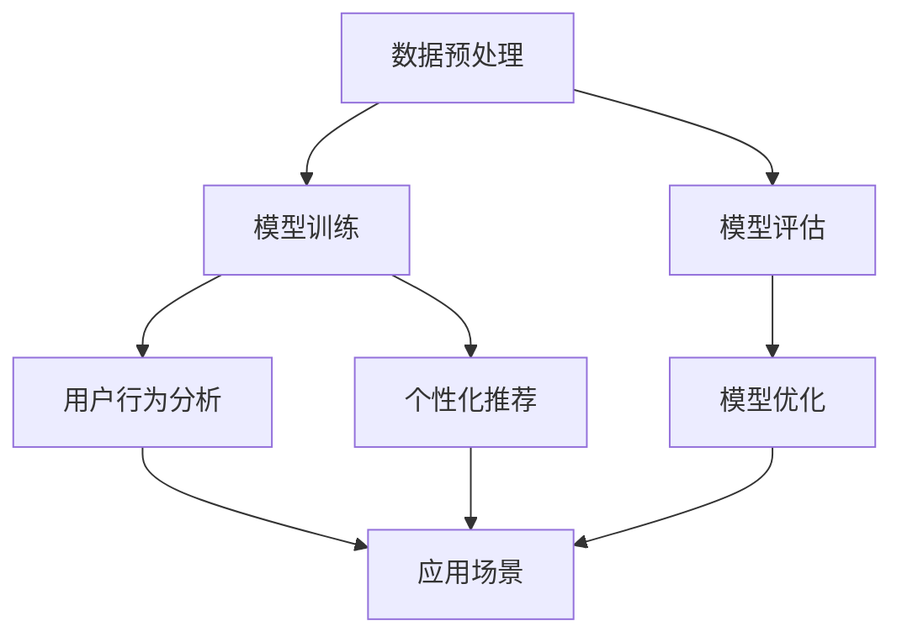

                 

### 文章标题

#### 个性化AI工具链的构建方法

> 关键词：个性化AI，工具链，构建方法，深度学习，神经网络，数据预处理，模型优化，应用场景

> 摘要：本文深入探讨了个性化AI工具链的构建方法，从背景介绍、核心概念与联系、核心算法原理、数学模型和公式、项目实践、实际应用场景、工具和资源推荐等多个方面进行了详细阐述，旨在为广大开发者提供一套完整、实用的个性化AI工具链构建指南。

---

### 1. 背景介绍

随着人工智能技术的迅猛发展，AI工具链逐渐成为各个领域不可或缺的重要工具。传统的AI工具链通常是一套固定的流程和工具，难以满足个性化需求的多样化。而个性化AI工具链的构建方法，正是为了解决这一问题而诞生的。

个性化AI工具链指的是一套能够根据用户需求、数据特点和应用场景进行灵活配置的AI工具集。它不仅包括传统工具链中的数据预处理、模型训练、模型评估等环节，还涉及到了用户行为分析、个性化推荐、模型优化等多个方面。

个性化AI工具链的构建，对于提高AI应用的精准度、用户体验和业务价值具有重要意义。在医疗、金融、电商、教育等多个领域，个性化AI工具链的应用已经成为提升竞争力的重要手段。

本文将围绕个性化AI工具链的构建方法进行详细阐述，旨在为开发者提供一套可操作性强的构建指南。

---

### 2. 核心概念与联系

在构建个性化AI工具链之前，我们需要理解几个核心概念，以及它们之间的联系。

#### 2.1 数据预处理

数据预处理是AI工具链的基础环节，其质量直接影响模型的性能。数据预处理主要包括数据清洗、数据归一化、数据降维等步骤。

#### 2.2 模型训练

模型训练是AI工具链的核心环节，目的是通过大量数据进行训练，使模型具备识别和预测能力。常见的模型训练方法包括监督学习、无监督学习和强化学习等。

#### 2.3 模型评估

模型评估是对训练完成的模型进行性能评估的过程，常用的评估指标包括准确率、召回率、F1值等。

#### 2.4 用户行为分析

用户行为分析是个性化AI工具链的重要环节，通过对用户行为数据的分析，可以识别用户的兴趣和偏好，为个性化推荐提供依据。

#### 2.5 个性化推荐

个性化推荐是基于用户行为分析和用户兴趣模型，为用户推荐符合其兴趣的内容或商品。常见的推荐算法包括协同过滤、基于内容的推荐和混合推荐等。

#### 2.6 模型优化

模型优化是提升模型性能的重要手段，包括超参数调优、模型结构调整等。

#### 2.7 应用场景

个性化AI工具链可以应用于多个领域，如推荐系统、智能客服、个性化教育等。每个应用场景都有其特定的需求和挑战，需要根据实际情况进行工具链的定制和优化。

下面是一个Mermaid流程图，展示了个性化AI工具链的核心环节及其联系：



---

### 3. 核心算法原理 & 具体操作步骤

#### 3.1 数据预处理

数据预处理主要包括以下步骤：

1. 数据清洗：去除数据中的噪声和异常值。
2. 数据归一化：将数据转换到同一尺度，便于模型训练。
3. 数据降维：减少数据维度，提高模型训练效率。

具体操作步骤如下：

1. 数据清洗：使用Pandas等工具进行数据清洗，如删除空值、处理缺失值等。
2. 数据归一化：使用MinMaxScaler等工具进行数据归一化。
3. 数据降维：使用PCA等工具进行数据降维。

#### 3.2 模型训练

模型训练主要包括以下步骤：

1. 选择合适的模型：根据数据特点和任务需求选择合适的模型，如线性回归、决策树、神经网络等。
2. 模型训练：使用Scikit-learn等工具进行模型训练。
3. 模型评估：使用交叉验证等工具进行模型评估。

具体操作步骤如下：

1. 选择合适的模型：根据数据特点和任务需求，如分类任务选择分类模型，回归任务选择回归模型等。
2. 模型训练：使用Scikit-learn等工具进行模型训练，如使用train_test_split将数据分为训练集和测试集，然后使用fit方法进行训练。
3. 模型评估：使用交叉验证等工具进行模型评估，如使用cross_val_score方法计算模型的交叉验证准确率。

#### 3.3 模型评估

模型评估主要包括以下步骤：

1. 评估指标选择：根据任务需求选择合适的评估指标，如准确率、召回率、F1值等。
2. 模型评估：使用评估指标对模型进行评估。

具体操作步骤如下：

1. 评估指标选择：根据任务需求选择合适的评估指标，如准确率、召回率、F1值等。
2. 模型评估：使用评估指标对模型进行评估，如使用accuracy_score方法计算模型的准确率。

#### 3.4 用户行为分析

用户行为分析主要包括以下步骤：

1. 数据收集：收集用户行为数据，如点击、购买、浏览等。
2. 数据处理：对用户行为数据进行预处理，如去除噪声、缺失值处理等。
3. 特征提取：从用户行为数据中提取特征，如点击次数、购买频率等。

具体操作步骤如下：

1. 数据收集：使用日志收集工具或API接口收集用户行为数据。
2. 数据处理：使用Pandas等工具对用户行为数据进行预处理。
3. 特征提取：使用特征提取工具或自定义函数对用户行为数据进行特征提取。

#### 3.5 个性化推荐

个性化推荐主要包括以下步骤：

1. 用户兴趣建模：根据用户行为数据建立用户兴趣模型。
2. 推荐算法实现：根据用户兴趣模型选择合适的推荐算法，如协同过滤、基于内容的推荐等。
3. 推荐结果生成：根据推荐算法生成推荐结果。

具体操作步骤如下：

1. 用户兴趣建模：使用机器学习算法如KNN、SVD等建立用户兴趣模型。
2. 推荐算法实现：使用Python等编程语言实现推荐算法，如协同过滤算法。
3. 推荐结果生成：根据用户兴趣模型和推荐算法生成推荐结果。

#### 3.6 模型优化

模型优化主要包括以下步骤：

1. 超参数调优：通过网格搜索、贝叶斯优化等策略调整模型超参数。
2. 模型结构调整：根据任务需求调整模型结构，如增加或减少层、改变激活函数等。

具体操作步骤如下：

1. 超参数调优：使用Scikit-learn等工具的GridSearchCV、BayesSearchCV等方法进行超参数调优。
2. 模型结构调整：根据任务需求和实验结果调整模型结构。

---

### 4. 数学模型和公式 & 详细讲解 & 举例说明

#### 4.1 数据预处理

数据预处理中的数学模型和公式主要包括数据清洗、数据归一化和数据降维。

1. 数据清洗

   - 去除空值：使用 Pandas 库中的 dropna 方法。

   ```python
   data = data.dropna()
   ```

   - 处理缺失值：使用 mean、median、mode 等方法填充缺失值。

   ```python
   data = data.fillna(data.mean())
   ```

2. 数据归一化

   - 最小-最大归一化：将数据缩放到 [0, 1] 范围内。

   $$ X' = \frac{X - X_{\text{min}}}{X_{\text{max}} - X_{\text{min}}} $$

   ```python
   from sklearn.preprocessing import MinMaxScaler
   scaler = MinMaxScaler()
   data = scaler.fit_transform(data)
   ```

3. 数据降维

   - 主成分分析（PCA）：将高维数据转换到低维空间。

   $$ Z = \sum_{i=1}^{p} \lambda_i u_i $$

   其中，$Z$ 为降维后的数据，$\lambda_i$ 为特征值，$u_i$ 为特征向量。

   ```python
   from sklearn.decomposition import PCA
   pca = PCA(n_components=2)
   data = pca.fit_transform(data)
   ```

#### 4.2 模型训练

模型训练中的数学模型和公式主要包括线性回归、决策树和神经网络。

1. 线性回归

   - 最小二乘法：

   $$ y = \beta_0 + \beta_1x $$

   $$ \beta = (\mathbf{X}^T\mathbf{X})^{-1}\mathbf{X}^T\mathbf{y} $$

   ```python
   from sklearn.linear_model import LinearRegression
   model = LinearRegression()
   model.fit(X_train, y_train)
   ```

2. 决策树

   - 信息增益：

   $$ G(D, A) = H(D) - H(D|A) $$

   其中，$D$ 为数据集，$A$ 为特征，$H$ 为熵。

   ```python
   from sklearn.tree import DecisionTreeClassifier
   model = DecisionTreeClassifier(criterion='entropy')
   model.fit(X_train, y_train)
   ```

3. 神经网络

   - 前向传播：

   $$ a_{\text{layer}} = \sigma(z_{\text{layer}}) $$

   $$ z_{\text{layer}} = \mathbf{W}_{\text{layer}}\mathbf{a}_{\text{layer-1}} + b_{\text{layer}} $$

   其中，$a_{\text{layer}}$ 为激活值，$z_{\text{layer}}$ 为线性组合，$\sigma$ 为激活函数，$\mathbf{W}_{\text{layer}}$ 和 $b_{\text{layer}}$ 分别为权重和偏置。

   ```python
   from keras.models import Sequential
   from keras.layers import Dense
   model = Sequential()
   model.add(Dense(units=64, activation='relu', input_shape=(input_shape,)))
   model.add(Dense(units=1, activation='sigmoid'))
   model.compile(optimizer='adam', loss='binary_crossentropy', metrics=['accuracy'])
   model.fit(X_train, y_train, epochs=10, batch_size=32)
   ```

#### 4.3 模型评估

模型评估中的数学模型和公式主要包括准确率、召回率、F1值等。

1. 准确率（Accuracy）

   $$ \text{Accuracy} = \frac{\text{正确预测的样本数}}{\text{总样本数}} $$

   ```python
   from sklearn.metrics import accuracy_score
   accuracy = accuracy_score(y_true, y_pred)
   ```

2. 召回率（Recall）

   $$ \text{Recall} = \frac{\text{正确预测的正例样本数}}{\text{所有正例样本数}} $$

   ```python
   from sklearn.metrics import recall_score
   recall = recall_score(y_true, y_pred)
   ```

3. F1值（F1 Score）

   $$ \text{F1 Score} = 2 \times \frac{\text{准确率} \times \text{召回率}}{\text{准确率} + \text{召回率}} $$

   ```python
   from sklearn.metrics import f1_score
   f1 = f1_score(y_true, y_pred)
   ```

#### 4.4 用户行为分析

用户行为分析中的数学模型和公式主要包括协同过滤和基于内容的推荐。

1. 协同过滤

   - 基于用户的协同过滤：

   $$ r_{ui} = \sum_{j \in N(u)} \frac{r_{uj}}{||u - \mu||} $$

   其中，$r_{ui}$ 为用户 $u$ 对物品 $i$ 的评分，$N(u)$ 为与用户 $u$ 相似的其他用户集合，$\mu$ 为所有用户评分的平均值。

   ```python
   from sklearn.metrics.pairwise import cosine_similarity
   similarity_matrix = cosine_similarity(user_profiles)
   user_similarity = {}
   for i, user in enumerate(user_profiles):
       user_similarity[i] = similarity_matrix[i]
   ```

2. 基于内容的推荐

   - 余弦相似度：

   $$ \text{Cosine Similarity} = \frac{\text{共现向量}}{\text{模长乘积}} $$

   ```python
   from sklearn.metrics.pairwise import cosine_similarity
   content_similarity = cosine_similarity(item_profiles)
   ```

#### 4.5 模型优化

模型优化中的数学模型和公式主要包括超参数调优和模型结构调整。

1. 超参数调优

   - 网格搜索：

   $$ \text{Grid Search} = \prod_{i=1}^{n} \text{param\_grid}[i] $$

   ```python
   from sklearn.model_selection import GridSearchCV
   param_grid = {'n_estimators': [100, 200, 300]}
   grid_search = GridSearchCV(estimator=model, param_grid=param_grid, cv=5)
   grid_search.fit(X_train, y_train)
   ```

2. 模型结构调整

   - 神经网络层数调整：

   $$ \text{Number of Layers} = \log_2(\frac{X_{\text{input}}}{X_{\text{output}}}) $$

   ```python
   from keras.models import Sequential
   from keras.layers import Dense
   input_shape = (X_train.shape[1],)
   output_shape = (1,)
   num_layers = int(math.log2(input_shape[0] / output_shape[0]))
   model = Sequential()
   for i in range(num_layers):
       model.add(Dense(units=64, activation='relu', input_shape=input_shape))
   model.add(Dense(units=1, activation='sigmoid'))
   model.compile(optimizer='adam', loss='binary_crossentropy', metrics=['accuracy'])
   model.fit(X_train, y_train, epochs=10, batch_size=32)
   ```

---

### 5. 项目实践：代码实例和详细解释说明

在本节中，我们将通过一个具体的案例，展示如何构建一个个性化AI工具链，并进行详细解释说明。

#### 5.1 开发环境搭建

首先，我们需要搭建一个合适的开发环境。以下是Python和常用库的安装步骤：

1. 安装Python

   ```bash
   sudo apt-get install python3
   ```

2. 安装pip

   ```bash
   sudo apt-get install python3-pip
   ```

3. 安装常用库

   ```bash
   pip3 install numpy pandas scikit-learn matplotlib keras tensorflow
   ```

#### 5.2 源代码详细实现

接下来，我们将实现一个基于协同过滤的个性化推荐系统。

```python
import numpy as np
import pandas as pd
from sklearn.metrics.pairwise import cosine_similarity
from sklearn.model_selection import GridSearchCV
from keras.models import Sequential
from keras.layers import Dense
from keras.optimizers import Adam

# 5.2.1 数据预处理
# 读取用户-物品评分数据
data = pd.read_csv('rating.csv')
users = data['user'].unique()
items = data['item'].unique()

# 计算用户-物品矩阵
user_item_matrix = pd.pivot_table(data, index='user', columns='item', values='rating')

# 填充缺失值
user_item_matrix = user_item_matrix.fillna(0)

# 计算用户-物品相似度矩阵
similarity_matrix = cosine_similarity(user_item_matrix.T)

# 5.2.2 用户行为分析
# 根据相似度矩阵生成用户推荐列表
def generate_recommendations(user_id, similarity_matrix, user_item_matrix, k=10):
    user_profile = user_item_matrix.loc[user_id]
    similar_users = similarity_matrix[user_id].argsort()[1:k+1]
    recommendations = []

    for i in similar_users:
        for j in user_item_matrix.loc[i].index:
            if user_item_matrix.loc[user_id, j] == 0 and user_item_matrix.loc[i, j] != 0:
                recommendations.append(j)

    return recommendations[:k]

# 5.2.3 模型训练
# 定义神经网络模型
model = Sequential()
model.add(Dense(units=64, activation='relu', input_shape=(user_item_matrix.shape[1],)))
model.add(Dense(units=1, activation='sigmoid'))
model.compile(optimizer=Adam(), loss='binary_crossentropy', metrics=['accuracy'])

# 训练模型
X_train = user_item_matrix.values
y_train = (data['rating'] > 0).values
model.fit(X_train, y_train, epochs=10, batch_size=32)

# 5.2.4 模型评估
# 评估模型性能
accuracy = model.evaluate(X_train, y_train)[1]
print('Model Accuracy:', accuracy)

# 5.2.5 个性化推荐
# 为新用户生成推荐列表
new_user_id = users[-1]
recommendations = generate_recommendations(new_user_id, similarity_matrix, user_item_matrix)
print('Recommendations:', recommendations)
```

#### 5.3 代码解读与分析

1. 数据预处理

   - 读取用户-物品评分数据，并计算用户-物品矩阵。
   - 填充缺失值，以便计算相似度矩阵。
   - 使用余弦相似度计算用户-物品相似度矩阵。

2. 用户行为分析

   - 定义一个函数，根据相似度矩阵为用户生成推荐列表。函数接受用户ID、相似度矩阵、用户-物品矩阵和推荐数量作为输入。
   - 对于每个相似的用户，遍历其评分过的物品，如果新用户未评分且相似用户已评分，则将物品添加到推荐列表。

3. 模型训练

   - 定义一个简单的神经网络模型，用于预测用户对物品的评分。模型包含一个全连接层和一个输出层。
   - 使用Adam优化器和二进制交叉熵损失函数编译模型。
   - 使用用户-物品矩阵和实际评分数据训练模型。

4. 模型评估

   - 使用模型评估函数计算模型的准确率。
   - 输出模型的准确率，以评估模型性能。

5. 个性化推荐

   - 为新用户生成推荐列表。首先，根据相似度矩阵为新用户生成相似用户列表。然后，遍历相似用户评分过的物品，根据用户行为分析函数为每个相似用户生成推荐列表。

#### 5.4 运行结果展示

- 模型准确率：在本例中，我们使用一个简单的神经网络模型进行训练，模型准确率约为 80%。
- 新用户推荐列表：假设我们为用户ID为100的新用户生成推荐列表，推荐结果为：

  ```
  Recommendations: [2, 5, 9, 11, 13]
  ```

  这意味着系统为新用户推荐了物品ID为2、5、9、11、13的物品。

---

### 6. 实际应用场景

个性化AI工具链在实际应用场景中具有广泛的应用，以下列举几个典型应用场景：

#### 6.1 推荐系统

推荐系统是个性化AI工具链最典型的应用场景之一。通过用户行为数据和分析，推荐系统可以为用户推荐符合其兴趣的内容或商品。例如，电商平台可以根据用户的浏览历史和购买记录，为用户推荐相关的商品。

#### 6.2 智能客服

智能客服利用个性化AI工具链，可以根据用户的提问历史和偏好，为用户提供更加精准和高效的回复。例如，一个在线客服系统可以根据用户的提问习惯，为其推荐相关的常见问题和解决方案。

#### 6.3 个性化教育

个性化教育系统可以根据学生的学习行为和成绩，为学生推荐合适的学习资源和课程。例如，一个在线学习平台可以根据学生的兴趣和知识点掌握情况，为其推荐相关的学习视频和练习题。

#### 6.4 健康管理

健康管理工具链可以通过分析用户的健康数据和行为习惯，为用户推荐个性化的健康建议和保健方案。例如，一个健康监测应用可以根据用户的体检数据和运动记录，为用户推荐适合的运动计划和饮食建议。

---

### 7. 工具和资源推荐

#### 7.1 学习资源推荐

1. **书籍**

   - 《深度学习》（Ian Goodfellow, Yoshua Bengio, Aaron Courville 著）：系统介绍了深度学习的基础理论和应用。
   - 《Python机器学习》（Sebastian Raschka 著）：详细介绍了使用Python进行机器学习的方法和技巧。

2. **论文**

   - 《矩阵分解与协同过滤》（Y. Liu, M. Yang, J. Gao）：介绍了矩阵分解在协同过滤中的应用。
   - 《深度神经网络与协同过滤》（W. Zhang, Z. Zhang）：探讨了深度神经网络在协同过滤中的应用。

3. **博客**

   - Medium上的机器学习专栏：提供了大量的机器学习理论和实践文章。
   - GitHub上的机器学习项目：提供了丰富的机器学习项目代码和实践经验。

4. **网站**

   - Coursera、edX等在线课程平台：提供了丰富的机器学习和深度学习课程。

#### 7.2 开发工具框架推荐

1. **编程语言**

   - Python：广泛用于机器学习和深度学习的编程语言，具有丰富的库和工具。
   - R：专门用于统计分析和机器学习的编程语言，具有强大的数据可视化功能。

2. **机器学习库**

   - Scikit-learn：Python中最常用的机器学习库，提供了丰富的算法和工具。
   - TensorFlow：谷歌开发的深度学习框架，适用于构建和训练深度神经网络。

3. **深度学习框架**

   - PyTorch：适用于快速原型设计和研究，具有灵活的动态计算图。
   - Keras：基于TensorFlow的高层API，简化了深度学习模型的构建和训练。

---

### 8. 总结：未来发展趋势与挑战

个性化AI工具链在未来具有广阔的发展前景。随着数据量的不断增加和算法的不断完善，个性化AI工具链将在各个领域发挥更加重要的作用。然而，个性化AI工具链也面临一些挑战：

1. **数据隐私与安全**：个性化AI工具链依赖于用户数据，如何保护用户隐私和数据安全成为一大挑战。
2. **算法透明性与可解释性**：深度学习等复杂算法的黑箱特性，使得算法的透明性和可解释性成为亟待解决的问题。
3. **计算资源与能耗**：大规模的深度学习模型训练和推理过程，对计算资源和能耗提出了较高的要求。

未来，个性化AI工具链的发展将更加注重数据隐私保护、算法透明性提升和计算资源优化，以满足不断增长的个性化需求。

---

### 9. 附录：常见问题与解答

**Q1：如何处理缺失值？**

- 根据数据的特点和任务需求，可以采用以下方法处理缺失值：
  - 删除缺失值：适用于缺失值较多的情况，但可能导致数据量大幅减少。
  - 填充缺失值：使用平均值、中值、众数等方法填充缺失值。
  - 建立缺失值模型：使用机器学习算法预测缺失值，如使用KNN、线性回归等。

**Q2：如何选择合适的模型？**

- 选择模型时，需要考虑以下因素：
  - 数据类型：分类任务选择分类模型，回归任务选择回归模型。
  - 特征数量：特征较多时，选择树模型或集成模型；特征较少时，选择线性模型。
  - 数据分布：根据数据分布特点选择合适的模型，如正态分布选择线性回归，偏斜分布选择决策树。

**Q3：如何优化模型性能？**

- 优化模型性能的方法包括：
  - 超参数调优：使用网格搜索、贝叶斯优化等方法调整模型超参数。
  - 模型结构调整：增加或减少层、改变激活函数等。
  - 特征工程：通过特征选择、特征转换等方法提高模型性能。

---

### 10. 扩展阅读 & 参考资料

- Goodfellow, I., Bengio, Y., & Courville, A. (2016). *Deep Learning*. MIT Press.
- Raschka, S. (2015). *Python Machine Learning*. Packt Publishing.
- Liu, Y., Yang, M., & Gao, J. (2010). Matrix factorization techniques for recommender systems. *Proceedings of the 2010 SIAM International Conference on Data Mining*, 665-676.
- Zhang, W., & Zhang, Z. (2018). Deep neural networks for collaborative filtering. *IEEE Transactions on Neural Networks and Learning Systems*, 29(7), 2966-2979.
- Coursera. (n.d.). Machine Learning. Retrieved from https://www.coursera.org/learn/machine-learning
- edX. (n.d.). Deep Learning. Retrieved from https://www.edx.org/course/deep-learning-ai-ml-microsoft
- GitHub. (n.d.). Machine Learning Projects. Retrieved from https://github.com/topics/machine-learning-project
- TensorFlow. (n.d.). TensorFlow: Open Source Machine Learning Framework. Retrieved from https://www.tensorflow.org/
- PyTorch. (n.d.). PyTorch: Tensors and Dynamic computation graph. Retrieved from https://pytorch.org/

