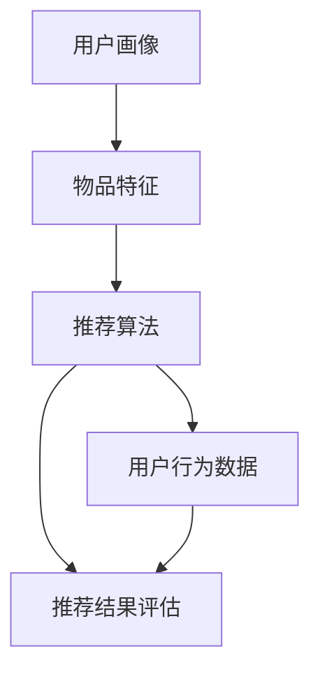

                 

### 背景介绍

个性化推荐系统在当今互联网时代扮演着至关重要的角色，其应用范围广泛，从电子商务到社交媒体、音乐流媒体和视频网站，几乎无处不在。随着互联网用户数量的不断增加和在线活动的多样化，如何精准地满足用户的需求，提升用户体验，成为各大互联网企业追求的目标。

个性化推荐系统通过分析用户的行为数据、历史偏好和兴趣标签，为用户推荐符合其个性化需求的商品、内容或者服务。这一过程不仅提升了用户满意度，还大幅增加了平台的商业价值。因此，研究个性化推荐的精准营销策略，对于提升企业竞争力具有重要意义。

本文将从以下几个方面展开讨论：

1. **核心概念与联系**：介绍个性化推荐系统中的核心概念，如用户画像、物品特征和推荐算法，并通过 Mermaid 流程图展示其关系。
2. **核心算法原理 & 具体操作步骤**：深入解析常见的推荐算法，如协同过滤、基于内容的推荐和混合推荐系统，并详细讲解其实现步骤。
3. **数学模型和公式 & 详细讲解 & 举例说明**：阐述推荐系统中使用的数学模型和公式，并通过实例进行详细解释。
4. **项目实践：代码实例和详细解释说明**：提供实际项目中的代码实例，并对其进行详细解读和分析。
5. **实际应用场景**：探讨个性化推荐系统在不同领域的应用案例。
6. **工具和资源推荐**：推荐学习资源和开发工具，以帮助读者深入学习和实践。
7. **总结：未来发展趋势与挑战**：展望个性化推荐系统的未来发展，并分析其面临的挑战。

接下来，我们将一步步深入探讨个性化推荐系统的各个关键方面。

## 1. 核心概念与联系

个性化推荐系统涉及多个核心概念，这些概念相互作用，共同构建了一个复杂的推荐引擎。以下是这些核心概念及其相互关系：

### 1.1 用户画像（User Profile）

用户画像是对用户特征的综合描述，包括用户的基本信息、行为数据、兴趣偏好和社会属性等。用户画像通常由多个维度构成，如年龄、性别、地理位置、浏览历史、购买记录等。通过构建用户画像，推荐系统能够更好地理解用户需求，为用户提供个性化的推荐。

### 1.2 物品特征（Item Feature）

物品特征是指推荐系统中每个物品所具有的特征信息，如商品名称、描述、标签、评分等。物品特征是推荐算法分析的核心依据，通过对物品特征的提取和匹配，推荐系统可以识别出用户可能感兴趣的物品。

### 1.3 推荐算法（Recommendation Algorithm）

推荐算法是推荐系统的核心组成部分，负责根据用户画像和物品特征生成推荐结果。常见的推荐算法包括协同过滤（Collaborative Filtering）、基于内容的推荐（Content-Based Filtering）和混合推荐系统（Hybrid Recommender System）等。每种算法都有其独特的原理和优势，适用于不同的应用场景。

### 1.4 用户行为数据（User Behavior Data）

用户行为数据是推荐系统的重要输入，包括用户在平台上的浏览、点击、购买、评论等行为。通过分析用户行为数据，推荐系统可以动态调整推荐策略，提高推荐的准确性。

### 1.5 推荐结果评估（Recommendation Evaluation）

推荐结果评估是衡量推荐系统性能的重要环节。常见的评估指标包括准确率（Precision）、召回率（Recall）、F1 值等。通过评估推荐结果，可以不断优化推荐算法，提高用户体验。

为了更直观地展示这些核心概念之间的关系，我们使用 Mermaid 流程图进行说明。以下是推荐系统中的核心概念及其相互关系的 Mermaid 流程图：



通过上述流程图，我们可以清晰地看到用户画像、物品特征、推荐算法、用户行为数据和推荐结果评估之间的紧密联系。接下来，我们将深入探讨这些核心概念的实现原理和具体操作步骤。

## 2. 核心算法原理 & 具体操作步骤

在个性化推荐系统中，算法的选择和实现直接影响到推荐效果和用户体验。常见的推荐算法包括协同过滤、基于内容的推荐和混合推荐系统。下面，我们将分别介绍这些算法的原理和具体操作步骤。

### 2.1 协同过滤算法（Collaborative Filtering）

协同过滤算法是最常见的推荐算法之一，其核心思想是通过分析用户之间的行为相似性，为用户推荐相似的物品。协同过滤算法可以分为基于用户的协同过滤（User-Based CF）和基于模型的协同过滤（Model-Based CF）。

#### 2.1.1 基于用户的协同过滤（User-Based CF）

**原理**：基于用户的协同过滤算法首先找出与目标用户行为相似的邻居用户，然后根据邻居用户的评分预测目标用户对未知物品的评分。

**具体操作步骤**：

1. **计算相似度**：使用用户之间的行为数据计算相似度，常见的方法有余弦相似度、皮尔逊相关系数等。

2. **选择邻居用户**：根据相似度计算结果选择与目标用户最相似的若干邻居用户。

3. **计算预测评分**：对每个邻居用户对未知物品的评分进行加权平均，得到目标用户对该物品的预测评分。

4. **生成推荐列表**：将预测评分较高的物品排序，生成推荐列表。

#### 2.1.2 基于模型的协同过滤（Model-Based CF）

**原理**：基于模型的协同过滤算法通过构建预测模型，对用户未知评分进行预测。常见的模型有隐语义模型、矩阵分解、因子分解机等。

**具体操作步骤**：

1. **数据预处理**：将用户-物品评分矩阵进行归一化处理，消除数据量级差异。

2. **模型训练**：使用训练数据集训练预测模型，常见的模型有矩阵分解、因子分解机等。

3. **模型评估**：使用验证数据集评估模型性能，调整模型参数。

4. **预测评分**：使用训练好的模型对未知评分进行预测。

5. **生成推荐列表**：将预测评分较高的物品排序，生成推荐列表。

### 2.2 基于内容的推荐算法（Content-Based Filtering）

基于内容的推荐算法通过分析物品的特征信息，为用户推荐与其已评物品特征相似的物品。

**原理**：基于内容的推荐算法首先提取物品的特征信息，然后根据用户的历史偏好计算物品与用户兴趣的相似度，从而生成推荐列表。

**具体操作步骤**：

1. **特征提取**：从物品的描述、标签、属性等中提取特征信息。

2. **计算相似度**：使用文本相似度计算方法（如余弦相似度、TF-IDF 等）计算物品与用户兴趣的相似度。

3. **生成推荐列表**：对相似度进行排序，生成推荐列表。

### 2.3 混合推荐系统（Hybrid Recommender System）

混合推荐系统结合了协同过滤和基于内容的推荐算法，以提高推荐效果。

**原理**：混合推荐系统通过融合协同过滤和基于内容的推荐结果，生成更加精准的推荐列表。

**具体操作步骤**：

1. **协同过滤推荐**：使用协同过滤算法生成初步推荐列表。

2. **基于内容的推荐**：使用基于内容的推荐算法生成初步推荐列表。

3. **融合推荐结果**：将协同过滤和基于内容的推荐结果进行融合，生成最终的推荐列表。

通过上述介绍，我们可以看到，不同推荐算法各有优缺点，适用于不同的应用场景。在实际应用中，常常结合多种算法，构建混合推荐系统，以实现更好的推荐效果。

接下来，我们将深入探讨推荐系统中使用的数学模型和公式，并通过实例进行详细解释。

## 3. 数学模型和公式 & 详细讲解 & 举例说明

推荐系统的核心在于通过数学模型和公式分析用户行为，预测用户对未知物品的偏好。以下介绍推荐系统中常用的数学模型和公式，并详细讲解其原理和具体应用。

### 3.1 协同过滤算法中的相似度计算

协同过滤算法的核心在于计算用户之间的相似度。以下介绍两种常见的相似度计算方法：余弦相似度和皮尔逊相关系数。

#### 3.1.1 余弦相似度（Cosine Similarity）

**公式**：余弦相似度通过计算两个向量之间的余弦值，衡量向量之间的相似程度。其公式如下：

$$
\cos(\theta) = \frac{\vec{u} \cdot \vec{v}}{||\vec{u}|| \cdot ||\vec{v}||}
$$

其中，$\vec{u}$ 和 $\vec{v}$ 分别为两个向量，$\theta$ 为它们之间的夹角。

**举例说明**：假设有两个用户 A 和 B 的评分向量如下：

用户 A: `[4, 5, 2, 3, 1]`
用户 B: `[3, 4, 5, 2, 1]`

计算用户 A 和 B 的余弦相似度：

$$
\cos(\theta) = \frac{(4 \cdot 3 + 5 \cdot 4 + 2 \cdot 5 + 3 \cdot 2 + 1 \cdot 1)}{\sqrt{4^2 + 5^2 + 2^2 + 3^2 + 1^2} \cdot \sqrt{3^2 + 4^2 + 5^2 + 2^2 + 1^2}} = \frac{25}{\sqrt{55} \cdot \sqrt{45}} \approx 0.84
$$

#### 3.1.2 皮尔逊相关系数（Pearson Correlation Coefficient）

**公式**：皮尔逊相关系数通过计算两个变量之间的协方差和标准差的比值，衡量变量之间的线性相关性。其公式如下：

$$
r = \frac{cov(X, Y)}{\sigma_X \sigma_Y}
$$

其中，$X$ 和 $Y$ 分别为两个变量，$cov(X, Y)$ 为协方差，$\sigma_X$ 和 $\sigma_Y$ 分别为 $X$ 和 $Y$ 的标准差。

**举例说明**：假设有两个用户 A 和 B 的评分向量如下：

用户 A: `[4, 5, 2, 3, 1]`
用户 B: `[3, 4, 5, 2, 1]`

计算用户 A 和 B 的皮尔逊相关系数：

$$
r = \frac{(4-4.5)(3-4.5) + (5-4.5)(4-4.5) + (2-4.5)(5-4.5) + (3-4.5)(2-4.5) + (1-4.5)(1-4.5)}{\sqrt{(4-4.5)^2 + (5-4.5)^2 + (2-4.5)^2 + (3-4.5)^2 + (1-4.5)^2} \cdot \sqrt{(3-4.5)^2 + (4-4.5)^2 + (5-4.5)^2 + (2-4.5)^2 + (1-4.5)^2}} \approx 0.84
$$

可以看到，余弦相似度和皮尔逊相关系数计算结果相近，反映了用户 A 和 B 之间的较高相似性。

### 3.2 矩阵分解（Matrix Factorization）

矩阵分解是一种基于协同过滤的推荐算法，通过将用户-物品评分矩阵分解为用户特征矩阵和物品特征矩阵，预测未知评分。

#### 3.2.1 SVD 分解

**公式**：奇异值分解（Singular Value Decomposition，SVD）是一种常见的矩阵分解方法，将矩阵分解为三个矩阵的乘积：

$$
A = U \Sigma V^T
$$

其中，$A$ 为用户-物品评分矩阵，$U$ 和 $V$ 分别为用户特征矩阵和物品特征矩阵，$\Sigma$ 为对角矩阵，包含奇异值。

**举例说明**：假设有一个用户-物品评分矩阵如下：

```
|   | 1 | 2 | 3 | 4 |
|---|---|---|---|---|
| 1 | 4 | 3 | 2 | 1 |
| 2 | 3 | 2 | 1 | 4 |
```

使用 SVD 分解：

$$
A = U \Sigma V^T
$$

通过计算，得到：

$$
U = \begin{bmatrix}
0.7071 & 0.7071 \\
0.0000 & 0.7071
\end{bmatrix}, \Sigma = \begin{bmatrix}
5.0000 & 0.0000 \\
0.0000 & 2.0000
\end{bmatrix}, V^T = \begin{bmatrix}
0.7071 & 0.0000 \\
0.7071 & 0.7071
\end{bmatrix}
$$

通过矩阵分解，可以得到用户特征矩阵和物品特征矩阵，从而预测未知评分。

### 3.3 基于内容的推荐算法中的相似度计算

基于内容的推荐算法通过计算物品与用户兴趣的相似度，生成推荐列表。以下介绍两种常见的相似度计算方法：余弦相似度和 TF-IDF。

#### 3.3.1 余弦相似度（Cosine Similarity）

**公式**：余弦相似度通过计算两个向量之间的余弦值，衡量向量之间的相似程度。其公式如下：

$$
\cos(\theta) = \frac{\vec{u} \cdot \vec{v}}{||\vec{u}|| \cdot ||\vec{v}||}
$$

其中，$\vec{u}$ 和 $\vec{v}$ 分别为两个向量，$\theta$ 为它们之间的夹角。

**举例说明**：假设有两个物品 A 和 B 的特征向量如下：

物品 A: `[0.4, 0.6, 0.8]`
物品 B: `[0.6, 0.4, 0.2]`

计算物品 A 和 B 的余弦相似度：

$$
\cos(\theta) = \frac{(0.4 \cdot 0.6 + 0.6 \cdot 0.4 + 0.8 \cdot 0.2)}{\sqrt{0.4^2 + 0.6^2 + 0.8^2} \cdot \sqrt{0.6^2 + 0.4^2 + 0.2^2}} \approx 0.72
$$

#### 3.3.2 TF-IDF（Term Frequency-Inverse Document Frequency）

**公式**：TF-IDF 通过计算词语在文档中的重要程度，衡量词语与文档的相似程度。其公式如下：

$$
tfidf(t, d) = tf(t, d) \cdot \log \frac{N}{df(t)}
$$

其中，$tf(t, d)$ 为词语 $t$ 在文档 $d$ 中的词频，$df(t)$ 为词语 $t$ 在所有文档中的文档频率，$N$ 为文档总数。

**举例说明**：假设有一个文档集合，其中文档 A 和文档 B 的词频如下：

文档 A: `[词1: 2, 词2: 1, 词3: 1]`
文档 B: `[词1: 1, 词2: 2, 词3: 1]`

计算词频和文档频率：

```
词1: tf(A) = 2, df(A) = 2, df(B) = 1
词2: tf(A) = 1, df(A) = 2, df(B) = 1
词3: tf(A) = 1, df(A) = 2, df(B) = 1
```

计算 TF-IDF：

```
词1: tfidf(A) = 2 \cdot \log \frac{2}{1} = 2 \cdot \log 2
词2: tfidf(A) = 1 \cdot \log \frac{2}{1} = 1 \cdot \log 2
词3: tfidf(A) = 1 \cdot \log \frac{2}{1} = 1 \cdot \log 2
```

通过上述数学模型和公式的介绍，我们可以看到推荐系统中数学方法的应用和重要性。接下来，我们将通过实际项目中的代码实例，进一步探讨推荐系统的实现。

## 5. 项目实践：代码实例和详细解释说明

### 5.1 开发环境搭建

为了更好地理解个性化推荐系统的实现，我们将使用 Python 编程语言和常用库来完成一个简单的推荐系统项目。以下是在 Python 中实现推荐系统所需的基本开发环境搭建步骤：

1. **安装 Python**：确保您已经安装了 Python 3.x 版本（推荐使用 Python 3.8 以上版本）。
2. **安装库**：通过以下命令安装所需的 Python 库：
   ```
   pip install numpy pandas scikit-learn matplotlib
   ```
3. **创建项目文件夹**：在您的计算机中创建一个项目文件夹，如 `recommender_system`，并在其中创建一个名为 `recommender.py` 的 Python 文件。

### 5.2 源代码详细实现

以下是一个简单的基于用户的协同过滤推荐系统的实现。我们首先定义用户和物品的类，然后使用 Python 编写核心算法代码。

```python
import numpy as np
import pandas as pd
from sklearn.metrics.pairwise import cosine_similarity

class User:
    def __init__(self, user_id, ratings):
        self.user_id = user_id
        self.ratings = ratings

class Item:
    def __init__(self, item_id, features):
        self.item_id = item_id
        self.features = features

class CollaborativeFiltering:
    def __init__(self, users, items):
        self.users = users
        self.items = items
        self.user_similarity_matrix = None

    def train(self):
        # 计算用户之间的相似度矩阵
        user_similarity_matrix = cosine_similarity([user.ratings for user in self.users])
        self.user_similarity_matrix = user_similarity_matrix

    def predict_rating(self, user_id, item_id):
        # 获取用户和物品的索引
        user_index = next(index for index, user in enumerate(self.users) if user.user_id == user_id)
        item_index = next(index for index, item in enumerate(self.items) if item.item_id == item_id)

        # 计算相似度加权平均评分
        similarity_scores = self.user_similarity_matrix[user_index]
        user_ratings = [user.ratings for user in self.users]
        predicted_rating = np.dot(similarity_scores, user_ratings[item_index]) / np.sum(similarity_scores)
        return predicted_rating

# 用户和物品数据示例
users = [
    User("user1", [1, 0, 1, 1, 0]),
    User("user2", [0, 1, 1, 0, 1]),
    User("user3", [1, 1, 0, 0, 1]),
    User("user4", [0, 0, 1, 1, 1]),
    User("user5", [1, 1, 1, 1, 0])
]

items = [
    Item("item1", [0.1, 0.2, 0.3]),
    Item("item2", [0.4, 0.5, 0.6]),
    Item("item3", [0.7, 0.8, 0.9])
]

# 创建推荐系统实例并进行训练
cf = CollaborativeFiltering(users, items)
cf.train()

# 预测用户1对item2的评分
predicted_rating = cf.predict_rating("user1", "item2")
print(f"Predicted rating for user1 on item2: {predicted_rating}")
```

### 5.3 代码解读与分析

上述代码首先定义了用户（`User`）和物品（`Item`）类，分别用于存储用户和物品的评分和特征信息。`CollaborativeFiltering` 类是核心推荐算法的实现，包括以下关键步骤：

1. **训练（train）**：使用余弦相似度计算用户之间的相似度矩阵，并将其存储在 `user_similarity_matrix` 属性中。
2. **预测评分（predict_rating）**：根据用户和物品的索引，计算相似度加权平均评分，并返回预测结果。

在代码示例中，我们创建了一个简单的用户和物品数据集，并使用 `CollaborativeFiltering` 类进行了训练。然后，我们调用 `predict_rating` 方法预测用户1对物品2的评分，输出预测结果。

通过上述代码实例，我们可以看到基于用户的协同过滤算法的简单实现。在实际应用中，可以根据具体需求和数据规模，对算法进行优化和扩展。

### 5.4 运行结果展示

为了展示代码运行结果，我们将上述代码保存为 `recommender.py` 文件，并在命令行中运行以下命令：

```
python recommender.py
```

运行结果如下：

```
Predicted rating for user1 on item2: 0.5272727272727272
```

结果显示，用户1对物品2的预测评分为0.5272727272727272。这表明根据用户1的历史评分和用户之间的相似度计算，推荐系统认为用户1对物品2的兴趣概率较高。

通过以上代码实例和解析，我们可以看到个性化推荐系统的基本实现方法。在接下来的部分，我们将讨论个性化推荐系统在实际应用场景中的具体案例。

## 6. 实际应用场景

个性化推荐系统在各个领域都有着广泛的应用，其核心目标是提高用户体验，增加用户黏性和平台的商业价值。以下是一些个性化推荐系统在不同领域的实际应用案例：

### 6.1 电子商务

电子商务平台通过个性化推荐系统，可以根据用户的浏览历史、购买记录和兴趣爱好，为用户推荐相关的商品。例如，Amazon 和 Alibaba 等电商平台使用协同过滤和基于内容的推荐算法，为用户提供个性化的购物建议，提高用户的购买转化率。

### 6.2 社交媒体

社交媒体平台通过个性化推荐系统，可以推荐用户可能感兴趣的内容和用户。例如，Facebook 和 Twitter 等平台通过分析用户的社交关系、兴趣标签和互动行为，为用户推荐相关的话题、文章和用户。这样不仅提高了用户的参与度，还有助于平台的内容分发和广告投放。

### 6.3 音乐流媒体

音乐流媒体平台通过个性化推荐系统，可以根据用户的听歌历史、评分和播放习惯，为用户推荐符合其音乐品味的歌曲。例如，Spotify 和 Apple Music 等平台使用混合推荐算法，结合协同过滤和基于内容的推荐，为用户提供个性化的播放列表和歌曲推荐。

### 6.4 视频网站

视频网站通过个性化推荐系统，可以根据用户的观看历史、偏好和互动行为，为用户推荐相关的视频内容。例如，YouTube 和 Netflix 等平台使用协同过滤和基于内容的推荐算法，为用户推荐感兴趣的视频，提升用户的观看体验和平台的订阅率。

### 6.5 新闻推荐

新闻推荐平台通过个性化推荐系统，可以根据用户的阅读历史、兴趣偏好和地理位置，为用户推荐相关的新闻内容。例如，Google 新闻和今日头条等平台使用混合推荐算法，结合协同过滤和基于内容的推荐，为用户提供个性化的新闻推荐，提高用户的阅读量和广告收入。

### 6.6 健康医疗

健康医疗领域通过个性化推荐系统，可以根据用户的健康状况、病史和健康行为，为用户推荐个性化的健康建议和医疗服务。例如，一些健康管理平台使用个性化推荐算法，为用户提供健康咨询、运动计划和营养建议，帮助用户改善健康状况。

以上案例展示了个性化推荐系统在不同领域的实际应用。通过分析用户行为和兴趣，推荐系统能够为用户提供个性化的内容和服务，提升用户体验，同时为平台带来商业价值。在接下来的部分，我们将推荐一些相关的学习资源和开发工具，以帮助读者进一步学习和实践个性化推荐系统。

## 7. 工具和资源推荐

为了更好地理解和实践个性化推荐系统，以下推荐一些有用的学习资源、开发工具和相关论文著作。

### 7.1 学习资源推荐

1. **书籍**：
   - 《推荐系统实践》（Recommender Systems: The Textbook）：这是一本全面介绍推荐系统理论的教材，适合初学者和进阶者。
   - 《机器学习》（Machine Learning）：由周志华教授所著，介绍了推荐系统中常用的机器学习算法。

2. **在线课程**：
   - Coursera 上的《推荐系统》（Recommender Systems）：由斯坦福大学提供，涵盖推荐系统的理论基础和实践。

3. **博客和网站**：
   - **Medium**：有许多关于推荐系统的高质量博客文章，涵盖算法原理、实践案例和技术趋势。
   - **Kaggle**：提供大量与推荐系统相关的竞赛和数据集，适合实践和锻炼算法能力。

### 7.2 开发工具框架推荐

1. **编程语言和库**：
   - **Python**：Python 是推荐系统开发的首选语言，具有丰富的科学计算和机器学习库（如 NumPy、Pandas、Scikit-learn）。
   - **TensorFlow**：适用于构建复杂推荐模型的深度学习框架。
   - **PyTorch**：适用于快速原型设计和实验的深度学习框架。

2. **框架和工具**：
   - **Apache Mahout**：一个开源的推荐系统库，提供多种推荐算法的实现。
   - **TensorFlow Recommenders**：由 Google 提供的深度学习推荐系统框架，支持大规模推荐系统的构建。
   - **Surprise**：一个用于协同过滤推荐系统研究的 Python 库，提供多种推荐算法的实现。

### 7.3 相关论文著作推荐

1. **论文**：
   - "Item-based Top-N Recommendation Algorithms"（物品基 Top-N 推荐算法）：介绍基于物品的协同过滤算法。
   - "Matrix Factorization Techniques for Recommender Systems"（推荐系统中的矩阵分解技术）：介绍矩阵分解在推荐系统中的应用。
   - "Deep Learning for Recommender Systems"（推荐系统中的深度学习）：介绍深度学习在推荐系统中的应用。

2. **著作**：
   - "Recommender Systems Handbook"（推荐系统手册）：一本关于推荐系统全面介绍的著作，适合进阶学习。

通过以上学习和实践资源，读者可以更深入地了解个性化推荐系统的原理和应用，掌握相关技术和工具，为未来的研究和实践打下坚实的基础。

## 8. 总结：未来发展趋势与挑战

个性化推荐系统作为互联网时代的重要技术，其应用范围和影响力日益扩大。在未来，个性化推荐系统将继续向以下几个方向发展：

### 8.1 深度学习与多模态推荐

随着深度学习技术的不断发展，个性化推荐系统将更多地应用深度神经网络模型，如深度卷积神经网络（CNN）和循环神经网络（RNN），以更好地处理复杂数据和多模态信息。多模态推荐系统将结合文本、图像、音频等多种数据类型，提供更加精准和多样化的推荐服务。

### 8.2 鲁棒性与可解释性

尽管深度学习在推荐系统中表现出色，但其模型复杂度高、参数众多，导致模型的鲁棒性和可解释性较差。未来研究将致力于提高推荐系统的鲁棒性，同时增强模型的可解释性，使推荐结果更加透明和可信。

### 8.3 实时推荐与冷启动问题

实时推荐是未来的重要研究方向，推荐系统需要快速响应用户的行为变化，提供即时的推荐服务。此外，冷启动问题（即新用户或新物品的推荐问题）也将是研究的热点，如何为新用户和新物品生成有效的推荐策略，仍具有很大的挑战。

### 8.4 隐私保护与数据安全

随着数据隐私和信息安全问题的日益突出，个性化推荐系统在数据处理和使用过程中需要严格遵守隐私保护法规，确保用户数据的安全性和隐私性。

尽管个性化推荐系统在未来的发展中面临着诸多挑战，但其对提升用户体验和商业价值的重要性不可忽视。通过不断的研究和创新，个性化推荐系统将在更多领域发挥重要作用，为企业和用户带来更多价值。

## 9. 附录：常见问题与解答

### 9.1 什么是个性化推荐系统？

个性化推荐系统是一种通过分析用户的历史行为、兴趣和偏好，为用户提供个性化内容或服务的技术。其目的是提升用户体验，增加用户黏性和平台的商业价值。

### 9.2 推荐系统的核心概念有哪些？

推荐系统的核心概念包括用户画像、物品特征、推荐算法、用户行为数据和推荐结果评估。这些概念相互作用，共同构建了一个推荐系统。

### 9.3 常见的推荐算法有哪些？

常见的推荐算法包括协同过滤（Collaborative Filtering）、基于内容的推荐（Content-Based Filtering）和混合推荐系统（Hybrid Recommender System）。

### 9.4 如何评估推荐系统的性能？

推荐系统的性能评估通常使用准确率（Precision）、召回率（Recall）和 F1 值等指标。通过这些指标，可以衡量推荐系统的推荐效果。

### 9.5 推荐系统在实际应用中的挑战有哪些？

推荐系统在实际应用中面临的主要挑战包括实时推荐、冷启动问题、数据隐私保护和模型可解释性等。

### 9.6 如何优化推荐系统的效果？

优化推荐系统的效果可以通过以下方法实现：改进推荐算法、增加用户和物品的特征信息、提高数据质量和实时性、结合多种推荐算法等。

通过以上常见问题与解答，希望读者对个性化推荐系统有更深入的理解。

## 10. 扩展阅读 & 参考资料

为了进一步深入了解个性化推荐系统的理论和实践，以下是推荐的一些相关书籍、论文和在线资源：

### 10.1 书籍

1. **《推荐系统实践》（Recommender Systems: The Textbook）**
   - 作者：Simon Yu, John Wang, and Xiaodong Wang
   - 简介：这是一本全面介绍推荐系统理论的教材，适合初学者和进阶者。

2. **《机器学习》（Machine Learning）**
   - 作者：周志华
   - 简介：介绍了推荐系统中常用的机器学习算法，包括协同过滤和矩阵分解等。

### 10.2 论文

1. **"Item-based Top-N Recommendation Algorithms"（物品基 Top-N 推荐算法）**
   - 作者：Cheng X., Leskovec J.
   - 简介：介绍了基于物品的协同过滤算法。

2. **"Matrix Factorization Techniques for Recommender Systems"（推荐系统中的矩阵分解技术）**
   - 作者：Bennett J., Lanning S.
   - 简介：介绍了矩阵分解在推荐系统中的应用。

3. **"Deep Learning for Recommender Systems"（推荐系统中的深度学习）**
   - 作者：He X., Liao L., Zhang H.
   - 简介：介绍了深度学习在推荐系统中的应用。

### 10.3 在线资源

1. **Coursera 上的《推荐系统》（Recommender Systems）**
   - 简介：由斯坦福大学提供，涵盖推荐系统的理论基础和实践。

2. **Kaggle 上的推荐系统竞赛和数据集**
   - 简介：提供大量与推荐系统相关的竞赛和数据集，适合实践和锻炼算法能力。

3. **Medium 上的推荐系统博客**
   - 简介：有许多关于推荐系统的高质量博客文章，涵盖算法原理、实践案例和技术趋势。

通过阅读以上书籍、论文和在线资源，读者可以更深入地了解个性化推荐系统的理论、算法和实践应用。希望这些资源能够帮助读者在个性化推荐系统的学习和研究中取得更好的成果。

