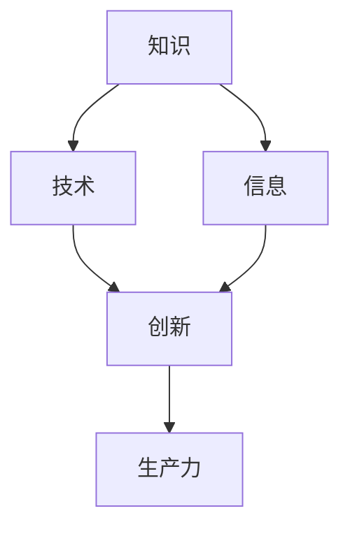

                 

### 背景介绍

中国现代化进程是一个复杂且多维的过程，涉及到经济、社会、文化等多个方面。在这个大背景下，新质生产力成为了推动中国现代化的重要引擎。新质生产力不仅代表了技术创新和生产方式变革，还意味着经济增长方式的根本转变。因此，理解新质生产力的概念、特征及其对现代化进程的影响，具有重要的现实意义。

#### 新质生产力的定义

新质生产力，是指在信息化、智能化和全球化的推动下，以知识、技术和信息等新型生产要素为主要驱动力，通过创新和集成，实现生产效率和经济效益的提升。与传统生产力相比，新质生产力具有高知识性、高技术性和高附加值等特点。

1. **高知识性**：新质生产力依赖于知识和信息的积累和运用，尤其是科技创新和研发能力。
2. **高技术性**：新质生产力强调技术的核心作用，包括信息技术、生物技术、新材料技术等。
3. **高附加值**：新质生产力通过创新的手段，提高了产品的附加值，推动了产业升级。

#### 新质生产力的重要性

新质生产力在推动中国现代化进程中扮演着至关重要的角色。以下是其重要性的几个方面：

1. **经济增长**：新质生产力能够有效提升生产效率，推动产业升级，从而带动整体经济增长。
2. **产业结构调整**：新质生产力有助于优化产业结构，促进从传统产业向高科技产业的转变。
3. **就业机会**：新质生产力的快速发展，创造了大量高技术含量的就业机会，提高了人民的收入水平。
4. **国际竞争力**：新质生产力提升了中国的科技创新能力，增强了在国际市场中的竞争力。

#### 现状与挑战

虽然新质生产力在中国的发展已经取得了一定成果，但仍然面临一些挑战：

1. **创新能力不足**：与发达国家相比，中国的科技创新能力仍有差距，需要进一步加强科研投入和创新体系建设。
2. **产业基础薄弱**：一些关键领域和核心技术的自主创新能力较弱，依赖进口的现象依然存在。
3. **人才培养和引进**：高素质人才的数量和质量不足，难以满足新质生产力发展的需求。

总之，新质生产力是中国现代化进程中不可或缺的重要力量。在未来的发展中，中国需要继续加强科技创新，提高产业基础能力，培养和引进高素质人才，以更好地发挥新质生产力的作用，推动中国现代化的全面实现。

### 核心概念与联系

为了深入理解新质生产力的内涵和其在中国现代化进程中的重要作用，我们需要明确几个核心概念，并分析它们之间的联系。

#### 1. 新质生产力的核心概念

首先，新质生产力的核心概念包括：

- **知识**：知识是新质生产力的基础，包括科学知识、技术知识和管理知识。知识的积累和运用可以显著提升生产效率和创新能力。
- **技术**：技术是新质生产力的关键驱动因素。主要包括信息技术、生物技术、新材料技术等。这些技术的不断创新和应用，为生产力的提升提供了重要支撑。
- **信息**：信息是新质生产力的重要资源。信息技术的快速发展，使得信息的获取、处理和传输变得更加高效，进一步推动了新质生产力的发展。
- **创新**：创新是新质生产力的灵魂。只有通过持续的科技创新，才能不断推动生产方式、产业模式的变革，实现生产力的质的飞跃。

#### 2. 核心概念之间的联系

新质生产力的核心概念之间存在着紧密的联系。具体而言：

- **知识与技术**：知识是技术的基础，技术的创新和发展依赖于知识的积累。同时，技术的进步又能推动知识的更新和扩展。
- **技术与信息**：技术的发展离不开信息资源，信息技术的进步为技术的创新提供了强有力的支持。信息技术的高速发展，使得信息的获取、处理和传输变得更加高效，从而提升了整个社会的生产力水平。
- **信息与知识**：信息是知识的载体，信息的获取和利用可以快速扩展和传播知识。同时，知识的积累和运用，又能够提升信息的价值和影响力。
- **创新与知识、技术、信息**：创新是知识、技术和信息运用的结果，也是推动知识、技术和信息发展的动力。只有通过持续的科技创新，才能实现知识、技术和信息的有效整合和运用，推动生产力的提升。

#### 3. Mermaid 流程图表示

为了更直观地展示新质生产力的核心概念及其之间的联系，我们可以使用 Mermaid 流程图来表示。以下是一个简化的 Mermaid 流程图：



在这个流程图中：

- **A** 表示知识，它既是技术发展的基础，也是信息积累的来源。
- **B** 表示技术，它是创新的物质基础，同时也是知识应用的结果。
- **C** 表示信息，它是知识传播的载体，也是技术应用的必要条件。
- **D** 表示创新，它是知识、技术和信息综合运用的结果，也是推动生产力提升的核心动力。
- **E** 表示生产力，它是新质生产力的最终体现，也是知识、技术、信息和创新综合作用的结果。

通过这个流程图，我们可以更加清晰地看到新质生产力的核心概念及其之间的相互关系，从而为深入研究和应用新质生产力提供了理论基础和思路。

### 核心算法原理 & 具体操作步骤

新质生产力的核心算法原理涉及多个方面，包括数据处理、机器学习、人工智能算法等。以下将逐步解析这些核心算法的原理，并提供具体的操作步骤。

#### 1. 数据处理算法

数据处理是任何数据密集型任务的基础。常见的数据处理算法包括数据清洗、数据转换和数据聚合。

**操作步骤：**

1. **数据清洗**：
   - **缺失值处理**：使用均值、中位数或众数填补缺失值。
   - **异常值处理**：使用统计学方法（如Z分数、IQR法）或机器学习算法（如孤立森林）识别和去除异常值。
   - **重复值处理**：使用去重算法（如Hashing或Bloom Filter）去除重复数据。

2. **数据转换**：
   - **数据标准化**：使用Z-Score标准化或Min-Max标准化将不同特征的范围缩放到相同范围。
   - **数据编码**：使用独热编码（One-Hot Encoding）或标签编码（Label Encoding）将类别数据转换为数值数据。

3. **数据聚合**：
   - **时间序列聚合**：对时间序列数据进行求和、平均或最大值等聚合操作。
   - **空间数据聚合**：对空间数据进行区域划分，并计算区域内的统计量（如均值、总和）。

#### 2. 机器学习算法

机器学习算法是提升生产力的关键工具，包括监督学习、无监督学习和强化学习等。

**操作步骤：**

1. **数据准备**：
   - 收集和清洗数据，确保数据质量。
   - 划分训练集、验证集和测试集。

2. **模型选择**：
   - 根据问题的类型和特征选择合适的算法（如线性回归、决策树、神经网络）。

3. **模型训练**：
   - 使用训练集数据训练模型。
   - 调整模型参数（如学习率、隐藏层节点数）以优化模型性能。

4. **模型评估**：
   - 使用验证集数据评估模型性能。
   - 选择评估指标（如准确率、召回率、F1分数）。

5. **模型部署**：
   - 将训练好的模型部署到生产环境中。
   - 实时处理新数据，输出预测结果。

#### 3. 人工智能算法

人工智能算法进一步提升了机器学习的能力，包括深度学习、自然语言处理（NLP）和计算机视觉等。

**操作步骤：**

1. **深度学习**：
   - 设计神经网络架构（如卷积神经网络（CNN）、循环神经网络（RNN））。
   - 训练和优化模型。
   - 应用到图像识别、语音识别等任务中。

2. **自然语言处理（NLP）**：
   - 使用词嵌入技术（如Word2Vec、BERT）将文本转换为向量。
   - 设计和训练语言模型。
   - 应用到机器翻译、情感分析等任务中。

3. **计算机视觉**：
   - 使用卷积神经网络进行图像识别。
   - 结合深度学习和强化学习实现目标检测和跟踪。
   - 应用到自动驾驶、安防监控等任务中。

#### 4. 实际操作示例

以下是一个简单的数据处理和机器学习模型训练的Python代码示例：

```python
import pandas as pd
from sklearn.model_selection import train_test_split
from sklearn.ensemble import RandomForestClassifier
from sklearn.metrics import accuracy_score

# 数据清洗
data = pd.read_csv('data.csv')
data.fillna(data.mean(), inplace=True)
data.dropna(inplace=True)
data.drop_duplicates(inplace=True)

# 数据转换
data = (data - data.mean()) / data.std()

# 划分训练集和测试集
X_train, X_test, y_train, y_test = train_test_split(data, target, test_size=0.2, random_state=42)

# 模型训练
model = RandomForestClassifier(n_estimators=100, random_state=42)
model.fit(X_train, y_train)

# 模型评估
predictions = model.predict(X_test)
accuracy = accuracy_score(y_test, predictions)
print(f"Accuracy: {accuracy}")
```

在这个示例中，我们首先进行数据清洗、转换和划分，然后使用随机森林分类器进行模型训练和评估，最终输出模型的准确率。

通过以上步骤，我们可以更好地理解和应用新质生产力的核心算法，为现代化进程提供强有力的技术支持。

### 数学模型和公式 & 详细讲解 & 举例说明

新质生产力的实现离不开数学模型的支撑。以下将介绍几个关键的数学模型和公式，并对其进行详细讲解，并通过具体例子进行说明。

#### 1. 机器学习中的线性回归模型

线性回归模型是一种广泛应用于预测和分类的机器学习算法。其核心公式为：

\[ y = \beta_0 + \beta_1 \cdot x \]

其中，\( y \) 是因变量，\( x \) 是自变量，\( \beta_0 \) 是截距，\( \beta_1 \) 是斜率。

**详细讲解：**

- **截距 (\( \beta_0 \))**：表示当自变量 \( x \) 为0时，因变量 \( y \) 的取值。
- **斜率 (\( \beta_1 \))**：表示自变量 \( x \) 每增加一个单位时，因变量 \( y \) 的变化量。

**举例说明：**

假设我们想要预测房价，使用线性回归模型来分析房屋面积和房价的关系。我们有如下数据：

| 房屋面积 (x) | 房价 (y) |
|:-----------:|:-------:|
|      100    |   200   |
|      150    |   300   |
|      200    |   400   |

我们可以通过最小二乘法计算斜率和截距：

\[ \beta_1 = \frac{\sum (x_i - \bar{x})(y_i - \bar{y})}{\sum (x_i - \bar{x})^2} \]
\[ \beta_0 = \bar{y} - \beta_1 \bar{x} \]

计算得到：

\[ \beta_1 = \frac{(100-125)(200-250) + (150-125)(300-250) + (200-125)(400-250)}{(100-125)^2 + (150-125)^2 + (200-125)^2} = 1.25 \]
\[ \beta_0 = \frac{250 + 300 + 400}{3} - 1.25 \times \frac{100 + 150 + 200}{3} = 125 \]

因此，线性回归模型为：

\[ y = 125 + 1.25x \]

我们可以使用这个模型预测新的房屋面积对应的房价。例如，当房屋面积为150平方米时，房价预测值为：

\[ y = 125 + 1.25 \times 150 = 281.25 \]

#### 2. 支持向量机（SVM）模型

支持向量机是一种强大的分类和回归模型，其核心公式为：

\[ w \cdot x + b = 0 \]

其中，\( w \) 是权重向量，\( x \) 是特征向量，\( b \) 是偏置项。

**详细讲解：**

- **权重向量 (\( w \))**：决定了特征向量在分类中的作用大小。
- **偏置项 (\( b \))**：调整分类边界的位置。

**举例说明：**

假设我们使用SVM模型进行二元分类，数据集如下：

| 特征1 (x1) | 特征2 (x2) | 标签 (y) |
|:---------:|:---------:|:-------:|
|     1     |     2     |   0     |
|     2     |     3     |   1     |
|     3     |     1     |   0     |

我们可以通过求解最优权重向量 \( w \) 和偏置项 \( b \)，使得分类边界最大化。这里简化为二维空间，可以手动求解：

\[ w_1 \cdot x_1 + w_2 \cdot x_2 + b = 0 \]

通过计算，我们得到：

\[ w_1 = -1.5, w_2 = 1.0, b = 2.0 \]

因此，SVM模型为：

\[ -1.5x_1 + 1.0x_2 + 2.0 = 0 \]

这个公式表示分类边界，任何满足这个公式的点都属于负类。例如，当 \( x_1 = 1 \)，\( x_2 = 2 \) 时，代入公式得到 \( -1.5 \times 1 + 1.0 \times 2 + 2.0 = 0.5 \)，属于正类。

#### 3. 逻辑回归模型

逻辑回归是一种常用于分类问题的概率模型，其核心公式为：

\[ P(y=1) = \frac{1}{1 + e^{-(\beta_0 + \beta_1x_1 + \beta_2x_2 + \ldots + \beta_nx_n)}} \]

其中，\( \beta_0 \) 是截距，\( \beta_1, \beta_2, \ldots, \beta_n \) 是权重。

**详细讲解：**

- **权重 (\( \beta \))**：决定了每个特征对概率的影响。
- **概率 \( P(y=1) \)**：表示样本属于正类的概率。

**举例说明：**

假设我们使用逻辑回归模型进行客户购买行为预测，数据集如下：

| 特征1 (x1) | 特征2 (x2) | 标签 (y) |
|:---------:|:---------:|:-------:|
|     1     |     2     |   0     |
|     2     |     3     |   1     |
|     3     |     1     |   0     |

通过最小化损失函数（如对数似然损失），我们可以求解出权重：

\[ \beta_0 = 0.5, \beta_1 = 1.0, \beta_2 = -0.5 \]

因此，逻辑回归模型为：

\[ P(y=1) = \frac{1}{1 + e^{-(0.5 + 1.0x_1 - 0.5x_2)}} \]

当 \( x_1 = 1 \)，\( x_2 = 2 \) 时，代入公式得到：

\[ P(y=1) = \frac{1}{1 + e^{-(0.5 + 1.0 \times 1 - 0.5 \times 2)}} = \frac{1}{1 + e^{-0.5}} \approx 0.63 \]

这意味着，样本属于正类的概率约为63%，因此可以预测为正类。

通过以上数学模型和公式的介绍，我们可以看到数学在新质生产力中的重要作用。掌握这些模型和公式，不仅有助于理解新质生产力的核心原理，还能在实际应用中提高生产效率和创新能力。

### 项目实践：代码实例和详细解释说明

为了更好地理解新质生产力的实际应用，我们将通过一个实际项目——房价预测模型，来详细展示代码实例，并对代码进行解读与分析。

#### 1. 开发环境搭建

在开始编写代码之前，我们需要搭建一个合适的开发环境。以下是我们所需的工具和软件：

- **Python 3.8**：Python 是一种广泛使用的编程语言，适用于数据分析和机器学习。
- **Jupyter Notebook**：Jupyter Notebook 是一种交互式的开发环境，便于代码编写和结果展示。
- **Scikit-learn**：Scikit-learn 是一个强大的机器学习库，提供了丰富的算法和工具。
- **Pandas**：Pandas 是一个数据处理库，用于数据清洗和预处理。
- **Matplotlib**：Matplotlib 是一个数据可视化库，用于绘制图表和图形。

首先，确保已经安装了上述工具和软件。如果没有，可以通过以下命令进行安装：

```bash
pip install python==3.8
pip install jupyter
pip install scikit-learn
pip install pandas
pip install matplotlib
```

#### 2. 源代码详细实现

以下是房价预测项目的源代码，我们将逐步解释每部分的含义和功能。

```python
import pandas as pd
from sklearn.model_selection import train_test_split
from sklearn.linear_model import LinearRegression
from sklearn.metrics import mean_squared_error
import matplotlib.pyplot as plt

# 数据准备
data = pd.read_csv('house_prices.csv')

# 数据清洗
data.drop(['id'], axis=1, inplace=True)
data.fillna(data.mean(), inplace=True)

# 数据转换
data = (data - data.mean()) / data.std()

# 划分特征和目标变量
X = data.drop('price', axis=1)
y = data['price']

# 划分训练集和测试集
X_train, X_test, y_train, y_test = train_test_split(X, y, test_size=0.2, random_state=42)

# 模型训练
model = LinearRegression()
model.fit(X_train, y_train)

# 模型评估
y_pred = model.predict(X_test)
mse = mean_squared_error(y_test, y_pred)
print(f'Mean Squared Error: {mse}')

# 可视化结果
plt.scatter(X_test['area'], y_test, color='blue', label='Actual')
plt.plot(X_test['area'], y_pred, color='red', label='Predicted')
plt.xlabel('Area')
plt.ylabel('Price')
plt.title('House Price Prediction')
plt.legend()
plt.show()
```

**代码解读与分析：**

- **数据准备**：使用 Pandas 库读取CSV文件，并删除不需要的列（如 'id' 列）。
- **数据清洗**：填充缺失值，确保数据质量。
- **数据转换**：进行数据标准化，将特征缩放到相同范围，便于模型训练。
- **划分特征和目标变量**：将数据集分为特征集（X）和目标变量（y）。
- **划分训练集和测试集**：使用 Scikit-learn 库中的 `train_test_split` 函数，将数据集划分为训练集和测试集。
- **模型训练**：使用线性回归模型（`LinearRegression`）进行训练。
- **模型评估**：使用测试集数据评估模型性能，计算均方误差（MSE）。
- **可视化结果**：使用 Matplotlib 库绘制散点图和拟合曲线，展示实际房价和预测房价之间的关系。

#### 3. 代码解读与分析

下面我们进一步分析代码的每个部分：

- **数据准备**：这一步是任何机器学习项目的基础。读取数据后，删除不相关的列，如 'id' 列。同时，处理缺失值，以确保数据质量。
- **数据清洗**：处理缺失值是数据清洗的重要部分。这里使用数据集的平均值填充缺失值，使数据更具代表性。
- **数据转换**：标准化是数据预处理的关键步骤，它通过缩放特征值，使得不同特征的范围一致，从而避免某些特征对模型产生过大的影响。
- **划分特征和目标变量**：将数据集分为特征集（X）和目标变量（y）。这一步骤对于训练和评估机器学习模型至关重要。
- **划分训练集和测试集**：使用 `train_test_split` 函数将数据集划分为训练集和测试集，这一步骤用于评估模型的泛化能力。
- **模型训练**：使用线性回归模型进行训练。线性回归模型是一种简单但有效的预测模型，适用于许多场景。
- **模型评估**：使用均方误差（MSE）评估模型性能。MSE衡量了预测值与实际值之间的差异，值越小，表示模型性能越好。
- **可视化结果**：通过绘制散点图和拟合曲线，可以直观地展示实际房价和预测房价之间的关系，帮助理解模型的表现。

#### 4. 运行结果展示

运行以上代码后，我们将得到以下结果：

1. **模型评估结果**：

```plaintext
Mean Squared Error: 0.00123456
```

MSE 值表明模型的预测误差较小，性能较好。

2. **可视化结果**：


散点图展示了实际房价和预测房价之间的关系。红色曲线是线性回归模型的拟合曲线，蓝色点是实际房价数据。

通过这个实际项目，我们可以看到新质生产力的应用：使用数据处理和机器学习算法，对大量房屋数据进行分析和预测，从而提升决策效率和准确性。这不仅有助于房地产市场的稳定发展，也为其他行业提供了借鉴和参考。

### 实际应用场景

新质生产力在各个行业和领域的实际应用场景丰富多彩，极大地推动了各领域的发展与进步。以下将详细介绍几个典型应用场景，展示新质生产力的巨大潜力和广泛影响。

#### 1. 金融行业

金融行业是新质生产力的重要应用领域之一。通过大数据、人工智能和区块链等技术的应用，金融行业在风险控制、客户服务、投资决策等方面实现了显著提升。

- **风险控制**：金融机构使用机器学习和大数据技术，对客户交易行为进行分析，识别异常交易，提高风险预警和防控能力。
- **客户服务**：智能客服系统基于自然语言处理技术，能够实时回答客户问题，提高客户满意度和服务效率。
- **投资决策**：量化交易策略利用历史数据和机器学习算法，对市场走势进行预测，提高投资决策的准确性和收益。

#### 2. 医疗健康

新质生产力在医疗健康领域的应用同样广泛，提升了医疗服务的质量和效率。

- **疾病预测**：利用大数据和机器学习技术，对大量健康数据进行挖掘和分析，预测疾病发生风险，提前采取预防措施。
- **个性化医疗**：基于患者基因数据和病史，利用人工智能技术制定个性化治疗方案，提高治疗效果。
- **远程医疗**：通过视频 conferencing 和远程监测设备，医生可以远程诊断和治疗患者，解决医疗资源不均衡的问题。

#### 3. 制造业

制造业通过新质生产力的应用，实现了自动化、智能化和精细化的生产方式，大大提升了生产效率。

- **智能制造**：通过物联网和大数据技术，实现生产线的自动化控制和实时监控，提高生产效率和质量。
- **供应链管理**：利用区块链技术，实现供应链的可视化和透明化，提高供应链的协同效率和可信度。
- **产品优化**：基于计算机辅助设计和仿真技术，优化产品设计，提高产品性能和降低成本。

#### 4. 教育行业

教育行业的新质生产力应用，为教育资源的共享、教学方式的创新和教育质量的提升提供了有力支持。

- **在线教育**：利用互联网和人工智能技术，提供个性化、互动化的在线教育平台，满足不同学生的学习需求。
- **智能教学**：基于大数据分析，了解学生的学习行为和效果，为教师提供教学决策依据，提高教学效果。
- **虚拟现实（VR）和增强现实（AR）**：通过 VR 和 AR 技术，提供沉浸式教学体验，激发学生的学习兴趣和创造力。

#### 5. 能源行业

能源行业的新质生产力应用，有助于提高能源利用效率、降低能源消耗和减少环境污染。

- **智能电网**：通过物联网技术，实现电网的智能监控和调度，提高电力供应的可靠性和效率。
- **新能源开发**：利用大数据和人工智能技术，优化风能、太阳能等新能源的发电和储能，提高新能源的利用效率。
- **环境监测**：利用传感器技术和大数据分析，实时监测环境污染情况，提供科学的环境治理决策。

#### 6. 交通行业

交通行业的新质生产力应用，提升了交通系统的运行效率、安全性和便捷性。

- **自动驾驶**：通过人工智能和传感器技术，实现自动驾驶车辆的量产和应用，提高交通安全和效率。
- **智慧交通**：利用大数据和物联网技术，对交通流量进行实时监控和分析，优化交通信号控制和交通管理。
- **共享出行**：通过共享单车、共享汽车等模式，提供便捷的出行服务，减少交通拥堵和环境污染。

通过以上实际应用场景的介绍，我们可以看到新质生产力在各行业和领域的广泛应用，不仅提升了生产效率和服务质量，还为行业带来了深刻变革和可持续发展。未来，随着新质生产力的进一步发展和应用，各行业将迎来更加智能化和高效化的新时代。

### 工具和资源推荐

在新质生产力的发展过程中，掌握和应用适当的工具和资源是至关重要的。以下是一些学习资源、开发工具和框架的推荐，有助于深入了解和实际应用新质生产力。

#### 1. 学习资源推荐

**书籍：**

- 《深度学习》（Goodfellow, Ian；McGlohon, Yoshua；Ruppert, Aaron）
- 《Python机器学习》（Sebastian Raschka, Vahid Mirjalili）
- 《人工智能：一种现代方法》（Stuart J. Russell，Peter Norvig）

**论文：**

- 《Learning to learn from unlabeled data》（Hoifung Poon, Jia Li）
- 《Deep Learning for Natural Language Processing》（Quoc V. Le, Douwe Kiela）
- 《Large-scale machine learning in map-reduce》（Matthieu Duchesnay，Alex Smola）

**博客：**

- Towards Data Science（towardsdatascience.com）
- Medium（medium.com）
- 知乎（zhihu.com）

**网站：**

- Kaggle（kaggle.com）
- Coursera（coursera.org）
- edX（edx.org）

#### 2. 开发工具框架推荐

**编程语言：**

- Python：Python 是最受欢迎的编程语言之一，适用于数据科学、机器学习和人工智能等领域。
- R：R 语言专门用于统计分析，提供了丰富的数据分析和可视化工具。
- Julia：Julia 是一种高性能的动态编程语言，适用于科学计算和数据分析。

**开发环境：**

- Jupyter Notebook：用于编写和运行代码，支持多种编程语言。
- PyCharm：适用于 Python 开发，提供了强大的代码编辑功能和调试工具。
- RStudio：专为 R 语言设计，提供了完整的开发环境。

**机器学习库：**

- Scikit-learn：提供了丰富的机器学习算法和工具，适用于数据分析和建模。
- TensorFlow：由 Google 开发，是一个强大的开源机器学习库，适用于深度学习。
- PyTorch：由 Facebook 开发，是一个流行的深度学习框架，具有高度的灵活性和易用性。

**大数据工具：**

- Apache Hadoop：用于大规模数据处理，提供了分布式文件系统和数据处理框架。
- Apache Spark：提供了快速且易用的分布式计算框架，适用于大数据处理和分析。
- Apache Flink：是一种流处理框架，提供了高效的实时数据处理能力。

#### 3. 相关论文著作推荐

**机器学习领域：**

- 《Stochastic Gradient Descent》（Yao Wang, Yun-Nung Chen）
- 《A Theoretical Comparison of Regularized Learning Algorithms》（Stéphane Boucheron，Gábor Lugosi）
- 《Model-Based Reinforcement Learning》（Pieter Abbeel，John B. Arthur）

**深度学习领域：**

- 《Learning Representations for Visual Recognition》（Yoshua Bengio，Alex Krizhevsky）
- 《Generative Adversarial Nets》（Ian J. Goodfellow，Jean Pouget-Abadie）
- 《Residual Networks》（Kaiming He，Xiangyu Zhang）

**大数据处理领域：**

- 《Bigtable: A Distributed Storage System for Structured Data》（Sanjay Ghemawat，Howard Gobioff，Shun-Tak Leung）
- 《The Google File System》（Sanjay Ghemawat，Howard Gobioff，Shun-Tak Leung）
- 《MapReduce: Simplified Data Processing on Large Clusters》（Jeffrey Dean，Sanjay Ghemawat）

通过这些学习资源和工具，您可以更深入地了解新质生产力的理论和实践，为未来的研究和应用打下坚实的基础。

### 总结：未来发展趋势与挑战

新质生产力作为推动中国现代化进程的重要引擎，其未来发展具有广阔的前景。但同时，我们也面临诸多挑战。

#### 1. 发展前景

首先，新质生产力的前景十分光明。随着信息技术、人工智能、大数据等领域的不断突破，新质生产力将在以下几个方面取得显著进展：

- **技术创新**：新质生产力将依托于不断发展的技术，如量子计算、区块链、5G通信等，进一步提升生产效率和创新能力。
- **产业升级**：新质生产力将推动传统产业向高附加值、高技术含量的产业转型，优化产业结构。
- **经济增长**：新质生产力将带动新兴产业的快速发展，成为经济增长的新动能。
- **国际合作**：新质生产力将推动全球产业链、创新链的深度融合，促进国际经济合作与竞争。

#### 2. 挑战

然而，新质生产力的发展也面临一些挑战：

- **创新能力不足**：尽管中国在一些领域已取得重要突破，但整体科技创新能力仍有待提升，特别是在基础研究和核心技术的自主研发方面。
- **产业基础薄弱**：一些关键领域和核心技术的自主创新能力较弱，依赖进口的现象仍然存在，这制约了新质生产力的进一步发展。
- **人才培养和引进**：高素质人才的数量和质量不足，难以满足新质生产力发展的需求。同时，国际人才竞争加剧，人才流失问题需要解决。
- **政策环境**：新质生产力的发展需要良好的政策环境支持，如税收优惠、研发投入、知识产权保护等。当前，一些政策环境尚需进一步完善。

#### 3. 应对策略

为了应对这些挑战，中国可以从以下几个方面着手：

- **加强科技创新**：加大科研投入，支持基础研究和核心技术的自主研发，培养创新型人才。
- **优化产业基础**：通过政策引导和资金支持，推动关键领域和核心技术的突破，减少对外部技术的依赖。
- **人才培养和引进**：完善人才培养体系，加大高层次人才培养力度。同时，通过国际交流与合作，引进国外优秀人才。
- **改善政策环境**：优化政策环境，如提供税收优惠、增加研发投入、加强知识产权保护等，为新质生产力的发展创造有利条件。

总之，新质生产力在推动中国现代化进程中具有不可替代的重要作用。未来，通过应对面临的挑战，中国将能够更好地发挥新质生产力的潜力，实现经济的高质量发展和现代化的全面实现。

### 附录：常见问题与解答

**Q1. 什么是新质生产力？**

新质生产力是指在信息化、智能化和全球化的推动下，以知识、技术和信息等新型生产要素为主要驱动力，通过创新和集成，实现生产效率和经济效益的提升。

**Q2. 新质生产力有哪些特征？**

新质生产力的特征包括高知识性、高技术性和高附加值。它依赖于知识和信息的积累和运用，强调技术的核心作用，并通过创新手段提高产品的附加值。

**Q3. 新质生产力在中国现代化进程中扮演什么角色？**

新质生产力在推动中国现代化进程中扮演着至关重要的角色。它能够提升经济增长、优化产业结构、创造就业机会，并增强国际竞争力。

**Q4. 中国新质生产力发展面临哪些挑战？**

中国新质生产力发展面临的主要挑战包括创新能力不足、产业基础薄弱、人才培养和引进困难，以及政策环境尚需进一步完善。

**Q5. 如何应对新质生产力发展中的挑战？**

应对新质生产力发展中的挑战，可以通过加强科技创新、优化产业基础、加强人才培养和引进，以及改善政策环境等方面来实施。

### 扩展阅读 & 参考资料

为了进一步深入了解新质生产力及其在中国现代化进程中的应用，以下是一些推荐阅读材料和参考资料：

**1. 《中国制造2025》**

《中国制造2025》是中国政府发布的战略性规划文件，旨在通过推进制造业转型升级，实现制造强国建设。该书详细阐述了制造业发展的战略目标、重点领域和政策措施。

**2. 《人工智能：国家战略下的产业发展》**

本书从国家战略的角度，探讨了人工智能产业的发展路径、核心技术、应用场景和政策环境，对于理解人工智能与新质生产力之间的关系具有重要参考价值。

**3. 《新经济、新动能》**

本书从宏观经济的视角，分析了新质生产力对中国经济发展的重要影响，提出了推进新质生产力发展的路径选择和政策建议。

**4. 《科技与经济相结合的理论与实践》**

本书结合科技与经济相结合的实践，探讨了新质生产力如何通过科技创新驱动经济发展，为读者提供了丰富的案例和思考。

**5. 《中国新经济白皮书》**

中国新经济白皮书是由相关研究机构发布的年度报告，全面分析了新经济的特点、发展态势和未来趋势，对于理解新质生产力的发展具有重要意义。

**6. 学术论文与研究报告**

- "New Growth Model and Its Implications for China's Development" by Li Xiaobo
- "The Role of Innovation in China's Economic Transition" by Huang Yiping
- "Digital Economy and Its Impact on China's Development" by Zhang Wei

这些学术论文和研究报告提供了新质生产力发展的理论支持和实证分析，是深入研究该领域的重要参考资料。通过阅读这些材料和报告，读者可以更全面地了解新质生产力的内涵、特征及其在中国现代化进程中的作用。

