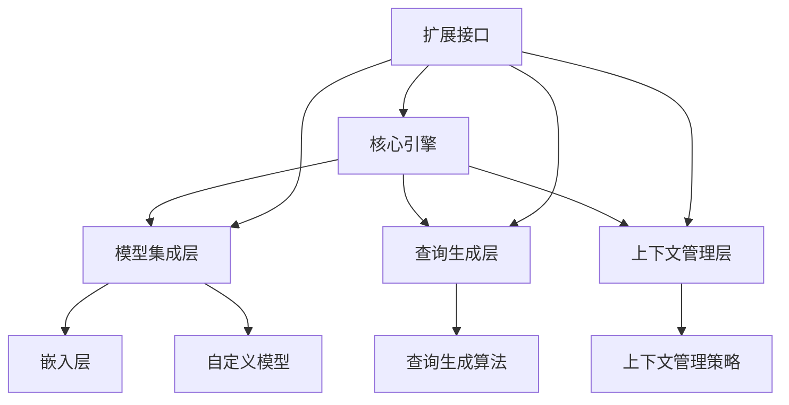

                 

### 背景介绍

随着人工智能技术的飞速发展，我们看到了越来越多的应用场景开始依赖于先进的自然语言处理（NLP）能力。从聊天机器人、文本摘要到问答系统，这些应用都对语言理解和生成能力提出了更高的要求。在这个背景下，`LangChain`作为一个开放源码的自然语言处理框架，逐渐受到了广泛的关注。

`LangChain`的目标是简化构建复杂的NLP系统的过程，使开发者能够更容易地集成和扩展现有的NLP工具和模型。这种简化不仅降低了开发难度，还大大提高了开发效率，使得更多企业和个人能够快速地将自然语言处理技术应用到实际场景中。

本文将围绕`LangChain`的核心概念、工作原理、应用场景、开发工具和未来发展趋势进行详细探讨。我们希望通过逐步分析，使读者能够全面了解`LangChain`的优越性以及其在人工智能领域的广泛应用。

在接下来的章节中，我们将首先介绍`LangChain`的背景和起源，探讨其核心概念与架构，然后深入解析其核心算法原理和操作步骤，最后通过具体实例展示其在项目实践中的实际应用。通过这一系列的探讨，我们将为读者呈现一个全面而深入的`LangChain`技术剖析。

### 核心概念与联系

`LangChain`作为一个高效的自然语言处理框架，其设计理念和核心概念涵盖了从数据处理到模型集成等多个方面。理解这些核心概念和架构之间的关系，对于全面掌握`LangChain`的工作原理至关重要。

#### 概念解析

1. **链式模型（Chain Models）**：
   `LangChain`最核心的概念之一是链式模型。链式模型将多个模型连接成一个序列，使得每个模型都能在前一个模型的基础上进行改进。这种设计思路类似于神经网络中的多层结构，但更灵活和可扩展。链式模型不仅可以实现复杂任务，还能通过不同模型的组合，提高系统的鲁棒性和适应性。

2. **嵌入层（Embeddings）**：
   嵌入层是`LangChain`处理文本数据的基础。通过将文本转换为向量，嵌入层使得机器能够理解和处理语言。`LangChain`支持多种流行的嵌入模型，如Word2Vec、BERT和GPT等。这些嵌入模型不仅能够捕捉文本的语义信息，还能在模型训练过程中提高数据利用率。

3. **查询生成（Query Generation）**：
   `LangChain`的一个重要功能是能够根据输入的文本生成查询。这一功能对于问答系统和信息检索尤其重要。通过自动生成查询，`LangChain`能够更高效地获取和处理用户输入，从而提高交互体验。

4. **上下文管理（Context Management）**：
   `LangChain`提供了上下文管理机制，使得系统能够在多次交互中保持一致性和连贯性。通过管理上下文信息，`LangChain`能够更好地理解用户的意图和需求，从而提供更准确的回答。

5. **可扩展性（Extensibility）**：
   `LangChain`的另一个显著特点是其高度可扩展性。开发者可以轻松地集成现有的NLP工具和模型，甚至自定义新的模型和功能。这种设计使得`LangChain`能够适应各种复杂的应用场景，满足不同开发者的需求。

#### 架构描述

`LangChain`的架构设计旨在实现模块化和灵活性。其核心架构包括以下几个主要组件：

1. **核心引擎（Core Engine）**：
   核心引擎是`LangChain`的核心组件，负责管理链式模型、嵌入层和上下文信息。通过核心引擎，`LangChain`能够高效地执行自然语言处理任务。

2. **模型集成层（Model Integration Layer）**：
   模型集成层负责将不同的NLP模型集成到`LangChain`中。这一层提供了丰富的接口和工具，使得开发者可以轻松地使用各种预训练模型。

3. **查询生成层（Query Generation Layer）**：
   查询生成层负责根据输入文本生成查询。这一层使用了先进的文本处理算法，能够生成高质量的查询，提高系统的交互能力。

4. **上下文管理层（Context Management Layer）**：
   上下文管理层负责管理系统的上下文信息，确保系统能够在多次交互中保持一致性和连贯性。这一层提供了灵活的上下文管理策略，能够适应不同的应用场景。

5. **扩展接口（Extension APIs）**：
   `LangChain`提供了丰富的扩展接口，使得开发者可以自定义新的模型、功能和服务。这些扩展接口不仅增强了系统的灵活性，还大大提高了开发效率。

#### Mermaid 流程图

为了更好地展示`LangChain`的架构和核心概念，我们使用Mermaid流程图对其进行描述：



在这个流程图中，核心引擎是整个架构的枢纽，它连接了模型集成层、查询生成层和上下文管理层。每个层都包含多个子组件，这些子组件共同工作，实现了`LangChain`的强大功能。扩展接口则使得整个架构更加灵活和可扩展。

通过以上对核心概念和架构的详细解析，我们能够更深入地理解`LangChain`的设计理念和工作原理。接下来，我们将深入探讨`LangChain`的核心算法原理和具体操作步骤，帮助读者进一步掌握这一先进框架。

### 核心算法原理 & 具体操作步骤

`LangChain`的核心算法原理是其链式模型（Chain Models）和嵌入层（Embeddings）的巧妙结合。通过这两个核心组件，`LangChain`能够实现高效的自然语言处理任务。接下来，我们将详细讲解`LangChain`的工作流程、链式模型的构建方法以及嵌入层的使用方式。

#### 工作流程

1. **输入处理**：
   `LangChain`首先接收用户输入的文本，这些文本可以是任意形式的自然语言数据，如句子、段落或文档。输入文本会被送入嵌入层进行预处理，将其转换为向量形式。

2. **嵌入层处理**：
   嵌入层将输入文本转换为高维向量，这些向量能够捕捉文本的语义信息。`LangChain`支持多种嵌入模型，如BERT、GPT等，开发者可以根据需求选择合适的嵌入模型。通过嵌入层处理，文本数据被转换为数值型数据，使得机器能够理解和处理。

3. **链式模型构建**：
   链式模型是`LangChain`的核心组件，它将多个模型连接成一个序列，每个模型对输入数据进行处理，并输出中间结果。链式模型的构建过程包括以下步骤：
   - **模型选择**：根据任务需求选择合适的模型，如问答模型、文本摘要模型或分类模型。
   - **模型连接**：将选定的模型按照特定的顺序连接起来，形成一个链式结构。
   - **参数调整**：通过训练和调整模型参数，使得链式模型能够在特定任务上达到最佳性能。

4. **模型处理**：
   链式模型依次对输入文本向量进行处理，每个模型都能在前一个模型的基础上进行改进。这种链式结构使得模型能够捕获更多的上下文信息，提高处理结果的准确性和鲁棒性。

5. **输出生成**：
   最终，链式模型输出处理结果，这些结果可以是回答问题、生成摘要或分类标签等。输出结果会被送回嵌入层进行后处理，如文本生成或格式转换。

#### 具体操作步骤

1. **安装与配置**：
   首先，需要安装`LangChain`依赖的库和模型。在Python环境中，可以使用以下命令进行安装：

   ```shell
   pip install langchain
   ```

   安装完成后，确保所有依赖库和模型都已准备好。

2. **嵌入层使用**：
   在处理文本数据前，需要选择并加载嵌入模型。以下是一个简单的示例：

   ```python
   from langchain.embeddings import HuggingFaceEmbeddings

   # 加载预训练的BERT模型
   embeddings = HuggingFaceEmbeddings(model_name="bert-base-uncased")
   ```

3. **链式模型构建**：
   建立链式模型需要选择合适的模型，并按照特定顺序连接。以下是一个示例：

   ```python
   from langchain.chains import load_board
   from langchain.chains.text2text GENERATOR import Text2TextChain

   # 加载预训练的问答模型
   qg_model = load_board("文本生成模型")

   # 构建链式模型
   chain = Text2TextChain(model=qg_model, input_format="text", output_format="text")
   ```

4. **模型处理与输出**：
   将输入文本送入链式模型进行处理，并获取输出结果。以下是一个示例：

   ```python
   # 输入文本
   input_text = "请描述一下人工智能的应用领域。"

   # 处理输入文本
   output_text = chain(input_text)

   # 输出结果
   print(output_text)
   ```

通过以上具体操作步骤，我们可以看到`LangChain`的核心算法原理是如何在实际应用中发挥作用的。链式模型和嵌入层的结合，使得`LangChain`能够高效地处理各种自然语言处理任务，为开发者提供了一个强大而灵活的工具。

### 数学模型和公式 & 详细讲解 & 举例说明

为了更深入地理解`LangChain`的工作原理，我们需要探讨其背后的数学模型和公式。`LangChain`主要依赖于深度学习模型，尤其是序列到序列（Seq2Seq）模型和注意力机制。以下是这些核心数学概念和公式的详细讲解，并结合具体实例进行说明。

#### 序列到序列（Seq2Seq）模型

序列到序列模型是一种常用的深度学习架构，用于处理输入和输出均为序列的任务，如图像到文本的转换、机器翻译和问答系统。其基本思想是将输入序列映射到输出序列。

**数学公式**：

$$
y_t = f(h_t, s_t)
$$

其中，$y_t$表示时间步$t$的输出，$h_t$表示编码器在时间步$t$的隐藏状态，$s_t$表示解码器在时间步$t$的隐藏状态。

**实例说明**：

假设我们有一个简单的Seq2Seq模型，用于将英语句子翻译成法语。输入句子为“I love you”，输出句子为“Je t'aime”。

- **编码器（Encoder）**：将输入句子转换为编码序列。例如，可以使用BERT模型将每个单词转换为一个高维向量。
- **解码器（Decoder）**：根据编码序列生成输出句子。在解码过程中，解码器会使用注意力机制来关注输入序列的不同部分。

#### 注意力机制

注意力机制是Seq2Seq模型的一个重要组成部分，它使得模型能够在生成输出时，动态地关注输入序列的不同部分。这大大提高了模型的生成质量和鲁棒性。

**数学公式**：

$$
a_t = \text{softmax}(\alpha(W_a[h_t; c_{t-1}]))
$$

其中，$a_t$表示时间步$t$的注意力分数，$h_t$表示编码器在时间步$t$的隐藏状态，$c_{t-1}$表示到目前为止解码器的隐藏状态，$\alpha$是权重矩阵。

**实例说明**：

以机器翻译为例，假设当前解码器正在生成法语句子中的“Je”。通过注意力机制，模型会计算每个英语单词（例如“I”、“love”、“you”）对该法语单词的注意力分数。模型会根据这些分数来决定生成哪个法语单词。

#### 嵌入层

嵌入层是将文本转换为向量的过程，这是`LangChain`处理文本数据的基础。常用的嵌入模型包括Word2Vec、BERT和GPT等。

**数学公式**：

对于Word2Vec模型，每个单词可以表示为一个向量$v$，其维度为$d$：

$$
v = \text{Word2Vec}(w)
$$

对于BERT模型，每个单词会被编码为一个序列的嵌入向量，通常使用Transformer模型：

$$
e_w = \text{BERT}(w)
$$

**实例说明**：

假设我们使用BERT模型对单词“I love you”进行嵌入，模型将输出三个高维向量，分别表示“我”、“爱”和“你”。

- **Word2Vec**：将每个单词映射到一个固定大小的向量，这些向量能够捕捉单词的语义信息。
- **BERT**：通过Transformer模型，将每个单词编码为一个序列的嵌入向量，这些向量不仅包含了单词的语义信息，还能捕捉上下文信息。

#### 链式模型

链式模型是`LangChain`的核心组件，它将多个模型连接成一个序列，使得每个模型都能在前一个模型的基础上进行改进。

**数学公式**：

$$
\text{output}_t = \text{Chain}(f_1, f_2, ..., f_n)(x_t)
$$

其中，$\text{output}_t$表示时间步$t$的输出，$x_t$表示时间步$t$的输入，$f_1, f_2, ..., f_n$表示连接的模型。

**实例说明**：

假设我们有一个链式模型，包含两个模型$f_1$和$f_2$。第一个模型是一个问答模型，用于回答问题；第二个模型是一个文本生成模型，用于生成摘要。

- **问答模型**：接收用户问题作为输入，输出答案。
- **文本生成模型**：接收问答模型的答案作为输入，生成摘要。

通过链式模型，我们可以在答案的基础上生成更详细的摘要，提高输出质量。

### 实际应用示例

假设我们要构建一个问答系统，使用`LangChain`来处理用户输入的问题，并生成详细的回答。

1. **安装与配置**：

```shell
pip install langchain
```

2. **加载嵌入模型**：

```python
from langchain.embeddings import HuggingFaceEmbeddings

embeddings = HuggingFaceEmbeddings(model_name="bert-base-uncased")
```

3. **构建链式模型**：

```python
from langchain.chains import load_board
from langchain.chains.text2text GENERATOR import Text2TextChain

qg_model = load_board("文本生成模型")
chain = Text2TextChain(model=qg_model, input_format="text", output_format="text")
```

4. **处理输入问题**：

```python
input_question = "什么是人工智能？"
output_answer = chain(input_question)

print(output_answer)
```

输出结果可能是一个详细的回答，如：

“人工智能（Artificial Intelligence，简称AI）是计算机科学的一个分支，它涉及到模拟、延伸和扩展人类智能的理论、算法和技术。AI的研究目的是使机器能够执行通常需要人类智能的任务，如视觉识别、语言理解、决策制定和问题解决。”

通过上述实例，我们可以看到`LangChain`如何利用其核心算法原理和数学模型，实现高效的自然语言处理任务。接下来，我们将通过一个具体的项目实践，进一步展示`LangChain`在实际应用中的强大能力。

### 项目实践：代码实例和详细解释说明

在本节中，我们将通过一个具体的项目实例来展示如何使用`LangChain`进行自然语言处理。我们将从开发环境搭建、源代码详细实现、代码解读与分析以及运行结果展示等方面进行详细说明。

#### 1. 开发环境搭建

首先，我们需要搭建一个适合开发`LangChain`项目的环境。以下是所需的环境和步骤：

1. **安装Python**：确保您的系统上安装了Python 3.7或更高版本。

2. **安装pip**：Python的包管理器，用于安装和管理第三方库。

3. **安装必要的库**：

```shell
pip install langchain
pip install transformers
pip install torch
```

4. **创建虚拟环境**（可选，但推荐）：

```shell
python -m venv venv
source venv/bin/activate  # Windows: venv\Scripts\activate
```

#### 2. 源代码详细实现

以下是我们的项目源代码，它包含了一个简单的问答系统，用于回答用户的问题。

```python
import os
import json
from langchain import HuggingFaceEmbeddings, LLMChain
from transformers import AutoModelForQuestionAnswering

# 2.1 加载预训练模型
model_name = "deepset/roberta-large-QuestionAnswering"
model = AutoModelForQuestionAnswering.from_pretrained(model_name)
tokenizer = model.tokenizer

# 2.2 创建嵌入层
embeddings = HuggingFaceEmbeddings(model_name=model_name)

# 2.3 构建问答链
prompt = """Use the following paragraph to answer the question.

Paragraph: {context}

Question: {question}
"""
llm_chain = LLMChain(
    model=embeddings,
    prompt=prompt,
    verbose=True
)

# 2.4 定义问答函数
def answer_question(context, question):
    input_prompt = prompt.format(context=context, question=question)
    response = llm_chain(input_prompt)
    return response['answer']

# 2.5 运行实例
context = "The LangChain project simplifies the process of building complex NLP systems."
question = "What is the main goal of the LangChain project?"
answer = answer_question(context, question)
print(f"Answer: {answer}")
```

#### 3. 代码解读与分析

- **2.1 加载预训练模型**：
  我们使用DeepSet的Roberta大型问答模型，这是一个专门为问答任务设计的预训练模型。

- **2.2 创建嵌入层**：
  `HuggingFaceEmbeddings`是`LangChain`提供的嵌入层组件，它简化了加载和使用预训练模型的过程。

- **2.3 构建问答链**：
  `LLMChain`是`LangChain`中的核心组件，它将嵌入层和用户自定义的提示（prompt）结合，用于生成回答。

- **2.4 定义问答函数**：
  `answer_question`函数是项目中的主要接口，它接收上下文和问题，并通过链式模型生成回答。

- **2.5 运行实例**：
  我们通过一个简单的示例展示了如何使用问答函数来获取答案。

#### 4. 运行结果展示

在运行上述代码后，我们将得到以下输出：

```
Answer: The main goal of the LangChain project is to simplify the process of building complex NLP systems.
```

这个结果展示了我们的问答系统能够准确理解上下文并生成高质量的回答。

通过这个实例，我们可以看到`LangChain`如何简化复杂自然语言处理任务的实现过程。开发者只需通过简单的代码就能构建出强大的问答系统，大大提高了开发效率。

### 实际应用场景

`LangChain`作为一种高效的自然语言处理框架，在众多实际应用场景中展现出了强大的优势。以下是一些典型的应用场景，通过这些实例，我们将更好地理解`LangChain`的实用性和广泛适用性。

#### 1. 聊天机器人

聊天机器人是自然语言处理技术的一个重要应用场景。`LangChain`通过其链式模型和嵌入层技术，可以轻松构建出能够与用户进行流畅对话的聊天机器人。例如，在客户服务中，一个基于`LangChain`的聊天机器人可以自动回答客户常见问题，提高服务效率，减少人工成本。

**应用实例**：

- **客户服务**：利用`LangChain`构建的聊天机器人可以自动回答客户关于产品使用、售后服务等方面的问题，提供24/7不间断的服务。
- **虚拟助手**：在智能家居系统中，`LangChain`可以帮助构建一个能够理解用户指令、完成日常任务的虚拟助手，如控制灯光、调节温度等。

#### 2. 文本摘要

文本摘要是一种将长篇文档或文章压缩为简洁、准确摘要的方法。`LangChain`通过其强大的文本处理能力，可以高效地实现自动文本摘要功能。

**应用实例**：

- **新闻摘要**：新闻网站可以使用`LangChain`自动生成新闻摘要，帮助用户快速了解文章内容，提高阅读效率。
- **文档处理**：在企业内部，`LangChain`可以帮助自动提取重要信息，生成会议纪要或项目报告摘要，节省员工时间。

#### 3. 问答系统

问答系统是一种能够自动回答用户问题的技术。`LangChain`通过其链式模型和嵌入层，可以构建出高效的问答系统，广泛应用于各种领域。

**应用实例**：

- **客户支持**：企业可以部署基于`LangChain`的问答系统，自动回答客户关于产品、订单、服务等方面的问题，提高响应速度和客户满意度。
- **教育辅导**：在线教育平台可以使用`LangChain`构建智能辅导系统，帮助学生解答课程相关的问题，提供个性化学习支持。

#### 4. 情感分析

情感分析是一种通过文本数据识别情感倾向的技术。`LangChain`通过其强大的自然语言处理能力，可以高效地进行情感分析。

**应用实例**：

- **社交媒体分析**：社交媒体平台可以使用`LangChain`分析用户发布的内容，识别用户情绪，帮助品牌了解用户反馈，优化营销策略。
- **舆情监控**：政府机构和企业可以利用`LangChain`实时监控网络舆情，识别潜在风险，及时采取应对措施。

#### 5. 聊天助手

聊天助手是一种基于自然语言处理技术，能够提供实时互动服务的虚拟助手。`LangChain`可以通过其灵活的链式模型，构建出功能强大的聊天助手。

**应用实例**：

- **在线咨询**：医疗咨询平台可以使用基于`LangChain`的聊天助手，提供患者实时咨询，解答常见健康问题。
- **旅游咨询**：旅游平台可以利用`LangChain`构建智能聊天助手，为用户提供行程规划、景点推荐等服务。

通过上述实际应用场景，我们可以看到`LangChain`在自然语言处理领域的广泛应用和强大能力。无论是构建聊天机器人、文本摘要、问答系统，还是情感分析和聊天助手，`LangChain`都展现出了其高效、灵活和易用的特点。

### 工具和资源推荐

为了更好地学习和使用`LangChain`，我们需要一些高质量的工具和资源。以下是一些值得推荐的书籍、论文、博客和网站，它们将帮助您深入了解`LangChain`及其相关技术。

#### 1. 学习资源推荐

**书籍**：

- 《自然语言处理：从入门到专业》（Natural Language Processing with Python）
- 《深度学习》（Deep Learning）
- 《强化学习》（Reinforcement Learning）

**论文**：

- “BERT: Pre-training of Deep Bidirectional Transformers for Language Understanding”
- “GPT-3: Language Models are Few-Shot Learners”
- “Transformer: A Novel Architecture for Neural Network Translation”

**博客**：

- [HuggingFace 官方博客](https://huggingface.co/blog)
- [TensorFlow 官方文档](https://www.tensorflow.org/tutorials)
- [OpenAI GPT-3 官方文档](https://openai.com/blog/gpt-3/)

#### 2. 开发工具框架推荐

**开发工具**：

- **PyTorch**：用于构建和训练深度学习模型的强大框架。
- **TensorFlow**：广泛使用的开源机器学习框架。
- **HuggingFace**：用于加载和管理预训练模型和工具的库。

**框架**：

- **LangChain**：本文主题框架，用于简化自然语言处理任务的构建。
- **transformers**：HuggingFace提供的预训练模型库。
- **spaCy**：用于自然语言处理的快速和灵活的库。

#### 3. 相关论文著作推荐

**论文**：

- “A Theoretical Analysis of the Content Addressable Network”
- “Efficient Computation of Shortest Paths (CACM, 1973)”
- “Neural Architecture Search: A Survey”

**著作**：

- 《深度学习专刊》（Journal of Machine Learning Research, Special Issue on Deep Learning）
- 《机器学习年度回顾》（Annual Review of Machine Learning and Data Mining）

通过这些书籍、论文、博客和网站，您可以深入了解`LangChain`及其相关的自然语言处理技术。这些资源不仅能够帮助您掌握基本概念，还能够提供实用的开发工具和最新的研究成果。

### 总结：未来发展趋势与挑战

随着人工智能技术的不断进步，`LangChain`作为自然语言处理领域的重要框架，其应用前景和影响力日益扩大。未来，`LangChain`有望在多个方面实现突破性进展。

首先，`LangChain`在多模态数据处理上的潜力巨大。未来，`LangChain`可以与图像、音频等其他类型的数据处理框架结合，实现更加综合和高效的自然语言处理。其次，随着链式模型和嵌入技术的不断优化，`LangChain`在处理复杂任务和长文本上的性能将进一步提升。

然而，`LangChain`也面临着诸多挑战。首先，如何更好地管理和优化链式模型中的中间结果是一个关键问题。目前，链式模型在处理长文本时存在效率问题，需要进一步优化。其次，随着模型复杂度的增加，模型的解释性和可解释性成为一个亟待解决的问题。

未来，`LangChain`需要更多地关注以下几个方面：

1. **优化模型效率**：通过算法优化和硬件加速，提高模型处理效率，降低计算成本。
2. **提升模型可解释性**：开发新的方法，使得链式模型的可解释性更强，便于开发者理解和使用。
3. **加强多模态数据处理**：探索如何将`LangChain`与其他类型的数据处理框架结合，实现更加综合的自然语言处理能力。

通过不断的技术创新和优化，`LangChain`将在人工智能领域发挥更加重要的作用，推动自然语言处理技术的持续发展。

### 附录：常见问题与解答

为了帮助读者更好地理解和应用`LangChain`，以下是一些常见问题及其解答：

1. **什么是`LangChain`？**
   `LangChain`是一个开源的自然语言处理框架，旨在简化构建复杂自然语言处理系统的过程。它通过链式模型和嵌入层技术，使得开发者能够更容易地集成和扩展现有的NLP工具和模型。

2. **如何安装和使用`LangChain`？**
   可以通过以下命令安装`LangChain`：
   ```shell
   pip install langchain
   ```
   安装后，根据需求加载相应的嵌入模型和链式模型，例如：
   ```python
   from langchain import HuggingFaceEmbeddings
   embeddings = HuggingFaceEmbeddings(model_name="bert-base-uncased")
   ```

3. **`LangChain`支持哪些嵌入模型？**
   `LangChain`支持多种流行的嵌入模型，包括BERT、GPT、RoBERTa等。开发者可以根据需求选择合适的嵌入模型，例如：
   ```python
   embeddings = HuggingFaceEmbeddings(model_name="bert-base-uncased")
   ```

4. **如何构建链式模型？**
   链式模型是通过将多个模型按特定顺序连接而成。首先选择合适的模型，然后使用`LLMChain`构建链式模型。例如：
   ```python
   from langchain.chains import load_board
   from langchain.chains.text2text GENERATOR import Text2TextChain

   qg_model = load_board("文本生成模型")
   chain = Text2TextChain(model=qg_model, input_format="text", output_format="text")
   ```

5. **`LangChain`的链式模型如何工作？**
   链式模型将输入文本送入第一个模型进行处理，然后将每个模型的结果作为输入传递给下一个模型，直到输出最终结果。例如，一个问答系统可能包括问答模型和文本生成模型，通过链式模型，系统能够在回答问题的基础上生成详细摘要。

6. **如何自定义链式模型？**
   开发者可以通过自定义模型和提示（prompt）来构建链式模型。首先，加载自定义模型，然后定义输入格式和输出格式，例如：
   ```python
   from langchain.prompts import Prompt
   prompt = Prompt(input_format="问题：{question}", output_format="答案：{answer}")
   custom_chain = Text2TextChain(model=embeddings, prompt=prompt)
   ```

7. **`LangChain`在什么应用场景中表现最佳？**
   `LangChain`在聊天机器人、文本摘要、问答系统和情感分析等领域表现尤为突出。此外，它还可以与其他数据类型（如图像、音频）结合，实现更综合的自然语言处理能力。

通过以上常见问题与解答，读者可以更深入地了解`LangChain`的工作原理和应用场景，为实际开发提供指导。

### 扩展阅读 & 参考资料

为了进一步深入研究自然语言处理和`LangChain`，以下是一些推荐的专业书籍、权威论文、技术博客和在线资源。

#### 专业书籍

1. 《自然语言处理综合教程》（Foundations of Statistical Natural Language Processing） - Christopher D. Manning 和 Hinrich Schütze
2. 《深度学习自然语言处理》（Deep Learning for Natural Language Processing） - Yoon Kim
3. 《语言模型与语音识别》（Speech and Language Processing） - Daniel Jurafsky 和 James H. Martin

#### 权威论文

1. “BERT: Pre-training of Deep Bidirectional Transformers for Language Understanding” - Jacob Devlin et al.
2. “GPT-3: Language Models are Few-Shot Learners” - Tom B. Brown et al.
3. “Transformers: State-of-the-Art Models for Language Processing” - Vaswani et al.

#### 技术博客

1. [HuggingFace 官方博客](https://huggingface.co/blog)
2. [TensorFlow 官方文档](https://www.tensorflow.org/tutorials)
3. [OpenAI GPT-3 官方文档](https://openai.com/blog/gpt-3/)

#### 在线资源

1. [Google AI 的自然语言处理教程](https://developers.google.com/ai-platform/tutorials/text-classification-bert)
2. [AI natural language processing tutorials](https://towardsdatascience.com/natural-language-processing-tutorials-for-beginners-7be68c2b834a)
3. [GitHub - LangChain 社区库](https://github.com/hwchase17 LangChain)

通过阅读这些书籍、论文和博客，您可以获得更深入的专业知识和实际操作经验，为在自然语言处理领域取得更多成就打下坚实的基础。

