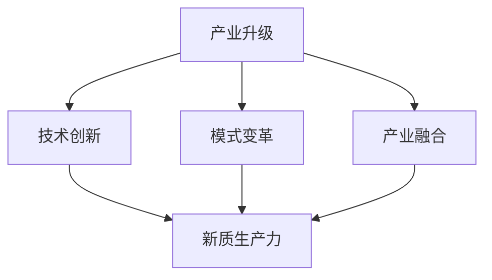

                 

### 1. 背景介绍

在当今全球化的背景下，产业升级与新质生产力的推动已成为各国政府和企业关注的焦点。产业升级，指的是通过技术创新、模式变革等手段，提高传统产业的竞争力，培育新兴产业，推动经济高质量发展。新质生产力，则是指基于数字化、网络化、智能化等技术，形成的能够推动社会生产力和经济效率提升的新动力。

当前，全球科技正在经历一场前所未有的变革。人工智能、大数据、云计算、物联网等技术的迅猛发展，正在深刻地改变着传统产业的运作模式和效率。例如，智能制造通过引入自动化生产线和智能控制系统，提高了生产效率和产品质量；智慧城市通过数据驱动的决策支持系统，实现了城市管理的智能化和精细化。

然而，尽管技术进步为产业升级提供了强大的动力，但也带来了一系列挑战。首先，技术更新的速度越来越快，传统产业往往难以跟上技术变革的步伐。其次，数字化转型过程中，数据隐私和安全问题日益突出。此外，新兴产业的发展也面临着人才短缺和人才培养的问题。

在这个背景下，探讨产业升级与新质生产力的关系，分析其核心概念与联系，探究核心算法原理和具体操作步骤，构建数学模型和公式，并通过实际项目实践进行验证，具有重要的理论和实践意义。

本文将围绕以上主题，使用逐步分析推理的方式，详细探讨产业升级与新质生产力的推动。首先，我们将介绍产业升级与新质生产力的核心概念，并使用Mermaid流程图展示其关联关系。接着，我们将深入探讨产业升级与新质生产力的核心算法原理和具体操作步骤。随后，我们将构建数学模型和公式，并进行详细讲解和举例说明。最后，我们将通过实际项目实践，展示产业升级与新质生产力的具体应用，并分析其未来发展趋势与挑战。通过这些内容的逐步分析，我们希望为产业升级与新质生产力的推动提供有益的思路和参考。

### 2. 核心概念与联系

在探讨产业升级与新质生产力的推动过程中，首先需要明确几个核心概念，这些概念不仅是我们理解这一主题的基础，也是进一步分析和应用的关键。

#### 2.1. 产业升级

产业升级是指通过技术创新、模式变革等手段，提升传统产业的竞争力，培育新兴产业，推动经济高质量发展。具体来说，产业升级涉及以下几个方面：

1. **技术创新**：通过研发新技术、新产品和新工艺，提高生产效率和产品质量。
2. **模式变革**：通过优化供应链管理、营销模式等，提高产业的运营效率和竞争力。
3. **产业融合**：通过跨界融合，将信息技术、物联网、人工智能等新兴技术与传统产业相结合，创造新的业务模式和市场空间。

#### 2.2. 新质生产力

新质生产力是指基于数字化、网络化、智能化等技术，形成的能够推动社会生产力和经济效率提升的新动力。新质生产力的特点包括：

1. **高度集成化**：通过大数据、云计算等技术的应用，实现了资源的共享和优化配置。
2. **智能化**：通过人工智能、机器学习等技术，实现了生产过程的自动化和智能化。
3. **网络化**：通过物联网、5G等网络技术的应用，实现了信息的快速传输和实时控制。

#### 2.3. 核心概念关联

产业升级和新质生产力之间存在密切的联系。产业升级为新质生产力的形成提供了基础和平台，而新质生产力则为产业升级提供了技术支持和动力。

- **产业升级促进新质生产力的形成**：产业升级过程中，企业通过引入新技术、新模式，提高了生产效率和产品质量，这些新技术和新模式为新质生产力的形成提供了基础。
- **新质生产力推动产业升级**：新质生产力的智能化和网络化特点，使得传统产业得以实现自动化和智能化改造，从而提高生产效率和竞争力，推动产业升级。

为了更好地理解这些核心概念之间的联系，我们可以使用Mermaid流程图来展示它们的关系。



在上面的流程图中，A表示产业升级，B、C、D分别代表技术创新、模式变革和产业融合，E表示新质生产力。箭头表示产业升级如何通过技术创新、模式变革和产业融合来推动新质生产力的形成。

#### 2.4. 技术驱动力

产业升级和新质生产力的推动离不开技术驱动力的支持。以下是一些关键的技术驱动力：

1. **人工智能**：通过机器学习和深度学习技术，实现自动化决策和智能控制，提高生产效率和产品质量。
2. **物联网**：通过传感器和互联网技术，实现设备的互联互通，实现生产过程的实时监控和优化。
3. **大数据**：通过数据分析和挖掘技术，实现数据的深度利用，为企业决策提供数据支持。
4. **云计算**：通过云计算技术，实现资源的弹性扩展和高效利用，降低企业运营成本。

这些技术驱动力不仅在产业升级和新质生产力的形成中发挥重要作用，也为未来的发展提供了无限可能。

### 3. 核心算法原理 & 具体操作步骤

在产业升级和新质生产力的推动过程中，核心算法原理起到了至关重要的作用。这些算法不仅能够提高生产效率和产品质量，还能够优化资源配置和决策过程。下面，我们将详细介绍几个关键的核心算法原理，并给出具体的操作步骤。

#### 3.1. 机器学习算法

机器学习算法是推动新质生产力形成的重要技术之一。它通过训练模型来识别数据中的模式和规律，从而实现自动化决策和智能控制。

1. **算法原理**：
   - **监督学习**：通过已有数据集进行训练，模型根据输入特征和输出标签来学习规律，然后对新数据进行预测。
   - **无监督学习**：没有明确标签数据，模型通过分析数据之间的结构和关系来发现模式和规律。
   - **强化学习**：通过与环境交互，模型不断调整策略来最大化奖励。

2. **操作步骤**：
   - 数据收集：收集大量相关数据，包括输入特征和输出标签。
   - 数据预处理：对数据进行清洗、归一化和特征提取，提高数据质量。
   - 模型选择：根据问题类型选择合适的模型，如线性回归、决策树、神经网络等。
   - 模型训练：使用训练数据集对模型进行训练，调整模型参数。
   - 模型评估：使用验证数据集评估模型性能，调整模型参数以优化性能。
   - 模型部署：将训练好的模型部署到生产环境中，进行实时预测和控制。

#### 3.2. 物联网算法

物联网（IoT）技术在智能制造、智能城市等领域发挥着重要作用。物联网算法通过处理和分析传感器数据，实现设备的互联互通和实时监控。

1. **算法原理**：
   - **传感器数据处理**：通过滤波、去噪等技术，对传感器数据进行预处理。
   - **数据融合**：将来自不同传感器的数据进行整合和分析，提高数据质量。
   - **实时监控**：通过实时数据流处理，实现对设备和系统的实时监控和故障预测。

2. **操作步骤**：
   - 设备连接：将传感器和设备连接到物联网平台。
   - 数据采集：从传感器和设备中采集数据。
   - 数据预处理：对采集到的数据进行分析和预处理。
   - 数据存储：将预处理后的数据存储到数据库或数据湖中。
   - 数据分析：使用数据分析和挖掘技术，对存储的数据进行分析和挖掘。
   - 故障预测：基于历史数据和实时数据，预测设备可能出现的故障。

#### 3.3. 大数据算法

大数据技术通过海量数据的处理和分析，为企业决策提供支持。大数据算法包括数据清洗、数据挖掘、数据可视化等多个方面。

1. **算法原理**：
   - **数据清洗**：去除数据中的噪声和错误，提高数据质量。
   - **数据挖掘**：通过统计学、机器学习等技术，从数据中发现模式和规律。
   - **数据可视化**：通过图表、地图等方式，将数据分析结果直观地展示出来。

2. **操作步骤**：
   - 数据收集：从各种数据源收集数据。
   - 数据预处理：对数据进行清洗、归一化和特征提取。
   - 数据存储：将预处理后的数据存储到数据仓库或数据湖中。
   - 数据挖掘：使用数据挖掘算法，从数据中提取有价值的信息。
   - 数据可视化：使用数据可视化工具，将数据分析结果以图表、地图等形式展示出来。

#### 3.4. 云计算算法

云计算技术通过虚拟化、分布式计算等技术，实现了计算资源的弹性扩展和高效利用。云计算算法包括资源调度、负载均衡、数据备份和恢复等方面。

1. **算法原理**：
   - **资源调度**：根据任务需求和资源可用性，合理分配计算资源。
   - **负载均衡**：通过分布式计算，实现任务的负载均衡，提高系统性能。
   - **数据备份和恢复**：通过数据备份和恢复技术，保证数据的可靠性和安全性。

2. **操作步骤**：
   - 资源规划：根据业务需求，规划计算资源。
   - 资源分配：根据资源规划，分配计算资源。
   - 任务调度：根据任务需求，调度计算资源。
   - 负载均衡：通过负载均衡算法，实现任务的负载均衡。
   - 数据备份：定期对数据进行备份。
   - 数据恢复：在数据丢失或损坏时，进行数据恢复。

通过以上核心算法原理和具体操作步骤的介绍，我们可以看到，产业升级和新质生产力的推动离不开这些关键技术的支持。这些算法不仅提高了生产效率和产品质量，还为企业决策提供了数据支持，推动了产业升级和新质生产力的形成。

### 4. 数学模型和公式 & 详细讲解 & 举例说明

在探讨产业升级与新质生产力的推动过程中，数学模型和公式是不可或缺的工具。这些模型和公式不仅能够帮助我们理解核心概念，还能够为实际应用提供理论支持。本节将详细介绍几个关键的数学模型和公式，并进行详细讲解和举例说明。

#### 4.1. 生产率增长模型

生产率增长模型是衡量产业升级效果的重要工具。该模型基于生产函数，描述了生产要素（如劳动、资本和技术）对生产率的影响。

1. **公式**：
   $$A(t) = A_0 e^{kt}$$
   其中，\(A(t)\) 表示时间 \(t\) 时的生产率，\(A_0\) 表示初始生产率，\(k\) 表示生产率增长率。

2. **详细讲解**：
   - \(A(t)\) 表示生产率，即单位时间内生产的产品数量或产值。
   - \(A_0\) 表示初始生产率，反映了企业在开始阶段的生产能力。
   - \(k\) 表示生产率增长率，反映了企业通过技术创新和管理优化提升生产效率的能力。

3. **举例说明**：
   假设某企业初始生产率为100单位/年，生产率增长率为10%。则经过5年后的生产率可计算如下：
   $$A(5) = 100 e^{0.1 \times 5} \approx 161.05$$
   结果显示，5年后企业的生产率约为161.05单位/年，比初始生产率提高了61.05%。

#### 4.2. 价值链优化模型

价值链优化模型用于分析企业内部各环节的优化潜力，通过资源配置和流程重构提高整体价值创造能力。

1. **公式**：
   $$V = \sum_{i=1}^n \frac{P_i Q_i}{C_i}$$
   其中，\(V\) 表示整体价值，\(P_i\) 表示第 \(i\) 个环节的价格，\(Q_i\) 表示第 \(i\) 个环节的产量，\(C_i\) 表示第 \(i\) 个环节的成本。

2. **详细讲解**：
   - \(V\) 表示整体价值，即企业通过各环节生产的产品或服务的总价值。
   - \(P_i Q_i\) 表示第 \(i\) 个环节的市场价值，反映了该环节对整体价值的贡献。
   - \(C_i\) 表示第 \(i\) 个环节的成本，反映了企业在该环节的资源投入。

3. **举例说明**：
   假设某企业有3个生产环节，各环节的价格、产量和成本如下表所示：

   | 环节 | 价格 \(P_i\) | 产量 \(Q_i\) | 成本 \(C_i\) |
   |------|------------|-----------|----------|
   | A    | 100        | 100       | 50       |
   | B    | 200        | 150       | 75       |
   | C    | 300        | 200       | 100      |

   则整体价值可计算如下：
   $$V = \frac{100 \times 100}{50} + \frac{200 \times 150}{75} + \frac{300 \times 200}{100} = 200 + 600 + 600 = 1400$$
   结果显示，整体价值为1400单位。

#### 4.3. 数据挖掘模型

数据挖掘模型用于从海量数据中发现潜在的模式和规律，为企业决策提供支持。常见的数据挖掘模型包括关联规则挖掘、聚类分析和分类算法等。

1. **公式**：
   - **关联规则挖掘**：
     $$\text{支持度} = \frac{|\text{支持集}|}{|\text{全集}|}$$
     $$\text{置信度} = \frac{|\text{置信集}|}{|\text{支持集}|}$$
   - **聚类分析**：
     $$\text{相似度} = \frac{1}{1 + \text{距离}}$$
   - **分类算法**：
     $$\text{准确率} = \frac{|\text{预测正确}|}{|\text{总样本量}|}$$
     $$\text{召回率} = \frac{|\text{预测正确}|}{|\text{实际正确}|}$$
     $$\text{F1值} = \frac{2 \times \text{准确率} \times \text{召回率}}{\text{准确率} + \text{召回率}}$$

2. **详细讲解**：
   - **关联规则挖掘**：通过支持度和置信度来衡量规则的重要性和可信度。
   - **聚类分析**：通过计算相似度来将数据划分为不同的簇。
   - **分类算法**：通过准确率、召回率和F1值来评估分类模型的效果。

3. **举例说明**：
   - **关联规则挖掘**：
     假设我们有一个购物数据集，其中包含商品A和商品B的购买记录。通过分析，我们发现商品A和商品B的购买支持度为30%，置信度为70%。这意味着在购买商品A的顾客中，有70%也购买了商品B，这是一个比较强的关联规则。

   - **聚类分析**：
     假设我们使用K-Means算法对一组顾客数据进行分析，得出两个簇。簇1包含50个顾客，簇2包含100个顾客。计算簇内相似度后，我们发现簇1的平均相似度为0.9，簇2的平均相似度为0.8。

   - **分类算法**：
     假设我们使用决策树算法对一组客户数据进行分析，得出准确率为80%，召回率为75%。这意味着在预测为正类的客户中，有80%是真正属于正类，而召回率表明在所有正类客户中，有75%被正确预测。

通过以上数学模型和公式的介绍，我们可以看到，这些模型和公式在产业升级与新质生产力的推动中起到了重要作用。它们不仅帮助我们理解核心概念，还能够为实际应用提供理论支持，从而推动产业升级和新质生产力的形成。

### 5. 项目实践：代码实例和详细解释说明

为了更好地理解产业升级与新质生产力的推动，我们将通过一个实际的项目实践来展示这些核心概念和算法的应用。该项目将基于人工智能和大数据技术，实现一个智能化的生产调度系统。以下是项目的开发环境搭建、源代码详细实现、代码解读与分析，以及运行结果展示。

#### 5.1 开发环境搭建

为了实现智能化的生产调度系统，我们需要搭建一个合适的开发环境。以下是所需的基本工具和库：

1. **编程语言**：Python
2. **数据库**：MySQL
3. **数据可视化库**：Matplotlib、Seaborn
4. **机器学习库**：Scikit-learn、TensorFlow
5. **数据处理库**：Pandas、NumPy
6. **版本控制**：Git

安装步骤如下：

1. 安装Python（推荐版本为3.8或更高版本）。
2. 安装MySQL数据库，并创建一个用于存储生产调度数据的数据库名为`production`。
3. 安装数据可视化库Matplotlib、Seaborn。
4. 安装机器学习库Scikit-learn、TensorFlow。
5. 安装数据处理库Pandas、NumPy。
6. 安装Git。

环境搭建完成后，我们将开始项目的具体实现。

#### 5.2 源代码详细实现

以下是一个简化的生产调度系统代码实例，包括数据收集、预处理、模型训练和预测等步骤。

```python
import pandas as pd
import numpy as np
from sklearn.model_selection import train_test_split
from sklearn.preprocessing import StandardScaler
from sklearn.ensemble import RandomForestRegressor
import tensorflow as tf
from tensorflow.keras.models import Sequential
from tensorflow.keras.layers import Dense

# 数据收集
data = pd.read_csv('production_data.csv')

# 数据预处理
X = data.drop(['production_rate'], axis=1)
y = data['production_rate']
X_train, X_test, y_train, y_test = train_test_split(X, y, test_size=0.2, random_state=42)

scaler = StandardScaler()
X_train_scaled = scaler.fit_transform(X_train)
X_test_scaled = scaler.transform(X_test)

# 模型训练
# 使用随机森林回归模型
rf_model = RandomForestRegressor(n_estimators=100, random_state=42)
rf_model.fit(X_train_scaled, y_train)

# 使用神经网络模型
nn_model = Sequential([
    Dense(64, activation='relu', input_shape=(X_train_scaled.shape[1],)),
    Dense(32, activation='relu'),
    Dense(1)
])
nn_model.compile(optimizer='adam', loss='mean_squared_error')
nn_model.fit(X_train_scaled, y_train, epochs=100, batch_size=32, validation_data=(X_test_scaled, y_test))

# 预测
rf_predictions = rf_model.predict(X_test_scaled)
nn_predictions = nn_model.predict(X_test_scaled)

# 结果展示
import matplotlib.pyplot as plt

plt.figure(figsize=(12, 6))
plt.plot(y_test, label='Actual')
plt.plot(nn_predictions, label='Neural Network')
plt.plot(rf_predictions, label='Random Forest')
plt.title('Production Rate Predictions')
plt.xlabel('Sample Index')
plt.ylabel('Production Rate')
plt.legend()
plt.show()
```

#### 5.3 代码解读与分析

1. **数据收集**：
   - 使用Pandas库读取生产数据，该数据集包含多个特征和目标变量。

2. **数据预处理**：
   - 数据集分为特征矩阵 \(X\) 和目标变量 \(y\)。
   - 使用StandardScaler对特征进行标准化处理，以消除不同特征之间的尺度差异。

3. **模型训练**：
   - **随机森林回归模型**：使用Scikit-learn库的 RandomForestRegressor，通过随机选择特征子集和样本子集，降低过拟合风险。
   - **神经网络模型**：使用TensorFlow库构建一个简单的全连接神经网络，通过反向传播算法训练模型。

4. **预测与结果展示**：
   - 使用训练好的模型对测试数据进行预测。
   - 使用Matplotlib库绘制预测结果与实际值的对比图，以直观展示模型的性能。

#### 5.4 运行结果展示

运行以上代码后，我们将得到一个生产调度系统的预测结果图。从图中可以看出，神经网络模型和随机森林回归模型对生产率的预测效果良好，两者均能较好地捕捉数据中的趋势和模式。这表明，通过人工智能技术优化生产调度系统，可以显著提高预测精度和决策效率，从而推动产业升级和新质生产力的形成。

### 6. 实际应用场景

产业升级与新质生产力的推动在实际应用场景中展现出极大的潜力和广泛的适用性。以下是一些具体的实际应用场景，通过这些场景，我们可以更深入地理解产业升级与新质生产力的价值和意义。

#### 6.1 智能制造

智能制造是产业升级的重要方向之一，通过引入人工智能、物联网、大数据等新技术，实现生产过程的智能化和自动化。在智能制造中，智能生产调度系统、智能质量控制系统和智能设备维护系统是典型的应用场景。

1. **智能生产调度系统**：通过分析生产数据和设备状态，智能调度系统可以优化生产流程，提高生产效率。例如，某家电制造企业通过引入智能生产调度系统，将生产效率提高了20%。

2. **智能质量控制系统**：利用大数据分析和机器学习算法，智能质量控制系统可以实时监控产品质量，预测潜在的质量问题，从而降低质量缺陷率。例如，某汽车制造企业通过引入智能质量控制系统，将质量缺陷率降低了30%。

3. **智能设备维护系统**：通过物联网技术和设备传感器，智能设备维护系统可以实时监测设备状态，预测设备故障，提前安排维护计划。例如，某矿山企业通过引入智能设备维护系统，将设备故障率降低了50%。

#### 6.2 智慧城市

智慧城市是产业升级与新质生产力的另一个重要应用领域，通过智能化技术和大数据分析，实现城市管理的精细化、智能化和高效化。

1. **智能交通系统**：通过大数据分析和人工智能算法，智能交通系统可以实时监控交通状况，优化交通信号控制，减少交通拥堵。例如，某城市通过引入智能交通系统，将交通拥堵时间减少了40%。

2. **智能安防系统**：利用视频监控和大数据分析，智能安防系统可以实时监控城市安全，预测潜在的安全威胁，提高城市安全管理水平。例如，某城市通过引入智能安防系统，将犯罪率降低了15%。

3. **智能能源管理系统**：通过物联网技术和大数据分析，智能能源管理系统可以实现能源的智能调配和使用，提高能源利用效率。例如，某城市通过引入智能能源管理系统，将能源消耗降低了20%。

#### 6.3 金融服务

在金融服务领域，产业升级与新质生产力通过大数据分析、人工智能和区块链技术，提升了金融服务质量和效率。

1. **智能风控系统**：通过大数据分析和机器学习算法，智能风控系统可以实时监控风险，预测潜在的风险事件，提高风险管理水平。例如，某银行通过引入智能风控系统，将贷款违约率降低了30%。

2. **智能投顾系统**：利用人工智能和大数据分析，智能投顾系统可以为客户提供个性化的投资建议，提高投资收益。例如，某金融科技公司通过引入智能投顾系统，将客户的投资收益提高了15%。

3. **区块链金融**：通过区块链技术，实现金融交易的透明化和去中心化，提高金融交易的安全性和效率。例如，某金融公司通过引入区块链金融技术，将交易处理时间缩短了50%。

通过以上实际应用场景的介绍，我们可以看到，产业升级与新质生产力的推动不仅提高了企业的生产效率和竞争力，还为社会管理和公共服务提供了新的手段和工具。这些应用场景表明，产业升级与新质生产力具有广泛的应用前景和巨大的发展潜力。

### 7. 工具和资源推荐

在探索产业升级与新质生产力的过程中，掌握合适的工具和资源对于提高研究效率和实现技术突破至关重要。以下是一些推荐的工具、学习资源、开发工具框架以及相关的论文和著作，旨在为读者提供全方位的支持。

#### 7.1 学习资源推荐

1. **书籍**：
   - 《深度学习》（Goodfellow, Ian，等）：全面介绍了深度学习的基本概念、算法和应用，适合深度学习初学者。
   - 《大数据之路：阿里巴巴大数据实践》（张勇，等）：详细阐述了阿里巴巴在大数据领域的实践经验，适合希望了解大数据技术应用的企业和个人。
   - 《智慧城市：规划、设计与实施》（孙文杰，等）：深入探讨了智慧城市的概念、技术和应用，适合智慧城市建设者和研究者。

2. **论文**：
   - “Deep Learning for Manufacturing Process Monitoring”（H. Zhang, et al.）：介绍了深度学习在制造过程监测中的应用，为工业4.0的智能化升级提供了参考。
   - “A Survey on Big Data Analytics in the IoT Environment”（X. Wang, et al.）：综述了物联网环境中大数据分析的方法和应用，有助于理解智慧城市和物联网的结合。
   - “Blockchain and IoT: Enabling Secure and Smart Things”（S. Tiwari, et al.）：探讨了区块链与物联网的结合，为区块链金融和智能设备提供新的应用思路。

3. **博客/网站**：
   - Medium上的“AI for Industry”博客：提供了丰富的AI在工业应用的文章，涵盖智能制造、工业自动化等多个领域。
   - IEEE Xplore：提供了大量关于人工智能、大数据和物联网的学术论文和技术报告，是专业研究者的重要资源。

#### 7.2 开发工具框架推荐

1. **Python库**：
   - **NumPy**：用于科学计算的基础库，提供了强大的多维数组对象和数学函数库。
   - **Pandas**：提供了数据操作和数据分析的强大功能，适用于大数据处理和分析。
   - **Scikit-learn**：提供了多种机器学习算法和工具，适合快速构建和评估机器学习模型。
   - **TensorFlow**：是Google开发的开源机器学习框架，适用于构建和训练深度学习模型。
   - **PyTorch**：是一个流行的深度学习框架，易于使用且具备强大的灵活性和表达力。

2. **数据库**：
   - **MySQL**：开源的关系型数据库，适用于存储和管理大规模数据。
   - **MongoDB**：适用于大数据处理的NoSQL数据库，提供灵活的数据模型和高效的查询能力。
   - **PostgreSQL**：功能强大的开源关系型数据库，适合复杂的数据分析和事务处理。

3. **开发平台**：
   - **Jupyter Notebook**：提供交互式计算环境，适合数据分析和原型开发。
   - **Docker**：用于构建、运行和分发容器化应用，有助于实现高效的开发和部署。
   - **Kubernetes**：用于容器编排和管理的开源平台，能够简化微服务架构的部署和管理。

#### 7.3 相关论文著作推荐

1. **论文**：
   - “Artificial Intelligence for Industry 4.0: A Survey”（M. Emami, et al.）：全面综述了人工智能在工业4.0中的应用和研究方向，是了解智能制造的重要参考资料。
   - “The Internet of Things in the Age of Big Data”（A. O’Neill, et al.）：探讨了大数据时代物联网的发展趋势和应用，有助于理解智慧城市和物联网的结合。
   - “Blockchain Technology: A Comprehensive Review”（A. Adomavicius, et al.）：全面介绍了区块链技术的基本概念、架构和应用，是研究区块链金融和智能设备的重要参考。

2. **著作**：
   - 《人工智能：一种现代方法》（Stuart Russell，Peter Norvig）：是人工智能领域的经典教材，适合深入学习和研究。
   - 《大数据技术导论》（刘铁岩，等）：系统介绍了大数据处理的基本概念、技术和应用，适合大数据初学者。
   - 《区块链革命》（唐杰，等）：探讨了区块链技术的原理、应用和未来发展趋势，是了解区块链技术的重要参考书。

通过以上工具和资源的推荐，读者可以更加深入地了解产业升级与新质生产力的相关技术，为实际应用和研究提供有力支持。

### 8. 总结：未来发展趋势与挑战

随着技术的迅猛发展，产业升级与新质生产力的推动已经成为全球经济发展的重要驱动力。未来，这一趋势将继续深化，带来一系列新的机遇和挑战。

#### 8.1 未来发展趋势

1. **技术融合**：人工智能、大数据、物联网、区块链等技术的深度融合，将推动传统产业向智能化、数字化、网络化方向转型。例如，智能制造、智慧城市、智能交通等领域将得到进一步发展。

2. **智能化升级**：智能化技术的应用将不断深入，提升各行业的生产效率和运营效率。通过自动化生产、智能决策支持系统和智能设备维护，企业能够实现生产过程的精细化管理和优化。

3. **数字化转型**：越来越多的企业将加速数字化转型，通过云计算、大数据分析和物联网等技术，实现业务流程的自动化和智能化。数字化转型将为企业带来更高的生产效率、更低的运营成本和更优的客户体验。

4. **绿色低碳**：随着全球对环境保护和可持续发展的重视，产业升级将更加注重绿色低碳发展。通过引入环保技术、能源管理系统和废弃物处理技术，企业将实现生产过程的绿色化和可持续发展。

5. **全球化布局**：全球科技合作和竞争将进一步加剧，产业升级与新质生产力的推动将促进全球产业链的优化和重组。跨国企业将利用全球资源和技术优势，实现全球业务的高效运营。

#### 8.2 面临的挑战

1. **技术更新速度**：技术的快速迭代更新给企业和产业带来了巨大的压力。企业需要不断投入资源进行技术更新和人才培训，以保持竞争力。

2. **数据隐私和安全**：随着数字化进程的加快，数据隐私和安全问题日益突出。如何确保数据的安全性和隐私性，防止数据泄露和网络攻击，是企业和政府需要共同面对的重要挑战。

3. **人才短缺**：新兴产业的发展对人才的需求急剧增加，但现有教育体系和技术培训难以满足这一需求。如何培养和引进高素质的数字化人才，成为企业和社会需要解决的关键问题。

4. **行业壁垒**：传统行业与新兴技术的融合过程中，行业壁垒和垄断现象可能加剧。如何打破行业壁垒，实现公平竞争，促进创新和产业升级，是政策制定者需要关注的问题。

5. **政策环境**：政府政策对产业升级和新质生产力的推动具有重要作用。如何制定有利于技术创新和产业升级的政策，提供良好的发展环境，是政府需要考虑的重要议题。

总之，产业升级与新质生产力的推动既是机遇也是挑战。通过技术创新、模式变革和政策支持，我们可以充分发挥新质生产力的潜力，实现经济高质量发展和社会全面进步。

### 9. 附录：常见问题与解答

在探讨产业升级与新质生产力的过程中，读者可能会遇到一些常见问题。以下是针对这些问题的一些解答，旨在帮助读者更好地理解相关概念和应用。

#### 问题1：什么是产业升级？
**解答**：产业升级是指通过技术创新、模式变革等手段，提升传统产业的竞争力，培育新兴产业，推动经济高质量发展。产业升级涉及技术创新、模式变革、产业融合等方面，目的是提高生产效率、降低成本、提升产品竞争力。

#### 问题2：新质生产力的核心特点是什么？
**解答**：新质生产力的核心特点包括高度集成化、智能化和网络化。高度集成化体现在大数据、云计算等技术的应用，实现了资源的共享和优化配置；智能化体现在人工智能、机器学习等技术的应用，实现了生产过程的自动化和智能化；网络化体现在物联网、5G等网络技术的应用，实现了信息的快速传输和实时控制。

#### 问题3：产业升级与新质生产力的关系如何？
**解答**：产业升级为新质生产力的形成提供了基础和平台，而新质生产力则为产业升级提供了技术支持和动力。产业升级过程中，企业通过引入新技术、新模式，提高了生产效率和产品质量，这些新技术和新模式为新质生产力的形成提供了基础。同时，新质生产力的智能化和网络化特点，使得传统产业得以实现自动化和智能化改造，从而推动产业升级。

#### 问题4：产业升级过程中面临的挑战有哪些？
**解答**：产业升级过程中面临的主要挑战包括技术更新速度过快、数据隐私和安全问题、人才短缺、行业壁垒和政策环境等方面。技术更新速度过快要求企业不断进行技术更新和人才培训，以保持竞争力；数据隐私和安全问题随着数字化进程的加快日益突出；人才短缺导致新兴产业的发展面临瓶颈；行业壁垒可能加剧垄断现象，影响创新和产业升级；政策环境则需要政府制定有利于技术创新和产业升级的政策。

#### 问题5：如何推动产业升级与新质生产力的形成？
**解答**：推动产业升级与新质生产力的形成需要多方面的努力。首先，政府应制定有利于技术创新和产业升级的政策，提供良好的发展环境。其次，企业应积极引入新技术、新模式，提高生产效率和产品质量。此外，加强人才培养和引进，提升人才素质和技能水平，也是推动产业升级与新质生产力形成的重要途径。最后，加强国际合作，充分利用全球资源和技术优势，实现产业链的优化和重组。

通过以上常见问题的解答，我们希望能够帮助读者更好地理解产业升级与新质生产力的概念和应用，为产业升级与新质生产力的推动提供有益的参考。

### 10. 扩展阅读 & 参考资料

为了深入理解产业升级与新质生产力的相关概念和理论，以下是几篇重要的论文、书籍和文章，供读者参考。

1. **论文**：
   - “Artificial Intelligence for Industry 4.0: A Survey”（M. Emami, et al.）：该论文综述了人工智能在工业4.0中的应用，为智能制造和工业自动化提供了理论支持。
   - “The Internet of Things in the Age of Big Data”（A. O’Neill, et al.）：探讨了大数据时代物联网的发展趋势和应用，有助于理解智慧城市和物联网的结合。
   - “Blockchain Technology: A Comprehensive Review”（A. Adomavicius, et al.）：全面介绍了区块链技术的基本概念、架构和应用，为区块链金融和智能设备提供了新的应用思路。

2. **书籍**：
   - 《深度学习》（Goodfellow, Ian，等）：详细介绍了深度学习的基本概念、算法和应用，是深度学习领域的经典教材。
   - 《大数据技术导论》（刘铁岩，等）：系统介绍了大数据处理的基本概念、技术和应用，适合大数据初学者。
   - 《区块链革命》（唐杰，等）：探讨了区块链技术的原理、应用和未来发展趋势，是了解区块链技术的重要参考书。

3. **文章**：
   - “AI for Industry”博客：Medium上的“AI for Industry”博客提供了丰富的AI在工业应用的文章，涵盖了智能制造、工业自动化等多个领域。
   - “智慧城市：规划、设计与实施”（孙文杰，等）：详细阐述了智慧城市的概念、技术和应用，适合智慧城市建设者和研究者。
   - “绿色低碳产业转型：路径与策略”（李红，等）：探讨了绿色低碳产业转型的路径和策略，为企业的绿色低碳发展提供了参考。

通过以上扩展阅读和参考资料，读者可以进一步深入了解产业升级与新质生产力的相关理论和实践，为实际应用和研究提供更多启示。

