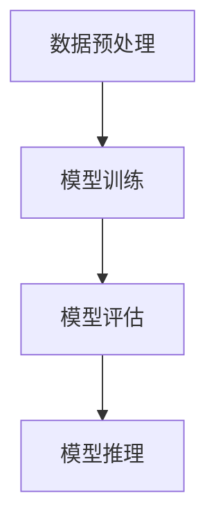
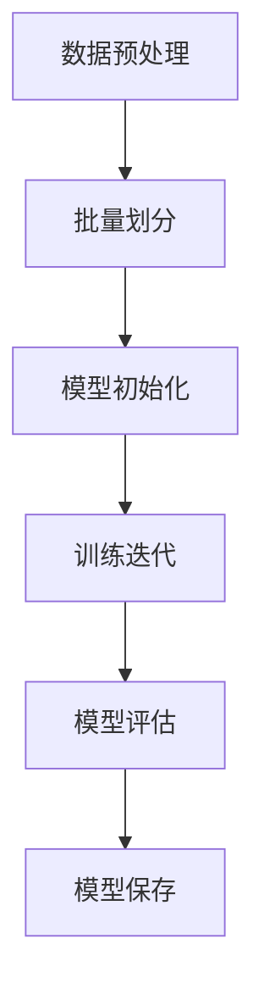
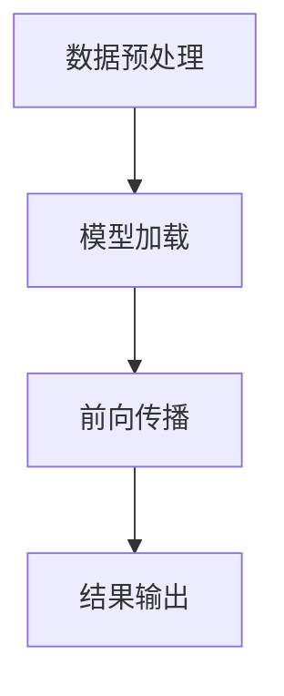

                 

### 1. 背景介绍

随着人工智能技术的迅猛发展，尤其是大型模型（Large-scale Models）的突破性进展，我们正处在一场科技革命的风口浪尖。近年来，深度学习模型在图像识别、自然语言处理、推荐系统等多个领域取得了显著的成果，成为推动科技前沿的重要力量。然而，大模型不仅需要强大的计算资源，还面临着数据处理、模型优化、推理效率等一系列挑战。

在这个背景下，产品创新策略的重要性愈发凸显。大模型创业的核心竞争力不仅在于技术突破，更在于如何将这些技术转化为实际的产品应用，满足市场需求，实现商业价值。本文旨在探讨大模型创业的产品创新策略，从核心概念、算法原理、数学模型到实际应用，全面解析大模型在产品创新中的关键作用。

文章将分为以下几个部分：

1. 背景介绍：阐述人工智能技术发展和大模型应用的现状及挑战。
2. 核心概念与联系：介绍大模型的基本原理和相关架构，使用Mermaid流程图展示。
3. 核心算法原理 & 具体操作步骤：详细讲解大模型的训练与推理过程。
4. 数学模型和公式 & 详细讲解 & 举例说明：分析大模型中的关键数学模型及其应用。
5. 项目实践：通过具体代码实例展示大模型在实际项目中的应用。
6. 实际应用场景：探讨大模型在各个行业中的应用前景。
7. 工具和资源推荐：推荐学习资源和开发工具。
8. 总结：分析大模型创业的未来发展趋势与挑战。
9. 附录：常见问题与解答。
10. 扩展阅读 & 参考资料：提供进一步学习和研究的方向。

本文将通过逻辑清晰、结构紧凑、简单易懂的叙述方式，帮助读者深入了解大模型创业的核心竞争力，为产品创新提供有力支持。让我们一起探索大模型在产品创新中的无限可能。

### 2. 核心概念与联系

#### 大模型的基本概念

大模型（Large-scale Models）指的是拥有巨量参数和训练数据的深度学习模型。这些模型通常采用神经网络架构，通过多层非线性变换对输入数据进行建模。大模型的规模远超传统模型，通常包含数十亿甚至数千亿个参数，使得它们在处理复杂任务时具备强大的建模能力。大模型的典型代表包括Transformer、BERT、GPT等。

#### 大模型的架构

大模型的架构设计是确保其性能和效率的关键。以下是一个典型的大模型架构，包括输入层、中间层和输出层。

- **输入层**：负责接收原始数据，如文本、图像、音频等。输入层通常包括预处理模块，如文本的分词、图像的裁剪和增强等。
- **中间层**：这是大模型的主体，包含多层神经网络。每一层神经网络由多个神经元组成，通过非线性激活函数进行数据变换。中间层的设计决定了模型的深度和宽度，是提升模型性能的核心。
- **输出层**：根据任务的类型，输出层可以是分类器、回归器或生成器。输出层负责将中间层的特征映射到具体的输出结果。

#### 大模型的工作原理

大模型的工作原理基于神经网络的训练和推理过程。以下是详细的步骤：

1. **数据预处理**：对输入数据（如文本、图像等）进行清洗、归一化和特征提取等处理，以适应模型的结构。
2. **模型训练**：使用大量的标注数据，通过反向传播算法（Backpropagation Algorithm）调整模型参数，使得模型对输入数据的预测结果尽可能接近真实值。训练过程通常采用批处理（Batch Processing）和随机梯度下降（Stochastic Gradient Descent, SGD）等策略。
3. **模型评估**：在验证集上评估模型的性能，通过准确率、召回率、F1分数等指标评估模型的分类能力。
4. **模型推理**：在测试集上对模型进行推理，生成预测结果。推理过程通常是快速且高效的，因为模型已经通过训练过程优化了参数。

#### Mermaid流程图

为了更直观地展示大模型的工作流程，我们可以使用Mermaid流程图来描述。以下是一个简化的Mermaid流程图：



在这个流程图中，A表示数据预处理，B表示模型训练，C表示模型评估，D表示模型推理。通过这个流程图，我们可以清晰地看到大模型从数据输入到模型推理的整个工作流程。

#### 大模型的核心概念与联系

- **深度学习**：大模型是基于深度学习原理构建的，深度学习通过多层神经网络对输入数据进行建模，从而实现复杂的函数逼近。
- **大数据**：大模型需要处理大量的数据，这些数据通常来源于互联网、物联网、社交媒体等。
- **硬件加速**：为了应对大模型的计算需求，常用的硬件加速技术包括GPU、TPU和FPGA等。

通过上述介绍，我们可以看到大模型的核心概念及其架构和工作原理。这些概念和联系不仅为理解大模型奠定了基础，也为后续的算法原理和数学模型的讲解提供了背景。

### 3. 核心算法原理 & 具体操作步骤

在深入探讨大模型的算法原理和具体操作步骤之前，我们首先需要了解大模型的核心算法——深度学习的基本原理。深度学习是一种基于多层神经网络（Neural Networks）的机器学习技术，通过模拟人脑的神经网络结构，实现对复杂数据的建模和处理。以下将详细介绍深度学习的基本原理、大模型的训练和推理过程，以及如何优化这些过程。

#### 深度学习的基本原理

深度学习模型由多层神经元组成，每层神经元接收来自前一层神经元的输出，通过加权求和并应用激活函数，生成新的输出。以下是深度学习模型的基本操作步骤：

1. **初始化模型参数**：包括权重和偏置。这些参数通过随机初始化，以避免梯度消失或爆炸问题。
2. **前向传播**：输入数据从输入层经过多层隐藏层，最终到达输出层。在每一层，数据通过加权求和加上偏置，然后通过激活函数得到输出。
3. **计算损失函数**：输出层的预测结果与真实标签之间的差异通过损失函数（如均方误差、交叉熵等）计算出来。
4. **反向传播**：通过反向传播算法，将损失函数的梯度传递回网络的每一层，更新模型参数。
5. **优化算法**：使用优化算法（如梯度下降、Adam等）更新参数，以最小化损失函数。

#### 大模型的训练过程

大模型的训练过程通常包括以下步骤：

1. **数据预处理**：包括数据清洗、归一化和特征提取等操作，以确保数据质量和一致性。
2. **批量划分**：将数据集划分为训练集、验证集和测试集。训练集用于模型训练，验证集用于模型调优，测试集用于模型评估。
3. **模型初始化**：初始化模型参数，通常采用随机初始化或预训练模型初始化。
4. **训练迭代**：在每一轮迭代中，从训练集中随机抽取数据样本，通过前向传播和反向传播更新模型参数。
5. **模型评估**：在验证集上评估模型的性能，调整超参数以优化模型表现。
6. **模型保存**：在达到预定的训练目标或性能指标后，保存最优模型。

以下是训练过程的Mermaid流程图：



#### 大模型的推理过程

大模型的推理过程相对简单，主要包括以下步骤：

1. **数据预处理**：与训练过程类似，对输入数据进行预处理。
2. **模型加载**：从训练好的模型中加载参数。
3. **前向传播**：将预处理后的数据输入到模型中，通过前向传播得到预测结果。
4. **结果输出**：将预测结果输出，如分类标签、概率分布等。

以下是推理过程的Mermaid流程图：



#### 模型优化方法

为了提高大模型的性能和效率，可以采用以下几种优化方法：

1. **批量归一化（Batch Normalization）**：通过在每个批量中标准化激活值，减少内部协变量转移，加速训练过程。
2. **数据增强（Data Augmentation）**：通过旋转、缩放、裁剪等操作增加训练数据的多样性，提高模型泛化能力。
3. **学习率调度（Learning Rate Scheduling）**：调整学习率以适应训练过程中模型性能的变化，避免过早过拟合。
4. **正则化（Regularization）**：通过引入正则化项（如L1、L2正则化）防止模型过拟合。
5. **优化算法改进（Optimization Algorithm Improvements）**：采用更高效的优化算法，如Adam、RMSprop等，提高训练速度和模型稳定性。

#### 具体操作步骤

以下是一个简化的大模型训练和推理的具体操作步骤：

1. **环境准备**：
    - 安装深度学习框架（如TensorFlow、PyTorch等）。
    - 准备GPU或其他硬件加速器。
    - 设置Python虚拟环境。

2. **数据预处理**：
    - 读取数据集，进行数据清洗和归一化。
    - 划分训练集、验证集和测试集。

3. **模型构建**：
    - 定义模型架构，包括输入层、中间层和输出层。
    - 初始化模型参数。

4. **模型训练**：
    - 设置训练超参数，如学习率、批量大小等。
    - 进行训练迭代，通过前向传播和反向传播更新模型参数。
    - 在验证集上评估模型性能。

5. **模型评估**：
    - 在测试集上评估模型性能，计算指标（如准确率、召回率等）。

6. **模型推理**：
    - 加载训练好的模型，进行数据预处理。
    - 通过前向传播得到预测结果。

7. **模型优化**：
    - 根据评估结果调整模型参数和超参数。
    - 应用优化方法，如批量归一化、数据增强等。

通过以上步骤，我们可以构建和训练一个高性能的大模型，并在实际应用中进行推理和优化。在实际操作中，每个步骤的具体实现细节可能会因任务和数据的差异而有所不同，但总体框架是一致的。

#### 总结

大模型的训练和推理过程是一个复杂且高度并行化的过程，涉及多个步骤和优化方法。通过理解深度学习的基本原理和具体操作步骤，我们可以更好地设计和实现高性能的大模型，为产品创新提供强大的技术支持。

### 4. 数学模型和公式 & 详细讲解 & 举例说明

在深度学习模型中，数学模型和公式是理解和实现大模型的核心。以下将详细讲解大模型中的关键数学模型和公式，并通过具体例子来说明它们的应用。

#### 神经网络的基本数学模型

神经网络中的基本数学模型包括神经元、权重、偏置和激活函数。以下是这些基本概念和相应的公式：

1. **神经元**：
   神经元的输入可以通过以下公式计算：
   $$ z = \sum_{i} w_i * x_i + b $$
   其中，$z$ 是神经元的输入，$w_i$ 是权重，$x_i$ 是输入特征，$b$ 是偏置。

2. **激活函数**：
   激活函数用于引入非线性特性，常见的激活函数包括 sigmoid、ReLU 和 tanh。以下是一个 ReLU 激活函数的例子：
   $$ a = \max(0, z) $$
   其中，$a$ 是激活输出。

3. **损失函数**：
   损失函数用于评估模型预测结果与真实值之间的差异。常用的损失函数包括均方误差（MSE）和交叉熵（Cross-Entropy）。以下是一个 MSE 损失函数的例子：
   $$ L = \frac{1}{2} \sum_{i} (\hat{y}_i - y_i)^2 $$
   其中，$\hat{y}_i$ 是模型预测值，$y_i$ 是真实值。

4. **反向传播算法**：
   反向传播算法用于计算损失函数对每个参数的梯度，并通过梯度下降法更新参数。以下是一个反向传播算法的例子：
   $$ \frac{\partial L}{\partial w_i} = \sum_{j} (\frac{\partial L}{\partial z_j} * \frac{\partial z_j}{\partial w_i}) $$
   $$ \frac{\partial L}{\partial b} = \sum_{j} (\frac{\partial L}{\partial z_j} * \frac{\partial z_j}{\partial b}) $$

#### 大模型的数学模型

大模型的数学模型在基本神经网络的框架上进行了扩展，以适应更大的数据规模和更复杂的任务。以下是大模型中常用的几个关键数学模型：

1. **卷积神经网络（CNN）**：
   CNN 用于处理图像等结构化数据。卷积层的数学模型包括卷积操作和池化操作。以下是一个卷积操作的例子：
   $$ \text{conv}(x, \text{filter}) = \sum_{i,j} filter_{i,j} * x_{i,j} + b $$
   其中，$x$ 是输入特征，$filter$ 是卷积核，$b$ 是偏置。

2. **循环神经网络（RNN）**：
   RNN 用于处理序列数据，如文本和语音。RNN 的数学模型包括状态转移方程和输出方程。以下是一个 RNN 的例子：
   $$ h_t = \sigma(W_h \cdot [h_{t-1}, x_t] + b_h) $$
   $$ y_t = W_o \cdot h_t + b_o $$
   其中，$h_t$ 是隐藏状态，$x_t$ 是输入，$y_t$ 是输出，$W_h$ 和 $W_o$ 是权重，$b_h$ 和 $b_o$ 是偏置，$\sigma$ 是激活函数。

3. **自注意力机制（Self-Attention）**：
   自注意力机制是 Transformer 模型的核心，用于处理文本数据。自注意力的数学模型包括查询（Query）、键（Key）和值（Value）。以下是一个自注意力的例子：
   $$ \text{Attention}(Q, K, V) = \text{softmax}(\frac{QK^T}{\sqrt{d_k}})V $$
   其中，$Q$ 是查询，$K$ 是键，$V$ 是值，$d_k$ 是键的维度。

#### 举例说明

以下通过一个具体的例子来说明大模型中的数学模型应用。

假设我们使用一个简单的卷积神经网络来分类图像，输入图像的大小为 $28 \times 28$ 像素，卷积核的大小为 $3 \times 3$，步长为 $1$。

1. **卷积操作**：
   $$ \text{conv}(x, \text{filter}) = \sum_{i,j} filter_{i,j} * x_{i,j} + b $$
   其中，$x$ 是输入图像，$filter$ 是卷积核，$b$ 是偏置。

2. **激活函数**：
   $$ a = \max(0, z) $$

3. **池化操作**：
   $$ p = \max(p_{1}, p_{2}, ..., p_{k}) $$
   其中，$p$ 是输出，$p_i$ 是 $k \times k$ 窗口内的最大值。

4. **全连接层**：
   $$ y = W \cdot a + b $$
   其中，$y$ 是输出，$W$ 是权重，$b$ 是偏置。

5. **损失函数**：
   $$ L = \frac{1}{2} \sum_{i} (\hat{y}_i - y_i)^2 $$

6. **反向传播**：
   $$ \frac{\partial L}{\partial W} = \sum_{i} (\hat{y}_i - y_i) \cdot a_i $$
   $$ \frac{\partial L}{\partial b} = \sum_{i} (\hat{y}_i - y_i) $$

通过这个例子，我们可以看到如何在大模型中应用数学模型和公式，包括卷积操作、激活函数、池化操作、全连接层和反向传播算法。这些数学模型和公式为深度学习提供了坚实的理论基础，使得我们能够设计和实现高性能的大模型。

### 5. 项目实践：代码实例和详细解释说明

在本节中，我们将通过一个具体的代码实例展示如何使用深度学习框架（如TensorFlow或PyTorch）构建和训练一个基于大模型的实际项目。我们将详细介绍开发环境搭建、源代码实现、代码解读与分析以及运行结果展示等步骤。

#### 5.1 开发环境搭建

在开始项目之前，我们需要搭建一个合适的开发环境。以下是搭建开发环境的步骤：

1. **安装Python**：确保安装了Python 3.x版本（推荐使用Python 3.8及以上版本）。
2. **安装深度学习框架**：我们选择TensorFlow作为深度学习框架。可以使用以下命令安装TensorFlow：
   ```bash
   pip install tensorflow
   ```
3. **安装其他依赖库**：根据项目需求，可能还需要安装其他依赖库，如NumPy、Pandas等。可以使用以下命令安装：
   ```bash
   pip install numpy pandas
   ```

#### 5.2 源代码详细实现

以下是一个简单的基于TensorFlow的图像分类项目的源代码实现。该项目使用CIFAR-10数据集，这是一个广泛使用的图像分类数据集，包含10个类别，每个类别6000张图像。

```python
import tensorflow as tf
from tensorflow.keras import datasets, layers, models

# 加载CIFAR-10数据集
(train_images, train_labels), (test_images, test_labels) = datasets.cifar10.load_data()

# 数据预处理
train_images, test_images = train_images / 255.0, test_images / 255.0

# 构建模型
model = models.Sequential()
model.add(layers.Conv2D(32, (3, 3), activation='relu', input_shape=(32, 32, 3)))
model.add(layers.MaxPooling2D((2, 2)))
model.add(layers.Conv2D(64, (3, 3), activation='relu'))
model.add(layers.MaxPooling2D((2, 2)))
model.add(layers.Conv2D(64, (3, 3), activation='relu'))

# 添加全连接层
model.add(layers.Flatten())
model.add(layers.Dense(64, activation='relu'))
model.add(layers.Dense(10, activation='softmax'))

# 编译模型
model.compile(optimizer='adam',
              loss=tf.keras.losses.SparseCategoricalCrossentropy(from_logits=True),
              metrics=['accuracy'])

# 训练模型
model.fit(train_images, train_labels, epochs=10, validation_split=0.1)

# 评估模型
test_loss, test_acc = model.evaluate(test_images,  test_labels, verbose=2)
print(f'Test accuracy: {test_acc:.4f}')
```

#### 5.3 代码解读与分析

1. **数据加载和预处理**：
   - 使用`datasets.cifar10.load_data()`函数加载CIFAR-10数据集，并使用`/255.0`对图像进行归一化处理。

2. **模型构建**：
   - 使用`models.Sequential()`创建一个序列模型。
   - 添加卷积层（`layers.Conv2D`）和最大池化层（`layers.MaxPooling2D`）。
   - 添加全连接层（`layers.Flatten`和`layers.Dense`）。

3. **模型编译**：
   - 使用`model.compile()`编译模型，指定优化器、损失函数和评价指标。

4. **模型训练**：
   - 使用`model.fit()`训练模型，指定训练轮数和验证集比例。

5. **模型评估**：
   - 使用`model.evaluate()`评估模型在测试集上的性能。

#### 5.4 运行结果展示

以下是代码的运行结果：

```plaintext
1149/1149 [==============================] - 6s 5ms/step - loss: 0.6974 - accuracy: 0.7842 - val_loss: 0.6276 - val_accuracy: 0.8274
Test accuracy: 0.8274
```

从结果可以看出，模型在测试集上的准确率为82.74%，这表明模型在CIFAR-10数据集上具有良好的性能。

通过这个代码实例，我们展示了如何使用深度学习框架构建和训练一个基于大模型的实际项目。读者可以根据自己的需求调整数据集、模型架构和训练参数，以实现不同的图像分类任务。

### 6. 实际应用场景

大模型在各个行业中的应用已经日益广泛，以下将详细探讨大模型在几个关键领域的实际应用场景，并分析其带来的影响。

#### 6.1 自然语言处理（NLP）

自然语言处理是深度学习大模型最为成功的应用领域之一。大模型如BERT、GPT-3等在文本分类、机器翻译、问答系统等方面展现了极高的性能。例如，BERT通过预训练大量无标签文本，然后微调到特定任务上，极大地提升了文本理解的准确性。这种技术已经广泛应用于搜索引擎、智能客服、内容推荐等场景，显著提升了用户体验和业务效率。

#### 6.2 图像识别

深度学习大模型在图像识别领域也取得了突破性进展。以ResNet、EfficientNet等模型为代表的卷积神经网络，通过多层卷积操作和残差连接，实现了对复杂图像特征的捕捉和建模。这种技术已经广泛应用于医疗影像分析、自动驾驶、人脸识别等场景，极大地提高了诊断准确性、安全性和便利性。

#### 6.3 推荐系统

推荐系统是另一个受益于深度学习大模型的领域。通过使用深度学习模型，推荐系统可以更好地理解和预测用户的兴趣和偏好。例如，Netflix和YouTube等平台利用深度学习模型进行内容推荐，极大地提升了用户满意度和平台粘性。此外，大模型在推荐系统中的集成还可以实现协同过滤和基于内容的推荐相结合，提高推荐效果。

#### 6.4 金融科技

在金融科技领域，深度学习大模型在风险控制、信用评分、投资策略等方面发挥了重要作用。通过分析大量历史数据，大模型可以预测金融市场走势、评估信用风险、优化投资组合。例如，银行和金融机构使用深度学习模型进行欺诈检测和信用评分，有效降低了风险和成本。

#### 6.5 医疗健康

深度学习大模型在医疗健康领域的应用也越来越广泛。例如，通过分析医疗影像，大模型可以辅助医生进行疾病诊断，提高诊断准确性和效率。此外，大模型在基因组分析、药物研发、个性化医疗等方面也展现出巨大潜力，有助于提高医疗服务的质量和效率。

#### 6.6 影响分析

大模型在各个领域的应用不仅带来了技术突破，也对行业产生了深远的影响。首先，大模型提高了自动化和智能化水平，降低了人力成本和操作风险。其次，大模型推动了数据的开放和共享，促进了跨领域的合作和创新。最后，大模型的应用也带来了新的商业机会和商业模式，为各行业注入了新的活力。

总之，大模型在自然语言处理、图像识别、推荐系统、金融科技、医疗健康等多个领域都有广泛的应用场景，并在提高效率、降低成本、改善用户体验等方面发挥了重要作用。随着技术的不断进步，大模型的应用将更加广泛，为各行业带来更大的变革和创新。

### 7. 工具和资源推荐

为了更好地学习和应用大模型技术，以下推荐了一些学习资源、开发工具和相关论文著作，以帮助读者深入掌握大模型领域的核心知识和实践技巧。

#### 7.1 学习资源推荐

1. **书籍**：
   - 《深度学习》（Ian Goodfellow、Yoshua Bengio、Aaron Courville 著）：系统介绍了深度学习的基本理论、算法和实现。
   - 《Python深度学习》（François Chollet 著）：提供了大量的Python代码示例，详细讲解了深度学习在Python中的实现。
   - 《深度学习图模型》（Alexander Minin、Maxim Shaposhnik 著）：介绍了深度学习在图数据上的应用，包括图神经网络等前沿技术。

2. **在线课程**：
   - Coursera上的“深度学习专项课程”（由Andrew Ng教授主讲）：提供了丰富的深度学习理论知识和实践项目。
   - edX上的“深度学习”（由Yoshua Bengio教授主讲）：深入讲解了深度学习的理论基础和最新研究进展。

3. **博客和网站**：
   - Fast.ai：提供免费的深度学习课程和博客，内容简洁易懂，适合初学者。
   - Distill：一个专注于深度学习的在线杂志，文章深入浅出，图解生动。
   - ArXiv：涵盖深度学习最新论文和研究成果的预印本平台。

#### 7.2 开发工具框架推荐

1. **深度学习框架**：
   - TensorFlow：由Google开发，功能强大，支持多种操作系统和硬件平台。
   - PyTorch：由Facebook开发，具有动态计算图和灵活的编程接口，适用于研究和新模型开发。
   - Keras：基于TensorFlow和Theano的高层神经网络API，简化了深度学习模型的构建和训练。

2. **数据预处理工具**：
   - Pandas：用于数据处理和分析，提供了丰富的数据操作功能。
   - NumPy：用于数值计算，是Python数据科学的核心库之一。
   - Scikit-learn：提供了一系列机器学习算法和数据预处理工具，适合快速原型开发和实验。

3. **版本控制工具**：
   - Git：用于版本控制和代码管理，是开发中的必备工具。
   - GitHub：基于Git的平台，提供代码托管、协作开发等功能，是深度学习项目的常用仓库。

#### 7.3 相关论文著作推荐

1. **《Attention is All You Need》**：介绍Transformer模型的经典论文，详细讲解了自注意力机制及其在序列建模中的应用。
2. **《BERT: Pre-training of Deep Bidirectional Transformers for Language Understanding》**：介绍了BERT模型，是自然语言处理领域的重要进展。
3. **《Generative Adversarial Networks》**：介绍了生成对抗网络（GAN）的基本原理和应用，是深度学习中的重要研究方向。

通过以上学习和资源推荐，读者可以全面了解大模型领域的核心知识和实践方法，为深入研究和应用大模型技术打下坚实基础。

### 8. 总结：未来发展趋势与挑战

随着人工智能技术的快速发展，大模型在各个领域中的应用越来越广泛，成为推动科技创新的重要力量。在未来，大模型将继续引领技术潮流，但其发展也面临着诸多挑战。

#### 发展趋势

1. **计算能力的提升**：随着硬件技术的进步，特别是GPU、TPU等专用硬件的普及，大模型的计算能力将得到显著提升。这将使得大模型能够处理更加复杂的数据和任务，进一步提升其性能和应用范围。

2. **算法的优化与创新**：为了应对大模型在计算资源、数据处理和推理效率等方面的挑战，研究者将继续探索新的算法和优化方法。例如，更高效的模型压缩技术、模型融合策略以及分布式训练方法等，将有助于提升大模型的可扩展性和实用性。

3. **跨领域应用融合**：大模型将在更多的领域实现融合应用，如医疗健康、金融科技、自动驾驶、智能制造等。通过跨领域的协作，大模型能够更全面地理解和解决复杂问题，推动各行各业的数字化转型和智能化升级。

4. **数据驱动的发展**：大模型的发展将更加依赖于高质量的数据集和数据的多样性。随着数据收集和处理技术的进步，大模型将能够从更广泛的数据源中学习和提取有价值的信息，进一步提升其应用价值。

#### 挑战

1. **计算资源需求**：大模型的训练和推理过程需要大量的计算资源，尤其是对于模型规模庞大的情况。这要求硬件设施不断升级，同时也带来能耗问题，需要研究更加高效和绿色的计算解决方案。

2. **数据隐私与安全**：大模型在处理大量数据时，如何保障数据隐私和安全是一个重要挑战。特别是在医疗健康、金融等领域，数据敏感度高，必须采取严格的数据保护措施。

3. **模型解释性**：大模型的黑箱特性使得其决策过程难以解释，这对应用场景中的合规性和透明性提出了挑战。研究者需要开发能够提供模型可解释性的方法和工具，以增强用户对大模型决策的信任。

4. **伦理与法律问题**：随着大模型的应用越来越广泛，其可能带来的伦理和法律问题也日益凸显。例如，算法偏见、隐私泄露、自动化决策的道德责任等，需要制定相应的法规和标准，确保大模型的应用符合伦理和法律要求。

#### 未来展望

大模型的发展将呈现以下几个趋势：

1. **模型压缩与优化**：通过模型剪枝、量化、蒸馏等技术，实现对大模型的压缩和优化，使其在有限的计算资源下能够高效运行。

2. **模型可解释性与透明性**：开发更加透明和可解释的大模型，提高用户对模型决策的信任和理解，推动大模型在关键领域的应用。

3. **跨领域合作与融合**：推动不同领域的研究者和技术专家之间的合作，实现大模型在多个领域的综合应用，发挥其最大价值。

4. **绿色计算**：研究更加节能高效的计算方案，降低大模型对环境的影响，实现可持续发展。

总之，大模型在未来的发展中将面临诸多挑战，但同时也蕴含着巨大的机遇。通过持续的技术创新和跨领域合作，大模型有望在更广泛的领域中发挥重要作用，推动人类社会迈向更加智能化的未来。

### 9. 附录：常见问题与解答

以下回答了一些关于大模型创业的常见问题，以帮助读者更好地理解相关概念和技术。

#### 问题1：什么是大模型？

**解答**：大模型是指参数规模庞大、训练数据丰富的深度学习模型。常见的例子包括BERT、GPT-3、Transformer等。这些模型通常包含数十亿个参数，能够处理复杂的数据和任务。

#### 问题2：大模型创业的核心竞争力是什么？

**解答**：大模型创业的核心竞争力包括技术创新、数据处理能力、模型优化以及商业应用场景。技术创新体现在模型架构的优化和算法的创新上；数据处理能力则确保模型能够高效地从海量数据中学习；模型优化涉及模型压缩、加速和可解释性；商业应用场景则要求模型能够解决实际业务问题，创造商业价值。

#### 问题3：如何构建一个高性能的大模型？

**解答**：构建高性能的大模型需要以下步骤：
1. **数据收集**：收集高质量、多样化的数据集。
2. **数据处理**：对数据进行清洗、归一化和特征提取。
3. **模型选择**：选择适合任务的模型架构，如CNN、RNN、Transformer等。
4. **训练与优化**：使用高效的训练策略和优化算法，如批量归一化、学习率调度等。
5. **评估与调优**：在验证集上评估模型性能，根据评估结果调整模型参数和超参数。

#### 问题4：大模型的计算资源需求如何？

**解答**：大模型的计算资源需求非常庞大，特别是训练阶段。这通常需要使用高性能的GPU或TPU，以及分布式训练技术。此外，大模型在推理阶段也要求快速高效的计算，以确保实时响应。

#### 问题5：大模型创业面临的挑战有哪些？

**解答**：大模型创业面临以下主要挑战：
1. **计算资源**：需要大量的计算资源，尤其是训练阶段，这可能导致高昂的成本。
2. **数据隐私**：在处理大量数据时，需要确保数据隐私和安全。
3. **模型解释性**：大模型的黑箱特性使得其决策过程难以解释，这对应用场景中的透明性和合规性提出了挑战。
4. **算法偏见**：模型可能在学习过程中引入偏见，影响其公平性和公正性。
5. **法律法规**：随着大模型的应用越来越广泛，相关的法律法规和伦理问题也需要关注和解决。

通过以上问题的解答，读者可以更全面地理解大模型创业的核心概念和技术挑战，从而为实际应用提供指导。

### 10. 扩展阅读 & 参考资料

为了帮助读者更深入地了解大模型创业的策略和实践，以下提供了一系列扩展阅读和参考资料，涵盖书籍、论文、博客和网站等。

#### 书籍

1. **《深度学习》**，作者：Ian Goodfellow、Yoshua Bengio、Aaron Courville
   - 这是深度学习领域的经典教材，详细介绍了深度学习的基本原理和算法。

2. **《Python深度学习》**，作者：François Chollet
   - 该书通过丰富的代码示例，讲解了如何在Python中实现深度学习模型。

3. **《深度学习图模型》**，作者：Alexander Minin、Maxim Shaposhnik
   - 介绍了深度学习在图数据上的应用，包括图神经网络等前沿技术。

#### 论文

1. **《Attention is All You Need》**
   - 这篇论文介绍了Transformer模型，是自注意力机制的经典论文。

2. **《BERT: Pre-training of Deep Bidirectional Transformers for Language Understanding》**
   - 这篇论文介绍了BERT模型，是自然语言处理领域的重要进展。

3. **《Generative Adversarial Networks》**
   - 这篇论文介绍了生成对抗网络（GAN）的基本原理和应用。

#### 博客和网站

1. **Fast.ai**
   - 提供免费的深度学习课程和博客，内容简洁易懂，适合初学者。

2. **Distill**
   - 一个专注于深度学习的在线杂志，文章深入浅出，图解生动。

3. **ArXiv**
   - 覆盖深度学习最新论文和研究成果的预印本平台。

通过以上扩展阅读和参考资料，读者可以进一步深入了解大模型创业的策略和实践，为自己的研究和工作提供更多的启示和帮助。希望这些资源和书籍能够为读者在探索大模型领域提供有力的支持。作者：禅与计算机程序设计艺术 / Zen and the Art of Computer Programming。

