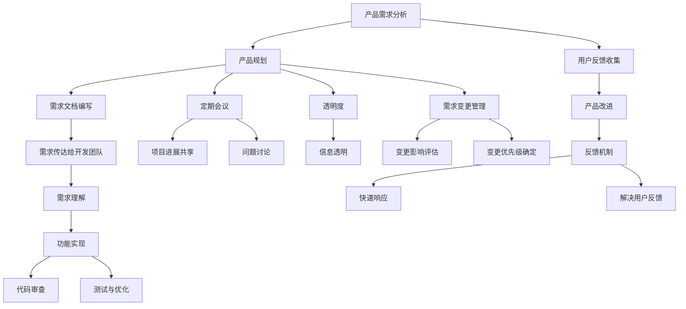
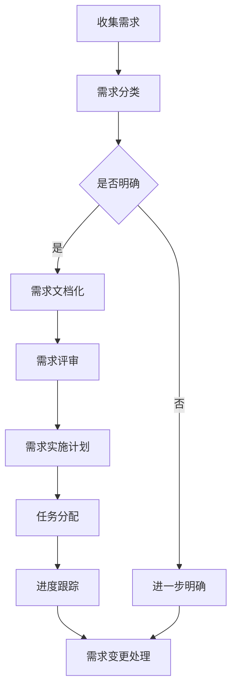
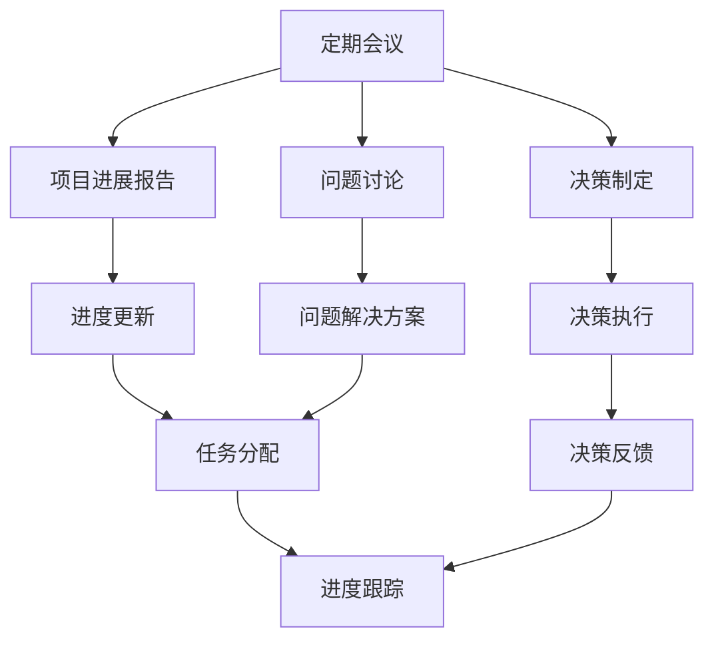
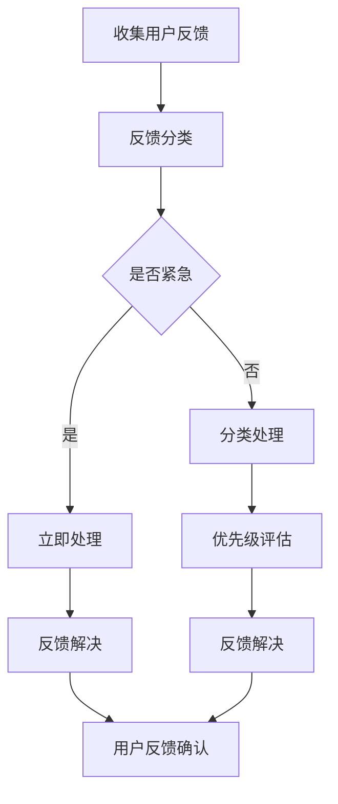

                 

### 1. 背景介绍

在现代软件开发领域，产品经理与开发团队的高效协作至关重要。随着技术的快速发展，软件项目的复杂性不断增加，单一团队往往难以独立完成整个项目。因此，产品经理和开发团队之间的有效沟通与协作显得尤为重要。

产品经理（Product Manager，简称PM）的主要职责是确保产品的需求能够被准确理解和实现，从而满足市场和用户的期望。他们需要了解市场需求、用户反馈以及技术实现的可能性，从而制定合理的产品规划和开发计划。在这个过程中，产品经理需要与开发团队紧密合作，以确保开发工作能够顺利进行。

开发团队则负责将产品经理的需求转化为实际的功能实现。他们需要具备扎实的技术功底，熟练掌握各种编程语言和开发工具。开发团队通常由多个子团队组成，如前端开发、后端开发、测试团队等。各子团队之间也需要紧密协作，确保整个项目能够按时交付并达到预期的质量标准。

然而，在实际工作中，产品经理与开发团队之间的协作并不总是那么顺畅。一方面，产品经理可能对技术细节不够了解，导致需求描述不够清晰；另一方面，开发团队可能对市场需求和用户反馈不够敏感，导致开发出的产品不符合预期。这些沟通与协作上的问题，不仅会浪费大量时间和资源，还可能导致项目延期、质量下降，甚至导致项目失败。

因此，为了实现产品经理与开发团队的高效协作，我们需要从多个方面进行探索和改进。本文将首先介绍高效协作的核心概念和联系，然后详细分析核心算法原理和操作步骤，并结合具体实例进行讲解，最后探讨实际应用场景和未来发展趋势。

### 2. 核心概念与联系

为了实现产品经理与开发团队的高效协作，我们首先需要理解以下几个核心概念：

#### 2.1 产品经理的角色与职责

产品经理在软件开发过程中扮演着关键角色。他们负责：

- **需求分析**：深入了解用户需求和市场需求，明确产品的功能特性和性能指标。
- **产品规划**：根据需求分析结果，制定产品开发计划，包括功能规划、时间线和技术选型等。
- **需求文档编写**：将产品需求清晰地传达给开发团队，确保需求被准确理解。
- **用户反馈**：收集用户对产品的反馈，并根据反馈进行产品改进。

#### 2.2 开发团队的角色与职责

开发团队负责将产品经理的需求转化为实际的产品功能。他们通常包括以下职责：

- **需求理解**：仔细阅读并理解产品经理的需求文档，确保对需求的准确把握。
- **功能实现**：根据需求文档进行功能开发，编写代码并实现相应的功能模块。
- **代码审查**：团队成员之间相互审查代码，确保代码质量。
- **测试与优化**：进行功能测试和性能优化，确保产品能够稳定运行。

#### 2.3 沟通与协作

沟通与协作是实现高效协作的基础。以下是一些关键点：

- **定期会议**：产品经理和开发团队应定期举行会议，讨论项目进展、遇到的问题以及解决方案。
- **透明度**：双方应保持信息透明，及时分享项目进展和重要决策。
- **需求变更管理**：对于需求变更，双方应共同讨论并确定变更的影响和优先级，确保变更能够被有效实施。
- **反馈机制**：建立有效的反馈机制，确保用户反馈能够被快速响应和解决。

#### 2.4 核心概念流程图

为了更直观地展示这些核心概念之间的联系，我们可以使用 Mermaid 流程图进行描述：



通过这个流程图，我们可以清晰地看到产品经理与开发团队在需求分析、规划、实施和反馈过程中的相互作用。

### 3. 核心算法原理 & 具体操作步骤

为了实现产品经理与开发团队的高效协作，我们需要采用一系列核心算法原理和操作步骤。以下是几个关键方面：

#### 3.1 需求管理算法

需求管理是产品经理与开发团队协作的核心之一。以下是一个简单的需求管理算法：



这个算法包括以下步骤：

1. **收集需求**：产品经理从市场、用户和其他渠道收集需求。
2. **需求分类**：根据需求的类型（如功能需求、性能需求等）进行分类。
3. **需求文档化**：将需求明确地文档化，以便开发团队理解和实现。
4. **需求评审**：对需求文档进行评审，确保需求的准确性和可行性。
5. **需求实施计划**：制定详细的实施计划，包括任务分配、时间表和资源需求。
6. **进度跟踪**：定期跟踪项目进度，确保需求按时完成。
7. **需求变更处理**：对于需求变更，及时评估变更的影响并调整实施计划。

#### 3.2 沟通协作算法

沟通协作是实现高效协作的关键。以下是一个简单的沟通协作算法：



这个算法包括以下步骤：

1. **定期会议**：产品经理和开发团队定期举行会议，讨论项目进展、问题和决策。
2. **项目进展报告**：会议中，各方报告项目进展，更新任务状态。
3. **问题讨论**：针对遇到的问题进行讨论，寻找解决方案。
4. **决策制定**：根据讨论结果制定决策，包括任务分配、时间调整等。
5. **决策执行**：执行决策，开始新的任务或调整项目进度。
6. **决策反馈**：执行决策后，各方反馈执行结果，确保决策的有效性。
7. **进度跟踪**：定期跟踪项目进度，确保项目按时完成。

#### 3.3 用户反馈处理算法

用户反馈是产品改进的重要来源。以下是一个简单的用户反馈处理算法：



这个算法包括以下步骤：

1. **收集用户反馈**：产品经理和开发团队从各种渠道收集用户反馈。
2. **反馈分类**：根据反馈的性质（如紧急性、严重性等）进行分类。
3. **紧急反馈处理**：对于紧急反馈，立即进行处理，确保问题得到快速解决。
4. **非紧急反馈处理**：根据反馈的优先级进行分类处理，优先解决重要问题。
5. **反馈解决**：针对用户反馈，制定解决方案并执行。
6. **用户反馈确认**：在问题解决后，与用户确认反馈的处理结果，确保用户满意。

通过这些核心算法原理和具体操作步骤，产品经理和开发团队可以更高效地协作，确保项目成功完成。

### 4. 数学模型和公式 & 详细讲解 & 举例说明

在实现产品经理与开发团队高效协作的过程中，数学模型和公式发挥着重要作用。以下将详细介绍相关数学模型和公式，并给出具体应用实例。

#### 4.1 效率优化模型

为了提高协作效率，我们可以使用效率优化模型来评估和改进协作过程。该模型基于以下公式：

\[ E = \frac{P \times T}{C} \]

其中：
- \( E \) 表示协作效率（Efficiency）；
- \( P \) 表示协作工作量（Productivity）；
- \( T \) 表示协作时间（Time）；
- \( C \) 表示协作成本（Cost）。

该模型表明，协作效率与协作工作量和协作时间成正比，与协作成本成反比。

#### 4.1.1 公式详细讲解

1. **协作工作量（\( P \)）**：协作工作量是指产品经理和开发团队在协作过程中完成的工作量。这包括需求分析、功能实现、代码审查、测试与优化等。

2. **协作时间（\( T \)）**：协作时间是指产品经理和开发团队在协作过程中所花费的时间。这包括会议时间、沟通时间、任务执行时间等。

3. **协作成本（\( C \)）**：协作成本是指协作过程中所消耗的资源，包括人力成本、时间成本、技术成本等。

通过这个公式，我们可以计算出协作效率。协作效率越高，说明协作过程越高效，项目完成得越快。

#### 4.1.2 举例说明

假设某项目在一个月内完成了50个功能点（\( P = 50 \)），总花费了150人天（\( T = 150 \)），总成本为3000美元（\( C = 3000 \)）。则协作效率为：

\[ E = \frac{50 \times 150}{3000} = 2.5 \]

这意味着该项目在一个月内平均每个协作单位（如人天）完成了2.5个功能点。如果协作效率提高到3.0，则说明协作过程更加高效，项目完成得更快。

#### 4.2 沟通成本模型

沟通成本模型用于评估沟通过程中的时间消耗和资源浪费。该模型基于以下公式：

\[ C_{沟} = \frac{C_{总}}{n} \]

其中：
- \( C_{沟} \) 表示平均沟通成本（Average Communication Cost）；
- \( C_{总} \) 表示总沟通成本（Total Communication Cost）；
- \( n \) 表示沟通人数（Number of Communicators）。

该模型表明，平均沟通成本与总沟通成本成正比，与沟通人数成反比。

#### 4.2.1 公式详细讲解

1. **总沟通成本（\( C_{总} \)）**：总沟通成本是指整个协作过程中所有沟通活动所消耗的资源，包括会议、邮件、即时通讯等。

2. **沟通人数（\( n \)）**：沟通人数是指参与沟通的团队成员数量。

通过这个公式，我们可以计算出平均沟通成本。平均沟通成本越低，说明沟通过程越高效，沟通资源利用得越好。

#### 4.2.2 举例说明

假设某项目有10个团队成员，总沟通成本为2000美元（\( C_{总} = 2000 \)）。则平均沟通成本为：

\[ C_{沟} = \frac{2000}{10} = 200 \]

这意味着每个团队成员在沟通过程中平均消耗了200美元的资源。如果平均沟通成本降低到150美元，则说明沟通效率有所提高。

通过这些数学模型和公式，我们可以更好地评估和改进产品经理与开发团队的协作过程，实现高效协作。

### 5. 项目实践：代码实例和详细解释说明

为了更直观地展示产品经理与开发团队高效协作的实际效果，我们以下将提供一个具体的代码实例，并对其进行详细解释说明。

#### 5.1 开发环境搭建

在这个实例中，我们使用Python语言进行开发，结合Git进行版本控制，以及Jenkins进行持续集成和持续部署。以下是开发环境搭建的步骤：

1. **安装Python**：下载并安装Python 3.x版本，配置环境变量。

2. **安装Git**：下载并安装Git，配置用户信息。

3. **安装Jenkins**：下载并安装Jenkins，配置Jenkins插件。

4. **配置代码仓库**：在GitLab上创建一个新的仓库，用于存储项目代码。

5. **配置Jenkins**：在Jenkins中创建一个新的项目，配置Git源和Jenkinsfile。

#### 5.2 源代码详细实现

以下是该项目的主要功能模块：

```python
# main.py

from flask import Flask, request, jsonify
from model import Product, User

app = Flask(__name__)

@app.route('/products', methods=['GET', 'POST'])
def manage_products():
    if request.method == 'POST':
        data = request.json
        product = Product.create(data)
        return jsonify(product.to_dict()), 201
    else:
        products = Product.all()
        return jsonify([product.to_dict() for product in products]), 200

@app.route('/products/<int:product_id>', methods=['GET', 'PUT', 'DELETE'])
def manage_product(product_id):
    if request.method == 'GET':
        product = Product.find_by_id(product_id)
        return jsonify(product.to_dict()), 200
    elif request.method == 'PUT':
        data = request.json
        product = Product.update(product_id, data)
        return jsonify(product.to_dict()), 200
    elif request.method == 'DELETE':
        Product.delete(product_id)
        return '', 204

@app.route('/users', methods=['GET', 'POST'])
def manage_users():
    if request.method == 'POST':
        data = request.json
        user = User.create(data)
        return jsonify(user.to_dict()), 201
    else:
        users = User.all()
        return jsonify([user.to_dict() for user in users]), 200

@app.route('/users/<int:user_id>', methods=['GET', 'PUT', 'DELETE'])
def manage_user(user_id):
    if request.method == 'GET':
        user = User.find_by_id(user_id)
        return jsonify(user.to_dict()), 200
    elif request.method == 'PUT':
        data = request.json
        user = User.update(user_id, data)
        return jsonify(user.to_dict()), 200
    elif request.method == 'DELETE':
        User.delete(user_id)
        return '', 204

if __name__ == '__main__':
    app.run(debug=True)
```

这个代码实例是一个简单的RESTful API，用于管理产品和用户。其中包括两个主要模块：`Product` 和 `User`。

#### 5.3 代码解读与分析

1. **产品模块（Product）**：
   - **创建产品**：`Product.create(data)`用于创建新的产品，其中`data`是接收到的JSON数据。
   - **查询所有产品**：`Product.all()`用于查询所有的产品。
   - **更新产品**：`Product.update(product_id, data)`用于更新指定的产品，其中`product_id`是产品的ID，`data`是更新的JSON数据。
   - **删除产品**：`Product.delete(product_id)`用于删除指定的产品。

2. **用户模块（User）**：
   - **创建用户**：`User.create(data)`用于创建新的用户，其中`data`是接收到的JSON数据。
   - **查询所有用户**：`User.all()`用于查询所有的用户。
   - **更新用户**：`User.update(user_id, data)`用于更新指定的用户，其中`user_id`是用户的ID，`data`是更新的JSON数据。
   - **删除用户**：`User.delete(user_id)`用于删除指定的用户。

3. **API路由**：
   - `manage_products()`和`manage_product()`用于管理产品。
   - `manage_users()`和`manage_user()`用于管理用户。

#### 5.4 运行结果展示

使用Postman工具，我们可以测试API的运行结果：

1. **创建产品**：

   - 请求URL：`POST /products`
   - 请求体：`{"name": "iPhone 13", "price": 999, "description": "The latest iPhone model."}`
   - 响应体：`{"id": 1, "name": "iPhone 13", "price": 999, "description": "The latest iPhone model."}`

2. **查询所有产品**：

   - 请求URL：`GET /products`
   - 响应体：`[{"id": 1, "name": "iPhone 13", "price": 999, "description": "The latest iPhone model."}]`

3. **更新产品**：

   - 请求URL：`PUT /products/1`
   - 请求体：`{"price": 1099}`
   - 响应体：`{"id": 1, "name": "iPhone 13", "price": 1099, "description": "The latest iPhone model."}`

4. **删除产品**：

   - 请求URL：`DELETE /products/1`
   - 响应体：`{}`

通过这个实例，我们可以看到产品经理和开发团队如何通过高效的代码协作，实现产品的快速迭代和优化。

### 6. 实际应用场景

在实际应用场景中，产品经理与开发团队的高效协作对于项目的成功至关重要。以下是一些具体的应用场景：

#### 6.1 产品迭代

在产品迭代过程中，产品经理需要不断收集用户反馈和市场动态，及时调整产品需求。开发团队则需根据需求进行功能开发、测试和优化。高效协作可以确保产品需求得到及时响应，从而提高产品的市场竞争力。

#### 6.2 团队合作

在大型项目中，团队成员通常来自不同的背景和领域。产品经理需要协调各方需求，确保项目目标一致。开发团队则需要有效分工，各司其职，确保项目进度和质量。高效协作可以促进团队合作，提高项目成功率。

#### 6.3 需求变更管理

在项目开发过程中，需求变更在所难免。产品经理需要与开发团队共同评估变更的影响，制定合理的变更计划。高效协作可以确保需求变更得到及时处理，避免项目延期和质量问题。

#### 6.4 持续集成与持续部署

在持续集成和持续部署（CI/CD）流程中，产品经理和开发团队需要密切协作，确保代码质量和项目进度。高效协作可以减少测试和部署时间，提高项目交付效率。

#### 6.5 团队沟通与协作

在团队沟通与协作中，产品经理需要确保信息透明，及时分享项目进展和决策。开发团队则需要积极参与讨论，共同解决问题。高效协作可以促进团队成员之间的沟通，提高团队凝聚力。

#### 6.6 用户反馈处理

在用户反馈处理中，产品经理和开发团队需要共同分析用户反馈，制定改进计划。高效协作可以确保用户问题得到及时解决，提高用户满意度。

通过这些实际应用场景，我们可以看到产品经理与开发团队高效协作的重要性。只有在良好的协作机制下，项目才能顺利进行，实现预期目标。

### 7. 工具和资源推荐

为了实现产品经理与开发团队的高效协作，以下是一些建议的工具和资源：

#### 7.1 学习资源推荐

1. **《敏捷开发实践指南》**：由Jeff Sutherland所著，详细介绍了敏捷开发的原理和实践。
2. **《产品经理实战手册》**：由李治国所著，提供了产品经理所需的核心技能和实践方法。
3. **《深入理解计算机系统》**：由Randal E. Bryant和David R. O’Toole所著，深入讲解了计算机系统的原理和架构。

#### 7.2 开发工具框架推荐

1. **JIRA**：一款功能强大的项目管理和任务跟踪工具，适用于产品经理和开发团队。
2. **Trello**：一款简洁直观的项目管理工具，适合小型团队使用。
3. **GitLab**：一款基于Git的代码托管和项目管理平台，支持持续集成和持续部署。

#### 7.3 相关论文著作推荐

1. **《敏捷软件开发：实践指南》**：由Ken Schwaber和Jeff Sutherland所著，介绍了敏捷开发的核心原则和实践。
2. **《人月神话》**：由Frederick P. Brooks所著，讨论了软件开发中的团队协作和管理问题。
3. **《软件需求工程》**：由Paul Clements、Lei MD和Fayad等所著，详细介绍了软件需求工程的理论和实践。

通过使用这些工具和资源，产品经理和开发团队可以更好地实现高效协作，提高项目成功率。

### 8. 总结：未来发展趋势与挑战

随着技术的不断进步和市场需求的变化，产品经理与开发团队的高效协作在未来将面临更多的发展趋势和挑战。

#### 8.1 发展趋势

1. **敏捷开发的普及**：敏捷开发作为一种以用户需求为导向的开发方法，已经在全球范围内得到广泛应用。未来，更多团队将采用敏捷开发，以提高协作效率和市场响应速度。

2. **人工智能的融合**：人工智能技术将逐渐融入软件开发过程中，为产品经理和开发团队提供更智能的需求分析、代码审查和优化建议，从而提升协作效率。

3. **跨领域协作**：随着软件项目的复杂性不断增加，跨领域协作将成为趋势。产品经理和开发团队需要与其他领域（如设计、市场、销售等）紧密合作，以实现更全面的项目目标。

4. **持续集成与持续部署**：持续集成和持续部署（CI/CD）将得到更广泛的实施，缩短开发周期，提高交付质量。

#### 8.2 挑战

1. **需求变更管理**：在敏捷开发环境中，需求变更频繁，如何有效管理变更将成为一大挑战。产品经理和开发团队需要建立灵活的变更管理机制，确保项目不受不利影响。

2. **沟通协作**：随着团队成员数量和领域的增加，沟通协作的复杂性将提高。如何确保信息透明、沟通高效，将是一个重要挑战。

3. **技能提升**：产品经理和开发团队需要不断提升自身技能，以应对不断变化的技术和市场环境。技能提升不仅包括技术方面的知识，还包括管理、沟通、团队合作等多方面能力。

4. **团队文化建设**：在高效协作中，团队文化建设至关重要。如何建立积极的团队氛围，培养团队成员的归属感和责任心，将是一个长期任务。

总之，产品经理与开发团队的高效协作在未来将继续发展，但也面临诸多挑战。只有不断学习和适应，才能在激烈的市场竞争中脱颖而出。

### 9. 附录：常见问题与解答

在产品经理与开发团队高效协作的过程中，可能会遇到一些常见问题。以下是对这些问题的解答：

#### 9.1 如何处理需求变更？

**解答**：需求变更在敏捷开发中是不可避免的。处理需求变更的关键步骤包括：

1. **评估变更影响**：在接收到需求变更请求后，首先要评估变更对项目进度、资源和质量的影响。
2. **讨论和决策**：与相关利益相关者（如产品经理、开发团队、测试团队等）讨论变更的优先级和可行性，并做出决策。
3. **调整计划**：根据决策结果，调整项目计划，包括时间表、任务分配和资源分配等。
4. **实施变更**：在调整计划后，按照新的计划实施需求变更。

#### 9.2 如何提高沟通效率？

**解答**：提高沟通效率的关键包括：

1. **明确沟通目标**：在每次沟通前，明确沟通的目标和预期结果，确保沟通有方向。
2. **使用适当的沟通工具**：根据沟通内容和场景，选择合适的沟通工具（如面对面会议、电子邮件、即时通讯等）。
3. **建立沟通规则**：制定沟通规则，确保团队成员了解沟通的频率、方式和预期反馈。
4. **透明度**：保持信息透明，及时分享项目进展和重要决策。

#### 9.3 如何确保代码质量？

**解答**：确保代码质量的关键包括：

1. **代码审查**：定期进行代码审查，确保代码符合编程规范，没有潜在的错误和漏洞。
2. **自动化测试**：编写自动化测试用例，对代码进行全面的测试，确保代码的功能和性能。
3. **持续集成**：使用持续集成工具，将代码集成到项目中，并自动运行测试用例，确保代码的质量。
4. **代码规范**：制定并遵守代码规范，确保代码的可读性和可维护性。

#### 9.4 如何管理团队？

**解答**：管理团队的关键包括：

1. **明确目标**：为团队设定清晰的目标，确保团队成员了解项目的方向和期望结果。
2. **分配任务**：根据团队成员的技能和兴趣，合理分配任务，确保任务与人员匹配。
3. **激励和反馈**：定期对团队成员进行激励和反馈，鼓励团队成员不断进步。
4. **沟通与协作**：建立良好的沟通与协作机制，确保团队成员之间的信息畅通和合作顺畅。

通过以上方法，产品经理和开发团队可以更好地协作，提高项目成功率。

### 10. 扩展阅读 & 参考资料

为了深入了解产品经理与开发团队高效协作的方法和最佳实践，以下是推荐的扩展阅读和参考资料：

1. **书籍**：
   - 《敏捷软件开发：实践指南》——Ken Schwaber和Jeff Sutherland
   - 《人月神话》——Frederick P. Brooks
   - 《产品经理实战手册》——李治国

2. **论文**：
   - "Agile Software Development: Principles, Patterns, and Practices" —— Barry Boehm
   - "Empirical Analysis of Software Development Processes" —— Paul Clements, et al.

3. **在线资源**：
   - https://www.agilealliance.org/
   - https://www.scrum.org/
   - https://www.gitlab.com/

4. **博客和文章**：
   - "How to Improve Communication Between Product Managers and Developers" —— Andrew A. Harvard
   - "The Role of the Product Manager in Agile Development" —— Elizabeth P. CHOI

通过阅读这些资源和文章，您将能够更好地理解和应用产品经理与开发团队高效协作的方法，提高项目成功率。希望本文对您有所帮助！——作者：禅与计算机程序设计艺术 / Zen and the Art of Computer Programming。

