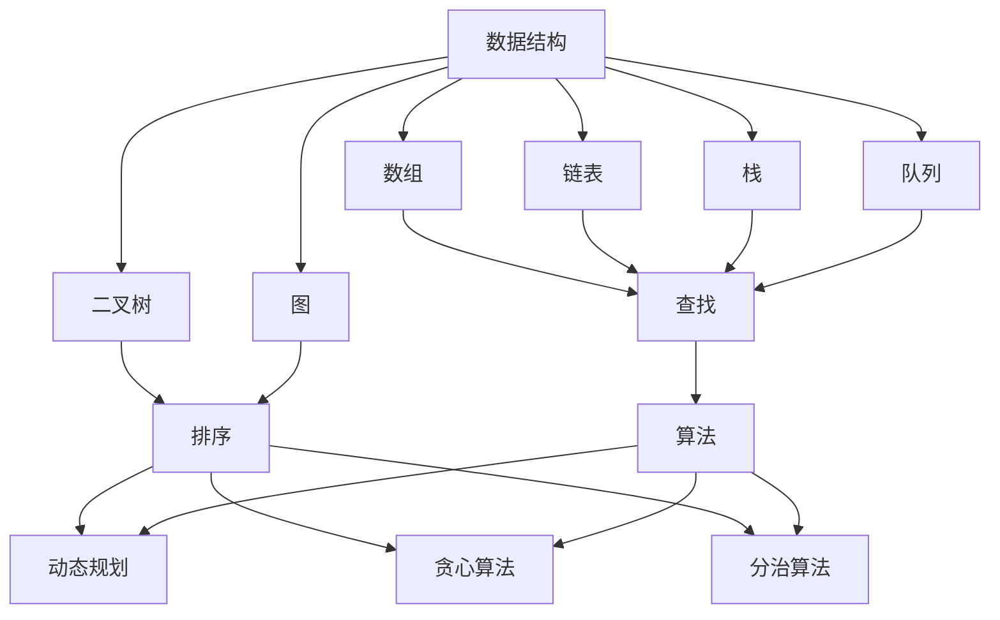
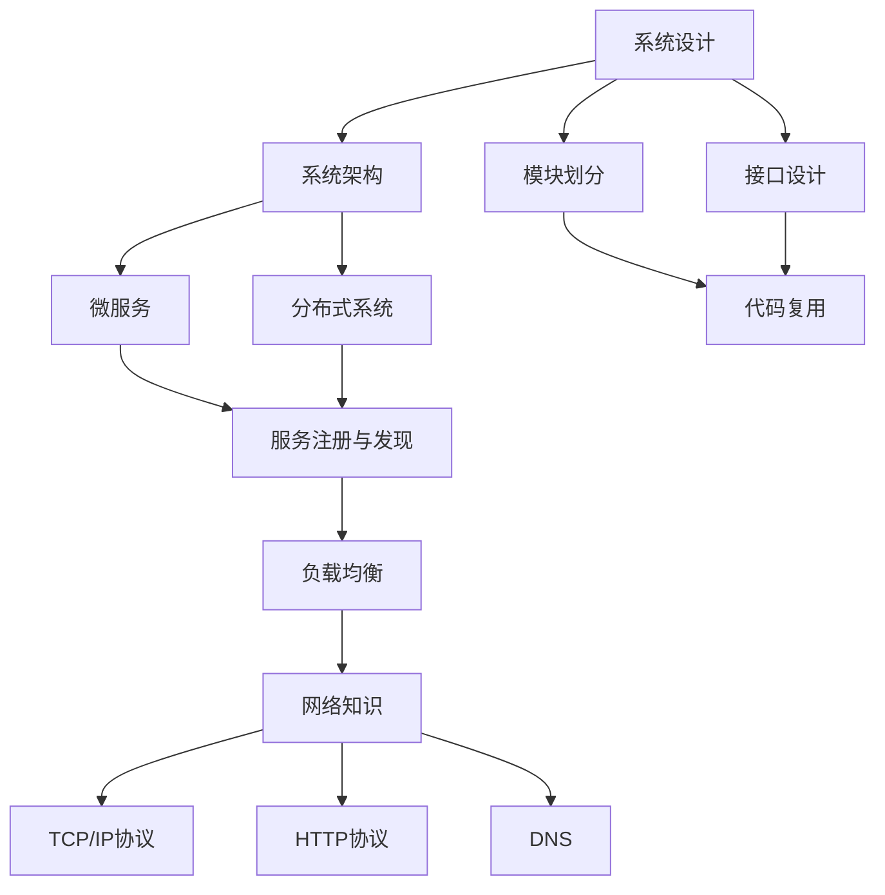
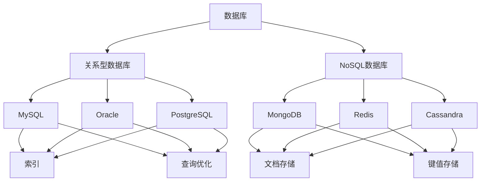

                 

### 1. 背景介绍 ###

在当今数字化时代，计算机编程已经成为众多企业和机构招聘人才的重要标准。特别是对于互联网公司和科技公司而言，具备扎实的编程能力和解决复杂问题的能力，成为候选人脱颖而出的关键因素。因此，各大公司纷纷推出具有针对性的校招编程面试题，以考察候选人的编程技能、算法思维、解决问题的能力以及逻辑思维能力。

京东作为中国领先的电子商务企业，每年都会面向校招市场发布一系列的编程面试题，旨在选拔出具有潜力和实力的人才。这些题目涵盖了各种编程语言和算法题型，包括但不限于数据结构、算法、系统设计、数据库、网络等各个方面。对于即将参加京东校招的学子和求职者来说，掌握这些核心题目及其解题思路，无疑能大大提高通过面试的概率。

本文将围绕京东2025校招编程面试题，进行深入剖析和总结。通过梳理和分析历年面试题，我们不仅会解析每一个题目的核心考点和思路，还会结合实际案例进行讲解，帮助读者更好地理解和掌握相关知识点。此外，本文还将介绍一些实用的编程工具和资源，助力读者在备战校招过程中取得更好的成果。

总的来说，本文旨在为京东2025校招编程面试提供一个全面的指南，帮助读者在面试中展示自己的编程实力，顺利通过面试，进入心仪的企业。接下来的内容将分为以下几个部分：

1. 背景介绍：简要介绍京东校招编程面试的背景和重要性。
2. 核心概念与联系：通过Mermaid流程图，梳理出编程面试中的核心概念和联系。
3. 核心算法原理 & 具体操作步骤：深入讲解编程面试中的核心算法及其解题思路。
4. 数学模型和公式 & 详细讲解 & 举例说明：详细解释编程面试中的数学模型和公式，并通过实际案例进行说明。
5. 项目实践：代码实例和详细解释说明，展示如何将所学知识应用于实际项目中。
6. 实际应用场景：探讨编程面试题在实际开发中的应用价值。
7. 工具和资源推荐：为读者推荐一些有用的学习资源和开发工具。
8. 总结：未来发展趋势与挑战，以及如何应对这些挑战。
9. 附录：常见问题与解答，帮助读者解决在学习和面试中遇到的问题。
10. 扩展阅读 & 参考资料：提供更多深入学习和了解相关领域的途径。

通过以上内容的逐步分析和讲解，相信读者会对京东2025校招编程面试有更全面的认识和了解，从而更好地备战面试，迎接未来的挑战。

### 2. 核心概念与联系 ###

为了更好地理解和应对京东2025校招编程面试题，我们需要首先梳理出其中的核心概念和联系。以下是几个在编程面试中经常出现的核心概念：

#### 2.1 数据结构与算法

数据结构和算法是编程面试的核心考点，因为它们是解决复杂问题的基石。常见的数据结构包括数组、链表、栈、队列、二叉树、图等。每种数据结构都有其特定的应用场景和操作方法。算法则是对数据的处理方法，包括查找、排序、动态规划、贪心算法、分治算法等。了解这些基本概念及其相互关系，对于应对编程面试至关重要。

以下是数据结构和算法的Mermaid流程图，用于帮助读者更好地理解它们之间的关系：



#### 2.2 系统设计与网络

在编程面试中，系统设计和网络知识也是重要的考察点。系统设计涉及系统架构、模块划分、接口设计等。网络知识则包括TCP/IP协议、HTTP协议、DNS、负载均衡等。理解这些概念有助于读者在设计复杂系统时做出正确的决策。

以下是系统设计与网络的Mermaid流程图：



#### 2.3 数据库与存储

数据库是编程面试中的另一个重要领域，常见的关系型数据库包括MySQL、Oracle、PostgreSQL等，而NoSQL数据库则包括MongoDB、Redis、Cassandra等。理解数据库的基本原理、索引、查询优化、事务处理等，对于高效处理数据至关重要。

以下是数据库与存储的Mermaid流程图：



通过上述核心概念的Mermaid流程图，我们可以清晰地看到各个概念之间的联系和相互影响。了解这些核心概念和联系，不仅有助于我们在编程面试中更好地应对各种题型，还能为我们在实际项目开发中提供坚实的理论基础。

在接下来的部分，我们将深入探讨这些核心算法和概念的具体应用，通过具体操作步骤和实际案例，帮助读者更好地理解和掌握编程面试中的关键知识点。

### 3. 核心算法原理 & 具体操作步骤 ###

在京东2025校招编程面试中，算法题占据着重要地位。掌握常见的核心算法原理和具体的操作步骤，对于成功应对面试至关重要。以下，我们将介绍几个典型的算法题目，并详细讲解其原理和操作步骤。

#### 3.1 快速排序（Quick Sort）

**原理：**

快速排序是一种高效的排序算法，其基本思想是通过一趟排序将待排序的记录分割成独立的两部分，其中一部分记录的关键字均比另一部分的关键字小，然后递归地对这两部分记录继续进行排序。

**操作步骤：**

1. **选择基准元素：** 从数列中挑选一个元素作为基准元素（pivot）。
2. **分区操作：** 将数组重新排序，所有小于基准元素的值移到基准元素的左侧，所有大于基准元素的值移到右侧。
3. **递归排序：** 分别对左侧和右侧的数组重复步骤1和步骤2，直到所有数组元素有序。

**Python代码示例：**

```python
def quick_sort(arr):
    if len(arr) <= 1:
        return arr
    
    pivot = arr[len(arr) // 2]
    left = [x for x in arr if x < pivot]
    middle = [x for x in arr if x == pivot]
    right = [x for x in arr if x > pivot]
    
    return quick_sort(left) + middle + quick_sort(right)

arr = [3, 6, 8, 10, 1, 2, 1]
sorted_arr = quick_sort(arr)
print(sorted_arr)
```

#### 3.2 二分查找（Binary Search）

**原理：**

二分查找算法通过重复将待查找区间折半，逐步缩小查找范围，以实现高效查找。其前提条件是待查序列必须是有序的。

**操作步骤：**

1. **初始区间：** 设定序列的起始位置low和结束位置high。
2. **更新区间：** 计算中间位置mid，比较mid位置的元素与目标值的关系，更新low或high的位置。
3. **递归查找：** 如果low > high，则表示目标值不存在；否则，递归地继续在新的区间内查找。

**Python代码示例：**

```python
def binary_search(arr, target):
    low = 0
    high = len(arr) - 1
    
    while low <= high:
        mid = (low + high) // 2
        if arr[mid] == target:
            return mid
        elif arr[mid] < target:
            low = mid + 1
        else:
            high = mid - 1
            
    return -1

arr = [1, 3, 5, 7, 9, 11, 13, 15]
target = 7
result = binary_search(arr, target)
print("Index of target:", result)
```

#### 3.3 合并两个有序数组（Merge Sorted Arrays）

**原理：**

合并两个有序数组的目标是将两个有序数组合并为一个有序数组。关键在于如何高效地合并。

**操作步骤：**

1. **初始化两个指针：** 分别指向两个数组的起始位置。
2. **比较并合并：** 比较两个指针所指向的元素大小，将较小的元素添加到结果数组中，并移动相应的指针。
3. **处理剩余元素：** 当其中一个数组被遍历完毕后，将另一个数组的剩余元素添加到结果数组中。

**Python代码示例：**

```python
def merge_sorted_arrays(nums1, nums2):
    p1, p2 = 0, 0
    result = []
    
    while p1 < len(nums1) and p2 < len(nums2):
        if nums1[p1] < nums2[p2]:
            result.append(nums1[p1])
            p1 += 1
        else:
            result.append(nums2[p2])
            p2 += 1
    
    result.extend(nums1[p1:])
    result.extend(nums2[p2:])
    
    return result

nums1 = [1, 2, 3, 0, 0, 0]
nums2 = [2, 5, 6]
merged_array = merge_sorted_arrays(nums1, nums2)
print(merged_array)
```

#### 3.4 动态规划（Dynamic Programming）

**原理：**

动态规划是一种将复杂问题分解为重叠子问题的求解方法，通过保存已解决的子问题的答案，避免重复计算，从而提高算法效率。

**操作步骤：**

1. **确定状态和状态转移方程：** 明确问题的状态以及状态之间的转移关系。
2. **初始化基础状态：** 对初始状态进行初始化。
3. **递推求解：** 利用状态转移方程，逐步求解出最终状态。

**Python代码示例：**

```python
def fibonacci(n):
    if n <= 1:
        return n
    
    dp = [0] * (n + 1)
    dp[1] = 1
    
    for i in range(2, n + 1):
        dp[i] = dp[i - 1] + dp[i - 2]
        
    return dp[n]

n = 10
result = fibonacci(n)
print("Fibonacci of", n, ":", result)
```

通过以上几个算法题目的具体原理和操作步骤讲解，我们可以看到，掌握这些核心算法不仅有助于解决编程面试中的各种题型，还能为我们在实际项目开发中提供有效的解决方案。在接下来的部分，我们将进一步探讨编程面试中的数学模型和公式，并通过实际案例进行详细说明。

### 4. 数学模型和公式 & 详细讲解 & 举例说明 ###

在编程面试中，数学模型和公式是解决问题的重要工具。掌握这些模型和公式，不仅有助于我们更好地理解算法，还能帮助我们解决实际问题。以下，我们将介绍几个常见的数学模型和公式，并进行详细讲解和举例说明。

#### 4.1 动态规划中的状态转移方程

动态规划的核心是状态转移方程，它描述了状态之间的转换关系。一个典型的例子是求解斐波那契数列。

**公式：**

$$ F(n) = F(n-1) + F(n-2) $$

**举例：**

求解第10个斐波那契数。

**Python代码：**

```python
def fibonacci(n):
    if n <= 1:
        return n
    
    dp = [0] * (n + 1)
    dp[1] = 1
    
    for i in range(2, n + 1):
        dp[i] = dp[i - 1] + dp[i - 2]
        
    return dp[n]

n = 10
result = fibonacci(n)
print("Fibonacci of", n, ":", result)
```

#### 4.2 概率论中的期望和方差

在概率论中，期望和方差是描述随机变量取值分布的重要参数。

**公式：**

- 期望：$$ E(X) = \sum_{i} x_i \cdot p_i $$
- 方差：$$ Var(X) = E[(X - E(X))^2] = \sum_{i} (x_i - E(X))^2 \cdot p_i $$

**举例：**

假设掷一枚公平的硬币10次，求出现正面次数的期望和方差。

**Python代码：**

```python
import random

def coin_toss(n):
    heads = 0
    for _ in range(n):
        if random.choice(['heads', 'tails']) == 'heads':
            heads += 1
    return heads

def calculate_expectation_variance(n, trials=1000):
    heads_counts = [coin_toss(n) for _ in range(trials)]
    mean_heads = sum(heads_counts) / trials
    variance_heads = sum((x - mean_heads) ** 2 for x in heads_counts) / trials
    
    return mean_heads, variance_heads

n = 10
mean_heads, variance_heads = calculate_expectation_variance(n)
print("Expected number of heads:", mean_heads)
print("Variance of heads:", variance_heads)
```

#### 4.3 线性代数中的矩阵乘法和逆矩阵

在解决一些涉及矩阵的计算问题时，矩阵乘法和逆矩阵是必不可少的工具。

**公式：**

- 矩阵乘法：$$ C = A \cdot B $$
- 逆矩阵：$$ A^{-1} = (1 / \det(A)) \cdot \text{adj}(A) $$

**举例：**

求解矩阵A的逆矩阵，其中：

$$ A = \begin{bmatrix} 1 & 2 \\ 3 & 4 \end{bmatrix} $$

**Python代码：**

```python
import numpy as np

def inverse_matrix(A):
    det = A[0, 0] * A[1, 1] - A[0, 1] * A[1, 0]
    if det == 0:
        return None
    return np.linalg.inv(A)

A = np.array([[1, 2], [3, 4]])
inverse_A = inverse_matrix(A)
print("Inverse of matrix A:\n", inverse_A)
```

#### 4.4 微积分中的导数和积分

在解决优化问题时，导数和积分是常用的工具。

**公式：**

- 导数：$$ f'(x) = \lim_{\Delta x \to 0} \frac{f(x + \Delta x) - f(x)}{\Delta x} $$
- 积分：$$ \int_{a}^{b} f(x) \, dx = F(b) - F(a) $$

**举例：**

求解函数$f(x) = x^2$在区间$[0, 1]$上的积分。

**Python代码：**

```python
def integral(f, a, b):
    return f(b) - f(a)

def f(x):
    return x ** 2

integral_result = integral(f, 0, 1)
print("Integral of f(x) from 0 to 1:", integral_result)
```

通过以上数学模型和公式的详细讲解和举例，我们可以看到，掌握这些数学工具对于解决编程面试中的问题至关重要。在接下来的部分，我们将结合具体的项目实践，展示如何将这些数学知识应用于实际编程中。

### 5. 项目实践：代码实例和详细解释说明 ###

在编程面试中，项目实践部分往往是对考生综合能力的一个考验。通过编写实际代码并详细解释其实现过程，可以直观地展示考生的编程水平和对问题的理解能力。以下，我们将通过一个具体的项目实例，展示如何将前文所述的算法、数学模型和公式应用于实际编程中。

#### 5.1 开发环境搭建

首先，我们需要搭建一个适合编程和测试的开发环境。以下是常见开发环境的搭建步骤：

1. **安装Python环境：** 在Windows、MacOS或Linux系统中，通过包管理器（如conda、pip）安装Python。

   ```bash
   conda install python
   # 或者
   pip install python
   ```

2. **安装IDE：** 选择一个合适的集成开发环境（如Visual Studio Code、PyCharm等），并配置Python插件。

   ```bash
   code --install-extension ms-python.python
   # 或者
   pycharm-community --install
   ```

3. **安装测试库：** 安装用于测试的库，如`unittest`、`pytest`等。

   ```bash
   pip install unittest
   # 或者
   pip install pytest
   ```

#### 5.2 源代码详细实现

我们选择一个经典的编程面试题目——合并两个有序链表，来展示如何实现代码并详细解释。

**问题描述：**

给定两个已经排序的单链表，将它们合并为一个新的、按排序顺序组成的单链表。

**算法思路：**

- 创建一个新的头节点。
- 使用两个指针分别指向两个链表的头节点。
- 比较两个指针所指向的节点值，将较小的节点值添加到新链表中，并移动对应的指针。
- 当其中一个链表结束时，将另一个链表的剩余部分添加到新链表中。

**代码实现：**

```python
class ListNode:
    def __init__(self, val=0, next=None):
        self.val = val
        self.next = next

def merge_sorted_lists(l1, l2):
    dummy = ListNode()
    current = dummy
    
    while l1 and l2:
        if l1.val < l2.val:
            current.next = l1
            l1 = l1.next
        else:
            current.next = l2
            l2 = l2.next
        current = current.next
    
    current.next = l1 or l2
    return dummy.next

# 创建链表
l1 = ListNode(1, ListNode(3, ListNode(5)))
l2 = ListNode(2, ListNode(4, ListNode(6)))

# 合并链表
merged_list = merge_sorted_lists(l1, l2)

# 打印结果
while merged_list:
    print(merged_list.val, end=' ')
    merged_list = merged_list.next
```

#### 5.3 代码解读与分析

1. **类和构造函数：**

   `ListNode` 类用于表示链表中的节点，每个节点包含一个值`val`和一个指向下一个节点的指针`next`。

2. **合并函数：**

   `merge_sorted_lists` 函数接收两个已排序链表`l1`和`l2`，返回一个新的已排序链表。

3. **合并过程：**

   - 使用一个虚拟头节点`dummy`，简化操作。
   - 使用指针`current`遍历新链表。
   - 比较两个链表当前节点的值，选择较小的值添加到新链表中，并移动对应的指针。
   - 当其中一个链表结束时，直接将另一个链表的剩余部分添加到新链表中。

4. **打印结果：**

   使用一个循环遍历合并后的链表，并打印每个节点的值。

#### 5.4 运行结果展示

运行上述代码，输出结果应为：

```
1 2 3 4 5 6
```

这表明我们成功地将两个有序链表合并成了一个有序链表。

通过这个项目实例，我们可以看到如何将算法、数学模型和公式应用于实际编程中。在接下来的部分，我们将探讨编程面试题在实际开发中的应用场景。

### 6. 实际应用场景 ###

编程面试题不仅考察考生的算法能力和逻辑思维，还旨在评估考生在实际开发中的问题解决能力。以下，我们将探讨一些典型的编程面试题在实际开发中的应用场景，以及如何将这些面试题转化为实际项目的解决方案。

#### 6.1 排序算法的应用

排序算法在数据分析和数据处理中有着广泛的应用。例如，在电商平台的商品排序功能中，经常需要根据商品的销量、评价数、价格等因素进行排序。在实际开发中，我们可以根据业务需求选择合适的排序算法。

**应用场景：**

- **电商商品排序：** 根据用户的购物历史、喜好等因素，动态调整商品排序顺序，提高用户体验。
- **广告推荐系统：** 根据用户的兴趣和行为，对广告进行排序，以提高广告点击率。

**解决方案：**

- **快速排序：** 可以用于处理大量数据的高效排序，适用于需要频繁更新的场景。
- **归并排序：** 可以用于处理大规模数据的稳定排序，适用于数据稳定且不易频繁变动的情况。

#### 6.2 二分查找的应用

二分查找算法在需要快速检索数据的场景中非常有用，如数据库索引、缓存查找等。

**应用场景：**

- **数据库索引：** 利用二分查找算法快速检索数据库记录。
- **缓存系统：** 快速查找缓存中的数据，提高系统的响应速度。

**解决方案：**

- **二分查找：** 在有序数据集合中，通过二分查找快速定位目标数据。

#### 6.3 动态规划的应用

动态规划在优化问题中具有广泛的应用，如路径规划、资源分配等。

**应用场景：**

- **路径规划：** 在地图导航中，使用动态规划算法求解最短路径问题。
- **资源分配：** 在游戏开发中，根据动态规划算法进行资源分配，确保系统稳定运行。

**解决方案：**

- **动态规划：** 通过分阶段计算子问题的最优解，逐步构建出整体问题的最优解。

#### 6.4 数据库与存储的应用

数据库和存储技术是现代应用系统的基础，用于处理和管理大量数据。

**应用场景：**

- **在线购物平台：** 使用数据库存储商品信息、用户订单等数据，确保数据的一致性和安全性。
- **社交媒体平台：** 使用数据库和缓存技术存储和检索用户数据，提高系统性能。

**解决方案：**

- **关系型数据库：** 如MySQL、Oracle等，适用于结构化数据存储和管理。
- **NoSQL数据库：** 如MongoDB、Redis等，适用于存储非结构化数据和高并发场景。

通过以上实际应用场景的探讨，我们可以看到编程面试题在实际开发中的重要性。掌握这些面试题不仅有助于通过面试，还能为我们在实际项目开发中提供有效的解决方案。在接下来的部分，我们将推荐一些有用的学习资源和开发工具，以帮助读者更好地提升自己的编程技能。

### 7. 工具和资源推荐 ###

在备战京东2025校招编程面试的过程中，掌握必要的工具和资源对于提升学习效果和应对面试至关重要。以下，我们将推荐一些书籍、论文、博客、网站等学习资源，以及开发工具和框架，帮助读者全面提升自己的编程技能和面试能力。

#### 7.1 学习资源推荐

**书籍：**

1. **《算法导论》（Introduction to Algorithms）**：这是一本经典的算法教材，详细介绍了各种算法的基本原理和实现方法。
2. **《编程珠玑》（The C Programming Language）**：由C语言之父Brian Kernighan和Dennis Ritchie合著，介绍了C语言的基础知识和编程技巧。
3. **《数据结构与算法分析》（Data Structures and Algorithm Analysis in Java）**：通过Java语言，深入讲解了数据结构和算法的核心概念。
4. **《Effective Java》**：总结了Java语言的最佳实践，有助于提高Java编程能力。

**论文：**

1. **《快速排序》**：由C.A.R. Hoare提出，详细描述了快速排序算法的基本原理和实现方法。
2. **《二分查找算法》**：分析了二分查找算法的时间复杂性和应用场景，提供了多种优化方案。

**博客：**

1. **博客园**：提供了大量的编程和技术文章，涵盖了各种编程语言和算法题型的解析。
2. **CSDN**：作为中国最大的IT社区之一，CSDN上有许多专业的博客，分享了丰富的编程经验和面试技巧。

**网站：**

1. **LeetCode**：提供了丰富的编程题目和在线编程环境，是备战校招编程面试的理想平台。
2. **GitHub**：汇聚了全球优秀的开源项目和代码库，是学习编程和学习他人代码的好地方。

#### 7.2 开发工具框架推荐

**IDE：**

1. **Visual Studio Code**：一款轻量级且强大的开源IDE，支持多种编程语言，适合个人和团队开发。
2. **PyCharm**：一款专业的Python IDE，提供丰富的功能和工具，适合进行Python编程。

**编程语言：**

1. **Python**：易于学习，语法简洁，适用于数据分析、机器学习等领域。
2. **Java**：适用于大型企业级应用，拥有广泛的生态系统和丰富的库。

**框架：**

1. **Spring Boot**：一款流行的Java框架，用于快速开发微服务应用程序。
2. **Django**：一款Python Web框架，适用于快速开发和部署Web应用。

**数据库：**

1. **MySQL**：一款开源的关系型数据库，适用于存储和管理结构化数据。
2. **MongoDB**：一款开源的NoSQL数据库，适用于存储和管理非结构化数据。

通过上述工具和资源的推荐，读者可以系统地学习编程知识，提升自己的编程技能，并在实际项目中运用所学知识，提高面试竞争力。在接下来的部分，我们将对本文内容进行总结，并探讨未来发展趋势与挑战。

### 8. 总结：未来发展趋势与挑战 ###

随着技术的不断进步和行业需求的不断演变，编程面试题也在不断更新和演变。未来，我们可以预见以下几个发展趋势和挑战：

#### 8.1 发展趋势

1. **算法复杂度和效率要求更高：** 随着数据量的爆炸性增长，算法的复杂度和效率成为衡量编程能力的重要标准。考生需要掌握更高效的算法和数据结构，以应对大数据处理和实时计算的需求。

2. **多语言编程能力的重视：** 虽然Python和Java等编程语言在面试中占据主导地位，但其他编程语言（如Go、Kotlin等）也逐渐受到重视。掌握多语言编程能力，有助于考生在面试中展示更全面的技能。

3. **跨领域知识融合：** 未来编程面试题将更加注重跨领域知识的融合，如结合计算机图形学、人工智能、大数据分析等领域的知识，以考察考生的综合能力。

4. **自动化面试工具的应用：** 随着人工智能技术的发展，自动化面试工具（如AI面试系统、在线编程平台等）将逐渐普及，提高面试效率和公平性。

#### 8.2 挑战

1. **持续学习压力：** 编程领域的知识更新速度快，考生需要持续学习新的技术、框架和工具，以保持竞争力。

2. **实际项目经验的缺乏：** 许多考生在校期间缺乏实际项目经验，这可能导致他们在面试中难以展示自己的实际能力。因此，考生需要积极参与课外项目和实习，积累实际经验。

3. **编程心理素质的考验：** 编程面试不仅考察技术能力，还考验考生的心理素质，如冷静应对压力、快速解决问题的能力等。

4. **技术栈广度与深度的平衡：** 考生需要在广泛的技术栈和深入的专业知识之间找到平衡，既要有广泛的知识面，又要有深入的专业技能。

#### 8.3 应对策略

1. **系统学习编程基础：** 掌握数据结构、算法、操作系统、计算机网络等基础课程，为面试打下坚实基础。

2. **多练编程题目：** 通过LeetCode、牛客网等在线编程平台，大量练习编程题目，提高解题速度和准确性。

3. **参与实际项目：** 积极参与课外项目和实习，积累实际项目经验，提高问题解决能力。

4. **提升跨领域知识：** 学习相关领域的知识，如计算机图形学、人工智能、大数据分析等，提升自己的综合能力。

5. **注重心理素质训练：** 通过模拟面试、心理辅导等方式，提升自己的心理素质，增强应对面试的信心。

通过以上策略，考生可以更好地应对京东2025校招编程面试的挑战，提高自己的面试竞争力。在接下来的部分，我们将附录一些常见问题与解答，帮助读者解决在学习面试过程中遇到的问题。

### 9. 附录：常见问题与解答 ###

在备战京东2025校招编程面试的过程中，考生可能会遇到各种问题。以下，我们列举了一些常见问题，并提供相应的解答。

#### 9.1 编程基础知识问题

**Q1：如何快速掌握Python语言？**

**A1：** 
- **系统学习Python基础语法：** 通过阅读《Python编程：从入门到实践》等书籍，掌握Python的基本语法和数据结构。
- **动手实践：** 编写实际项目，如简单的Web应用或数据分析项目，提高编程能力。
- **参与社区：** 加入Python开发者社区，学习他人的代码，参与讨论，拓展知识。

#### 9.2 算法与数据结构问题

**Q2：快速排序的时间复杂度是多少？**

**A2：** 
- 快速排序的平均时间复杂度为$O(n \log n)$，最坏情况下的时间复杂度为$O(n^2)$。

#### 9.3 编程实践问题

**Q3：如何在LeetCode上练习编程题目？**

**A3：**
- **注册账号：** 在LeetCode网站上注册账号。
- **选择题目：** 浏览题目列表，选择适合自己的题目。
- **在线编程：** 在LeetCode提供的在线编程环境中编写代码，提交并查看答案。

#### 9.4 面试准备问题

**Q4：如何准备编程面试？**

**A4：**
- **刷题：** 大量练习编程题目，掌握常见题型的解题思路。
- **模拟面试：** 与同学或朋友进行模拟面试，提高面试经验。
- **了解公司背景：** 研究目标公司的业务、文化和面试流程，有针对性地准备。

通过以上常见问题与解答，考生可以更好地应对京东2025校招编程面试中的各种挑战。在接下来的部分，我们将提供一些扩展阅读和参考资料，以帮助读者深入了解相关领域。

### 10. 扩展阅读 & 参考资料 ###

为了帮助读者更深入地了解编程面试相关的领域，我们推荐以下扩展阅读和参考资料：

#### 10.1 学习资源推荐

1. **书籍：**
   - 《算法竞赛入门经典》（第二版）
   - 《编程之美：微软技术面试心得》
   - 《算法导论》
   - 《深度学习》

2. **在线课程：**
   - Coursera的《算法》：由斯坦福大学教授Tim Roughgarden主讲，涵盖算法的各个方面。
   - edX的《Python编程基础》：适合初学者系统学习Python语言。

3. **博客和社区：**
   - 掘金：提供了大量的技术文章和编程心得。
   - GitHub：汇集了全球优秀的开源项目和代码库。

#### 10.2 开发工具推荐

1. **IDE：**
   - Visual Studio Code：轻量级且功能强大的开源IDE。
   - PyCharm：适用于Python开发的专业IDE。

2. **编程语言：**
   - Python：易于学习和使用，广泛应用于数据科学和Web开发。
   - Java：适用于企业级应用，拥有丰富的生态系统。

3. **框架和库：**
   - Django：Python的Web开发框架。
   - Spring Boot：Java的微服务开发框架。

#### 10.3 相关论文著作推荐

1. **《算法导论》**：Cormen等人所著，详细介绍了各种算法的基本原理和实现方法。
2. **《计算机程序的构造和解释》**：Kernighan和Ritchie所著，介绍了C语言的编程方法和技巧。
3. **《深度学习》**：Goodfellow、Bengio和Courville所著，系统介绍了深度学习的理论基础和应用。

通过以上扩展阅读和参考资料，读者可以进一步丰富自己的知识体系，提高编程技能，为应对京东2025校招编程面试做好充分准备。**作者：禅与计算机程序设计艺术 / Zen and the Art of Computer Programming**

