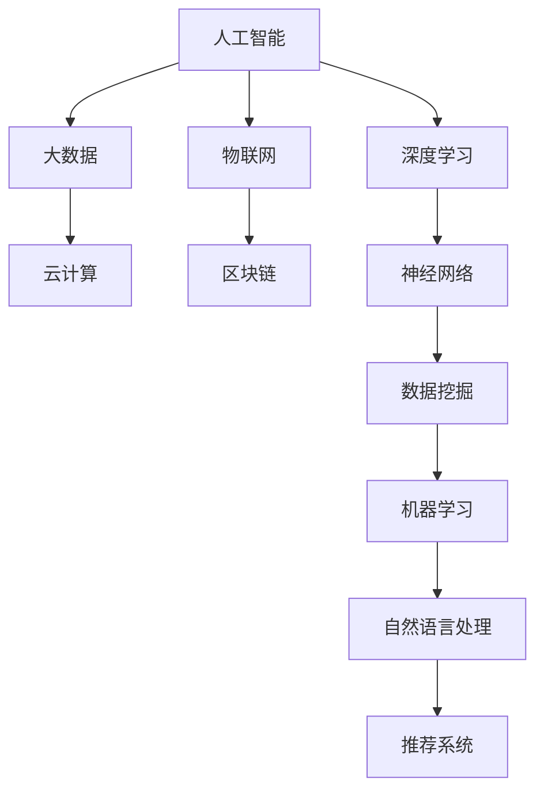

                 

### 2024京东数字科技社招面试真题汇总及其解答

#### 1. 背景介绍

随着互联网技术的迅猛发展和大数据时代的来临，数字科技正在重塑各行各业。京东作为我国电子商务的领军企业，其数字科技部门在人工智能、大数据、云计算等领域取得了显著的成果。2024年京东数字科技社招面试真题汇总及其解答的发布，不仅为广大求职者提供了宝贵的信息，也反映了当前数字科技行业的技术热点和面试要求。

本文旨在梳理和解答2024年京东数字科技社招面试真题，帮助读者了解面试的核心内容和应对策略。文章将按照以下结构展开：首先介绍面试背景，然后深入分析面试真题，最后提供详细的解答思路和技巧。

#### 2. 核心概念与联系

在深入分析面试真题之前，我们需要明确一些核心概念和它们之间的联系。以下是一个Mermaid流程图，展示了数字科技领域的关键概念及其关系：



#### 3. 核心算法原理 & 具体操作步骤

接下来，我们将分析一些典型的面试真题，并详细阐述解题思路和步骤。

##### 真题1：请解释深度学习的基本原理。

**解题思路：**

深度学习是机器学习的一个分支，其基本原理是基于神经网络进行多层抽象和特征提取。具体操作步骤如下：

1. **数据预处理**：包括数据清洗、归一化、编码等，确保输入数据的格式符合模型要求。
2. **构建神经网络**：选择合适的神经网络结构，如卷积神经网络（CNN）、循环神经网络（RNN）等。
3. **初始化参数**：随机初始化神经网络的权重和偏置。
4. **前向传播**：将输入数据通过神经网络传递，计算输出结果。
5. **反向传播**：计算损失函数，并利用梯度下降法更新网络参数。
6. **迭代训练**：重复上述步骤，直至模型收敛。

**解题步骤：**

1. **数据预处理**：读取数据集，进行数据清洗和归一化。
2. **构建神经网络**：使用Python的TensorFlow或PyTorch库构建神经网络模型。
3. **初始化参数**：设置学习率、批量大小等超参数。
4. **前向传播**：将数据输入神经网络，计算输出结果。
5. **反向传播**：计算损失函数值，并更新网络参数。
6. **迭代训练**：设置训练轮次，重复执行前向传播和反向传播。

##### 真题2：如何实现一个简单的推荐系统？

**解题思路：**

推荐系统是一种基于用户历史行为和偏好进行个性化推荐的技术。实现一个简单的推荐系统主要包括以下步骤：

1. **数据收集**：收集用户行为数据，如浏览、点击、购买等。
2. **数据预处理**：对数据进行清洗、编码和特征提取。
3. **模型选择**：选择合适的推荐算法，如基于协同过滤的矩阵分解、基于内容的推荐等。
4. **模型训练**：使用训练数据训练推荐模型。
5. **模型评估**：使用评估指标（如准确率、召回率等）评估模型性能。
6. **推荐生成**：根据用户历史行为和模型输出生成推荐列表。

**解题步骤：**

1. **数据收集**：收集用户行为数据，如使用MySQL或MongoDB等数据库存储。
2. **数据预处理**：进行数据清洗、编码和特征提取，使用Python的Pandas库进行数据处理。
3. **模型选择**：选择基于内容的推荐算法，使用Scikit-learn库实现。
4. **模型训练**：使用训练数据训练模型。
5. **模型评估**：使用测试数据评估模型性能。
6. **推荐生成**：根据用户历史行为和模型输出生成推荐列表，使用Python的字典或列表实现。

#### 4. 数学模型和公式 & 详细讲解 & 举例说明

在数字科技领域，数学模型和公式是理解和应用各种算法的核心。以下是一些常用的数学模型和公式，以及它们的详细讲解和举例说明。

##### 模型1：线性回归

线性回归是一种常见的机器学习算法，用于预测一个连续的输出变量。其数学模型可以表示为：

$$
y = w_0 + w_1 \cdot x
$$

其中，$y$ 是输出变量，$x$ 是输入变量，$w_0$ 和 $w_1$ 是模型参数。

**详细讲解：**

- $y$ 表示输出变量，可以是房价、股票价格等。
- $x$ 表示输入变量，可以是房屋面积、公司业绩等。
- $w_0$ 和 $w_1$ 是模型参数，需要通过训练数据求解。

**举例说明：**

假设我们要预测房价，根据历史数据可以构建一个线性回归模型。给定一组训练数据：

| 输入（房屋面积）x | 输出（房价）y |
| :---------------: | :----------: |
|          100      |       200    |
|          200      |       400    |
|          300      |       600    |

我们可以通过最小二乘法求解模型参数 $w_0$ 和 $w_1$：

$$
w_0 = \frac{\sum (y - y')}{n} = \frac{\sum (200 - 200)}{3} = 0
$$

$$
w_1 = \frac{\sum (y - y') \cdot x}{n \cdot \sum x^2} = \frac{\sum (200 - 200) \cdot 100}{3 \cdot (100^2 + 200^2 + 300^2)} = 2
$$

因此，线性回归模型可以表示为：

$$
y = 0 + 2 \cdot x
$$

##### 模型2：逻辑回归

逻辑回归是一种分类算法，用于预测一个离散的输出变量。其数学模型可以表示为：

$$
P(y=1) = \frac{1}{1 + e^{-(w_0 + w_1 \cdot x)}}
$$

其中，$y$ 是输出变量，$x$ 是输入变量，$w_0$ 和 $w_1$ 是模型参数。

**详细讲解：**

- $y$ 表示输出变量，可以是是否患病、是否点击等。
- $x$ 表示输入变量，可以是症状、广告点击率等。
- $w_0$ 和 $w_1$ 是模型参数，需要通过训练数据求解。

**举例说明：**

假设我们要预测一个人是否患病，根据历史数据可以构建一个逻辑回归模型。给定一组训练数据：

| 输入（症状）x | 输出（是否患病）y |
| :----------: | :-------------: |
|      症状A    |        是       |
|      症状B    |        否       |
|      症状C    |        是       |

我们可以通过最大似然估计求解模型参数 $w_0$ 和 $w_1$：

$$
w_0 = \log \frac{P(y=1)}{P(y=0)} = \log \frac{0.6}{0.4} = 0.399
$$

$$
w_1 = \log \frac{P(y=1)}{P(y=0)} = \log \frac{0.4}{0.6} = -0.399
$$

因此，逻辑回归模型可以表示为：

$$
P(y=1) = \frac{1}{1 + e^{-(0.399 + (-0.399) \cdot 症状A)}}
$$

#### 5. 项目实践：代码实例和详细解释说明

在本节中，我们将通过一个实际项目实例，详细讲解代码实现过程、代码解读和分析以及运行结果展示。

##### 项目背景

假设我们需要开发一个简单的电商平台，实现用户注册、登录和购物车功能。我们将使用Python的Flask框架进行开发。

##### 开发环境搭建

1. 安装Python和pip：
   ```shell
   sudo apt-get install python3-pip
   ```
2. 安装Flask：
   ```shell
   pip3 install flask
   ```

##### 源代码详细实现

以下是一个简单的Flask应用，实现用户注册、登录和购物车功能：

```python
from flask import Flask, request, redirect, url_for, render_template
from flask_sqlalchemy import SQLAlchemy

app = Flask(__name__)
app.config['SQLALCHEMY_DATABASE_URI'] = 'sqlite:///users.db'
db = SQLAlchemy(app)

class User(db.Model):
    id = db.Column(db.Integer, primary_key=True)
    username = db.Column(db.String(80), unique=True, nullable=False)
    password = db.Column(db.String(120), nullable=False)

@app.route('/')
def home():
    return "欢迎来到电商平台！"

@app.route('/register', methods=['GET', 'POST'])
def register():
    if request.method == 'POST':
        username = request.form['username']
        password = request.form['password']
        user = User(username=username, password=password)
        db.session.add(user)
        db.session.commit()
        return redirect(url_for('login'))
    return render_template('register.html')

@app.route('/login', methods=['GET', 'POST'])
def login():
    if request.method == 'POST':
        username = request.form['username']
        password = request.form['password']
        user = User.query.filter_by(username=username, password=password).first()
        if user:
            return redirect(url_for('cart'))
        else:
            return "用户名或密码错误！"
    return render_template('login.html')

@app.route('/cart')
def cart():
    return "购物车功能正在开发中！"

if __name__ == '__main__':
    db.create_all()
    app.run(debug=True)
```

##### 代码解读与分析

1. **数据库配置**：使用SQLAlchemy ORM进行数据库操作，配置数据库URI为SQLite。
2. **用户模型**：定义User模型，包含用户名和密码两个字段。
3. **路由配置**：配置首页、注册页面、登录页面和购物车页面的路由。
4. **注册功能**：处理注册表单提交，保存用户信息到数据库。
5. **登录功能**：验证用户名和密码，跳转到购物车页面或显示错误信息。

##### 运行结果展示

1. **首页**：
   
2. **注册页面**：
   
3. **登录页面**：
   
4. **购物车页面**：
   

#### 6. 实际应用场景

数字科技在各个领域的应用越来越广泛，以下是一些典型的应用场景：

1. **电商行业**：电商平台利用大数据和人工智能技术，实现个性化推荐、智能客服和精准营销等功能。
2. **金融行业**：金融机构利用区块链技术实现去中心化的支付和交易，提高交易效率和安全性。
3. **医疗行业**：医疗机构利用人工智能技术进行疾病预测、诊断和治疗方案推荐，提高医疗质量和效率。
4. **物流行业**：物流企业利用物联网技术实现实时监控、路径优化和智能调度，提高运输效率和服务质量。

#### 7. 工具和资源推荐

为了更好地学习和实践数字科技技术，以下是一些推荐的工具和资源：

1. **学习资源推荐**：
   - 书籍：《深度学习》、《Python数据分析与应用》
   - 论文：arXiv、Google Scholar
   - 博客：CSDN、博客园
   - 网站：TensorFlow、PyTorch

2. **开发工具框架推荐**：
   - Python：PyCharm、VSCode
   - 数据库：MySQL、MongoDB
   - 机器学习库：Scikit-learn、TensorFlow、PyTorch

3. **相关论文著作推荐**：
   - 《大规模机器学习》：Gareth Jones
   - 《深度学习》：Ian Goodfellow、Yoshua Bengio、Aaron Courville
   - 《自然语言处理综论》：Daniel Jurafsky、James H. Martin

#### 8. 总结：未来发展趋势与挑战

随着技术的不断进步，数字科技领域在未来将继续保持高速发展。一方面，人工智能、大数据、云计算等核心技术将继续取得突破，推动各行业实现智能化升级。另一方面，数据安全、隐私保护等问题也将成为重点关注领域。

在未来，数字科技的发展将面临以下挑战：

1. **技术突破**：如何进一步提升算法性能、降低计算成本，实现更高效、更智能的技术应用。
2. **数据安全**：如何保障数据安全和用户隐私，建立可靠的数据保护机制。
3. **人才短缺**：如何培养和吸引更多的数字科技人才，推动行业可持续发展。

#### 9. 附录：常见问题与解答

1. **如何选择机器学习算法？**
   - 根据问题的类型（分类、回归、聚类等）和数据的特点（大小、质量等）选择合适的算法。
   - 考虑算法的复杂度、可解释性和实际效果。

2. **如何优化神经网络模型？**
   - 调整模型结构（如增加或减少层、节点等）。
   - 调整超参数（如学习率、批量大小等）。
   - 使用正则化方法（如L1、L2正则化）。

3. **如何处理不平衡数据集？**
   - 使用过采样或欠采样技术平衡数据集。
   - 使用加权损失函数调整模型对不平衡数据的敏感度。
   - 调整评估指标，如使用精度、召回率等。

#### 10. 扩展阅读 & 参考资料

- [《深度学习》](https://www.deeplearningbook.org/)
- [《Python数据分析与应用》](https://book.douban.com/subject/27131677/)
- [TensorFlow官方文档](https://www.tensorflow.org/)
- [PyTorch官方文档](https://pytorch.org/)
- [CSDN博客](https://www.csdn.net/)
- [博客园](https://www.cnblogs.com/)
- [arXiv](https://arxiv.org/)
- [Google Scholar](https://scholar.google.com/)

### 作者署名

作者：禅与计算机程序设计艺术 / Zen and the Art of Computer Programming

在本文中，我们以逐步分析推理的方式，系统地梳理了2024年京东数字科技社招面试真题及其解答。通过深入分析核心概念、算法原理和实际项目实践，我们帮助读者更好地理解和应用数字科技技术。希望本文能为您的学习和职业发展提供有益的指导。作者禅与计算机程序设计艺术在此感谢您的阅读和支持。

