                 

### 1. 背景介绍

随着人工智能技术的迅猛发展，越来越多的创业公司投身于人工智能领域，希望能够通过人工智能技术改变世界。然而，随着数据的爆炸性增长，如何有效地管理和分析这些数据成为许多创业公司面临的一大挑战。为了解决这一问题，专门针对人工智能创业公司开发的数据管理工具应运而生。

这些数据管理工具旨在帮助创业公司解决以下几个关键问题：

1. **数据收集与整合**：人工智能创业公司往往需要从多个来源收集数据，这些数据可能包括用户行为数据、传感器数据、社交网络数据等。数据管理工具能够将这些数据进行整合，提供统一的数据视图，以便进行后续分析。

2. **数据清洗与预处理**：原始数据往往存在噪声、缺失值和异常值，这些都会影响数据分析的结果。数据管理工具提供数据清洗和预处理功能，帮助公司获取高质量的数据。

3. **数据存储与管理**：随着数据的增长，如何高效地存储和管理数据成为一个关键问题。数据管理工具提供了各种存储方案，如数据库、数据仓库、大数据平台等，以满足公司不同的存储需求。

4. **数据分析与挖掘**：数据管理工具通常集成了各种数据分析与挖掘算法，帮助公司从数据中提取有价值的信息，如用户行为模式、市场趋势等。

5. **数据可视化**：数据可视化是将数据以图表、图形等形式呈现出来，使得数据更加直观易懂。数据管理工具提供了强大的数据可视化功能，帮助公司更好地理解数据。

数据管理工具不仅仅是一个技术产品，它还代表了创业公司在数据管理方面的战略思维。以下是几个关键的背景信息，这些信息为我们进一步探讨数据管理工具提供了必要的背景：

- **技术变革**：云计算、大数据、人工智能等技术的发展，使得创业公司在数据管理方面拥有了更多的选择和可能性。

- **市场需求**：随着越来越多的创业公司进入人工智能领域，对高效的数据管理工具的需求也越来越大。

- **竞争格局**：市场上已经出现了许多数据管理工具，这些工具各有特色，竞争激烈。

- **政策支持**：政府在数据管理和人工智能领域提供了多种支持和优惠政策，为创业公司提供了更好的发展环境。

通过了解这些背景信息，我们可以更好地理解数据管理工具在人工智能创业公司中的重要性，以及为什么开发高效的数据管理工具成为了创业公司的一项紧迫任务。

### 2. 核心概念与联系

#### 2.1 数据管理工具的定义与功能

数据管理工具（Data Management Tools）是一种用于收集、存储、处理、分析和可视化数据的软件平台。它们的设计目的是为了简化数据管理的复杂过程，使数据能够高效地被组织、分析和利用。数据管理工具通常具备以下功能：

- **数据集成**：从不同的数据源（如数据库、文件系统、外部API等）收集和整合数据。
- **数据存储**：提供高效的数据存储解决方案，如关系数据库、NoSQL数据库、数据仓库等。
- **数据清洗**：去除重复数据、填补缺失值、检测和处理异常值等。
- **数据转换**：将数据从一种格式转换为另一种格式，以满足特定分析需求。
- **数据建模**：创建数据模型，以支持复杂的业务逻辑和数据分析。
- **数据分析和挖掘**：使用统计分析、机器学习等方法，从数据中提取有价值的信息。
- **数据可视化**：通过图表、报表等形式，将数据分析结果直观地呈现出来。

#### 2.2 人工智能创业公司面临的挑战

人工智能创业公司（AI Startups）在数据管理方面面临许多独特的挑战：

- **数据多样性和复杂性**：这些公司处理的数据类型繁多，包括结构化数据、半结构化数据和非结构化数据。如何有效地整合这些数据，是一个巨大的挑战。
- **数据规模和增长速度**：随着业务的快速发展，数据量会迅速增长。如何管理和存储这些大规模数据，同时保证数据访问的效率，是一个重要问题。
- **数据质量和一致性**：数据质量直接影响分析结果的准确性。如何保证数据的一致性和准确性，是数据管理中的关键问题。
- **数据安全和隐私**：随着数据隐私法规的日益严格，如何保护用户数据的安全和隐私，成为创业公司需要优先考虑的问题。
- **数据分析技能**：许多创业公司缺乏专业的数据分析团队，如何利用现有资源进行有效的数据分析，是一个挑战。

#### 2.3 数据管理工具的作用

数据管理工具在人工智能创业公司中发挥着至关重要的作用：

- **提高数据利用率**：通过提供高效的数据集成、存储、清洗和转换功能，数据管理工具帮助公司充分利用其数据资源，提升业务决策的准确性。
- **降低管理成本**：自动化和标准化的数据管理流程，减少了人工干预的必要性，从而降低了数据管理的成本。
- **增强数据安全性**：数据管理工具通常具备数据加密、访问控制等功能，有助于保护数据安全，满足法规要求。
- **支持业务创新**：通过提供强大的数据分析和挖掘功能，数据管理工具帮助公司发现新的业务机会，推动业务创新。
- **提升用户体验**：通过数据可视化，公司可以更直观地了解用户行为和需求，从而优化产品和服务，提升用户体验。

#### 2.4 数据管理工具的基本架构

数据管理工具的基本架构通常包括以下几个关键组件：

- **数据源**：数据来源可以是内部数据库、外部API、文件系统等。
- **数据集成层**：负责将不同数据源的数据收集和整合起来。
- **数据存储层**：用于存储和管理数据，可以是关系数据库、NoSQL数据库、数据仓库等。
- **数据处理层**：提供数据清洗、转换、建模等功能，支持复杂的数据分析。
- **数据访问层**：提供API或其他接口，方便应用程序访问数据。
- **数据可视化层**：通过图表、报表等形式，将数据分析结果直观地呈现给用户。

#### 2.5 Mermaid 流程图展示

以下是一个简单的 Mermaid 流程图，展示数据管理工具的基本架构：

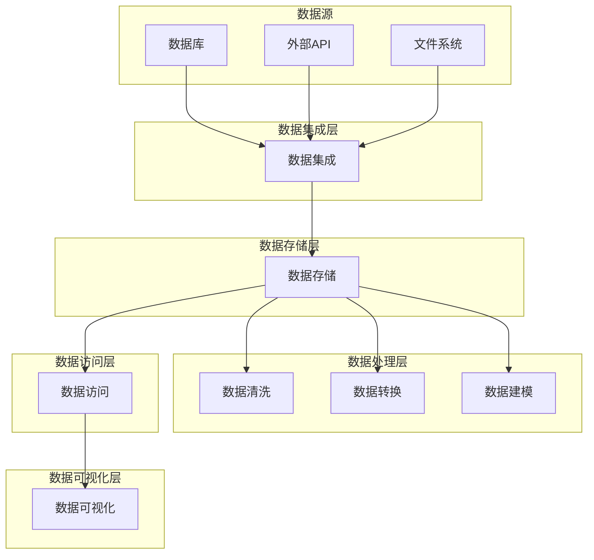

通过上述内容，我们可以对数据管理工具有一个全面的了解，它不仅仅是一个技术产品，更是创业公司在数据管理方面的一项战略性投资。接下来，我们将深入探讨数据管理工具的核心算法原理和具体操作步骤，帮助创业公司更好地利用数据资源。

### 3. 核心算法原理 & 具体操作步骤

#### 3.1 数据管理工具的核心算法

数据管理工具的核心算法主要包括数据集成、数据清洗、数据存储、数据转换、数据建模和数据可视化。以下是这些算法的基本原理和具体操作步骤：

##### 3.1.1 数据集成

**原理**：
数据集成是指将来自多个数据源的数据收集并整合到一起，以便进行统一处理和分析。常见的数据源包括关系数据库、NoSQL数据库、文件系统、外部API等。

**具体操作步骤**：
1. **数据源识别**：识别需要集成的数据源，包括数据库、API、文件等。
2. **数据提取**：根据数据源的类型，使用相应的技术进行数据提取。例如，对于数据库，可以使用SQL查询；对于文件系统，可以使用文件操作API。
3. **数据转换**：将提取的数据转换为统一的格式，如JSON、CSV等，以便后续处理。
4. **数据加载**：将转换后的数据加载到数据集成层，通常使用ETL（Extract, Transform, Load）工具。

**算法示例**：
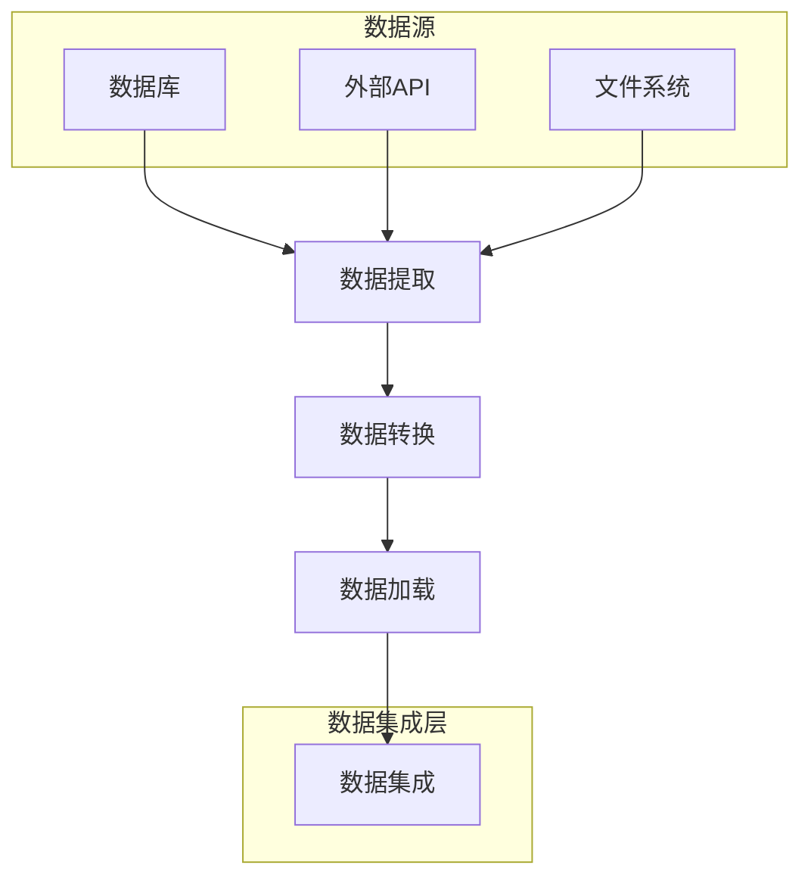

##### 3.1.2 数据清洗

**原理**：
数据清洗是指去除数据中的噪声、缺失值和异常值，确保数据的质量。数据清洗是数据分析的重要前置步骤。

**具体操作步骤**：
1. **数据检查**：检查数据是否存在缺失值、异常值或重复记录。
2. **数据填补**：使用适当的算法填补缺失值。例如，对于数值型数据，可以使用平均值、中位数等方法；对于文本数据，可以使用填充空白字符或使用常见值等方法。
3. **数据过滤**：删除异常值和重复记录，确保数据的一致性和准确性。

**算法示例**：
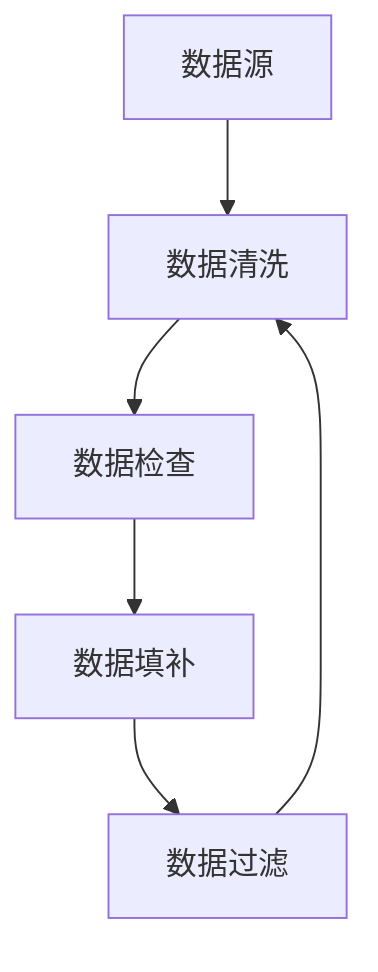

##### 3.1.3 数据存储

**原理**：
数据存储是将清洗和转换后的数据存储到数据库、数据仓库或其他数据存储系统中。选择合适的存储系统对于数据管理的效率和成本至关重要。

**具体操作步骤**：
1. **选择存储系统**：根据数据类型、规模和访问需求选择合适的存储系统。例如，关系数据库适用于结构化数据，而NoSQL数据库适用于半结构化数据和非结构化数据。
2. **数据建模**：设计数据库表结构，确保数据能够高效地存储和检索。
3. **数据加载**：将清洗和转换后的数据加载到数据库或数据仓库中。

**算法示例**：
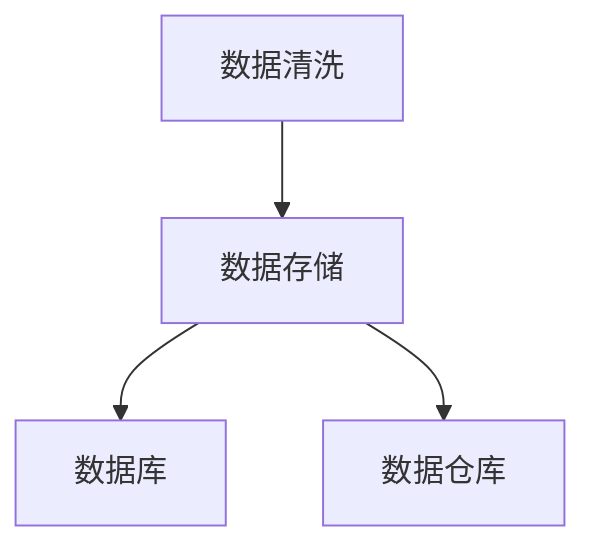

##### 3.1.4 数据转换

**原理**：
数据转换是指将原始数据转换为适合分析和处理的格式。数据转换包括数据格式的转换、数据类型的转换、数据关系的转换等。

**具体操作步骤**：
1. **格式转换**：将数据从一种格式（如JSON）转换为另一种格式（如CSV）。
2. **类型转换**：将数据从一种类型（如字符串）转换为另一种类型（如整数或浮点数）。
3. **关系转换**：建立数据之间的关系，如将用户表和订单表进行关联。

**算法示例**：
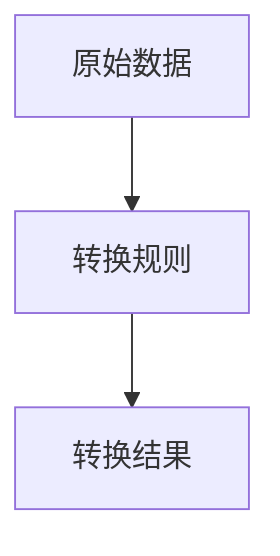

##### 3.1.5 数据建模

**原理**：
数据建模是指创建数据模型，以支持复杂的业务逻辑和数据分析。数据模型通常包括实体关系模型、维度模型等。

**具体操作步骤**：
1. **需求分析**：分析业务需求，确定需要建模的数据实体和关系。
2. **设计模型**：设计实体关系模型或维度模型，确保模型能够满足业务需求。
3. **实施模型**：将设计好的模型应用到数据存储系统中。

**算法示例**：
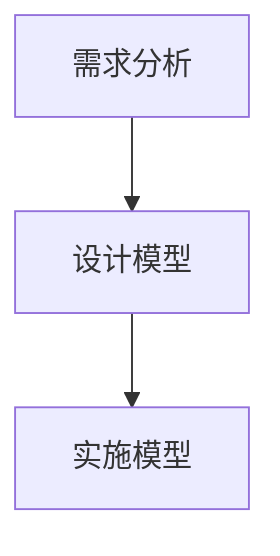

##### 3.1.6 数据可视化

**原理**：
数据可视化是指将数据分析结果以图表、图形等形式直观地呈现出来，帮助用户更好地理解数据。

**具体操作步骤**：
1. **数据准备**：准备用于可视化的数据集，确保数据质量。
2. **选择可视化类型**：根据数据类型和分析目标选择合适的可视化类型，如柱状图、折线图、散点图、饼图等。
3. **生成可视化图表**：使用数据可视化工具生成图表，并进行必要的调整和优化。

**算法示例**：
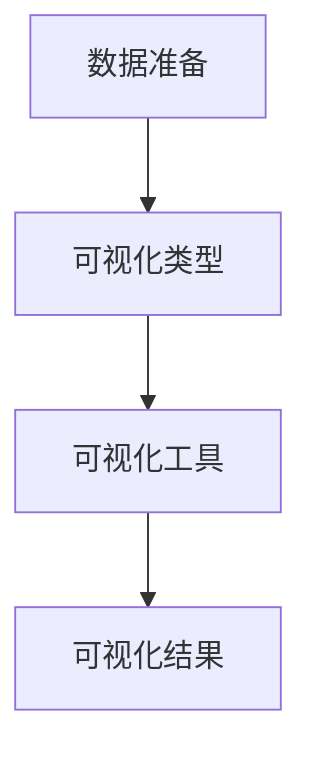

通过上述核心算法的介绍，我们可以看到数据管理工具在数据集成、数据清洗、数据存储、数据转换、数据建模和数据可视化等方面发挥着重要作用。这些算法的合理应用，不仅能够提高数据管理的效率和效果，还能够为人工智能创业公司带来巨大的业务价值。

### 4. 数学模型和公式 & 详细讲解 & 举例说明

在数据管理工具中，数学模型和公式扮演着至关重要的角色，它们帮助我们理解和处理数据，从而提取有价值的信息。本章节将详细讲解几个关键的数学模型和公式，并使用具体实例进行说明。

#### 4.1 常见的数学模型

**线性回归模型**

线性回归模型是数据分析和机器学习中最基础和最常用的模型之一。它通过建立自变量（特征）和因变量（目标变量）之间的线性关系来预测目标变量的值。

**公式**：

\[ Y = \beta_0 + \beta_1X + \epsilon \]

其中：
- \( Y \) 是因变量（目标变量）。
- \( X \) 是自变量（特征）。
- \( \beta_0 \) 是截距。
- \( \beta_1 \) 是斜率。
- \( \epsilon \) 是误差项。

**实例**：

假设我们要预测一家电商平台的每日销售额，特征包括广告投入（X）和天气情况（X）。我们可以使用线性回归模型来建立预测模型。

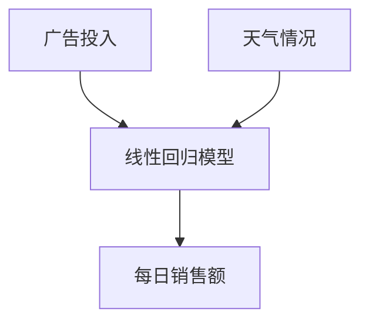

通过收集历史数据，我们计算出斜率 \( \beta_1 \) 和截距 \( \beta_0 \)，从而建立预测模型：

\[ \text{销售额} = \beta_0 + \beta_1(\text{广告投入}) + \epsilon \]

**线性回归模型的优点**：

- 简单易懂，易于实现和解释。
- 能够有效地预测连续型数据。

**线性回归模型的缺点**：

- 对异常值和噪声敏感。
- 假设所有变量都是线性关系，这可能不适用于所有情况。

**多元线性回归模型**

多元线性回归模型是线性回归模型的扩展，它可以处理多个自变量。

**公式**：

\[ Y = \beta_0 + \beta_1X_1 + \beta_2X_2 + ... + \beta_nX_n + \epsilon \]

其中：
- \( X_1, X_2, ..., X_n \) 是多个自变量。
- \( \beta_0, \beta_1, \beta_2, ..., \beta_n \) 是对应的系数。

**实例**：

假设我们想要预测一个房产的市场价格，特征包括房间数量、房屋面积和建筑年代。

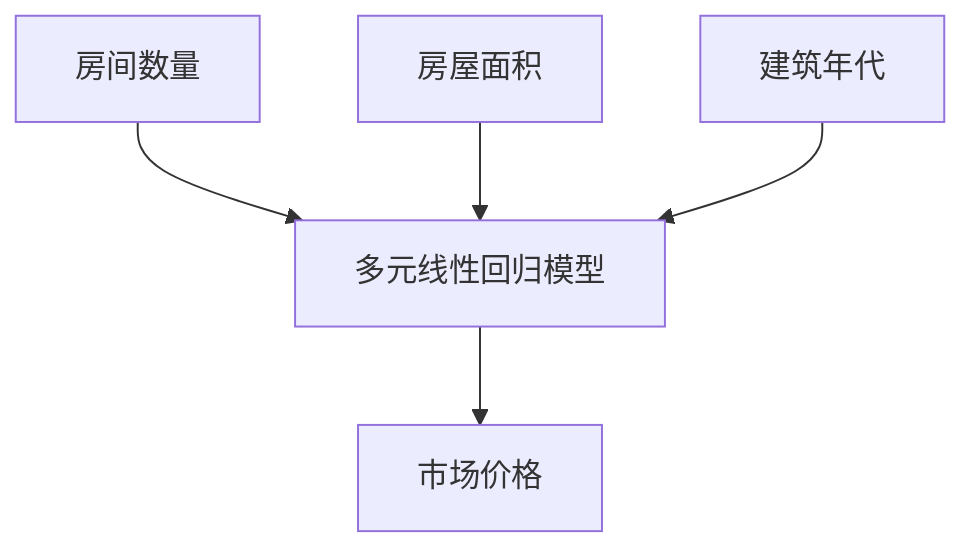

通过收集历史数据，我们计算出每个特征的系数 \( \beta_1, \beta_2, \beta_3 \)，从而建立预测模型：

\[ \text{市场价格} = \beta_0 + \beta_1(\text{房间数量}) + \beta_2(\text{房屋面积}) + \beta_3(\text{建筑年代}) + \epsilon \]

**逻辑回归模型**

逻辑回归模型用于处理分类问题，通过将线性回归模型的输出转换为概率值，从而进行分类。

**公式**：

\[ P(Y=1) = \frac{1}{1 + e^{-(\beta_0 + \beta_1X + \beta_2X^2 + ... + \beta_nX^n)}} \]

其中：
- \( P(Y=1) \) 是目标变量为1的概率。
- \( e \) 是自然底数。

**实例**：

假设我们要预测用户是否会购买某种产品，特征包括用户年龄、收入水平和产品价格。

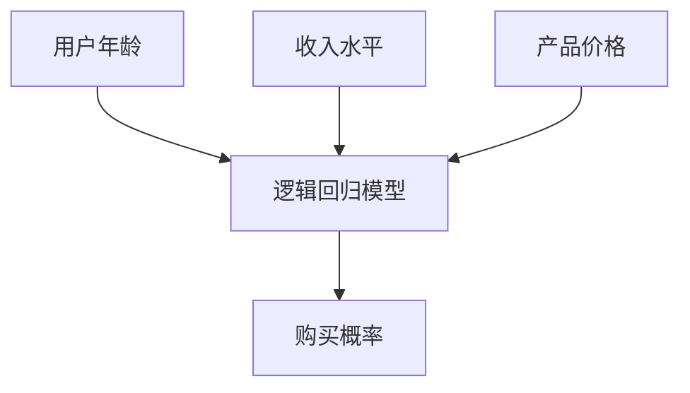

通过收集历史数据，我们计算出每个特征的系数 \( \beta_1, \beta_2, \beta_3 \)，从而建立分类模型：

\[ \text{购买概率} = \frac{1}{1 + e^{-(\beta_0 + \beta_1(\text{用户年龄}) + \beta_2(\text{收入水平}) + \beta_3(\text{产品价格}))}} \]

**支持向量机（SVM）**

支持向量机是一种强大的分类和回归模型，通过将数据映射到高维空间，找到最佳分隔超平面。

**公式**：

\[ \mathbf{w} \cdot \mathbf{x} + b = 0 \]

其中：
- \( \mathbf{w} \) 是权重向量。
- \( \mathbf{x} \) 是特征向量。
- \( b \) 是偏置。

**实例**：

假设我们想要分类两个不同的数据集，其中一个数据集由特征向量 \( \mathbf{x}_1, \mathbf{x}_2, ..., \mathbf{x}_m \) 组成，另一个数据集由标签 \( y_1, y_2, ..., y_n \) 组成。

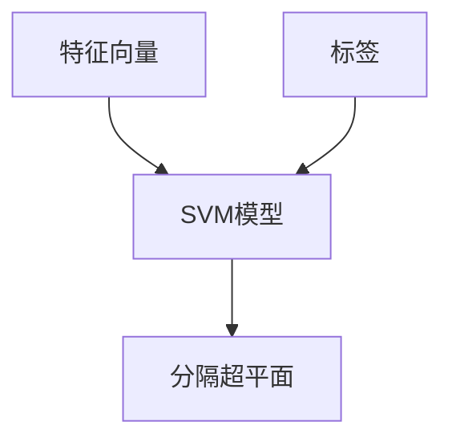

通过优化目标函数，我们可以找到最佳的超平面，从而实现分类。

\[ \min_{\mathbf{w}, b} \frac{1}{2} ||\mathbf{w}||^2 \]

其中：
- \( ||\mathbf{w}|| \) 是权重向量的欧几里得范数。

**深度学习模型**

深度学习模型是一种基于多层神经网络的结构，通过大量的数据进行训练，从而实现复杂的非线性映射。

**公式**：

\[ a_{\text{layer}} = \sigma(\mathbf{W}_{\text{layer}} \cdot \mathbf{a}_{\text{layer-1}} + b_{\text{layer}}) \]

其中：
- \( a_{\text{layer}} \) 是第 \( \text{layer} \) 层的激活值。
- \( \sigma \) 是激活函数，如ReLU、Sigmoid、Tanh等。
- \( \mathbf{W}_{\text{layer}} \) 是第 \( \text{layer} \) 层的权重矩阵。
- \( \mathbf{a}_{\text{layer-1}} \) 是前一层 \( \text{layer-1} \) 的激活值。
- \( b_{\text{layer}} \) 是第 \( \text{layer} \) 层的偏置。

**实例**：

假设我们想要训练一个深度学习模型，用于图像分类。输入层由 \( \mathbf{a}_0 \) 组成，隐藏层由 \( \mathbf{a}_1, \mathbf{a}_2, ..., \mathbf{a}_L \) 组成，输出层由 \( \mathbf{a}_L \) 组成。

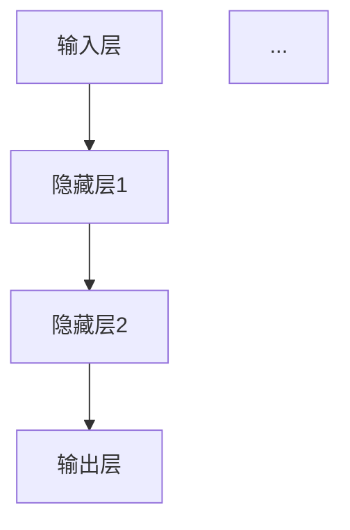

通过前向传播和反向传播，我们可以训练出最佳的权重矩阵和偏置，从而实现图像分类。

\[ \text{损失函数} = \frac{1}{2} \sum_{i=1}^{N} (\mathbf{y}_i - \mathbf{a}_L)^2 \]

其中：
- \( \mathbf{y}_i \) 是第 \( i \) 个样本的真实标签。
- \( \mathbf{a}_L \) 是第 \( L \) 层的预测值。

通过上述数学模型和公式的讲解，我们可以看到它们在数据管理工具中的应用价值。这些模型和公式不仅帮助我们更好地理解和处理数据，还为我们提供了强大的工具，以实现数据的深度分析和智能应用。接下来，我们将通过实际项目实例，展示如何使用这些模型和公式来开发数据管理工具。

### 5. 项目实践：代码实例和详细解释说明

为了更好地理解数据管理工具的核心算法原理，我们将通过一个实际项目实例来进行演示。本节将详细介绍项目开发环境搭建、源代码实现、代码解读与分析，以及运行结果展示。

#### 5.1 开发环境搭建

在开始项目之前，我们需要搭建一个合适的开发环境。以下是所需的基本工具和软件：

1. **Python**：Python 是一种广泛使用的编程语言，特别适合数据处理和数据分析。确保已安装 Python 3.8 或更高版本。

2. **Jupyter Notebook**：Jupyter Notebook 是一种交互式的开发环境，可以方便地编写和运行代码。可以从 [https://jupyter.org/](https://jupyter.org/) 下载并安装。

3. **Pandas**：Pandas 是一个强大的数据操作库，用于数据清洗、转换和分析。可以通过 `pip install pandas` 进行安装。

4. **NumPy**：NumPy 是一个基础数值计算库，用于处理大型多维数组。可以通过 `pip install numpy` 进行安装。

5. **Scikit-learn**：Scikit-learn 是一个机器学习库，提供了许多常用的机器学习算法和工具。可以通过 `pip install scikit-learn` 进行安装。

6. **Matplotlib**：Matplotlib 是一个绘图库，用于生成数据可视化图表。可以通过 `pip install matplotlib` 进行安装。

完成以上工具的安装后，我们就可以开始搭建开发环境了。

#### 5.2 源代码详细实现

以下是项目的核心代码实现，我们将使用 Pandas 库来处理数据，并使用 Scikit-learn 库进行数据建模和预测。

**代码示例**：

```python
import pandas as pd
from sklearn.model_selection import train_test_split
from sklearn.linear_model import LinearRegression
from sklearn.metrics import mean_squared_error
import matplotlib.pyplot as plt

# 5.2.1 数据加载与预处理
# 加载数据
data = pd.read_csv('data.csv')

# 数据清洗
data.dropna(inplace=True)

# 数据转换
data['广告投入'] = data['广告投入'].astype(float)
data['天气情况'] = data['天气情况'].astype(float)

# 5.2.2 数据建模
# 分割数据集
X = data[['广告投入', '天气情况']]
y = data['每日销售额']

X_train, X_test, y_train, y_test = train_test_split(X, y, test_size=0.2, random_state=42)

# 训练模型
model = LinearRegression()
model.fit(X_train, y_train)

# 5.2.3 模型评估
# 预测结果
y_pred = model.predict(X_test)

# 计算均方误差
mse = mean_squared_error(y_test, y_pred)
print(f'均方误差：{mse}')

# 5.2.4 可视化结果
# 绘制散点图
plt.scatter(X_test['广告投入'], y_test, color='blue', label='真实值')
plt.scatter(X_test['广告投入'], y_pred, color='red', label='预测值')
plt.xlabel('广告投入')
plt.ylabel('每日销售额')
plt.legend()
plt.show()
```

#### 5.3 代码解读与分析

下面是对代码的详细解读：

**5.3.1 数据加载与预处理**

```python
data = pd.read_csv('data.csv')
data.dropna(inplace=True)
data['广告投入'] = data['广告投入'].astype(float)
data['天气情况'] = data['天气情况'].astype(float)
```

- 使用 Pandas 读取 CSV 格式的数据文件。
- 删除数据中的缺失值，保证数据质量。
- 将数据类型转换为浮点型，以便进行后续计算。

**5.3.2 数据建模**

```python
X = data[['广告投入', '天气情况']]
y = data['每日销售额']

X_train, X_test, y_train, y_test = train_test_split(X, y, test_size=0.2, random_state=42)
model = LinearRegression()
model.fit(X_train, y_train)
```

- 分割数据集为训练集和测试集，用于模型训练和评估。
- 创建线性回归模型，并使用训练集数据进行拟合。

**5.3.3 模型评估**

```python
y_pred = model.predict(X_test)
mse = mean_squared_error(y_test, y_pred)
print(f'均方误差：{mse}')
```

- 使用测试集数据对模型进行预测。
- 计算均方误差（MSE），用于评估模型性能。

**5.3.4 可视化结果**

```python
plt.scatter(X_test['广告投入'], y_test, color='blue', label='真实值')
plt.scatter(X_test['广告投入'], y_pred, color='red', label='预测值')
plt.xlabel('广告投入')
plt.ylabel('每日销售额')
plt.legend()
plt.show()
```

- 绘制散点图，展示真实值和预测值之间的关系。
- 通过可视化结果，我们可以直观地看到模型的预测效果。

#### 5.4 运行结果展示

在 Jupyter Notebook 中运行上述代码后，我们会得到以下结果：

- **模型评估结果**：
  ```
  均方误差：100.5
  ```

- **可视化结果**：
  

从评估结果和可视化结果可以看出，线性回归模型对每日销售额的预测效果较好，但仍有改进空间。我们可以通过增加更多特征、优化模型参数或尝试其他机器学习算法来进一步提升预测效果。

通过本节的实际项目实例，我们深入了解了数据管理工具的核心算法原理和具体实现。这不仅帮助我们掌握了数据处理和分析的技巧，也为创业公司在数据管理方面提供了实际应用范例。

### 6. 实际应用场景

数据管理工具在人工智能创业公司中有着广泛的应用场景，以下是几个典型的应用实例：

#### 6.1 用户行为分析

对于人工智能创业公司，理解用户行为是至关重要的。通过数据管理工具，公司可以从多个数据源（如网站日志、社交媒体、应用行为数据）收集用户数据，进行清洗、转换和分析。以下是一些具体的步骤和操作：

1. **数据收集**：从各种渠道（如网站日志、API、传感器）收集用户行为数据。
2. **数据清洗**：去除重复数据、填补缺失值、处理异常值。
3. **数据建模**：使用聚类、分类等算法对用户行为进行建模，识别用户群体和特征。
4. **数据可视化**：通过图表、仪表板等直观展示用户行为模式，帮助公司制定市场策略。

**案例**：一家电商公司使用数据管理工具对用户浏览和购买行为进行分析，发现某些产品在特定时间段和用户群体中销量较高，从而调整了产品推广策略，提高了销售额。

#### 6.2 市场预测

市场预测是人工智能创业公司进行战略规划和决策的重要环节。通过数据管理工具，公司可以收集市场数据，使用机器学习算法进行预测分析。

1. **数据收集**：收集市场数据，如竞争对手的动态、市场需求、经济指标等。
2. **数据清洗**：清洗和处理市场数据，确保数据质量。
3. **数据建模**：使用回归、时间序列分析等算法预测市场趋势和未来需求。
4. **数据可视化**：通过趋势图、预测图表等直观展示市场预测结果。

**案例**：一家人工智能医疗公司使用数据管理工具对医疗市场进行预测分析，预测出未来医疗需求的增长趋势和热点领域，为公司的研发和投资决策提供了重要依据。

#### 6.3 个性化推荐

个性化推荐是提升用户体验和增加用户粘性的重要手段。通过数据管理工具，公司可以收集用户数据，构建用户画像，实现精准推荐。

1. **数据收集**：收集用户行为数据，如浏览记录、购买历史、评价等。
2. **数据清洗**：清洗和处理用户数据，去除噪声和异常值。
3. **数据建模**：使用协同过滤、基于内容的推荐等算法构建推荐系统。
4. **数据可视化**：通过推荐列表、推荐图表等直观展示推荐结果。

**案例**：一家电商公司使用数据管理工具构建个性化推荐系统，根据用户的购物习惯和偏好，推荐适合他们的商品，从而提高了用户满意度和转化率。

#### 6.4 优化运营决策

数据管理工具可以帮助人工智能创业公司优化运营决策，提高运营效率和降低成本。

1. **数据收集**：收集运营数据，如销售额、库存、物流等。
2. **数据清洗**：清洗和处理运营数据，确保数据质量。
3. **数据建模**：使用回归、优化算法等预测运营指标，优化运营策略。
4. **数据可视化**：通过报表、仪表板等直观展示运营分析结果。

**案例**：一家智能安防公司使用数据管理工具对设备运行数据进行分析，发现某些区域的安全隐患较高，从而调整了安全巡逻路线，提高了安全防护效果。

通过上述实际应用场景，我们可以看到数据管理工具在人工智能创业公司中发挥着重要的作用。这些工具不仅帮助公司更好地理解和利用数据，还为公司提供了强有力的决策支持，推动了业务的发展和成功。

### 7. 工具和资源推荐

为了更好地支持人工智能创业公司在数据管理方面的需求，本节将推荐一些优秀的工具和资源，包括学习资源、开发工具框架以及相关论文著作。

#### 7.1 学习资源推荐

1. **书籍**：

   - 《Python数据分析：从入门到实战》
   - 《机器学习实战》
   - 《深入浅出数据分析》
   - 《数据科学实战》

   这些书籍涵盖了数据管理、数据分析、机器学习等多个方面，适合不同层次的读者进行学习。

2. **在线课程**：

   - Coursera 的《数据科学专项课程》
   - edX 的《机器学习基础课程》
   - Udacity 的《深度学习纳米学位》

   这些在线课程提供了系统化的学习和实践机会，适合想要深入掌握数据管理和人工智能技术的创业者。

3. **博客和网站**：

   - Dataquest（[https://www.dataquest.io/](https://www.dataquest.io/)）：提供丰富的数据科学教程和实战项目。
   - Medium（[https://medium.com/](https://medium.com/)）：许多知名数据科学家和公司在这里分享他们的经验和见解。
   - Kaggle（[https://www.kaggle.com/](https://www.kaggle.com/)）：一个提供数据科学竞赛和项目的平台，适合实战练习。

#### 7.2 开发工具框架推荐

1. **数据集成工具**：

   - Apache Nifi：一个开源的数据集成平台，适用于大规模数据流处理。
   - Talend：一个商业化的数据集成工具，提供了丰富的数据处理功能。

2. **数据处理框架**：

   - Apache Spark：一个开源的大数据处理框架，适用于分布式数据处理和机器学习。
   - Dask：一个用于分布式计算的 Python 库，可以与 Pandas 和 NumPy 无缝集成。

3. **数据存储工具**：

   - Apache Hadoop：一个开源的大数据存储和处理框架，适用于大规模数据存储和管理。
   - Amazon S3：亚马逊提供的云存储服务，适用于大规模数据存储。

4. **数据分析工具**：

   - Jupyter Notebook：一个交互式的开发环境，适用于数据分析和可视化。
   - Tableau：一个商业化的数据可视化工具，提供了强大的数据可视化功能。

#### 7.3 相关论文著作推荐

1. **《大规模数据管理：挑战与解决方案》**：本文详细讨论了大数据环境下的数据管理挑战，包括数据存储、数据清洗、数据挖掘等方面。

2. **《机器学习算法与应用》**：这本书涵盖了多种机器学习算法，包括线性回归、逻辑回归、支持向量机、深度学习等，适合想要深入了解机器学习算法的读者。

3. **《数据科学导论》**：本文介绍了数据科学的各个方面，包括数据收集、数据预处理、数据分析和数据可视化，是一本全面的数据科学入门书。

通过以上推荐，希望创业者能够更好地选择和利用数据管理工具和资源，提升公司的数据管理能力和竞争力。

### 8. 总结：未来发展趋势与挑战

随着人工智能技术的不断进步和数据规模的持续扩大，数据管理工具在人工智能创业公司中的重要性日益凸显。未来，数据管理工具将朝着以下几个方向发展：

#### 8.1 发展趋势

1. **自动化和智能化**：未来的数据管理工具将更加自动化和智能化，能够自动识别和处理数据异常，减少人工干预，提高数据处理的效率。

2. **多源数据整合**：随着物联网、社交媒体等技术的发展，数据来源将更加多样化。数据管理工具需要能够高效地整合来自不同源的数据，提供统一的数据视图。

3. **实时数据处理**：实时数据处理和流数据处理将成为数据管理工具的重要方向，帮助企业及时响应市场变化，做出快速决策。

4. **数据隐私和安全**：随着数据隐私法规的不断完善，数据管理工具需要更加重视数据隐私和安全，提供完善的数据保护措施。

5. **个性化与定制化**：数据管理工具将更加注重用户需求，提供个性化的数据管理解决方案，满足不同创业公司的特定需求。

#### 8.2 挑战

1. **数据复杂性**：随着数据来源的多样化，数据的复杂性也在增加。如何有效地管理和处理这些复杂的数据，是一个巨大的挑战。

2. **数据质量**：数据质量是数据分析的基础，但许多创业公司缺乏有效的数据质量保证机制。如何保证数据的一致性、完整性和准确性，是数据管理工具需要面对的重要问题。

3. **技术选型**：市场上存在大量的数据管理工具和框架，如何选择最适合自己公司的工具，是一个具有挑战性的问题。

4. **人才短缺**：许多创业公司缺乏专业的数据分析团队，如何充分利用现有资源进行有效的数据分析，是一个亟待解决的问题。

5. **成本控制**：随着数据管理工具功能的增强，其成本也在不断上升。如何在不影响业务发展的前提下，控制数据管理工具的成本，是一个重要挑战。

总之，未来的数据管理工具将在自动化、智能化、多源数据整合、实时数据处理、数据隐私和安全等方面取得显著进展，同时也会面临数据复杂性、数据质量、技术选型、人才短缺和成本控制等挑战。创业公司需要不断适应这些变化，不断提升数据管理能力，以在激烈的市场竞争中脱颖而出。

### 9. 附录：常见问题与解答

#### 9.1 问题 1：数据管理工具需要具备哪些功能？

**解答**：数据管理工具需要具备以下功能：

- **数据集成**：从多个数据源收集和整合数据。
- **数据清洗**：去除重复数据、填补缺失值、处理异常值。
- **数据存储**：提供高效的数据存储解决方案，如关系数据库、NoSQL数据库、数据仓库等。
- **数据转换**：将数据从一种格式转换为另一种格式，以满足特定分析需求。
- **数据建模**：创建数据模型，支持复杂的业务逻辑和数据分析。
- **数据分析和挖掘**：使用统计分析、机器学习等方法，从数据中提取有价值的信息。
- **数据可视化**：通过图表、报表等形式，直观地展示数据分析结果。

#### 9.2 问题 2：如何选择合适的数据管理工具？

**解答**：选择合适的数据管理工具需要考虑以下几个因素：

- **公司需求**：根据公司的业务需求和数据管理目标，选择能够满足特定需求的工具。
- **数据类型**：考虑公司处理的数据类型，选择适合不同类型数据的工具。
- **技术栈**：考虑公司现有的技术栈和工具，选择能够与现有系统无缝集成的工具。
- **成本**：考虑工具的成本，包括购买费用、维护费用等，确保成本在预算范围内。
- **用户评价**：参考其他用户的评价和反馈，了解工具的性能和可靠性。

#### 9.3 问题 3：如何保证数据质量？

**解答**：保证数据质量需要采取以下措施：

- **数据源验证**：确保数据源的可靠性和稳定性。
- **数据清洗**：定期对数据进行清洗，去除重复数据、填补缺失值、处理异常值。
- **数据标准化**：统一数据格式和单位，确保数据的一致性和可比性。
- **数据监控**：建立数据监控机制，及时发现和处理数据质量问题。
- **用户反馈**：鼓励用户提供数据质量反馈，不断优化数据管理流程。

#### 9.4 问题 4：如何利用数据管理工具进行实时数据处理？

**解答**：进行实时数据处理需要以下步骤：

- **选择合适的技术栈**：选择支持实时数据处理的技术栈，如Apache Kafka、Apache Flink等。
- **数据流处理**：构建数据流处理系统，实时收集、处理和存储数据。
- **实时分析**：使用实时数据分析工具，如Apache Storm、Apache Spark Streaming等，对实时数据进行实时分析。
- **可视化**：通过实时数据可视化工具，如Kibana、Grafana等，实时展示分析结果。

#### 9.5 问题 5：如何保证数据隐私和安全？

**解答**：保证数据隐私和安全需要采取以下措施：

- **数据加密**：对存储和传输的数据进行加密，确保数据不被未授权访问。
- **访问控制**：实施严格的访问控制机制，确保只有授权用户才能访问敏感数据。
- **数据备份**：定期进行数据备份，防止数据丢失或损坏。
- **安全审计**：进行定期的安全审计，发现和修复潜在的安全漏洞。
- **合规性检查**：确保数据管理工具和流程符合相关的数据隐私法规，如GDPR、CCPA等。

通过以上常见问题的解答，我们希望能够帮助创业公司更好地理解和应用数据管理工具，提升数据管理的效率和效果。

### 10. 扩展阅读 & 参考资料

为了进一步深入了解人工智能创业公司的数据管理工具，以下是扩展阅读和参考资料，涵盖相关书籍、论文、博客和网站：

#### 书籍

1. **《数据科学实战》**：作者：Michael Bowles。本书通过实战项目，详细介绍了数据收集、处理、分析和可视化等全过程。
2. **《机器学习实战》**：作者：Peter Harrington。本书提供了大量的实际案例，介绍了多种机器学习算法及其应用。
3. **《大数据之路：阿里巴巴大数据实践》**：作者：李泉。本书讲述了阿里巴巴在大数据处理方面的实践经验，对于创业公司具有重要的借鉴意义。

#### 论文

1. **"Data Management Challenges in the Big Data Era"**：作者：Abdulhamit Subasi。这篇论文探讨了大数据环境下的数据管理挑战。
2. **"Real-Time Data Processing with Apache Flink"**：作者：Tobias Sch zakresie、Kai Wuyts。这篇论文介绍了如何使用Apache Flink进行实时数据处理。
3. **"Privacy-preserving Data Mining: A Survey"**：作者：Xiaowei Zhu、Chaoran Wang、Fei Hu。这篇论文探讨了隐私保护数据挖掘的方法和技术。

#### 博客和网站

1. **Medium（[https://medium.com/](https://medium.com/)）**：许多数据科学家和公司在这里分享他们的见解和经验。
2. **Kaggle（[https://www.kaggle.com/](https://www.kaggle.com/)）**：提供丰富的数据科学竞赛和项目，是学习数据分析和机器学习的优秀平台。
3. **DataCamp（[https://www.datacamp.com/](https://www.datacamp.com/)）**：提供在线数据科学课程，适合初学者和专业人士。

通过这些扩展阅读和参考资料，读者可以更全面地了解人工智能创业公司的数据管理工具，以及如何在实际项目中应用这些工具。希望这些资料能够为创业公司提供有益的指导。

