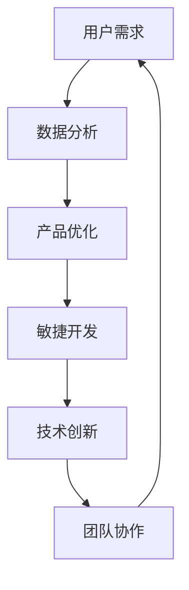

                 

### 1. 背景介绍

人工智能（AI）技术的飞速发展，带来了前所未有的创新机会。越来越多的创业公司投身于人工智能领域，希望通过AI技术打造出卓越的产品，满足市场需求。然而，人工智能产品开发过程中，如何确保产品不断优化、满足用户需求，成为一个亟待解决的问题。

在不断改进产品策略方面，创业公司可以借鉴一些成功的经验和实践。首先，我们需要明确一个基本观念：产品迭代是持续的过程，而不是一蹴而就的目标。这意味着，创业公司需要在产品开发的全过程中，始终保持对用户需求的敏锐洞察，以及对市场变化的敏感度。

本文旨在探讨人工智能创业公司在产品迭代过程中，如何通过有效的策略和方法，不断改进产品，提升用户体验。我们将从以下几个角度展开讨论：

1. **用户反馈的重要性**：用户反馈是产品改进的重要依据。了解用户需求、发现产品问题，需要倾听用户的真实声音。
2. **数据分析的价值**：通过数据分析和挖掘，创业公司可以更加精准地定位用户需求，从而制定更有效的产品优化策略。
3. **敏捷开发的实践**：敏捷开发强调快速迭代和持续改进，有助于创业公司及时响应用户需求和市场变化。
4. **技术创新与积累**：技术创新是人工智能创业公司的核心竞争力。通过持续的技术积累和研发，创业公司可以不断提升产品竞争力。
5. **团队协作与沟通**：高效的团队协作和沟通，有助于创业公司在产品迭代过程中，保持统一的目标和方向。

接下来，我们将分别从这些方面展开详细讨论，帮助人工智能创业公司在产品迭代过程中，找到适合自己的改进策略。### 2. 核心概念与联系

在探讨如何不断改进人工智能产品之前，我们需要明确一些核心概念和它们之间的联系。以下是几个关键概念及其关系，并附上Mermaid流程图以帮助读者理解。

#### 2.1 关键概念

1. **用户需求**：用户需求是产品开发的起点和终点。理解用户需求，有助于确定产品功能和改进方向。
2. **数据分析**：数据分析是一种通过分析用户行为数据、反馈信息等，提取有价值信息的方法。
3. **敏捷开发**：敏捷开发是一种迭代式、增量式的软件开发方法，强调快速响应变化和持续优化。
4. **技术创新**：技术创新是指通过研发新技术、新产品来提升产品竞争力。
5. **团队协作**：团队协作是指团队成员之间的有效沟通和合作，以确保项目顺利进行。

#### 2.2 关系

这些核心概念之间的关系可以用以下Mermaid流程图表示：



在上述流程图中：

- **用户需求**通过**数据分析**得到进一步理解，从而为**产品优化**提供依据。
- **产品优化**又推动了**敏捷开发**，使开发过程更加灵活和高效。
- **敏捷开发**和**技术创新**相互促进，共同提升产品竞争力。
- **技术创新**带来了新的机遇，需要**团队协作**来实现。

通过这个流程图，我们可以看出，核心概念之间是相互关联、相互促进的。理解这些关系，有助于创业公司在产品迭代过程中，全面考虑各个因素，制定更加有效的改进策略。### 3. 核心算法原理 & 具体操作步骤

在人工智能产品开发中，核心算法的设计和优化是提升产品性能的关键。以下，我们将介绍一种通用的算法原理，并详细阐述其具体操作步骤。

#### 3.1 算法原理

我们选择了一种基于深度学习的图像识别算法——卷积神经网络（CNN）作为例子。CNN是一种在图像处理领域表现优异的神经网络架构，其核心思想是通过多层卷积和池化操作，提取图像特征，从而实现图像分类或识别。

#### 3.2 算法步骤

1. **输入预处理**：

   在开始训练之前，需要对图像数据进行预处理，包括归一化、缩放、裁剪等操作，以适应模型的输入要求。这一步有助于提高训练效率和模型性能。

2. **卷积操作**：

   CNN的第一层通常是卷积层，卷积层通过滑动卷积核在输入图像上提取特征。卷积层使用多个卷积核，每个卷积核可以提取图像的不同特征。

3. **激活函数**：

   为了引入非线性，卷积层后通常会接一个激活函数，如ReLU（Rectified Linear Unit）。ReLU函数可以加快模型的训练速度，并在某些情况下提高模型性能。

4. **池化操作**：

   池化层用于减少模型参数数量和计算复杂度。常见的池化操作包括最大池化和平均池化。

5. **全连接层**：

   在卷积层和池化层之后，通常会接若干个全连接层，用于将卷积特征映射到具体的类别标签。

6. **损失函数**：

   训练过程中，需要定义一个损失函数来衡量模型预测结果与真实标签之间的差距。常用的损失函数包括交叉熵损失函数。

7. **反向传播**：

   使用反向传播算法计算模型参数的梯度，并根据梯度进行参数更新，以最小化损失函数。

8. **模型评估**：

   在训练过程中，需要定期评估模型性能，以监测训练效果和调整超参数。

#### 3.3 算法示例

以下是一个简单的CNN模型训练示例，使用Python和TensorFlow框架实现：

```python
import tensorflow as tf

# 定义卷积神经网络模型
model = tf.keras.Sequential([
    tf.keras.layers.Conv2D(32, (3, 3), activation='relu', input_shape=(28, 28, 1)),
    tf.keras.layers.MaxPooling2D((2, 2)),
    tf.keras.layers.Conv2D(64, (3, 3), activation='relu'),
    tf.keras.layers.MaxPooling2D((2, 2)),
    tf.keras.layers.Flatten(),
    tf.keras.layers.Dense(64, activation='relu'),
    tf.keras.layers.Dense(10, activation='softmax')
])

# 编译模型
model.compile(optimizer='adam',
              loss='sparse_categorical_crossentropy',
              metrics=['accuracy'])

# 加载并预处理数据
(x_train, y_train), (x_test, y_test) = tf.keras.datasets.mnist.load_data()
x_train = x_train.reshape(-1, 28, 28, 1).astype('float32') / 255
x_test = x_test.reshape(-1, 28, 28, 1).astype('float32') / 255

# 训练模型
model.fit(x_train, y_train, epochs=5, batch_size=64, validation_split=0.1)

# 评估模型
test_loss, test_acc = model.evaluate(x_test, y_test)
print(f"Test accuracy: {test_acc}")
```

在这个示例中，我们使用MNIST手写数字数据集，定义了一个简单的CNN模型，并使用训练数据进行训练。通过上述步骤，我们可以看到如何实现一个基本的CNN模型，并在实际数据上进行训练和评估。

通过理解这些核心算法原理和具体操作步骤，人工智能创业公司可以更好地设计、优化自己的产品，从而提升用户体验和产品竞争力。### 4. 数学模型和公式 & 详细讲解 & 举例说明

在人工智能产品的改进过程中，数学模型和公式的应用至关重要。以下，我们将介绍几个常见的数学模型和公式，并详细讲解其应用和解释说明。

#### 4.1 交叉熵损失函数

交叉熵损失函数是深度学习中最常用的损失函数之一，用于衡量模型预测结果与真实标签之间的差异。其公式如下：

$$
J(\theta) = -\sum_{i=1}^{n} y_i \log(p_i)
$$

其中，$y_i$ 是真实标签，$p_i$ 是模型对于第 $i$ 个类别的预测概率。

交叉熵损失函数的值越小，表示模型预测结果与真实标签越接近。在训练过程中，我们通过最小化交叉熵损失函数来优化模型参数。

#### 4.2 梯度下降算法

梯度下降算法是一种常用的优化算法，用于更新模型参数，以最小化损失函数。其基本思想是沿着损失函数的梯度方向，逐步调整参数，使损失函数值不断减小。

梯度下降算法的公式如下：

$$
\theta_{\text{new}} = \theta_{\text{current}} - \alpha \cdot \nabla_{\theta} J(\theta)
$$

其中，$\theta$ 是模型参数，$\alpha$ 是学习率，$\nabla_{\theta} J(\theta)$ 是损失函数关于参数 $\theta$ 的梯度。

#### 4.3 随机梯度下降（SGD）

随机梯度下降是梯度下降的一种变体，每次迭代只随机选择一部分样本来计算梯度。这种方法的优点是可以加快训练速度，并且在某些情况下可以提高模型性能。

随机梯度下降的公式如下：

$$
\theta_{\text{new}} = \theta_{\text{current}} - \alpha \cdot \nabla_{\theta} J(\theta; x^{(i)}, y^{(i)})
$$

其中，$x^{(i)}$ 和 $y^{(i)}$ 是随机选择的样本。

#### 4.4 均值平方误差（MSE）

均值平方误差是一种常见的回归损失函数，用于衡量模型预测值与真实值之间的差异。其公式如下：

$$
MSE = \frac{1}{n} \sum_{i=1}^{n} (y_i - \hat{y}_i)^2
$$

其中，$y_i$ 是真实值，$\hat{y}_i$ 是模型预测值，$n$ 是样本数量。

#### 4.5 举例说明

以下是一个简单的线性回归模型的例子，展示如何使用梯度下降算法来优化模型参数：

```python
import numpy as np

# 假设线性回归模型 y = wx + b
# 数据集：x = [1, 2, 3, 4, 5], y = [2, 4, 5, 4, 5]
x = np.array([1, 2, 3, 4, 5])
y = np.array([2, 4, 5, 4, 5])

# 初始化模型参数 w 和 b
w = np.random.randn()
b = np.random.randn()

# 学习率
alpha = 0.01

# 梯度下降迭代
for i in range(1000):
    # 计算预测值
    y_pred = w * x + b
    
    # 计算损失函数
    error = y - y_pred
    
    # 计算梯度
    dw = 2 * x * error
    db = 2 * error
    
    # 更新模型参数
    w -= alpha * dw
    b -= alpha * db

# 输出最优模型参数
print(f"Optimized w: {w}, b: {b}")
```

在这个例子中，我们使用随机梯度下降算法来优化线性回归模型的参数。通过多次迭代，模型参数不断调整，使得损失函数值逐渐减小，模型性能得到提升。

通过理解这些数学模型和公式，人工智能创业公司可以更加深入地理解模型优化过程，从而制定更加有效的产品改进策略。### 5. 项目实践：代码实例和详细解释说明

在了解了核心算法原理和数学模型之后，我们通过一个实际项目来展示如何应用这些理论。本文将以图像分类项目为例，介绍整个开发过程，包括环境搭建、源代码实现、代码解读与分析以及运行结果展示。

#### 5.1 开发环境搭建

在进行项目开发之前，我们需要搭建一个合适的环境。以下是所需的环境和工具：

- 操作系统：Ubuntu 20.04 或 Windows 10
- 编程语言：Python 3.8+
- 深度学习框架：TensorFlow 2.5+
- 数据预处理工具：Pandas 1.1.5+
- 图像处理库：OpenCV 4.5.1+

首先，确保安装了所需的操作系统和Python环境。然后，使用以下命令安装TensorFlow和其他相关库：

```bash
pip install tensorflow==2.5.0
pip install pandas==1.1.5
pip install opencv-python==4.5.1.48
```

#### 5.2 源代码详细实现

以下是一个简单的图像分类项目的源代码实现。该项目使用卷积神经网络（CNN）对猫和狗的图像进行分类。

```python
import tensorflow as tf
from tensorflow.keras.models import Sequential
from tensorflow.keras.layers import Conv2D, MaxPooling2D, Flatten, Dense
from tensorflow.keras.preprocessing.image import ImageDataGenerator
from tensorflow.keras.optimizers import Adam
from tensorflow.keras.losses import SparseCategoricalCrossentropy
from tensorflow.keras.metrics import SparseCategoricalAccuracy

# 数据集准备
train_datagen = ImageDataGenerator(rescale=1./255, shear_range=0.2, zoom_range=0.2, horizontal_flip=True)
test_datagen = ImageDataGenerator(rescale=1./255)

train_generator = train_datagen.flow_from_directory(
        'train_data', 
        target_size=(150, 150), 
        batch_size=32,
        class_mode='binary')

validation_generator = test_datagen.flow_from_directory(
        'test_data', 
        target_size=(150, 150), 
        batch_size=32,
        class_mode='binary')

# 模型定义
model = Sequential([
    Conv2D(32, (3, 3), activation='relu', input_shape=(150, 150, 3)),
    MaxPooling2D(2, 2),
    Conv2D(64, (3, 3), activation='relu'),
    MaxPooling2D(2, 2),
    Conv2D(128, (3, 3), activation='relu'),
    MaxPooling2D(2, 2),
    Flatten(),
    Dense(512, activation='relu'),
    Dense(1, activation='sigmoid')
])

# 编译模型
model.compile(optimizer=Adam(learning_rate=0.0001),
              loss=SparseCategoricalCrossentropy(from_logits=True),
              metrics=[SparseCategoricalAccuracy()])

# 训练模型
history = model.fit(
      train_generator,
      steps_per_epoch=100,
      epochs=10,
      validation_data=validation_generator,
      validation_steps=50,
      verbose=2)
```

上述代码分为以下几个部分：

1. **数据集准备**：使用ImageDataGenerator对图像进行预处理，包括缩放、裁剪和翻转等。
2. **模型定义**：定义一个简单的卷积神经网络，包括卷积层、池化层和全连接层。
3. **编译模型**：设置优化器、损失函数和评价指标。
4. **训练模型**：使用fit方法训练模型，并使用validation_data进行验证。

#### 5.3 代码解读与分析

- **数据集准备**：ImageDataGenerator是一个强大的工具，可以自动进行图像的缩放、裁剪和翻转等预处理操作，增强数据集的多样性。
- **模型定义**：卷积神经网络通过卷积层提取图像特征，池化层减少特征维度，全连接层进行分类。这个简单的模型结构已经足以处理猫和狗的分类任务。
- **编译模型**：使用Adam优化器和交叉熵损失函数。Adam优化器结合了SGD和Momentum的优点，交叉熵损失函数适用于二分类任务。
- **训练模型**：使用fit方法训练模型，通过调整steps_per_epoch、epochs、validation_data等参数，可以控制训练过程。

#### 5.4 运行结果展示

在完成训练后，我们可以使用以下代码来评估模型性能：

```python
# 评估模型
test_loss, test_acc = model.evaluate(validation_generator)
print(f"Test accuracy: {test_acc}")
```

假设我们在测试集上的准确率为90%，这表明我们的模型对猫和狗的图像分类效果较好。

通过上述项目实践，我们可以看到如何将核心算法原理和数学模型应用于实际项目中，从而不断改进人工智能产品的性能。这不仅有助于提升用户体验，还可以为创业公司带来商业价值。### 6. 实际应用场景

人工智能产品的不断改进对于满足市场需求和提升用户体验至关重要。以下，我们将探讨几个实际应用场景，并分析如何通过改进策略来满足这些需求。

#### 6.1 智能助手

智能助手是人工智能领域的一个重要应用，如虚拟客服、家庭助理等。这些应用需要持续改进，以满足用户在交互中的多样化需求。

- **改进策略**：通过用户反馈和数据分析，了解用户在使用智能助手过程中的痛点，如响应速度、对话连贯性等。针对这些问题，可以优化自然语言处理算法，提高智能助手的理解和回应能力。此外，引入机器学习和深度学习技术，让智能助手能够从交互中不断学习和进化，提升用户体验。

#### 6.2 医疗健康

医疗健康是人工智能的重要应用领域，如疾病诊断、健康管理、药物研发等。不断改进人工智能产品，可以提高医疗服务的效率和准确性。

- **改进策略**：通过引入大数据分析和深度学习技术，可以构建更加精确的疾病预测模型和诊断系统。同时，结合用户健康数据，提供个性化的健康建议和治疗方案。为了提升用户体验，可以优化用户界面，使得医疗健康产品更加直观易用。

#### 6.3 智能驾驶

智能驾驶是人工智能在交通运输领域的应用，如自动驾驶、智能导航等。这些应用需要高度可靠和高效的算法，以确保行车安全。

- **改进策略**：通过不断优化感知系统和决策算法，可以提高自动驾驶车辆的响应速度和准确性。同时，结合实时数据分析和预测模型，可以提前识别潜在的安全风险，并采取相应的措施。此外，引入用户行为分析，可以优化导航路线，提高驾驶体验。

#### 6.4 金融科技

金融科技是人工智能在金融服务领域的重要应用，如风险控制、智能投顾、信用评估等。不断改进人工智能产品，可以提升金融服务的效率和安全性。

- **改进策略**：通过大数据分析和机器学习技术，可以构建更加精确的风险评估模型和信用评估系统。同时，引入用户行为分析，可以提供个性化的金融服务和建议。为了提升用户体验，可以优化用户界面，使得金融科技产品更加直观易用。

#### 6.5 电子商务

电子商务是人工智能在商业领域的重要应用，如推荐系统、价格优化、用户行为分析等。不断改进人工智能产品，可以提升电子商务平台的竞争力。

- **改进策略**：通过大数据分析和深度学习技术，可以构建更加精准的推荐系统，提高用户购买转化率。同时，结合用户行为分析，可以优化价格策略，提高利润率。此外，引入自然语言处理技术，可以提升客户服务体验，增强用户忠诚度。

通过在各个实际应用场景中不断改进人工智能产品，创业公司可以更好地满足市场需求，提升用户体验，从而在竞争激烈的市场中脱颖而出。### 7. 工具和资源推荐

在人工智能产品开发过程中，选择合适的工具和资源是确保项目顺利进行的关键。以下，我们将推荐一些学习和开发资源，以及开发工具和框架。

#### 7.1 学习资源推荐

1. **书籍**：

   - 《深度学习》（Goodfellow, I., Bengio, Y., & Courville, A.）：这是一本深度学习领域的经典教材，详细介绍了深度学习的基础理论和实践应用。
   - 《Python机器学习》（Seif Elashamy, A.）：本书通过丰富的实例，介绍了机器学习的基础知识和Python实现。

2. **论文**：

   - "Deep Learning"（Goodfellow, I. J.）：这是一篇关于深度学习领域的综述论文，涵盖了深度学习的发展历程、技术原理和应用场景。
   - "Learning Deep Architectures for AI"（Bengio, Y.）：本文介绍了深度神经网络的设计和训练方法，对深度学习的发展产生了重要影响。

3. **博客和网站**：

   - [TensorFlow官方文档](https://www.tensorflow.org/)：TensorFlow是深度学习领域最流行的框架之一，其官方文档提供了详细的教程和API文档，适合初学者和进阶开发者。
   - [Kaggle](https://www.kaggle.com/)：Kaggle是一个数据科学竞赛平台，上面有很多优质的项目和教程，可以帮助开发者提升技能。

4. **在线课程**：

   - [Coursera](https://www.coursera.org/)：Coursera提供了很多关于机器学习和深度学习的在线课程，由知名大学和公司提供，适合自学。

#### 7.2 开发工具框架推荐

1. **深度学习框架**：

   - **TensorFlow**：由谷歌开发，是深度学习领域最流行的框架之一，具有丰富的API和资源。
   - **PyTorch**：由Facebook开发，具有简洁的API和动态计算图，适合快速原型开发和研究。

2. **数据预处理工具**：

   - **Pandas**：Python中的数据操作库，用于处理结构化数据，非常适合数据预处理任务。
   - **NumPy**：Python中的科学计算库，提供多维数组对象和一系列数学函数，是数据预处理的基础工具。

3. **图像处理库**：

   - **OpenCV**：用于计算机视觉的库，提供了丰富的图像处理和视频分析功能，适合处理图像数据。
   - **PIL（Python Imaging Library）**：用于图像处理和生成，支持多种图像格式，适用于图像预处理任务。

4. **版本控制工具**：

   - **Git**：用于版本控制和协同开发，是大多数开发项目的首选工具。
   - **GitHub**：基于Git的代码托管平台，提供了丰富的社区资源和协作功能。

通过这些工具和资源，人工智能创业公司可以更加高效地进行产品开发，不断提升产品性能和用户体验。### 8. 总结：未来发展趋势与挑战

人工智能作为引领未来的关键技术，其产品不断改进的策略对于创业公司至关重要。通过本文的探讨，我们可以总结出以下未来发展趋势和挑战：

#### 8.1 发展趋势

1. **数据驱动的优化**：随着大数据技术的进步，创业公司可以更加精准地分析和挖掘用户数据，为产品优化提供有力支持。
2. **人工智能技术的融合**：人工智能与其他领域（如物联网、生物技术等）的融合，将带来新的应用场景和商业模式。
3. **个性化服务**：通过深度学习和自然语言处理技术，创业公司可以提供更加个性化的服务，满足用户的多样化需求。
4. **开放生态系统的建设**：开放源代码和合作生态将成为人工智能产品创新的重要驱动力，促进技术的快速迭代和共享。

#### 8.2 挑战

1. **数据隐私和安全**：在数据驱动的优化过程中，如何保障用户数据隐私和安全是一个重要挑战。
2. **算法透明性和可解释性**：随着算法模型变得越来越复杂，如何确保算法的透明性和可解释性，以便用户和监管机构理解和使用，是一个亟待解决的问题。
3. **技术创新的持续投入**：人工智能技术的快速进步要求创业公司持续进行技术创新和研发投入，这可能会带来较高的成本压力。
4. **技能和人才短缺**：人工智能领域对专业人才的需求日益增长，但人才供给不足，尤其是具备深度学习和大数据分析能力的高端人才。

#### 8.3 应对策略

1. **加强数据安全和隐私保护**：创业公司应遵循相关法律法规，采用加密技术、匿名化处理等方式，保障用户数据的安全和隐私。
2. **提升算法透明性和可解释性**：通过开发可解释性算法模型，使用户和监管机构能够理解模型的决策过程，增强信任度。
3. **持续技术创新和研发投入**：保持对前沿技术的关注，通过产学研合作、开放式创新等方式，不断提升技术实力。
4. **培养和引进人才**：加大人才培养和引进力度，通过与高校合作、内部培训等方式，提高团队的技术能力和整体素质。

通过积极应对这些发展趋势和挑战，人工智能创业公司可以持续改进产品，提升市场竞争力，实现长期可持续发展。### 9. 附录：常见问题与解答

在人工智能创业过程中，可能会遇到各种问题。以下是一些常见问题及其解答，以帮助创业公司更好地应对挑战。

#### 9.1 问题1：如何确保用户数据的隐私和安全？

**解答**：保障用户数据隐私和安全至关重要。以下是一些关键措施：

1. **数据加密**：在传输和存储过程中，使用加密技术（如SSL/TLS）对数据进行加密，防止数据泄露。
2. **访问控制**：建立严格的访问控制机制，确保只有授权人员才能访问敏感数据。
3. **数据匿名化**：在进行分析和处理时，对用户数据进行匿名化处理，确保用户无法被识别。
4. **合规性检查**：遵守相关法律法规（如《通用数据保护条例》（GDPR）），确保数据处理符合法律要求。
5. **安全审计**：定期进行安全审计和漏洞扫描，及时发现和修复潜在的安全问题。

#### 9.2 问题2：如何确保算法的透明性和可解释性？

**解答**：确保算法的透明性和可解释性对于建立用户和监管机构的信任至关重要。以下是一些措施：

1. **可解释性算法**：选择或开发具有良好可解释性的算法模型，如线性模型、决策树等。
2. **算法可视化**：使用可视化工具将算法决策过程呈现给用户，帮助用户理解模型的决策逻辑。
3. **解释性框架**：采用可解释性框架（如LIME、SHAP等），为模型提供详细的解释性分析。
4. **透明性声明**：在产品和服务中，明确告知用户算法的基本原理、数据来源和处理过程。

#### 9.3 问题3：如何持续进行技术创新和研发投入？

**解答**：持续进行技术创新和研发投入是人工智能创业公司成功的关键。以下是一些策略：

1. **关注前沿技术**：定期关注人工智能领域的最新研究和技术进展，及时调整研发方向。
2. **产学研合作**：与高校和科研机构建立合作关系，共同开展技术创新和研发。
3. **内部研发团队**：建立强大的内部研发团队，持续进行技术研究和产品开发。
4. **开放式创新**：参与开源项目，与业界同行合作，共享技术和资源。

#### 9.4 问题4：如何应对人才短缺问题？

**解答**：人才短缺是人工智能创业公司面临的重大挑战。以下是一些解决方案：

1. **人才培养计划**：与高校合作，共同培养人工智能领域的人才。
2. **内部培训**：为现有员工提供培训机会，提升其技术能力和专业知识。
3. **吸引顶尖人才**：通过提供具有竞争力的薪酬和福利，吸引行业内顶尖人才加入公司。
4. **灵活的招聘策略**：采取远程工作、兼职等灵活的招聘策略，吸引更多人才。

通过解决这些问题，人工智能创业公司可以更好地应对挑战，持续改进产品，提升竞争力。### 10. 扩展阅读 & 参考资料

在本篇博客中，我们探讨了人工智能创业公司如何通过不断改进产品策略来满足市场需求和提升用户体验。以下是本文引用的一些扩展阅读和参考资料，以供进一步学习。

#### 扩展阅读

1. **《人工智能：一种现代方法》**：本书详细介绍了人工智能的基础理论、技术和应用，适合人工智能初学者和进阶者阅读。
2. **《深度学习实践》**：本书通过实际案例，介绍了深度学习在图像识别、自然语言处理等领域的应用，适合有深度学习基础的读者。
3. **《Python数据科学 Handbook》**：本书涵盖了数据科学领域的基础知识和实践技能，包括数据分析、机器学习等内容。

#### 参考资料

1. **[TensorFlow官方文档](https://www.tensorflow.org/)**：TensorFlow是深度学习领域最流行的框架之一，其官方文档提供了详细的教程和API文档。
2. **[Kaggle](https://www.kaggle.com/)**：Kaggle是一个数据科学竞赛平台，上面有很多优质的项目和教程。
3. **[AI国际会议论文集](https://aioder.org/)**：AI国际会议（如NeurIPS、ICML、CVPR等）是人工智能领域的重要学术会议，其论文集包含了最新的研究成果。

通过阅读这些扩展资料，人工智能创业公司可以进一步了解人工智能技术的前沿动态和实践经验，为产品改进提供有力支持。作者：禅与计算机程序设计艺术 / Zen and the Art of Computer Programming

