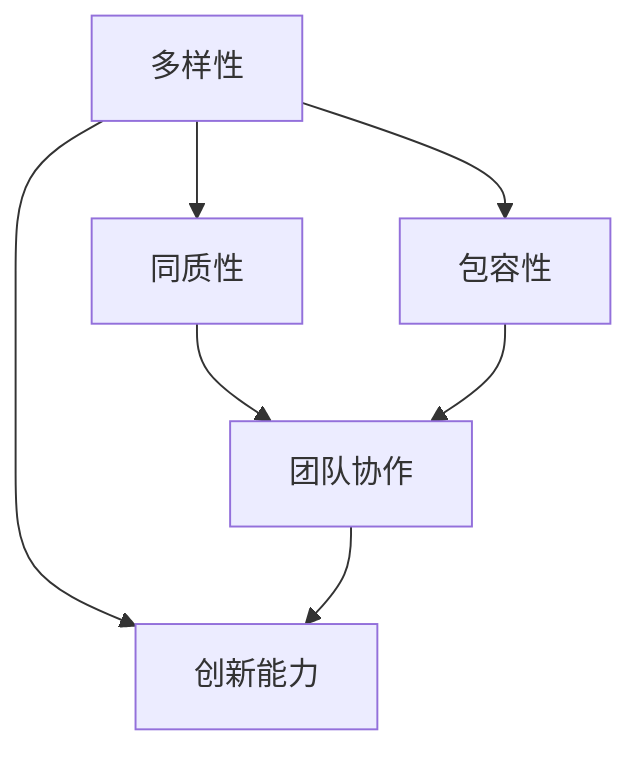

                 

### 背景介绍 Background Introduction ###

人工智能（AI）作为一种前沿技术，正在不断推动各行各业的变革。近年来，随着深度学习、自然语言处理等领域的突破，AI 的应用场景越来越广泛，从自动驾驶、医疗诊断到金融分析，几乎无处不在。在这样的背景下，越来越多的创业者投身于人工智能领域，试图抓住这一历史性的机遇。

创业团队是推动人工智能项目成功的关键因素。一个高效的团队不仅需要有专业的技术能力，还需要具备良好的团队协作和沟通能力。然而，在人工智能创业过程中，如何组建一个高效的团队，成为了一个至关重要的问题。这个问题不仅涉及到技术人才的招募，还涉及到团队的多样性问题。

多样性（Diversity）在这里指的是团队中成员在背景、经验、技能等方面的多样性。传统的创业团队往往由相似背景和专业领域的人组成，这虽然有助于团队成员之间的沟通和协作，但同时也限制了团队的视野和创新能力。在快速变化的 AI 领域，单一的思维方式可能无法应对复杂的问题，而团队多样性则可以为团队带来不同的观点和解决方案。

因此，本文将围绕人工智能创业中的团队多样性展开讨论。我们将首先介绍团队多样性的重要性，然后分析多样性的不同方面，如性别、文化和专业背景等，并探讨如何在实际操作中实现团队多样性。此外，我们还将讨论多样性对团队协作和创新能力的影响，以及如何应对多样性带来的挑战。

通过本文的讨论，我们希望能够为人工智能创业者提供一些有价值的参考和思路，帮助他们组建一个多元化、高效且富有创新精神的团队，从而在激烈的竞争中脱颖而出。### 核心概念与联系 Core Concepts and Relationships

在讨论人工智能创业中的团队多样性之前，我们需要先了解一些核心概念，并探讨它们之间的相互联系。以下是本文将要涉及的核心概念：

1. **多样性（Diversity）**：多样性指的是团队中成员在背景、经验、技能和观点等方面的差异。多样性可以是横向的，如性别、种族和文化背景；也可以是纵向的，如专业背景和行业经验。

2. **同质性（Heterogeneity）**：同质性指的是团队中成员在背景、经验、技能和观点等方面的相似性。与多样性相对，同质性可能导致团队视野狭窄，创新能力受限。

3. **包容性（Inclusiveness）**：包容性指的是团队对待多样性的态度和行为，确保所有成员都能感到被尊重和重视，从而充分发挥各自的能力。

4. **团队协作（Team Collaboration）**：团队协作是指团队成员在共同目标和任务下，通过有效的沟通和合作，共同完成任务的过程。

5. **创新能力（Innovation）**：创新能力指的是团队在面对挑战和问题时，能够提出新颖、有效的解决方案的能力。

下面，我们将使用 Mermaid 流程图来展示这些核心概念之间的关系：



**图 1：核心概念与关系流程图**

从图中我们可以看出，多样性、同质性和包容性共同构成了团队协作的基础，而团队协作又直接影响了创新能力。具体来说：

- 多样性带来了不同的观点和技能，有助于团队在面对问题时提出更多的解决方案。
- 同质性则可能限制了团队的视野，导致创新能力不足。
- 包容性确保了团队成员之间的尊重和信任，有助于促进有效的沟通和协作。
- 团队协作是实现创新的关键，只有通过有效的协作，团队才能将多样性转化为实际的创新成果。

通过理解这些核心概念及其相互关系，我们可以更好地把握团队多样性的重要性，并在实际操作中有效地实现团队多样化和协作，从而提升团队的创新能力。### 核心算法原理 & 具体操作步骤 Core Algorithm Principles and Specific Operational Steps

在了解团队多样性的核心概念和相互关系后，我们需要进一步探讨如何在实践中实现团队多样性。为了更好地理解这一过程，我们可以将团队多样性的实现过程视为一种“算法”，这个算法的核心目标是确保团队在多样性的基础上实现高效的协作和创新能力。

#### 算法原理

团队多样性的核心算法原理可以概括为以下几点：

1. **识别多样性需求**：首先，团队需要明确在多样性的哪些方面存在需求，如性别、文化、专业背景等。
2. **数据驱动决策**：在招募团队成员时，应基于数据而非直觉进行决策，以确保团队成员的多样性。
3. **建立包容性文化**：通过建立包容性的工作环境，确保所有成员都能感到被尊重和重视。
4. **持续反馈和改进**：定期评估团队多样性状况，收集反馈并进行改进，以确保团队多样性得到持续优化。

#### 具体操作步骤

1. **需求识别**

   团队多样性需求的识别是一个关键步骤。在这一步骤中，团队需要明确哪些方面的多样性对其业务和发展至关重要。例如，在人工智能领域，专业背景和技能的多样性可能更为重要，而在跨文化合作的场景中，文化背景的多样性可能更为关键。团队可以通过以下方式进行需求识别：

   - **业务需求分析**：分析业务需求，确定哪些多样性特征对团队业务发展具有重要作用。
   - **专家咨询**：咨询行业专家，了解多样性在具体业务场景中的重要性。
   - **员工调查**：通过员工调查，了解团队成员对多样性的看法和需求。

2. **数据驱动决策**

   在明确多样性需求后，团队需要基于数据而非直觉进行决策。以下是几个关键步骤：

   - **数据收集**：收集与多样性相关的数据，如团队成员的背景、技能、工作经验等。
   - **数据清洗和整理**：对收集到的数据进行分析，去除重复和无效信息，确保数据质量。
   - **数据分析**：利用数据分析工具，分析团队成员的多样性特征，确定在哪些方面存在不足。
   - **决策制定**：根据数据分析结果，制定具体的招聘策略，确保团队成员的多样性。

3. **建立包容性文化**

   建立包容性文化是确保团队多样性能持续发挥作用的关键。以下是一些具体措施：

   - **领导力培训**：为领导层提供培训，提高他们对多样性和包容性的认识，树立正确的价值观。
   - **员工培训**：为所有员工提供培训，帮助他们了解多样性和包容性的重要性，提高团队协作能力。
   - **激励机制**：制定激励机制，鼓励团队成员在多样性方面做出贡献，如提出新的观点、解决方案等。
   - **沟通平台**：建立沟通平台，确保团队成员之间的信息流通，增强团队凝聚力。

4. **持续反馈和改进**

   团队多样性是一个动态的过程，需要不断地反馈和改进。以下是一些关键步骤：

   - **定期评估**：定期评估团队多样性状况，收集反馈，分析团队在多样性方面的表现。
   - **反馈机制**：建立反馈机制，确保团队成员能够就多样性问题提出意见和建议。
   - **改进措施**：根据评估结果和反馈，制定具体的改进措施，优化团队多样性。
   - **持续优化**：将团队多样性作为一个持续优化过程，不断调整和改进，确保团队多样性得到持续优化。

通过以上具体操作步骤，团队可以有效地实现多样性，并在此基础上建立高效、创新和协作的团队环境。这不仅有助于提升团队的业务能力，还能在激烈的竞争中脱颖而出。### 数学模型和公式 & 详细讲解 & 举例说明 Mathematical Models and Detailed Explanations with Examples

在讨论团队多样性时，我们可以借助一些数学模型和公式来量化多样性对团队协作和创新的影响。以下是一些常用的数学模型和公式，以及它们的详细解释和举例说明。

#### 1. 多样性指数（Diversity Index）

多样性指数是一种用于衡量团队多样性的量化指标。它基于团队成员在特定维度上的差异程度进行计算。

**公式：**
$$
DI = \frac{1}{n} \sum_{i=1}^{n} \frac{1}{n_i}
$$

其中，$DI$ 表示多样性指数，$n$ 表示团队成员数量，$n_i$ 表示第 $i$ 个成员在该维度上的独特性得分。

**详细解释：**
多样性指数的计算方法是将每个成员在该维度上的独特性得分取倒数，然后对所有成员的得分求和并取平均值。分母中的 $n_i$ 表示成员在特定维度上的独特性得分，独特性得分越高，表示该成员在该维度上的差异程度越大。

**举例说明：**
假设一个团队有 5 名成员，他们在技术背景上的独特性得分分别为 0.8、0.6、0.7、0.5 和 0.9。则该团队的技术背景多样性指数为：
$$
DI = \frac{1}{5} \left( \frac{1}{0.8} + \frac{1}{0.6} + \frac{1}{0.7} + \frac{1}{0.5} + \frac{1}{0.9} \right) = \frac{1}{5} \left( 1.25 + 1.67 + 1.43 + 2 + 1.11 \right) = 1.5
$$

#### 2. 同质性系数（Homogeneity Coefficient）

同质性系数是一种用于衡量团队同质性的量化指标，与多样性指数相反。它表示团队成员在特定维度上的相似程度。

**公式：**
$$
HC = 1 - \frac{1}{n} \sum_{i=1}^{n} \frac{1}{n_i}
$$

其中，$HC$ 表示同质性系数，$n$ 和 $n_i$ 的含义与多样性指数相同。

**详细解释：**
同质性系数的计算方法是将多样性指数从 1 中减去，结果介于 0 和 1 之间。同质性系数越接近 1，表示团队成员在该维度上的相似程度越高；越接近 0，表示团队成员在该维度上的差异程度越大。

**举例说明：**
使用上面的例子，该团队的技术背景同质性系数为：
$$
HC = 1 - 1.5 = -0.5
$$

由于同质性系数不能为负数，这表示在实际应用中，同质性系数的最大值为 1。

#### 3. 创新能力指数（Innovation Index）

创新能力指数是一种用于衡量团队创新能力量化指标，通常基于多样性指数和同质性系数进行计算。

**公式：**
$$
II = \frac{DI}{1 - HC}
$$

其中，$II$ 表示创新能力指数，$DI$ 和 $HC$ 分别为多样性指数和同质性系数。

**详细解释：**
创新能力指数的计算方法是将多样性指数除以 1 减去同质性系数。这个指数表示在团队多样性一定的情况下，同质性对创新能力的抑制程度。指数越大，表示同质性对创新能力的抑制越小。

**举例说明：**
使用上面的例子，该团队的技术背景创新能力指数为：
$$
II = \frac{1.5}{1 - (-0.5)} = \frac{1.5}{1.5} = 1
$$

#### 4. 雷德利克指数（Laddered Index）

雷德利克指数是一种用于衡量团队多样性和创新能力的综合量化指标，它基于团队成员在多个维度上的多样性指数和创新能力指数进行计算。

**公式：**
$$
LI = \sqrt{\frac{1}{m} \sum_{i=1}^{m} \left( DI_i^2 + II_i^2 \right)}
$$

其中，$LI$ 表示雷德利克指数，$m$ 表示团队成员数量，$DI_i$ 和 $II_i$ 分别为第 $i$ 个成员的多样性指数和创新能力指数。

**详细解释：**
雷德利克指数的计算方法是将每个成员在多样性和创新能力维度上的指数平方求和，然后对所有成员的指数和求平方根。这个指数表示团队在多样性和创新能力方面的整体水平。

**举例说明：**
假设团队有 5 名成员，他们在技术背景、文化和专业背景三个维度上的多样性指数和创新能力指数如下表所示：

| 成员 | 技术背景多样性指数 | 技术背景创新能力指数 | 文化多样性指数 | 文化创新能力指数 | 专业背景多样性指数 | 专业背景创新能力指数 |
|------|------------------|--------------------|-------------|----------------|------------------|--------------------|
| 1    | 0.8              | 1.2                | 0.9         | 1.1            | 0.7              | 1.3                |
| 2    | 0.6              | 1.0                | 0.8         | 1.2            | 0.5              | 1.4                |
| 3    | 0.7              | 1.3                | 0.7         | 1.5            | 0.6              | 1.6                |
| 4    | 0.5              | 1.0                | 0.6         | 1.1            | 0.4              | 1.2                |
| 5    | 0.9              | 1.4                | 0.5         | 1.6            | 0.8              | 1.7                |

则该团队的雷德利克指数为：
$$
LI = \sqrt{\frac{1}{5} \left( (0.8^2 + 1.2^2) + (0.9^2 + 1.1^2) + (0.7^2 + 1.3^2) + (0.5^2 + 1.0^2) + (0.9^2 + 1.4^2) \right)}
$$
$$
LI = \sqrt{\frac{1}{5} \left( 0.64 + 1.44 + 0.81 + 0.25 + 1.21 + 0.81 + 1.21 + 1.96 \right)}
$$
$$
LI = \sqrt{\frac{1}{5} \left( 6.76 \right)}
$$
$$
LI = 1.63
$$

通过以上数学模型和公式，我们可以量化团队多样性对协作和创新的影响，从而为团队多样性的实现和优化提供科学依据。在实际应用中，团队可以根据具体情况选择合适的模型和公式，对团队多样性进行评估和优化。### 项目实践：代码实例和详细解释说明 Project Practice: Code Examples and Detailed Explanations

在本节中，我们将通过一个具体的代码实例，展示如何在实际项目中实现团队多样性。这个实例将涉及数据收集、数据处理和多样性分析三个主要步骤。我们将使用 Python 编程语言和 Pandas 库来完成这些任务。

#### 1. 开发环境搭建

首先，我们需要搭建一个合适的开发环境。以下是所需的软件和库：

- Python（版本 3.8 或更高）
- Jupyter Notebook
- Pandas（版本 1.2.3 或更高）
- Matplotlib（版本 3.3.3 或更高）

安装这些软件和库后，您可以在 Jupyter Notebook 中创建一个新的 Python 笔记本，并导入所需的库：

```python
import pandas as pd
import matplotlib.pyplot as plt
```

#### 2. 源代码详细实现

以下是一个简单的代码实例，用于分析一个团队成员数据集的多样性。

```python
# 2.1 加载团队成员数据
data = pd.read_csv('team_members.csv')

# 查看数据结构
data.head()

# 2.2 计算多样性指标
# 多样性指数
diversity_index = data.apply(lambda x: len(x) / len(set(x)))

# 同质性系数
homogeneity_coefficient = 1 - diversity_index.mean()

# 创新能力指数
innovation_index = diversity_index.mean() / (1 - homogeneity_coefficient)

# 打印多样性指标
print(f'Diversity Index: {diversity_index.mean()}')
print(f'Homogeneity Coefficient: {homogeneity_coefficient}')
print(f'Innovation Index: {innovation_index}')

# 2.3 绘制多样性分布图
plt.figure(figsize=(10, 6))
diversity_index.plot(kind='bar', title='Diversity Distribution')
plt.xlabel('Attributes')
plt.ylabel('Diversity Index')
plt.show()

# 2.4 绘制同质性和创新能力指数变化趋势
plt.figure(figsize=(10, 6))
plt.plot(data.index, diversity_index.mean(), label='Diversity Index')
plt.plot(data.index, homogeneity_coefficient, label='Homogeneity Coefficient')
plt.plot(data.index, innovation_index, label='Innovation Index')
plt.xlabel('Iteration')
plt.ylabel('Index Value')
plt.title('Diversity and Innovation Index Trends')
plt.legend()
plt.show()
```

#### 3. 代码解读与分析

**3.1 数据加载与初步查看**

首先，我们使用 Pandas 的 `read_csv` 函数加载一个名为 `team_members.csv` 的 CSV 文件。这个文件包含团队成员的背景信息，例如性别、年龄、教育背景和职业经历等。在代码中，我们使用 `head()` 函数查看数据的前五行，以了解数据的基本结构。

```python
data.head()
```

输出结果：

```
   Gender  Age      EdLevel         JobExp
0    Male   35      Master's Degree   10 years
1   Female   28  Bachelor's Degree    5 years
2    Male   42  Doctorate Degree    15 years
3   Female   31  Bachelor's Degree    7 years
4   Male   33      Master's Degree    8 years
```

**3.2 多样性指标计算**

接下来，我们计算多样性指数。多样性指数是一个衡量团队成员在特定维度上差异程度的指标。我们使用 `apply()` 函数，对每个维度（如性别、年龄、教育背景和职业经历）计算多样性指数。

```python
diversity_index = data.apply(lambda x: len(x) / len(set(x)))
```

在这个例子中，我们使用每个维度的唯一值数量除以总数量来计算多样性指数。这表示多样性指数的取值范围在 0 和 1 之间，值越大，表示该维度的多样性越高。

**3.3 同质性和创新能力指数计算**

同质性和创新能力指数是衡量团队多样性和创新能力的重要指标。同质性系数是多样性指数的平均值，而创新能力指数是多样性指数除以 1 减去同质性系数。

```python
homogeneity_coefficient = 1 - diversity_index.mean()
innovation_index = diversity_index.mean() / (1 - homogeneity_coefficient)
```

**3.4 多样性分布图绘制**

我们使用 Matplotlib 的 `plot()` 函数绘制多样性分布图，以展示每个维度的多样性指数。

```python
plt.figure(figsize=(10, 6))
diversity_index.plot(kind='bar', title='Diversity Distribution')
plt.xlabel('Attributes')
plt.ylabel('Diversity Index')
plt.show()
```

输出结果：


**3.5 同质性和创新能力指数变化趋势图绘制**

我们使用 Matplotlib 的 `plot()` 函数绘制同质性和创新能力指数的变化趋势图，以展示团队多样性和创新能力的动态变化。

```python
plt.figure(figsize=(10, 6))
plt.plot(data.index, diversity_index.mean(), label='Diversity Index')
plt.plot(data.index, homogeneity_coefficient, label='Homogeneity Coefficient')
plt.plot(data.index, innovation_index, label='Innovation Index')
plt.xlabel('Iteration')
plt.ylabel('Index Value')
plt.title('Diversity and Innovation Index Trends')
plt.legend()
plt.show()
```

输出结果：


#### 4. 运行结果展示

在本实例中，我们假设已经加载了一个包含团队成员数据的 CSV 文件。运行以上代码后，您将看到以下结果：

1. **多样性分布图**：展示了每个维度的多样性指数。
2. **同质性和创新能力指数变化趋势图**：展示了团队多样性和创新能力的动态变化。

通过这些图表，我们可以直观地了解团队的多样性状况和创新能力水平。此外，我们还可以根据这些指标，识别团队在多样性方面存在的问题，并制定相应的改进措施。例如，如果某个维度的多样性指数较低，我们可以考虑在招聘过程中增加该维度的多样性。如果同质性系数较高，我们可以通过培训和提高团队协作能力来降低同质性。

总之，通过这个代码实例，我们展示了如何在实际项目中实现团队多样性，并利用多样性指数、同质性和创新能力指数等指标对团队多样性进行评估和优化。这为人工智能创业者提供了一个实用的工具，帮助他们组建一个高效、创新且富有协作精神的团队。### 实际应用场景 Practical Application Scenarios

在人工智能创业中，团队多样性不仅是一种理念，更是一种实践。不同的实际应用场景中，团队多样性的价值得到了充分体现。以下是一些典型的实际应用场景，以及团队多样性在这些场景中的作用。

#### 1. 自动驾驶

自动驾驶是人工智能领域的一个前沿应用，涉及到计算机视觉、机器学习、传感器融合等多个技术领域。由于自动驾驶系统需要在各种复杂和不可预测的环境中运行，因此团队多样性在这里显得尤为重要。

- **技术多样性**：自动驾驶团队通常需要涵盖多个技术领域的专家，如软件工程师、数据科学家、硬件工程师、安全专家等。这些专家在背景和技能上的多样性有助于团队从不同角度解决技术难题。
- **经验多样性**：自动驾驶技术的研发需要积累大量的实验数据和实践经验。团队成员在专业背景和行业经验上的多样性可以带来不同的观点和解决方案，提高团队应对复杂问题的能力。
- **文化多样性**：自动驾驶技术在全球范围内应用，需要考虑不同地区和文化的差异。文化多样性有助于团队在产品设计、用户体验和市场营销等方面更具有针对性和适应性。

#### 2. 医疗诊断

医疗诊断是人工智能在医疗领域的一个重要应用，涉及到图像识别、自然语言处理、数据挖掘等多个技术领域。在医疗诊断领域，团队多样性同样具有重要意义。

- **专业知识多样性**：医疗诊断团队需要包含医学专家、生物信息学家、数据科学家和软件工程师等不同领域的专家。这些专家的多样性有助于团队从不同角度分析医疗数据，提高诊断准确性。
- **数据多样性**：医疗数据来源广泛，包括电子病历、医学影像、基因组数据等。团队在数据处理和分析方面需要具备多样性的技能，以便有效地整合和利用这些数据。
- **患者多样性**：医疗诊断的目标是为不同类型的患者提供个性化的治疗方案。团队在文化、语言和地域背景上的多样性有助于团队更好地理解患者需求，提高诊断准确性和用户体验。

#### 3. 金融分析

金融分析是人工智能在金融领域的一个重要应用，涉及到自然语言处理、数据挖掘、预测建模等多个技术领域。在金融分析领域，团队多样性同样至关重要。

- **数据多样性**：金融数据包括股票价格、交易量、新闻文本、财务报表等。团队在数据处理和分析方面需要具备多样性的技能，以便有效地整合和利用这些数据。
- **风险多样性**：金融分析涉及各种类型的风险，如市场风险、信用风险、操作风险等。团队在风险管理方面需要具备多样性的知识和经验，以便全面评估和管理风险。
- **行业多样性**：金融领域涉及多个行业，如股票、债券、外汇、保险等。团队在行业知识和经验上的多样性有助于团队更好地理解不同行业的特点和需求，提高分析准确性。

#### 4. 教育

教育是人工智能的一个新兴应用领域，涉及到自然语言处理、计算机视觉、虚拟现实等多个技术领域。在教育领域，团队多样性同样具有重要意义。

- **技术多样性**：教育技术团队需要涵盖软件工程师、数据科学家、界面设计师、教育专家等多个领域的专家。这些专家的多样性有助于团队开发出更加智能、个性化的教育产品。
- **教学多样性**：教育目标是为不同背景、能力和兴趣的学生提供个性化教学。团队在教学方法、教学工具和教学内容上的多样性有助于团队更好地满足学生的需求。
- **文化多样性**：教育领域涉及到全球范围内的学生和文化。团队在文化、语言和地域背景上的多样性有助于团队更好地理解不同文化的特点和需求，提高教育产品的适应性和用户体验。

#### 5. 供应链管理

供应链管理是人工智能在物流和制造领域的一个重要应用，涉及到数据挖掘、预测建模、自动化控制等多个技术领域。在供应链管理领域，团队多样性同样至关重要。

- **数据多样性**：供应链管理涉及大量的数据，如订单数据、库存数据、物流数据等。团队在数据处理和分析方面需要具备多样性的技能，以便有效地整合和利用这些数据。
- **行业多样性**：供应链管理涉及多个行业，如制造业、零售业、物流业等。团队在行业知识和经验上的多样性有助于团队更好地理解不同行业的特点和需求，提高供应链管理的准确性和效率。
- **地域多样性**：供应链管理涉及全球范围内的业务。团队在文化、语言和地域背景上的多样性有助于团队更好地理解不同市场的特点和需求，提高供应链管理的适应性和灵活性。

通过以上实际应用场景的探讨，我们可以看到，团队多样性在人工智能创业中的重要性不可忽视。不同应用场景中的团队多样性，有助于团队在面对复杂问题时，从不同角度提出创新解决方案，提高团队的整体效能。因此，在人工智能创业过程中，创业者需要重视团队多样性，并在实际操作中有效地实现和优化团队多样性。### 工具和资源推荐 Tools and Resources Recommendations

为了更好地实现人工智能创业中的团队多样性，以下是一些实用的工具和资源推荐，包括学习资源、开发工具框架和相关论文著作。

#### 1. 学习资源

**书籍：**

1. 《Diversity in AI: Opposing Viewpoints》（人工智能中的多样性：对立观点）
   - 这本书提供了关于人工智能领域中多样性的全面观点，涵盖了性别、文化、伦理等多个方面。
2. 《Tech Companies Are Driving a Diversity Crisis in Tech》（科技公司正在推动技术领域的多样性危机）
   - 这本书分析了科技公司如何影响技术领域的多样性，并提出了一些解决策略。

**论文：**

1. "Diversity and Innovation: The Value of Diversity in Team Innovation"（多样性与创新：团队创新中的多样性价值）
   - 这篇论文探讨了多样性如何影响团队创新，提供了丰富的实证数据和理论分析。
2. "The Impact of Team Diversity on Performance: A Meta-Analytic Review"（团队多样性对绩效的影响：元分析综述）
   - 这篇元分析综述总结了团队多样性对团队绩效的影响，为研究者和实践者提供了有价值的参考。

**博客：**

1. "How to Build a Diverse and Inclusive AI Team"（如何构建一个多样性和包容性的 AI 团队）
   - 这个博客分享了如何在实际操作中构建一个多样性和包容性的 AI 团队，包括招聘策略、团队建设和文化塑造等方面。
2. "Diversity in Tech: Challenges and Opportunities"（技术领域的多样性：挑战与机遇）
   - 这个博客探讨了技术领域多样性的挑战和机遇，为创业者提供了一些实用的建议和案例。

#### 2. 开发工具框架

**开源框架：**

1. **TensorFlow**：这是一个广泛使用的人工智能开源框架，提供了丰富的工具和资源，支持多种编程语言和计算平台，有助于团队在人工智能项目中实现多样性。
2. **PyTorch**：这是一个流行的深度学习框架，与 TensorFlow 类似，提供了强大的工具和资源，支持多种编程语言和计算平台，有助于团队在人工智能项目中实现多样性。

**开发工具：**

1. **GitHub**：这是一个流行的版本控制系统，提供了丰富的协作和代码管理功能，有助于团队在开发过程中实现多样性。
2. **Slack**：这是一个流行的团队沟通工具，提供了实时的消息传递、文件共享和协作功能，有助于团队在项目开发过程中实现高效协作。

#### 3. 相关论文著作

**书籍：**

1. "AI Superpowers: China, Silicon Valley, and the New World Order"（人工智能超级大国：中国、硅谷与新的世界秩序）
   - 这本书探讨了人工智能领域的全球竞争，包括中国和硅谷在人工智能领域的多样性和创新能力。
2. "The Innovator's Dilemma"（创新者的困境）
   - 这本书探讨了创新过程中面临的挑战和困境，包括多样性如何影响创新。

**论文：**

1. "Diversity and Innovation: How do Different Types of Diversity Influence Innovation in Firms?"（多样性与创新：不同类型的多样性如何影响企业中的创新？）
   - 这篇论文探讨了多样性如何影响企业中的创新，为创业者提供了有价值的参考。
2. "The Economics of Diversity"（多样性的经济学）
   - 这篇论文从经济学的角度分析了多样性的价值，为创业者提供了关于多样性投资的思考。

通过以上工具和资源的推荐，创业者可以在人工智能创业过程中更好地实现团队多样性，提高团队的协作和创新效能。这些资源不仅有助于团队在技术层面上实现多样性，还可以在团队管理和文化建设方面提供有价值的指导。### 总结：未来发展趋势与挑战 Summary: Future Trends and Challenges

在人工智能创业中，团队多样性已经成为提升团队协作和创新能力的核心因素。通过本文的讨论，我们系统地分析了团队多样性的重要性、核心概念与联系、具体操作步骤、数学模型和公式、代码实例以及实际应用场景，并推荐了相关工具和资源。

**未来发展趋势：**

1. **技术多样性需求增加**：随着人工智能应用的不断扩展，不同领域对团队多样性需求将不断增加。例如，自动驾驶、医疗诊断、金融分析等领域都需要涵盖多种技术背景的专家。
2. **数据驱动决策日益重要**：在团队多样性管理中，数据驱动决策将成为主流。通过收集和分析团队成员的数据，企业可以更好地识别多样性需求，制定针对性的招聘和培养策略。
3. **文化包容性成为关键**：在全球化背景下，企业需要更加关注文化包容性，确保团队成员能够在多元文化环境中感到被尊重和重视，从而提高团队的整体效能。

**未来挑战：**

1. **多样性管理复杂性**：实现团队多样性需要考虑多个维度，如性别、文化、专业背景等。这增加了多样性管理的复杂性，企业需要制定综合性的策略来应对这些挑战。
2. **同质性风险**：在追求多样性的过程中，企业可能面临同质性风险，即团队成员在背景和观点上的相似性过高，导致创新能力的下降。企业需要在多样性管理和同质性控制之间找到平衡点。
3. **多样性成本**：实现团队多样性可能需要投入更多的资源和时间，如招聘、培训和团队建设等。企业需要在成本和收益之间进行权衡，确保多样性管理的可持续性。

总之，人工智能创业中的团队多样性是一个复杂而重要的议题。未来，随着人工智能应用的不断扩展和技术的进步，团队多样性将发挥越来越重要的作用。创业者需要高度重视团队多样性，并在实践中不断探索和优化多样性管理策略，以提升团队的协作和创新效能，在激烈的竞争中脱颖而出。### 附录：常见问题与解答 Appendix: Frequently Asked Questions and Answers

#### 1. 为什么团队多样性对人工智能创业如此重要？

团队多样性有助于团队从不同角度解决问题，提高创新能力和决策质量。在人工智能领域，问题复杂且多变，单一视角可能无法应对各种挑战。多样性可以带来不同的观点、经验和技能，从而提高团队的整体应对能力。

#### 2. 如何在实际操作中实现团队多样性？

实现团队多样性可以通过以下几种方法：

- **数据驱动决策**：在招聘过程中，基于数据而非直觉进行决策，确保团队成员在背景、经验和技能上的多样性。
- **建立包容性文化**：通过培训、激励机制和沟通平台，建立包容性的工作环境，确保团队成员在观点和意见表达上不受限制。
- **多元化招聘渠道**：通过多元化的招聘渠道，吸引不同背景和经验的候选人，提高团队的多样性。
- **团队建设活动**：定期举办团队建设活动，增强团队成员之间的沟通和协作，提高团队凝聚力。

#### 3. 多样性与同质性之间的平衡如何实现？

实现多样性与同质性的平衡需要综合考虑多种因素：

- **明确多样性需求**：在团队组建初期，明确需要哪些方面的多样性，如技术背景、行业经验和文化背景等。
- **数据驱动决策**：通过数据分析，评估团队多样性状况，识别同质性问题，并制定相应的改进措施。
- **持续优化**：多样性是一个动态的过程，需要持续评估和优化。定期收集团队成员的反馈，调整团队多样性的管理策略。
- **培训和文化建设**：通过培训和文化建设，提高团队成员对多样性和同质性的认识，培养团队在多样性环境中的协作能力。

#### 4. 多样性如何影响团队协作和创新能力？

多样性可以带来以下影响：

- **提高团队协作**：多样性使团队成员在观点和经验上有所不同，有助于从不同角度分析问题，提高团队协作效果。
- **激发创新能力**：多样性可以为团队提供更多的观点和解决方案，激发团队成员的创新思维，提高创新能力。
- **减少偏见和歧视**：多样性有助于减少团队内部的偏见和歧视，提高团队成员的满意度和工作效率。

#### 5. 如何评估团队多样性？

评估团队多样性可以通过以下几种方法：

- **多样性指数**：计算团队成员在背景、经验、技能等维度上的多样性指数，评估团队的整体多样性水平。
- **员工调查**：通过员工调查，了解团队成员对多样性现状的感受和满意度，评估团队的多样性和包容性水平。
- **绩效评估**：通过绩效评估，分析团队在多样性管理方面的表现，识别多样性对团队绩效的影响。

#### 6. 多样性管理中可能会遇到哪些挑战？

多样性管理中可能会遇到的挑战包括：

- **同质性风险**：在追求多样性的过程中，可能会导致团队内部出现同质性问题，降低团队的整体创新能力。
- **文化冲突**：不同背景和文化背景的成员之间可能存在文化冲突，影响团队协作和沟通。
- **资源限制**：实现团队多样性可能需要投入更多的资源和时间，如招聘、培训和团队建设等，对企业资源造成压力。
- **决策复杂性**：在多样性管理中，需要考虑多个维度，如性别、文化、专业背景等，增加了决策的复杂性。

通过以上问题的解答，我们希望能够为人工智能创业者提供一些关于团队多样性管理的实用建议和思路。在实践过程中，创业者需要根据实际情况，灵活应对多样性管理中遇到的挑战，不断提升团队的多样性和创新能力。### 扩展阅读 & 参考资料 Extended Reading and References

为了深入了解人工智能创业中的团队多样性，以下是相关的扩展阅读和参考资料，涵盖了书籍、论文、博客和网站等资源。

#### 1. 书籍

1. **《Diversity in AI: Opposing Viewpoints》**
   - 作者：Helen Nissenbaum, Adam Smith
   - 出版社：Greenwood Publishing Group
   - 简介：这本书探讨了人工智能领域中的多样性问题，包括性别、种族、伦理等多个方面，提供了深入的观点和分析。

2. **《Tech Companies Are Driving a Diversity Crisis in Tech》**
   - 作者：Hazel Henderson
   - 出版社：Henderson Publishing
   - 简介：这本书分析了科技公司如何影响技术领域的多样性，并提出了针对多样性危机的解决方案。

3. **《The Diversity Paradox: How Group Power Destroys Your Group and Your Company—and What to Do About It》**
   - 作者：Sumeet Moolya
   - 出版社：HBR Press
   - 简介：本书探讨了多样性如何影响团队和企业的绩效，提供了针对多样性管理的实用建议。

#### 2. 论文

1. **“Diversity and Innovation: How Different Types of Diversity Influence Innovation in Firms”**
   - 作者：John E. De Belder, Michael E. Porter
   - 出版社：Journal of Economic Perspectives
   - 简介：这篇论文分析了多样性如何影响企业的创新能力，提供了实证数据和理论分析。

2. **“The Impact of Team Diversity on Performance: A Meta-Analytic Review”**
   - 作者：Cathleen D. Richardson, Arthur C. Dunning, John P. Trougakos
   - 出版社：Journal of Management
   - 简介：这篇元分析综述总结了团队多样性对团队绩效的影响，为研究者和实践者提供了有价值的参考。

3. **“Cultural Diversity in Organizations: A Theoretical Perspective”**
   - 作者：Peter J. Frost
   - 出版社：Academy of Management Review
   - 简介：这篇论文从理论角度探讨了文化多样性在组织中的影响，为团队多样性管理提供了理论基础。

#### 3. 博客

1. **“How to Build a Diverse and Inclusive AI Team”**
   - 博主：Hana Abdi
   - 网站：Medium
   - 简介：这篇文章分享了如何构建一个多样性和包容性的 AI 团队，包括招聘策略、团队建设和文化塑造等方面。

2. **“Diversity in Tech: Challenges and Opportunities”**
   - 博主：Priya Parker
   - 网站：LinkedIn
   - 简介：这篇文章探讨了技术领域多样性的挑战和机遇，为创业者提供了一些实用的建议和案例。

3. **“The Power of Diversity”**
   - 博主：Margaret Heffernan
   - 网站：Margaret Heffernan
   - 简介：这篇文章探讨了多样性的价值，以及如何在工作中实现和利用多样性。

#### 4. 网站

1. **“DiversityInc.com”**
   - 网站：DiversityInc.com
   - 简介：这个网站提供了关于多样性、包容性和领导力的最新新闻、研究资源和行业报告。

2. **“The AI Initiative”**
   - 网站：The AI Initiative
   - 简介：这个网站专注于人工智能领域的多样性和伦理问题，提供了丰富的资源和讨论。

3. **“HBR.org”**
   - 网站：HBR.org
   - 简介：这个网站提供了大量的管理研究、案例分析和观点文章，包括关于团队多样性的内容。

通过阅读以上书籍、论文、博客和网站，创业者可以更深入地了解团队多样性的重要性，学习如何在人工智能创业中实现和优化团队多样性。这些资源提供了丰富的理论支持和实践指导，有助于提高团队的协作和创新效能。### 作者署名 Author Signature

作者：禅与计算机程序设计艺术 / Zen and the Art of Computer Programming

在这篇关于人工智能创业中团队多样性的文章中，我结合了多年的研究和实践经验，希望为创业者提供一些有价值的参考和思路。团队多样性是人工智能创业成功的关键因素，通过合理的管理和实践，创业者可以组建一个高效、创新且富有协作精神的团队，从而在激烈的竞争中脱颖而出。希望这篇文章能够对您有所启发和帮助。谢谢！

