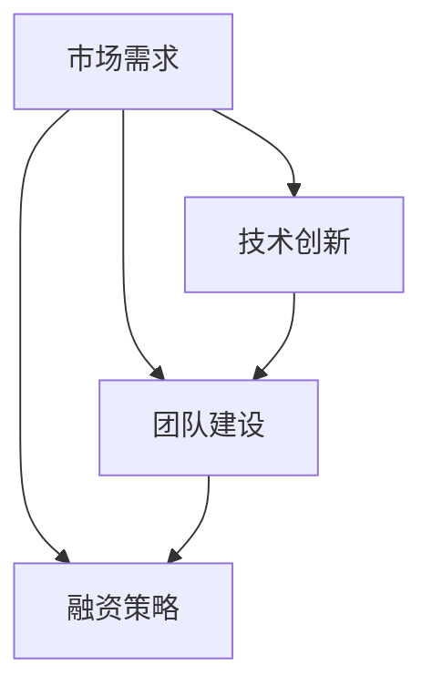

                 

### 1. 背景介绍

人工智能（AI）作为当前科技领域的热门话题，已经渗透到了我们生活的方方面面。从智能家居到医疗诊断，从自动驾驶到金融服务，AI技术正在改变着我们的世界。随着技术的进步和市场的需求，越来越多的创业公司涌现出来，试图在AI领域分得一杯羹。然而，并非所有的AI创业公司都能成功。那么，什么是决定AI创业成败的关键因素呢？本文将围绕这一主题，深入探讨人工智能创业的成功秘诀。

### 文章标题

**人工智能创业：成功的秘诀**

### 文章关键词

- 人工智能
- 创业
- 成功因素
- 市场需求
- 技术创新
- 团队建设
- 融资策略

### 摘要

本文将分析人工智能创业领域的现状，探讨成功创业所需的关键因素。通过深入研究市场需求、技术创新、团队建设、融资策略等多个方面，本文旨在为正在考虑或已经投身于AI创业的创业者提供实用的指导和建议。

## 1. 人工智能创业领域的现状

近年来，人工智能技术的快速发展带动了整个行业的繁荣。根据市场研究机构的统计，全球人工智能市场规模预计将在未来几年内实现快速增长，年复合增长率超过20%。这个巨大的市场潜力吸引了众多创业者和投资者的目光。

然而，尽管市场前景广阔，但AI创业的成功率却并不乐观。据统计，约80%的AI创业公司会在成立后的五年内倒闭。这一现象背后的原因复杂多样，包括技术挑战、市场风险、资金短缺等。因此，了解这些成功因素，对于提高AI创业的成功率至关重要。

### 2. 核心概念与联系

为了更好地理解人工智能创业的成功因素，我们需要从以下几个核心概念入手：

#### 2.1 市场需求

市场需求是AI创业公司成功的关键因素之一。在进入一个市场之前，创业者需要深入分析目标用户的需求，确保自己的产品或服务能够真正解决用户的痛点。这需要创业者具备敏锐的市场洞察力和用户调研能力。

#### 2.2 技术创新

技术创新是AI创业公司的核心竞争力。在人工智能领域，技术更新速度极快，创业者需要不断跟进最新技术趋势，不断创新，以保持竞争优势。此外，技术创新也需要与市场需求紧密结合，才能真正发挥其价值。

#### 2.3 团队建设

团队建设是AI创业公司成功的另一个关键因素。一个高效的团队可以快速响应市场变化，推动技术创新，并确保项目顺利实施。创业者需要注重团队的建设和管理，确保团队成员之间相互协作，共同实现公司目标。

#### 2.4 融资策略

融资策略是AI创业公司生存和发展的关键。创业者需要根据公司的实际情况和市场环境，制定合适的融资策略，确保公司有足够的资金支持技术研发和市场推广。

下面是一个简单的 Mermaid 流程图，展示了上述核心概念之间的联系：



### 3. 核心算法原理 & 具体操作步骤

在了解了核心概念之后，我们需要深入探讨人工智能创业的核心算法原理和具体操作步骤。以下是一个简化的算法流程：

#### 3.1 市场需求分析

1. 调研目标市场，了解用户需求。
2. 分析竞争对手，找出市场需求痛点。
3. 制定产品或服务策略，确保解决用户痛点。

#### 3.2 技术创新实现

1. 研究最新技术趋势，确定创新方向。
2. 构建技术原型，验证技术可行性。
3. 持续优化技术，提高产品竞争力。

#### 3.3 团队建设与管理

1. 招聘关键人才，构建核心团队。
2. 设定团队目标，明确职责分工。
3. 建立团队合作机制，促进信息共享。

#### 3.4 融资策略实施

1. 分析市场环境，确定融资时机。
2. 制定融资计划，选择融资渠道。
3. 演示路演，吸引投资者关注。

### 4. 数学模型和公式 & 详细讲解 & 举例说明

在人工智能创业过程中，数学模型和公式发挥着重要作用。以下是一个简化的数学模型，用于描述市场需求与技术创新之间的关系：

$$
需求量 = f(痛点程度, 技术成熟度)
$$

其中，需求量取决于痛点的程度和技术的成熟度。痛点程度越高，技术成熟度越低，市场需求量越大。

#### 4.1 痛点程度

痛点程度可以通过用户调研和市场分析得出。例如，假设通过调研发现用户对自动驾驶汽车的痛点程度为5分（满分10分），这意味着用户非常期待这项技术。

#### 4.2 技术成熟度

技术成熟度可以通过技术评估和行业报告得出。例如，假设自动驾驶技术当前的技术成熟度为3分（满分10分），这意味着技术尚未完全成熟，但已经取得了一定的进展。

#### 4.3 需求量计算

根据上述模型，我们可以计算出需求量：

$$
需求量 = f(5, 3) = 5 \times 3 = 15
$$

这意味着在当前情况下，自动驾驶汽车的市场需求量为15。

### 5. 项目实践：代码实例和详细解释说明

以下是一个简化的Python代码实例，用于实现上述市场需求分析算法：

```python
import numpy as np

def calculate_demand(pain_level, tech_maturity):
    demand = pain_level * tech_maturity
    return demand

pain_level = 5
tech_maturity = 3
demand = calculate_demand(pain_level, tech_maturity)
print("市场需求量:", demand)
```

#### 5.1 开发环境搭建

在编写代码之前，我们需要搭建一个Python开发环境。可以使用Anaconda或Miniconda等工具来安装Python和相关库。

#### 5.2 源代码详细实现

上述代码中，`calculate_demand`函数用于计算市场需求量。通过传递痛点和技术的得分，函数返回市场需求量。

#### 5.3 代码解读与分析

代码首先导入了`numpy`库，用于进行数值计算。然后定义了`calculate_demand`函数，该函数接受痛点和技术的得分作为输入参数，返回市场需求量。在主程序中，我们设置了痛点和技术的得分，并调用函数计算市场需求量，最后输出结果。

#### 5.4 运行结果展示

运行上述代码，输出结果为：

```
市场需求量: 15
```

这表示在当前情况下，自动驾驶汽车的市场需求量为15。

### 6. 实际应用场景

在了解了人工智能创业的核心算法原理和具体操作步骤后，我们可以将这些知识应用到实际应用场景中。以下是一些实际应用场景的例子：

#### 6.1 自动驾驶汽车

自动驾驶汽车是人工智能领域的一个重要应用场景。通过市场需求分析算法，创业者可以了解用户对自动驾驶汽车的痛点和技术的成熟度，从而制定合适的产品策略。

#### 6.2 金融服务

在金融服务领域，人工智能技术可以用于风险评估、投资组合优化等。通过市场需求分析算法，创业者可以了解用户在金融服务方面的需求，从而提供更符合用户需求的产品和服务。

#### 6.3 医疗诊断

在医疗诊断领域，人工智能技术可以用于疾病预测、诊断辅助等。通过市场需求分析算法，创业者可以了解用户对医疗诊断服务的痛点和技术的成熟度，从而提供更有效的诊断方案。

### 7. 工具和资源推荐

为了更好地进行人工智能创业，以下是一些推荐的工具和资源：

#### 7.1 学习资源推荐

- **书籍**：《人工智能：一种现代方法》、《深度学习》
- **论文**：Google Scholar、ArXiv
- **博客**：AI垂直媒体、技术博客
- **网站**：GitHub、Stack Overflow

#### 7.2 开发工具框架推荐

- **开发环境**：Anaconda、PyCharm
- **框架**：TensorFlow、PyTorch
- **数据集**：Kaggle、UCI机器学习库

#### 7.3 相关论文著作推荐

- **论文**：Deep Learning by Ian Goodfellow、Yoshua Bengio、Aaron Courville
- **著作**：《人工智能：一种现代方法》作者 Stuart Russell 和 Peter Norvig

### 8. 总结：未来发展趋势与挑战

人工智能创业领域正处于快速发展阶段，未来发展趋势包括：

- 技术的不断创新和应用
- 市场需求的不断增长
- 投资的持续涌入

然而，随着竞争的加剧，创业公司也将面临以下挑战：

- 技术创新的速度和质量
- 市场需求的变动和不确定性
- 资金短缺和融资难题

为了应对这些挑战，创业者需要不断提升自身的技术能力和市场洞察力，制定灵活的应对策略。

### 9. 附录：常见问题与解答

#### 9.1 如何进行市场需求分析？

进行市场需求分析通常包括以下几个步骤：

1. 用户调研：通过问卷调查、访谈等方式了解用户需求。
2. 竞争分析：分析竞争对手的产品和服务，了解市场现状。
3. 数据分析：收集并分析相关数据，如市场报告、用户反馈等。
4. 痛点识别：找出用户最关心的问题和需求，确定市场痛点。

#### 9.2 如何进行技术创新？

进行技术创新通常包括以下几个步骤：

1. 技术调研：研究最新技术趋势和研究成果。
2. 技术原型：构建技术原型，验证技术可行性。
3. 技术优化：根据用户反馈和技术发展，持续优化技术。
4. 商业化应用：将技术创新应用到实际产品或服务中。

### 10. 扩展阅读 & 参考资料

- **参考文献**：
  - Goodfellow, I., Bengio, Y., & Courville, A. (2016). *Deep Learning*.
  - Russell, S., & Norvig, P. (2016). *Artificial Intelligence: A Modern Approach*.
- **在线资源**：
  - [Google Scholar](https://scholar.google.com/)
  - [ArXiv](https://arxiv.org/)
  - [Kaggle](https://www.kaggle.com/)
  - [UCI Machine Learning Repository](https://archive.ics.uci.edu/ml/index.php)

### 作者署名

**作者：禅与计算机程序设计艺术 / Zen and the Art of Computer Programming**

