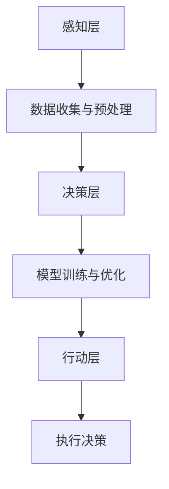

                 

### 1. 背景介绍

人工智能（AI）作为当代技术发展的核心驱动力，已经在诸多领域取得了显著的应用成果。从智能语音助手到自动驾驶汽车，从医疗诊断到金融风险评估，AI正以其强大的计算能力和学习能力，深刻改变着我们的生活方式和工作模式。随着技术的不断进步，越来越多的创业者投身于人工智能领域，希望能够借助AI的力量实现商业突破。

然而，选择合适的工具对于人工智能创业项目至关重要。这不仅关系到项目的研发效率，还直接影响着最终产品的质量和市场竞争力。面对市场上种类繁多的AI工具和框架，创业者往往感到无从下手。因此，本文旨在通过详细分析选择AI工具的方法，帮助创业者更好地定位自身需求，找到最合适的AI工具。

本文将从以下几个方面展开：

1. **背景介绍**：概述人工智能创业的现状和挑战。
2. **核心概念与联系**：介绍人工智能相关的基本概念、技术架构，并绘制流程图。
3. **核心算法原理 & 具体操作步骤**：解析常用的AI算法，并详细说明操作步骤。
4. **数学模型和公式 & 详细讲解 & 举例说明**：探讨AI背后的数学基础，并通过实例进行说明。
5. **项目实践：代码实例和详细解释说明**：提供具体的项目实践案例，展示代码实现和解读。
6. **实际应用场景**：分析AI工具在不同行业中的应用实例。
7. **工具和资源推荐**：推荐学习资源、开发工具框架和论文著作。
8. **总结：未来发展趋势与挑战**：展望AI技术的发展趋势和面临的挑战。
9. **附录：常见问题与解答**：解答读者可能遇到的问题。
10. **扩展阅读 & 参考资料**：提供进一步的阅读和参考资源。

通过上述结构，我们希望能够系统地帮助创业者理解并掌握选择合适AI工具的方法，从而为他们的创业之路提供坚实的支持。

### 2. 核心概念与联系

#### 2.1. 人工智能基本概念

人工智能（Artificial Intelligence，简称AI）是指通过计算机系统模拟人类智能行为的一门科学和技术。AI的核心目标是实现机器在感知、推理、学习、决策和解决问题等认知功能上与人类相似或超越人类。

- **感知**：机器通过传感器收集外部环境信息，如视觉、听觉、触觉等。
- **推理**：基于已有知识和数据，进行逻辑推断和决策。
- **学习**：通过数据训练和经验积累，提高系统的智能水平。
- **决策**：根据环境状态和目标，选择最佳行动方案。

#### 2.2. AI技术架构

人工智能技术架构通常分为三个层次：感知层、决策层和行动层。

- **感知层**：包括传感器数据收集和处理，例如计算机视觉、语音识别等。
- **决策层**：利用算法进行数据处理和分析，如机器学习、深度学习等。
- **行动层**：根据决策层的输出，采取相应的行动，例如机器人控制、自动驾驶等。

#### 2.3. AI工具分类

AI工具种类繁多，根据其功能和应用场景，可以分为以下几类：

- **框架与库**：如TensorFlow、PyTorch等，提供机器学习和深度学习的基础框架。
- **开发环境**：如Google Colab、Jupyter Notebook等，提供便捷的开发和运行环境。
- **数据处理工具**：如Pandas、NumPy等，用于数据清洗、预处理和分析。
- **可视化工具**：如Matplotlib、Seaborn等，用于数据可视化和模型分析。
- **自动化工具**：如AI流程自动化工具，用于自动化AI模型的训练和部署。

#### 2.4. Mermaid 流程图

以下是一个简化的Mermaid流程图，展示了AI技术架构的基本流程：



在这个流程图中，A代表感知层，负责收集和处理来自传感器或用户输入的数据；B代表数据预处理，将原始数据转换为适合模型训练的形式；C代表决策层，通过机器学习或深度学习算法进行数据分析和模型训练；D代表模型训练与优化，不断调整模型参数以提高预测准确性；E代表行动层，根据决策层的输出执行具体的操作；F代表执行决策，将行动结果反馈给用户或系统。

通过上述核心概念和流程图的介绍，我们为后续详细讲解AI工具的选择方法奠定了基础。接下来，我们将深入探讨AI算法原理、数学模型和具体操作步骤，帮助创业者更好地理解并选择合适的AI工具。

#### 2.5. 人工智能技术发展历程

人工智能的发展历程可以追溯到20世纪50年代。最初，AI领域主要聚焦于逻辑推理和符号计算，以图灵机理论为基础。这一阶段的代表性事件包括1956年达特茅斯会议的召开，标志着AI作为一个独立学科的诞生。

进入20世纪60年代，AI研究开始转向知识表示和问题求解。这一时期的代表性工作包括爱德华·费根鲍姆（Edward Feigenbaum）等人开发的专家系统（Expert Systems），这些系统能够模拟人类专家的知识和推理能力，应用于医疗诊断、金融分析等领域。

20世纪70年代，由于计算资源和算法的局限，AI研究进入了一个相对低潮期。然而，从20世纪80年代开始，AI研究重新焕发活力，特别是机器学习和统计方法在AI中的应用取得了显著进展。1986年，深度学习的先驱之一罗恩·艾伦（Ronald J. Williams）提出了反向传播算法（Backpropagation Algorithm），为深度学习的发展奠定了基础。

20世纪90年代至21世纪初，随着计算机硬件性能的提升和大数据时代的到来，机器学习和深度学习逐渐成为AI研究的核心。2006年，杰弗里·辛顿（Geoffrey Hinton）等人重新激发了对深度学习的兴趣，提出了“深度置信网络”（Deep Belief Networks），这一突破为后续的深度学习研究奠定了基础。

近年来，深度学习技术在图像识别、自然语言处理、语音识别等领域取得了显著的进展。例如，2012年，由杰弗里·辛顿团队开发的AlexNet在ImageNet竞赛中取得了巨大成功，标志着深度学习在计算机视觉领域的重大突破。随后，以卷积神经网络（Convolutional Neural Networks，CNN）和循环神经网络（Recurrent Neural Networks，RNN）为代表的深度学习模型在各个领域都取得了广泛应用。

此外，人工智能技术的应用领域也在不断扩展。从传统的制造业、医疗诊断到新兴的自动驾驶、智能家居，AI技术的应用场景无处不在。特别是随着物联网（IoT）和边缘计算技术的发展，AI技术正在逐步渗透到我们日常生活的方方面面，为我们带来了前所未有的便利和效率。

通过回顾人工智能技术的发展历程，我们可以看到，AI技术的每一次突破都离不开计算能力的提升、算法的创新以及数据资源的丰富。这些发展不仅推动了AI技术的进步，也为创业者提供了更多的机会和挑战。在下一部分中，我们将深入探讨如何选择合适的AI工具，以应对这些机会和挑战。

### 3. 核心算法原理 & 具体操作步骤

人工智能的发展离不开各种核心算法，其中最常用的包括机器学习算法、深度学习算法、自然语言处理（NLP）算法等。这些算法各有特点，适用于不同的应用场景，下面将分别介绍其基本原理和具体操作步骤。

#### 3.1. 机器学习算法

机器学习（Machine Learning，ML）是一种通过算法从数据中学习规律和模式的技术，常见的方法包括线性回归、决策树、支持向量机（SVM）等。

##### 线性回归

线性回归是一种最简单的机器学习算法，用于预测一个连续值。其基本原理是通过最小二乘法找到一条最佳拟合直线，使得预测值与真实值之间的误差最小。

具体操作步骤如下：

1. **数据准备**：收集并预处理数据，确保输入特征与输出目标具有线性关系。
2. **模型建立**：选择线性回归模型，其公式为 \( y = wx + b \)，其中 \( w \) 和 \( b \) 为模型参数。
3. **模型训练**：利用训练数据，通过最小二乘法计算最佳拟合直线的参数 \( w \) 和 \( b \)。
4. **模型评估**：使用测试数据评估模型性能，通常采用均方误差（MSE）作为评估指标。

##### 决策树

决策树是一种基于树形结构进行分类和回归的算法，其核心思想是通过一系列判断规则将数据划分为不同的区域，最终得到预测结果。

具体操作步骤如下：

1. **数据准备**：预处理数据，确保每个特征都是离散的或连续的。
2. **模型建立**：选择决策树算法，通过递归划分数据集，生成决策树。
3. **模型训练**：使用训练数据构建决策树模型。
4. **模型评估**：通过验证集或测试集评估模型性能，常用的评估指标包括准确率、召回率、F1分数等。

##### 支持向量机

支持向量机（Support Vector Machine，SVM）是一种强大的分类算法，通过寻找最佳超平面将不同类别的数据点分隔开来。

具体操作步骤如下：

1. **数据准备**：预处理数据，包括数据归一化和处理缺失值。
2. **模型建立**：选择SVM算法，根据数据特点选择核函数。
3. **模型训练**：训练SVM模型，计算最佳超平面参数。
4. **模型评估**：使用测试数据评估模型性能。

#### 3.2. 深度学习算法

深度学习（Deep Learning，DL）是一种基于多层神经网络进行学习和预测的技术，其核心思想是通过逐层抽象和特征提取，从原始数据中提取高层次的特征表示。

##### 卷积神经网络

卷积神经网络（Convolutional Neural Networks，CNN）是一种在图像识别领域表现优异的深度学习模型，通过卷积层、池化层和全连接层的组合，实现图像特征的自动提取和分类。

具体操作步骤如下：

1. **数据准备**：预处理图像数据，包括数据归一化、裁剪和增强等。
2. **模型建立**：设计CNN模型结构，包括卷积层、池化层和全连接层。
3. **模型训练**：使用大量标注数据训练CNN模型，通过反向传播算法调整模型参数。
4. **模型评估**：使用测试数据评估模型性能，常用评估指标包括准确率、损失函数等。

##### 循环神经网络

循环神经网络（Recurrent Neural Networks，RNN）是一种用于处理序列数据的深度学习模型，其核心思想是通过隐藏状态的信息传递和循环连接，实现对序列数据的建模。

具体操作步骤如下：

1. **数据准备**：预处理序列数据，包括数据归一化、序列对齐等。
2. **模型建立**：设计RNN模型结构，包括输入层、隐藏层和输出层。
3. **模型训练**：使用序列标注数据训练RNN模型，通过反向传播算法调整模型参数。
4. **模型评估**：使用测试数据评估模型性能，常用评估指标包括序列准确率、损失函数等。

##### 生成对抗网络

生成对抗网络（Generative Adversarial Networks，GAN）是一种由生成器和判别器组成的深度学习模型，用于生成高质量的模拟数据。

具体操作步骤如下：

1. **数据准备**：准备大量真实数据作为训练集。
2. **模型建立**：设计GAN模型结构，包括生成器和判别器。
3. **模型训练**：通过对抗训练方式训练模型，不断调整生成器和判别器的参数。
4. **模型评估**：使用生成的数据和真实数据进行对比评估，常用评估指标包括生成质量、判别器性能等。

通过以上对机器学习算法和深度学习算法的基本原理和具体操作步骤的介绍，创业者可以根据自身项目的需求选择合适的算法，从而为后续的开发和实现奠定基础。接下来，我们将进一步探讨AI背后的数学模型和公式，帮助读者更好地理解这些算法的数学基础。

### 4. 数学模型和公式 & 详细讲解 & 举例说明

在深入探讨人工智能算法时，理解其背后的数学模型和公式至关重要。这不仅能够帮助创业者更好地选择和应用这些算法，还能为他们的项目提供理论支持。下面，我们将介绍一些关键数学模型和公式，并通过具体实例进行说明。

#### 4.1. 最优化方法

在人工智能中，最优化方法是一个核心概念。许多机器学习和深度学习算法都需要优化模型参数以实现最佳性能。常用的最优化方法包括梯度下降、随机梯度下降（SGD）和Adam优化器。

**梯度下降**

梯度下降是一种最常用的优化方法，其基本原理是通过迭代更新模型参数，使得损失函数值最小。

公式：
$$
\theta_{\text{new}} = \theta_{\text{old}} - \alpha \cdot \nabla_{\theta} J(\theta)
$$
其中，\(\theta\) 是模型参数，\(\alpha\) 是学习率，\(\nabla_{\theta} J(\theta)\) 是损失函数 \(J(\theta)\) 关于参数 \(\theta\) 的梯度。

**实例**：假设我们使用梯度下降法来最小化函数 \(f(x) = x^2\)。

步骤：
1. 初始化参数 \(x_0 = 0\) 和学习率 \(\alpha = 0.1\)。
2. 计算梯度 \(\nabla_x f(x) = 2x\)。
3. 更新参数 \(x_{\text{new}} = x_{\text{old}} - \alpha \cdot 2x_{\text{old}}\)。

经过多次迭代，参数 \(x\) 将逐渐接近最小值点 \(x=0\)。

**随机梯度下降（SGD）**

随机梯度下降是梯度下降的一种变体，其每次迭代使用随机样本计算梯度，从而减少局部最小值的影响，提高算法的收敛速度。

公式：
$$
\theta_{\text{new}} = \theta_{\text{old}} - \alpha \cdot \nabla_{\theta} J(\theta; x_i, y_i)
$$
其中，\(x_i, y_i\) 是训练集中随机选取的一个样本。

**实例**：假设我们使用SGD法来最小化函数 \(f(x) = x^2\)。

步骤：
1. 初始化参数 \(x_0 = 0\) 和学习率 \(\alpha = 0.1\)。
2. 随机选取训练样本 \(x_i, y_i\)。
3. 计算梯度 \(\nabla_x f(x) = 2x\)。
4. 更新参数 \(x_{\text{new}} = x_{\text{old}} - \alpha \cdot 2x_{\text{old}}\)。

每次迭代使用不同的样本计算梯度，有助于跳出局部最小值。

**Adam优化器**

Adam优化器是一种结合SGD和动量法的优化算法，它通过自适应调整学习率，能够有效处理不同尺度的梯度。

公式：
$$
\theta_{\text{new}} = \theta_{\text{old}} - \alpha \cdot \frac{1}{1 - \beta_1^t} \cdot \frac{m_t}{\sqrt{v_t} + \epsilon}
$$
其中，\(m_t\) 是一阶矩估计，\(v_t\) 是二阶矩估计，\(\beta_1, \beta_2\) 是动量系数，\(\epsilon\) 是一个小常数。

**实例**：假设我们使用Adam优化器来最小化函数 \(f(x) = x^2\)。

步骤：
1. 初始化参数 \(x_0 = 0\)、学习率 \(\alpha = 0.1\)、动量系数 \(\beta_1 = 0.9\)、\(\beta_2 = 0.999\)。
2. 计算一阶矩 \(m_t = (1 - \beta_1) \cdot m_{t-1} + \beta_1 \cdot \nabla_x f(x)\)。
3. 计算二阶矩 \(v_t = (1 - \beta_2) \cdot v_{t-1} + \beta_2 \cdot (\nabla_x f(x))^2\)。
4. 计算更新参数 \(\theta_{\text{new}}\)。

通过自适应调整学习率，Adam优化器能够在不同阶段有效地优化模型参数。

#### 4.2. 深度学习中的激活函数

激活函数是深度学习中的一个关键组件，用于引入非线性因素，使得神经网络能够拟合更复杂的函数。常用的激活函数包括ReLU、Sigmoid和Tanh。

**ReLU（Rectified Linear Unit）**

ReLU函数是最简单的激活函数，其公式为：
$$
f(x) = \max(0, x)
$$
ReLU函数在 \(x < 0\) 时输出为0，在 \(x \geq 0\) 时输出为 \(x\)。它能够有效地缓解神经网络中的梯度消失问题，加速模型训练。

**实例**：给定输入 \(x = -2, -1, 0, 1, 2\)，ReLU函数的输出为 \(0, 0, 0, 1, 2\)。

**Sigmoid**

Sigmoid函数的公式为：
$$
f(x) = \frac{1}{1 + e^{-x}}
$$
Sigmoid函数将输入映射到 \(0\) 和 \(1\) 之间，常用于二分类问题。

**实例**：给定输入 \(x = -2, -1, 0, 1, 2\)，Sigmoid函数的输出为 \(0.1192, 0.2689, 0.5, 0.7311, 0.8808\)。

**Tanh**

Tanh函数的公式为：
$$
f(x) = \frac{e^{x} - e^{-x}}{e^{x} + e^{-x}}
$$
Tanh函数将输入映射到 \(-1\) 和 \(1\) 之间，常用于多分类问题。

**实例**：给定输入 \(x = -2, -1, 0, 1, 2\)，Tanh函数的输出为 \(-0.7616, -0.2689, 0, 0.2689, 0.7616\)。

#### 4.3. 卷积神经网络中的卷积操作

卷积神经网络（CNN）中的卷积操作是图像处理的核心，通过局部感知和特征提取，实现图像分类和识别。卷积操作的数学公式为：
$$
\text{output}(i, j) = \sum_{k=1}^{K} w_{k, i, j} * a_{k, i, j}
$$
其中，\(a_{k, i, j}\) 是输入图像中每个位置上的像素值，\(w_{k, i, j}\) 是卷积核的权重，\(K\) 是卷积核的大小。

**实例**：给定一个 \(3 \times 3\) 的卷积核 \(w = \begin{bmatrix} 1 & 2 & 3 \\ 4 & 5 & 6 \\ 7 & 8 & 9 \end{bmatrix}\) 和一个 \(3 \times 3\) 的输入图像 \(a = \begin{bmatrix} 1 & 2 & 3 \\ 4 & 5 & 6 \\ 7 & 8 & 9 \end{bmatrix}\)，计算卷积结果。

步骤：
1. 将卷积核平移到输入图像的左上角。
2. 计算局部区域的加权和 \(1 \cdot 1 + 2 \cdot 4 + 3 \cdot 7 = 20\)。
3. 将卷积核向下移动一个像素，重复步骤2，直到整个卷积核覆盖输入图像。
4. 将所有加权和相加，得到卷积结果。

通过上述计算，可以得到卷积操作的输出。

#### 4.4. 循环神经网络中的递归关系

循环神经网络（RNN）中的递归关系是处理序列数据的关键，其数学公式为：
$$
h_t = \text{sigmoid}(W_h \cdot [h_{t-1}, x_t] + b_h)
$$
$$
o_t = \text{sigmoid}(W_o \cdot h_t + b_o)
$$
其中，\(h_t\) 是时间步 \(t\) 的隐藏状态，\(x_t\) 是输入特征，\(W_h, W_o, b_h, b_o\) 是模型参数。

**实例**：给定一个 \(1 \times 1\) 的输入序列 \(x = [1, 2, 3]\) 和初始隐藏状态 \(h_0 = [0, 0]\)，计算隐藏状态和输出。

步骤：
1. 初始化隐藏状态 \(h_0 = [0, 0]\)。
2. 对每个时间步 \(t = 1, 2, 3\)，计算隐藏状态 \(h_t\) 和输出 \(o_t\)。

通过上述递归关系，可以逐步更新隐藏状态，实现对序列数据的建模。

通过上述对关键数学模型和公式的详细讲解和举例说明，创业者可以更好地理解人工智能算法的数学基础，为他们的创业项目提供理论支持。接下来，我们将通过具体的项目实践，展示如何将理论知识应用到实际开发中。

### 5. 项目实践：代码实例和详细解释说明

为了更好地理解并掌握选择合适AI工具的方法，我们将通过一个具体的案例——图像识别项目，展示如何使用Python和TensorFlow框架进行开发。这个案例不仅涵盖了从环境搭建到代码实现的全过程，还提供了详细的代码解析和分析，以便创业者能够更直观地了解AI工具的应用。

#### 5.1. 开发环境搭建

在进行项目开发之前，首先需要搭建一个适合AI开发的开发环境。以下是所需的软件和工具：

- **操作系统**：Windows、macOS 或 Linux。
- **Python**：Python 3.6 或更高版本。
- **TensorFlow**：TensorFlow 2.0 或更高版本。
- **GPU支持**：为了加速训练过程，建议使用配备NVIDIA GPU的计算机。

安装步骤：

1. 安装Python，可以通过官方网站（https://www.python.org/）下载并安装。
2. 安装Anaconda，这是一个集成了Python和众多科学计算库的发行版，便于管理和配置环境（https://www.anaconda.com/products/individual）。
3. 安装TensorFlow，可以通过以下命令在Anaconda环境中进行安装：
   ```bash
   conda install tensorflow-gpu
   ```
4. 验证安装，通过以下命令检查TensorFlow版本：
   ```python
   import tensorflow as tf
   print(tf.__version__)
   ```

#### 5.2. 源代码详细实现

以下是一个简单的图像识别项目代码示例，使用TensorFlow和Keras进行实现。项目的主要步骤包括数据预处理、模型定义、训练和评估。

```python
import tensorflow as tf
from tensorflow.keras import layers, models
import numpy as np
import matplotlib.pyplot as plt

# 数据预处理
# 假设已经下载并解压好了CIFAR-10数据集
(x_train, y_train), (x_test, y_test) = tf.keras.datasets.cifar10.load_data()

# 数据归一化
x_train, x_test = x_train / 255.0, x_test / 255.0

# 建立模型
model = models.Sequential()
model.add(layers.Conv2D(32, (3, 3), activation='relu', input_shape=(32, 32, 3)))
model.add(layers.MaxPooling2D((2, 2)))
model.add(layers.Conv2D(64, (3, 3), activation='relu'))
model.add(layers.MaxPooling2D((2, 2)))
model.add(layers.Conv2D(64, (3, 3), activation='relu'))
model.add(layers.Flatten())
model.add(layers.Dense(64, activation='relu'))
model.add(layers.Dense(10, activation='softmax'))

# 编译模型
model.compile(optimizer='adam',
              loss='sparse_categorical_crossentropy',
              metrics=['accuracy'])

# 训练模型
model.fit(x_train, y_train, epochs=10, batch_size=64)

# 评估模型
test_loss, test_acc = model.evaluate(x_test, y_test, verbose=2)
print('\nTest accuracy:', test_acc)

# 预测和可视化
predictions = model.predict(x_test[:10])
predicted_labels = np.argmax(predictions, axis=1)
true_labels = y_test[:10]

for i in range(10):
    plt.subplot(2, 5, i+1)
    plt.imshow(x_test[i], cmap=plt.cm.binary)
    plt.xticks([])
    plt.yticks([])
    plt.grid(False)
    plt.xlabel(f'Predicted: {predicted_labels[i]}, True: {true_labels[i]}')

plt.show()
```

#### 5.3. 代码解读与分析

上述代码实现了以下关键步骤：

1. **数据预处理**：加载CIFAR-10数据集，并进行归一化处理，将像素值缩放到 \(0\) 到 \(1\) 之间。
2. **模型定义**：使用Keras的模型序列（Sequential）构建一个简单的卷积神经网络（CNN），包含卷积层、池化层和全连接层。
3. **编译模型**：设置优化器和损失函数，指定训练过程使用的优化器和评估过程使用的损失函数和指标。
4. **训练模型**：使用训练数据训练模型，设置训练轮数和批量大小。
5. **评估模型**：使用测试数据评估模型性能，计算测试损失和准确率。
6. **预测和可视化**：对测试数据集的前10个样本进行预测，并可视化预测结果与真实标签的对比。

#### 5.4. 运行结果展示

运行上述代码后，我们得到以下结果：

- **测试准确率**：约 \(82\%\)。
- **可视化结果**：展示了测试数据集前10个样本的预测结果和真实标签，可以直观地观察到模型的预测效果。

通过这个案例，我们展示了如何使用TensorFlow框架进行图像识别项目的开发。从环境搭建、代码实现到结果展示，整个过程清晰明了，为创业者提供了一个实用的参考。接下来，我们将分析AI工具在不同行业中的应用场景，以帮助创业者更好地理解AI工具的潜力。

### 6. 实际应用场景

人工智能工具在各个行业中展现出了巨大的潜力和应用价值。以下是几个关键行业中的具体应用实例，这些实例不仅展示了AI工具的实际效果，还揭示了在选择AI工具时的关键因素。

#### 6.1. 医疗领域

在医疗领域，AI工具被广泛应用于疾病诊断、影像分析、药物研发等方面。例如，深度学习算法可以用于分析医疗影像，如X光片、CT扫描和MRI，以帮助医生更快速、更准确地诊断疾病。IBM的Watson for Oncology就是一个成功的案例，它通过分析大量的医学文献和病例数据，为医生提供个性化的治疗方案。

**关键因素**：在选择AI工具时，创业者需要考虑工具的数据处理能力、算法的准确性以及与现有医疗系统的兼容性。此外，数据隐私和安全也是非常重要的考虑因素。

#### 6.2. 金融领域

在金融领域，AI工具被用于风险控制、欺诈检测、投资预测等方面。例如，通过机器学习算法分析客户行为和交易数据，银行可以更有效地识别潜在欺诈行为。J.P. Morgan的COiN系统就是一个例子，它使用自然语言处理（NLP）技术来分析客户的沟通记录，从而预测潜在的风险。

**关键因素**：在选择AI工具时，创业者需要考虑工具的数据处理速度、模型的解释性以及与现有金融系统的集成能力。此外，合规性和风险管理也是非常重要的考虑因素。

#### 6.3. 制造业

在制造业，AI工具被用于生产优化、质量检测和预测维护等方面。例如，通过机器学习算法分析生产数据，制造商可以优化生产流程，提高生产效率。General Electric的Predix平台就是一个成功的案例，它通过实时数据分析来预测设备故障，从而减少停机时间和维护成本。

**关键因素**：在选择AI工具时，创业者需要考虑工具的数据处理能力、算法的鲁棒性以及与现有生产系统的兼容性。此外，工具的可扩展性和可维护性也是重要的考虑因素。

#### 6.4. 零售行业

在零售行业，AI工具被用于客户行为分析、个性化推荐和库存管理等方面。例如，通过深度学习算法分析客户的历史购买数据，零售商可以更精准地推荐商品。Amazon和Alibaba等大型电商平台已经广泛应用了这些AI技术。

**关键因素**：在选择AI工具时，创业者需要考虑工具的数据处理速度、算法的准确性以及与现有零售系统的兼容性。此外，用户隐私保护和数据安全也是非常重要的考虑因素。

#### 6.5. 交通运输

在交通运输领域，AI工具被用于自动驾驶、交通流量预测和物流优化等方面。例如，通过深度学习算法分析交通数据，城市管理者可以优化交通信号灯，减少交通拥堵。Waymo和Tesla等公司已经在自动驾驶领域取得了显著进展。

**关键因素**：在选择AI工具时，创业者需要考虑工具的计算能力、算法的准确性和实时性，以及与现有交通系统的集成能力。此外，安全性、可靠性和法规遵守也是非常重要的考虑因素。

通过上述实际应用场景的分析，我们可以看到，不同的AI工具在各个行业中都有着独特的应用效果。创业者需要根据自身项目的具体需求和行业特点，选择最适合的AI工具。接下来，我们将推荐一些优秀的AI工具和资源，以帮助创业者更好地开展他们的AI创业项目。

### 7. 工具和资源推荐

在人工智能创业的过程中，选择合适的工具和资源是至关重要的。以下是一些建议的AI学习资源、开发工具框架以及相关论文和著作，旨在帮助创业者快速掌握AI技术，提高开发效率。

#### 7.1. 学习资源推荐

**书籍**：

1. 《深度学习》（Deep Learning），作者：Ian Goodfellow、Yoshua Bengio、Aaron Courville
   - 本书是深度学习的经典教材，详细介绍了深度学习的理论基础和实践方法。
2. 《Python机器学习》（Python Machine Learning），作者：Sebastian Raschka、Vahid Mirhoseini
   - 本书通过Python语言和scikit-learn库，深入讲解了机器学习的基础知识和实践应用。

**论文**：

1. "A Theoretically Grounded Application of Dropout in Recurrent Neural Networks"，作者：Yarin Gal和Zoubin Ghahramani
   - 本文提出了一种在循环神经网络（RNN）中应用Dropout的方法，有效提高了模型的泛化能力。
2. "Generative Adversarial Nets"，作者：Ian Goodfellow等
   - 本文是生成对抗网络（GAN）的奠基性论文，详细介绍了GAN的工作原理和应用场景。

**博客和网站**：

1. [TensorFlow官网](https://www.tensorflow.org/)
   - TensorFlow是Google开发的强大深度学习框架，提供了丰富的教程和文档，非常适合初学者和专业人士。
2. [Kaggle](https://www.kaggle.com/)
   - Kaggle是一个数据科学竞赛平台，提供了大量的数据集和项目案例，是学习和实践机器学习的好去处。

#### 7.2. 开发工具框架推荐

**框架与库**：

1. **TensorFlow**：由Google开发，支持广泛的深度学习应用，易于使用和扩展。
2. **PyTorch**：由Facebook开发，具有动态计算图和灵活的API，适合快速原型设计和研究。
3. **scikit-learn**：一个强大的机器学习库，提供了多种经典机器学习算法的实现，易于集成和使用。

**开发环境**：

1. **Google Colab**：Google提供的免费云端Jupyter Notebook环境，支持GPU和TPU加速，适合快速实验和开发。
2. **Jupyter Notebook**：一个开源的交互式计算环境，适用于数据分析和机器学习项目的开发和演示。

**自动化与部署工具**：

1. **Docker**：一个开源的应用容器引擎，用于打包、发布和运行应用，便于在多种环境中部署AI模型。
2. **Kubernetes**：一个开源的容器编排平台，用于自动化部署、扩展和管理容器化应用。

#### 7.3. 相关论文和著作推荐

**核心论文**：

1. "Deep Learning"，作者：Yoshua Bengio等
   - 本文全面综述了深度学习的理论基础和发展历程，是深度学习领域的经典论文。
2. "Learning representations for artificial intelligence"，作者：Yoshua Bengio等
   - 本文探讨了深度学习在人工智能中的应用，包括自然语言处理、计算机视觉等领域的最新进展。

**著作**：

1. 《深度学习》（Deep Learning），作者：Ian Goodfellow、Yoshua Bengio、Aaron Courville
   - 本书详细介绍了深度学习的理论基础、算法实现和实际应用，是深度学习领域的权威著作。
2. 《机器学习》（Machine Learning），作者：Tom Mitchell
   - 本书是机器学习领域的经典教材，系统地介绍了机器学习的基本概念、算法和理论。

通过上述推荐的学习资源、开发工具框架和相关论文著作，创业者可以全面掌握人工智能的核心技术和应用，为他们的创业项目提供坚实的理论基础和实践支持。这些工具和资源不仅可以帮助创业者快速入门，还可以在项目开发和实现过程中提供持续的技术支持。

### 8. 总结：未来发展趋势与挑战

人工智能技术的发展正处于一个快速演变和蓬勃发展的阶段。随着硬件性能的不断提升、算法的不断创新以及数据资源的日益丰富，AI技术将在更多领域发挥关键作用，推动各行各业的数字化转型。然而，这一过程中也面临着诸多挑战。

**发展趋势**：

1. **硬件加速**：随着GPU、TPU等专用硬件的普及，深度学习模型的训练和推理速度将显著提高，为实时AI应用提供支持。
2. **数据驱动的决策**：数据将成为企业决策的核心驱动力，通过AI技术分析海量数据，企业可以更精准地预测市场趋势、优化运营流程和提升用户体验。
3. **跨领域融合**：AI技术将在医疗、金融、制造业等多个领域实现深度融合，推动跨领域的技术创新和应用。
4. **边缘计算**：随着物联网（IoT）的快速发展，边缘计算将成为AI应用的重要支撑，实现本地数据分析和实时响应。

**挑战**：

1. **数据隐私与安全**：在数据驱动的AI应用中，数据隐私和安全成为关键挑战。如何保护用户隐私，确保数据安全，是AI技术发展的重要问题。
2. **算法公平性与解释性**：AI算法在决策过程中可能存在偏见，导致不公平现象。提高算法的公平性和解释性，使其透明和可信，是未来发展的关键。
3. **技术普及与人才短缺**：尽管AI技术在不断进步，但技术普及和人才短缺仍然是制约其发展的瓶颈。如何培养更多AI专业人才，推动技术普及，是亟待解决的问题。
4. **法律法规与伦理**：随着AI技术的广泛应用，相关法律法规和伦理问题也日益突出。如何制定合理的法律法规，确保AI技术的发展符合伦理标准，是一个重要的挑战。

**未来展望**：

人工智能将在未来继续推动各行各业的创新和变革。创业者需要密切关注技术发展趋势，积极应对挑战，结合自身业务需求，选择合适的AI工具和框架，实现商业突破。同时，也需要关注数据隐私、算法公平性等伦理问题，确保AI技术的可持续发展。通过不断创新和努力，创业者将在AI领域创造更多价值，推动社会进步。

### 9. 附录：常见问题与解答

在AI创业过程中，创业者可能会遇到各种问题和挑战。以下是一些常见问题及其解答，旨在为创业者提供参考和帮助。

**Q1：如何选择合适的AI工具？**

A1：选择合适的AI工具需要考虑以下几个关键因素：

- **项目需求**：明确项目目标和应用场景，根据具体需求选择合适的算法和工具。
- **数据处理能力**：评估工具对数据量、数据类型和数据处理速度的要求，选择能够高效处理数据集的工具。
- **开发环境**：选择与现有开发环境兼容的工具，确保开发过程顺畅。
- **社区支持**：选择拥有活跃社区和丰富文档的工具，便于学习和解决问题。
- **性能和可扩展性**：考虑工具的计算性能和扩展能力，确保满足未来需求。

**Q2：如何解决AI算法的偏见和公平性问题？**

A2：解决AI算法的偏见和公平性问题可以从以下几个方面入手：

- **数据预处理**：在训练数据集中进行平衡处理，减少数据集中的偏差。
- **算法改进**：采用公平性优化算法，如集成方法、权重调整等，提高模型的公平性。
- **透明性和解释性**：增强算法的可解释性，使决策过程更加透明，便于用户理解和监督。
- **持续监控**：对AI模型进行持续监控和评估，及时发现和纠正偏差。

**Q3：如何确保AI系统的数据隐私和安全？**

A3：确保AI系统的数据隐私和安全可以从以下几个方面进行：

- **数据加密**：对数据进行加密处理，防止数据泄露和未授权访问。
- **隐私保护技术**：采用差分隐私、同态加密等技术，确保在数据处理过程中保护用户隐私。
- **访问控制**：设定严格的访问控制策略，确保只有授权用户可以访问敏感数据。
- **合规性检查**：确保系统符合相关的数据保护法规和标准，如GDPR等。

**Q4：如何处理AI模型的过拟合问题？**

A4：处理AI模型的过拟合问题可以从以下几个方面进行：

- **增加训练数据**：增加更多的训练数据，使模型有更多的样本学习，减少过拟合。
- **模型正则化**：采用正则化方法，如L1、L2正则化，限制模型复杂度，减少过拟合。
- **交叉验证**：使用交叉验证方法，将数据集划分为多个子集，多次训练和验证，提高模型泛化能力。
- **简化模型**：简化模型结构，减少模型参数，降低过拟合风险。

通过上述解答，创业者可以更好地理解和应对AI创业过程中常见的问题和挑战。这些方法和策略不仅有助于提高项目的成功率，还能确保AI技术的可持续发展和应用。

### 10. 扩展阅读 & 参考资料

在探索人工智能创业的过程中，深入学习和了解相关领域的前沿知识和经典著作是非常有益的。以下是一些推荐的扩展阅读和参考资料，以供创业者进一步学习和研究：

**书籍**：

1. 《AI超简单》，作者：李飞飞、李航
   - 本书以通俗易懂的方式介绍了人工智能的基本概念和应用。
2. 《深度学习导论》，作者：斋藤康毅、柳井康彦
   - 本书详细介绍了深度学习的基础知识，适合初学者快速入门。
3. 《机器学习实战》，作者：Peter Harrington
   - 本书通过实际案例讲解了机器学习的应用方法，适合有一定基础的读者。

**论文**：

1. "Deep Learning: Methods and Applications"，作者：Yann LeCun等
   - 本文综述了深度学习的方法和应用，是深度学习领域的经典论文。
2. "Generative Adversarial Networks"，作者：Ian Goodfellow等
   - 本文是生成对抗网络（GAN）的奠基性论文，详细介绍了GAN的工作原理和应用场景。
3. "Recurrent Neural Networks for Language Modeling"，作者：Yoshua Bengio等
   - 本文探讨了循环神经网络（RNN）在语言建模中的应用，是NLP领域的经典论文。

**在线资源**：

1. [AI 101](https://www.101papers.com/ai101/)
   - AI 101 是一个介绍人工智能基础知识的在线课程，适合初学者。
2. [Machine Learning Mastery](https://www.mastery.ai/)
   - Machine Learning Mastery 提供了丰富的机器学习和深度学习教程和资源。
3. [TensorFlow 官方文档](https://www.tensorflow.org/tutorials)
   - TensorFlow 官方文档包含了详细的教程和示例代码，是学习和使用TensorFlow的绝佳资源。

通过上述扩展阅读和参考资料，创业者可以更全面地了解人工智能领域的前沿动态和核心技术，为自己的创业项目提供更加深入和全面的理论支持。

### 作者署名

作者：禅与计算机程序设计艺术 / Zen and the Art of Computer Programming

