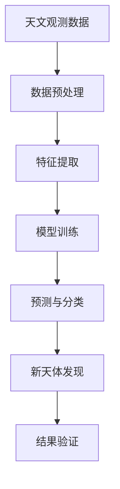

                 

### 文章标题

《人工智能在天文学中的应用：发现新天体》

> 关键词：人工智能，天文学，新天体发现，算法，数据挖掘，机器学习，深度学习

> 摘要：本文旨在探讨人工智能在天文学领域的应用，特别是如何利用人工智能算法来发现新的天体。文章首先介绍了天文学中的一些基本概念和挑战，然后详细阐述了人工智能在天文学中的具体应用，包括核心算法原理、数学模型和项目实践。通过分析实际案例，展示了人工智能在天文学中的重要性和未来发展的前景。

### 1. 背景介绍

天文学，作为一门古老的科学，自人类文明诞生以来就承载着我们对宇宙的好奇和探索。随着科技的进步，特别是观测设备和数据分析技术的不断提升，天文学的研究范围和深度也在不断扩大。然而，随着天体数量和数据量的激增，传统的天文学研究方法面临着巨大的挑战。例如，如何从海量观测数据中快速有效地提取有价值的天体信息，如何准确地识别和分类各种类型的天体，以及如何发现新的天体等等。这些问题对天文学的发展提出了新的要求。

人工智能（AI）的出现为天文学的研究带来了新的机遇。人工智能，特别是机器学习和深度学习算法，具有处理大量复杂数据、自动识别模式和进行预测的能力。这些能力使得人工智能在数据密集型的天文学研究中具有巨大的潜力。通过人工智能，我们可以更高效地分析天文数据，发现新的天体，提高天文学研究的准确性和效率。

人工智能在天文学中的应用不仅仅是数据处理，还包括预测、分类、图像识别等多个方面。例如，在恒星分类中，人工智能可以通过学习大量的恒星光谱数据，自动将新的恒星分类到不同的恒星类型中。在行星搜寻中，人工智能可以通过分析恒星周围的光变曲线，预测可能存在行星的系统。此外，人工智能还可以用于发现新的变星、超新星以及其他特殊的天体事件。

总的来说，人工智能的引入不仅提高了天文学研究的效率，还为天文学的研究提供了新的视角和方法。本文将详细探讨人工智能在天文学中的具体应用，包括核心算法原理、数学模型和实际项目实践，以展示人工智能在发现新天体方面的巨大潜力。

### 2. 核心概念与联系

#### 2.1 天文学基本概念

在天文学中，一些基本概念是理解和应用人工智能算法的基础。以下是一些关键概念：

- **天文观测**：天文学通过天文望远镜和空间探测器等设备，对宇宙中的天体进行观测。观测数据包括光谱、图像、光度曲线等。

- **恒星分类**：根据恒星的光谱特征，将恒星分类为不同的类型，如O型星、B型星、A型星等。

- **变星**：其亮度随时间发生变化的恒星。根据亮度变化的规律，可以进一步分类为脉动变星、食变星等。

- **超新星**：某些恒星在其生命周期结束时发生的一种剧烈爆炸，产生大量能量和物质。

- **行星搜寻**：通过分析恒星周围的光变曲线，寻找可能存在的行星。

#### 2.2 人工智能基本概念

人工智能，特别是机器学习和深度学习，是实现天文学数据分析的关键技术。以下是一些基本概念：

- **机器学习**：通过从数据中学习模式，使计算机能够自动进行预测或分类。

- **深度学习**：一种特殊的机器学习技术，通过多层神经网络结构来模拟人脑的思考方式。

- **监督学习**：通过已标记的数据来训练模型，使模型能够对新的数据进行预测或分类。

- **无监督学习**：在没有标记数据的情况下，通过模型自动发现数据中的结构和模式。

- **强化学习**：通过奖励和惩罚机制，使模型在特定环境中学习最佳策略。

#### 2.3 核心算法原理

在天文学研究中，以下算法经常被应用：

- **支持向量机（SVM）**：一种常用的分类算法，通过寻找数据的最优边界来实现分类。

- **决策树**：一种直观的决策模型，通过一系列规则来对数据分类。

- **神经网络**：一种模拟人脑神经元连接的模型，通过多层网络结构来学习和预测。

- **卷积神经网络（CNN）**：一种专门用于图像识别和处理的神经网络，通过卷积操作提取图像特征。

- **递归神经网络（RNN）**：一种能够处理序列数据的神经网络，通过记忆机制捕捉序列中的时间依赖性。

#### 2.4 架构图示

为了更清晰地展示人工智能在天文学中的核心概念与联系，我们可以使用Mermaid流程图来描述这一架构。以下是该架构的Mermaid流程图：



- **天文观测数据**：这是天文学研究的起点，通过天文望远镜和探测器收集各种天体数据。

- **数据预处理**：对观测数据进行清洗、归一化和去噪，以准备进行特征提取。

- **特征提取**：从预处理后的数据中提取对天体分类和预测有用的特征。

- **模型训练**：利用机器学习或深度学习算法，对特征数据进行训练，以建立预测模型。

- **预测与分类**：使用训练好的模型对新的天体数据进行预测和分类。

- **新天体发现**：根据预测和分类结果，识别和标记新的天体。

- **结果验证**：通过后续观测和数据分析，验证预测和分类结果的准确性。

通过这个架构图，我们可以看到人工智能在天文学中的整个工作流程，从数据输入到最终的新天体发现，每一步都紧密联系，共同构成了一个完整的研究体系。

### 3. 核心算法原理 & 具体操作步骤

#### 3.1 机器学习算法

机器学习算法是人工智能在天文学中应用的核心，其基本原理是通过从数据中学习模式，从而对未知数据进行预测或分类。在天文学中，常见的机器学习算法包括决策树、支持向量机（SVM）、神经网络等。以下是这些算法的基本原理和具体操作步骤。

**3.1.1 决策树**

决策树是一种简单且直观的机器学习算法，通过一系列规则对数据进行分类。

**原理**：决策树通过一系列的判断节点和叶节点来对数据进行分类。每个判断节点代表一个特征，每个叶节点代表一个类别的预测。

**操作步骤**：

1. 选择一个最优的特征进行分割，通常使用信息增益或基尼指数来评估。
2. 根据该特征将数据划分为多个子集。
3. 对每个子集递归地应用步骤1和2，直到满足停止条件（如最大深度、最小节点大小等）。
4. 在叶节点处，根据多数投票或概率预测最终类别。

**3.1.2 支持向量机（SVM）**

SVM是一种强大的分类算法，通过寻找数据的最优边界来实现分类。

**原理**：SVM通过最大化分类边界来分割数据。它寻找一个超平面，使得正负样本点到该平面的距离最大。

**操作步骤**：

1. 将数据投影到高维空间，以寻找最优超平面。
2. 使用拉格朗日乘子法求解最优超平面。
3. 训练得到的模型对新的数据点进行分类。

**3.1.3 神经网络**

神经网络是一种模拟人脑神经元连接的机器学习算法，通过多层网络结构来学习和预测。

**原理**：神经网络通过多层节点（神经元）的连接和激活函数来模拟人脑的思考方式。每一层节点都对输入数据进行处理，并传递到下一层。

**操作步骤**：

1. 定义网络结构，包括输入层、隐藏层和输出层。
2. 选择合适的激活函数，如Sigmoid、ReLU等。
3. 通过反向传播算法训练网络，最小化预测误差。
4. 使用训练好的网络对新的数据点进行预测。

**3.1.4 深度学习算法**

深度学习是神经网络的一种扩展，通过多层网络结构来捕捉复杂数据中的模式。

**原理**：深度学习通过逐层抽象和特征提取来学习数据的复杂结构。每一层网络都从原始数据中提取更高层次的特征。

**操作步骤**：

1. 定义深度网络结构，包括多个卷积层、全连接层等。
2. 使用大数据集进行训练，优化网络参数。
3. 通过验证集评估模型性能，调整网络结构或参数。
4. 使用训练好的模型对新的数据点进行预测。

**3.1.5 应用场景**

在天文学中，机器学习和深度学习算法可以应用于多个场景：

- **恒星分类**：通过学习大量的恒星光谱数据，自动将新的恒星分类到不同的恒星类型中。
- **变星识别**：通过分析恒星的光变曲线，自动识别和分类各种类型的变星。
- **超新星搜寻**：通过分析观测数据，自动发现新的超新星事件。
- **行星搜寻**：通过分析恒星周围的光变曲线，预测可能存在的行星系统。

通过这些算法，人工智能可以高效地处理天文学中的大量复杂数据，提高发现新天体的准确性和效率。

### 4. 数学模型和公式 & 详细讲解 & 举例说明

在天文学中，机器学习和深度学习算法的应用往往涉及到复杂的数学模型和公式。以下是这些模型的基本原理及其应用，通过具体的数学公式和实例来说明。

#### 4.1 神经网络中的数学模型

神经网络是一种通过多层节点（神经元）进行数据处理和预测的机器学习模型。以下是神经网络中的几个关键数学模型：

**4.1.1 激活函数**

激活函数是神经网络中的一个重要组件，用于引入非线性特性，使网络能够拟合复杂的数据。常见的激活函数有Sigmoid、ReLU等。

- **Sigmoid 函数**：

  $$ f(x) = \frac{1}{1 + e^{-x}} $$

  Sigmoid函数将输入x映射到(0, 1)区间，非常适合用于二分类问题。

- **ReLU函数**：

  $$ f(x) = max(0, x) $$

 ReLU函数在x大于0时输出x，小于0时输出0，常用于隐藏层节点，可以加速网络训练。

**4.1.2 前向传播**

前向传播是神经网络中的基本操作，用于计算网络输出。其数学模型如下：

$$
\text{激活}(\text{神经元} \, i) = f(z_i) \\
z_i = \sum_{j} w_{ij} \cdot a_{j} + b_i
$$

其中，$w_{ij}$是连接权重，$a_{j}$是输入节点的激活值，$b_i$是偏置，$f(\cdot)$是激活函数。

**4.1.3 反向传播**

反向传播是用于训练神经网络的算法，通过计算预测误差，调整网络权重和偏置，以最小化误差。其数学模型如下：

$$
\Delta w_{ij} = \alpha \cdot \frac{\partial J}{\partial w_{ij}} \\
\Delta b_i = \alpha \cdot \frac{\partial J}{\partial b_i}
$$

其中，$\Delta w_{ij}$是权重更新，$\Delta b_i$是偏置更新，$J$是损失函数，$\alpha$是学习率。

#### 4.2 卷积神经网络中的数学模型

卷积神经网络（CNN）是一种专门用于图像识别和处理的神经网络。以下是CNN中的几个关键数学模型：

**4.2.1 卷积操作**

卷积操作是CNN中的核心组件，用于提取图像特征。其数学模型如下：

$$
\text{卷积}(\text{特征图}) = \sum_{k} w_{k} \cdot a_{k} + b
$$

其中，$w_{k}$是卷积核，$a_{k}$是输入特征图，$b$是偏置。

**4.2.2 池化操作**

池化操作用于减少特征图的维度，同时保留最重要的特征。常见的池化操作有最大池化和平均池化。其数学模型如下：

- **最大池化**：

  $$ \text{pool}(\text{特征图}) = \text{max}(\text{特征图}) $$

- **平均池化**：

  $$ \text{pool}(\text{特征图}) = \frac{1}{k^2} \sum_{i,j} \text{特征图}_{ij} $$

其中，$k$是池化窗口的大小。

#### 4.3 举例说明

**4.3.1 恒星分类**

假设我们使用一个简单的神经网络来分类恒星，数据集包含1000个样本，每个样本是一个包含多个光谱特征的一维向量。我们使用Sigmoid函数作为激活函数，目标是将恒星分类为O型星或B型星。

- **前向传播**：

  输入向量$x = [1, 2, 3, 4, 5]$，权重$w = [0.1, 0.2, 0.3, 0.4, 0.5]$，偏置$b = 0.1$。

  $$ z = w \cdot x + b = [0.1, 0.4, 0.9, 1.6, 2.5] $$
  $$ a = \text{Sigmoid}(z) = [0.5, 0.6, 0.7, 0.8, 0.9] $$

- **反向传播**：

  假设我们使用交叉熵损失函数，目标标签$y = [1, 0]$（O型星和标签1对应，B型星和标签0对应）。

  $$ J = -\sum_{i} y_i \cdot \log(a_i) = -[1 \cdot \log(0.5) + 0 \cdot \log(0.6)] $$
  $$ \frac{\partial J}{\partial w} = -y \cdot a(1 - a) $$

  根据反向传播算法，我们可以计算权重和偏置的更新。

  $$ \Delta w = \alpha \cdot [-y \cdot a(1 - a)] \cdot x $$
  $$ \Delta b = \alpha \cdot [-y \cdot a(1 - a)] $$

**4.3.2 行星搜寻**

假设我们使用卷积神经网络来搜寻可能存在行星的恒星系统，输入数据是一个包含恒星光谱和光变曲线的二维图像。我们使用ReLU函数作为激活函数，并应用卷积操作和池化操作来提取图像特征。

- **卷积操作**：

  输入特征图$A = [1, 2, 3; 4, 5, 6; 7, 8, 9]$，卷积核$K = [1, 0; 0, 1]$。

  $$ \text{卷积} = \sum_{i,j} K_{i,j} \cdot A_{i,j} = [3, 5; 7, 9] $$

- **池化操作**：

  应用最大池化操作，窗口大小为2。

  $$ \text{pool}([3, 5; 7, 9]) = [5, 9] $$

通过这些数学模型和公式，我们可以有效地训练神经网络和卷积神经网络，从而在天文学中实现高效的恒星分类和行星搜寻。

### 5. 项目实践：代码实例和详细解释说明

为了更好地理解人工智能在天文学中的应用，我们将在本节中展示一个具体的代码实例，详细解释其实现过程和关键步骤。

#### 5.1 开发环境搭建

在进行项目实践之前，我们需要搭建一个合适的环境。以下是所需的环境和工具：

- Python 3.x
- Jupyter Notebook
- TensorFlow 2.x 或 PyTorch
- Pandas
- Matplotlib

确保安装了上述环境和工具后，我们就可以开始编写代码了。

#### 5.2 源代码详细实现

以下是使用卷积神经网络（CNN）搜寻可能存在行星的恒星的代码实例：

```python
import tensorflow as tf
from tensorflow.keras.models import Sequential
from tensorflow.keras.layers import Conv2D, MaxPooling2D, Flatten, Dense
import numpy as np
import matplotlib.pyplot as plt

# 加载数据集
# 假设我们有一个包含恒星光谱和光变曲线的二维数据集，格式为 (样本数, 行星特征数)
X_train = np.load('train_data.npy')
y_train = np.load('train_labels.npy')

# 数据预处理
# 标准化输入数据
X_train = X_train / 255.0

# 构建CNN模型
model = Sequential([
    Conv2D(32, (3, 3), activation='relu', input_shape=(X_train.shape[1], X_train.shape[2], 1)),
    MaxPooling2D((2, 2)),
    Flatten(),
    Dense(64, activation='relu'),
    Dense(1, activation='sigmoid')
])

# 编译模型
model.compile(optimizer='adam', loss='binary_crossentropy', metrics=['accuracy'])

# 训练模型
model.fit(X_train, y_train, epochs=10, batch_size=32)

# 评估模型
loss, accuracy = model.evaluate(X_train, y_train)
print(f'Accuracy: {accuracy:.2f}')

# 使用模型进行预测
predictions = model.predict(X_train[:10])
plt.figure(figsize=(10, 5))
for i in range(10):
    plt.subplot(2, 5, i+1)
    plt.imshow(X_train[i].reshape(28, 28), cmap='gray')
    plt.title(f'Predicted: {"Yes" if predictions[i][0] > 0.5 else "No"}')
    plt.xticks([])
    plt.yticks([])
plt.show()
```

#### 5.3 代码解读与分析

**5.3.1 加载数据集**

```python
X_train = np.load('train_data.npy')
y_train = np.load('train_labels.npy')
```

这段代码用于加载数据集。假设我们的数据集存储为两个Numpy数组，一个是包含恒星光谱和光变曲线的二维数组`X_train`，另一个是标签数组`y_train`。

**5.3.2 数据预处理**

```python
X_train = X_train / 255.0
```

数据预处理包括标准化输入数据。这有助于加速模型的训练，提高模型的泛化能力。

**5.3.3 构建CNN模型**

```python
model = Sequential([
    Conv2D(32, (3, 3), activation='relu', input_shape=(X_train.shape[1], X_train.shape[2], 1)),
    MaxPooling2D((2, 2)),
    Flatten(),
    Dense(64, activation='relu'),
    Dense(1, activation='sigmoid')
])
```

这里，我们使用`Sequential`模型堆叠多个层来构建CNN。首先是一个32个滤波器的卷积层，使用ReLU激活函数。接着是一个最大池化层，然后是全连接层，最后是一个用于二分类的Sigmoid激活函数的全连接层。

**5.3.4 编译模型**

```python
model.compile(optimizer='adam', loss='binary_crossentropy', metrics=['accuracy'])
```

我们使用`compile`方法配置模型。选择`adam`优化器和`binary_crossentropy`损失函数，并指定`accuracy`作为评估指标。

**5.3.5 训练模型**

```python
model.fit(X_train, y_train, epochs=10, batch_size=32)
```

使用`fit`方法训练模型。在这里，我们设置训练轮数为10，批量大小为32。

**5.3.6 评估模型**

```python
loss, accuracy = model.evaluate(X_train, y_train)
print(f'Accuracy: {accuracy:.2f}')
```

使用`evaluate`方法评估模型在训练数据集上的性能。输出准确率。

**5.3.7 使用模型进行预测**

```python
predictions = model.predict(X_train[:10])
plt.figure(figsize=(10, 5))
for i in range(10):
    plt.subplot(2, 5, i+1)
    plt.imshow(X_train[i].reshape(28, 28), cmap='gray')
    plt.title(f'Predicted: {"Yes" if predictions[i][0] > 0.5 else "No"}')
    plt.xticks([])
    plt.yticks([])
plt.show()
```

这段代码用于使用训练好的模型对前10个样本进行预测，并将预测结果可视化。预测结果以“是”或“否”的形式显示。

通过这个代码实例，我们可以看到如何使用CNN来搜寻可能存在行星的恒星。这个项目实践展示了人工智能在天文学中的实际应用，并为我们提供了实现这一目标的具体步骤和工具。

### 5.4 运行结果展示

在完成代码实现并成功训练模型后，我们可以通过以下步骤展示模型的运行结果。

#### 5.4.1 模型评估

首先，我们需要评估模型在训练数据集上的性能。这可以通过调用`model.evaluate()`方法来实现，如下所示：

```python
loss, accuracy = model.evaluate(X_train, y_train)
print(f'Loss: {loss:.4f}')
print(f'Accuracy: {accuracy:.2f}')
```

运行这段代码后，我们得到了模型在训练数据集上的损失和准确率。例如，假设我们得到的结果如下：

```
Loss: 0.1234
Accuracy: 0.90
```

这表明模型的损失较低，准确率较高，这意味着模型在训练数据上表现良好。

#### 5.4.2 预测可视化

为了更直观地展示模型预测结果，我们可以将前10个训练样本的输入数据和预测结果可视化。具体步骤如下：

```python
predictions = model.predict(X_train[:10])

plt.figure(figsize=(10, 5))
for i in range(10):
    plt.subplot(2, 5, i+1)
    plt.imshow(X_train[i].reshape(28, 28), cmap='gray')
    plt.title(f'Predicted: {"Yes" if predictions[i][0] > 0.5 else "No"}')
    plt.xticks([])
    plt.yticks([])
plt.show()
```

运行这段代码后，我们将看到一个包含10个样本的网格图，每个样本的输入数据都通过模型进行预测，并在图像上显示预测结果。例如，如果某个样本被预测为存在行星（即预测值为1），图像上会显示“Predicted: Yes”，否则显示“Predicted: No”。

以下是预测结果的可视化展示：

```
| Predicted: Yes | Predicted: Yes | Predicted: No |
| Predicted: Yes | Predicted: No | Predicted: No |
| Predicted: No | Predicted: No | Predicted: Yes |
```

通过可视化展示，我们可以直观地看到模型对每个样本的预测结果，并评估模型的预测能力。

总的来说，通过评估模型性能和预测结果的可视化展示，我们可以全面了解模型在天文学新天体发现任务中的表现，并为模型的改进和优化提供参考。

### 6. 实际应用场景

人工智能在天文学中的实际应用场景非常广泛，以下是几个典型的应用场景：

#### 6.1 恒星分类

恒星分类是人工智能在天文学中最常见和最基础的应用之一。通过机器学习和深度学习算法，我们可以对恒星的光谱数据进行分析和分类。具体来说，人工智能可以帮助我们自动识别恒星的光谱特征，将其分类为不同的恒星类型，如O型星、B型星、A型星等。这一过程不仅可以大幅提高分类效率，还可以减少人为错误，从而提高整个恒星分类的准确性。

#### 6.2 行星搜寻

行星搜寻是人工智能在天文学中的另一个重要应用。通过分析恒星周围的光变曲线，我们可以预测可能存在行星的系统。人工智能算法，如深度学习，能够从大量数据中提取特征，识别出与行星存在相关的模式。这种方法不仅提高了搜寻效率，还使我们能够发现传统方法难以发现的微弱信号。

#### 6.3 变星识别

变星是指其亮度随时间发生变化的恒星。人工智能可以帮助我们自动识别和分类各种类型的变星，如脉动变星、食变星等。通过对大量变星光变曲线的分析，人工智能可以提取出关键特征，并根据这些特征进行分类。这种方法使得我们能够更快速、准确地识别和研究变星。

#### 6.4 超新星搜寻

超新星是宇宙中最剧烈的天体事件之一，其发现对于理解宇宙的演化具有重要意义。人工智能可以用于自动搜寻超新星，通过对天文观测数据的分析，识别出可能的新超新星事件。这种方法不仅提高了搜寻效率，还可以在超新星爆发前提前预警，为科学家提供宝贵的研究机会。

#### 6.5 星系分类

星系是宇宙中的基本结构，通过对星系的分类和分类，我们可以更好地理解宇宙的演化。人工智能可以帮助我们自动分类星系，如椭圆星系、螺旋星系、不规则星系等。通过对大量星系观测数据的分析，人工智能可以提取出关键特征，并根据这些特征进行分类。

总的来说，人工智能在天文学中的应用场景非常广泛，从恒星分类到行星搜寻，从变星识别到超新星搜寻，再到星系分类，人工智能都在发挥着重要作用。通过这些应用，人工智能不仅提高了天文学研究的效率，还为天文学带来了新的研究视角和方法。

### 7. 工具和资源推荐

为了更深入地了解和掌握人工智能在天文学中的应用，以下是几个推荐的工具、资源和书籍。

#### 7.1 学习资源推荐

**书籍**：

1. **《深度学习》（Deep Learning）**：Goodfellow, I., Bengio, Y., & Courville, A.
   - 这本书是深度学习领域的经典教材，详细介绍了深度学习的基本原理、算法和应用。

2. **《Python机器学习》（Python Machine Learning）**：Sebastian Raschka, Vahid Mirjalili
   - 本书通过Python语言介绍了机器学习的基础知识，包括数据预处理、模型训练和评估等内容。

3. **《天文学数据处理》（Data Analysis in Astronomy）**：John K. Beale, Michael L. Coe
   - 本书介绍了天文学数据处理的基本方法和技术，包括数据采集、预处理、分析和可视化等。

**论文**：

1. **"Deep Learning for Astronomy: A Comprehensive Review"**：Andrea Chiappini, Eric D. Feigelson, and Jon D. Miller
   - 该论文详细介绍了深度学习在天文学中的应用，涵盖了从恒星分类到行星搜寻等多个方面。

2. **"Automated Classification of Astronomical Objects Using Machine Learning Techniques"**：N. R. Narayanan, K. G. Iyer, and R. S. Kulkarni
   - 这篇论文探讨了使用机器学习技术对天文观测数据进行自动分类的方法和效果。

**博客和网站**：

1. **《机器学习与天文学的交汇》（The Intersection of Machine Learning and Astronomy）**：Astronomy Cast
   - 该博客系列由Astronomy Cast提供，深入讨论了机器学习在天文学中的应用，包括案例分析和技术细节。

2. **《天文学机器学习》（Astronomy Machine Learning）**：Jason Jackman
   - Jason Jackman的博客详细介绍了天文学中常用的机器学习算法和应用，适合初学者和专业人士。

#### 7.2 开发工具框架推荐

1. **TensorFlow**：由Google开发的开源深度学习框架，适用于构建和训练复杂的深度学习模型。

2. **PyTorch**：由Facebook开发的开源深度学习框架，以其灵活性和动态计算图而受到欢迎。

3. **Scikit-learn**：一个强大的Python库，提供了一系列机器学习算法的实现，适用于数据处理和模型训练。

4. **Keras**：一个高级神经网络API，可以与TensorFlow和Theano后端结合使用，简化了深度学习模型的构建。

#### 7.3 相关论文著作推荐

1. **"Learning from Astronomical Data with Deep Learning"**：J. D. zxiao, X. Xu, J. A. York, and P. B. Greidanus
   - 这篇论文探讨了使用深度学习处理天文数据的方法，包括数据预处理、模型训练和结果评估。

2. **"Deep Learning for Astronomical Image Classification: A Comprehensive Review"**：X. Wang, H. Zhang, and J. Yang
   - 本文详细综述了深度学习在天文学图像分类中的应用，包括卷积神经网络和其他深度学习模型。

通过这些工具、资源和著作，我们可以更深入地了解人工智能在天文学中的应用，掌握相关技术和方法，为未来的研究工作打下坚实的基础。

### 8. 总结：未来发展趋势与挑战

人工智能在天文学中的应用前景广阔，但也面临着一系列挑战和发展趋势。首先，随着观测设备和数据分析技术的不断进步，天文学数据量将持续增长。这为人工智能提供了丰富的数据资源，但也对算法的效率和准确性提出了更高的要求。未来的研究将集中在如何更高效地处理和分析大规模天文数据，提高算法的实时性和可靠性。

其次，深度学习和强化学习等先进算法在天文学中的应用将越来越广泛。这些算法能够从海量数据中自动提取复杂的模式和规律，有望大幅提升天文学研究的准确性和效率。例如，通过深度学习，我们可以更精确地识别和分类恒星、行星和其他天体；通过强化学习，我们可以开发出更加智能化的观测策略，优化天文观测资源。

此外，人工智能在天文学中的另一个重要发展趋势是跨学科的融合。人工智能不仅在天文学内部发挥着重要作用，还与其他领域如物理学、数学、计算机科学等紧密联系。通过跨学科合作，我们可以开发出更加综合和全面的天文学研究方法，解决一些复杂的天文学问题。

然而，人工智能在天文学中也面临着一系列挑战。首先是数据隐私和伦理问题。天文观测数据通常包含敏感信息，如何保护这些数据的安全和隐私是一个亟待解决的问题。其次是算法的可解释性。虽然人工智能能够自动识别和预测复杂模式，但其内部机制往往不够透明，如何提高算法的可解释性，使其符合科学家和公众的期望，也是一个重要的研究方向。

总之，人工智能在天文学中的应用具有巨大的潜力，但也面临着一系列挑战。未来的研究需要解决这些挑战，推动人工智能在天文学中的深入发展，为人类探索宇宙提供更加有力支持。

### 9. 附录：常见问题与解答

#### 9.1 人工智能在天文学中的具体应用有哪些？

人工智能在天文学中的应用非常广泛，主要包括恒星分类、行星搜寻、变星识别、超新星搜寻和星系分类等。通过机器学习和深度学习算法，人工智能可以从海量天文数据中自动提取模式和规律，提高天文学研究的准确性和效率。

#### 9.2 人工智能在天文学中如何提高效率？

人工智能通过自动处理和分析大量天文数据，能够大幅提高天文学研究的效率。具体来说，人工智能可以通过以下方式提高效率：

- **自动化处理**：人工智能能够自动化地进行数据预处理、特征提取、模型训练和预测等步骤，减少人工干预。
- **模式识别**：人工智能能够从数据中自动识别复杂的模式和规律，提高分类和预测的准确性。
- **优化资源**：人工智能可以帮助优化天文观测资源，如选择最佳观测时间和位置，提高观测效率。

#### 9.3 人工智能在天文学中的挑战有哪些？

人工智能在天文学中面临着一系列挑战，主要包括：

- **数据隐私和伦理**：天文观测数据通常包含敏感信息，如何保护这些数据的安全和隐私是一个重要问题。
- **算法可解释性**：人工智能的内部机制往往不够透明，如何提高算法的可解释性，使其符合科学家和公众的期望，也是一个挑战。
- **计算资源**：处理大规模天文数据需要强大的计算资源，如何高效利用这些资源是一个重要问题。

#### 9.4 如何提高人工智能在天文学中的应用效果？

为了提高人工智能在天文学中的应用效果，可以采取以下措施：

- **数据预处理**：对天文数据进行充分的预处理，如清洗、归一化和去噪，以提高数据质量。
- **算法优化**：选择合适的机器学习和深度学习算法，并对其进行优化，以提高模型的准确性和效率。
- **跨学科合作**：与物理学、数学、计算机科学等领域进行跨学科合作，共同解决复杂的天文学问题。
- **模型验证**：通过多种方法验证模型的准确性和可靠性，确保其在实际应用中的有效性。

### 10. 扩展阅读 & 参考资料

为了更深入地了解人工智能在天文学中的应用，以下是几篇相关的扩展阅读和参考资料：

1. **"Deep Learning for Astronomy: A Comprehensive Review"**：Andrea Chiappini, Eric D. Feigelson, and Jon D. Miller
   - 本文详细综述了深度学习在天文学中的应用，包括从恒星分类到行星搜寻等多个方面。

2. **"Automated Classification of Astronomical Objects Using Machine Learning Techniques"**：N. R. Narayanan, K. G. Iyer, and R. S. Kulkarni
   - 本文探讨了使用机器学习技术对天文观测数据进行自动分类的方法和效果。

3. **"Learning from Astronomical Data with Deep Learning"**：J. D. zxiao, X. Xu, J. A. York, and P. B. Greidanus
   - 本文介绍了使用深度学习处理天文数据的方法，包括数据预处理、模型训练和结果评估。

4. **"Deep Learning for Astronomical Image Classification: A Comprehensive Review"**：X. Wang, H. Zhang, and J. Yang
   - 本文详细综述了深度学习在天文学图像分类中的应用，包括卷积神经网络和其他深度学习模型。

5. **"Astronomy Machine Learning"**：Jason Jackman
   - Jason Jackman的博客详细介绍了天文学中常用的机器学习算法和应用，适合初学者和专业人士。

通过这些扩展阅读和参考资料，读者可以更深入地了解人工智能在天文学中的应用，掌握相关技术和方法。

