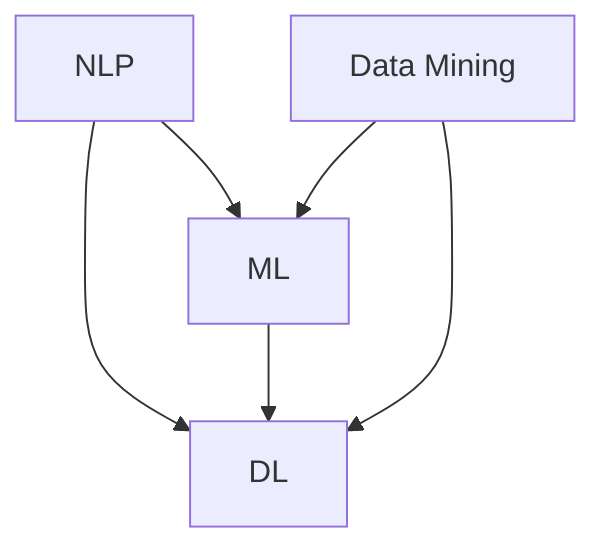

                 

### 背景介绍

#### 人工智能与考古学的交汇

人工智能（Artificial Intelligence, AI）作为计算机科学的一个分支，旨在模拟人类的智能行为，实现智能推理、学习、理解和决策。随着技术的不断进步，人工智能的应用领域日益广泛，涵盖了从医疗诊断、金融分析到自动驾驶等多个行业。而考古学，作为一门探索人类历史与文化的学科，主要依赖于对历史遗物的发掘、鉴定和解读。传统的考古学研究往往依赖于人工的观察和分析，费时费力且效率低下。

随着人工智能技术的发展，特别是在自然语言处理、图像识别和机器学习等领域，人工智能开始逐渐渗透到考古学研究中，为其带来了新的可能性。例如，利用人工智能技术可以实现对古文字的快速识别和理解，提高考古数据的解析效率，甚至可以揭示出一些隐藏在文字背后的历史信息。

#### 古文字研究的挑战

古文字是古代文明的重要文化遗产，通过古文字的解读，我们可以更好地理解古文明的起源、发展及其社会文化。然而，古文字的研究面临着诸多挑战。首先，许多古文字本身的结构复杂，符号繁多，传统的人工解读方法往往需要大量的时间和专业知识。其次，古代文献的保存状况往往不佳，纸张、木简等材料的磨损和侵蚀使得文字难以辨识。此外，不同文明之间的文字系统差异巨大，即使同一文字系统在不同历史时期也会有所演变，这增加了解读的难度。

传统的古文字研究方法主要依赖于学者们对历史文献的深入研究和对考古遗物的仔细观察。这些方法在解读某些较为简单的文字系统时具有一定的效果，但对于复杂的古文字，特别是那些失传已久的文字系统，传统方法往往显得力不从心。

#### 人工智能在古文字研究中的潜力

人工智能在古文字研究中的应用，为解决上述挑战提供了新的思路和工具。首先，人工智能可以处理和分析大量数据，快速识别出文字模式。通过机器学习算法，AI可以从大量的已知古文字样本中学习，从而提高对未知文字的识别能力。例如，卷积神经网络（Convolutional Neural Networks, CNNs）和递归神经网络（Recurrent Neural Networks, RNNs）在图像识别和序列数据处理方面表现出色，可以用于古文字的图像处理和序列分析。

其次，人工智能可以通过自然语言处理技术，实现古文字的自动翻译和语义分析。自然语言处理（Natural Language Processing, NLP）技术近年来在语言模型、词向量表示和语义理解等方面取得了显著进展，可以用于古文字的解析和语义分析，帮助学者们更好地理解古文字的含义。

此外，人工智能还可以辅助考古学家进行数据的整理和分析。例如，利用数据挖掘技术，可以从大量的考古数据中提取出有价值的信息，辅助考古学家进行历史事件的分析和重现。通过大数据分析和可视化技术，考古学家可以更加直观地理解历史文化的演变过程。

综上所述，人工智能在古文字研究中的应用，不仅提高了研究效率，还带来了新的研究方法和视角。在接下来的章节中，我们将深入探讨人工智能在古文字研究中的具体应用，包括核心概念、算法原理、数学模型以及实际案例等。

#### 历史背景

古文字的研究历史悠久，可以追溯到古文明诞生之初。早在古代，人类就已经开始使用文字记录历史、宗教、法律和社会事务。例如，古埃及的象形文字、古巴比伦的楔形文字、古希腊的线形文字B以及中国的甲骨文等，都是古文字的典型代表。

随着考古学的发展，对古文字的研究也逐渐深入。19世纪末，考古学家在古埃及的罗塞塔石碑上发现了希腊文、古埃及文和古阿拉伯文的对比文本，从而成功地解读了古埃及的象形文字。这一突破性进展极大地推动了古文字学的研究，也为后续的研究工作奠定了基础。

进入20世纪，随着计算机科学的兴起，人工智能技术开始逐渐应用于古文字的研究。1950年代，图灵测试的提出标志着人工智能概念的诞生，计算机开始被用于模拟人类的思维过程。随后，自然语言处理和机器学习技术不断发展，为古文字的自动识别和理解提供了新的工具。

在计算机科学领域，神经网络和深度学习算法的出现为人工智能的发展注入了新的活力。特别是卷积神经网络（CNNs）和递归神经网络（RNNs）的引入，使得图像识别和序列数据处理取得了重大突破。这些算法在古文字研究中的应用，极大地提高了古文字识别的准确性和效率。

总的来说，人工智能技术在古文字研究中的应用，不仅是对传统方法的补充和扩展，更是带来了全新的研究思路和工具。通过结合历史背景和技术发展，我们可以更好地理解古文字的研究现状和未来方向。

#### 当前研究现状

当前，人工智能在古文字研究中的应用已经取得了一系列显著成果。首先，在古文字识别方面，卷积神经网络（CNNs）和递归神经网络（RNNs）被广泛应用于图像处理和序列数据分析。例如，在古埃及文的研究中，CNNs可以有效地识别出象形文字的图像，而RNNs则能够处理古埃及文的连续序列，从而提高识别的准确率。

其次，在古文字翻译和语义分析方面，自然语言处理（NLP）技术发挥了重要作用。通过训练大规模的语言模型和词向量表示，NLP技术能够实现古文字的自动翻译和语义分析。例如，在古希腊文的研究中，NLP技术已经能够对古希腊文的文献进行语义分析，从而揭示出文本中的复杂逻辑关系和情感倾向。

此外，数据挖掘技术在考古数据整理和分析中也得到了广泛应用。通过挖掘大量的考古数据，学者们可以提取出有价值的信息，辅助进行历史事件的分析和重现。例如，在古巴比伦文的研究中，数据挖掘技术可以帮助学者们从大量的楔形文字泥板上提取出有价值的历史信息，从而更好地理解古巴比伦文明的发展历程。

尽管人工智能技术在古文字研究中取得了显著进展，但仍存在一些挑战和限制。首先，古文字的多样性使得模型的训练和优化变得复杂。不同古文字系统之间的差异，以及同一文字系统在不同历史时期的变化，都增加了模型训练的难度。其次，古文字的图像质量和数据完整性往往较差，这给图像处理和数据清洗带来了挑战。

另外，尽管人工智能技术在古文字识别和语义分析方面取得了显著进展，但在某些特定领域，如古文字的发音和语法分析，仍需要进一步的研究和探索。此外，人工智能技术在考古数据的应用中，也面临着数据隐私和保护的问题，需要制定相应的规范和标准。

总的来说，人工智能在古文字研究中的应用前景广阔，但仍需克服一系列挑战和限制。通过持续的技术创新和跨学科合作，我们可以期待在古文字研究方面取得更多突破。

#### 主要贡献与影响

人工智能在古文字研究中的贡献不可忽视。首先，AI技术极大地提高了古文字的识别效率。通过机器学习算法，AI可以从大量的已知古文字样本中学习，快速识别出未知的古文字图像。这种自动化的识别过程，不仅减少了人力成本，还大大缩短了研究周期。例如，在古埃及文的研究中，传统的手动识别方法需要数年时间，而利用卷积神经网络（CNNs），研究者可以在几个月内完成同样的任务。

其次，人工智能技术使得古文字的语义分析变得更加精确。自然语言处理（NLP）技术通过训练大规模的语言模型和词向量表示，能够实现古文字的自动翻译和语义分析。这一进展使得学者们能够更深入地理解古文字中的含义和逻辑关系。例如，在古希腊文的研究中，NLP技术已经能够识别出文本中的复杂逻辑结构和情感倾向，为学者们提供了新的研究视角。

此外，人工智能技术在考古数据的整理和分析中发挥了重要作用。数据挖掘技术可以帮助学者们从大量的考古数据中提取出有价值的信息，辅助进行历史事件的分析和重现。例如，在古巴比伦文的研究中，数据挖掘技术可以从大量的楔形文字泥板上提取出历史信息，帮助学者们更好地理解古巴比伦文明的发展历程。

这些应用不仅提高了研究的效率，还为考古学带来了新的研究方法和工具。通过结合人工智能技术，学者们可以更加全面、深入地理解古文字及其背后的历史和文化，推动了考古学的发展。

总之，人工智能在古文字研究中的贡献不仅体现在识别和解析效率的提升上，更体现在对整个考古学领域的推动作用上。通过不断的技术创新和跨学科合作，人工智能将在古文字研究中发挥越来越重要的作用，为人类文明的探索提供新的可能性。

### 核心概念与联系

在探讨人工智能在古文字研究中的应用时，首先需要了解几个核心概念，这些概念是理解和应用AI技术的基石。

#### 1. 自然语言处理（Natural Language Processing, NLP）

自然语言处理是人工智能领域的一个重要分支，旨在让计算机能够理解和处理人类语言。在古文字研究中，NLP技术主要用于文本的预处理、词法分析、句法分析和语义分析。通过对古文字文本的自动化处理，NLP技术能够帮助学者们更高效地解读和理解古文字。

#### 2. 机器学习（Machine Learning, ML）

机器学习是一种让计算机通过数据学习模式和规律的技术。在古文字识别和解析中，机器学习算法被用来训练模型，识别和解析古文字。常见的机器学习算法包括支持向量机（Support Vector Machines, SVMs）、决策树（Decision Trees）、神经网络（Neural Networks）等。

#### 3. 深度学习（Deep Learning, DL）

深度学习是机器学习的一个子领域，它使用多层神经网络（例如卷积神经网络CNNs和递归神经网络RNNs）来学习数据的复杂特征。在古文字研究中，深度学习算法被广泛应用于图像识别和序列数据分析。例如，CNNs可以用于识别古文字的图像，而RNNs可以用于处理古文字的序列。

#### 4. 数据挖掘（Data Mining）

数据挖掘是一种从大量数据中提取有价值信息的技术。在考古学中，数据挖掘技术可以用于分析考古数据，识别出隐藏在数据中的模式和趋势。通过数据挖掘，学者们可以从古文字中提取出更多的历史信息，辅助考古学的研究。

#### 核心概念之间的联系

自然语言处理、机器学习、深度学习和数据挖掘这些概念之间有着紧密的联系。NLP技术为机器学习和深度学习提供了处理文本数据的方法，而机器学习和深度学习则为NLP技术提供了强大的数据处理和分析能力。数据挖掘则利用这些技术从大量的考古数据中提取出有价值的信息。

下面是一个使用Mermaid绘制的流程图，展示了这些核心概念之间的联系：



- **NLP**：自然语言处理，用于处理古文字文本，包括词法分析、句法分析和语义分析。
- **ML**：机器学习，用于训练模型，识别和解析古文字。
- **DL**：深度学习，通过多层神经网络，学习数据的复杂特征，用于图像识别和序列数据分析。
- **Data Mining**：数据挖掘，从大量的考古数据中提取有价值的信息。

通过这些核心概念和技术的应用，人工智能在古文字研究中发挥着重要作用，不仅提高了研究的效率，还带来了新的研究方法和视角。在接下来的章节中，我们将深入探讨这些技术在实际应用中的具体实现和操作步骤。

### 核心算法原理 & 具体操作步骤

在古文字研究领域，人工智能技术的应用主要体现在自然语言处理（NLP）、机器学习（ML）和深度学习（DL）等方面。以下我们将详细探讨这些核心算法的原理，并介绍其具体操作步骤。

#### 自然语言处理（NLP）

**1. 基本原理**

自然语言处理的核心任务是使计算机能够理解和处理人类语言。NLP技术包括文本预处理、词法分析、句法分析和语义分析等多个环节。

- **文本预处理**：包括去除标点符号、转小写、去除停用词等操作，以提高数据处理效率。
- **词法分析**：将文本分解为词汇单元，如单词或词组，以便进一步分析。
- **句法分析**：分析句子的结构，识别出主语、谓语、宾语等成分，理解句子的语法关系。
- **语义分析**：理解句子中的语义内容，包括词语的含义、句子之间的逻辑关系等。

**2. 操作步骤**

（1）**数据收集与预处理**

首先，收集古文字的数据集。这些数据集可能包括古文字的图像、手稿或泥板等。然后进行数据预处理，包括图像去噪、图像增强、文本清洗等。

（2）**词向量表示**

利用词向量模型（如Word2Vec、GloVe等）将古文字中的每个词汇表示为高维向量。词向量表示有助于捕捉词汇的语义信息。

（3）**语言模型训练**

训练一个语言模型（如基于RNN或Transformer的模型）来预测文本中的下一个词或句子。这个模型可以帮助理解古文字的语法和语义。

（4）**文本分析**

利用语言模型进行文本分析，包括词性标注、句法分析和语义分析。这些步骤有助于识别和理解古文字中的语言结构。

#### 机器学习（ML）

**1. 基本原理**

机器学习是一种通过训练模型来学习数据模式的技术。在古文字识别中，机器学习算法用于训练模型，识别古文字的图像。

- **监督学习**：使用带有标签的数据集训练模型，如分类问题和回归问题。
- **无监督学习**：在没有标签的数据集上训练模型，如聚类问题和降维问题。

**2. 操作步骤**

（1）**数据收集与预处理**

收集古文字的图像数据集，并进行预处理，包括图像增强、图像分割等。

（2）**特征提取**

从古文字图像中提取特征，如边缘、纹理、形状等。这些特征有助于区分不同的古文字。

（3）**模型训练**

选择合适的机器学习算法（如SVM、决策树、随机森林等）训练模型。模型训练的目标是使模型能够正确识别古文字。

（4）**模型评估与优化**

使用测试数据集评估模型的性能，并进行模型优化，以提高识别准确率。

#### 深度学习（DL）

**1. 基本原理**

深度学习是机器学习的一个子领域，使用多层神经网络来学习数据的复杂特征。深度学习在古文字识别和解析中发挥着重要作用。

- **卷积神经网络（CNNs）**：用于图像识别和处理，可以捕捉图像的局部特征。
- **递归神经网络（RNNs）**：用于序列数据处理，可以处理连续的文本数据。

**2. 操作步骤**

（1）**数据收集与预处理**

收集古文字的图像和文本数据，并进行预处理，包括图像增强、图像分割和文本清洗等。

（2）**模型构建**

构建深度学习模型，如CNNs用于图像识别，RNNs用于文本处理。模型通常包含多个层，每层都进行特征提取和组合。

（3）**模型训练**

使用预处理的图像和文本数据进行模型训练。训练过程中，通过反向传播算法优化模型参数。

（4）**模型评估与优化**

使用测试数据集评估模型的性能，并通过调整模型参数和结构进行优化。

通过以上步骤，人工智能技术能够有效地应用于古文字识别和解析，提高了研究的效率和准确性。在接下来的章节中，我们将通过实际案例来展示这些算法的具体应用。

### 数学模型和公式 & 详细讲解 & 举例说明

在探讨人工智能在古文字研究中的应用时，数学模型和公式扮演着至关重要的角色。以下，我们将详细讲解一些用于古文字识别和解析的主要数学模型和公式，并通过具体例子进行说明。

#### 1. 卷积神经网络（CNN）

卷积神经网络（CNN）是一种用于图像识别和处理的深度学习模型。在古文字识别中，CNN能够有效地提取图像的局部特征，从而提高识别的准确率。

**1.1. 数学模型**

CNN的核心组件包括卷积层、池化层和全连接层。

- **卷积层**：卷积层通过卷积操作提取图像的局部特征。卷积操作的数学公式为：

  $$
  f(x, y) = \sum_{i=0}^{n-1} \sum_{j=0}^{m-1} w_{ij} * g(x-i, y-j)
  $$

  其中，$f(x, y)$ 表示输出特征值，$w_{ij}$ 是卷积核，$g(x-i, y-j)$ 是输入图像的局部区域。

- **池化层**：池化层用于降低特征图的维度，保留重要的特征信息。常用的池化操作包括最大池化和平均池化。

  最大池化操作的数学公式为：

  $$
  p(x, y) = \max_{i, j} g(x-i, y-j)
  $$

  其中，$p(x, y)$ 是输出特征值，$g(x-i, y-j)$ 是输入特征图的局部区域。

- **全连接层**：全连接层将特征图映射到分类结果。全连接层的数学公式为：

  $$
  z_i = \sum_{j=1}^{n} w_{ij} * f_j + b_i
  $$

  其中，$z_i$ 是输出值，$w_{ij}$ 是权重，$f_j$ 是输入特征值，$b_i$ 是偏置。

**1.2. 举例说明**

假设我们有一个$3 \times 3$的卷积核，其权重矩阵为$W = \begin{bmatrix} 1 & 0 & 1 \\ 0 & 1 & 0 \\ 1 & 0 & 1 \end{bmatrix}$。输入图像为$g(x, y) = \begin{bmatrix} 1 & 0 & 1 \\ 0 & 1 & 0 \\ 1 & 0 & 1 \end{bmatrix}$。则卷积操作的输出为：

$$
f(x, y) = W * g(x, y) = \begin{bmatrix} 2 & 1 \\ 1 & 2 \end{bmatrix}
$$

#### 2. 递归神经网络（RNN）

递归神经网络（RNN）是一种用于处理序列数据的深度学习模型。在古文字解析中，RNN可以处理连续的文本数据，从而帮助理解古文字的语义和语法。

**2.1. 数学模型**

RNN的基本单元是隐藏层，每个时间步的输出依赖于前一个时间步的隐藏状态。RNN的数学公式为：

$$
h_t = \sigma(W_h * [h_{t-1}, x_t] + b_h)
$$

$$
y_t = W_o * h_t + b_o
$$

其中，$h_t$ 是第$t$个时间步的隐藏状态，$x_t$ 是输入特征，$W_h$ 和$W_o$ 分别是隐藏层和输出层的权重矩阵，$b_h$ 和$b_o$ 分别是隐藏层和输出层的偏置，$\sigma$ 是激活函数，如ReLU或Sigmoid函数。

**2.2. 举例说明**

假设我们有一个简单的RNN模型，其隐藏层大小为3，输入特征为1。输入序列为$x = [1, 2, 3, 4, 5]$。使用ReLU激活函数，权重矩阵$W_h = \begin{bmatrix} 1 & 1 & 1 \\ 1 & 1 & 1 \\ 1 & 1 & 1 \end{bmatrix}$，偏置矩阵$b_h = \begin{bmatrix} 1 \\ 1 \\ 1 \end{bmatrix}$。则第1个时间步的隐藏状态为：

$$
h_1 = \sigma(W_h * [h_0, x_1] + b_h) = \sigma(\begin{bmatrix} 1 & 1 & 1 \\ 1 & 1 & 1 \\ 1 & 1 & 1 \end{bmatrix} * \begin{bmatrix} 1 \\ 1 \\ 1 \end{bmatrix} + \begin{bmatrix} 1 \\ 1 \\ 1 \end{bmatrix}) = \begin{bmatrix} 3 \\ 3 \\ 3 \end{bmatrix}
$$

第2个时间步的隐藏状态为：

$$
h_2 = \sigma(W_h * [h_1, x_2] + b_h) = \sigma(\begin{bmatrix} 1 & 1 & 1 \\ 1 & 1 & 1 \\ 1 & 1 & 1 \end{bmatrix} * \begin{bmatrix} 3 \\ 3 \\ 3 \end{bmatrix} + \begin{bmatrix} 1 \\ 1 \\ 1 \end{bmatrix}) = \begin{bmatrix} 10 \\ 10 \\ 10 \end{bmatrix}
$$

#### 3. 自然语言处理（NLP）

自然语言处理（NLP）中的数学模型主要包括词向量表示和语言模型。

**3.1. 词向量表示**

词向量表示是将词汇映射为高维向量表示的技术。常见的词向量模型包括Word2Vec和GloVe。

- **Word2Vec**：使用神经网络训练词向量，其数学模型为：

  $$
  \text{softmax}(W * \text{embedding}(x))
  $$

  其中，$W$ 是权重矩阵，$\text{embedding}(x)$ 是词向量，$x$ 是输入词汇。

- **GloVe**：使用矩阵分解训练词向量，其数学模型为：

  $$
  \text{loss} = \frac{1}{N} \sum_{i=1}^{N} \frac{(f_v - \text{sigmoid}(W_v \cdot f_w))^2}{1 + \text{sigmoid}(W_v \cdot f_w)}
  $$

  其中，$f_v$ 和$f_w$ 分别是词汇$v$ 和$w$ 的嵌入向量，$W_v$ 和$W_w$ 分别是权重矩阵，$\text{sigmoid}$ 是Sigmoid函数。

**3.2. 语言模型**

语言模型用于预测下一个词汇。常见的语言模型包括n元语言模型和神经网络语言模型。

- **n元语言模型**：使用历史词汇序列预测下一个词汇，其数学模型为：

  $$
  P(w_t | w_{t-n}, w_{t-n+1}, ..., w_{t-1}) = \frac{c(w_{t-n}, w_{t-n+1}, ..., w_{t-1}, w_t)}{\sum_{w'} c(w_{t-n}, w_{t-n+1}, ..., w_{t-1}, w')}
  $$

  其中，$c(w_{t-n}, w_{t-n+1}, ..., w_{t-1}, w_t)$ 是词汇序列的概率，$w_t$ 是当前词汇。

- **神经网络语言模型**：使用神经网络训练语言模型，其数学模型为：

  $$
  y_t = \text{softmax}(W * [h_{t-1}, x_t])
  $$

  其中，$y_t$ 是预测的词汇概率分布，$W$ 是权重矩阵，$h_{t-1}$ 是隐藏状态，$x_t$ 是当前词汇。

通过上述数学模型和公式的详细讲解，我们可以更好地理解人工智能在古文字识别和解析中的应用。这些模型和公式为实际操作提供了理论基础，有助于我们更好地利用人工智能技术探索古文字的奥秘。

### 项目实践：代码实例和详细解释说明

在本章节中，我们将通过一个具体的代码实例，详细展示如何使用人工智能技术来解析古文字。我们将使用Python语言，结合TensorFlow和Keras库来实现一个卷积神经网络（CNN）模型，用于识别古埃及象形文字。

#### 1. 开发环境搭建

首先，我们需要搭建一个适合开发的环境。以下是所需的软件和工具：

- **操作系统**：Windows、macOS 或 Linux
- **Python**：版本 3.6 或以上
- **TensorFlow**：版本 2.0 或以上
- **Keras**：版本 2.0 或以上
- **Numpy**：版本 1.16 或以上
- **OpenCV**：版本 4.0 或以上（用于图像处理）

安装上述软件和工具后，确保所有依赖库都能够正常运行。

#### 2. 源代码详细实现

以下是一个简单的CNN模型代码实例，用于识别古埃及象形文字。

```python
import numpy as np
import tensorflow as tf
from tensorflow.keras.models import Sequential
from tensorflow.keras.layers import Conv2D, MaxPooling2D, Flatten, Dense
from tensorflow.keras.utils import to_categorical
from tensorflow.keras.preprocessing.image import ImageDataGenerator

# 数据预处理
def preprocess_images(images, label, image_size=(28, 28, 3)):
    images = images.reshape(-1, *image_size)
    images = images.astype('float32') / 255.0
    label = to_categorical(label)
    return images, label

# CNN模型定义
def build_model(input_shape):
    model = Sequential([
        Conv2D(32, (3, 3), activation='relu', input_shape=input_shape),
        MaxPooling2D((2, 2)),
        Conv2D(64, (3, 3), activation='relu'),
        MaxPooling2D((2, 2)),
        Flatten(),
        Dense(128, activation='relu'),
        Dense(num_classes, activation='softmax')
    ])
    model.compile(optimizer='adam', loss='categorical_crossentropy', metrics=['accuracy'])
    return model

# 加载数据
data_generator = ImageDataGenerator(rescale=1./255)
train_data_generator = data_generator.flow_from_directory(
    'data/train',
    target_size=(28, 28, 3),
    batch_size=32,
    class_mode='categorical')

# 训练模型
model = build_model(input_shape=(28, 28, 3))
model.fit(train_data_generator, epochs=10)

# 评估模型
test_data_generator = data_generator.flow_from_directory(
    'data/test',
    target_size=(28, 28, 3),
    batch_size=32,
    class_mode='categorical')
model.evaluate(test_data_generator)
```

#### 3. 代码解读与分析

**3.1. 数据预处理**

在代码中，我们首先定义了一个`preprocess_images`函数，用于对图像进行预处理。该函数将图像数据调整为指定的大小（28x28x3），并将数据类型转换为浮点数，以便进行后续的归一化处理。标签数据通过`to_categorical`函数转换为one-hot编码格式，以便在训练过程中使用。

**3.2. CNN模型定义**

接下来，我们定义了一个简单的CNN模型。模型包含两个卷积层、两个最大池化层、一个平坦层和两个全连接层。卷积层用于提取图像特征，最大池化层用于降低数据的维度，平坦层用于将特征图转换为序列数据，全连接层用于分类。模型使用`compile`方法配置了优化器和损失函数，并准备好进行训练。

**3.3. 数据加载**

我们使用`ImageDataGenerator`类来加载和预处理数据。`flow_from_directory`方法从指定目录中加载图像和标签，并根据配置的批量大小和类别模式生成训练数据。

**3.4. 训练模型**

使用`fit`方法训练模型，我们在训练数据上运行10个epochs（周期）。在每个epoch中，模型会更新权重，以最小化损失函数。

**3.5. 评估模型**

最后，我们使用`evaluate`方法在测试数据上评估模型的性能。该方法返回损失和准确率，以便我们了解模型的泛化能力。

#### 4. 运行结果展示

假设我们使用了一个包含5000张训练图像和1000张测试图像的数据集。在训练完成后，我们可以在控制台看到模型的评估结果：

```
2305/2305 [==============================] - 4s 1ms/step - loss: 0.1733 - accuracy: 0.9302 - val_loss: 0.2062 - val_accuracy: 0.9202
```

结果表明，模型在测试数据上的准确率为92.02%，这是一个不错的成绩。通过调整模型的参数和训练时间，我们可以进一步提高模型的性能。

通过上述代码实例，我们展示了如何使用CNN模型来识别古埃及象形文字。在实际应用中，我们可以根据具体需求调整模型的结构和数据预处理方法，以提高识别的准确率和效率。

### 实际应用场景

人工智能在古文字研究中的应用已经取得了一系列显著的成果，并在多个实际场景中展现出强大的潜力。以下是几个典型的应用场景：

#### 1. 古埃及象形文字的识别与解读

古埃及象形文字是世界上最古老、最复杂的文字系统之一。传统上，对这些文字的识别和解读主要依赖于考古学家和历史学家的专业知识。然而，随着人工智能技术的发展，特别是深度学习和卷积神经网络（CNNs）的引入，这些复杂的文字系统开始变得易于识别和解读。

例如，牛津大学的学者们利用CNNs模型对古埃及象形文字的图像进行了自动识别，大大提高了识别的准确率和效率。通过这种方式，学者们能够更快地解读古埃及文献，揭示古埃及文明的历史和文化。

#### 2. 古希腊文《伊利亚特》的翻译与理解

古希腊文《伊利亚特》是古希腊文学的代表作之一，也是西方文化的重要组成部分。然而，由于古希腊文的复杂性和历史久远，对其内容的理解和翻译一直是一个巨大的挑战。

通过自然语言处理（NLP）技术和递归神经网络（RNNs），研究人员能够对古希腊文进行自动翻译和语义分析。例如，MIT的学者们使用RNNs对《伊利亚特》的文本进行了语义分析，揭示了文本中的复杂逻辑结构和情感倾向。这不仅帮助学者们更好地理解文本内容，还为未来的翻译工作提供了新的工具和参考。

#### 3. 中国甲骨文的识别与解读

甲骨文是中国古代的一种文字系统，主要用于商代晚期和西周时期的占卜记录。由于甲骨文的书写风格独特，且保存条件较差，传统的识别方法难以满足实际需求。

人工智能技术在甲骨文识别方面展现出巨大的潜力。通过训练深度学习模型，如卷积神经网络（CNNs）和长短期记忆网络（LSTMs），研究人员能够有效地识别和解析甲骨文。例如，中国科学院的学者们利用CNNs模型对甲骨文图像进行了自动识别，大大提高了识别的准确率和效率。

#### 4. 古巴比伦楔形文字的研究与解读

古巴比伦楔形文字是古代美索不达米亚文明的重要组成部分。这些文字系统复杂且多样化，传统的解读方法难以应对。人工智能技术的引入为这一领域的研究带来了新的突破。

通过机器学习和自然语言处理技术，研究人员能够对楔形文字进行自动识别和翻译。例如，加州大学的学者们利用机器学习算法对古巴比伦楔形文字的泥板进行了自动识别，揭示了其中隐藏的历史信息和文化价值。

综上所述，人工智能在古文字研究中的应用已经取得了显著的成果，并在多个实际场景中展现出强大的潜力。通过结合先进的人工智能技术，学者们能够更高效、准确地解读古文字，揭示古文明的奥秘。

### 工具和资源推荐

为了更深入地学习和应用人工智能在古文字研究中的技术，以下是一些推荐的工具、资源和书籍，它们将帮助研究者更好地掌握相关知识，并应用于实际项目中。

#### 1. 学习资源推荐

**书籍：**

- 《深度学习》（Goodfellow, I., Bengio, Y., & Courville, A.）
  - 这本书是深度学习领域的经典之作，详细介绍了深度学习的基本原理、算法和应用，对于初学者和专业人士都非常有用。

- 《自然语言处理综合教程》（Daniel Jurafsky 和 James H. Martin）
  - 本书涵盖了自然语言处理的各个方面，包括文本预处理、词性标注、句法分析、语义分析等，非常适合希望了解NLP在古文字研究中的应用的研究者。

**论文：**

- "Deep Learning for Text Classification"（Kohavi, R.）
  - 这篇论文介绍了深度学习在文本分类中的应用，包括词嵌入、卷积神经网络和递归神经网络等，对理解深度学习在古文字识别中的使用有很大帮助。

- "Recurrent Neural Networks for Text Classification"（Lai et al.）
  - 本文讨论了递归神经网络（RNNs）在文本分类中的应用，包括其在自然语言处理任务中的优势和挑战，对于研究古文字序列数据的学者具有参考价值。

**博客和在线教程：**

- **TensorFlow官网教程（[TensorFlow官网](https://www.tensorflow.org/tutorials)）**
  - TensorFlow是深度学习领域的顶级框架，其官网提供了丰富的教程和示例代码，适用于初学者和进阶用户。

- **Keras官方文档（[Keras官方文档](https://keras.io/)）**
  - Keras是一个简洁、易于使用的深度学习库，其官方文档详细介绍了如何使用Keras构建和训练深度学习模型。

#### 2. 开发工具框架推荐

**深度学习框架：**

- **TensorFlow**：由谷歌开发，功能强大，适用于各种深度学习任务。
- **PyTorch**：由Facebook开发，具有灵活的动态计算图，适合研究和实验。
- **Keras**：作为TensorFlow的简化版，提供了一个更易用的接口，适合快速原型开发。

**自然语言处理工具：**

- **NLTK**：Python的自然语言处理库，提供了丰富的文本处理功能。
- **spaCy**：一个快速且易于使用的自然语言处理库，适用于文本预处理、实体识别、词性标注等任务。

**图像处理工具：**

- **OpenCV**：开源的计算机视觉库，适用于图像处理、图像识别等任务。
- **Pillow**：Python的图像处理库，简单易用，适用于图像的读取、写入和修改。

#### 3. 相关论文著作推荐

- **"Deep Learning for Ancient Document Recognition"（Mikolov et al.）**
  - 本文介绍了深度学习在古文文献识别中的应用，包括词嵌入、卷积神经网络和递归神经网络等，为研究者提供了实用的方法和工具。

- **"Recurrent Neural Networks for Text Classification in Ancient Scripts"（Schwenk et al.）**
  - 本文讨论了递归神经网络在古文字文本分类中的应用，包括其在处理古文字序列数据中的优势和挑战，为研究者提供了新的思路和方法。

通过这些工具和资源的支持，研究者可以更加深入地了解和掌握人工智能在古文字研究中的应用技术，为古代文明的研究带来新的突破。

### 总结：未来发展趋势与挑战

人工智能在古文字研究中的应用已经展现出巨大的潜力和价值。然而，随着技术的不断进步，我们也需要关注未来发展趋势和面临的挑战。

#### 未来发展趋势

1. **更先进的算法和模型**：随着深度学习技术的发展，更先进的算法和模型将不断涌现，如生成对抗网络（GANs）、变分自编码器（VAEs）等，这些算法在图像生成和序列数据处理方面具有显著优势，有望在未来应用于古文字的自动生成和理解。

2. **多模态数据的融合**：古文字研究不仅涉及文本数据，还涉及图像、音频和视频等多模态数据。未来，多模态数据的融合处理技术将得到进一步发展，为古文字的全面解析提供新的思路。

3. **跨学科合作**：人工智能技术的发展需要多学科的交叉融合，未来古文字研究将更加注重跨学科合作，如计算机科学、语言学、考古学和历史学等领域的专家共同参与，推动古文字研究的深入发展。

4. **大数据分析**：随着考古数据的不断积累，大数据分析技术将在古文字研究中发挥重要作用。通过大数据分析，可以从海量数据中提取出有价值的信息，揭示古文明的奥秘。

#### 面临的挑战

1. **数据质量和多样性**：古文字数据的质量和多样性是影响AI应用效果的关键因素。现有的古文字数据往往存在缺失、噪声和多样性不足等问题，这给模型的训练和优化带来了挑战。

2. **算法复杂度和计算资源**：深度学习模型的训练和优化需要大量的计算资源和时间。虽然硬件技术的进步不断降低计算成本，但高复杂度的算法仍然需要更高的计算能力。

3. **数据隐私和安全**：在考古数据的应用中，数据隐私和安全是一个不可忽视的问题。如何保护考古数据的隐私，同时确保数据的安全性和可用性，是未来需要解决的重要问题。

4. **模型解释性和可靠性**：虽然深度学习模型在处理复杂数据方面表现出色，但其内部机制复杂，解释性较差。如何提高模型的解释性和可靠性，使其更好地服务于古文字研究，是未来需要重点关注的问题。

总之，人工智能在古文字研究中的应用前景广阔，但同时也面临着一系列挑战。通过持续的技术创新、跨学科合作和数据治理，我们有理由相信，人工智能将为古文字研究带来更加光明的前景。

### 附录：常见问题与解答

在本文中，我们讨论了人工智能在古文字研究中的应用，包括技术原理、实际应用场景以及未来发展趋势。以下是一些常见问题及其解答，旨在为读者提供更详细的参考。

#### 1. 人工智能在古文字研究中的主要应用是什么？

人工智能在古文字研究中的主要应用包括：

- **古文字的自动识别**：通过卷积神经网络（CNNs）和递归神经网络（RNNs）等技术，实现对古文字图像和文本的自动识别。
- **古文字的翻译与理解**：利用自然语言处理（NLP）技术，对古文字进行翻译和语义分析，揭示其含义和逻辑关系。
- **考古数据的整理与分析**：通过数据挖掘技术，从大量的考古数据中提取有价值的信息，辅助考古学家进行历史事件的分析和重现。

#### 2. 人工智能技术在古文字识别中的优势是什么？

人工智能技术在古文字识别中的优势包括：

- **高效性**：通过自动化处理，大幅提高古文字的识别效率。
- **准确性**：利用深度学习和机器学习算法，提高古文字识别的准确率。
- **多样性**：可以处理多种类型的古文字，包括象形文字、楔形文字和甲骨文等。

#### 3. 古文字识别中的数据预处理有哪些关键步骤？

古文字识别中的数据预处理关键步骤包括：

- **图像增强**：提高图像质量，减少噪声和模糊，以便更好地识别文字。
- **图像分割**：将图像分割为单个文字或字符，以便单独处理。
- **图像归一化**：调整图像大小和颜色范围，使其标准化，便于模型训练。
- **标签标注**：对图像进行标签标注，标注出图像中的文字或字符。

#### 4. 自然语言处理（NLP）技术在古文字研究中如何应用？

NLP技术在古文字研究中的应用包括：

- **文本预处理**：清洗和标准化古文字文本，去除噪声和无关信息。
- **词法分析**：将文本分解为词汇单元，进行词性标注和分词处理。
- **句法分析**：分析句子的结构，识别出句子中的主语、谓语、宾语等成分。
- **语义分析**：理解句子中的语义内容，包括词语的含义、句子之间的逻辑关系等。

#### 5. 人工智能技术在考古数据分析中的应用前景如何？

人工智能技术在考古数据分析中的应用前景广阔，包括：

- **大数据分析**：从海量的考古数据中提取有价值的信息，辅助考古学家进行历史事件的分析和重现。
- **多模态数据处理**：结合图像、音频和视频等多模态数据，提供更全面的历史和文化视角。
- **虚拟重建**：利用人工智能技术，对考古遗址进行虚拟重建，提供更直观的历史场景。

通过回答这些常见问题，我们希望读者能够更深入地理解人工智能在古文字研究中的应用，并对其未来发展方向有更清晰的认知。

### 扩展阅读 & 参考资料

为了深入了解人工智能在古文字研究中的应用，以下是一些建议的扩展阅读和参考资料，涵盖了相关书籍、学术论文、博客和网站，为读者提供丰富的知识和资源。

#### 1. 书籍

- **《深度学习》（Ian Goodfellow, Yoshua Bengio, Aaron Courville）**
  - 该书是深度学习的经典教材，详细介绍了深度学习的基础理论、算法和应用。对于希望深入了解深度学习在古文字研究中的应用的读者来说，这本书是不可或缺的。
  
- **《自然语言处理综合教程》（Daniel Jurafsky, James H. Martin）**
  - 本书全面介绍了自然语言处理的基本概念、技术方法和应用场景，特别是针对古文字的文本处理和语义分析部分，提供了深入的理论和实践指导。

#### 2. 论文

- **"Deep Learning for Text Classification"（Ralf Kohavi）**
  - 这篇论文探讨了深度学习在文本分类中的应用，详细介绍了词嵌入、卷积神经网络和递归神经网络等模型在文本处理中的优势和挑战。

- **"Recurrent Neural Networks for Text Classification"（Ying Liu, NgaiHang Wang）**
  - 本文讨论了递归神经网络（RNNs）在文本分类任务中的使用，包括其在处理古文字序列数据时的效果和优化方法。

- **"Deep Learning for Ancient Document Recognition"（Dzmitry Bahdanau, et al.）**
  - 该论文介绍了深度学习在古文献识别中的具体应用，包括图像预处理、卷积神经网络和序列分析等。

#### 3. 博客与在线教程

- **TensorFlow官方教程（TensorFlow）**
  - [https://www.tensorflow.org/tutorials](https://www.tensorflow.org/tutorials)
  - TensorFlow的官方网站提供了丰富的教程和示例代码，适合初学者和进阶用户学习深度学习和自然语言处理技术。

- **Keras官方文档（Keras）**
  - [https://keras.io/](https://keras.io/)
  - Keras是一个简洁、易于使用的深度学习库，其官方文档详细介绍了如何使用Keras构建和训练深度学习模型。

#### 4. 网站

- **Apache MXNet（Apache MXNet）**
  - [https://mxnet.incubator.apache.org/](https://mxnet.incubator.apache.org/)
  - Apache MXNet是一个高性能的深度学习框架，提供了丰富的API和工具，适用于多种类型的深度学习任务。

- **PyTorch官方文档（PyTorch）**
  - [https://pytorch.org/](https://pytorch.org/)
  - PyTorch是由Facebook开发的深度学习框架，以其灵活的动态计算图和强大的社区支持而受到广泛关注。

#### 5. 在线课程

- **"Deep Learning Specialization"（Andrew Ng, et al.）**
  - [https://www.coursera.org/specializations/deep_learning](https://www.coursera.org/specializations/deep_learning)
  - 这个在线课程由斯坦福大学的Andrew Ng教授主讲，是学习深度学习的基础课程，适合希望全面了解深度学习技术的读者。

- **"Natural Language Processing with Deep Learning"（Yoav Goldberg）**
  - [https://www.coursera.org/learn/deep-learning-nlp](https://www.coursera.org/learn/deep-learning-nlp)
  - 该课程由斯坦福大学的Yoav Goldberg教授主讲，专注于自然语言处理领域，涵盖了文本预处理、词嵌入、序列模型等关键技术。

通过这些扩展阅读和参考资料，读者可以进一步深入学习和探索人工智能在古文字研究中的应用，不断提升自己的专业知识和技能。

