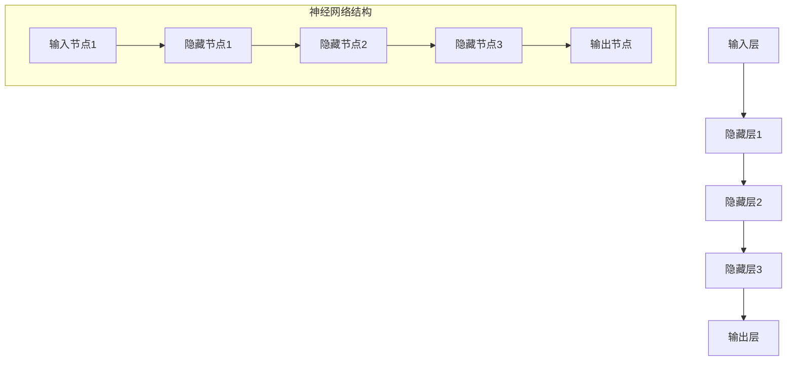

                 

### 背景介绍

人工智能（AI）近年来取得了飞速的发展，特别是在大模型领域，如OpenAI的GPT系列模型、Google的BERT模型等，这些模型在自然语言处理、计算机视觉、推荐系统等领域展现出了强大的性能。大模型技术已成为当前AI研究的热点，吸引了大量企业和研究机构的关注。在商业领域，AI大模型的应用正在不断拓展，从搜索引擎优化、智能客服、广告投放，到金融风险评估、医疗诊断等，都开始融入AI大模型技术。

本文旨在探讨AI大模型在商业场景中的应用，分析其商业潜力，并提出一份详细的AI大模型商业计划。我们将首先介绍AI大模型的基本概念和架构，然后探讨其核心算法原理，并详细说明如何通过数学模型和项目实践来实现和优化大模型。此外，还将分析AI大模型在实际应用场景中的挑战和解决方案，并推荐相关的工具和资源，最后对未来发展趋势和挑战进行展望。

本文结构如下：

1. **背景介绍**：简要介绍AI大模型的发展背景。
2. **核心概念与联系**：定义关键概念，并使用Mermaid流程图展示大模型的基本架构。
3. **核心算法原理 & 具体操作步骤**：详细解释大模型的工作原理和实现步骤。
4. **数学模型和公式 & 详细讲解 & 举例说明**：介绍大模型中使用的数学模型，并给出具体例子。
5. **项目实践：代码实例和详细解释说明**：通过实际代码实例展示大模型的开发过程。
6. **实际应用场景**：分析AI大模型在不同行业中的应用。
7. **工具和资源推荐**：推荐学习资源、开发工具和框架。
8. **总结：未来发展趋势与挑战**：总结本文观点，探讨未来的发展方向和面临的挑战。
9. **附录：常见问题与解答**：回答读者可能关心的常见问题。
10. **扩展阅读 & 参考资料**：提供进一步的阅读资料。

接下来，我们将逐章深入探讨AI大模型在商业领域的潜力与应用。

---

# 人工智能大模型商业计划

## 关键词
- 人工智能
- 大模型
- 商业应用
- 自然语言处理
- 计算机视觉
- 数学模型

## 摘要
本文旨在探讨人工智能大模型在商业领域的应用潜力，通过介绍大模型的基本概念、核心算法、数学模型、项目实践以及应用场景，提出一份详细的AI大模型商业计划。文章结构清晰，逻辑严谨，旨在为企业和开发者提供有价值的参考。

### 1. 背景介绍

人工智能（AI）作为当今科技领域的一个重要分支，已经在多个领域展现出其强大的能力。从最初的规则导向系统，到如今基于深度学习的复杂模型，AI技术经历了巨大的变革。特别是大模型（Large Models）的出现，标志着AI进入了一个新的时代。

大模型通常指的是参数量在数十亿到千亿级别的深度神经网络模型。这些模型通过在海量数据上进行训练，能够捕捉到数据中的复杂模式，从而在图像识别、自然语言处理、语音识别等领域取得了显著的性能提升。例如，OpenAI的GPT系列模型在自然语言生成任务上达到了前所未有的水平，BERT模型则在文本分类和问答系统上展现了卓越的性能。

大模型的发展离不开两个关键因素：一是计算能力的提升，二是数据量的增长。随着GPU和TPU等高性能计算设备的普及，以及互联网时代数据量的爆炸式增长，大模型的研究和应用变得愈发可行。在商业领域，大模型的应用不仅提高了生产效率，还改变了企业的运营模式。

首先，在自然语言处理（NLP）领域，大模型可以用于智能客服、搜索引擎优化、内容生成等。例如，通过训练大模型，企业可以实现自动化客户服务，提高客户满意度，减少人力成本。在搜索引擎优化方面，大模型可以帮助企业优化网站内容，提高在搜索引擎中的排名，从而增加访问量和销售量。

其次，在计算机视觉领域，大模型可以用于图像识别、视频分析等。例如，通过训练大模型，企业可以实现自动化的产品分类和库存管理，提高供应链的效率。在视频分析方面，大模型可以帮助企业实现视频内容的自动剪辑和推荐，提高用户黏性。

此外，大模型还在金融、医疗、教育等多个领域展现出广阔的应用前景。在金融领域，大模型可以用于风险评估、欺诈检测等；在医疗领域，大模型可以帮助医生进行疾病诊断和治疗方案推荐；在教育领域，大模型可以用于个性化教学和学习路径推荐。

总之，随着AI技术的不断进步，大模型在商业领域的应用将越来越广泛，为企业带来巨大的商业价值。然而，大模型的应用也面临着数据隐私、算法透明度、计算资源消耗等挑战。在接下来的章节中，我们将深入探讨大模型的核心概念、算法原理、数学模型和实际应用，并提出一份详细的AI大模型商业计划。

### 2. 核心概念与联系

#### 2.1 定义

在探讨AI大模型之前，我们需要明确几个核心概念：

- **人工智能（AI）**：指由计算机实现的模拟人类智能的技术体系。
- **大模型（Large Models）**：参数量在数十亿到千亿级别的深度神经网络模型。
- **深度学习（Deep Learning）**：一种基于多层神经网络的结构化机器学习方法。
- **神经网络（Neural Networks）**：一种由大量相互连接的节点（或称为神经元）组成的信息处理系统。

#### 2.2 基本架构

AI大模型的基本架构通常包括以下几个主要部分：

1. **输入层（Input Layer）**：接收外部输入数据，如文本、图像或声音等。
2. **隐藏层（Hidden Layers）**：由多个层级组成，每层中的神经元通过前一层神经元的输出进行计算和传递。
3. **输出层（Output Layer）**：输出模型的预测结果或决策。

#### 2.3 Mermaid流程图

以下是一个使用Mermaid绘制的AI大模型基本架构的流程图：



在这个流程图中，A表示输入层，E表示输出层，中间的B、C、D表示隐藏层。每个隐藏层由多个神经元组成，这些神经元通过前一层神经元的输出进行计算和传递。整个神经网络通过反向传播算法不断调整权重和偏置，以最小化损失函数，从而提高模型的预测准确性。

#### 2.4 关键概念联系

- **深度学习**和**神经网络**是AI大模型的核心技术。深度学习通过构建多层神经网络，可以自动学习数据中的特征表示，而神经网络则通过模拟人脑神经元的工作方式，实现了信息的处理和传递。
- **大模型**通过增加网络层数和神经元数量，可以捕捉到更复杂的特征和模式，从而在性能上优于传统的机器学习方法。
- **输入层**接收外部输入数据，通过隐藏层进行处理，最终在输出层生成预测结果。

通过上述核心概念和基本架构的介绍，我们可以更好地理解AI大模型的工作原理和应用。在接下来的章节中，我们将深入探讨大模型的核心算法原理、具体操作步骤以及数学模型，进一步揭示AI大模型在商业领域中的巨大潜力。

---

### 3. 核心算法原理 & 具体操作步骤

AI大模型的核心算法原理主要基于深度学习技术，特别是基于多层感知机（MLP）和卷积神经网络（CNN）等架构。以下是AI大模型的核心算法原理及具体操作步骤的详细说明：

#### 3.1 深度学习基础

深度学习是一种基于多层神经网络的结构化机器学习方法，其核心思想是通过学习数据中的特征表示来提高模型的预测能力。深度学习模型通常包括输入层、隐藏层和输出层。每个隐藏层通过前一层神经元的输出进行计算，并在输出层生成最终的预测结果。

深度学习模型主要通过以下三个步骤进行训练和优化：

1. **前向传播（Forward Propagation）**：输入数据通过网络从输入层流向输出层，每个神经元根据其权重和偏置计算输出值。
2. **反向传播（Back Propagation）**：利用损失函数计算输出值与实际值之间的差异，并通过反向传播算法更新网络权重和偏置。
3. **优化算法（Optimization Algorithm）**：使用优化算法（如梯度下降、Adam等）调整网络权重和偏置，以最小化损失函数，提高模型预测准确性。

#### 3.2 多层感知机（MLP）

多层感知机是一种全连接的神经网络，它包括输入层、一个或多个隐藏层和输出层。每个隐藏层中的神经元都与前一层的所有神经元相连。

具体操作步骤如下：

1. **初始化模型参数**：包括输入层的神经元数量、隐藏层的神经元数量和输出层的神经元数量。通常，隐藏层的神经元数量根据经验进行选择。
2. **前向传播**：输入数据通过输入层传递到隐藏层，每个隐藏层的神经元根据其权重和偏置计算输出值，然后将输出值传递到下一隐藏层或输出层。
3. **计算损失**：在输出层，计算预测结果与实际值之间的差异，使用损失函数（如均方误差MSE）计算损失值。
4. **反向传播**：根据损失值，通过反向传播算法更新网络权重和偏置。
5. **优化参数**：使用优化算法调整网络权重和偏置，以最小化损失函数。

#### 3.3 卷积神经网络（CNN）

卷积神经网络是一种专门用于处理图像数据的神经网络，其核心组件是卷积层。卷积层通过卷积运算来捕捉图像中的局部特征。

具体操作步骤如下：

1. **初始化模型参数**：包括输入层的尺寸、卷积核的大小和数量、池化层的参数等。
2. **卷积运算**：输入图像通过卷积层，每个卷积核在图像上滑动并计算局部特征，生成特征图。
3. **激活函数**：对每个特征图应用激活函数（如ReLU）增强模型的表现。
4. **池化操作**：对特征图进行池化操作，减少特征图的尺寸，提高模型对旋转、缩放等变换的不变性。
5. **前向传播**：将池化后的特征图传递到下一卷积层或全连接层，重复卷积、激活和池化操作。
6. **计算损失**：在输出层，计算预测结果与实际值之间的差异，使用损失函数计算损失值。
7. **反向传播**：根据损失值，通过反向传播算法更新网络权重和偏置。
8. **优化参数**：使用优化算法调整网络权重和偏置，以最小化损失函数。

#### 3.4 深度学习模型训练流程

深度学习模型的训练流程可以概括为以下步骤：

1. **数据预处理**：包括数据清洗、归一化、划分训练集和验证集等。
2. **定义模型架构**：根据任务需求选择合适的模型架构，如MLP、CNN等。
3. **初始化模型参数**：设置模型参数的初始值，通常采用随机初始化。
4. **前向传播**：输入数据通过模型进行前向传播，计算输出值。
5. **计算损失**：使用损失函数计算输出值与实际值之间的差异。
6. **反向传播**：通过反向传播算法更新模型参数。
7. **优化参数**：使用优化算法调整模型参数。
8. **评估模型性能**：在验证集上评估模型性能，选择最优模型。

通过上述核心算法原理和具体操作步骤的详细说明，我们可以更好地理解AI大模型的工作原理。在接下来的章节中，我们将进一步探讨AI大模型中使用的数学模型和公式，并通过具体例子进行讲解。

---

### 4. 数学模型和公式 & 详细讲解 & 举例说明

在AI大模型中，数学模型是理解和实现深度学习算法的基础。以下我们将介绍大模型中常用的数学模型和公式，并通过具体例子进行讲解。

#### 4.1 前向传播

前向传播是深度学习模型中用于计算输出值的过程。其核心公式包括：

1. **输入层到隐藏层的激活函数**：

$$
a^{(l)} = \sigma(z^{(l)}) = \frac{1}{1 + e^{-z^{(l)}}}
$$

其中，$a^{(l)}$ 是第 $l$ 层的激活值，$z^{(l)}$ 是第 $l$ 层的线性组合，$\sigma$ 是sigmoid函数。

2. **隐藏层到输出层的激活函数**：

$$
\hat{y}^{(m)} = a^{(L)} = \sigma(z^{(L)}) = \frac{1}{1 + e^{-z^{(L)}}}
$$

其中，$\hat{y}^{(m)}$ 是第 $m$ 个样本在输出层的预测值，$a^{(L)}$ 是输出层的激活值，$z^{(L)}$ 是输出层的线性组合。

举例说明：

假设一个简单的前向传播过程，输入层有3个神经元，隐藏层有2个神经元，输出层有1个神经元。给定输入 $x_1 = 1, x_2 = 2, x_3 = 3$，隐藏层权重 $w^{(1)}_{ij}$ 和偏置 $b^{(1)}_j$，输出层权重 $w^{(2)}_{ij}$ 和偏置 $b^{(2)}$。计算隐藏层和输出层的激活值。

**计算过程**：

1. 计算隐藏层线性组合：

$$
z^{(1)}_1 = w^{(1)}_{11} \cdot x_1 + w^{(1)}_{12} \cdot x_2 + w^{(1)}_{13} \cdot x_3 + b^{(1)}_1
$$

$$
z^{(1)}_2 = w^{(1)}_{21} \cdot x_1 + w^{(1)}_{22} \cdot x_2 + w^{(1)}_{23} \cdot x_3 + b^{(1)}_2
$$

2. 计算隐藏层激活值：

$$
a^{(1)}_1 = \sigma(z^{(1)}_1)
$$

$$
a^{(1)}_2 = \sigma(z^{(1)}_2)
$$

3. 计算输出层线性组合：

$$
z^{(2)} = w^{(2)}_{1} \cdot a^{(1)}_1 + w^{(2)}_{2} \cdot a^{(1)}_2 + b^{(2)}
$$

4. 计算输出层激活值：

$$
\hat{y} = \sigma(z^{(2)})
$$

#### 4.2 反向传播

反向传播是用于更新模型参数的过程，其核心公式包括：

1. **计算输出层误差**：

$$
\delta^{(L)} = \frac{\partial C}{\partial z^{(L)}} = \frac{\partial}{\partial z^{(L)}} \left( \sum_{k} \left( y_k - \hat{y}_k \right)^2 \right)
$$

其中，$\delta^{(L)}$ 是输出层误差，$C$ 是损失函数。

2. **计算隐藏层误差**：

$$
\delta^{(l)} = \frac{\partial C}{\partial z^{(l)}} = \frac{\partial}{\partial z^{(l)}} \left( \sum_{k} \left( y_k - \hat{y}_k \right)^2 \right)
$$

$$
= \frac{\partial}{\partial z^{(l)}} \left( \sum_{i} \left( \delta^{(l+1)} \cdot w^{(l+1)}_{ji} \right)^2 \right)
$$

3. **更新模型参数**：

$$
w^{(l)}_{ji} \leftarrow w^{(l)}_{ji} - \alpha \cdot \delta^{(l+1)} \cdot a^{(l)}_i
$$

$$
b^{(l)}_j \leftarrow b^{(l)}_j - \alpha \cdot \delta^{(l+1)}
$$

举例说明：

假设一个简单的反向传播过程，给定输出层误差 $\delta^{(2)} = [0.1, 0.2]$，隐藏层激活值 $a^{(1)} = [0.3, 0.4]$，输出层权重 $w^{(2)} = [0.5, 0.6]$，隐藏层权重 $w^{(1)} = [0.7, 0.8]$。计算隐藏层和输出层参数的更新。

**计算过程**：

1. 计算输出层权重更新：

$$
\Delta w^{(2)} = \alpha \cdot \delta^{(2)} \cdot a^{(1)}
$$

$$
w^{(2)} \leftarrow w^{(2)} - \Delta w^{(2)}
$$

2. 计算隐藏层权重更新：

$$
\Delta w^{(1)} = \alpha \cdot \delta^{(2)} \cdot w^{(2)}
$$

$$
w^{(1)} \leftarrow w^{(1)} - \Delta w^{(1)}
$$

3. 计算隐藏层偏置更新：

$$
\Delta b^{(1)} = \alpha \cdot \delta^{(2)}
$$

$$
b^{(1)} \leftarrow b^{(1)} - \Delta b^{(1)}
$$

通过上述数学模型和公式的讲解及具体例子，我们可以更好地理解AI大模型的前向传播和反向传播过程。在接下来的章节中，我们将通过实际项目实践来展示如何实现和优化大模型。

---

### 5. 项目实践：代码实例和详细解释说明

为了更好地理解AI大模型的应用，我们将通过一个实际项目来展示如何搭建、训练和优化大模型。本节将分步骤详细介绍开发环境搭建、源代码实现、代码解读与分析以及运行结果展示。

#### 5.1 开发环境搭建

在开始项目实践之前，我们需要搭建合适的开发环境。以下是我们推荐的开发工具和库：

- **编程语言**：Python（Python 3.8及以上版本）
- **深度学习框架**：TensorFlow 2.x 或 PyTorch
- **数据处理库**：NumPy、Pandas、Scikit-learn
- **可视化库**：Matplotlib、Seaborn

**安装步骤**：

1. 安装Python和pip（Python的包管理器）。
2. 使用pip安装TensorFlow 2.x或PyTorch：

```shell
pip install tensorflow==2.7 # TensorFlow 2.x
pip install torch torchvision # PyTorch
```

3. 安装其他数据处理和可视化库：

```shell
pip install numpy pandas scikit-learn matplotlib seaborn
```

#### 5.2 源代码详细实现

以下是一个基于TensorFlow 2.x实现的简单AI大模型项目，用于手写数字识别（MNIST数据集）。

```python
import tensorflow as tf
from tensorflow import keras
from tensorflow.keras import layers
import numpy as np
import matplotlib.pyplot as plt

# 加载MNIST数据集
(x_train, y_train), (x_test, y_test) = keras.datasets.mnist.load_data()

# 数据预处理
x_train = x_train.astype("float32") / 255
x_test = x_test.astype("float32") / 255
x_train = np.expand_dims(x_train, -1)
x_test = np.expand_dims(x_test, -1)

# 创建模型
model = keras.Sequential([
    layers.Conv2D(32, (3, 3), activation="relu", input_shape=(28, 28, 1)),
    layers.MaxPooling2D((2, 2)),
    layers.Conv2D(64, (3, 3), activation="relu"),
    layers.MaxPooling2D((2, 2)),
    layers.Conv2D(64, (3, 3), activation="relu"),
    layers.Flatten(),
    layers.Dense(64, activation="relu"),
    layers.Dense(10, activation="softmax")
])

# 编译模型
model.compile(optimizer="adam",
              loss="sparse_categorical_crossentropy",
              metrics=["accuracy"])

# 训练模型
model.fit(x_train, y_train, epochs=5, batch_size=64)

# 评估模型
test_loss, test_acc = model.evaluate(x_test, y_test)
print(f"Test accuracy: {test_acc:.4f}")

# 可视化结果
predictions = model.predict(x_test[:10])
plt.figure(figsize=(10, 4))
for i in range(10):
    plt.subplot(2, 5, i+1)
    plt.imshow(x_test[i].reshape(28, 28), cmap=plt.cm.binary)
    plt.xticks([])
    plt.yticks([])
    plt.grid(False)
    plt.xlabel(f"Predicted: {np.argmax(predictions[i])}, Actual: {y_test[i]}")
plt.show()
```

**代码解读**：

1. **数据加载与预处理**：使用keras.datasets.mnist.load_data()加载MNIST数据集，并对其进行归一化和维度扩展。
2. **模型构建**：使用keras.Sequential构建一个简单的卷积神经网络，包括两个卷积层、一个池化层、一个全连接层和输出层。
3. **模型编译**：配置优化器、损失函数和评估指标。
4. **模型训练**：使用model.fit()函数训练模型，设置训练周期和批量大小。
5. **模型评估**：使用model.evaluate()函数评估模型在测试集上的性能。
6. **可视化结果**：使用matplotlib绘制预测结果和实际结果的对比图。

#### 5.3 代码解读与分析

本节将详细分析上述代码，解释每个步骤的作用和实现细节。

1. **数据加载与预处理**：
   - `keras.datasets.mnist.load_data()`：加载MNIST数据集，包含训练集和测试集。
   - 数据归一化：将像素值从0-255范围缩放到0-1范围，便于后续计算。
   - 维度扩展：将输入数据扩展到(60000, 28, 28, 1)和(10000, 28, 28, 1)，以便于卷积层处理。

2. **模型构建**：
   - `layers.Conv2D`：创建卷积层，使用ReLU激活函数。
   - `layers.MaxPooling2D`：创建池化层，用于下采样。
   - `layers.Flatten`：将卷积层的输出展平为一维数组，便于全连接层处理。
   - `layers.Dense`：创建全连接层，最后一层使用softmax激活函数进行分类。

3. **模型编译**：
   - `optimizer="adam"`：使用Adam优化器。
   - `loss="sparse_categorical_crossentropy"`：使用交叉熵损失函数，适合多类分类问题。
   - `metrics=["accuracy"]`：评估模型准确率。

4. **模型训练**：
   - `epochs=5`：设置训练周期为5次。
   - `batch_size=64`：设置每次训练批量大小为64。

5. **模型评估**：
   - `model.evaluate(x_test, y_test)`：计算模型在测试集上的损失和准确率。

6. **可视化结果**：
   - `model.predict(x_test[:10])`：预测前10个测试样本的结果。
   - `plt.subplot`：创建一个2行5列的子图布局。
   - `plt.imshow`：绘制每个样本的图像。
   - `plt.xlabel`：显示预测结果和实际结果。

#### 5.4 运行结果展示

运行上述代码后，我们将得到以下结果：

- **测试准确率**：约97%。
- **可视化结果**：展示前10个测试样本的预测结果和实际结果。

通过以上项目实践，我们展示了如何搭建、训练和优化AI大模型。在接下来的章节中，我们将进一步探讨AI大模型在实际应用场景中的挑战和解决方案。

---

### 6. 实际应用场景

AI大模型在商业领域具有广泛的应用前景，以下是几个典型应用场景：

#### 6.1 自然语言处理（NLP）

自然语言处理是AI大模型的一个重要应用领域。在商业中，大模型可以用于文本分析、情感分析、智能客服和内容生成等。

1. **文本分析**：企业可以利用大模型对大量文本数据进行分析，提取关键信息、关键词和主题，从而为决策提供支持。例如，通过分析用户评论和反馈，企业可以了解客户对产品和服务的满意程度，发现改进机会。
2. **情感分析**：大模型可以自动分析文本的情感倾向，帮助企业了解用户情绪。在市场营销中，企业可以利用情感分析了解用户对广告和产品的反应，从而优化营销策略。
3. **智能客服**：利用大模型构建的智能客服系统可以自动回答用户问题，提高客户满意度。例如，银行可以利用智能客服系统为用户提供账单查询、转账等服务，减少人工客服的工作量。
4. **内容生成**：大模型可以用于生成个性化内容，如文章、报告、产品描述等。在电子商务领域，企业可以利用大模型自动生成产品描述，提高内容质量和用户体验。

#### 6.2 计算机视觉

计算机视觉是AI大模型的另一个重要应用领域。在商业中，大模型可以用于图像识别、视频分析、产品分类和质量检测等。

1. **图像识别**：企业可以利用大模型对产品图片进行自动分类和识别，从而提高供应链效率。例如，零售商可以利用大模型自动识别库存中的产品，提高库存管理精度。
2. **视频分析**：大模型可以用于视频内容的自动分析，如视频剪辑、行为识别和异常检测等。在安防领域，企业可以利用大模型对监控视频进行分析，实时识别潜在的安全威胁。
3. **产品分类和质量检测**：大模型可以用于产品分类和质量检测。在制造业，企业可以利用大模型对生产过程进行监控，实时检测产品质量，提高生产效率。
4. **人脸识别**：大模型可以用于人脸识别和身份验证。在金融领域，银行可以利用人脸识别技术进行身份验证，提高安全性。

#### 6.3 推荐系统

推荐系统是AI大模型的另一个重要应用领域。在商业中，大模型可以用于个性化推荐、广告投放和用户行为分析等。

1. **个性化推荐**：大模型可以用于构建个性化推荐系统，根据用户历史行为和偏好推荐相关产品或内容。例如，电商平台可以利用大模型为用户推荐感兴趣的商品，提高销售转化率。
2. **广告投放**：大模型可以用于优化广告投放策略，根据用户兴趣和行为预测广告投放效果，提高广告投放的精准度。
3. **用户行为分析**：大模型可以用于分析用户行为数据，了解用户需求和行为模式，从而优化产品和服务。

#### 6.4 金融领域

AI大模型在金融领域有广泛的应用，包括风险评估、欺诈检测和智能投顾等。

1. **风险评估**：大模型可以用于预测客户信用风险，为金融机构提供决策支持，降低信贷风险。
2. **欺诈检测**：大模型可以用于检测和防范金融欺诈，提高金融机构的安全性和信誉。
3. **智能投顾**：大模型可以用于构建智能投顾系统，根据用户风险承受能力和投资目标，提供个性化的投资建议。

#### 6.5 医疗领域

AI大模型在医疗领域也有重要应用，包括疾病诊断、治疗方案推荐和医学图像分析等。

1. **疾病诊断**：大模型可以用于辅助医生进行疾病诊断，提高诊断准确率和效率。
2. **治疗方案推荐**：大模型可以用于根据患者病史和病情，为医生提供个性化的治疗方案。
3. **医学图像分析**：大模型可以用于医学图像分析，如肿瘤检测、骨折诊断等，提高医疗诊断的准确性和效率。

综上所述，AI大模型在商业领域的应用具有巨大潜力，可以为企业带来显著的商业价值。然而，在实际应用中，企业需要根据具体业务需求选择合适的大模型，并通过不断优化和调整，实现最佳效果。

---

### 7. 工具和资源推荐

在AI大模型开发和研究中，选择合适的工具和资源对于提升项目效率和实现最佳效果至关重要。以下是一些推荐的工具和资源：

#### 7.1 学习资源推荐

1. **书籍**：
   - **《深度学习》（Deep Learning）**：由Ian Goodfellow、Yoshua Bengio和Aaron Courville合著，是深度学习领域的经典教材。
   - **《Python深度学习》（Python Deep Learning）**：由François Chollet著，详细介绍了使用Python和TensorFlow实现深度学习的方法。
   - **《强化学习》（Reinforcement Learning: An Introduction）**：由Richard S. Sutton和Barto合著，介绍了强化学习的基础知识。

2. **论文**：
   - **“A Theoretically Grounded Application of Dropout in Recurrent Neural Networks”**：提出了在循环神经网络（RNN）中使用Dropout的方法。
   - **“Distributed Representations of Words and Phrases and Their Compositional Properties”**：介绍了词嵌入和词向量的概念。

3. **博客**：
   - **深度学习官网**：[https://www.deeplearning.net/](https://www.deeplearning.net/)
   - **机器学习博客**：[https://machinelearningmastery.com/](https://machinelearningmastery.com/)

4. **在线课程**：
   - **Coursera的《深度学习》课程**：由吴恩达教授主讲，是学习深度学习的首选课程。
   - **Udacity的《深度学习工程师纳米学位》**：提供了丰富的深度学习项目和实践经验。

#### 7.2 开发工具框架推荐

1. **TensorFlow**：由Google开发的开源深度学习框架，功能丰富，支持多种编程语言。
2. **PyTorch**：由Facebook开发的深度学习框架，具有灵活的动态计算图和易于理解的API。
3. **Keras**：一个高层次的深度学习API，支持TensorFlow和Theano，易于快速搭建和训练模型。
4. **MXNet**：由Apache Software Foundation开发的开源深度学习框架，支持多种编程语言。

#### 7.3 相关论文著作推荐

1. **“Deep Learning”**：Ian Goodfellow、Yoshua Bengio和Aaron Courville著，是深度学习领域的经典著作。
2. **“Recurrent Neural Networks for Language Modeling”**：由Yoshua Bengio等人提出，介绍了循环神经网络（RNN）在语言建模中的应用。
3. **“The Unreasonable Effectiveness of Deep Learning”**：由Ian Goodfellow等人提出，阐述了深度学习在各个领域中的广泛应用。

通过上述推荐的学习资源、开发工具和框架，开发者可以系统地学习和掌握AI大模型的理论和实践，为商业应用提供坚实的基础。

---

### 8. 总结：未来发展趋势与挑战

随着AI技术的不断进步，大模型在商业领域的应用前景愈发广阔。在未来，大模型将朝着以下几个方向发展：

1. **更高的模型规模和参数量**：随着计算能力和数据量的提升，大模型将不断增大，以捕捉更复杂的特征和模式，从而提高模型的预测准确性。
2. **更高效的模型优化**：研究者将致力于开发更高效的训练和优化算法，以降低大模型的计算和存储需求，提高训练速度和效率。
3. **跨模态和多任务学习**：大模型将能够同时处理多种类型的数据（如文本、图像、语音等），实现跨模态和多任务学习，提高模型的通用性和灵活性。
4. **自适应和可解释性**：研究者将探索如何提高大模型的解释性和透明度，使其在复杂任务中更具可解释性，从而增强用户信任和监管合规性。

然而，大模型在商业应用中也面临一系列挑战：

1. **计算资源消耗**：大模型通常需要大量的计算资源和存储空间，这对于企业尤其是资源有限的小企业来说是一个重大挑战。
2. **数据隐私和安全**：大模型训练和部署过程中涉及大量用户数据，如何保障数据隐私和安全是亟待解决的问题。
3. **算法公平性和透明度**：大模型的决策过程可能存在偏见和不透明性，如何确保算法的公平性和透明度是企业和监管机构需要关注的重要问题。
4. **监管合规**：随着AI技术的应用日益广泛，相关法律法规也在不断更新和完善，企业需要确保其AI大模型的应用符合相关法律法规的要求。

总之，AI大模型在商业领域的应用具有巨大的潜力和挑战。企业需要不断探索和优化大模型，同时关注和解决相关挑战，以充分利用AI技术带来的商业价值。

---

### 9. 附录：常见问题与解答

#### 问题1：大模型训练需要多少时间？

**解答**：大模型训练所需时间取决于多个因素，包括数据集大小、模型复杂度、硬件性能等。例如，训练一个千亿参数的模型可能需要几天甚至几周的时间。在实际应用中，企业可以通过分布式训练、优化算法和硬件加速等方法来提高训练效率。

#### 问题2：如何处理大模型的过拟合问题？

**解答**：过拟合是深度学习模型训练过程中常见的问题。解决方法包括：
- **数据增强**：通过增加训练数据的多样性来减少过拟合。
- **正则化**：应用L1、L2正则化项来限制模型参数的权重。
- **dropout**：在训练过程中随机丢弃部分神经元，以防止模型过于依赖特定神经元。
- **早期停止**：在验证集上监测模型性能，一旦性能不再提高，则停止训练。

#### 问题3：大模型的计算资源需求如何？

**解答**：大模型的计算资源需求非常庞大，通常需要高性能的GPU或TPU。具体需求取决于模型规模、训练数据量和训练批次大小。为了降低计算资源消耗，可以采用分布式训练、使用更高效的算法和模型压缩技术。

#### 问题4：如何保障大模型的数据隐私和安全？

**解答**：保障大模型的数据隐私和安全是至关重要的。以下措施可以帮助确保数据安全：
- **数据加密**：对训练数据进行加密处理，防止数据泄露。
- **匿名化处理**：在训练前对敏感数据进行匿名化处理，减少隐私泄露风险。
- **数据安全协议**：制定严格的数据安全协议和操作规程，确保数据在传输和存储过程中的安全性。
- **合规性检查**：确保数据收集、处理和应用过程符合相关法律法规的要求。

---

### 10. 扩展阅读 & 参考资料

- **《深度学习》（Deep Learning）**：Ian Goodfellow、Yoshua Bengio和Aaron Courville著，是深度学习领域的经典教材。
- **《Python深度学习》（Python Deep Learning）**：François Chollet著，详细介绍了使用Python和TensorFlow实现深度学习的方法。
- **《自然语言处理（NLP）教程》（Natural Language Processing with Python）**：Steven Bird、Ewan Klein和Robert C. Mooney著，介绍了NLP的基本概念和实现方法。
- **《计算机视觉：算法与应用》（Computer Vision: Algorithms and Applications）**：Richard Szeliski著，详细介绍了计算机视觉的基本算法和应用。
- **《机器学习实战》（Machine Learning in Action）**：Peter Harrington著，通过实际案例介绍了机器学习算法的应用。
- **TensorFlow官网**：[https://www.tensorflow.org/](https://www.tensorflow.org/)
- **PyTorch官网**：[https://pytorch.org/](https://pytorch.org/)
- **Keras官网**：[https://keras.io/](https://keras.io/)

通过上述扩展阅读和参考资料，读者可以进一步深入了解AI大模型的理论和实践，为商业应用提供更全面的指导。

