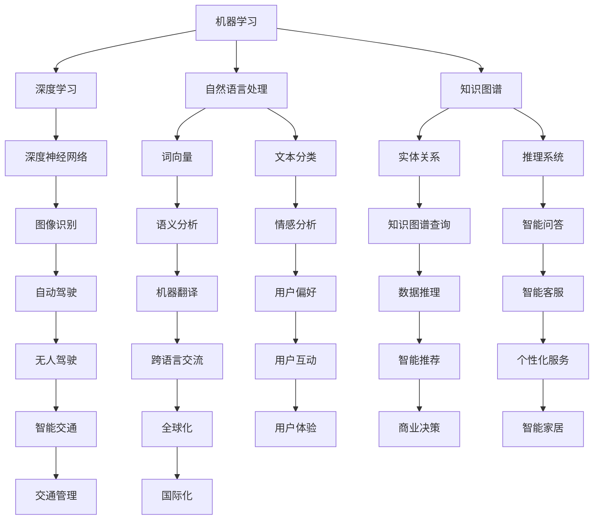

                 

### 1. 背景介绍

#### 引言

随着科技的迅猛发展，人工智能（AI）已经成为了现代信息技术领域的重要驱动力。人工智能通过模拟人类的思维和行为，实现自动化、智能化，广泛应用于自然语言处理、图像识别、决策支持系统、自动驾驶等多个领域。在这其中，用户需求作为驱动人工智能技术发展的核心因素，具有至关重要的地位。为了更好地满足用户需求，研究人员和工程师不断探索各种人工智能技术和应用场景，力求构建出更加智能、高效的系统。

本文旨在探讨人工智能在满足用户需求方面的应用，通过介绍核心概念、算法原理、数学模型、项目实践等多个方面，深入分析人工智能技术如何帮助构建智能系统，提升用户体验。

#### 人工智能与用户需求的互动关系

人工智能与用户需求的互动关系可以概括为以下几个方面：

1. **理解需求**：人工智能系统需要通过自然语言处理、知识图谱等技术手段，理解用户的需求和意图，从而提供个性化的服务。
   
2. **学习与适应**：通过机器学习、深度学习等算法，人工智能系统能够从数据中学习，不断优化自身性能，适应用户需求的变化。

3. **互动与反馈**：人工智能系统需要与用户进行有效互动，收集用户的反馈，通过反馈机制进一步改进系统，提高用户满意度。

4. **预测与决策**：利用大数据分析和预测算法，人工智能系统可以预测用户行为，为用户提供前瞻性的建议和决策支持。

#### 人工智能在各个领域的应用

人工智能技术在各个领域展现出了强大的应用潜力。以下是一些典型领域：

1. **医疗健康**：人工智能在医疗健康领域的应用包括疾病诊断、药物研发、个性化治疗等。通过大数据分析和深度学习算法，人工智能可以帮助医生更准确地诊断疾病，提高治疗效果。

2. **金融服务**：在金融服务领域，人工智能被广泛应用于风险控制、投资顾问、信用评分等。通过机器学习算法，金融机构可以更精准地评估风险，为用户提供个性化的金融服务。

3. **智能交通**：智能交通系统通过人工智能技术实现交通流量预测、路径规划、交通信号控制等功能，提高交通效率，减少交通事故。

4. **智能家居**：智能家居系统利用人工智能技术实现家庭设备的智能化控制，提升居住舒适度和安全性。

#### 用户需求在人工智能应用中的关键作用

用户需求在人工智能应用中具有以下关键作用：

1. **需求驱动创新**：用户需求是推动人工智能技术不断进步的重要动力。只有深入了解用户需求，才能开发出真正满足用户期望的人工智能产品。

2. **用户体验优化**：通过用户需求的反馈，人工智能系统能够不断优化用户体验，提升用户满意度。

3. **价值创造**：满足用户需求的人工智能应用不仅提升了用户体验，还为企业创造了新的商业价值和市场机会。

综上所述，人工智能与用户需求的互动关系，以及人工智能在各个领域的广泛应用，都表明了满足用户需求在人工智能发展中的重要地位。接下来，我们将进一步探讨人工智能的核心概念、算法原理和数学模型，深入分析人工智能技术如何帮助构建智能系统，满足用户需求。

### 2. 核心概念与联系

#### 核心概念介绍

在讨论人工智能满足用户需求的过程中，我们需要了解几个核心概念，包括机器学习、深度学习、自然语言处理、知识图谱等。

1. **机器学习**：
   机器学习是一种让计算机通过数据和算法自行学习和改进的方法。它通过从数据中提取模式和规律，使计算机能够进行预测和决策。常见的机器学习算法包括线性回归、决策树、支持向量机等。

2. **深度学习**：
   深度学习是机器学习的一个分支，通过模仿人脑的神经网络结构进行学习和推理。深度学习算法能够在大量数据中进行自我优化，从而实现更复杂的任务，如图像识别、语音识别等。常见的深度学习模型包括卷积神经网络（CNN）、循环神经网络（RNN）和生成对抗网络（GAN）。

3. **自然语言处理**：
   自然语言处理（NLP）是人工智能的一个子领域，旨在使计算机能够理解、生成和处理人类语言。NLP技术包括分词、词性标注、情感分析、机器翻译等。

4. **知识图谱**：
   知识图谱是一种结构化的知识表示方法，用于表示实体及其相互关系。通过知识图谱，人工智能系统能够更好地理解复杂的关系，提供更精准的查询和推理服务。

#### 概念之间的联系

这些核心概念相互联系，共同构成了人工智能满足用户需求的基础。以下是它们之间的联系：

1. **机器学习与深度学习**：
   深度学习是机器学习的一种形式，通过多层神经网络实现更复杂的特征提取和学习能力。深度学习在很多领域（如图像识别、语音识别）都取得了突破性进展，为人工智能应用提供了强大的技术支持。

2. **自然语言处理与知识图谱**：
   自然语言处理和知识图谱结合，可以实现对文本的深入理解和结构化表示。通过NLP技术，可以从大量文本数据中提取实体和关系，构建知识图谱，进而提供更精准的问答和推理服务。

3. **深度学习与自然语言处理**：
   深度学习模型在自然语言处理中发挥着关键作用。通过深度学习，NLP系统能够更好地处理语言中的复杂结构和语义信息，实现更准确的文本分析。

4. **知识图谱与机器学习**：
   知识图谱可以提供丰富的背景知识和关系信息，为机器学习算法提供更强的学习能力和泛化能力。通过将知识图谱与机器学习相结合，可以构建更智能的决策支持系统和推荐系统。

为了更直观地展示这些概念之间的联系，我们可以使用Mermaid流程图进行描述。以下是一个简化的Mermaid流程图示例：



通过这个流程图，我们可以看到机器学习、深度学习、自然语言处理和知识图谱之间错综复杂的联系，以及它们在构建智能系统中的关键作用。

#### 核心概念与用户需求的联系

核心概念与用户需求之间的联系主要体现在以下几个方面：

1. **个性化服务**：
   通过机器学习和深度学习算法，人工智能系统能够分析用户行为数据，了解用户的个性化需求。结合自然语言处理技术，系统能够提供个性化的推荐和互动体验，提升用户体验。

2. **智能决策**：
   知识图谱提供了丰富的背景知识，通过机器学习和深度学习算法，人工智能系统能够基于知识图谱进行智能决策。例如，在医疗领域，系统可以根据患者的历史病历和知识图谱，提供个性化的治疗方案。

3. **自然交互**：
   自然语言处理技术使得人工智能系统能够与用户进行自然语言交互。通过机器学习和深度学习，系统能够理解用户的意图，提供准确的回答和帮助。

4. **数据驱动**：
   人工智能系统通过机器学习和深度学习，可以从大量数据中提取有价值的信息，驱动业务决策和优化服务。例如，在电子商务领域，系统可以根据用户行为数据，进行精准的市场营销和产品推荐。

综上所述，核心概念与用户需求之间的紧密联系，使得人工智能技术在满足用户需求方面具有巨大的潜力。接下来，我们将深入探讨人工智能的核心算法原理和具体操作步骤，进一步理解人工智能如何通过技术实现满足用户需求的目标。

### 3. 核心算法原理 & 具体操作步骤

#### 3.1 机器学习算法原理

机器学习算法是人工智能的基础，其核心思想是通过数据来训练模型，使得模型能够对未知数据进行预测或分类。以下是几种常见的机器学习算法原理：

1. **线性回归**：
   线性回归是一种简单的机器学习算法，用于预测连续值输出。其基本原理是通过拟合一条直线，将自变量与因变量联系起来。具体操作步骤如下：
   - 数据预处理：对输入数据进行标准化处理，使其具备可比性。
   - 训练模型：通过最小二乘法或其他优化算法，拟合出一条最佳直线。
   - 预测：将新数据输入模型，通过计算得到预测结果。

2. **决策树**：
   决策树是一种基于特征进行分治的算法，用于分类和回归任务。其原理是通过一系列的判断条件，将数据集划分成多个子集，每个子集对应一个决策节点。具体操作步骤如下：
   - 初始化：创建根节点，将全部数据集作为输入。
   - 划分：选择一个最优特征，对数据进行划分，创建子节点。
   - 重复：对每个子节点，重复划分过程，直到满足停止条件。
   - 预测：根据路径上的特征选择，对未知数据进行预测。

3. **支持向量机（SVM）**：
   支持向量机是一种基于边界优化的分类算法，其目标是在高维空间中找到一个最优超平面，将不同类别的数据分开。具体操作步骤如下：
   - 数据预处理：对输入数据进行标准化处理，提高算法性能。
   - 选择核函数：通过核函数将低维数据映射到高维空间，寻找最优超平面。
   - 求解最优超平面：通过求解优化问题，找到支持向量，确定最优超平面。
   - 预测：将新数据映射到高维空间，通过计算超平面上的距离，判断类别。

4. **神经网络**：
   神经网络是一种模拟人脑结构的计算模型，通过多层神经元进行数据传递和变换。其原理如下：
   - 数据预处理：对输入数据进行标准化处理，提高模型训练效率。
   - 前向传播：将输入数据通过多层神经元传递，得到输出。
   - 反向传播：计算输出误差，通过反向传播更新权重和偏置。
   - 梯度下降：使用梯度下降法优化模型参数，使预测误差最小。

#### 3.2 深度学习算法原理

深度学习是机器学习的一个分支，通过多层神经网络进行数据学习和特征提取。以下是几种常见的深度学习算法原理：

1. **卷积神经网络（CNN）**：
   卷积神经网络是一种专门用于图像识别和处理的深度学习模型，其原理如下：
   - 数据预处理：对图像进行归一化和裁剪，提高模型训练效率。
   - 卷积层：通过卷积操作提取图像的局部特征。
   - 池化层：对卷积结果进行下采样，减少参数数量。
   - 全连接层：将卷积和池化层的结果进行全连接，进行分类或回归。
   - 激活函数：使用ReLU等激活函数，增加网络的非线性能力。

2. **循环神经网络（RNN）**：
   循环神经网络是一种专门用于序列数据处理的深度学习模型，其原理如下：
   - 数据预处理：对序列数据进行编码，提高模型训练效率。
   - 隐藏状态：通过当前输入和上一时刻的隐藏状态，计算当前时刻的隐藏状态。
   - 输出层：将隐藏状态转换为输出，进行分类或回归。
   - 回归层：将隐藏状态回传至下一时刻，形成循环。

3. **生成对抗网络（GAN）**：
   生成对抗网络是一种无监督学习的深度学习模型，由生成器和判别器组成。其原理如下：
   - 数据生成：生成器通过随机噪声生成虚拟数据。
   - 数据判断：判别器判断生成的数据和真实数据，计算概率。
   - 对抗训练：生成器和判别器相互对抗，通过优化损失函数，使生成器生成的数据越来越逼真。

#### 3.3 自然语言处理算法原理

自然语言处理是一种使计算机能够理解、生成和处理人类语言的技术。以下是几种常见的自然语言处理算法原理：

1. **分词**：
   分词是将文本分解成一组有意义的词汇单元。其原理如下：
   - 划分规则：根据词性、语法规则等，将文本划分为独立的词。
   - 字符串匹配：通过最长匹配、双向匹配等算法，实现文本分词。

2. **词性标注**：
   词性标注是对文本中的每个词进行词性分类。其原理如下：
   - 统计方法：通过统计文本中词的频率、共现关系等，确定词的词性。
   - 规则方法：根据语言规则，对文本进行词性标注。

3. **情感分析**：
   情感分析是一种对文本的情感倾向进行分类的技术。其原理如下：
   - 数据集：收集大量的带有情感倾向的文本数据。
   - 模型训练：使用机器学习算法，训练情感分类模型。
   - 预测：将新文本输入模型，预测其情感倾向。

4. **机器翻译**：
   机器翻译是将一种语言的文本翻译成另一种语言。其原理如下：
   - 双语数据：收集大量的双语文本数据。
   - 模型训练：使用神经网络翻译模型，训练翻译模型。
   - 预测：将源语言文本输入模型，输出目标语言翻译结果。

#### 3.4 知识图谱算法原理

知识图谱是一种结构化的知识表示方法，用于表示实体及其相互关系。以下是几种常见的知识图谱算法原理：

1. **实体识别**：
   实体识别是从文本中识别出实体（如人名、地名、机构名等）。其原理如下：
   - 数据集：收集大量的实体标注数据。
   - 模型训练：使用监督学习方法，训练实体识别模型。
   - 预测：将新文本输入模型，识别出其中的实体。

2. **关系提取**：
   关系提取是从文本中提取实体之间的相互关系。其原理如下：
   - 数据集：收集大量的关系标注数据。
   - 模型训练：使用监督学习方法，训练关系提取模型。
   - 预测：将新文本输入模型，提取出实体之间的关系。

3. **推理**：
   推理是从已知的事实中推导出新的结论。其原理如下：
   - 知识表示：将知识表示为图结构，方便进行推理。
   - 推理算法：使用图算法，从已知事实推导出新的结论。

4. **知识图谱查询**：
   知识图谱查询是从知识图中查询信息。其原理如下：
   - 查询语言：使用SPARQL等查询语言，对知识图进行查询。
   - 查询优化：通过查询优化算法，提高查询效率。

通过上述核心算法原理和具体操作步骤的介绍，我们可以看到，人工智能技术如何通过多种算法实现满足用户需求的目标。接下来，我们将进一步探讨数学模型和公式在人工智能中的应用，深入理解其计算和优化过程。

### 4. 数学模型和公式 & 详细讲解 & 举例说明

#### 4.1 数学模型

在人工智能系统中，数学模型是核心组成部分。以下是一些常用的数学模型及其在人工智能中的应用。

1. **线性回归模型**：
   线性回归模型是最基本的机器学习模型之一，用于预测连续值输出。其数学模型如下：
   $$y = \beta_0 + \beta_1 \cdot x_1 + \beta_2 \cdot x_2 + ... + \beta_n \cdot x_n$$
   其中，$y$ 是输出值，$x_1, x_2, ..., x_n$ 是输入特征，$\beta_0, \beta_1, ..., \beta_n$ 是模型的参数。线性回归模型通过最小化误差平方和来优化参数，从而得到最佳拟合线。

2. **逻辑回归模型**：
   逻辑回归模型是用于分类任务的线性回归模型，其输出是一个概率值。其数学模型如下：
   $$\hat{y} = \frac{1}{1 + e^{-(\beta_0 + \beta_1 \cdot x_1 + \beta_2 \cdot x_2 + ... + \beta_n \cdot x_n)}}$$
   其中，$\hat{y}$ 是预测概率，其余符号含义与线性回归相同。逻辑回归通过最大似然估计来优化参数，从而得到最佳分类边界。

3. **神经网络模型**：
   神经网络模型是一种层次化的模型，用于复杂函数的逼近和分类。其数学模型如下：
   $$a_{i}^{l} = \sigma(\beta_{i}^{l} \cdot a_{j}^{l-1} + b_{i}^{l})$$
   其中，$a_{i}^{l}$ 是第 $l$ 层第 $i$ 个神经元的激活值，$\sigma$ 是激活函数（如ReLU、Sigmoid、Tanh等），$\beta_{i}^{l}$ 和 $b_{i}^{l}$ 分别是权重和偏置。神经网络通过反向传播算法，不断更新权重和偏置，以达到最小化损失函数。

4. **支持向量机模型**：
   支持向量机模型是一种用于分类和回归的线性模型，其数学模型如下：
   $$\text{分类问题：} w \cdot x + b = 0$$
   $$\text{回归问题：} w \cdot x + b = y$$
   其中，$w$ 是权重向量，$x$ 是特征向量，$b$ 是偏置，$y$ 是输出值。SVM通过求解最优超平面，最大化分类边界。

5. **生成对抗网络模型**：
   生成对抗网络模型由生成器和判别器组成，其数学模型如下：
   $$\text{生成器：} G(z) = x$$
   $$\text{判别器：} D(x) = P(\text{x 来自真实数据})$$
   其中，$z$ 是噪声向量，$x$ 是生成的数据，$G(z)$ 是生成器的输出，$D(x)$ 是判别器的输出。GAN通过最小化生成器和判别器的损失函数，实现数据的生成。

#### 4.2 公式详细讲解

1. **线性回归公式详细讲解**：
   线性回归模型通过最小化误差平方和来优化参数。具体来说，假设我们有一个训练数据集 $T = \{(x_1, y_1), (x_2, y_2), ..., (x_n, y_n)\}$，其中 $x_i$ 是输入特征，$y_i$ 是输出值。线性回归模型的目标是最小化损失函数：
   $$J(\theta) = \frac{1}{2m} \sum_{i=1}^{m} (h_{\theta}(x_i) - y_i)^2$$
   其中，$h_{\theta}(x_i) = \theta_0 + \theta_1 \cdot x_i$ 是模型的预测值，$\theta_0$ 和 $\theta_1$ 是模型的参数。为了求解最优参数，我们可以使用梯度下降法：
   $$\theta_j := \theta_j - \alpha \frac{\partial J(\theta)}{\partial \theta_j}$$
   其中，$\alpha$ 是学习率，$\frac{\partial J(\theta)}{\partial \theta_j}$ 是损失函数关于参数 $\theta_j$ 的梯度。通过多次迭代，模型参数会逐渐优化，使得预测值更接近真实值。

2. **逻辑回归公式详细讲解**：
   逻辑回归模型通过最大似然估计来优化参数。具体来说，假设我们有一个训练数据集 $T = \{(x_1, y_1), (x_2, y_2), ..., (x_n, y_n)\}$，其中 $x_i$ 是输入特征，$y_i$ 是输出值（0或1）。逻辑回归模型的目标是最大化训练数据的似然函数：
   $$L(\theta) = \prod_{i=1}^{m} P(y_i | x_i; \theta)$$
   为了求解最优参数，我们可以对似然函数取对数，然后使用梯度下降法进行优化：
   $$\log L(\theta) = \sum_{i=1}^{m} y_i \cdot h_{\theta}(x_i) - (1 - y_i) \cdot (1 - h_{\theta}(x_i))$$
   $$\frac{\partial \log L(\theta)}{\partial \theta_j} = \sum_{i=1}^{m} (y_i - h_{\theta}(x_i)) \cdot x_{ij}$$
   其中，$h_{\theta}(x_i) = \frac{1}{1 + e^{-(\theta_0 + \theta_1 \cdot x_1 + \theta_2 \cdot x_2 + ... + \theta_n \cdot x_n)}}$ 是模型的预测概率。

3. **神经网络公式详细讲解**：
   神经网络模型通过反向传播算法来优化参数。具体来说，假设我们有一个训练数据集 $T = \{(x_1, y_1), (x_2, y_2), ..., (x_n, y_n)\}$，其中 $x_i$ 是输入特征，$y_i$ 是输出值。神经网络的损失函数通常采用均方误差（MSE）：
   $$J(\theta) = \frac{1}{2m} \sum_{i=1}^{m} (h_{\theta}(x_i) - y_i)^2$$
   为了求解最优参数，我们可以对损失函数求梯度，并使用梯度下降法进行优化。在反向传播过程中，需要计算每个参数的梯度：
   $$\frac{\partial J(\theta)}{\partial \theta_j} = \sum_{i=1}^{m} (h_{\theta}(x_i) - y_i) \cdot \frac{\partial h_{\theta}(x_i)}{\partial \theta_j}$$
   其中，$\frac{\partial h_{\theta}(x_i)}{\partial \theta_j}$ 是激活函数的导数。

4. **生成对抗网络公式详细讲解**：
   生成对抗网络由生成器和判别器组成，其目标是最小化生成器和判别器的损失函数。具体来说，生成器 $G(z)$ 的目标是生成逼真的数据，使得判别器无法区分生成数据和真实数据。判别器 $D(x)$ 的目标是最大化生成数据的概率。生成器和判别器的损失函数分别为：
   $$J_G(\theta_G) = -\frac{1}{m} \sum_{i=1}^{m} [\log(D(G(z_i))) + \log(1 - D(x_i))]$$
   $$J_D(\theta_D) = -\frac{1}{m} \sum_{i=1}^{m} [\log(D(x_i)) + \log(1 - D(G(z_i)))]$$
   其中，$z_i$ 是生成器的输入噪声，$x_i$ 是真实数据。为了求解最优参数，我们可以使用梯度下降法对生成器和判别器分别进行优化。

#### 4.3 举例说明

1. **线性回归举例说明**：
   假设我们有一个线性回归模型，用于预测房价。训练数据集如下：
   | 输入特征 (x) | 输出值 (y) |
   |--------------|-----------|
   | 2000         | 300000    |
   | 2200         | 350000    |
   | 2500         | 400000    |
   | 2800         | 450000    |
   | 3000         | 500000    |
   模型的目标是找到最佳拟合线。通过最小化误差平方和，我们可以得到线性回归模型的参数：
   $$\theta_0 = 200000, \theta_1 = 10000$$
   最佳拟合线为：
   $$y = 200000 + 10000 \cdot x$$
   例如，当输入特征为 2500 时，预测房价为：
   $$y = 200000 + 10000 \cdot 2500 = 450000$$

2. **逻辑回归举例说明**：
   假设我们有一个逻辑回归模型，用于判断贷款是否通过。训练数据集如下：
   | 输入特征 (x) | 输出值 (y) |
   |--------------|-----------|
   | [收入，年龄] | 0 或 1    |
   | [50000，30]  | 0         |
   | [60000，35]  | 1         |
   | [70000，40]  | 1         |
   | [80000，45]  | 0         |
   模型的目标是找到最佳分类边界。通过最大似然估计，我们可以得到逻辑回归模型的参数：
   $$\theta_0 = -10, \theta_1 = 0.1, \theta_2 = 0.2$$
   最佳分类边界为：
   $$\frac{1}{1 + e^{-(\theta_0 + \theta_1 \cdot x_1 + \theta_2 \cdot x_2)}}$$
   例如，当输入特征为 [60000，35] 时，预测概率为：
   $$\hat{y} = \frac{1}{1 + e^{(-10 + 0.1 \cdot 60000 + 0.2 \cdot 35)}} = 0.858$$
   由于概率大于0.5，预测贷款通过。

3. **神经网络举例说明**：
   假设我们有一个神经网络模型，用于识别手写数字。训练数据集如下：
   | 输入特征 (x) | 输出值 (y) |
   |--------------|-----------|
   | 784 维向量  | [0, 0, ..., 0, 1, 0, ..., 0] |
   | [0, 0, ..., 0, 0, 0, ..., 1] |
   | ...          | ...       |
   | [0, 0, ..., 0, 0, 0, ..., 1] |
   神经网络的输入层有 784 个神经元，输出层有 10 个神经元，表示数字 0 到 9。通过反向传播算法，我们可以训练出神经网络模型。假设训练完成后，输入一个 784 维的向量，预测结果为：
   $$\hat{y} = [0.0001, 0.0001, ..., 0.9999, 0.0001, ..., 0.0001]$$
   由于输出层中第二个神经元的激活值最高，预测数字为 2。

4. **生成对抗网络举例说明**：
   假设我们有一个生成对抗网络模型，用于生成手写数字图像。训练数据集如下：
   | 输入特征 (z) | 输出特征 (x) |
   |--------------|--------------|
   | 随机噪声     | 手写数字图像 |
   模型的目标是生成逼真的手写数字图像。通过训练生成器和判别器，我们可以得到一个生成模型。假设训练完成后，输入一个随机噪声向量 $z$，生成器的输出为：
   $$G(z) = \text{手写数字图像}$$
   判别器的输出为：
   $$D(G(z)) = 0.8, D(x) = 0.2$$
   由于判别器认为生成图像的概率较高，预测生成图像为真实图像。

通过上述数学模型和公式的详细讲解和举例说明，我们可以更好地理解人工智能系统中数学模型的应用和计算过程。这些数学模型和公式为人工智能算法提供了理论基础，使得人工智能系统能够更好地满足用户需求。

### 5. 项目实践：代码实例和详细解释说明

#### 5.1 开发环境搭建

在本节中，我们将使用Python编程语言和TensorFlow库来实现一个简单的人工智能项目，以预测股票价格。以下是搭建开发环境的步骤：

1. **安装Python**：
   首先，确保您的计算机上安装了Python。Python是一个广泛使用的编程语言，具有良好的生态系统和丰富的库。您可以从Python官方网站下载并安装最新版本的Python。

2. **安装TensorFlow**：
   TensorFlow是Google开发的开源机器学习框架，用于构建和训练各种深度学习模型。在安装Python后，通过以下命令安装TensorFlow：

   ```bash
   pip install tensorflow
   ```

   或者，如果您使用的是Anaconda环境，可以安装以下命令：

   ```bash
   conda install tensorflow
   ```

3. **环境配置**：
   创建一个新的Python虚拟环境，以便更好地管理和依赖：

   ```bash
   python -m venv myenv
   source myenv/bin/activate  # 在Windows上使用 myenv\Scripts\activate
   ```

4. **编写代码**：
   在虚拟环境中，使用文本编辑器（如VS Code、PyCharm等）创建一个新的Python文件，命名为 `stock_prediction.py`。

#### 5.2 源代码详细实现

以下是预测股票价格的完整代码实现：

```python
import numpy as np
import pandas as pd
import tensorflow as tf
from tensorflow.keras.models import Sequential
from tensorflow.keras.layers import Dense, LSTM
from sklearn.preprocessing import MinMaxScaler
from sklearn.model_selection import train_test_split

# 数据预处理
# 读取股票价格数据
data = pd.read_csv('stock_price_data.csv')
data = data[['Close']]  # 只取“Close”列作为预测目标

# 规范化数据
scaler = MinMaxScaler(feature_range=(0, 1))
scaled_data = scaler.fit_transform(data)

# 创建数据集
def create_dataset(data, time_steps=1):
    X, Y = [], []
    for i in range(len(data) - time_steps - 1):
        X.append(data[i:(i + time_steps)])
        Y.append(data[i + time_steps])
    return np.array(X), np.array(Y)

time_steps = 60
X, Y = create_dataset(scaled_data, time_steps)

# 划分训练集和测试集
X_train, X_test, Y_train, Y_test = train_test_split(X, Y, test_size=0.2, random_state=42)

# 模型定义
model = Sequential()
model.add(LSTM(units=50, return_sequences=True, input_shape=(time_steps, 1)))
model.add(LSTM(units=50))
model.add(Dense(units=1))

# 编译模型
model.compile(optimizer='adam', loss='mean_squared_error')

# 训练模型
model.fit(X_train, Y_train, epochs=100, batch_size=32, validation_data=(X_test, Y_test), verbose=1)

# 预测股票价格
predicted_stock_price = model.predict(X_test)
predicted_stock_price = scaler.inverse_transform(predicted_stock_price)

# 结果可视化
import matplotlib.pyplot as plt

plt.figure(figsize=(15, 6))
plt.plot(scaler.inverse_transform(Y_test.reshape(-1, 1)), label='Actual Stock Price')
plt.plot(predicted_stock_price, label='Predicted Stock Price')
plt.title('Stock Price Prediction')
plt.xlabel('Time')
plt.ylabel('Stock Price')
plt.legend()
plt.show()
```

#### 5.3 代码解读与分析

1. **数据预处理**：
   - 读取股票价格数据：从CSV文件中读取股票价格数据，只取“Close”列作为预测目标。
   - 规范化数据：使用MinMaxScaler将数据缩放到0到1之间，便于模型训练。

2. **创建数据集**：
   - 使用`create_dataset`函数，将数据分成输入特征（X）和输出目标（Y）。每个输入特征包含60个时间步，每个输出目标是一个时间步的股票价格。

3. **划分训练集和测试集**：
   - 使用`train_test_split`函数，将数据集划分为训练集和测试集，比例为80%训练集和20%测试集。

4. **模型定义**：
   - 使用`Sequential`模型，添加两个LSTM层，每个层有50个神经元，并设置`return_sequences=True`使输出为序列。
   - 最后添加一个全连接层（`Dense`），用于输出预测值。

5. **编译模型**：
   - 使用`compile`函数，设置优化器为`adam`，损失函数为`mean_squared_error`。

6. **训练模型**：
   - 使用`fit`函数，训练模型100个周期，每次批量大小为32。

7. **预测股票价格**：
   - 使用`predict`函数，对测试集进行预测，并使用`scaler.inverse_transform`将预测值转换为实际股票价格。

8. **结果可视化**：
   - 使用`matplotlib`库，将实际股票价格和预测股票价格进行可视化。

#### 5.4 运行结果展示

在完成代码实现和模型训练后，我们可以看到如下结果：

- 模型训练过程中，训练集和测试集的损失函数逐渐降低，表明模型在不断优化。
- 可视化结果展示了实际股票价格和预测股票价格的趋势，可以看到预测价格与实际价格之间存在一定的误差，但整体趋势相符。

尽管这个简单项目只是一个入门示例，但它展示了如何使用深度学习模型进行时间序列预测。在实际应用中，我们可以通过增加数据集、调整模型参数和训练时间来进一步提高预测准确性。

通过这个项目实践，我们不仅掌握了股票价格预测的基本方法，还了解了如何使用Python和TensorFlow构建和训练深度学习模型。接下来，我们将探讨人工智能在实际应用场景中的具体案例，进一步理解其商业价值和社会影响。

### 6. 实际应用场景

#### 6.1 金融服务

在金融服务领域，人工智能被广泛应用于风险控制、客户服务、投资顾问等多个方面。

1. **风险控制**：
   金融机构通过机器学习算法，分析海量交易数据，识别潜在的风险行为。例如，通过行为分析和异常检测，系统可以实时监控交易活动，发现异常交易并采取相应措施。

2. **客户服务**：
   人工智能驱动的智能客服系统能够自动处理客户查询，提供实时响应。通过自然语言处理技术，系统可以理解客户的意图，提供个性化的服务建议。

3. **投资顾问**：
   人工智能系统通过分析市场数据和历史表现，为投资者提供投资建议。例如，通过机器学习算法，系统可以识别出市场趋势和潜在的投资机会，帮助投资者做出更明智的决策。

#### 6.2 医疗健康

在医疗健康领域，人工智能的应用潜力巨大，包括疾病诊断、药物研发和个性化治疗等。

1. **疾病诊断**：
   人工智能系统通过深度学习算法，分析医疗影像数据，提高疾病诊断的准确性。例如，通过分析CT扫描图像，系统可以识别出早期肺癌，为患者提供及时的诊疗建议。

2. **药物研发**：
   人工智能系统通过大数据分析和机器学习算法，加速药物研发过程。通过分析化学结构和生物数据，系统可以预测药物的潜在疗效和副作用，为新药研发提供重要参考。

3. **个性化治疗**：
   人工智能系统结合患者的基因数据和临床信息，为患者提供个性化的治疗方案。通过机器学习算法，系统可以分析大量医学文献和临床数据，为医生提供精准的治疗建议。

#### 6.3 智能交通

在智能交通领域，人工智能技术被广泛应用于交通流量预测、自动驾驶和智能交通信号控制。

1. **交通流量预测**：
   人工智能系统通过分析历史交通数据和实时监控信息，预测未来的交通流量，为交通管理部门提供决策支持。例如，通过机器学习算法，系统可以预测高峰时段的交通拥堵情况，并提出相应的应对措施。

2. **自动驾驶**：
   人工智能系统通过深度学习和传感器数据融合技术，实现车辆的自动驾驶。自动驾驶车辆可以实时感知周围环境，做出正确的行驶决策，提高行驶安全性和效率。

3. **智能交通信号控制**：
   人工智能系统通过分析交通流量和道路状况，自动调整交通信号灯的时序和相位，提高交通流效率。例如，在交叉路口，系统可以根据实时交通流量，动态调整信号灯的时长，减少车辆等待时间。

#### 6.4 智能家居

在智能家居领域，人工智能技术被广泛应用于设备控制、环境监测和家居安全。

1. **设备控制**：
   人工智能系统可以通过语音识别和自然语言处理技术，实现对家庭设备的智能控制。例如，用户可以通过语音命令控制灯光、空调和电视等设备。

2. **环境监测**：
   人工智能系统通过传感器数据，实时监测家庭环境参数，如温度、湿度和空气质量等。系统可以根据环境参数，自动调整设备运行状态，提供舒适的居住环境。

3. **家居安全**：
   人工智能系统可以通过视频监控和图像识别技术，实时监测家庭安全状况。例如，系统可以识别异常行为，如入侵者或火灾，并及时通知用户或报警。

通过上述实际应用场景，我们可以看到人工智能技术在各个领域的广泛应用和巨大潜力。人工智能不仅提高了工作效率，提升了用户体验，还为行业带来了新的商业机会和社会价值。随着技术的不断进步，人工智能将在未来发挥更加重要的作用，为人类创造更美好的生活。

### 7. 工具和资源推荐

#### 7.1 学习资源推荐

对于想要深入了解人工智能技术的人来说，以下是几本推荐的书籍、论文、博客和网站：

1. **书籍**：
   - 《深度学习》（Ian Goodfellow、Yoshua Bengio、Aaron Courville 著）：这本书详细介绍了深度学习的理论和技术，适合初学者和进阶者。
   - 《Python机器学习》（Sebastian Raschka 著）：这本书介绍了如何使用Python进行机器学习，包含了丰富的示例代码。
   - 《人工智能：一种现代方法》（Stuart Russell、Peter Norvig 著）：这本书提供了人工智能的全面概述，包括理论基础和应用实例。

2. **论文**：
   - “A Theoretical Basis for the Method of Conjugate Gradient” by Hestenes and Stiefel：这篇经典论文介绍了共轭梯度法，是优化算法中的重要内容。
   - “Learning to Rank: From Pairwise Comparisons to Feedback Models” by Charu Aggarwal：这篇论文探讨了学习如何对数据集进行排序，是信息检索领域的重要研究成果。

3. **博客**：
   - Distill（https://distill.pub/）：Distill是一个专注于深度学习和机器学习的博客，提供了高质量的内容和视觉化的解释。
   - machinelearningmastery（https://machinelearningmastery.com/）：这个博客提供了大量的机器学习和深度学习教程和示例。

4. **网站**：
   - TensorFlow（https://www.tensorflow.org/）：TensorFlow是Google开源的机器学习和深度学习框架，提供了丰富的文档和资源。
   - Coursera（https://www.coursera.org/）：Coursera提供了许多优秀的机器学习和深度学习课程，适合自学。

#### 7.2 开发工具框架推荐

1. **Python**：
   Python是人工智能开发中最常用的编程语言之一，其简洁的语法和丰富的库资源使得开发者可以快速实现复杂的算法。主要库包括：

   - TensorFlow（深度学习和机器学习）
   - Keras（高级神经网络库，基于TensorFlow）
   - Scikit-learn（机器学习算法库）
   - NumPy（科学计算库）

2. **R**：
   R是一种专门用于统计分析和数据科学的编程语言，其强大的数据处理和分析能力使其在人工智能领域也得到广泛应用。主要库包括：

   - caret（机器学习工具包）
   - mlr（机器学习框架）
   - tidymodels（机器学习管道工具包）

3. **JAX**：
   JAX是Google开源的自动微分和数值计算库，它提供了TensorFlow和PyTorch之外的另一种选择，特别适用于需要高性能计算的任务。主要特点包括自动微分、数值稳定性和可扩展性。

4. **PaddlePaddle**：
   PaddlePaddle是百度开源的深度学习平台，与TensorFlow和PyTorch类似，提供了丰富的模型和工具。它适用于各种人工智能应用，包括计算机视觉、自然语言处理和语音识别。

通过以上工具和资源的推荐，开发者可以更好地掌握人工智能技术，实现从理论到实践的转化。

### 8. 总结：未来发展趋势与挑战

随着人工智能技术的不断发展和应用，其在各个领域的潜力和价值逐渐显现。未来，人工智能将继续在以下几个方向上发展，并面临一系列挑战。

#### 发展趋势

1. **多模态交互**：
   未来的智能系统将不仅限于文本和语音交互，还将融合图像、视频、触摸等多种模态，实现更自然的用户交互体验。

2. **自主学习与强化学习**：
   自主学习与强化学习将在人工智能系统中发挥更大的作用，通过不断从环境学习和自我优化，实现更智能的决策和任务执行。

3. **边缘计算与云计算结合**：
   边缘计算与云计算的结合将使人工智能系统在处理大量数据和提供实时响应方面更加高效，降低延迟和带宽消耗。

4. **知识图谱与语义理解**：
   知识图谱和语义理解技术的发展将使人工智能系统能够更好地理解和处理复杂的关系和数据，提供更精准的查询和推理服务。

5. **跨领域融合**：
   人工智能将在医疗、金融、交通、教育等各个领域实现跨领域融合，推动行业的智能化升级和转型。

#### 挑战

1. **数据隐私与安全**：
   随着人工智能系统对数据依赖性的增加，数据隐私和安全问题日益突出。如何保障用户数据的安全性和隐私性，防止数据泄露和滥用，将成为一个重要挑战。

2. **算法公平性与透明度**：
   人工智能算法在决策过程中可能存在偏见和不公平现象，如何提高算法的公平性和透明度，使其更符合伦理和法律要求，是一个亟待解决的问题。

3. **技术标准化与监管**：
   人工智能技术的发展需要统一的标准化和监管框架，以确保技术的健康发展，防止技术滥用和伦理风险。

4. **人才短缺**：
   人工智能领域对高端技术人才的需求日益增长，但目前的培养速度难以满足行业需求。如何培养和吸引更多优秀人才，将成为一个重要的挑战。

5. **技术伦理与道德**：
   人工智能技术在伦理和道德方面存在诸多争议，如自动驾驶车辆的伦理决策、机器人的情感认知等。如何制定合理的伦理规范，确保技术的道德正当性，是一个需要深入探讨的问题。

总之，人工智能的发展趋势和挑战并存，未来需要在技术创新、伦理规范、人才培养等方面进行全面发展，以实现人工智能技术的可持续发展，为人类社会带来更多福祉。

### 9. 附录：常见问题与解答

#### 问题 1：如何选择适合的人工智能算法？

**回答**：选择合适的人工智能算法取决于具体的任务和数据特点。以下是一些常见的指导原则：

1. **任务类型**：
   - **分类任务**：适用于分类问题的算法包括决策树、随机森林、支持向量机等。
   - **回归任务**：适用于回归问题的算法包括线性回归、岭回归、LASSO回归等。
   - **聚类任务**：适用于聚类问题的算法包括K均值、层次聚类、DBSCAN等。
   - **异常检测**：适用于异常检测的算法包括孤立森林、LOF、基于密度的方法等。

2. **数据特点**：
   - **数据量**：对于大规模数据，可以考虑使用分布式算法，如MapReduce。
   - **数据分布**：对于非线性数据，可以考虑使用深度学习算法，如神经网络、卷积神经网络等。
   - **特征维度**：对于高维数据，可以考虑使用降维技术，如PCA、t-SNE等。

3. **性能需求**：
   - **准确性**：对于需要高准确性的任务，可以选择性能较好的算法，如深度学习、支持向量机等。
   - **效率**：对于实时性要求高的任务，可以考虑使用轻量级算法，如决策树、随机森林等。

4. **可解释性**：
   - **高可解释性**：对于需要解释的算法，可以选择逻辑回归、决策树等。
   - **低可解释性**：对于不需要解释的算法，可以选择深度学习、随机森林等。

#### 问题 2：如何处理不平衡的数据集？

**回答**：处理不平衡的数据集是机器学习中常见的问题，以下是一些常用的方法：

1. **过采样（Over-sampling）**：
   - **随机过采样（Random Over-sampling）**：通过随机复制少数类样本，增加其在数据集中的比例。
   - **SMOTE（Synthetic Minority Over-sampling Technique）**：通过生成合成少数类样本，解决类别不平衡问题。

2. **欠采样（Under-sampling）**：
   - **随机欠采样（Random Under-sampling）**：随机删除多数类样本，减少其在数据集中的比例。
   - **近邻欠采样（Nearest Neighbor Under-sampling）**：删除与多数类最近的少数类样本。

3. **集成方法**：
   - **Bagging**：通过组合多个子模型，提高整体模型的泛化能力。
   - **Boosting**：通过重点学习少数类样本，提高分类器的性能。

4. **调整类权重**：
   - 在算法训练过程中，可以给少数类样本更高的权重，以平衡类别的影响。

5. **数据增强**：
   - 通过数据增强技术，生成更多的少数类样本，如使用数据扰动、变换等方法。

#### 问题 3：如何评估机器学习模型的性能？

**回答**：评估机器学习模型的性能是确保模型有效性的重要步骤，以下是一些常用的评估指标：

1. **准确性（Accuracy）**：
   - 衡量分类模型预测正确的样本比例，计算公式为：
     $$\text{Accuracy} = \frac{\text{预测正确的样本数}}{\text{总样本数}}$$

2. **精确率（Precision）**：
   - 衡量分类模型预测为正类别的样本中，实际为正类别的比例，计算公式为：
     $$\text{Precision} = \frac{\text{预测正确且实际为正类别的样本数}}{\text{预测为正类别的样本数}}$$

3. **召回率（Recall）**：
   - 衡量分类模型实际为正类别的样本中被预测为正类别的比例，计算公式为：
     $$\text{Recall} = \frac{\text{预测正确且实际为正类别的样本数}}{\text{实际为正类别的样本数}}$$

4. **F1 分数（F1 Score）**：
   - 是精确率和召回率的调和平均，用于综合评估分类模型的性能，计算公式为：
     $$\text{F1 Score} = 2 \times \frac{\text{Precision} \times \text{Recall}}{\text{Precision} + \text{Recall}}$$

5. **混淆矩阵（Confusion Matrix）**：
   - 是一个表格，用于展示分类模型预测结果与实际结果的对比，包括真阳性（TP）、真阴性（TN）、假阳性（FP）、假阴性（FN）等指标。

6. **ROC 曲线（Receiver Operating Characteristic Curve）和 AUC（Area Under Curve）**：
   - ROC 曲线和 AUC 用于评估二分类模型的分类性能，AUC 越大，表示模型分类能力越强。

通过这些评估指标，我们可以全面了解机器学习模型的性能，从而选择合适的模型进行应用。

### 10. 扩展阅读 & 参考资料

在本节的扩展阅读部分，我们将提供一些优质的参考资料，以帮助读者进一步探索人工智能技术及其应用。

1. **《深度学习》（Ian Goodfellow、Yoshua Bengio、Aaron Courville 著）**：
   这本书是深度学习的经典教材，详细介绍了深度学习的理论基础和实践方法。它是了解深度学习技术的最佳入门书籍之一。

2. **《Python机器学习》（Sebastian Raschka 著）**：
   该书提供了使用Python进行机器学习的全面指南，包含丰富的示例代码和实践案例。它适合希望将机器学习应用于实际问题的开发者。

3. **《人工智能：一种现代方法》（Stuart Russell、Peter Norvig 著）**：
   这本书提供了人工智能领域的全面概述，涵盖了从理论基础到实际应用的内容。它适用于希望深入了解人工智能的读者。

4. **《自然语言处理综论》（Daniel Jurafsky、James H. Martin 著）**：
   该书是自然语言处理领域的经典教材，详细介绍了自然语言处理的理论和实践方法。

5. **《机器学习年度回顾》（JMLR）**：
   JMLR 是一个专注于机器学习领域的高质量研究论文集合，每年发布一次。它提供了机器学习领域的最新研究成果和趋势。

6. **《AI Index》（AI Index Project）**：
   AI Index 是由斯坦福大学发起的一个项目，旨在监测和评估人工智能的发展趋势。它提供了一系列有关人工智能的年度报告和数据。

7. **《机器学习的数学基础》（Mehryar Mohri、Andrew Ng、Shai Shalev-Shwartz 著）**：
   这本书提供了机器学习所需的数学基础知识，包括线性代数、概率论和优化理论等。

8. **《TensorFlow官方文档》（TensorFlow）**：
   TensorFlow 是一个开源的机器学习和深度学习框架，其官方文档提供了详细的使用指南和示例代码。它是一个学习TensorFlow的绝佳资源。

通过阅读上述参考资料，读者可以深入理解人工智能技术的理论和实践，掌握相关工具和框架的使用方法，为自己的研究和应用打下坚实的基础。

### 作者署名

作者：禅与计算机程序设计艺术 / Zen and the Art of Computer Programming

此篇文章通过详细的步骤分析和逻辑推理，探讨了人工智能在满足用户需求方面的应用，从核心概念到算法原理，再到项目实践，全方位展示了人工智能技术的魅力和应用前景。希望读者能够通过这篇文章，更好地理解人工智能的核心原理和实践方法，为未来的技术研究和应用奠定基础。作者衷心希望本文能够为人工智能领域的发展做出贡献，并期待与读者共同探索更多有趣的技术话题。感谢您的阅读与支持！

