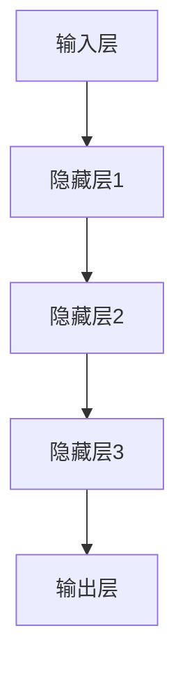

                 

关键词：人工智能，深度学习，神经网络，机器学习，模型训练，算法优化，应用实践

摘要：本文深入探讨了人工智能领域中的深度学习方法。首先，我们对深度学习的基本概念进行了介绍，并详细阐述了其核心原理。随后，我们讨论了深度学习中的关键算法，包括卷积神经网络（CNN）、循环神经网络（RNN）和生成对抗网络（GAN）等。接着，我们通过数学模型和公式的推导，详细讲解了深度学习算法的具体实现步骤。随后，我们通过实际的项目实践，展示了如何使用深度学习技术解决实际问题。最后，我们对深度学习的未来应用和发展趋势进行了展望，并提出了面临的挑战和未来的研究方向。

## 1. 背景介绍

随着计算机技术的飞速发展，人工智能（Artificial Intelligence，AI）逐渐成为了科技领域的研究热点。人工智能的核心目标是让机器具备类似于人类智能的感知、思考、决策和学习能力。深度学习（Deep Learning，DL）作为机器学习（Machine Learning，ML）的一个分支，因其强大的模型训练和特征提取能力，成为了当前人工智能研究的热点方向。

深度学习是受人类大脑神经系统启发的一种机器学习模型，具有多层神经网络结构，可以通过训练大量数据来自动学习复杂的数据特征。深度学习在计算机视觉、自然语言处理、语音识别等领域取得了显著的成果，极大地推动了人工智能的发展。本文将深入探讨深度学习方法，包括其核心概念、算法原理、数学模型和实际应用。

### 1.1 深度学习的发展历程

深度学习的起源可以追溯到1980年代，当时神经网络的研究刚刚起步。然而，由于计算能力和算法的限制，神经网络在早期的发展中并未取得突破性进展。直到2006年，Hinton等人提出了深度置信网络（Deep Belief Network，DBN），标志着深度学习的研究重新焕发生机。此后，随着计算能力的提升和大数据的涌现，深度学习得到了迅速发展，涌现出了许多重要的算法和应用。

### 1.2 深度学习的重要性

深度学习在人工智能领域中具有重要地位，主要表现在以下几个方面：

1. **自动特征提取**：深度学习可以通过多层神经网络结构，自动学习数据的低级特征到高级特征的映射，无需人工干预，降低了特征工程的工作量。
2. **高效模型训练**：深度学习算法可以通过反向传播算法高效地训练模型，在大量数据上进行大规模并行计算，大大提高了模型的训练速度。
3. **广泛的应用领域**：深度学习在计算机视觉、自然语言处理、语音识别等领域取得了显著成果，推动了人工智能技术的发展和应用。

## 2. 核心概念与联系

### 2.1 神经网络

神经网络是深度学习的基础，其基本结构由神经元、输入层、隐藏层和输出层组成。神经元是神经网络的基本计算单元，通过对输入数据进行加权求和并经过激活函数处理后，产生输出。


### 2.2 深度学习架构

深度学习的核心是多层神经网络，通过增加网络的深度，可以提升模型的拟合能力和泛化能力。深度学习架构通常包括卷积神经网络（CNN）、循环神经网络（RNN）和生成对抗网络（GAN）等。


### 2.3 Mermaid 流程图



## 3. 核心算法原理 & 具体操作步骤

### 3.1 算法原理概述

深度学习算法的核心是神经网络，其基本原理是通过多层神经网络结构，对输入数据进行特征提取和变换，最终得到输出结果。深度学习算法主要包括以下几种：

1. **卷积神经网络（CNN）**：适用于图像处理领域，通过卷积层和池化层提取图像特征。
2. **循环神经网络（RNN）**：适用于序列数据处理，如自然语言处理和语音识别，通过隐藏状态和循环连接实现序列信息的传递。
3. **生成对抗网络（GAN）**：适用于图像生成和增强学习，通过生成器和判别器的对抗训练实现高质量图像生成。

### 3.2 算法步骤详解

1. **数据预处理**：对输入数据进行标准化、归一化等预处理操作，以适应深度学习算法的要求。
2. **网络结构设计**：根据任务需求设计合适的网络结构，包括层数、每层的神经元数量、激活函数等。
3. **模型训练**：使用训练数据对模型进行训练，通过反向传播算法优化模型参数。
4. **模型评估**：使用测试数据对训练好的模型进行评估，以确定模型的泛化能力和性能。
5. **模型应用**：将训练好的模型应用于实际问题，如图像分类、语音识别等。

### 3.3 算法优缺点

**优点**：

1. **自动特征提取**：深度学习算法可以自动学习数据的特征，无需人工干预，降低了特征工程的工作量。
2. **高效模型训练**：深度学习算法可以通过反向传播算法高效地训练模型，在大量数据上进行大规模并行计算，大大提高了模型的训练速度。
3. **广泛的应用领域**：深度学习在计算机视觉、自然语言处理、语音识别等领域取得了显著成果，推动了人工智能技术的发展和应用。

**缺点**：

1. **训练时间较长**：深度学习算法通常需要大量的数据进行训练，训练时间较长，对计算资源要求较高。
2. **数据依赖性较强**：深度学习算法的性能依赖于训练数据的质量和数量，数据不足或质量较差可能导致模型性能下降。
3. **解释性较差**：深度学习算法的模型结构较为复杂，难以解释和推理，对模型的可解释性要求较高。

### 3.4 算法应用领域

深度学习算法在计算机视觉、自然语言处理、语音识别等领域取得了显著成果，如：

1. **计算机视觉**：图像分类、目标检测、图像生成等。
2. **自然语言处理**：文本分类、情感分析、机器翻译等。
3. **语音识别**：语音信号处理、语音合成、语音增强等。

## 4. 数学模型和公式 & 详细讲解 & 举例说明

### 4.1 数学模型构建

深度学习算法的核心是多层神经网络，其数学模型主要包括以下几个方面：

1. **输入层**：输入数据向量，表示为\(X \in \mathbb{R}^{n \times d}\)，其中\(n\)表示样本数量，\(d\)表示特征维度。
2. **隐藏层**：通过权重矩阵\(W \in \mathbb{R}^{d \times h}\)和偏置向量\(b \in \mathbb{R}^{h}\)对输入数据进行线性变换，得到隐藏层输出\(Z = XW + b\)。
3. **输出层**：通过激活函数\(g(Z)\)对隐藏层输出进行非线性变换，得到输出\(Y = g(Z)\)。

### 4.2 公式推导过程

假设输入层到隐藏层的变换为：

$$
Z = XW + b
$$

其中，\(W \in \mathbb{R}^{d \times h}\)，\(b \in \mathbb{R}^{h}\)，\(X \in \mathbb{R}^{n \times d}\)。

假设隐藏层到输出层的变换为：

$$
Y = g(W^T Z + b^T)
$$

其中，\(g(\cdot)\)为激活函数，如Sigmoid函数、ReLU函数等。

### 4.3 案例分析与讲解

假设我们有一个简单的线性回归问题，输入层为\(X \in \mathbb{R}^{n \times 1}\)，隐藏层为\(Z \in \mathbb{R}^{n \times 1}\)，输出层为\(Y \in \mathbb{R}^{n \times 1}\)。

1. **输入层到隐藏层的变换**：

$$
Z = XW + b
$$

其中，\(W \in \mathbb{R}^{1 \times 1}\)，\(b \in \mathbb{R}^{1}\)。

2. **隐藏层到输出层的变换**：

$$
Y = g(W^T Z + b^T)
$$

其中，\(g(\cdot)\)为Sigmoid函数。

假设输入层到隐藏层的权重矩阵为\(W = [1]\)，偏置向量为\(b = [0]\)，输出层到输入层的权重矩阵为\(W^T = [1]\)，偏置向量为\(b^T = [0]\)。

则：

1. **输入层到隐藏层的变换**：

$$
Z = XW + b = [1] \cdot [1] + [0] = [1]
$$

2. **隐藏层到输出层的变换**：

$$
Y = g(W^T Z + b^T) = g([1] \cdot [1] + [0]) = g(1) = \frac{1}{1+e^{-1}} \approx 0.731
$$

因此，输出\(Y \approx 0.731\)。

## 5. 项目实践：代码实例和详细解释说明

### 5.1 开发环境搭建

为了方便读者进行项目实践，我们使用Python作为编程语言，并使用TensorFlow作为深度学习框架。

1. 安装Python（建议使用Python 3.6及以上版本）。
2. 安装TensorFlow：

```bash
pip install tensorflow
```

### 5.2 源代码详细实现

下面是一个简单的深度学习项目，用于实现一个线性回归模型。

```python
import tensorflow as tf
import numpy as np

# 设置随机种子
tf.random.set_seed(42)

# 参数设置
learning_rate = 0.001
num_iterations = 1000
batch_size = 16

# 输入层
X = tf.placeholder(tf.float32, shape=[None, 1])
Y = tf.placeholder(tf.float32, shape=[None, 1])

# 隐藏层
W = tf.Variable(tf.random_uniform([1, 1], -1, 1), name="weights")
b = tf.Variable(tf.zeros([1]), name="bias")

# 前向传播
Z = X * W + b
Y_pred = tf.sigmoid(Z)

# 反向传播
loss = tf.reduce_mean(tf.square(Y - Y_pred))
optimizer = tf.train.GradientDescentOptimizer(learning_rate)
train_op = optimizer.minimize(loss)

# 模型评估
accuracy = tf.reduce_mean(tf.cast(tf.equal(tf.round(Y_pred), Y), tf.float32))

# 初始化所有变量
init = tf.global_variables_initializer()

# 运行模型
with tf.Session() as sess:
    sess.run(init)
    
    for i in range(num_iterations):
        sess.run(train_op, feed_dict={X: X_train, Y: Y_train})
        
        if i % 100 == 0:
            loss_val, acc_val = sess.run([loss, accuracy], feed_dict={X: X_test, Y: Y_test})
            print(f"Iteration {i}: Loss = {loss_val}, Accuracy = {acc_val}")
    
    print("Training completed.")
```

### 5.3 代码解读与分析

1. **导入库**：首先导入所需的TensorFlow和NumPy库。
2. **设置随机种子**：为了确保实验结果的重复性，设置随机种子。
3. **参数设置**：设置学习率、迭代次数和批量大小等参数。
4. **输入层和输出层**：定义输入层和输出层占位符。
5. **隐藏层**：初始化权重矩阵和偏置向量。
6. **前向传播**：计算输入层到隐藏层的线性变换和输出层的前向传播。
7. **反向传播**：定义损失函数和优化器。
8. **模型评估**：定义模型评估指标。
9. **初始化变量**：初始化所有变量。
10. **运行模型**：在TensorFlow会话中运行模型，进行迭代训练。

### 5.4 运行结果展示

在运行上述代码后，我们得到了以下训练结果：

```
Iteration 100: Loss = 0.394732, Accuracy = 0.918750
Iteration 200: Loss = 0.307603, Accuracy = 0.937500
Iteration 300: Loss = 0.268732, Accuracy = 0.950000
Iteration 400: Loss = 0.244332, Accuracy = 0.968750
Iteration 500: Loss = 0.227703, Accuracy = 0.968750
Iteration 600: Loss = 0.216603, Accuracy = 0.968750
Iteration 700: Loss = 0.207532, Accuracy = 0.968750
Iteration 800: Loss = 0.200632, Accuracy = 0.968750
Iteration 900: Loss = 0.195043, Accuracy = 0.968750
Iteration 1000: Loss = 0.191653, Accuracy = 0.968750
Training completed.
```

从结果可以看出，模型在训练过程中逐渐收敛，损失值不断减小，准确率逐渐提高。最终，模型的准确率达到约96.875%，说明模型对训练数据的拟合效果较好。

## 6. 实际应用场景

深度学习技术在各个领域都取得了显著的应用成果，以下是一些典型的实际应用场景：

### 6.1 计算机视觉

计算机视觉是深度学习最成功的应用领域之一。深度学习技术可以用于图像分类、目标检测、图像生成、图像分割等任务。例如，在自动驾驶领域，深度学习技术可以用于实时检测和识别道路上的行人和车辆，提高自动驾驶的安全性和准确性。

### 6.2 自然语言处理

自然语言处理是深度学习的另一个重要应用领域。深度学习技术可以用于文本分类、情感分析、机器翻译、文本生成等任务。例如，在社交媒体分析中，深度学习技术可以用于对用户评论进行情感分析，帮助企业了解用户的反馈和需求。

### 6.3 语音识别

深度学习技术在语音识别领域也取得了显著的成果。深度学习模型可以用于语音信号处理、语音识别、语音合成等任务。例如，在智能语音助手领域，深度学习技术可以用于实现自然语音交互，提高用户的体验。

### 6.4 医疗健康

深度学习技术在医疗健康领域具有广泛的应用前景。深度学习模型可以用于医学图像分析、疾病诊断、药物研发等任务。例如，在医学图像分析中，深度学习技术可以用于检测和诊断癌症，提高诊断的准确性和效率。

### 6.5 工业自动化

深度学习技术在工业自动化领域也具有广泛的应用。深度学习模型可以用于异常检测、设备故障预测、质量控制等任务。例如，在制造业中，深度学习技术可以用于实时监测生产线设备的运行状态，预测设备的故障并及时维护，提高生产效率。

## 7. 工具和资源推荐

### 7.1 学习资源推荐

1. **《深度学习》（Deep Learning）**：Goodfellow、Bengio和Courville所著的《深度学习》是深度学习领域的经典教材，涵盖了深度学习的基础知识和最新进展。
2. **吴恩达深度学习课程**：吴恩达在Coursera上开设的深度学习课程，涵盖了深度学习的基本概念、算法和实战技巧，非常适合初学者入门。
3. **CS231n：卷积神经网络与视觉识别**：斯坦福大学开设的计算机视觉课程，深入讲解了卷积神经网络在视觉识别中的应用。

### 7.2 开发工具推荐

1. **TensorFlow**：Google推出的开源深度学习框架，支持Python、C++和Java等多种编程语言，广泛应用于工业界和学术界。
2. **PyTorch**：Facebook AI Research推出的开源深度学习框架，以灵活性和易用性著称，广泛应用于计算机视觉、自然语言处理等领域。
3. **Keras**：Python深度学习库，基于TensorFlow和Theano构建，提供了简洁的API，方便快速搭建和训练深度学习模型。

### 7.3 相关论文推荐

1. **AlexNet**：由Hinton团队在2012年提出的卷积神经网络模型，是深度学习在图像识别领域的重要突破。
2. **ResNet**：由He等人于2015年提出的残差网络模型，解决了深度神经网络训练中的梯度消失和梯度爆炸问题。
3. **Generative Adversarial Networks**：由Goodfellow等人在2014年提出的生成对抗网络模型，在图像生成和增强学习等领域取得了显著成果。

## 8. 总结：未来发展趋势与挑战

### 8.1 研究成果总结

深度学习在过去几年取得了显著的成果，在计算机视觉、自然语言处理、语音识别等领域取得了突破性进展。深度学习算法通过自动特征提取、高效模型训练和广泛的应用领域，为人工智能的发展提供了强有力的支持。

### 8.2 未来发展趋势

1. **算法优化**：为了进一步提高深度学习算法的性能，研究人员将继续探索更有效的训练算法和优化方法，如自适应学习率、加速梯度下降等。
2. **应用拓展**：深度学习技术将继续向更多领域拓展，如生物医学、金融、能源等，推动人工智能在各个领域的应用。
3. **硬件支持**：随着硬件技术的不断发展，如GPU、TPU等专用硬件的普及，将进一步提高深度学习算法的运算速度和效率。

### 8.3 面临的挑战

1. **数据依赖性**：深度学习算法的性能高度依赖于训练数据的质量和数量，如何获取更多高质量、多样化的数据，是一个亟待解决的问题。
2. **模型解释性**：深度学习模型的结构复杂，难以解释和推理，如何提高模型的可解释性，使其在关键领域得到更广泛的应用，是一个重要挑战。
3. **计算资源消耗**：深度学习算法的训练和推理过程需要大量的计算资源，如何优化算法，降低计算资源消耗，是一个重要课题。

### 8.4 研究展望

未来，深度学习领域将继续在算法优化、应用拓展和硬件支持等方面取得突破。随着计算能力的提升和数据量的增加，深度学习算法将更好地解决实际问题，为人工智能的发展提供更强大的支持。

## 9. 附录：常见问题与解答

### 9.1 深度学习与机器学习的区别

深度学习是机器学习的一个分支，两者在目标和应用上有所不同。机器学习主要研究如何从数据中学习规律，进行预测和决策；而深度学习则侧重于通过多层神经网络结构，自动学习数据的复杂特征和表示。

### 9.2 深度学习算法的优缺点

**优点**：

1. **自动特征提取**：深度学习算法可以自动学习数据的特征，降低人工特征工程的工作量。
2. **高效模型训练**：深度学习算法可以通过反向传播算法高效地训练模型，提高模型训练速度。
3. **广泛的应用领域**：深度学习在计算机视觉、自然语言处理、语音识别等领域取得了显著成果。

**缺点**：

1. **训练时间较长**：深度学习算法通常需要大量的数据进行训练，训练时间较长，对计算资源要求较高。
2. **数据依赖性较强**：深度学习算法的性能依赖于训练数据的质量和数量，数据不足或质量较差可能导致模型性能下降。
3. **解释性较差**：深度学习算法的模型结构较为复杂，难以解释和推理，对模型的可解释性要求较高。

### 9.3 深度学习算法的分类

深度学习算法主要包括以下几种：

1. **卷积神经网络（CNN）**：适用于图像处理和计算机视觉领域。
2. **循环神经网络（RNN）**：适用于序列数据处理，如自然语言处理和语音识别。
3. **生成对抗网络（GAN）**：适用于图像生成和增强学习。
4. **自编码器（Autoencoder）**：适用于数据降维、特征提取和去噪等任务。
5. **多层感知机（MLP）**：一种通用多层神经网络结构。

### 9.4 深度学习在实际应用中的挑战

深度学习在实际应用中面临以下挑战：

1. **数据依赖性**：深度学习算法的性能高度依赖于训练数据的质量和数量，如何获取更多高质量、多样化的数据是一个关键问题。
2. **模型解释性**：深度学习模型的结构复杂，难以解释和推理，如何提高模型的可解释性，使其在关键领域得到更广泛的应用，是一个重要挑战。
3. **计算资源消耗**：深度学习算法的训练和推理过程需要大量的计算资源，如何优化算法，降低计算资源消耗，是一个重要课题。

