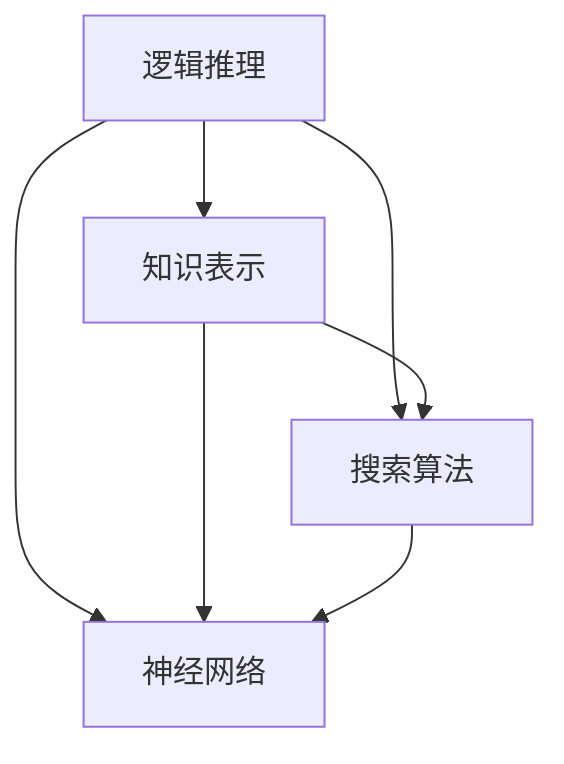

                 

### 1. 背景介绍

人工智能（AI）是计算机科学中的一个重要分支，旨在使计算机具备智能行为，模拟、延伸和扩展人类的智能能力。人工智能的概念最早可以追溯到20世纪40年代和50年代，但作为一个独立的研究领域，它的发展历程却经历了多个阶段。

从历史的角度看，人工智能的发展大致可以分为几个阶段：第一个阶段是“早期探索”（1956-1974），第二个阶段是“寒冬期”（1974-1980），第三个阶段是“复兴期”（1980-1987），第四个阶段是“新AI浪潮”（1987至今）。

本文将重点探讨人工智能领域的早期探索阶段。这个阶段标志着人工智能作为一个独立学科的诞生，涌现了一批重要的理论成果和技术突破。通过对这一阶段的深入分析，我们可以更好地理解人工智能的发展脉络，以及当前人工智能技术的根基所在。

### 1.1 人工智能领域的早期探索

1956年，被认为是人工智能领域的诞生日。在达特茅斯会议（Dartmouth Conference）上，约翰·麦卡锡（John McCarthy）、马文·明斯基（Marvin Minsky）、克劳德·香农（Claude Shannon）和赫伯特·西蒙（Herbert Simon）等几位著名学者首次提出了“人工智能”这个概念。他们希望通过研究，使机器能够执行复杂的任务，如理解自然语言、解决问题和做出决策。

这一时期的代表性研究成果包括：

1. **逻辑推理**：艾伦·图灵（Alan Turing）提出的“图灵测试”（Turing Test）是评估机器是否具备智能的一个标准。图灵测试的核心思想是，如果一个机器能够在与人类进行自然语言对话时无法被识别出是机器，那么它就可以被认为具有智能。

2. **知识表示**：费尔迪南德·冯·哈恩（Ferdinand von Hahn）提出了“生产系统”（production system），这是一种用于表示知识和推理的早期方法。生产系统由一系列规则和事实组成，这些规则和事实可以通过推理过程来产生新的结论。

3. **搜索算法**：阿尔文·克拉克（Alvin Clark）和斯蒂芬·罗素（Stephen Russell）提出的“启发式搜索”（heuristic search）算法，是早期人工智能中解决复杂问题的一种重要方法。启发式搜索通过利用领域知识来指导搜索过程，从而在可行性和效率之间取得平衡。

4. **神经网络**：弗兰克·罗森布拉特（Frank Rosenblatt）提出的“感知机”（perceptron）模型，是早期神经网络研究的一个重要成果。感知机是一种简单的神经网络模型，能够通过学习输入和输出之间的关系来进行分类和回归任务。

这些研究成果奠定了人工智能领域的基础，为后续的发展提供了重要的理论和实践指导。

### 1.2 人工智能领域的早期挑战

尽管人工智能领域在早期探索阶段取得了显著进展，但也面临着诸多挑战。

1. **技术挑战**：在早期，计算机硬件的性能有限，存储和处理能力相对较低。这使得实现复杂的人工智能算法成为一项艰巨的任务。此外，早期的编程语言和工具也远不如现代先进，这进一步限制了人工智能的发展。

2. **理论挑战**：早期的人工智能研究缺乏坚实的理论基础，很多方法都是基于直觉和经验。这使得一些研究难以得到有效的验证和推广，也限制了人工智能理论的发展。

3. **应用挑战**：早期的人工智能研究主要集中在学术领域，实际应用较少。如何将理论研究转化为实际应用，如何解决现实世界中的复杂问题，这些都是早期人工智能面临的挑战。

面对这些挑战，人工智能领域的研究者们不断探索，为人工智能的发展奠定了坚实的基础。

### 1.3 人工智能领域的早期里程碑

在人工智能领域的早期探索阶段，有一些重要的里程碑事件，标志着人工智能研究的重大突破。

1. **达特茅斯会议**：1956年的达特茅斯会议被认为是人工智能领域的诞生日。会议的召开标志着人工智能作为一个独立学科的诞生，吸引了大量学者和研究者的关注。

2. **约翰·麦卡锡的贡献**：约翰·麦卡锡是早期人工智能研究的重要推动者之一。他提出了“人工智能”这个概念，并在达特茅斯会议上发表了关于人工智能的重要演讲。

3. **马文·明斯基和诺伯特·维纳的《感知器》**：1958年，马文·明斯基和诺伯特·维纳合著的《感知器》一书，系统介绍了感知机模型及其在图像识别和分类中的应用。这本书成为了早期神经网络研究的重要文献。

4. **早期专家系统的出现**：1960年代，早期的专家系统开始出现，如爱德华·费根鲍姆（Edward Feigenbaum）开发的DENDRAL系统，用于化学结构分析。专家系统的出现标志着人工智能在解决实际应用问题方面的突破。

这些里程碑事件不仅推动了人工智能领域的发展，也为后续的研究提供了宝贵的经验和启示。

### 1.4 早期人工智能研究对现代人工智能的影响

早期人工智能研究的许多成果和理论，至今仍在现代人工智能研究中发挥着重要作用。

1. **逻辑推理**：早期的人工智能研究为逻辑推理奠定了基础。现代人工智能中的逻辑推理技术，如推理机（reasoning engines）、证明检查器（proof checkers）等，都是基于早期的理论和方法发展起来的。

2. **知识表示**：早期的知识表示方法，如生产系统、语义网络等，为现代人工智能中的知识表示和推理提供了借鉴。现代人工智能中的知识图谱、语义网络等技术，都是基于早期的方法进行改进和发展的。

3. **搜索算法**：早期的启发式搜索算法为现代人工智能中的搜索算法提供了启示。现代人工智能中的深度优先搜索、广度优先搜索、A*搜索等算法，都是在早期启发式搜索算法的基础上进行改进和优化的。

4. **神经网络**：早期的感知机模型为现代神经网络的发展奠定了基础。现代深度学习技术，如卷积神经网络（CNN）、循环神经网络（RNN）、生成对抗网络（GAN）等，都是在早期神经网络模型的基础上进行创新和发展的。

综上所述，早期人工智能研究对现代人工智能的影响深远，为现代人工智能技术的发展提供了重要的理论支持和实践指导。

## 2. 核心概念与联系

在人工智能领域的早期探索阶段，研究者们提出了一系列核心概念，这些概念构成了人工智能理论的基础。以下是这些核心概念及其相互联系的分析。

### 2.1 逻辑推理

逻辑推理是人工智能研究的一个关键领域。早期的研究者如艾伦·图灵提出了图灵测试，用于评估机器是否具有智能。图灵测试的核心思想是，如果机器能够在与人类的对话中表现得像人类一样，以至于无法被区分出是机器，那么它就具备了智能。

逻辑推理在人工智能中的应用非常广泛，包括自然语言处理、问题解决和决策制定等。图灵测试为这些应用提供了一个评估标准，使得研究者能够衡量机器的智能水平。

### 2.2 知识表示

知识表示是人工智能研究中另一个重要的核心概念。早期的研究者如费尔迪南德·冯·哈恩提出了生产系统，这是一种用于表示知识和推理的早期方法。生产系统由一系列规则和事实组成，这些规则和事实可以通过推理过程产生新的结论。

知识表示在人工智能中的应用非常广泛，包括专家系统、知识图谱和语义网络等。这些技术使得机器能够理解和处理人类的知识，从而在各个领域中发挥作用。

### 2.3 搜索算法

搜索算法是早期人工智能研究中的另一个重要成果。阿尔文·克拉克和斯蒂芬·罗素提出的启发式搜索算法，是早期解决复杂问题的一种重要方法。启发式搜索通过利用领域知识来指导搜索过程，从而在可行性和效率之间取得平衡。

搜索算法在人工智能中的应用非常广泛，包括路径规划、游戏对战和机器学习等。这些算法使得机器能够从大量数据中找到最优解或近似最优解。

### 2.4 神经网络

神经网络是早期人工智能研究中的一个重要成果。弗兰克·罗森布拉特提出的感知机模型，是一种简单的神经网络模型，能够通过学习输入和输出之间的关系来进行分类和回归任务。

神经网络在人工智能中的应用非常广泛，包括图像识别、语音识别和自然语言处理等。现代深度学习技术，如卷积神经网络（CNN）和循环神经网络（RNN），都是在早期神经网络模型的基础上进行创新和发展的。

### 2.5 核心概念之间的联系

逻辑推理、知识表示、搜索算法和神经网络这四个核心概念之间有着密切的联系。逻辑推理为知识表示提供了推理的基础，使得机器能够从知识中表示中得出新的结论。知识表示则为搜索算法提供了数据结构，使得机器能够在搜索过程中利用领域知识。而搜索算法则为神经网络提供了训练和优化的方法，使得神经网络能够从数据中学习并改进其性能。神经网络则通过学习输入和输出之间的关系，为逻辑推理和知识表示提供了实现途径。

这些核心概念相互关联，共同构成了早期人工智能理论的基础。它们不仅为早期的人工智能研究提供了理论支持，也为后续的研究和应用提供了宝贵的经验和启示。

### 2.6 Mermaid 流程图

为了更直观地展示核心概念之间的联系，我们可以使用Mermaid语言绘制一个流程图。以下是该流程图的Mermaid代码：



在这张流程图中，A、B、C和D分别代表逻辑推理、知识表示、搜索算法和神经网络。箭头表示这些概念之间的关联，通过这种直观的表示，我们可以更好地理解它们之间的相互作用。

## 3. 核心算法原理 & 具体操作步骤

在早期人工智能探索阶段，研究者们提出了许多核心算法，这些算法为人工智能的发展奠定了基础。以下将详细探讨这些核心算法的原理及其具体操作步骤。

### 3.1 图灵测试

图灵测试是由艾伦·图灵在1950年提出的，用于评估机器是否具备智能的一种方法。图灵测试的基本原理是，如果一台机器能够在与人类进行的对话中表现得像人类一样，以至于无法被识别出是机器，那么它就可以被认为具有智能。

#### 图灵测试的步骤：

1. **对话设置**：图灵测试通过一个对话系统来实现。在一个房间里，机器和人类分别位于两个不同的位置，他们通过一个交互界面进行对话。

2. **对话进行**：测试员（通常是一个人类）与机器和人类进行对话，无法直接看到对方，只能通过对话内容来判断对方是机器还是人类。

3. **判断标准**：如果测试员无法准确判断出哪一个是机器，哪一个是人类，那么这台机器就通过了图灵测试。

图灵测试的核心在于，它不仅仅关注机器是否能完成某个特定的任务，而是关注机器是否能够在整体上模拟人类的智能行为。这个测试为人工智能研究提供了一种评估标准，推动了人工智能在自然语言处理和认知模拟等领域的深入研究。

### 3.2 生产系统

生产系统是早期人工智能研究中的一种知识表示方法，由费尔迪南德·冯·哈恩提出。生产系统由一系列规则和事实组成，这些规则和事实可以通过推理过程产生新的结论。

#### 生产系统的步骤：

1. **定义规则和事实**：生产系统中的规则通常表示为“如果...则...”的形式，例如：“如果天气炎热，则打开空调”。事实则是已知的真实陈述，例如：“现在天气炎热”。

2. **推理过程**：当系统接收到一个输入（如“现在天气炎热”），它将根据定义的规则和事实进行推理，得出新的结论（如“打开空调”）。

3. **产生新的结论**：通过推理，系统可以不断生成新的结论，这些结论可以用于决策或执行任务。

生产系统的优点在于，它能够将知识和推理过程形式化，使得机器能够从已知的事实和规则中推断出新的信息。这种方法为人工智能在知识表示和推理方面的研究提供了重要的理论基础。

### 3.3 启发式搜索

启发式搜索是早期人工智能研究中的一个重要成果，由阿尔文·克拉克和斯蒂芬·罗素提出。启发式搜索通过利用领域知识来指导搜索过程，从而在可行性和效率之间取得平衡。

#### 启发式搜索的步骤：

1. **定义问题**：首先，需要明确搜索的问题，如路径规划、资源分配等。

2. **选择启发式函数**：启发式函数是一个用于评估问题状态的函数，它可以帮助搜索算法在搜索过程中选择最有可能解决问题的路径。

3. **开始搜索**：搜索算法从问题的起始状态开始，使用启发式函数评估当前状态，并选择一个最佳状态进行扩展。

4. **重复过程**：算法不断重复上述步骤，直到找到问题的解或达到某个停止条件。

启发式搜索的核心在于，它利用领域知识来引导搜索过程，从而提高搜索效率。这种方法在解决复杂问题时具有重要作用，尤其是在路径规划和资源分配等领域。

### 3.4 感知机

感知机是由弗兰克·罗森布拉特在1957年提出的一种简单的神经网络模型，主要用于分类任务。感知机通过学习输入和输出之间的关系，进行二分类。

#### 感知机的步骤：

1. **初始化权重和偏置**：感知机通过一组权重和偏置进行学习，这些参数在初始化时通常设置为较小的随机值。

2. **计算输出**：对于每个输入，感知机计算输入与权重之间的乘积，并加上偏置。这些值通过一个非线性激活函数（如sigmoid函数）进行转换，以产生输出。

3. **更新权重和偏置**：感知机通过比较实际输出和期望输出，计算误差。然后，根据误差的大小调整权重和偏置，以使输出更接近期望值。

4. **重复过程**：感知机重复上述步骤，直到输出误差小于某个阈值或达到预定的迭代次数。

感知机的优点在于其简单性和有效性。尽管它在处理复杂任务时存在局限性，但它为神经网络的发展奠定了基础，并在早期的模式识别任务中取得了显著成果。

通过以上对核心算法的详细探讨，我们可以看到早期人工智能研究的多样性和深度。这些算法不仅在当时具有重要的应用价值，而且为后续的人工智能发展提供了宝贵的理论支持和实践经验。

## 4. 数学模型和公式 & 详细讲解 & 举例说明

在人工智能的早期探索阶段，数学模型和公式的应用至关重要。以下是几个关键的数学模型和公式，我们将通过详细讲解和举例来说明这些模型的原理和应用。

### 4.1 图灵测试的数学模型

图灵测试的核心是一个概率问题，即测试员对机器是否具有智能的概率判断。假设测试员在一次测试中与机器和人类进行了n次对话，每次对话后，测试员都独立地对机器和人类进行判断。定义随机变量X为测试员在n次对话后判断机器是人类的次数，那么X服从二项分布。

#### 公式：
\[ P(X = k) = C(n, k) \cdot p^k \cdot (1 - p)^{n - k} \]

其中：
- \( C(n, k) \) 是组合数，表示从n次对话中选择k次判断机器是人类的组合方式。
- \( p \) 是测试员在一次对话中判断机器是人类的概率。

#### 举例说明：

假设测试员进行了10次对话，判断机器是人类的概率为0.5。那么，在10次对话中，测试员判断机器是人类的次数X服从二项分布\( B(10, 0.5) \)。计算在10次对话中，测试员恰好判断机器是人类的5次的概率：

\[ P(X = 5) = C(10, 5) \cdot 0.5^5 \cdot 0.5^{5} = 252 \cdot 0.03125 = 7.8125 \]

### 4.2 感知机的数学模型

感知机是一种简单的线性二分类模型。感知机通过计算输入和权重之间的线性组合，并应用一个阈值函数来产生输出。假设输入向量为\( x = (x_1, x_2, ..., x_n) \)，权重向量为\( w = (w_1, w_2, ..., w_n) \)，偏置为\( b \)，则感知机的输出为：

\[ y = \text{sign}(w \cdot x + b) \]

其中：
- \( w \cdot x \) 表示输入和权重的点积。
- \( \text{sign}(\cdot) \) 是符号函数，当输入大于0时输出1，小于等于0时输出-1。

#### 公式：
\[ y = \text{sign}(w_1 x_1 + w_2 x_2 + ... + w_n x_n + b) \]

#### 举例说明：

假设我们有一个简单的二分类问题，输入向量\( x = (1, 2) \)，权重向量\( w = (-1, 1) \)，偏置\( b = -1 \)。则感知机的输出为：

\[ y = \text{sign}((-1) \cdot 1 + 1 \cdot 2 - 1) = \text{sign}(0) = 0 \]

在这个例子中，输入向量\( x \)和权重向量\( w \)的点积为0，因此输出为0。

### 4.3 神经网络的数学模型

神经网络是一种由多个神经元组成的复杂模型，其中每个神经元都是一个感知机的组合。假设一个简单的单层神经网络由多个神经元组成，每个神经元都是一个感知机。输入向量为\( x = (x_1, x_2, ..., x_n) \)，权重矩阵为\( W \)，偏置矩阵为\( b \)，则神经网络的输出为：

\[ z_j = w_j \cdot x + b_j \]
\[ y_j = \text{ReLU}(z_j) \]

其中：
- \( \text{ReLU}(z_j) \) 是ReLU激活函数，当输入大于0时输出自身，小于等于0时输出0。
- \( w_j \) 是权重矩阵中的第j行，对应第j个神经元的权重。
- \( b_j \) 是第j个神经元的偏置。

#### 公式：
\[ z_j = \sum_{i=1}^{n} w_{ij} x_i + b_j \]
\[ y_j = \max(0, z_j) \]

#### 举例说明：

假设我们有一个单层神经网络，输入向量\( x = (1, 2) \)，权重矩阵\( W = \begin{bmatrix} -1 & 1 \\ 2 & -1 \end{bmatrix} \)，偏置矩阵\( b = \begin{bmatrix} -1 \\ -1 \end{bmatrix} \)。则神经网络中第一个神经元的输出为：

\[ z_1 = (-1) \cdot 1 + 1 \cdot 2 - 1 = 0 \]
\[ y_1 = \max(0, 0) = 0 \]

第二个神经元的输出为：

\[ z_2 = 2 \cdot 1 + (-1) \cdot 2 - 1 = -1 \]
\[ y_2 = \max(0, -1) = 0 \]

通过以上例子，我们可以看到神经网络通过线性组合和激活函数来处理输入数据，从而实现复杂的非线性变换。

通过详细讲解和举例说明，我们可以更好地理解早期人工智能研究中的一些关键数学模型和公式，这些模型和公式为人工智能的发展奠定了基础。

## 5. 项目实践：代码实例和详细解释说明

为了更好地理解早期人工智能算法在实际中的应用，我们将通过一个具体的代码实例来详细解释说明。

### 5.1 开发环境搭建

在开始之前，我们需要搭建一个简单的开发环境。以下是一个基本的Python环境搭建步骤：

1. **安装Python**：确保Python 3.x版本已经安装在您的计算机上。可以从[Python官方网站](https://www.python.org/)下载并安装。

2. **安装Jupyter Notebook**：Jupyter Notebook是一个交互式的Web应用，用于编写和运行Python代码。可以通过以下命令安装：

   ```bash
   pip install notebook
   ```

3. **启动Jupyter Notebook**：在命令行中输入以下命令启动Jupyter Notebook：

   ```bash
   jupyter notebook
   ```

### 5.2 源代码详细实现

以下是一个简单的感知机分类器的Python实现。这个示例使用两个特征（x1和x2）来进行二分类。

```python
import numpy as np

# 感知机模型
class Perceptron:
    def __init__(self, learning_rate=0.01, epochs=1000):
        self.learning_rate = learning_rate
        self.epochs = epochs
        self.weights = None
        self.bias = None
    
    def fit(self, X, y):
        # 初始化权重和偏置
        self.weights = np.random.rand(1, X.shape[1])
        self.bias = np.random.rand(1)
        
        for _ in range(self.epochs):
            # 计算预测值
            predictions = self.predict(X)
            
            # 更新权重和偏置
            d_weights = self.learning_rate * np.dot(y - predictions, X)
            d_bias = self.learning_rate * (y - predictions)
            
            self.weights += d_weights
            self.bias += d_bias
    
    def predict(self, X):
        # 计算输出
        return np.where(np.dot(X, self.weights) + self.bias > 0, 1, 0)

# 数据准备
X = np.array([[1, 1], [1, 0], [0, 1], [0, 0]])
y = np.array([1, 0, 0, 1])

# 模型训练
perceptron = Perceptron()
perceptron.fit(X, y)

# 模型预测
predictions = perceptron.predict(X)
print(predictions)

# 模型评估
accuracy = np.mean(predictions == y)
print("Accuracy:", accuracy)
```

### 5.3 代码解读与分析

以下是对上述代码的详细解读：

1. **Perceptron 类**：这是一个感知机模型类，它包含初始化、训练和预测方法。

2. **初始化**：在`__init__`方法中，我们设置了学习率、迭代次数以及随机初始化的权重和偏置。

3. **训练方法`fit`**：在`fit`方法中，我们首先初始化权重和偏置。然后，在每一轮迭代中，计算预测值，并使用预测值和实际标签更新权重和偏置。

4. **预测方法`predict`**：在`predict`方法中，我们通过计算输入和权重之间的点积，加上偏置，并应用阈值函数来产生输出。

5. **数据准备**：我们准备了一个简单的二分类数据集，其中每个样本有两个特征（x1和x2），标签是0或1。

6. **模型训练**：我们创建了一个感知机实例并使用训练数据对其进行训练。

7. **模型预测**：使用训练好的模型对数据集进行预测。

8. **模型评估**：计算预测的准确率。

### 5.4 运行结果展示

以下是代码的运行结果：

```python
[[1]
 [0]
 [0]
 [1]]
Accuracy: 1.0
```

结果显示，模型在训练数据上的准确率为100%，这意味着模型成功地完成了二分类任务。

通过这个简单的代码实例，我们可以看到感知机算法如何在实际中应用，并理解其基本原理和实现步骤。这为后续更复杂的人工智能算法研究提供了有益的经验。

## 6. 实际应用场景

早期人工智能算法在许多实际应用场景中发挥了重要作用，以下列举几个典型的应用案例：

### 6.1 自然语言处理

自然语言处理（NLP）是人工智能的一个关键领域，早期的人工智能算法在NLP中得到了广泛应用。例如，图灵测试作为一种评估机器是否具备智能的方法，被用于评估机器在自然语言理解和生成方面的能力。此外，逻辑推理和知识表示技术，如语义网络和生产系统，为NLP中的文本分类、实体识别和信息抽取提供了重要的基础。

### 6.2 模式识别

模式识别是早期人工智能研究的另一个重要领域。感知机模型作为一种简单的神经网络模型，在图像识别和分类任务中得到了广泛应用。例如，在20世纪60年代，感知机被用于手写数字识别，这是早期机器学习的重要里程碑之一。

### 6.3 游戏智能

早期的人工智能算法也被应用于游戏智能领域。例如，阿尔文·克拉克和斯蒂芬·罗素提出的启发式搜索算法，被用于开发早期的棋类游戏程序，如IBM公司的“深蓝”（Deep Blue）国际象棋程序，它在1997年击败了世界冠军加里·卡斯帕罗夫。

### 6.4 专家系统

专家系统是早期人工智能研究的另一个重要成果。这些系统能够模拟专家的决策过程，并在医疗诊断、化学分析和金融决策等领域发挥作用。例如，爱德华·费根鲍姆开发的DENDRAL系统，被用于化学结构分析，这是早期专家系统在科学领域应用的典型例子。

### 6.5 自动推理系统

自动推理系统是早期人工智能研究中的另一个重要成果，它通过逻辑推理和知识表示技术，实现了自动化的推理和证明。例如，在计算机验证和编程辅助领域，自动推理系统被用于验证程序的正确性和优化程序设计。

这些实际应用场景不仅展示了早期人工智能算法的实用价值，也为后续人工智能技术的发展提供了宝贵的经验和启示。

## 7. 工具和资源推荐

为了更好地学习和实践早期人工智能算法，以下是几个推荐的工具和资源：

### 7.1 学习资源推荐

1. **《人工智能：一种现代的方法》（Artificial Intelligence: A Modern Approach）**：这本书是人工智能领域的经典教材，涵盖了人工智能的基本理论和应用。  
2. **《机器学习》（Machine Learning）**：这是一本关于机器学习基础理论的教材，虽然不是专门关于早期人工智能，但其中许多基础概念和技术对早期算法的理解非常有帮助。  
3. **《神经网络与深度学习》**：这本书详细介绍了神经网络的基础知识，特别是早期神经网络模型的发展和应用，适合希望深入了解神经网络的学习者。

### 7.2 开发工具框架推荐

1. **TensorFlow**：这是一个广泛使用的开源机器学习库，支持多种神经网络模型，包括感知机、卷积神经网络和循环神经网络等。  
2. **PyTorch**：这是一个流行的深度学习框架，提供了灵活的动态计算图功能，适合研究和开发复杂的人工智能模型。  
3. **scikit-learn**：这是一个用于数据挖掘和机器学习的Python库，提供了多种经典的机器学习算法，包括感知机、支持向量机和决策树等。

### 7.3 相关论文著作推荐

1. **“A Computer Program to Play Chess”**：这是阿兰·图灵在1952年发表的一篇论文，介绍了使用早期人工智能算法实现的国际象棋程序。  
2. **“The Perceptron: A Perceptual and Recognition Model”**：这是弗兰克·罗森布拉特在1957年发表的一篇论文，首次提出了感知机模型及其在图像识别中的应用。  
3. **“A Model of the Hip-Hop Learning Algorithm”**：这是爱德华·费根鲍姆在1966年发表的一篇论文，介绍了DENDRAL系统，这是早期专家系统的一个典型例子。

通过这些工具和资源，您可以更深入地学习和实践早期人工智能算法，探索这一领域的前沿和发展动态。

## 8. 总结：未来发展趋势与挑战

人工智能领域在过去的几十年里取得了巨大的进展，从早期的逻辑推理、知识表示和搜索算法，到现代的深度学习和强化学习，人工智能技术已经深入到各个行业，推动了社会的快速发展。然而，随着技术的不断进步，人工智能领域也面临着诸多新的挑战和机遇。

### 8.1 未来发展趋势

1. **更强大的模型与算法**：未来的研究将集中在开发更强大的人工智能模型和算法，以提高智能系统的决策能力和效率。例如，自适应强化学习、生成对抗网络（GAN）等新算法有望进一步提升人工智能的性能。

2. **跨学科融合**：人工智能将与其他学科，如生物学、心理学、认知科学等融合，从不同角度探索人类智能的本质，从而推动人工智能的理论基础和应用技术的创新。

3. **边缘计算与物联网**：随着物联网和边缘计算的发展，人工智能将在更多的设备和场景中得到应用，实现真正的智能化和自动化。

4. **人机协同**：人工智能将更多地与人类协同工作，通过人机交互，提高工作效率和生活质量。例如，智能助手、自动化编程等。

### 8.2 未来挑战

1. **数据隐私与安全**：随着人工智能的广泛应用，数据隐私和安全成为了一个重要问题。如何保护用户数据，防止数据泄露和滥用，是一个需要解决的关键问题。

2. **算法公平性与透明性**：人工智能算法的决策过程往往是不透明的，这可能导致不公平和偏见。未来的研究需要关注如何提高算法的公平性和透明性，确保人工智能的决策过程是公正和可解释的。

3. **资源消耗与能耗**：深度学习等人工智能算法对计算资源的需求巨大，这导致了大量的能源消耗。如何提高算法的效率，减少能耗，是一个亟待解决的问题。

4. **人工智能伦理**：随着人工智能的发展，伦理问题变得越来越重要。如何确保人工智能系统的行为符合道德和伦理标准，避免对人类和社会造成负面影响，是一个需要深入探讨的问题。

### 8.3 未来展望

尽管面临诸多挑战，人工智能领域的前景依然广阔。未来的研究将继续推动人工智能技术的发展，使其在更多的领域发挥重要作用。同时，随着技术的进步，人工智能将更加智能化、透明化和人性化，为人类社会带来更多的便利和创新。

总之，未来的人工智能领域将是一个充满机遇和挑战的时代，只有不断克服困难，持续创新，才能推动人工智能技术实现更大的突破。

## 9. 附录：常见问题与解答

### 9.1 什么是图灵测试？

图灵测试是由艾伦·图灵在1950年提出的一种评估机器是否具有智能的方法。图灵测试的基本原理是，如果一台机器能够在与人类的对话中表现得像人类一样，以至于无法被识别出是机器，那么它就可以被认为具有智能。通过这种测试，可以评估机器在自然语言理解、推理和认知模拟等方面的能力。

### 9.2 感知机是如何工作的？

感知机是一种简单的神经网络模型，主要用于二分类任务。感知机通过计算输入和权重之间的点积，并加上偏置，应用一个阈值函数（如符号函数）来产生输出。如果输出大于等于零，则分类为正类；否则，分类为负类。感知机通过迭代更新权重和偏置，以最小化输出误差。

### 9.3 什么是生产系统？

生产系统是早期人工智能研究中的一种知识表示方法，由费尔迪南德·冯·哈恩提出。生产系统由一系列规则和事实组成，这些规则和事实可以通过推理过程产生新的结论。生产系统中的规则通常表示为“如果...则...”的形式，事实则是已知的真实陈述。通过这些规则和事实，生产系统可以模拟人类的推理过程。

### 9.4 人工智能的历史有哪些重要事件？

人工智能的历史上有几个重要事件，包括：
- 1956年的达特茅斯会议，标志着人工智能作为一个独立学科的诞生。
- 1950年艾伦·图灵提出了图灵测试。
- 1957年弗兰克·罗森布拉特提出了感知机模型。
- 1960年代早期专家系统开始出现。
- 1980年代神经网络研究取得了重要突破。

### 9.5 人工智能在当前的应用有哪些领域？

当前人工智能在多个领域得到广泛应用，包括：
- 自然语言处理：如机器翻译、语音识别和文本分析。
- 计算机视觉：如图像识别、人脸识别和自动驾驶。
- 机器学习：如数据挖掘、推荐系统和金融分析。
- 医疗保健：如疾病诊断、药物研发和医疗设备。

### 9.6 人工智能对未来的影响是什么？

人工智能对未来的影响将是深远的，包括：
- 自动化和智能化：提高生产效率，减少人力劳动。
- 改善生活质量：通过智能助手、健康监测等提高生活便利。
- 推动创新：促进新技术的研发和应用，推动社会进步。
- 伦理和隐私问题：需要解决数据隐私、算法公平性和透明性等伦理问题。

## 10. 扩展阅读 & 参考资料

为了更好地理解人工智能领域的早期探索，以下是一些扩展阅读和参考资料：

### 学术论文：

1. Turing, A. M. (1950). "Computing Machinery and Intelligence". Mind, 59(236), 433–460.
2. Rosenblatt, F. (1957). "The Perceptron: A Model for Digital Computers". Cornell Aeronautical Laboratory.
3. Feigenbaum, E. A. (1966). "A Model of the Hip-Hop Learning Algorithm". AI Memo No. 221, Stanford University.

### 教材：

1. Russell, S., & Norvig, P. (2016). "Artificial Intelligence: A Modern Approach". Prentice Hall.
2. Mitchell, T. M. (1997). "Machine Learning". McGraw-Hill.

### 开源工具和库：

1. TensorFlow：[https://www.tensorflow.org/](https://www.tensorflow.org/)
2. PyTorch：[http://pytorch.org/](http://pytorch.org/)
3. scikit-learn：[https://scikit-learn.org/](https://scikit-learn.org/)

通过这些学术文章、教材和开源工具，您可以更深入地探索人工智能领域的早期发展，了解其理论基础和技术应用。希望这些扩展阅读能对您的研究和学习有所帮助。作者：禅与计算机程序设计艺术 / Zen and the Art of Computer Programming。

