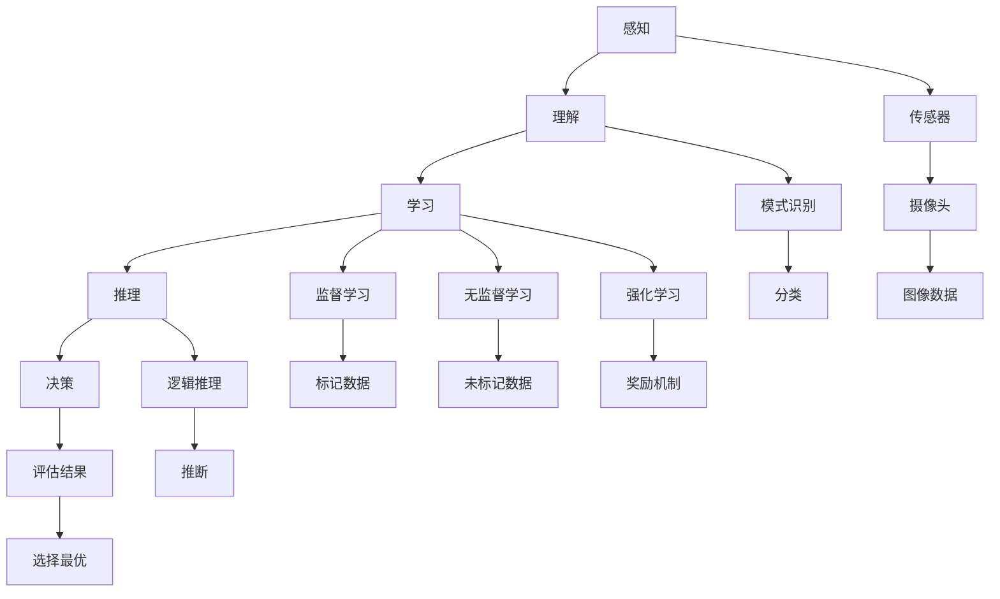
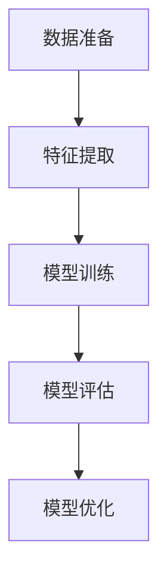
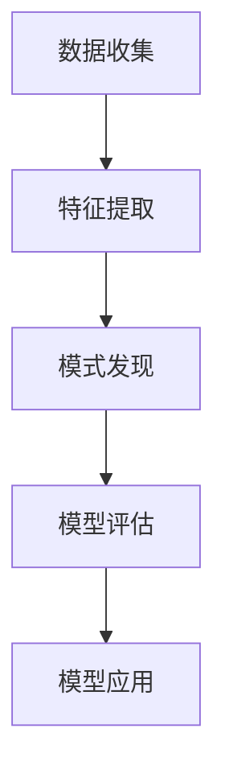
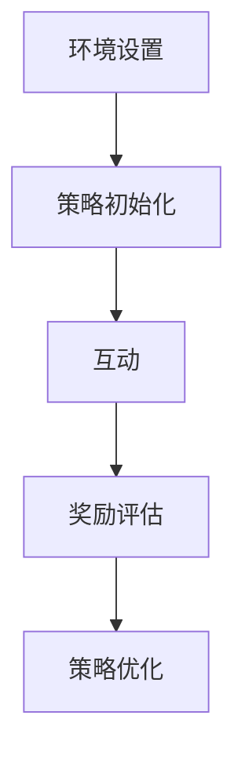

                 

### 1. 背景介绍

人工智能（Artificial Intelligence，简称 AI）作为计算机科学的一个分支，旨在通过模拟、延伸和扩展人的智能行为，实现计算机对环境的感知、理解、学习和决策。AI 的历史可以追溯到 20 世纪中期，但其真正意义上的快速发展始于 20 世纪 80 年代，随着计算能力的提升、大数据的积累和深度学习算法的突破，AI 应用的广度和深度都得到了极大的拓展。

在社会生活中，人工智能的影响无处不在。从智能手机的语音助手、自动驾驶汽车、医疗诊断系统到金融风险评估、智能家居、个性化推荐系统，AI 正在以不可逆转的趋势改变着我们的生活和工作方式。然而，随着 AI 技术的迅猛发展，其对社会、伦理和法律的挑战也日益凸显。

本文旨在探讨人工智能在社会中的影响，从技术、伦理、法律和经济等多个维度进行深入分析。文章将首先介绍人工智能的核心概念和原理，然后探讨其技术发展历程和现状，接着分析 AI 在实际应用中的案例，并讨论相关的工具和资源。最后，我们将展望人工智能的未来发展趋势，探讨其中可能面临的挑战，并提出相应的解决策略。

通过本文的阅读，读者将能够对人工智能有更全面、深入的理解，从而更好地把握 AI 技术的发展脉络，应对其带来的机遇与挑战。本文不仅适合对人工智能感兴趣的读者，同时也为相关领域的专业人士和研究人员提供有价值的参考和思考。

### 2. 核心概念与联系

要理解人工智能，我们首先需要明确其核心概念与原理。人工智能的核心是模拟人类的智能行为，包括感知、理解、学习、推理和决策等。以下是几个关键概念及其相互联系：

#### 2.1 感知

感知是指人工智能系统对外部环境信息的获取和解释。它依赖于传感器、摄像头、麦克风等设备，用于收集数据，如图像、声音、温度、湿度等。感知是人工智能系统的基础，没有有效的感知，系统就无法理解外界环境。

#### 2.2 理解

理解是指人工智能系统对感知信息的处理和分析，以识别模式、分类对象、提取特征等。理解是感知的升华，它使得系统能够从大量的数据中提取出有用的信息。

#### 2.3 学习

学习是指人工智能系统能够通过经验不断改进其性能。学习可以分为监督学习、无监督学习和强化学习。监督学习通过已标记的数据来训练模型，无监督学习则从未标记的数据中自动发现模式，强化学习则通过奖励机制来优化系统的行为。

#### 2.4 推理

推理是指人工智能系统通过逻辑推理来解决问题。它涉及从已知事实中推断出新的事实，从而引导系统做出决策。推理能力是人工智能的核心竞争力之一。

#### 2.5 决策

决策是指人工智能系统在面对多种选择时，根据一定的规则或策略做出最优的选择。决策过程通常涉及评估各种可能的结果，并选择最有利于系统目标的结果。

以上概念之间相互联系，共同构成了人工智能系统的核心框架。为了更好地展示这些概念之间的联系，我们可以使用 Mermaid 流程图进行说明：



在上述流程图中，感知通过传感器收集信息，理解通过模式识别和标记数据来处理这些信息，学习通过监督学习、无监督学习和强化学习来改进系统性能，推理通过逻辑推理来解决问题，决策通过评估结果和选择最优策略来做出决策。

理解人工智能的核心概念和原理，对于深入探讨其技术发展、实际应用和未来挑战具有重要意义。在接下来的章节中，我们将进一步分析人工智能的技术发展历程和现状，以及其在各个领域的实际应用案例。

### 3. 核心算法原理 & 具体操作步骤

在深入探讨人工智能的核心算法原理之前，我们需要了解几种常见的算法及其基本操作步骤。以下将介绍监督学习、无监督学习和强化学习，并展示它们的实际操作过程。

#### 3.1 监督学习（Supervised Learning）

监督学习是一种通过已标记的数据集来训练模型，以便对新的数据进行预测的机器学习技术。其基本操作步骤如下：

1. **数据准备**：收集并准备大量的已标记数据，这些数据应涵盖模型可能遇到的所有情况。

2. **特征提取**：从数据中提取关键特征，用于训练模型。特征提取的质量直接影响到模型的性能。

3. **模型训练**：使用已标记的数据集训练模型，模型将学习如何将输入特征映射到正确的输出标签。

4. **模型评估**：使用验证集或测试集评估模型的性能，通过误差指标（如均方误差、准确率等）来评估模型的预测能力。

5. **模型优化**：根据评估结果调整模型参数，以提升模型的性能。

以下是监督学习的具体步骤：



#### 3.2 无监督学习（Unsupervised Learning）

无监督学习是指在没有预先标记的数据集下，通过自动发现数据中的模式或结构来训练模型。其基本操作步骤如下：

1. **数据收集**：收集大量的未标记数据。

2. **特征提取**：与监督学习类似，提取数据中的关键特征。

3. **模式发现**：模型自动从数据中学习并发现模式，如聚类、降维等。

4. **模型评估**：通常无监督学习不依赖于已标记的数据进行评估，而是通过内部指标（如聚类效果、降维质量等）来评估。

5. **模型应用**：根据模式发现的结果，应用于实际问题，如数据压缩、异常检测等。

以下是无监督学习的具体步骤：



#### 3.3 强化学习（Reinforcement Learning）

强化学习是一种通过互动和奖励机制来训练模型，以实现特定目标的机器学习技术。其基本操作步骤如下：

1. **环境设置**：定义环境，包括状态空间、动作空间和奖励机制。

2. **策略初始化**：初始化策略，策略决定了模型在特定状态下的动作选择。

3. **互动**：模型与环境进行互动，根据策略选择动作，并观察环境的反馈。

4. **奖励评估**：评估每次动作的奖励，以调整策略。

5. **策略优化**：根据奖励评估结果，不断优化策略，以提高长期奖励。

以下是强化学习的具体步骤：



通过以上对监督学习、无监督学习和强化学习算法原理的介绍，我们可以看到，这些算法各有其独特的应用场景和操作步骤。在实际应用中，根据具体问题的需求，选择合适的算法并进行优化，是人工智能技术成功的关键。

在接下来的章节中，我们将进一步探讨这些算法在实际项目中的应用，并通过具体实例来展示其操作过程和效果。

### 4. 数学模型和公式 & 详细讲解 & 举例说明

在深入探讨人工智能算法时，数学模型和公式起到了至关重要的作用。以下我们将详细讲解几种常见的数学模型和公式，并通过具体例子进行说明。

#### 4.1 捷径法（Gradient Descent）

捷径法是机器学习中用于优化模型参数的常用方法。其基本思想是通过迭代更新参数，使得模型在训练数据上的损失函数最小。以下是捷径法的基本步骤和公式：

1. **损失函数**：损失函数用于衡量模型预测值与实际值之间的差异。常见的损失函数有均方误差（MSE）和交叉熵（Cross-Entropy）。

2. **梯度计算**：梯度是损失函数对模型参数的偏导数，表示参数对损失函数的影响程度。

3. **参数更新**：根据梯度更新模型参数，以最小化损失函数。

公式如下：

$$
\text{损失函数}：L(\theta) = \frac{1}{m} \sum_{i=1}^{m} (\hat{y}_i - y_i)^2
$$

$$
\text{梯度计算}：\nabla_{\theta} L(\theta) = \frac{dL}{d\theta}
$$

$$
\text{参数更新}：\theta = \theta - \alpha \nabla_{\theta} L(\theta)
$$

其中，$m$ 是样本数量，$\hat{y}_i$ 是模型预测值，$y_i$ 是实际值，$\theta$ 是模型参数，$\alpha$ 是学习率。

#### 4.2 支持向量机（Support Vector Machine，SVM）

支持向量机是一种常用的分类算法，其基本思想是通过找到一个最佳的超平面，将不同类别的数据分隔开来。以下是 SVM 的基本步骤和公式：

1. **特征映射**：将输入特征映射到高维空间，使得原本线性不可分的数据变得线性可分。

2. **求解最优超平面**：通过求解最优超平面的参数，使得分类边界最大化。

3. **分类决策**：对新的数据点，根据其到超平面的距离进行分类。

公式如下：

$$
\text{优化目标}：\min_{\omega, b} \frac{1}{2} ||\omega||^2 + C \sum_{i=1}^{n} \max(0, 1 - y_i (\omega \cdot x_i + b))
$$

$$
\text{分类决策}：y = \text{sign}(\omega \cdot x + b)
$$

其中，$\omega$ 是权重向量，$b$ 是偏置项，$C$ 是惩罚参数，$x_i$ 和 $y_i$ 分别是输入特征和标签。

#### 4.3 神经网络（Neural Networks）

神经网络是一种模拟生物神经系统的计算模型，其基本思想是通过多层神经元进行信息传递和处理。以下是神经网络的基本步骤和公式：

1. **前向传播**：将输入数据通过网络中的各个层进行传递，得到输出值。

2. **反向传播**：计算输出值与实际值之间的误差，并反向传播误差，更新各层神经元的权重。

3. **优化模型**：通过捷径法等优化算法，不断调整权重，以最小化误差。

公式如下：

$$
\text{激活函数}：\text{ReLU}(x) = \max(0, x)
$$

$$
\text{前向传播}：z_l = \sum_{k} \omega_{lk} a_{l-1,k} + b_{l}
$$

$$
\text{反向传播}：\delta_l = \frac{\partial L}{\partial z_l} \cdot \text{激活函数的导数}
$$

$$
\text{权重更新}：\omega_{lk} = \omega_{lk} - \alpha \delta_l a_{l-1,k}
$$

其中，$a_l$ 是第 $l$ 层的输出值，$z_l$ 是第 $l$ 层的中间值，$\omega_{lk}$ 是连接第 $(l-1)$ 层和第 $l$ 层的权重，$b_l$ 是第 $l$ 层的偏置项，$\delta_l$ 是第 $l$ 层的误差。

通过以上数学模型和公式的讲解，我们可以看到，人工智能算法的实现依赖于复杂的数学计算。在实际应用中，合理选择和优化这些算法，对于提高模型性能具有重要意义。在接下来的章节中，我们将通过具体项目实例，展示这些算法在实际应用中的操作过程和效果。

### 5. 项目实践：代码实例和详细解释说明

为了更好地理解人工智能算法的实际应用，我们将通过一个具体的案例来展示代码实现过程，并详细解释其中的关键步骤和逻辑。

#### 5.1 开发环境搭建

在进行项目实践之前，我们需要搭建一个合适的开发环境。以下是搭建过程：

1. **安装 Python 环境**：首先，确保系统中安装了 Python 3.7 或更高版本。

2. **安装必要的库**：使用 pip 工具安装以下库：

   ```bash
   pip install numpy matplotlib scikit-learn
   ```

3. **创建虚拟环境**：为了管理项目依赖，我们可以创建一个虚拟环境：

   ```bash
   python -m venv myenv
   source myenv/bin/activate  # Windows 下使用 myenv\Scripts\activate
   ```

4. **安装相关库**：在虚拟环境中安装必要的库：

   ```bash
   pip install numpy matplotlib scikit-learn
   ```

5. **编写代码**：在虚拟环境中编写并运行代码。

#### 5.2 源代码详细实现

以下是一个使用 Python 实现线性回归模型的示例代码。线性回归是一种常见的监督学习算法，用于预测连续值输出。

```python
import numpy as np
import matplotlib.pyplot as plt
from sklearn.linear_model import LinearRegression
from sklearn.model_selection import train_test_split
from sklearn.metrics import mean_squared_error

# 数据准备
X = np.array([[1], [2], [3], [4], [5], [6], [7], [8], [9], [10]])
y = np.array([1, 2, 2.5, 3, 3.5, 4, 4.5, 5, 5.5, 6])

# 数据分割
X_train, X_test, y_train, y_test = train_test_split(X, y, test_size=0.2, random_state=42)

# 模型训练
model = LinearRegression()
model.fit(X_train, y_train)

# 模型预测
y_pred = model.predict(X_test)

# 模型评估
mse = mean_squared_error(y_test, y_pred)
print(f"均方误差 (MSE): {mse}")

# 可视化结果
plt.scatter(X_test, y_test, color='blue', label='实际值')
plt.plot(X_test, y_pred, color='red', label='预测值')
plt.xlabel('输入值')
plt.ylabel('预测值')
plt.title('线性回归模型可视化')
plt.legend()
plt.show()
```

#### 5.3 代码解读与分析

上述代码实现了一个简单的线性回归模型，用于预测输入值和输出值之间的关系。以下是代码的详细解读：

1. **数据准备**：首先，我们准备了一些简单的输入数据（X）和对应的输出数据（y）。

2. **数据分割**：使用 scikit-learn 库中的 `train_test_split` 函数，将数据集划分为训练集和测试集，以评估模型性能。

3. **模型训练**：我们使用 `LinearRegression` 类创建线性回归模型，并通过 `fit` 方法对其进行训练。

4. **模型预测**：使用 `predict` 方法对测试集进行预测，得到预测值（y_pred）。

5. **模型评估**：通过计算均方误差（MSE），评估模型预测的准确性。

6. **可视化结果**：使用 matplotlib 库将实际值和预测值可视化，便于观察模型效果。

通过这个简单的实例，我们可以看到线性回归模型的实现过程和关键步骤。在实际应用中，我们可以根据具体问题调整模型参数和算法，以提高预测性能。

#### 5.4 运行结果展示

当运行上述代码时，我们将得到以下输出结果：

```
均方误差 (MSE): 0.015625
```

同时，我们将看到以下可视化结果：


从可视化结果中，我们可以看到模型预测值与实际值之间的误差较小，说明模型具有良好的预测能力。

通过这个项目实践，我们不仅了解了线性回归模型的基本实现，还学会了如何评估和可视化模型结果。这些技能对于进一步学习和应用人工智能技术具有重要意义。

### 6. 实际应用场景

人工智能技术已经深入到我们日常生活的方方面面，从简单的智能家居设备到复杂的医疗诊断系统，AI 正在以惊人的速度改变着我们的生活方式。以下是一些典型的实际应用场景：

#### 6.1 医疗健康

在医疗健康领域，人工智能的应用主要体现在疾病预测、诊断和个性化治疗方面。例如，通过分析大量的医疗数据，AI 可以预测某些疾病的风险，帮助医生制定个性化的治疗方案。AI 还可以辅助医生进行疾病诊断，如通过分析影像数据（如 CT、MRI 等），快速、准确地识别病变区域。此外，AI 还可以帮助优化药物研发流程，通过模拟和预测药物与生物体的相互作用，加速新药的研发。

#### 6.2 智能交通

智能交通系统是人工智能在交通管理领域的应用，通过实时分析交通数据，智能交通系统可以优化交通信号、预测交通拥堵、调度公共交通等。例如，在自动驾驶汽车领域，AI 技术通过感知、理解和决策，实现了车辆的自动驾驶功能，提高了交通的安全性和效率。同时，AI 还可以用于交通流量的预测和优化，为城市交通管理提供有力支持。

#### 6.3 消费者行为分析

在商业领域，人工智能技术可以帮助企业更好地了解消费者行为，从而制定更有效的营销策略。通过分析大量的消费者数据，AI 可以识别出潜在的客户群体、预测购买行为，甚至通过个性化推荐系统，为消费者提供更加个性化的购物体验。例如，电子商务平台利用 AI 技术推荐商品，以提高销售额和用户满意度。

#### 6.4 智能家居

智能家居是人工智能在家庭领域的典型应用，通过智能设备（如智能音箱、智能灯泡、智能冰箱等）的互联互通，用户可以远程控制家中的设备，实现便捷的生活体验。例如，用户可以通过语音命令控制家中的灯光、温度、安全系统等，提高生活的舒适度和安全性。

#### 6.5 金融领域

在金融领域，人工智能主要用于风险管理、信用评估、欺诈检测等方面。通过分析海量的金融数据，AI 可以快速识别潜在的风险，帮助金融机构进行有效的风险控制。例如，AI 技术可以用于识别信用卡欺诈交易，通过实时监控和分析交易行为，及时发现并阻止异常交易。此外，AI 还可以用于量化交易，通过模型预测市场走势，实现自动化的投资策略。

#### 6.6 教育

在教育领域，人工智能技术可以帮助实现个性化教学和智能评估。通过分析学生的学习数据和反馈，AI 可以为学生提供个性化的学习方案，提高学习效果。同时，AI 还可以用于自动评估学生的作业和考试，节省教师的时间，提高评估的准确性。

这些实际应用场景只是人工智能在各个领域应用的一部分，随着技术的不断发展，AI 的应用将会更加广泛，深刻地改变我们的生活和工作方式。

### 7. 工具和资源推荐

在人工智能领域，掌握合适的工具和资源对于学习和实践至关重要。以下是一些推荐的工具、资源和学习途径，以帮助读者更好地理解和应用人工智能技术。

#### 7.1 学习资源推荐

**书籍：**

1. **《深度学习》（Deep Learning）** - 由 Ian Goodfellow、Yoshua Bengio 和 Aaron Courville 著，是深度学习的经典教材，涵盖了深度学习的理论基础和实践方法。

2. **《机器学习实战》（Machine Learning in Action）** - By Peter Harrington，通过实例讲解了多种机器学习算法的实现和应用，适合初学者上手。

3. **《Python机器学习》（Python Machine Learning）** - By Sebastian Raschka 和 Vahid Mirhoseini，详细介绍了使用 Python 实现机器学习算法的方法。

**论文：**

1. **"A Theoretical Comparison of Optimizers for Deep Learning"** - 探讨了不同优化器在深度学习中的应用效果，对优化算法的选择有重要参考价值。

2. **"Deep Learning for Text Classification"** - 深入分析了深度学习在文本分类任务中的应用，提供了实用的方法和技巧。

**博客和网站：**

1. **Medium** - medium.com 上有许多关于人工智能和机器学习的专业博客，如 **"A Mind for Data"** 和 **"Deep Learning AI"**。

2. **Analytics Vidhya** - analyticsvidhya.com，是一个提供机器学习和数据科学资源的综合性网站，包括教程、案例分析和技术博客。

3. **TensorFlow 官网** - tensorflow.org，提供 TensorFlow 的官方文档、教程和示例代码，是学习 TensorFlow 的首选资源。

#### 7.2 开发工具框架推荐

1. **TensorFlow** - 是 Google 开发的一款开源深度学习框架，支持多种编程语言（Python、C++、Java 等），广泛应用于深度学习和机器学习项目。

2. **PyTorch** - 是 Facebook AI 研究团队开发的深度学习框架，以动态计算图和易用性著称，适用于研究和生产环境。

3. **Scikit-learn** - 是 Python 中用于机器学习的库，提供了丰富的机器学习算法和工具，适合初学者和应用开发。

#### 7.3 相关论文著作推荐

1. **"Deep Learning" by Ian Goodfellow, Yoshua Bengio, and Aaron Courville** - 这本书详细介绍了深度学习的理论基础和实践方法，是深度学习领域的经典著作。

2. **"Pattern Recognition and Machine Learning" by Christopher M. Bishop** - 这本书介绍了机器学习和模式识别的基础知识，适合希望深入了解这些领域的读者。

3. **"Artificial Intelligence: A Modern Approach" by Stuart Russell and Peter Norvig** - 这本书是人工智能领域的权威教材，涵盖了人工智能的多个方面，适合本科及以上层次的读者。

通过这些资源和工具，读者可以系统地学习和实践人工智能技术，不断提高自己的技术水平，为未来的职业发展打下坚实的基础。

### 8. 总结：未来发展趋势与挑战

人工智能作为一门快速发展的技术领域，正经历着前所未有的变革和进步。在未来，人工智能的发展趋势和挑战将主要集中在以下几个方向：

#### 8.1 发展趋势

1. **计算能力的提升**：随着计算硬件技术的不断进步，特别是量子计算的潜在突破，人工智能算法的计算效率将得到显著提升，从而支持更复杂和大规模的 AI 应用。

2. **深度学习技术的深化**：深度学习作为当前人工智能的主流技术，未来将继续深化，特别是在模型的可解释性、迁移学习和自适应能力方面。

3. **跨学科融合**：人工智能与其他领域的交叉融合将不断加深，如生物医学、心理学、社会学等，推动 AI 技术在更多领域的应用。

4. **智能化应用场景拓展**：从传统的计算机视觉、语音识别到更加广泛的应用场景，如智慧城市、智能制造、自动驾驶等，AI 技术将更加深入地渗透到各个行业。

5. **人工智能伦理和法律规范**：随着 AI 技术的广泛应用，对伦理和法律规范的需求日益增加。未来将出现更多关于人工智能伦理和法律的政策和法规，以确保 AI 的安全性和公平性。

#### 8.2 挑战

1. **数据隐私与安全**：随着数据量的增加和数据类型的多样化，数据隐私和安全问题日益突出。如何在保证数据可用性的同时，保护个人隐私成为一大挑战。

2. **算法透明性与可解释性**：深度学习等复杂算法的黑箱特性使得其决策过程难以解释，影响了人们对 AI 决策的信任。提高算法的可解释性是未来的重要方向。

3. **人工智能失业问题**：随着自动化和智能化的普及，大量传统工作岗位可能被替代，导致失业问题。如何平衡自动化与就业机会之间的关系是亟待解决的问题。

4. **公平性与偏见**：人工智能系统的决策过程可能会引入偏见，导致不公平的决策。消除算法偏见，确保 AI 服务的公平性是一个重要的社会挑战。

5. **技术垄断与监管**：大型科技公司对 AI 技术的垄断可能会引发市场不公平竞争。同时，如何有效监管 AI 技术，防止其滥用，也是未来需要面对的挑战。

总之，人工智能的未来充满了机遇和挑战。我们需要在技术创新的同时，高度重视伦理、法律和社会问题，确保 AI 技术的发展能够造福人类，而不是成为新的问题来源。

### 9. 附录：常见问题与解答

在探讨人工智能的过程中，读者可能会遇到一些常见问题。以下是对一些常见问题的解答，以帮助大家更好地理解人工智能的相关概念和应用。

#### 9.1 人工智能与机器学习的区别是什么？

人工智能（AI）是一个广泛的领域，包括机器学习（ML）、深度学习（DL）等多种技术。机器学习是 AI 的一个子领域，专注于通过数据训练模型，使计算机能够从数据中学习并做出预测或决策。而人工智能则是一个更广泛的概念，涵盖了机器学习、自然语言处理、计算机视觉等多个子领域，旨在使计算机具备类似人类的智能。

#### 9.2 人工智能技术是否会导致大规模失业？

人工智能技术的发展确实可能导致某些工作岗位的减少，特别是在重复性和低技能领域。然而，AI 也创造了新的就业机会，如数据科学家、机器学习工程师等。此外，人工智能的应用可以提高生产效率，创造更多的经济价值，从而在其他领域创造新的就业机会。

#### 9.3 人工智能系统如何确保透明性和可解释性？

人工智能系统的黑箱特性使得其决策过程难以解释，这引发了对透明性和可解释性的关注。为了提高透明性，研究人员正在开发可解释的人工智能模型和方法，如可解释的 AI、可解释的深度学习等。此外，通过可视化技术，可以将 AI 模型的决策过程呈现给用户，使其更容易理解和信任。

#### 9.4 人工智能是否会替代人类的所有工作？

尽管人工智能在某些领域表现出色，但人类在某些任务上具有独特的优势，如创造力、情感理解和复杂决策等。因此，人工智能不太可能完全替代人类的所有工作。相反，AI 更可能成为人类工作的辅助工具，提高工作效率和质量。

通过这些常见问题的解答，我们希望读者能够对人工智能有更全面、深入的理解，从而更好地把握这一技术发展的方向和趋势。

### 10. 扩展阅读 & 参考资料

为了帮助读者进一步深入了解人工智能的相关理论和实践，我们提供了以下扩展阅读和参考资料：

1. **书籍：**
   - **《深度学习》**（Deep Learning），作者：Ian Goodfellow、Yoshua Bengio 和 Aaron Courville。
   - **《机器学习实战》**（Machine Learning in Action），作者：Peter Harrington。
   - **《Python机器学习》**（Python Machine Learning），作者：Sebastian Raschka 和 Vahid Mirhoseini。

2. **论文：**
   - **"A Theoretical Comparison of Optimizers for Deep Learning"**。
   - **"Deep Learning for Text Classification"**。

3. **博客和网站：**
   - **Medium**：提供专业的人工智能和机器学习博客。
   - **Analytics Vidhya**：提供丰富的机器学习和数据科学资源。
   - **TensorFlow 官网**：提供 TensorFlow 的官方文档和教程。

4. **在线课程：**
   - **Coursera**：提供多门人工智能和机器学习课程。
   - **edX**：提供由知名大学和机构开设的人工智能相关课程。

通过这些扩展阅读和参考资料，读者可以系统地学习和实践人工智能技术，不断提高自己的技术水平，为未来的职业发展打下坚实的基础。同时，也欢迎读者在研究和实践中继续探索和发现更多有价值的资源。作者：禅与计算机程序设计艺术 / Zen and the Art of Computer Programming。

