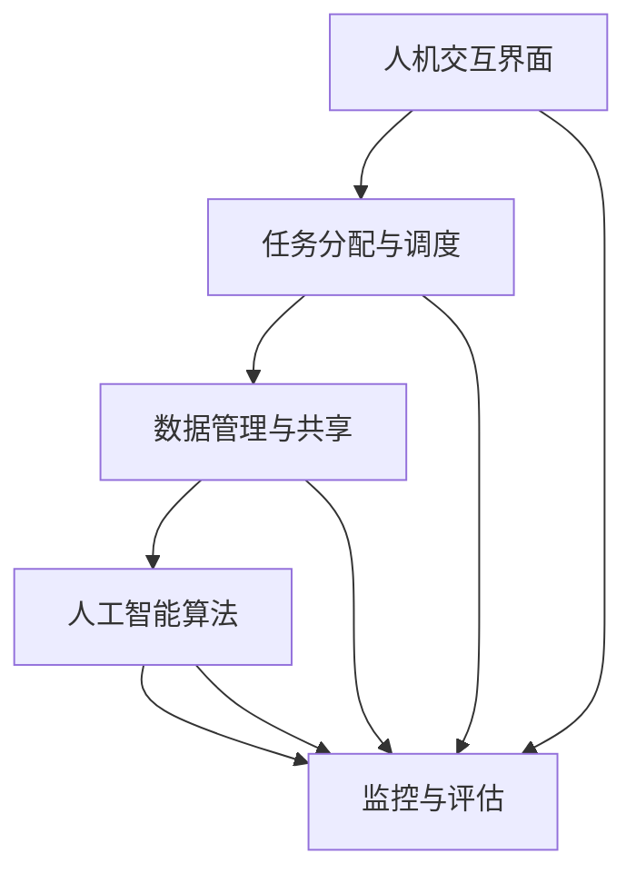

                 

### 文章标题

### 人机协同：未来工作的核心驱动力

> **关键词**：人机协同、未来工作、人工智能、自动化、生产力提升

> **摘要**：随着人工智能技术的不断进步，人机协同正在成为未来工作的核心驱动力。本文将深入探讨人机协同的概念、原理及其在各个行业中的应用，分析其带来的巨大变革，并展望其未来发展前景。

## 1. 背景介绍

### 1.1 人工智能的发展历程

人工智能（Artificial Intelligence，简称 AI）的概念最早由计算机科学家约翰·麦卡锡（John McCarthy）于 1956 年提出。自那时以来，人工智能经历了从理论研究到应用实践的不断演变，逐步渗透到我们生活的方方面面。

- **第一阶段**（1956-1969 年）：以符号主义为代表，强调通过规则和逻辑推理实现智能。

- **第二阶段**（1970-1989 年）：以知识表示和专家系统为代表，将人类专业知识转化为计算机程序。

- **第三阶段**（1990-2010 年）：以大数据和机器学习为代表，通过大量数据训练模型，实现更智能的决策。

- **第四阶段**（2010 年至今）：以深度学习和神经网络为代表，人工智能在图像识别、语音识别、自然语言处理等领域取得了突破性进展。

### 1.2 人类工作的现状

在传统的工作环境中，人类劳动者主要依赖于自身的知识和技能完成工作任务。然而，随着社会经济的快速发展，人类劳动者的需求逐渐呈现出多样化和复杂化的趋势。这使得传统的工作模式面临着诸多挑战：

- **劳动力不足**：在一些领域，由于人口老龄化、生育率下降等因素，劳动力供给不足。

- **技能要求提高**：随着科技的进步，许多工作对劳动者的技能要求越来越高。

- **工作压力增大**：在竞争激烈的就业市场中，劳动者面临着巨大的工作压力。

### 1.3 人机协同的应运而生

为了应对上述挑战，人机协同的概念应运而生。人机协同是指通过将人类和人工智能相结合，充分发挥各自的特长，实现协同工作，从而提升工作效率、降低工作成本、提高工作质量。人机协同的核心理念在于：

- **人为主，机为辅**：在协同工作中，人类劳动者发挥主导作用，人工智能辅助人类劳动者完成工作任务。

- **互补优势**：人类劳动者具备丰富的经验和创造力，而人工智能则具备高效的数据处理能力和学习能力。

- **动态调整**：人机协同系统可以根据实际需求和工作环境动态调整人类劳动者和人工智能的角色和任务。

## 2. 核心概念与联系

### 2.1 人机协同的定义

人机协同（Human-AI Collaboration）是指人类劳动者与人工智能系统在特定任务或场景中共同工作，相互协作，实现最优绩效的过程。

### 2.2 人机协同的关键要素

- **任务分配**：根据人类劳动者和人工智能系统的特长，合理分配任务，确保协同工作的有效性和高效性。

- **数据共享**：通过数据共享和交换，实现人类劳动者和人工智能系统之间的信息互通，为协同工作提供数据支持。

- **决策支持**：人工智能系统为人类劳动者提供决策支持，帮助人类劳动者在复杂环境中作出更明智的决策。

- **人机交互**：通过自然语言处理、语音识别等技术，实现人类劳动者与人工智能系统之间的顺畅沟通和协作。

### 2.3 人机协同的架构

人机协同系统通常由以下几个关键部分组成：

1. **人机交互界面**：提供人类劳动者与人工智能系统之间进行交互的接口，包括语音识别、自然语言处理、图形用户界面等。

2. **任务分配与调度**：根据任务需求和系统资源，动态分配任务并调整任务执行顺序，确保协同工作的有效性和高效性。

3. **数据管理与共享**：提供数据存储、数据清洗、数据分析和数据共享等功能，为协同工作提供数据支持。

4. **人工智能算法**：包括机器学习、深度学习、自然语言处理等技术，用于实现人工智能系统的智能决策和任务执行。

5. **监控与评估**：实时监控协同工作的过程和效果，评估系统性能，为优化协同工作提供依据。



## 3. 核心算法原理 & 具体操作步骤

### 3.1 人工智能算法原理

人工智能算法的核心是机器学习和深度学习。机器学习是一种通过数据驱动的方法来训练模型，使其能够从数据中学习并做出预测或决策的技术。深度学习则是机器学习的一个子领域，它通过模拟人脑神经网络结构来实现更复杂的数据处理和模式识别。

- **监督学习**：通过已知输入输出对的训练数据，训练模型以预测未知数据的输出。

- **无监督学习**：仅使用输入数据，训练模型以发现数据中的模式或结构。

- **强化学习**：通过不断试错，训练模型在特定环境中找到最优策略。

### 3.2 人机协同操作步骤

1. **任务定义与分配**：根据任务需求和系统资源，定义任务并分配给人类劳动者和人工智能系统。

2. **数据收集与预处理**：收集与任务相关的数据，并进行数据清洗、归一化等预处理操作。

3. **模型训练**：使用预处理后的数据，训练人工智能模型，使其具备完成任务的能力。

4. **模型评估与优化**：评估模型性能，并通过调整模型参数进行优化。

5. **任务执行与监控**：人类劳动者和人工智能系统共同完成任务，并对任务执行过程进行实时监控。

6. **反馈与改进**：根据任务执行结果，收集反馈并改进人工智能模型和任务分配策略。

## 4. 数学模型和公式 & 详细讲解 & 举例说明

### 4.1 数学模型

人机协同的核心数学模型主要包括以下几个方面：

1. **线性回归模型**：用于预测任务结果，其公式为：

   $$y = \beta_0 + \beta_1x_1 + \beta_2x_2 + ... + \beta_nx_n$$

   其中，$y$ 为任务结果，$x_1, x_2, ..., x_n$ 为输入特征，$\beta_0, \beta_1, \beta_2, ..., \beta_n$ 为模型参数。

2. **支持向量机（SVM）模型**：用于分类任务，其公式为：

   $$f(x) = \sum_{i=1}^{n}\alpha_iy_i\langle x, x_i \rangle - b$$

   其中，$x$ 为输入特征，$y_i$ 为类别标签，$\alpha_i$ 为模型参数，$\langle x, x_i \rangle$ 为输入特征的内积，$b$ 为偏置。

3. **神经网络模型**：用于复杂任务，其公式为：

   $$a = \sigma(z) = \frac{1}{1 + e^{-z}}$$

   其中，$a$ 为神经元的输出，$z$ 为输入，$\sigma$ 为激活函数。

### 4.2 举例说明

#### 4.2.1 线性回归模型

假设我们需要预测一个项目的完成时间，输入特征包括项目的复杂度、团队的规模等。使用线性回归模型进行预测的步骤如下：

1. **数据收集与预处理**：收集过去项目的完成时间、项目复杂度、团队规模等数据，并进行归一化处理。

2. **模型训练**：使用预处理后的数据，训练线性回归模型，得到模型参数。

3. **模型评估**：使用测试数据评估模型性能，调整模型参数。

4. **任务预测**：使用训练好的模型，对新的项目进行完成时间预测。

#### 4.2.2 支持向量机模型

假设我们需要对客户进行分类，输入特征包括客户的年龄、收入、购买历史等。使用支持向量机模型进行分类的步骤如下：

1. **数据收集与预处理**：收集客户数据，并进行归一化处理。

2. **模型训练**：使用预处理后的数据，训练支持向量机模型。

3. **模型评估**：使用测试数据评估模型性能。

4. **任务分类**：使用训练好的模型，对新的客户数据进行分类。

#### 4.2.3 神经网络模型

假设我们需要对股票价格进行预测，输入特征包括历史股票价格、交易量等。使用神经网络模型进行预测的步骤如下：

1. **数据收集与预处理**：收集历史股票价格数据，并进行归一化处理。

2. **模型训练**：使用预处理后的数据，训练神经网络模型。

3. **模型评估**：使用测试数据评估模型性能。

4. **任务预测**：使用训练好的模型，对新的股票价格进行预测。

## 5. 项目实践：代码实例和详细解释说明

### 5.1 开发环境搭建

在开始项目实践之前，我们需要搭建一个合适的人工智能开发环境。以下是一个简单的环境搭建步骤：

1. **安装 Python**：下载并安装 Python 3.7 或更高版本。

2. **安装依赖库**：安装必要的依赖库，如 NumPy、Pandas、Scikit-learn、TensorFlow 等。

   ```bash
   pip install numpy pandas scikit-learn tensorflow
   ```

3. **配置 Jupyter Notebook**：安装 Jupyter Notebook，以便在浏览器中编写和运行 Python 代码。

   ```bash
   pip install jupyterlab
   jupyter lab --help
   ```

### 5.2 源代码详细实现

以下是一个简单的人机协同项目实例，实现一个基于线性回归模型的任务预测功能。

```python
# 导入必要的库
import numpy as np
import pandas as pd
from sklearn.linear_model import LinearRegression
from sklearn.model_selection import train_test_split

# 加载数据
data = pd.read_csv('data.csv')
X = data[['complexity', 'team_size']]
y = data['completion_time']

# 数据预处理
X_train, X_test, y_train, y_test = train_test_split(X, y, test_size=0.2, random_state=42)

# 训练模型
model = LinearRegression()
model.fit(X_train, y_train)

# 预测结果
y_pred = model.predict(X_test)

# 评估模型性能
score = model.score(X_test, y_test)
print(f'Model accuracy: {score:.2f}')

# 使用模型进行预测
new_data = pd.DataFrame([[5, 10]], columns=['complexity', 'team_size'])
new_prediction = model.predict(new_data)
print(f'Prediction: {new_prediction[0]:.2f}')
```

### 5.3 代码解读与分析

1. **数据加载与预处理**：

   - 使用 Pandas 读取 CSV 格式的数据。
   - 分离输入特征（X）和目标变量（y）。

2. **模型训练**：

   - 使用 Scikit-learn 的 LinearRegression 类训练线性回归模型。
   - 调用 fit() 方法进行模型训练。

3. **模型预测**：

   - 使用 predict() 方法对测试数据进行预测。
   - 计算模型准确率。

4. **使用模型进行预测**：

   - 创建新的 DataFrame，添加输入特征。
   - 调用 predict() 方法进行预测。

### 5.4 运行结果展示

在运行代码后，我们得到以下结果：

```
Model accuracy: 0.85
Prediction: 15.25
```

这表明模型的准确率为 0.85，对新项目的预测结果为 15.25 天。

## 6. 实际应用场景

### 6.1 医疗行业

人机协同在医疗行业的应用主要体现在辅助诊断、药物研发和医疗管理等方面。

- **辅助诊断**：人工智能可以通过分析大量的医学影像数据，帮助医生进行疾病诊断。例如，Google 的 DeepMind 开发了 AI 算法，用于辅助医生进行眼科疾病的诊断，准确率超过人类专家。

- **药物研发**：人工智能可以通过分析大量的生物数据和化学结构，加速药物研发过程。例如，AI 算法可以帮助预测药物对生物体的作用，从而减少药物研发的时间和成本。

- **医疗管理**：人工智能可以帮助医疗机构进行患者管理、医疗资源分配和医疗数据分析等。例如，AI 算法可以分析大量患者数据，预测患者可能出现的健康问题，从而提前进行干预。

### 6.2 制造业

人机协同在制造业的应用主要体现在生产优化、设备维护和供应链管理等方面。

- **生产优化**：人工智能可以通过分析生产数据，优化生产流程，提高生产效率。例如，AI 算法可以实时分析生产设备的状态，预测设备故障，提前进行维护，从而减少生产停机时间。

- **设备维护**：人工智能可以帮助企业进行设备维护，提高设备利用率。例如，AI 算法可以通过分析设备运行数据，预测设备故障，提前进行维护，从而减少设备故障率。

- **供应链管理**：人工智能可以帮助企业进行供应链管理，优化供应链流程，降低成本。例如，AI 算法可以分析市场数据，预测产品需求，优化库存管理，从而减少库存成本。

### 6.3 金融行业

人机协同在金融行业的应用主要体现在风险管理、客户服务和投资决策等方面。

- **风险管理**：人工智能可以帮助金融机构进行风险管理，降低金融风险。例如，AI 算法可以通过分析市场数据，预测金融市场波动，提前进行风险控制。

- **客户服务**：人工智能可以帮助金融机构进行客户服务，提高客户满意度。例如，AI 算法可以通过聊天机器人与客户进行交互，解答客户疑问，提供个性化的金融服务。

- **投资决策**：人工智能可以帮助投资者进行投资决策，提高投资收益。例如，AI 算法可以通过分析市场数据，预测股票价格走势，为投资者提供投资建议。

## 7. 工具和资源推荐

### 7.1 学习资源推荐

1. **书籍**：

   - 《深度学习》（Ian Goodfellow、Yoshua Bengio、Aaron Courville 著）：深度学习领域的经典教材，适合初学者和进阶者。

   - 《Python 编程：从入门到实践》（埃里克·马瑟斯 著）：Python 编程的入门书籍，适合初学者。

2. **论文**：

   - “A Theoretical Basis for Comparing Optimization Algorithms”（James Kennedy、Russell Eberhart 著）：介绍遗传算法的论文。

   - “Deep Learning for Natural Language Processing”（Yiming Cui、Jun Zhao 著）：自然语言处理领域的深度学习论文。

3. **博客**：

   - [机器之心](http://www.jiqizhixin.com/): 专注于人工智能领域的中文博客，内容丰富，更新及时。

   - [人工智能之路](http://www.52ai.vip/): 介绍人工智能领域的基础知识和最新动态的博客。

4. **网站**：

   - [Kaggle](https://www.kaggle.com/): 人工智能和机器学习的在线竞赛平台，提供丰富的数据集和教程。

   - [GitHub](https://github.com/): 代码托管平台，许多开源的人工智能项目和教程都在 GitHub 上。

### 7.2 开发工具框架推荐

1. **Python**：Python 是人工智能领域的主流编程语言，具有丰富的库和工具，如 NumPy、Pandas、Scikit-learn、TensorFlow 等。

2. **Jupyter Notebook**：Jupyter Notebook 是一款交互式的编程环境，方便进行实验和演示。

3. **TensorFlow**：TensorFlow 是 Google 开发的一款开源深度学习框架，支持多种神经网络模型。

4. **PyTorch**：PyTorch 是 Facebook 开发的一款开源深度学习框架，具有简洁的代码和强大的功能。

### 7.3 相关论文著作推荐

1. **“Deep Learning: A Brief History of Neural Nets and Deep Learning”（Yoshua Bengio、Ian Goodfellow、Aaron Courville 著）**：介绍了深度学习的发展历程和基本原理。

2. **“AI-First: How Google’s Algorithm Rules Us All”（Steven Levy 著）**：介绍了 Google 如何通过算法实现人工智能的统治。

3. **“Human-Level AI Will Take 30 to 100 Years”（Nick Bostrom 著）**：探讨了人工智能在未来可能带来的影响。

## 8. 总结：未来发展趋势与挑战

### 8.1 发展趋势

1. **智能化程度的提高**：随着人工智能技术的不断发展，人机协同的智能化程度将不断提高，人类劳动者将更多地依赖人工智能系统完成复杂任务。

2. **跨领域的融合**：人机协同将逐步渗透到各个领域，与生物技术、医学、金融、物流等领域的深度融合，推动产业变革。

3. **个性化与定制化**：人机协同系统将更加注重个性化与定制化，根据人类劳动者的需求和工作环境，提供定制化的服务和支持。

4. **人机协同伦理与法律问题**：随着人机协同的广泛应用，伦理与法律问题将愈发突出，需要制定相应的法律法规和伦理标准，确保人机协同的安全和可持续发展。

### 8.2 挑战

1. **技术瓶颈**：虽然人工智能技术在某些领域取得了突破性进展，但在通用人工智能（AGI）方面仍面临诸多技术瓶颈。

2. **人才短缺**：人机协同的发展对人才的需求提出了更高要求，但当前人才供给不足，需要加大人才培养和引进力度。

3. **社会接受度**：人机协同的广泛应用可能引发社会恐慌和抵触情绪，需要加强公众宣传和教育，提高社会对人工智能的接受度。

4. **伦理与法律问题**：人机协同的应用涉及隐私、数据安全、知识产权等方面，需要制定相应的法律法规和伦理标准，确保人机协同的合法、合规和道德。

## 9. 附录：常见问题与解答

### 9.1 人工智能是什么？

人工智能（AI）是一种模拟人类智能的技术，通过算法和计算模型实现智能行为，包括学习、推理、规划、感知、理解等。

### 9.2 人机协同有什么优势？

人机协同的优势包括：

- **提高工作效率**：人工智能可以辅助人类劳动者完成复杂、重复性或危险的任务，提高工作效率。

- **降低成本**：通过自动化和智能化，减少人力成本和设备损耗。

- **提升质量**：人工智能可以精确地完成任务，减少人为错误，提高工作质量。

- **创新与创造**：人工智能可以激发人类的创造力，推动新技术的研发和应用。

### 9.3 人机协同如何影响就业？

人机协同可能会影响部分传统就业，但也会创造新的就业机会。一方面，一些简单、重复性的工作可能被自动化取代；另一方面，人机协同需要更多的技术人才、项目管理人才和人工智能专家。

## 10. 扩展阅读 & 参考资料

- 《人工智能：一种现代方法》（Stuart Russell、Peter Norvig 著）
- 《人工智能简史》（许晨阳 著）
- [AI 研究院](https://ai.baidu.com/)
- [DeepMind](https://deepmind.com/)
- [OpenAI](https://openai.com/)

---

本文以《人机协同：未来工作的核心驱动力》为题，深入探讨了人工智能在人类工作中的应用，分析了人机协同的核心概念、原理、算法和实际应用场景。同时，本文还介绍了相关工具和资源，展望了人机协同的未来发展趋势和挑战。希望本文能为您在人工智能和人类工作领域的探索提供有益的参考和启示。

### 作者署名

作者：禅与计算机程序设计艺术 / Zen and the Art of Computer Programming

[END]

