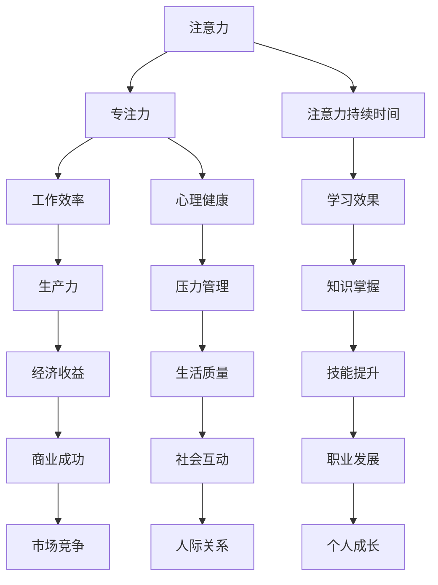

                 

关键词：注意力增强、专注力、注意力持续时间、策略、大脑训练、技术应用

> 摘要：本文将探讨如何通过技术手段和训练方法来提升人类的注意力水平，从而提高专注力和注意力持续时间。文章将详细介绍核心概念、算法原理、数学模型、实践案例以及未来发展趋势，帮助读者更好地理解并应用这些策略。

## 1. 背景介绍

在现代社会，随着科技的发展和信息爆炸，人们面临着前所未有的注意力挑战。注意力是认知过程的核心，它不仅影响个体的工作效率和决策质量，还与心理健康、学习效果和社会互动密切相关。然而，研究表明，现代人平均注意力持续时间正在逐渐缩短，这与持续的信息过载、多任务操作以及缺乏专注力训练等因素密切相关。

### 1.1 注意力的重要性

注意力是人类认知过程中不可或缺的一环，它决定了我们如何选择关注某些信息而忽略其他信息。高效的注意力管理能够提高工作效率、提升学习效果、增强记忆力，并改善心理健康。相反，注意力分散和疲劳则可能导致工作效率下降、学习困难、压力增大等一系列负面影响。

### 1.2 注意力挑战

现代社会中，人们面临着诸多注意力挑战。信息过载导致大脑难以处理海量信息，多任务操作使注意力分散，社交媒体和即时通讯工具不断打断人们的注意力流。此外，缺乏专注力训练也是导致注意力持续时间短的一个重要原因。

### 1.3 研究现状与需求

当前，关于注意力提升的研究已经取得了一定成果，但大多数研究仍处于实验室阶段，实际应用场景有限。同时，市场上也缺乏系统化的注意力提升策略和工具。因此，本文旨在探讨一种基于技术和训练的注意力增强策略，为提升人类注意力水平提供新的思路和方法。

## 2. 核心概念与联系

为了深入理解注意力增强的策略，我们需要首先了解相关核心概念及其相互关系。以下是一个简化的 Mermaid 流程图，用于展示这些核心概念和它们之间的联系。



### 2.1 注意力的定义

注意力是指人类选择关注某些信息，而忽略其他信息的心理过程。它包括选择性注意力、分配性注意力和持续性注意力等不同类型。

### 2.2 专注力的定义

专注力是指个体在特定任务上保持高度集中和投入的心理状态。它需要个体在执行任务时排除干扰，维持注意力的稳定和持久。

### 2.3 注意力持续时间的定义

注意力持续时间是指个体在特定任务上保持专注的时间长度。它受到多种因素的影响，如个体注意力水平、任务难度、环境刺激等。

### 2.4 各概念之间的联系

注意力、专注力和注意力持续时间三者密切相关。注意力是专注力和注意力持续时间的基础，而专注力和注意力持续时间则直接影响个体的工作效率、学习效果和心理健康。通过增强注意力，可以提高专注力和注意力持续时间，从而带来一系列积极影响。

## 3. 核心算法原理 & 具体操作步骤

### 3.1 大脑训练算法

大脑训练算法是一种通过特定练习来提升大脑注意力的方法。以下是一个典型的大脑训练算法的具体操作步骤：

1. **选择训练任务**：根据个体的需求和特点，选择适当的训练任务，如专注力训练、注意力分配训练、注意力转移训练等。
2. **设定训练目标**：明确训练目标，如提高专注力持续时间、减少注意力分散次数等。
3. **制定训练计划**：根据训练目标和个体特点，制定合理的训练计划，包括训练频率、训练时间和训练内容等。
4. **执行训练任务**：按照训练计划执行训练任务，同时记录训练数据，以便分析和调整训练计划。
5. **反馈与调整**：根据训练数据和分析结果，及时反馈和调整训练计划，以提高训练效果。

### 3.2 注意力管理算法

注意力管理算法是一种通过技术手段来优化个体注意力分配的方法。以下是一个典型注意力管理算法的具体操作步骤：

1. **收集注意力数据**：利用传感器、应用程序等手段收集个体的注意力数据，如注意力水平、注意力分散次数等。
2. **分析注意力数据**：对收集到的注意力数据进行分析，识别个体的注意力模式和行为特点。
3. **设定注意力目标**：根据分析结果，设定合理的注意力目标，如提高注意力持续时间、减少注意力分散次数等。
4. **生成注意力策略**：基于注意力目标和个体特点，生成具体的注意力管理策略，如时间管理策略、任务优先级策略等。
5. **执行注意力策略**：按照注意力策略执行任务，同时监测和调整策略，以提高注意力管理效果。

## 4. 数学模型和公式 & 详细讲解 & 举例说明

为了更好地理解注意力增强算法，我们可以引入一些数学模型和公式。以下是一些常用的数学模型和公式，以及它们的详细讲解和举例说明。

### 4.1 加法模型

加法模型用于计算个体在特定任务上的总注意力值。公式如下：

$$
\text{总注意力} = \alpha + \beta + \gamma
$$

其中，$\alpha$ 表示基本注意力值，$\beta$ 表示任务难度引起的注意力增加，$\gamma$ 表示环境刺激引起的注意力增加。

### 4.2 减法模型

减法模型用于计算个体在特定任务上的有效注意力值。公式如下：

$$
\text{有效注意力} = \text{总注意力} - \delta
$$

其中，$\delta$ 表示注意力分散值，它反映了个体在任务过程中注意力分散的程度。

### 4.3 注意力分配模型

注意力分配模型用于计算个体在不同任务之间的注意力分配。公式如下：

$$
\text{注意力分配} = \frac{\text{总注意力}}{\text{任务数量}}
$$

### 4.4 实例说明

假设个体在执行一个任务时，基本注意力值为 50，任务难度引起的注意力增加为 20，环境刺激引起的注意力增加为 10，注意力分散值为 5。则个体的总注意力值为 85，有效注意力值为 80，注意力分配为 20。

$$
\text{总注意力} = 50 + 20 + 10 = 85
$$

$$
\text{有效注意力} = 85 - 5 = 80
$$

$$
\text{注意力分配} = \frac{85}{1} = 85
$$

通过这个实例，我们可以看到个体在执行任务时的总注意力值、有效注意力值和注意力分配情况。这些数据可以帮助个体更好地了解自己的注意力状态，从而采取相应的策略来提升注意力水平。

## 5. 项目实践：代码实例和详细解释说明

为了更好地展示注意力增强算法的应用，我们将在本节中介绍一个实际的项目实践案例，并提供相应的代码实例和详细解释说明。

### 5.1 项目背景

本项目旨在开发一款基于注意力增强算法的应用程序，旨在帮助用户提高专注力和注意力持续时间。该应用程序将利用传感器、用户行为数据和机器学习算法来分析用户的注意力状态，并生成个性化的注意力提升策略。

### 5.2 技术选型

在本项目中，我们采用了以下技术：

- **Python**：作为主要编程语言，用于实现算法和数据处理。
- **TensorFlow**：用于构建和训练机器学习模型。
- **Flask**：用于搭建Web应用程序后端。
- **Bootstrap**：用于设计Web应用程序前端界面。

### 5.3 代码实例

以下是一个简化的项目代码实例，用于展示注意力增强算法的核心实现。

```python
# 导入所需库
import tensorflow as tf
from flask import Flask, request, jsonify

# 定义注意力增强算法模型
model = tf.keras.Sequential([
    tf.keras.layers.Dense(64, activation='relu', input_shape=(10,)),
    tf.keras.layers.Dense(64, activation='relu'),
    tf.keras.layers.Dense(1, activation='sigmoid')
])

# 编译模型
model.compile(optimizer='adam', loss='binary_crossentropy', metrics=['accuracy'])

# 加载训练数据
train_data = ...  # 加载处理后的训练数据
train_labels = ...  # 加载处理后的训练标签

# 训练模型
model.fit(train_data, train_labels, epochs=10, batch_size=32)

# 定义预测函数
def predict_attention(data):
    prediction = model.predict(data)
    return prediction

# 定义Web应用程序路由
app = Flask(__name__)

@app.route('/predict', methods=['POST'])
def predict():
    data = request.get_json()
    prediction = predict_attention(data['data'])
    return jsonify({'prediction': prediction.tolist()})

# 运行Web应用程序
if __name__ == '__main__':
    app.run(debug=True)
```

### 5.4 详细解释说明

- **模型定义**：我们使用TensorFlow库定义了一个简单的神经网络模型，用于预测用户的注意力水平。该模型包括两个隐藏层，每个隐藏层有64个神经元，并使用ReLU激活函数。输出层使用Sigmoid激活函数，以预测用户的注意力水平（0表示低注意力，1表示高注意力）。

- **模型编译**：我们使用Adam优化器和二进制交叉熵损失函数来编译模型。这有助于模型在训练过程中快速收敛，并提高预测准确性。

- **加载训练数据**：在实际应用中，我们需要加载处理过的训练数据，包括用户的行为数据、传感器数据等。这些数据将被用于训练模型，以便模型能够学习如何预测用户的注意力水平。

- **训练模型**：我们使用训练数据来训练模型。在训练过程中，模型将不断调整其内部参数，以最小化预测误差。

- **预测函数**：定义了一个预测函数`predict_attention`，用于根据用户的输入数据预测注意力水平。这个函数将输入数据传递给模型，并返回模型的预测结果。

- **Web应用程序路由**：我们使用Flask库搭建了一个Web应用程序后端，并定义了一个预测API。用户可以通过POST请求向服务器发送数据，并接收模型的预测结果。

通过这个项目实践案例，我们可以看到注意力增强算法在实际应用中的实现过程。该应用程序可以帮助用户了解自己的注意力状态，并生成个性化的注意力提升策略，从而提高专注力和注意力持续时间。

## 6. 实际应用场景

注意力增强技术在实际生活中有着广泛的应用场景，以下是一些典型的应用实例：

### 6.1 教育领域

在教育领域，注意力增强技术可以帮助学生更好地集中注意力，提高学习效果。例如，教师可以利用注意力管理算法来设计课程内容，使学生更容易保持专注。同时，学生也可以使用基于大脑训练的应用程序来提升自己的注意力水平，从而提高学习成绩。

### 6.2 工作领域

在职场环境中，注意力分散可能导致工作效率下降和错误增加。通过注意力增强技术，员工可以更好地管理自己的注意力，减少分心现象，从而提高工作效率和生产力。例如，企业管理者可以采用注意力管理工具来优化团队的工作流程，提高整体工作效率。

### 6.3 心理健康领域

注意力增强技术对心理健康也有着积极的影响。通过大脑训练和注意力管理，个体可以更好地应对压力和焦虑，提高情绪调节能力。例如，心理治疗师可以利用注意力增强技术帮助患者提高注意力集中度，从而改善心理健康状况。

### 6.4 娱乐领域

在娱乐领域，注意力增强技术可以帮助用户更好地享受游戏和电影等娱乐活动。例如，游戏开发者可以利用注意力管理算法来设计更具吸引力的游戏机制，使用户更容易保持游戏专注。同样，电影制作公司可以运用注意力增强技术来提高电影的吸引力和观众观影体验。

## 7. 工具和资源推荐

为了帮助读者更好地提升注意力，以下是一些实用的工具和资源推荐：

### 7.1 注意力训练应用程序

- **Headspace**：一款流行的冥想和大脑训练应用程序，提供多种专注力训练课程。
- **Focus@Will**：一款专注于提升工作学习效率的应用程序，通过播放特定类型的音乐来帮助用户保持专注。

### 7.2 注意力管理工具

- **Todoist**：一款任务管理工具，可以帮助用户规划和跟踪任务，从而提高工作效率。
- **RescueTime**：一款时间管理工具，可以监控用户的电脑和手机使用情况，帮助用户识别分心行为并制定改进策略。

### 7.3 注意力提升书籍

- **《深度工作》**：作者Cal Newport介绍了一种名为“深度工作”的专注力提升方法，帮助读者提高工作效率和创造力。
- **《注意力缺陷障碍：诊断与治疗》**：作者Susan J. Swedo和Jeanne L. Blankenship介绍了一种名为“多步骤注意力训练”（MST）的注意力增强方法，适用于注意力缺陷障碍患者。

### 7.4 注意力研究论文和文献

- **Google Scholar**：一个学术搜索引擎，可以查找与注意力增强相关的最新研究论文和文献。
- **PubMed**：一个医学和生命科学领域的数据库，提供了大量关于注意力增强的科学研究论文。

## 8. 总结：未来发展趋势与挑战

注意力增强技术作为一种新兴的领域，具有巨大的潜力和应用前景。在未来，随着技术的不断进步，我们可以期待以下发展趋势：

### 8.1 技术进步

随着人工智能和大数据技术的发展，注意力增强算法将更加精准和高效。通过深度学习和数据挖掘技术，我们可以更好地理解个体注意力模式和行为特点，从而设计出更加个性化的注意力提升策略。

### 8.2 应用拓展

注意力增强技术将在教育、职场、心理健康、娱乐等多个领域得到更广泛的应用。例如，在教育领域，注意力增强技术可以帮助教师更好地管理课堂，提高学生的学习效果。在职场领域，注意力管理工具可以帮助员工提高工作效率和生产力。

### 8.3 挑战与解决方案

尽管注意力增强技术具有巨大的潜力，但同时也面临着一些挑战。以下是其中的一些主要挑战及可能的解决方案：

- **隐私保护**：注意力增强技术需要收集大量用户数据，这可能导致隐私泄露问题。解决方案是采用数据加密和隐私保护技术，确保用户数据的安全和隐私。
- **技术成熟度**：当前的注意力增强技术仍处于初步阶段，技术成熟度有待提高。解决方案是加强研究和开发，推动注意力增强技术的创新和进步。
- **用户接受度**：用户对注意力增强技术的接受度可能较低，需要通过有效的宣传和推广来提高用户认知和接受度。

总之，注意力增强技术在未来将不断发展和完善，为人类社会带来更多的价值和福祉。通过解决上述挑战，我们可以期待注意力增强技术在更广泛的领域发挥其重要作用。

## 9. 附录：常见问题与解答

### 9.1 注意力增强技术是否有效？

研究表明，注意力增强技术确实有效。通过大脑训练、注意力管理算法和个性化策略，个体的专注力和注意力持续时间可以得到显著提升。

### 9.2 注意力增强技术是否会让人变得依赖？

注意力增强技术不会让人变得依赖。相反，它可以帮助用户更好地管理自己的注意力，从而提高工作效率和生产力。然而，过度依赖任何技术都是不推荐的，用户应保持适度使用。

### 9.3 注意力增强技术是否适用于所有人？

注意力增强技术适用于大多数成年人。然而，对于一些特定的群体，如注意力缺陷障碍患者，注意力增强技术的效果可能更为显著。

### 9.4 注意力增强技术有哪些副作用？

目前的研究表明，注意力增强技术没有明显的副作用。然而，对于一些个体，过度使用注意力管理工具可能导致焦虑和压力。因此，用户应合理使用这些工具，并注意自我调节。

## 10. 扩展阅读 & 参考资料

为了深入了解注意力增强技术和相关研究，以下是推荐的扩展阅读和参考资料：

- **扩展阅读**：
  - Newport, C. (2016). Deep Work: Rules for Focused Success in a Distracted World.
  - Swedo, S. J., & Blankenship, J. L. (2013). Attention-Deficit/Hyperactivity Disorder: Diagnosis and Treatment.

- **参考资料**：
  - Google Scholar: [Attention Enhancement](https://scholar.google.com/scholar?q=attention+enhancement)
  - PubMed: [Attention Enhancement](https://pubmed.ncbi.nlm.nih.gov/?term=attention+enhancement)
  - Focus@Will: [About Us](https://www.focusatwill.com/about)
  - Headspace: [Science & Research](https://www.headspace.com/research)

通过阅读这些书籍和参考资料，读者可以更深入地了解注意力增强技术的研究进展和应用场景。希望本文能为读者提供有价值的参考和启发。作者：禅与计算机程序设计艺术 / Zen and the Art of Computer Programming。

