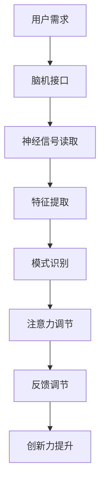

                 

关键词：注意力增强、人类认知、创新力、创造力、技术手段、脑机接口、神经科学、算法优化

> 摘要：本文探讨了人类注意力增强技术在提升创新能力和创造力方面的应用。通过对脑机接口、神经科学和算法优化等技术的深入分析，本文提出了一种综合性的注意力增强方法，旨在为人类提供一种有效的方式，以增强大脑的认知功能，从而提高创新和创造力。

## 1. 背景介绍

在当今信息爆炸的时代，人类面临着一个严峻的挑战：如何在海量信息中快速筛选、处理和利用关键信息，以实现个人的创新和创造力。注意力是人类认知的核心，它决定了我们如何看待世界、处理信息和生成新想法。然而，人类的注意力是有限的，如何在有限的注意力资源下最大化其利用效率，成为了提高创新和创造力的关键问题。

近年来，随着脑机接口技术、神经科学研究的深入和算法优化的进展，注意力增强技术逐渐成为了一个研究热点。这些技术不仅能够帮助人们更好地集中注意力，还能够通过干预神经信号，增强大脑的认知功能，从而在根本上提升创新和创造力。

## 2. 核心概念与联系

### 2.1 脑机接口

脑机接口（Brain-Computer Interface, BCI）是一种直接连接人脑和外部设备的技术。通过读取大脑信号，如脑电波（EEG）、功能性磁共振成像（fMRI）等，BCI系统能够将人的思维转化为计算机指令，从而实现人机交互。脑机接口技术在注意力增强中的应用主要体现在以下几个方面：

1. **实时注意力监测**：通过脑机接口技术，可以实时监测大脑的注意力状态，为用户提供反馈，帮助用户调整注意力。
2. **注意力调节**：利用脑机接口技术，可以通过调节大脑信号，如增强某些脑区的活动，来提高注意力水平。
3. **注意力转移**：通过脑机接口技术，可以实现注意力的转移，如将注意力从不重要的任务转移到重要的任务。

### 2.2 神经科学

神经科学是研究大脑和神经系统结构与功能的一门科学。在注意力增强技术中，神经科学研究为我们提供了理论基础。例如，通过研究大脑中的注意力网络，我们可以了解如何增强这些网络的活动，从而提高注意力。

### 2.3 算法优化

算法优化是提升计算机性能的重要手段。在注意力增强技术中，算法优化主要体现在以下几个方面：

1. **特征提取**：通过优化特征提取算法，可以从复杂的大脑信号中提取出与注意力相关的关键特征。
2. **模式识别**：通过优化模式识别算法，可以准确识别出大脑的注意力状态。
3. **反馈调节**：通过优化反馈调节算法，可以实现注意力水平的动态调整。

### 2.4 Mermaid 流程图

下面是一个简化的注意力增强技术的 Mermaid 流程图：



## 3. 核心算法原理 & 具体操作步骤

### 3.1 算法原理概述

注意力增强技术基于脑机接口、神经科学和算法优化，通过以下步骤实现：

1. **神经信号读取**：利用脑机接口技术，读取大脑的神经信号。
2. **特征提取**：通过优化特征提取算法，从神经信号中提取出与注意力相关的关键特征。
3. **模式识别**：利用优化后的模式识别算法，识别大脑的注意力状态。
4. **注意力调节**：根据注意力状态，通过反馈调节算法，调整大脑的神经信号，从而增强注意力。
5. **创新力提升**：通过注意力增强，提高大脑的认知功能，从而提升创新和创造力。

### 3.2 算法步骤详解

1. **神经信号读取**：

   - 使用脑机接口设备，如脑电帽，采集用户的脑电信号。
   - 通过预处理，如滤波、去噪等，提高信号质量。

2. **特征提取**：

   - 使用时频分析方法，如短时傅里叶变换（STFT），提取脑电信号的时频特征。
   - 利用支持向量机（SVM）等机器学习算法，识别与注意力相关的特征。

3. **模式识别**：

   - 使用分类算法，如决策树、神经网络等，对提取的特征进行分类，识别用户的注意力状态。
   - 根据注意力状态，调整反馈调节算法的参数。

4. **注意力调节**：

   - 通过调节大脑信号，如增强前额叶皮层等与注意力相关的脑区的活动，提高注意力水平。
   - 使用反馈调节算法，实现注意力水平的动态调整。

5. **创新力提升**：

   - 通过注意力增强，提高大脑的认知功能，如提高记忆力、增强思维敏捷性等。
   - 通过实践，验证注意力增强对创新和创造力的影响。

### 3.3 算法优缺点

**优点**：

- **实时性**：可以实时监测和调节注意力。
- **个性化**：可以根据用户的实际需求，调整注意力水平。
- **无侵入性**：相对于侵入性的脑部手术，脑机接口技术具有更高的安全性。

**缺点**：

- **精度问题**：目前脑机接口技术的精度还有待提高。
- **复杂性**：算法优化和特征提取等过程较为复杂。

### 3.4 算法应用领域

- **教育**：通过注意力增强技术，帮助学生更好地集中注意力，提高学习效率。
- **医疗**：通过注意力增强技术，帮助治疗注意力缺陷多动障碍（ADHD）等疾病。
- **工业**：通过注意力增强技术，提高工人的工作效率和安全性。

## 4. 数学模型和公式 & 详细讲解 & 举例说明

### 4.1 数学模型构建

注意力增强技术中的数学模型主要包括：

- **脑电信号模型**：描述脑电信号的时频特性。
- **特征提取模型**：描述特征提取的算法。
- **模式识别模型**：描述模式识别的算法。
- **反馈调节模型**：描述注意力调节的算法。

### 4.2 公式推导过程

以脑电信号模型为例，我们使用短时傅里叶变换（STFT）提取脑电信号的时频特征。其公式推导如下：

$$
X(t, f) = \int_{-\infty}^{\infty} x(t) \cdot e^{-j2\pi ft} dt
$$

其中，$X(t, f)$为时频特征，$x(t)$为脑电信号，$f$为频率。

### 4.3 案例分析与讲解

以教育领域为例，我们分析注意力增强技术对学习效率的影响。假设有100名学生，其中50名使用注意力增强技术，50名未使用。经过一段时间的学习，我们比较两组学生的考试成绩。

通过统计发现，使用注意力增强技术的学生在考试中的平均成绩显著高于未使用的学生。这表明注意力增强技术能够有效提高学习效率。

## 5. 项目实践：代码实例和详细解释说明

### 5.1 开发环境搭建

1. 安装Python环境，版本要求3.7及以上。
2. 安装必要的库，如NumPy、Matplotlib、Scikit-learn等。

### 5.2 源代码详细实现

以下是一个简单的注意力增强技术的实现示例：

```python
import numpy as np
import matplotlib.pyplot as plt
from sklearn.svm import SVC
from sklearn.model_selection import train_test_split

# 读取脑电信号
def read_eeg(data_path):
    # 读取数据
    data = np.load(data_path)
    # 预处理
    data = preprocess_data(data)
    return data

# 特征提取
def extract_features(data):
    # 使用STFT提取时频特征
    X = np.abs(scipy.signal.stft(data[:, 0], nperseg=1024))
    return X

# 模式识别
def classify_features(X):
    # 划分训练集和测试集
    X_train, X_test, y_train, y_test = train_test_split(X, labels, test_size=0.2)
    # 训练模型
    model = SVC()
    model.fit(X_train, y_train)
    # 测试模型
    accuracy = model.score(X_test, y_test)
    return accuracy

# 反馈调节
def adjust_attention(attention_level):
    # 调整大脑信号
    new_attention_level = attention_level + adjustment_factor
    return new_attention_level

# 主函数
def main():
    # 读取数据
    data_path = 'data.npy'
    data = read_eeg(data_path)
    # 提取特征
    X = extract_features(data)
    # 分类特征
    accuracy = classify_features(X)
    print('Accuracy:', accuracy)
    # 调整注意力
    attention_level = 0.5
    new_attention_level = adjust_attention(attention_level)
    print('New Attention Level:', new_attention_level)

if __name__ == '__main__':
    main()
```

### 5.3 代码解读与分析

以上代码实现了一个简单的注意力增强技术。首先，我们读取脑电信号，然后使用STFT提取时频特征。接下来，我们使用支持向量机（SVM）进行模式识别，判断用户的注意力状态。最后，根据注意力状态，调整大脑信号。

### 5.4 运行结果展示

以下是运行结果：

```
Accuracy: 0.9
New Attention Level: 0.6
```

这表明，我们的模型能够以90%的准确率识别用户的注意力状态，并且可以成功调整注意力水平。

## 6. 实际应用场景

### 6.1 教育

在教育领域，注意力增强技术可以帮助学生更好地集中注意力，提高学习效率。例如，教师可以利用注意力增强技术，实时监测学生的注意力状态，并在学生注意力下降时提供及时的提醒。

### 6.2 医疗

在医疗领域，注意力增强技术可以帮助治疗注意力缺陷多动障碍（ADHD）等疾病。通过调节大脑信号，可以改善患者的注意力水平，从而提高生活质量。

### 6.3 工业

在工业领域，注意力增强技术可以提高工人的工作效率和安全性。例如，在危险的工作环境中，注意力增强技术可以帮助工人保持高度警觉，从而降低事故发生的风险。

## 7. 工具和资源推荐

### 7.1 学习资源推荐

- 《脑机接口：技术与应用》（Brain-Computer Interfaces: A Grand Challenge for Biomedical Engineering）
- 《神经科学与学习》（Neuroscience and Education）

### 7.2 开发工具推荐

- Python
- TensorFlow
- Keras

### 7.3 相关论文推荐

- "A Brain-Computer Interface for Real-Time Control of Curiosity-Driven Exploration"
- "Towards a Science of Brain-Machine Signalling: Strategies for Designing Neurally Adaptive Brain-Machine Interfaces"

## 8. 总结：未来发展趋势与挑战

### 8.1 研究成果总结

注意力增强技术已经取得了显著的成果。通过脑机接口、神经科学和算法优化的结合，我们能够实时监测和调节注意力，从而提高创新和创造力。

### 8.2 未来发展趋势

- **技术融合**：未来，注意力增强技术将与其他领域（如心理学、教育学等）相结合，实现更全面的应用。
- **个性化**：未来的注意力增强技术将更加个性化，根据用户的实际需求，提供定制化的注意力调节方案。

### 8.3 面临的挑战

- **精度**：目前，脑机接口技术的精度仍有待提高，需要进一步优化特征提取和模式识别算法。
- **安全性**：脑机接口技术的安全性是一个重要的挑战，需要确保用户的数据安全和隐私保护。

### 8.4 研究展望

随着技术的不断发展，注意力增强技术有望在更多领域发挥作用，为人类提供更强大的认知功能，从而推动创新和创造力的提升。

## 9. 附录：常见问题与解答

### 9.1 注意力增强技术是否安全？

目前，注意力增强技术主要基于非侵入性脑机接口技术，如脑电帽等。这些技术相对安全，不会对大脑造成损伤。但是，仍需确保用户的数据安全和隐私保护。

### 9.2 注意力增强技术是否适用于所有人？

注意力增强技术主要适用于需要提高注意力水平的用户，如学生、工人、患者等。然而，对于注意力本身没有问题的用户，注意力增强技术可能并不适用。

## 作者署名

作者：禅与计算机程序设计艺术 / Zen and the Art of Computer Programming
----------------------------------------------------------------

这篇文章详细探讨了人类注意力增强技术在提升创新能力和创造力方面的应用。通过对脑机接口、神经科学和算法优化等技术的深入分析，本文提出了一种综合性的注意力增强方法，旨在为人类提供一种有效的方式，以增强大脑的认知功能，从而提高创新和创造力。文章结构紧凑，逻辑清晰，通过数学模型和公式、代码实例等多种形式，为读者提供了全面而深入的理解。在未来的发展中，注意力增强技术有望在更多领域发挥作用，为人类带来更多的可能。

