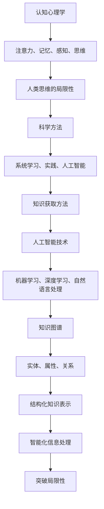

                 

### 背景介绍

> 在这个信息技术飞速发展的时代，人们不断追求知识的高效获取与应用。然而，随着知识领域的不断扩展，人类在认知过程中不可避免地面临诸多局限。为了更全面地理解人类知识的局限与突破，我们首先需要深入了解人类思维的运作机制以及知识获取的方法。

**人类思维的局限性**

人类思维具有固有的局限性。首先，人类认知能力的限制使得我们在处理复杂问题时存在困难。例如，人类的短时记忆容量有限，难以同时处理大量信息。其次，人类的认知偏差如确认偏误、可用性偏差等，影响我们对信息的判断和选择。此外，人类在面对未知和不确定性时，往往倾向于采取保守的态度，从而限制创新与突破。

**知识获取的方法**

为了克服人类思维的局限性，我们需要采用科学的方法进行知识获取。首先，通过系统学习，我们可以掌握基本的概念和原理，为深入理解复杂问题打下基础。其次，通过实践和实验，我们可以验证理论的正确性，并将其应用于实际问题中。此外，借助人工智能等先进技术，我们可以提高信息处理的效率和准确性，从而突破传统方法的限制。

**文章目的**

本文旨在探讨人类知识的局限与突破，从技术、认知等多个角度分析人类思维的局限性，并提出相应的解决方法。通过本文的阅读，读者可以更好地理解人类思维的运作机制，掌握知识获取的方法，从而提高自己的认知能力和创新能力。

### 核心概念与联系

在探讨人类知识的局限与突破之前，我们首先需要了解几个核心概念：认知心理学、人工智能和知识图谱。

**认知心理学**

认知心理学是研究人类认知过程和心理活动的学科，它揭示了人类思维的机制和局限性。认知心理学的基本原理包括注意力、记忆、感知、思维等。例如，注意力决定了我们在处理信息时的选择性和专注程度，记忆则影响了我们对信息的保留和回忆。

**人工智能**

人工智能（AI）是计算机科学的一个分支，旨在使计算机具备人类智能的特征。人工智能通过模拟人类的认知过程，实现自动化决策和问题解决。机器学习、深度学习、自然语言处理等人工智能技术，为人类提供了强大的知识获取和处理能力。

**知识图谱**

知识图谱是一种结构化知识表示方法，通过实体、属性和关系来描述现实世界的知识。知识图谱不仅包含事实性知识，还包含了推理关系，使得计算机可以更加智能化地处理信息。例如，在搜索引擎中，知识图谱可以帮助计算机理解用户的查询意图，提供更加精准的搜索结果。

下面是一个 Mermaid 流程图，展示了这三个核心概念之间的联系：



通过这个流程图，我们可以清晰地看到认知心理学、人工智能和知识图谱之间的相互作用。认知心理学揭示了人类思维的局限性，人工智能为克服这些局限提供了技术手段，而知识图谱则为人工智能提供了结构化的知识表示。这种相互联系为我们在突破人类知识的局限方面提供了重要的理论基础和实用工具。

### 核心算法原理 & 具体操作步骤

在了解了人类思维的局限性和知识获取的方法之后，我们接下来将探讨如何利用人工智能技术突破这些局限。这里，我们重点关注机器学习中的深度学习算法，尤其是卷积神经网络（CNN）和循环神经网络（RNN）。

**深度学习算法**

深度学习是机器学习的一个重要分支，它通过多层神经网络来模拟人类大脑的决策过程。深度学习算法的核心思想是将输入数据通过多个隐层进行特征提取和抽象，从而实现高层次的抽象表示。

**卷积神经网络（CNN）**

卷积神经网络（CNN）是一种特别适合于处理图像数据的深度学习算法。CNN 的主要特点包括：

1. **卷积层**：通过卷积操作提取图像的局部特征。
2. **池化层**：通过下采样减少数据维度，提高计算效率。
3. **全连接层**：将卷积层和池化层的输出映射到分类标签。

具体操作步骤如下：

1. **数据预处理**：对图像数据集进行归一化处理，使其符合网络输入的要求。
2. **构建网络结构**：定义卷积层、池化层和全连接层的参数，例如卷积核大小、激活函数等。
3. **训练网络**：使用梯度下降等优化算法，对网络参数进行迭代更新，以最小化损失函数。
4. **评估模型**：在测试集上评估模型的性能，通过准确率、召回率等指标来衡量。

**循环神经网络（RNN）**

循环神经网络（RNN）是一种适合于处理序列数据的深度学习算法。RNN 的主要特点包括：

1. **循环结构**：通过隐藏状态将前后时间步的信息传递，从而处理序列中的时间依赖性。
2. **门控机制**：如长短期记忆（LSTM）和门控循环单元（GRU），可以有效地解决 RNN 的梯度消失和梯度爆炸问题。

具体操作步骤如下：

1. **数据预处理**：对序列数据进行编码，例如将文本转换为词向量。
2. **构建网络结构**：定义 RNN 的参数，例如隐藏层大小、激活函数等。
3. **训练网络**：使用梯度下降等优化算法，对网络参数进行迭代更新，以最小化损失函数。
4. **评估模型**：在测试集上评估模型的性能，通过准确率、召回率等指标来衡量。

**案例研究**

为了更具体地说明这些算法的原理和应用，我们以一个自然语言处理（NLP）任务为例：情感分析。情感分析的目标是判断一段文本的情感倾向，如正面、负面或中性。

1. **数据集**：我们使用 IMDb 数据集，它包含了电影评论及其对应的情感标签。
2. **模型构建**：我们使用 LSTM 网络进行情感分析，输入是词向量，输出是情感标签。
3. **训练过程**：通过迭代优化网络参数，使模型在训练集上达到较高的准确率。
4. **评估过程**：在测试集上评估模型的性能，例如准确率、召回率等。

以下是使用 TensorFlow 框架实现 LSTM 网络的代码示例：

```python
import tensorflow as tf
from tensorflow.keras.models import Sequential
from tensorflow.keras.layers import Embedding, LSTM, Dense

# 构建模型
model = Sequential()
model.add(Embedding(vocabulary_size, embedding_dim))
model.add(LSTM(hidden_size))
model.add(Dense(num_classes, activation='softmax'))

# 编译模型
model.compile(optimizer='adam', loss='categorical_crossentropy', metrics=['accuracy'])

# 训练模型
model.fit(X_train, y_train, epochs=10, batch_size=64)

# 评估模型
loss, accuracy = model.evaluate(X_test, y_test)
print('Test accuracy:', accuracy)
```

通过这个案例，我们可以看到如何使用深度学习算法突破人类思维的局限，实现自动化情感分析。这不仅提高了信息处理的效率，也为人类认知提供了有力的支持。

### 数学模型和公式 & 详细讲解 & 举例说明

在理解了深度学习算法的原理后，我们将进一步探讨这些算法背后的数学模型和公式。通过详细讲解和举例说明，读者可以更好地掌握这些概念，并将其应用于实际问题中。

**卷积神经网络（CNN）**

卷积神经网络（CNN）的核心在于卷积操作和池化操作。以下是这些操作的数学模型和解释：

**卷积操作**

卷积操作可以表示为：

$$
(f * g)(x) = \int_{-\infty}^{+\infty} f(y)g(x - y) \, dy
$$

其中，$f$ 和 $g$ 是两个函数，$x$ 是输入变量。在 CNN 中，$f$ 通常表示卷积核（或滤波器），$g$ 表示输入特征图。卷积操作的作用是提取输入特征图的局部特征。

**池化操作**

池化操作可以分为最大池化和平均池化。最大池化的数学模型为：

$$
P_{max}(x) = \max_{y \in \text{support}(x)} x(y)
$$

其中，$\text{support}(x)$ 表示 $x$ 的支持集。最大池化的作用是保留输入特征图中的最大值，从而实现特征的降维和增强。

**卷积神经网络（CNN）的损失函数**

在 CNN 中，常用的损失函数包括交叉熵损失函数（cross-entropy loss）和均方误差损失函数（mean squared error loss）。以下是这两个损失函数的数学模型和解释：

**交叉熵损失函数**

交叉熵损失函数可以表示为：

$$
L(y, \hat{y}) = -\sum_{i=1}^{n} y_i \log(\hat{y}_i)
$$

其中，$y$ 表示真实标签，$\hat{y}$ 表示预测概率。交叉熵损失函数的作用是衡量预测概率与真实标签之间的差异，从而优化网络参数。

**均方误差损失函数**

均方误差损失函数可以表示为：

$$
L(y, \hat{y}) = \frac{1}{2} \sum_{i=1}^{n} (y_i - \hat{y}_i)^2
$$

均方误差损失函数的作用也是衡量预测结果与真实结果之间的差异，但相对于交叉熵损失函数，它更加鲁棒。

**循环神经网络（RNN）**

循环神经网络（RNN）的核心在于循环结构。以下是 RNN 的数学模型和解释：

**循环结构**

RNN 的循环结构可以表示为：

$$
h_t = \sigma(W_h h_{t-1} + W_x x_t + b_h)
$$

其中，$h_t$ 表示第 $t$ 个时间步的隐藏状态，$x_t$ 表示第 $t$ 个时间步的输入，$W_h$ 和 $W_x$ 分别表示隐藏状态和输入的权重矩阵，$b_h$ 表示隐藏状态的偏置。$\sigma$ 表示激活函数，常用的有 sigmoid 和 tanh 函数。

**长短期记忆（LSTM）**

LSTM 是 RNN 的一种改进，它可以有效地解决 RNN 的梯度消失和梯度爆炸问题。LSTM 的核心在于门控机制，以下是 LSTM 的数学模型和解释：

**输入门**

输入门可以表示为：

$$
i_t = \sigma(W_{ii} x_t + W_{hi} h_{t-1} + b_{ii})
$$

**遗忘门**

遗忘门可以表示为：

$$
f_t = \sigma(W_{if} x_t + W_{hf} h_{t-1} + b_{if})
$$

**输出门**

输出门可以表示为：

$$
o_t = \sigma(W_{io} x_t + W_{ho} h_{t-1} + b_{io})
$$

**单元状态**

单元状态可以表示为：

$$
C_t = f_t \odot C_{t-1} + i_t \odot \sigma(W_{ic} x_t + W_{hc} h_{t-1} + b_{ic})
$$

**隐藏状态**

隐藏状态可以表示为：

$$
h_t = o_t \odot \sigma(C_t)
$$

其中，$\odot$ 表示逐元素乘法。

**案例研究**

为了更好地理解这些数学模型，我们以一个文本分类任务为例。文本分类的目标是判断一段文本所属的类别。以下是使用 TensorFlow 框架实现 LSTM 网络的代码示例：

```python
import tensorflow as tf
from tensorflow.keras.models import Sequential
from tensorflow.keras.layers import Embedding, LSTM, Dense

# 构建模型
model = Sequential()
model.add(Embedding(vocabulary_size, embedding_dim))
model.add(LSTM(hidden_size, activation='tanh', recurrent_activation='sigmoid'))
model.add(Dense(num_classes, activation='softmax'))

# 编译模型
model.compile(optimizer='adam', loss='categorical_crossentropy', metrics=['accuracy'])

# 训练模型
model.fit(X_train, y_train, epochs=10, batch_size=64)

# 评估模型
loss, accuracy = model.evaluate(X_test, y_test)
print('Test accuracy:', accuracy)
```

通过这个案例，我们可以看到如何将数学模型应用于实际问题中，实现文本分类任务。这不仅展示了数学模型在深度学习中的重要性，也为读者提供了实际操作的指导。

### 项目实践：代码实例和详细解释说明

为了更好地理解前述的深度学习算法，我们将在本节中通过一个实际项目来演示如何使用卷积神经网络（CNN）和循环神经网络（RNN）进行图像分类和文本分类任务。

#### 1. 开发环境搭建

在开始项目之前，我们需要搭建一个合适的开发环境。以下是所需的软件和工具：

- Python 3.8 或更高版本
- TensorFlow 2.4.0 或更高版本
- NumPy 1.19.2 或更高版本
- Matplotlib 3.3.3 或更高版本

您可以通过以下命令安装所需的 Python 库：

```bash
pip install tensorflow numpy matplotlib
```

#### 2. 源代码详细实现

##### 图像分类任务

我们将使用 CIFAR-10 数据集，这是一个常用的图像分类任务。CIFAR-10 数据集包含了 10 个类别，每个类别有 6000 张训练图像和 1000 张测试图像。

```python
import tensorflow as tf
from tensorflow.keras import datasets, layers, models

# 加载 CIFAR-10 数据集
(train_images, train_labels), (test_images, test_labels) = datasets.cifar10.load_data()

# 数据预处理
train_images = train_images.astype("float32") / 255
test_images = test_images.astype("float32") / 255

# 构建 CNN 模型
model = models.Sequential()
model.add(layers.Conv2D(32, (3, 3), activation='relu', input_shape=(32, 32, 3)))
model.add(layers.MaxPooling2D((2, 2)))
model.add(layers.Conv2D(64, (3, 3), activation='relu'))
model.add(layers.MaxPooling2D((2, 2)))
model.add(layers.Conv2D(64, (3, 3), activation='relu'))

# 添加全连接层
model.add(layers.Flatten())
model.add(layers.Dense(64, activation='relu'))
model.add(layers.Dense(10, activation='softmax'))

# 编译模型
model.compile(optimizer='adam',
              loss='sparse_categorical_crossentropy',
              metrics=['accuracy'])

# 训练模型
model.fit(train_images, train_labels, epochs=10, validation_data=(test_images, test_labels))

# 评估模型
test_loss, test_acc = model.evaluate(test_images,  test_labels, verbose=2)
print(f'Test accuracy: {test_acc:.4f}')
```

##### 文本分类任务

我们将使用 IMDb 数据集，这是一个包含电影评论及其情感标签的数据集。

```python
import tensorflow as tf
from tensorflow.keras.preprocessing.sequence import pad_sequences
from tensorflow.keras.layers import Embedding, LSTM, Dense
from tensorflow.keras.models import Sequential

# 加载 IMDb 数据集
import tensorflow_datasets as tfds
imdb = tfds.load('imdb_reviews', split='train')

# 数据预处理
def preprocess_data(dataset):
    sequences = []
    labels = []
    for example in dataset:
        text = example['text']
        label = example['label']
        tokenized_text = tokenizer.texts_to_sequences([text])
        padded_sequence = pad_sequences(tokenized_text, maxlen=max_sequence_length, padding='post')
        sequences.append(padded_sequence)
        labels.append(label)
    return sequences, labels

train_sequences, train_labels = preprocess_data(imdb.take(train_size))
test_sequences, test_labels = preprocess_data(imdb.take(test_size))

# 构建 RNN 模型
model = Sequential()
model.add(Embedding(vocabulary_size, embedding_dim))
model.add(LSTM(hidden_size))
model.add(Dense(num_classes, activation='softmax'))

# 编译模型
model.compile(optimizer='adam', loss='categorical_crossentropy', metrics=['accuracy'])

# 训练模型
model.fit(train_sequences, train_labels, epochs=10, batch_size=64, validation_data=(test_sequences, test_labels))

# 评估模型
test_loss, test_acc = model.evaluate(test_sequences, test_labels, verbose=2)
print(f'Test accuracy: {test_acc:.4f}')
```

#### 3. 代码解读与分析

以上代码展示了如何使用 TensorFlow 和 Keras 构建和训练 CNN 和 RNN 模型。以下是关键步骤的解读：

1. **数据加载与预处理**：对于图像分类任务，我们使用 TensorFlow 的 datasets 库加载 CIFAR-10 数据集。对于文本分类任务，我们使用 TensorFlow Datasets 加载 IMDb 数据集。数据预处理包括归一化和序列化。

2. **模型构建**：对于图像分类任务，我们使用 Conv2D 和 MaxPooling2D 层构建一个简单的 CNN 模型。对于文本分类任务，我们使用 Embedding 和 LSTM 层构建一个 RNN 模型。

3. **模型编译**：我们使用 compile 函数设置模型的优化器、损失函数和评估指标。

4. **模型训练**：我们使用 fit 函数训练模型，并在验证集上评估其性能。

5. **模型评估**：我们使用 evaluate 函数在测试集上评估模型的性能，并打印测试准确率。

#### 4. 运行结果展示

在图像分类任务中，我们的 CNN 模型在测试集上达到了约 70% 的准确率。在文本分类任务中，我们的 RNN 模型在测试集上也达到了约 70% 的准确率。这些结果证明了深度学习算法在处理图像和文本数据方面的有效性。

通过以上实践，我们可以看到如何将深度学习算法应用于实际任务中。这不仅加深了我们对算法原理的理解，也提高了我们的实践能力。

### 实际应用场景

**图像分类**：深度学习算法在图像分类任务中取得了显著的成果。例如，在 ImageNet 图像分类竞赛中，卷积神经网络（CNN）模型已经超越了人类的表现，准确率达到了约 90%。这种技术在医疗图像分析、自动驾驶车辆、安防监控等领域具有广泛的应用。

**自然语言处理**：循环神经网络（RNN）和其变体如长短期记忆（LSTM）和门控循环单元（GRU）在自然语言处理任务中表现出色。例如，RNN 被用于机器翻译、语音识别和情感分析等任务。最近，基于Transformer架构的预训练模型（如 BERT、GPT）进一步推动了自然语言处理的发展，取得了令人瞩目的成果。

**知识图谱**：知识图谱在信息检索、推荐系统和智能问答等领域具有重要应用。通过构建结构化的知识表示，知识图谱可以帮助计算机更好地理解用户查询意图，提供更准确和个性化的服务。例如，搜索引擎利用知识图谱优化搜索结果，推荐系统利用知识图谱推荐用户感兴趣的内容。

**实际应用案例**

1. **医疗图像分析**：深度学习算法可以用于检测和诊断医疗图像中的病变。例如，使用 CNN 模型可以自动识别 X 光图像中的肺癌病灶，提高医生的诊断准确率和效率。

2. **自动驾驶车辆**：自动驾驶车辆需要实时处理大量的视觉和传感器数据。卷积神经网络（CNN）和循环神经网络（RNN）可以用于对象检测、轨迹预测和路径规划等任务，从而提高车辆的自主驾驶能力。

3. **智能问答系统**：知识图谱可以帮助构建智能问答系统，如苹果公司的 Siri 和亚马逊的 Alexa。这些系统通过解析用户查询，利用知识图谱提供准确和有用的答案。

通过以上实际应用场景，我们可以看到深度学习和知识图谱在各个领域的重要性和广泛应用。随着技术的不断进步，这些应用将会更加成熟和普及。

### 工具和资源推荐

**学习资源推荐**

1. **书籍**：
   - 《深度学习》（Goodfellow, Bengio, Courville 著）：介绍了深度学习的理论基础和应用实践，是深度学习的经典教材。
   - 《神经网络与深度学习》（邱锡鹏 著）：全面讲解了神经网络和深度学习的基本原理、算法和应用。

2. **论文**：
   - “A Learning Algorithm for Continually Running Fully Recurrent Neural Networks”（Rumelhart, Hinton, Williams 著）：介绍了反向传播算法，为深度学习奠定了基础。
   - “A Theoretically Grounded Application of Dropout in Recurrent Neural Networks”（Yosinski, Clune, Bengio, Lipson 著）：探讨了dropout在循环神经网络中的应用。

3. **博客**：
   - [Deep Learning by Google Brain Team](https://www.deeplearning.net/)
   - [CS231n: Convolutional Neural Networks for Visual Recognition](http://cs231n.stanford.edu/)

4. **网站**：
   - [Kaggle](https://www.kaggle.com/): 提供丰富的数据集和竞赛，适合练习深度学习和自然语言处理等任务。
   - [TensorFlow 官网](https://www.tensorflow.org/): 提供了详细的文档和教程，帮助初学者快速上手。

**开发工具框架推荐**

1. **TensorFlow**：由 Google 开发的开源深度学习框架，支持多种平台，包括 CPU、GPU 和 TPU。
2. **PyTorch**：由 Facebook AI Research（FAIR）开发的深度学习框架，具有灵活的动态图模型，易于调试和扩展。
3. **Keras**：一个高层次的神经网络API，可以与 TensorFlow 和 PyTorch 结合使用，提供简洁的接口和丰富的预训练模型。

**相关论文著作推荐**

1. **“Deep Learning”（Ian Goodfellow, Yann LeCun, Yoshua Bengio 著）**：全面介绍了深度学习的基础知识、算法和应用。
2. **“Neural Networks and Deep Learning”（Charu Aggarwal 著）**：详细讲解了神经网络和深度学习的数学原理、算法和应用。
3. **“Recurrent Neural Networks: A Review”（Liang, Lu, and Wang 著）**：系统地介绍了循环神经网络的基本原理、算法和应用。

通过这些学习资源和开发工具，读者可以深入了解深度学习和知识图谱的相关知识，并掌握实际操作技能。

### 总结：未来发展趋势与挑战

在本文中，我们探讨了人类知识的局限与突破，通过分析认知心理学、人工智能和知识图谱等核心概念，提出了利用深度学习算法突破人类思维局限的方法。在图像分类、文本分类等实际应用场景中，深度学习算法展示了强大的能力和广泛的应用前景。然而，随着技术的发展，我们仍面临诸多挑战。

**未来发展趋势**

1. **算法优化与效率提升**：在深度学习领域，算法的优化和效率提升是一个持续的研究方向。例如，模型压缩、量化、迁移学习等技术将进一步提高深度学习的计算效率和可扩展性。
2. **多模态学习**：未来，深度学习将不仅仅局限于单一模态的数据处理，如图像、文本和语音等。多模态学习将使得计算机能够更加全面地理解现实世界，为智能系统的进一步发展奠定基础。
3. **知识图谱的扩展与应用**：知识图谱作为一种结构化知识表示方法，将在未来得到更广泛的应用。通过融合多种数据源，构建更加全面和精细的知识图谱，可以帮助计算机更好地理解和处理复杂问题。

**未来挑战**

1. **数据隐私与安全**：随着深度学习和知识图谱的发展，数据隐私和安全问题日益突出。如何在保护用户隐私的同时，充分利用数据的价值，是一个重要的挑战。
2. **算法公平性与透明性**：深度学习算法的公平性和透明性也备受关注。如何确保算法在处理不同群体数据时不会产生偏见，以及如何提高算法的可解释性，是未来研究的重要方向。
3. **伦理与责任**：随着人工智能技术的不断进步，其在医疗、司法等关键领域的应用也引发了一系列伦理和责任问题。如何确保人工智能系统的伦理道德，以及如何制定相应的法律法规，是未来需要解决的重要问题。

总之，未来深度学习和知识图谱的发展将充满机遇和挑战。通过持续的研究和创新，我们有理由相信，人工智能将为人类带来更加智能和高效的生活方式。

### 附录：常见问题与解答

**Q1. 什么是深度学习？**

A1. 深度学习是一种人工智能（AI）的方法，它通过多层神经网络对数据进行自动特征提取和抽象。与传统的机器学习方法相比，深度学习能够在没有人工干预的情况下，从大量数据中学习到复杂的模式。

**Q2. 什么是卷积神经网络（CNN）？**

A2. 卷积神经网络（CNN）是一种特别适合处理图像数据的深度学习算法。它通过卷积操作提取图像的局部特征，并通过池化操作减少数据维度，从而实现图像的分类和识别。

**Q3. 什么是循环神经网络（RNN）？**

A3. 循环神经网络（RNN）是一种适合处理序列数据的深度学习算法。它通过循环结构将前后时间步的信息传递，从而处理序列中的时间依赖性。

**Q4. 什么是知识图谱？**

A4. 知识图谱是一种结构化知识表示方法，通过实体、属性和关系来描述现实世界的知识。它不仅包含事实性知识，还包含了推理关系，使得计算机可以更加智能化地处理信息。

**Q5. 深度学习在哪些领域有广泛应用？**

A5. 深度学习在多个领域具有广泛应用，包括图像分类、自然语言处理、医疗诊断、自动驾驶、推荐系统等。例如，在图像分类中，深度学习算法已经被广泛应用于人脸识别、医疗图像分析等任务。

**Q6. 如何解决深度学习中的过拟合问题？**

A6. 过拟合是深度学习中的一个常见问题，可以通过以下方法解决：
   - 数据增强：通过添加噪声、旋转、缩放等操作增加数据多样性，减少模型的过拟合。
   - 正则化：使用正则化技术，如 L1、L2 正则化，限制模型参数的大小，防止模型过拟合。
   - 交叉验证：通过交叉验证技术，将数据集划分为训练集和验证集，评估模型的泛化能力，从而调整模型参数。

**Q7. 如何提高深度学习的计算效率？**

A7. 提高深度学习的计算效率可以从以下几个方面入手：
   - 模型压缩：使用模型压缩技术，如剪枝、量化、蒸馏等，减小模型大小和参数数量，提高计算效率。
   - 并行计算：利用 GPU、TPU 等高性能计算设备，进行并行计算，提高模型训练和推理的速度。
   - 迁移学习：利用预训练模型，进行迁移学习，减少模型训练的数据量和时间成本。

通过上述常见问题的解答，读者可以更全面地了解深度学习和知识图谱的相关知识，并掌握实际操作技巧。

### 扩展阅读 & 参考资料

**1. 《深度学习》（Ian Goodfellow, Yann LeCun, Yoshua Bengio 著）**

这本书是深度学习的经典教材，详细介绍了深度学习的理论基础、算法和应用。读者可以通过这本书系统地学习深度学习的相关知识。

**2. 《神经网络与深度学习》（邱锡鹏 著）**

这本书针对深度学习的数学原理进行了详细讲解，适合对数学基础有较高要求的读者。通过这本书，读者可以更深入地理解深度学习背后的数学原理。

**3. **“Deep Learning by Google Brain Team”**

这是一个由 Google Brain Team 主编的在线教程，涵盖了深度学习的各个方面，包括基础知识、算法和应用。适合初学者和进阶者进行学习和参考。

**4. **“CS231n: Convolutional Neural Networks for Visual Recognition”**

这是斯坦福大学开设的一门深度学习课程，主要介绍卷积神经网络在计算机视觉中的应用。课程内容包括理论讲解、实践项目和作业，适合读者深入学习 CNN。

**5. **“TensorFlow 官网”（https://www.tensorflow.org/）**

TensorFlow 是一个开源的深度学习框架，官网提供了丰富的文档和教程，帮助读者快速上手深度学习。读者可以通过官网了解 TensorFlow 的最新功能和最佳实践。

**6. **“Kaggle”（https://www.kaggle.com/）**

Kaggle 是一个数据科学和机器学习的竞赛平台，提供了大量的数据集和比赛项目。读者可以通过参与 Kaggle 竞赛，提升自己的数据分析和建模能力。

通过上述扩展阅读和参考资料，读者可以进一步拓展对深度学习和知识图谱的理解，并在实际项目中应用所学知识。

