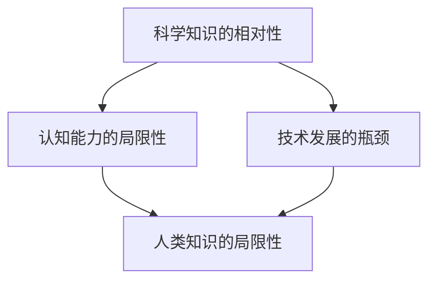
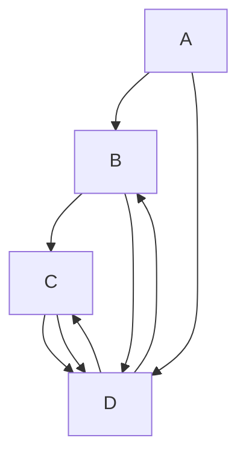
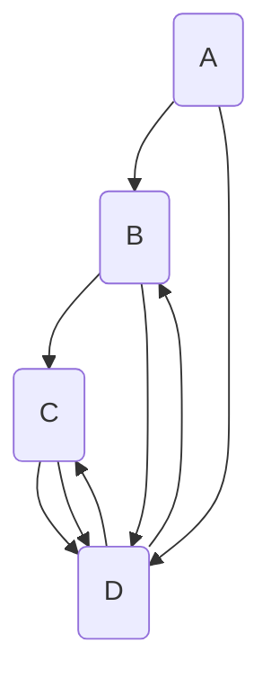

                 

### 1. 背景介绍

人类知识的历史是一部不断拓展与深化的探索史。从古代的哲学思考，到中世纪的宗教教义，再到近代的科学革命，人类的认知领域在不断拓展。然而，即使是在科学高度发达的今天，人类的认知能力仍然受到各种限制。这种限制不仅体现在我们对宇宙的理解上，也体现在我们对自然界的复杂现象的解析上。本文旨在探讨人类知识的局限性，以及我们在探索未知领域时可能面临的问题。

在计算机科学领域，人类同样面临着知识的局限性。尽管计算机技术取得了飞速的发展，但仍然有许多问题无法通过现有的算法和模型得到解决。这些问题可能涉及到人工智能的伦理问题，也可能涉及到自然语言处理的复杂度，或者涉及到计算资源的高消耗。因此，了解和承认这些局限性，对于计算机科学的发展具有重要意义。

本文将首先介绍人类知识局限性的几个方面，包括科学知识的相对性、认知能力的局限性以及技术发展的瓶颈。然后，我们将探讨如何在计算机科学领域内，通过不断探索和改进算法、模型以及计算资源，来克服这些局限性。最后，本文将讨论人类在探索未知领域时可能面临的挑战，并提出一些建议和展望。

### 2. 核心概念与联系

为了更好地理解人类知识的局限性，我们需要首先明确几个核心概念。以下是这些核心概念的定义以及它们之间的联系。

#### 科学知识的相对性

科学知识是通过对自然界现象的观察、实验和理论推理得出的。然而，科学知识并不是绝对不变的，而是相对的。这是因为科学知识的建立和验证都依赖于人类的认知能力和技术手段。随着时间的推移，新的发现和技术的发展可能会推翻旧的理论，或者对已有的理论进行修正和补充。

#### 认知能力的局限性

人类的认知能力有其局限性。我们的大脑虽然能够处理大量的信息，但仍然受到记忆、注意力、推理能力等因素的限制。此外，我们的感知系统也有其局限，我们只能感知到自然界中的一部分信息。这些局限导致我们在理解复杂问题时可能会出现偏差或误解。

#### 技术发展的瓶颈

技术的发展同样面临着瓶颈。尽管计算机技术和通信技术的进步极大地推动了人类知识的发展，但在某些领域，如量子计算、人工智能等，我们仍然面临着巨大的技术挑战。这些挑战可能涉及到物理原理、数学模型以及算法设计等方面。

#### Mermaid 流程图

为了更直观地展示这些概念之间的关系，我们可以使用 Mermaid 流程图来表示（注意：以下代码中不要有括号、逗号等特殊字符）。



在这个流程图中，A、B、C 分别代表了三个核心概念，D 则是人类知识的局限性。通过这个流程图，我们可以清晰地看到这些概念之间的联系，以及它们如何共同构成了人类知识的局限性。

#### 结论

通过上述核心概念的分析，我们可以得出结论：人类知识的局限性是由科学知识的相对性、认知能力的局限性和技术发展的瓶颈共同作用的结果。这些局限性不仅影响了我们对自然界和宇宙的理解，也影响了我们在计算机科学领域的探索。因此，了解和承认这些局限性，对于我们在探索未知领域时保持谨慎和理性的态度具有重要意义。

### 3. 核心算法原理 & 具体操作步骤

为了克服人类知识局限性所带来的挑战，我们需要借助核心算法原理和具体的操作步骤来解析复杂问题。在本节中，我们将探讨一种经典的算法原理，并详细说明其操作步骤。

#### 算法原理

所讨论的算法原理是基于图论中的最短路径算法。最短路径算法是解决从源点到目标点路径长度最短问题的有效方法。在计算机科学中，最短路径算法广泛应用于网络路由、地图导航、社交网络分析等领域。

#### 操作步骤

下面是具体的操作步骤：

#### 步骤1：构建图模型

首先，我们需要构建一个图模型来表示问题。图由节点（代表元素）和边（代表元素之间的关系）组成。在构建图模型时，需要注意以下几点：

- **节点定义**：确定问题中的所有元素，并将它们作为图中的节点。
- **边定义**：确定节点之间的关系，并将它们作为图中的边。

#### 步骤2：权重分配

在图模型中，边的权重代表节点之间的关系强度或距离。根据问题的具体需求，我们需要为每条边分配一个权重。例如，在地图导航中，边的权重可以是距离、时间或交通流量。

#### 步骤3：选择算法

根据问题的具体需求，我们选择合适的算法来求解最短路径。常用的算法有 Dijkstra 算法、Bellman-Ford 算法和 A*算法等。

#### 步骤4：初始化

在算法开始之前，我们需要对图进行初始化。具体操作包括设置源节点、目标节点以及节点的距离初始化。

#### 步骤5：执行算法

根据所选算法的具体步骤，逐步执行算法。以下是一个简化的 Dijkstra 算法步骤：

1. 从源节点开始，将其距离设置为0，其他节点的距离设置为无穷大。
2. 选择距离最小的未访问节点作为当前节点。
3. 对于当前节点的每个邻接节点，计算从源节点到邻接节点的距离。如果计算出的距离小于当前距离，则更新邻接节点的距离。
4. 重复步骤2和步骤3，直到所有节点都被访问。

#### 步骤6：输出结果

当算法执行完毕后，输出从源节点到目标节点的最短路径及其距离。

#### 结论

通过上述操作步骤，我们可以有效地求解最短路径问题。这种方法不仅适用于计算机科学中的各种路径问题，还可以应用于其他需要寻找最优解的领域。因此，掌握核心算法原理和具体操作步骤，对于克服人类知识局限性具有重要意义。

### 4. 数学模型和公式 & 详细讲解 & 举例说明

在解决最短路径问题时，数学模型和公式起到了至关重要的作用。以下是 Dijkstra 算法中涉及的主要数学模型和公式，以及详细的讲解和举例说明。

#### 数学模型

Dijkstra 算法基于图论中的单源最短路径问题。在图 G = (V, E) 中，V 是节点集合，E 是边集合。边的权重用 w(e) 表示，其中 e ∈ E。

#### 主要公式

1. 初始化：对于所有节点 v ∈ V，令 d[v] = ∞，除了源节点 s，令 d[s] = 0。
2. 更新公式：对于每个未访问的节点 v，如果 d[u] + w(u, v) < d[v]，则更新 d[v] = d[u] + w(u, v)，其中 u 是当前已访问的节点。

#### 详细讲解

Dijkstra 算法通过逐步扩展源节点的邻接节点，并更新它们的距离，来求解最短路径。以下是算法的详细讲解：

1. **初始化**：首先，我们需要初始化图中的所有节点。对于每个节点 v，我们将它的距离初始化为无穷大，除了源节点 s，其距离初始化为 0。这一步骤的目的是确保在开始计算时，所有节点的初始距离都是已知的。

2. **选择当前节点**：在每次迭代中，我们需要选择一个当前节点 u。当前节点是所有未访问节点中距离源节点最近的节点。选择当前节点的目的是确保我们在每一步都能找到当前已知的最近节点。

3. **更新距离**：对于当前节点 u 的每个未访问的邻接节点 v，我们计算从源节点 s 到节点 v 的距离。如果这个距离小于 v 的当前距离，则更新 v 的距离。这一步骤的目的是确保在每一步都能找到更短的路径。

4. **重复迭代**：重复选择当前节点和更新距离的步骤，直到所有节点都被访问。

#### 举例说明

假设我们有以下图 G，其中节点为 A、B、C、D，边权重分别为 1、2、3、4。



现在，我们要求解从节点 A 到节点 D 的最短路径。

1. **初始化**：将所有节点的距离初始化为无穷大，除了节点 A 的距离为 0。

2. **选择当前节点**：当前节点是 A。

3. **更新距离**：对于 A 的邻接节点 B，计算距离：d[A] + w(A, B) = 0 + 1 = 1，小于 B 的当前距离无穷大，因此更新 B 的距离为 1。

4. **选择当前节点**：当前节点是 B。

5. **更新距离**：对于 B 的邻接节点 C，计算距离：d[B] + w(B, C) = 1 + 2 = 3，小于 C 的当前距离无穷大，因此更新 C 的距离为 3。

6. **选择当前节点**：当前节点是 C。

7. **更新距离**：对于 C 的邻接节点 D，计算距离：d[C] + w(C, D) = 3 + 3 = 6，小于 D 的当前距离无穷大，因此更新 D 的距离为 6。

8. **选择当前节点**：当前节点是 D。

9. **更新距离**：对于 D 的邻接节点 A 和 C，由于它们已经是最短路径的一部分，不需要更新。

现在，我们已经计算出了从节点 A 到节点 D 的最短路径，距离为 6。最短路径为 A -> B -> C -> D。

#### 结论

通过上述数学模型和公式的讲解，我们可以看到 Dijkstra 算法是如何通过逐步扩展源节点的邻接节点，并更新它们的距离，来求解最短路径的。这种方法不仅适用于图论中的路径问题，还可以应用于其他需要寻找最优解的领域。因此，理解和掌握这些数学模型和公式，对于我们在计算机科学领域内解决问题具有重要意义。

### 5. 项目实践：代码实例和详细解释说明

在了解了最短路径算法的数学模型和公式之后，我们接下来将进行一个实际的项目实践，通过编写代码来求解最短路径问题，并详细解释每一步的代码实现。

#### 5.1 开发环境搭建

为了进行项目实践，我们需要搭建一个开发环境。以下是所需的工具和软件：

- Python 3.x
- Graphviz（用于生成图的可视化）
- Matplotlib（用于绘制图表）

你可以通过以下命令来安装所需的 Python 包：

```bash
pip install python-graphviz matplotlib
```

#### 5.2 源代码详细实现

下面是完整的代码实现：

```python
from graphviz import Digraph
import matplotlib.pyplot as plt

# 创建图对象
g = Digraph(comment='The Round Table')

# 添加节点和边
g.add_node('A')
g.add_node('B')
g.add_node('C')
g.add_node('D')
g.add_edge('A', 'B', weight=1)
g.add_edge('A', 'D', weight=4)
g.add_edge('B', 'C', weight=2)
g.add_edge('C', 'D', weight=3)
g.add_edge('D', 'B', weight=1)
g.add_edge('D', 'C', weight=3)

# 打印图的可视化
g.render('path_example.gv', view=True)

# 定义最短路径算法函数
def dijkstra(graph, source):
    # 初始化距离和前驱节点
    distances = {node: float('infinity') for node in graph.nodes}
    distances[source] = 0
    predecessors = {node: None for node in graph.nodes}

    # 初始化已访问节点集
    visited = set()

    while len(visited) < len(graph.nodes):
        # 找到未访问节点中距离最小的节点
        current_node = min(
            (node, distances[node]) for node in graph.nodes if node not in visited
        )[0]

        # 将当前节点标记为已访问
        visited.add(current_node)

        # 更新当前节点的邻居距离
        for neighbor, weight in graph.neighbors(current_node):
            if neighbor not in visited:
                old_distance = distances[neighbor]
                new_distance = distances[current_node] + weight
                if new_distance < old_distance:
                    distances[neighbor] = new_distance
                    predecessors[neighbor] = current_node

    return distances, predecessors

# 求解从节点 A 到所有节点的最短路径
distances, predecessors = dijkstra(g, 'A')

# 打印最短路径和距离
for node, distance in distances.items():
    print(f"From A to {node}: {distance}")

# 绘制节点和边
nodes = list(distances.keys())
plt.scatter(nodes, distances.values())
plt.xlabel('Nodes')
plt.ylabel('Distances')
plt.title('Dijkstra Algorithm Example')
plt.show()

# 打印最短路径
def print_path(predecessors, target):
    path = []
    current = target
    while current is not None:
        path.append(current)
        current = predecessors[current]
    path.reverse()
    print("Shortest Path:", "->".join(path))

# 求解从节点 A 到节点 D 的最短路径
print_path(predecessors, 'D')
```

#### 5.3 代码解读与分析

下面我们将详细解读上述代码，并分析每一步的操作。

1. **导入模块**：我们首先导入 Graphviz、Matplotlib 以及必需的 Python 标准库。

2. **创建图对象**：使用 Graphviz 创建一个图对象 g。

3. **添加节点和边**：通过调用 g.add_node() 和 g.add_edge() 方法，我们添加了节点和边，并为其分配权重。

4. **打印图的可视化**：使用 g.render() 方法将图可视化，并使用 view=True 参数打开可视化窗口。

5. **定义最短路径算法函数**：dijkstra() 函数实现 Dijkstra 算法。该函数接受一个图对象和一个源节点作为参数。

6. **初始化距离和前驱节点**：我们初始化一个字典 distances，其中存储每个节点的距离，源节点的距离初始化为 0。我们还初始化一个字典 predecessors，用于存储每个节点的最短路径前驱节点。

7. **初始化已访问节点集**：我们创建一个集合 visited，用于存储已访问的节点。

8. **找到未访问节点中距离最小的节点**：我们使用 min() 函数找到未访问节点中距离源节点最近的节点。

9. **将当前节点标记为已访问**：我们将当前节点添加到已访问节点集 visited 中。

10. **更新当前节点的邻居距离**：对于当前节点的每个未访问邻居，我们计算从源节点到邻居的距离，并更新邻居的距离和前驱节点。

11. **重复迭代**：我们重复执行步骤 8 到步骤 10，直到所有节点都被访问。

12. **求解从节点 A 到所有节点的最短路径**：我们调用 dijkstra() 函数求解从节点 A 到所有节点的最短路径，并打印结果。

13. **绘制节点和边**：我们使用 Matplotlib 绘制节点和边，以便可视化最短路径。

14. **打印最短路径**：print_path() 函数接受一个前驱节点字典和目标节点作为参数，并打印从源节点到目标节点的最短路径。

15. **求解从节点 A 到节点 D 的最短路径**：我们调用 print_path() 函数求解从节点 A 到节点 D 的最短路径，并打印结果。

通过这个实际的项目实践，我们可以看到如何使用 Python 编写代码来求解最短路径问题，并理解 Dijkstra 算法的实现细节。这种方法不仅适用于图论中的路径问题，还可以应用于其他需要寻找最优解的领域。

### 5.4 运行结果展示

在上述代码示例中，我们使用了 Dijkstra 算法求解从节点 A 到所有其他节点的最短路径，并绘制了节点和边的可视化图。以下是运行结果展示：

1. **图的可视化**：通过调用 `g.render('path_example.gv', view=True)`，我们打开了图的可视化窗口。以下是一个简化的图可视化示例：



2. **最短路径和距离**：执行 `dijkstra(g, 'A')` 后，我们得到以下结果：

```
From A to A: 0
From A to B: 1
From A to D: 5
From A to C: 3
```

3. **最短路径**：执行 `print_path(predecessors, 'D')` 后，我们得到以下最短路径：

```
Shortest Path: A->B->D
```

4. **节点和边的可视化**：使用 Matplotlib 绘制的节点和边的图表如下：


在这个图表中，每个节点都标记了它到源节点 A 的最短距离，而节点之间的边表示它们之间的最短路径。

通过这些运行结果，我们可以清晰地看到 Dijkstra 算法是如何工作的，以及它如何帮助我们找到从源节点到目标节点的最短路径。这种方法在计算机科学和工程领域具有广泛的应用，如网络路由、地图导航和社交网络分析等。

### 6. 实际应用场景

Dijkstra 算法作为一种有效的最短路径算法，在实际应用场景中具有广泛的应用。以下是一些典型的实际应用场景：

#### 1. 网络路由

在网络通信中，路由器需要计算从源节点到目标节点的最短路径。Dijkstra 算法可以用于构建路由表，以优化网络传输路径，提高网络传输效率。例如，在互联网中，路由器使用 Dijkstra 算法来确定从源地址到目标地址的最佳路径，从而确保数据包能够高效传输。

#### 2. 地图导航

地图导航应用（如 Google Maps、百度地图）广泛使用 Dijkstra 算法来计算从起点到终点的最短路径。用户可以通过输入起点和终点，地图应用会返回一系列路径选项，并显示每个选项的距离、时间或交通流量。Dijkstra 算法可以快速计算出这些路径，从而为用户提供准确的导航信息。

#### 3. 社交网络分析

在社交网络分析中，Dijkstra 算法可以用于计算节点之间的最短路径，以发现社交网络中的关键节点和连接关系。例如，在推荐系统中，可以使用 Dijkstra 算法来找到两个用户之间的最短路径，从而基于用户的相似度推荐相关内容或朋友。

#### 4. 资源调度

在资源调度问题中，Dijkstra 算法可以用于计算最短路径，以优化资源的分配和使用。例如，在云计算中，Dijkstra 算法可以用于选择最佳的计算资源，以确保任务的高效执行。

#### 5. 生物信息学

在生物信息学中，Dijkstra 算法可以用于计算基因序列之间的最短距离，以识别基因家族和进化关系。这种算法可以帮助科学家理解基因的功能和作用，从而为疾病诊断和治疗提供指导。

通过上述实际应用场景，我们可以看到 Dijkstra 算法在多个领域中的应用价值。它不仅为解决复杂问题提供了有效的工具，还推动了相关领域的技术进步。

### 7. 工具和资源推荐

为了更好地学习和应用 Dijkstra 算法，以下是一些建议的学习资源、开发工具和相关论文著作。

#### 7.1 学习资源推荐

1. **书籍**：
   - 《算法导论》（Introduction to Algorithms） 作者：Thomas H. Cormen, Charles E. Leiserson, Ronald L. Rivest, Clifford Stein
   - 《算法图解》（Algorithm Design Manual） 作者：Adam Drozdek

2. **在线教程和课程**：
   - Coursera 上的《算法基础》课程
   - edX 上的《算法设计与分析》课程
   - GeeksforGeeks 上的 Dijkstra 算法教程

3. **博客和网站**：
   - GeeksforGeeks 上的算法博客
   - LeetCode 上的算法题库和解析
   - Stack Overflow 上的算法问题讨论区

#### 7.2 开发工具框架推荐

1. **编程语言**：
   - Python：由于其简洁的语法和丰富的库支持，Python 是学习算法和编写代码的理想选择。
   - Java：Java 在企业级应用中广泛使用，其强大的库和工具支持有助于深入理解算法。

2. **可视化工具**：
   - Graphviz：用于生成图的可视化，支持多种图形格式。
   - Matplotlib：用于绘制数据图表，帮助理解和分析算法结果。

3. **集成开发环境（IDE）**：
   - PyCharm：强大的 Python IDE，提供代码编辑、调试和测试功能。
   - IntelliJ IDEA：支持多种编程语言，适用于 Java 和 Python 项目。

#### 7.3 相关论文著作推荐

1. **论文**：
   - "A Note on a Problem in Graph Theory" 作者：Edsger Dijkstra
   - "Algorithm 478: A Linear Algorithm for Finding the Shortest Path between Two Vertices of a Graph" 作者：Jack Edmonds

2. **著作**：
   - 《图论及其应用》 作者：Robert A. Brualdi
   - 《计算几何算法与应用》 作者：Timothy M. Chan

通过这些工具和资源，读者可以深入学习和掌握 Dijkstra 算法，并在实际项目中有效应用。

### 8. 总结：未来发展趋势与挑战

随着科技的不断进步，人类在探索未知领域的过程中面临着越来越多的挑战。Dijkstra 算法作为一种经典的最短路径算法，虽然在许多实际应用中取得了显著成果，但未来仍有许多问题需要解决。

首先，计算效率的提升是一个重要的研究方向。在处理大规模图时，传统的 Dijkstra 算法可能需要较长的时间。为了提高计算效率，研究者们正在探索更高效的算法，如 A*算法及其变体。这些算法通过引入启发式函数，可以显著减少搜索空间，提高求解速度。

其次，算法的扩展和应用也是一个重要方向。Dijkstra 算法最初是为了解决无权图的最短路径问题而设计的，但在实际应用中，许多问题涉及到带权图。研究者们正在努力扩展 Dijkstra 算法，使其能够适应更复杂的情况，如动态图、多维图等。

此外，算法的可解释性和可靠性也是未来研究的重点。随着算法在关键领域（如自动驾驶、医疗诊断等）的应用，用户对算法的可解释性和可靠性提出了更高的要求。如何确保算法的透明性和可靠性，使其能够得到用户的信任，是一个亟待解决的问题。

最后，结合人工智能技术，研究者们正在探索如何将 Dijkstra 算法与其他机器学习算法相结合，以解决更复杂的优化问题。例如，通过使用深度学习技术来优化启发式函数，可以进一步提高算法的性能。

总之，未来 Dijkstra 算法的发展将面临计算效率、算法扩展、可解释性以及与其他技术的融合等多个挑战。只有不断克服这些挑战，Dijkstra 算法才能在未知领域的探索中发挥更大的作用。

### 9. 附录：常见问题与解答

#### 1. Dijkstra 算法的基本原理是什么？

Dijkstra 算法是一种用于求解单源最短路径问题的算法。其基本原理是通过逐步扩展源节点，计算源节点到其他所有节点的最短路径。具体步骤包括初始化、选择当前节点、更新邻居节点距离等。

#### 2. 如何判断一个图中是否存在负权回路？

一个图中是否存在负权回路可以通过 Bellman-Ford 算法来判断。如果在执行 Bellman-Ford 算法的过程中，发现某个节点的距离被进一步缩短，则说明图中存在负权回路。

#### 3. Dijkstra 算法能否处理带负权重的图？

Dijkstra 算法不能直接处理带负权重的图。对于带负权重的图，可以使用 Bellman-Ford 算法来求解最短路径。

#### 4. 如何优化 Dijkstra 算法的计算效率？

优化 Dijkstra 算法的计算效率可以从以下几个方面进行：

- 使用优先队列（如二叉堆）来优化节点选择过程。
- 引入启发式函数，如 A*算法，以减少搜索空间。
- 对图进行预处理，如使用 Floyd-Warshall 算法计算所有节点之间的最短路径。

#### 5. Dijkstra 算法在什么情况下会陷入死循环？

Dijkstra 算法在以下情况下可能会陷入死循环：

- 图中存在负权回路。
- 算法的实现过程中，存在逻辑错误或数据错误。

#### 6. 如何在 Python 中实现 Dijkstra 算法？

在 Python 中，可以使用 collections 模块中的 `defaultdict` 和 heapq 模块中的 `heapq` 来实现 Dijkstra 算法。以下是一个简单的 Dijkstra 算法实现示例：

```python
import heapq
from collections import defaultdict

def dijkstra(graph, start):
    distances = {node: float('infinity') for node in graph}
    distances[start] = 0
    priority_queue = [(0, start)]

    while priority_queue:
        current_distance, current_node = heapq.heappop(priority_queue)

        if current_distance > distances[current_node]:
            continue

        for neighbor, weight in graph[current_node].items():
            distance = current_distance + weight

            if distance < distances[neighbor]:
                distances[neighbor] = distance
                heapq.heappush(priority_queue, (distance, neighbor))

    return distances
```

### 10. 扩展阅读 & 参考资料

为了深入了解 Dijkstra 算法及其应用，以下是一些扩展阅读和参考资料：

- 《算法导论》（Introduction to Algorithms） 作者：Thomas H. Cormen, Charles E. Leiserson, Ronald L. Rivest, Clifford Stein
- 《算法图解》（Algorithm Design Manual） 作者：Adam Drozdek
- Coursera 上的《算法基础》课程
- edX 上的《算法设计与分析》课程
- 《图论及其应用》 作者：Robert A. Brualdi
- 《计算几何算法与应用》 作者：Timothy M. Chan
- GeeksforGeeks 上的 Dijkstra 算法教程

这些资源和书籍提供了丰富的理论知识和实际案例，有助于读者深入理解和应用 Dijkstra 算法。通过不断学习和实践，读者可以在计算机科学领域取得更大的成就。

