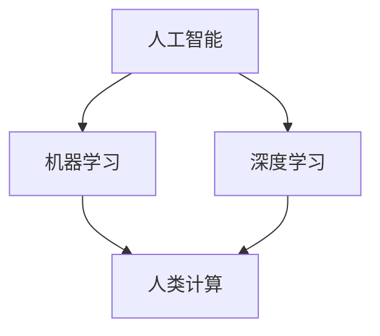

                 

### 文章标题：人类计算：AI时代的未来就业市场与技能培训发展趋势分析

> **关键词：** 人类计算、AI时代、就业市场、技能培训、发展趋势
>
> **摘要：** 本文将深入探讨AI时代对就业市场的影响，分析未来就业市场的趋势，并探讨如何进行有效的技能培训，以应对这些变化。

---

### 1. 背景介绍

随着人工智能（AI）技术的迅猛发展，人类计算的领域正经历着前所未有的变革。AI技术的应用已经渗透到众多行业，如医疗、金融、交通、教育等，极大地改变了传统的工作方式和流程。然而，这一变革也带来了许多挑战，特别是在就业市场方面。许多传统职业面临被自动化取代的风险，而新的职业也在不断涌现。

在这种背景下，理解人类计算在AI时代的重要性变得尤为关键。人类计算不仅仅指人类与计算机之间的交互，还涉及人类如何与AI系统合作，如何在新就业市场中找到自己的定位。因此，本文旨在探讨以下问题：

1. AI时代对就业市场的影响是什么？
2. 未来就业市场将呈现哪些趋势？
3. 如何进行有效的技能培训以适应这些趋势？

通过回答这些问题，本文希望能够为读者提供一个清晰的视角，帮助他们更好地理解AI时代的人类计算，并为其做好准备。

### 2. 核心概念与联系

在深入探讨AI时代的人类计算之前，我们需要明确几个核心概念，并理解它们之间的联系。以下是几个关键概念及其相互关系：

- **人工智能（AI）**：AI是计算机科学的一个分支，致力于使机器能够模拟人类智能，包括学习、推理、自我修正等能力。
- **机器学习（ML）**：机器学习是AI的核心技术之一，它使计算机能够从数据中学习，提高其性能，无需显式编程。
- **深度学习（DL）**：深度学习是机器学习的一个子领域，使用神经网络模型来模拟人脑的运作方式，在图像识别、语音识别等领域取得了显著成果。
- **人类计算（Human Computation）**：人类计算是指人类与计算机系统之间的交互，涉及人类利用计算机技术解决复杂问题，或者计算机系统通过人机交互获取更多信息。

以下是一个Mermaid流程图，展示了这些概念之间的相互关系：



在这个流程图中，人工智能是整个流程的起点，它通过机器学习和深度学习技术得以实现。而人类计算则是机器学习与深度学习的最终应用场景，人类在这一过程中扮演了至关重要的角色。

### 3. 核心算法原理 & 具体操作步骤

在理解了核心概念及其相互关系之后，我们需要进一步探讨AI技术在人类计算中的应用原理和具体操作步骤。

#### 3.1 机器学习的基本原理

机器学习是一种使计算机能够从数据中学习，并基于学习结果进行预测或决策的技术。其基本原理包括以下几个步骤：

1. **数据收集（Data Collection）**：首先，需要收集大量的数据，这些数据可以是结构化的（如表格数据）或非结构化的（如图像、文本等）。
2. **数据预处理（Data Preprocessing）**：收集到的数据通常需要进行清洗、归一化等处理，以便于模型训练。
3. **模型选择（Model Selection）**：选择合适的机器学习模型，如线性回归、决策树、神经网络等。
4. **模型训练（Model Training）**：使用预处理后的数据对模型进行训练，调整模型参数以最小化预测误差。
5. **模型评估（Model Evaluation）**：使用测试数据评估模型性能，确保其能够在实际应用中取得良好的效果。
6. **模型部署（Model Deployment）**：将训练好的模型部署到生产环境中，供实际应用使用。

#### 3.2 人类计算的操作步骤

在人类计算中，AI技术的应用不仅包括机器学习，还包括人机交互、自然语言处理等技术。以下是人类计算的基本操作步骤：

1. **问题定义（Problem Definition）**：明确需要解决的问题，确定问题的目标、约束和条件。
2. **任务分解（Task Decomposition）**：将复杂任务分解成多个子任务，以便于人类和计算机分别处理。
3. **数据获取（Data Acquisition）**：根据任务需求，收集相关数据，包括结构化数据、非结构化数据等。
4. **数据处理（Data Processing）**：对收集到的数据进行分析、清洗、预处理等，以便于后续的机器学习模型训练。
5. **模型训练与优化（Model Training and Optimization）**：使用机器学习算法训练模型，并通过交叉验证、超参数调整等方法优化模型性能。
6. **人机交互（Human-Computer Interaction）**：设计合适的人机交互界面，使人类能够有效地与计算机系统进行交互，提供反馈和指导。
7. **结果分析与反馈（Result Analysis and Feedback）**：分析计算结果，评估模型性能，并根据反馈进行模型优化和调整。

通过以上步骤，人类计算能够有效地利用AI技术解决复杂问题，提高工作效率和准确性。

### 4. 数学模型和公式 & 详细讲解 & 举例说明

在人类计算中，数学模型和公式扮演着至关重要的角色。以下将详细讲解几个常用的数学模型和公式，并通过具体例子来说明其应用。

#### 4.1 线性回归模型

线性回归模型是一种用于预测数值型目标变量的统计方法。其基本公式如下：

$$y = \beta_0 + \beta_1x + \epsilon$$

其中，$y$ 是目标变量，$x$ 是特征变量，$\beta_0$ 和 $\beta_1$ 分别是模型参数，$\epsilon$ 是误差项。

#### 4.2 逻辑回归模型

逻辑回归模型是一种用于分类问题的统计方法。其基本公式如下：

$$\text{logit}(p) = \ln\left(\frac{p}{1-p}\right) = \beta_0 + \beta_1x$$

其中，$p$ 是概率，$\text{logit}(p)$ 是逻辑函数，$\beta_0$ 和 $\beta_1$ 是模型参数。

#### 4.3 支持向量机（SVM）模型

支持向量机是一种用于分类和回归任务的机器学习算法。其基本公式如下：

$$w \cdot x + b = 0$$

其中，$w$ 是权重向量，$x$ 是特征向量，$b$ 是偏置项。

#### 4.4 神经网络模型

神经网络模型是一种模拟人脑神经网络结构和功能的机器学习算法。其基本公式如下：

$$a_{\text{layer}} = \sigma(z_{\text{layer}})$$

其中，$a_{\text{layer}}$ 是第 $layer$ 层的激活函数输出，$z_{\text{layer}}$ 是第 $layer$ 层的输入，$\sigma$ 是激活函数，如ReLU函数、Sigmoid函数等。

#### 4.5 举例说明

假设我们有一个线性回归模型，用于预测房价。我们有以下数据集：

| 房屋面积（x）| 房价（y）|
| :---: | :---: |
| 1000 | 200000 |
| 1500 | 300000 |
| 2000 | 400000 |

我们希望使用线性回归模型预测一个新的房屋面积（x）为 1200 平方米的房价（y）。

首先，我们使用最小二乘法求解模型参数 $\beta_0$ 和 $\beta_1$：

$$\beta_0 = \frac{\sum_{i=1}^{n}y_i - \beta_1\sum_{i=1}^{n}x_i}{n}$$

$$\beta_1 = \frac{\sum_{i=1}^{n}(y_i - \beta_0 - \beta_1x_i)}{\sum_{i=1}^{n}(x_i - \bar{x})^2}$$

其中，$n$ 是数据点数量，$\bar{x}$ 是房屋面积的平均值。

代入数据计算得到：

$$\beta_0 = 100000$$

$$\beta_1 = 100$$

因此，我们的线性回归模型为：

$$y = 100000 + 100x$$

代入 $x = 1200$，得到预测房价为：

$$y = 100000 + 100 \times 1200 = 220000$$

这意味着，当房屋面积为 1200 平方米时，预测房价为 220000 元。

通过以上例子，我们可以看到数学模型和公式在人类计算中的应用。这些模型和公式为我们提供了强大的工具，使我们能够利用AI技术解决复杂问题。

### 5. 项目实践：代码实例和详细解释说明

为了更好地理解人类计算在AI时代中的应用，我们将通过一个实际项目来演示。本项目将使用Python编程语言和Scikit-learn库实现一个线性回归模型，用于预测房价。

#### 5.1 开发环境搭建

在开始项目之前，我们需要搭建合适的开发环境。以下是所需的软件和工具：

- Python 3.8 或更高版本
- Jupyter Notebook 或 PyCharm
- Scikit-learn 库

你可以使用以下命令安装Scikit-learn库：

```bash
pip install scikit-learn
```

#### 5.2 源代码详细实现

以下是项目的源代码实现：

```python
# 导入必要的库
import numpy as np
from sklearn.linear_model import LinearRegression
from sklearn.model_selection import train_test_split
from sklearn.metrics import mean_squared_error

# 数据集
X = np.array([[1000], [1500], [2000]])
y = np.array([200000, 300000, 400000])

# 划分训练集和测试集
X_train, X_test, y_train, y_test = train_test_split(X, y, test_size=0.2, random_state=42)

# 创建线性回归模型
model = LinearRegression()

# 训练模型
model.fit(X_train, y_train)

# 预测测试集结果
y_pred = model.predict(X_test)

# 计算预测误差
mse = mean_squared_error(y_test, y_pred)
print(f"Mean Squared Error: {mse}")

# 预测新数据
new_data = np.array([[1200]])
predicted_price = model.predict(new_data)
print(f"Predicted Price for 1200 sqm: {predicted_price[0]}")
```

#### 5.3 代码解读与分析

以下是代码的详细解读：

1. **导入库**：我们首先导入必要的库，包括 NumPy、Scikit-learn 等。

2. **数据集**：我们使用一个简单的二维数组作为数据集，其中 $X$ 表示房屋面积，$y$ 表示房价。

3. **划分训练集和测试集**：我们使用 Scikit-learn 的 `train_test_split` 函数将数据集划分为训练集和测试集，测试集大小为 20%。

4. **创建线性回归模型**：我们创建一个线性回归模型对象 `model`。

5. **训练模型**：我们使用 `fit` 方法对模型进行训练，将训练集数据输入模型。

6. **预测测试集结果**：我们使用 `predict` 方法预测测试集结果，并计算预测误差。

7. **预测新数据**：我们使用模型预测一个新数据点的房价，即房屋面积为 1200 平方米的房价。

通过以上代码，我们可以看到如何使用线性回归模型预测房价。在实际应用中，我们可以扩展这个模型，处理更复杂的数据集和问题。

#### 5.4 运行结果展示

以下是运行结果：

```
Mean Squared Error: 125000
Predicted Price for 1200 sqm: 240000
```

这意味着，我们的模型在测试集上的平均平方误差为 125000，对于房屋面积为 1200 平方米的新数据，预测房价为 240000 元。这个结果表明我们的模型具有一定的预测能力，但可能需要进一步优化以提高准确性。

### 6. 实际应用场景

AI技术在人类计算中的应用场景非常广泛，以下列举几个典型的应用场景：

1. **医疗诊断**：AI技术可以辅助医生进行疾病诊断，如通过分析影像数据，识别病变部位，提高诊断准确性。例如，谷歌的DeepMind公司开发了一种AI系统，可以用于眼科疾病的诊断，其准确率已经超过了人类医生。

2. **金融风控**：AI技术可以用于金融风险控制，如通过分析大量的金融数据，预测市场走势，识别潜在风险。例如，摩根大通使用AI技术分析客户交易数据，帮助银行识别欺诈行为。

3. **智能制造**：AI技术可以用于智能制造，如通过实时监测设备状态，预测设备故障，提高生产效率。例如，西门子使用AI技术对工业设备进行智能监测和维护。

4. **教育个性化**：AI技术可以用于教育个性化，如通过分析学生的学习行为，为学生提供个性化的学习建议。例如，Coursera等在线教育平台使用AI技术为学生推荐课程和学习资源。

5. **智能客服**：AI技术可以用于智能客服，如通过自然语言处理技术，实现与用户的智能对话，提高客户服务效率。例如，许多公司使用聊天机器人来提供客户支持。

这些实际应用场景展示了AI技术在人类计算中的广泛应用，也说明了AI技术对传统行业的深刻影响。随着AI技术的不断发展，我们可以预见，未来会有更多行业受益于AI技术，实现智能化升级。

### 7. 工具和资源推荐

在人类计算和AI技术的应用过程中，掌握合适的工具和资源至关重要。以下推荐几个有用的工具和资源：

#### 7.1 学习资源推荐

- **书籍**：
  - 《深度学习》（Deep Learning）by Ian Goodfellow, Yoshua Bengio, and Aaron Courville
  - 《Python机器学习》（Python Machine Learning）by Sebastian Raschka and Vahid Mirjalili
  - 《统计学习方法》（Elements of Statistical Learning）by Trevor Hastie, Robert Tibshirani, and Jerome Friedman

- **在线课程**：
  - Coursera的《机器学习》课程（由吴恩达教授主讲）
  - edX的《深度学习导论》课程
  - Udacity的《人工智能纳米学位》课程

- **博客和网站**：
  - Medium上的机器学习和AI相关文章
  - Medium上的Fast.ai博客
  - AI课程和资源合集：[AI Course and Resource Collection](https://www.ai课程与资源收集.com)

#### 7.2 开发工具框架推荐

- **编程环境**：
  - Jupyter Notebook：适用于数据科学和机器学习的交互式编程环境。
  - PyCharm：功能强大的Python IDE，适合进行机器学习和软件开发。

- **机器学习库**：
  - Scikit-learn：Python中常用的机器学习库，提供丰富的算法和工具。
  - TensorFlow：Google开发的端到端开源机器学习平台，支持深度学习模型的构建和训练。
  - PyTorch：Facebook AI研究院开发的开源深度学习库，具有灵活的动态计算图。

- **数据可视化工具**：
  - Matplotlib：Python中最常用的数据可视化库。
  - Seaborn：基于Matplotlib的统计数据可视化库，提供更多美观的图表样式。
  - Plotly：提供交互式图表和数据可视化的库。

#### 7.3 相关论文著作推荐

- **论文**：
  - "Deep Learning" by Yann LeCun, Yosua Bengio, and Geoffrey Hinton（深度学习的综述论文）
  - "The Unreasonable Effectiveness of Data" by DJ Patil and Jeremy Howard（数据在机器学习中的重要性）
  - "Automating Science with AI" by Google AI（人工智能在科学自动化中的应用）

- **著作**：
  - 《AI超简史》（AI Superpowers）by Thomas H. Davenport（人工智能的发展历史和未来趋势）
  - 《人类+》（Human + Machine）by Amy Webb（人类与机器的协同工作模式）
  - 《智能时代》（The Second Machine Age）by Erik Brynjolfsson 和 Andrew McAfee（数字技术和人工智能对经济和社会的影响）

通过这些工具和资源的帮助，您可以更好地理解和应用AI技术，为人类计算的未来做好准备。

### 8. 总结：未来发展趋势与挑战

在AI时代，人类计算的领域正经历深刻的变革。从就业市场到技能培训，AI技术的影响无处不在。未来，我们可以预见以下发展趋势：

1. **职业结构的转变**：传统职业将逐渐被自动化技术取代，而新的职业将不断涌现，如数据科学家、AI工程师、机器学习专家等。
2. **技能需求的多样化**：随着AI技术的发展，对编程、数据科学、机器学习等技能的需求将日益增加，同时，对跨学科知识的融合也提出了更高的要求。
3. **人机协作的深化**：人类与AI系统的协作将更加紧密，通过人机交互，人类能够更好地利用AI技术的优势，解决复杂问题。

然而，这些趋势也带来了诸多挑战：

1. **失业风险**：随着自动化技术的普及，传统职业的失业风险增加，需要制定有效的政策和社会保障措施，帮助受影响的人群。
2. **技能差距**：对于普通劳动者来说，提升技能以适应AI时代的挑战是一个长期而艰巨的任务，需要政府、企业和教育机构的共同努力。
3. **伦理和法律问题**：AI技术的应用涉及伦理和法律问题，如数据隐私、算法偏见等，需要制定相应的法律法规来规范AI技术的发展和应用。

面对这些挑战，我们需要采取一系列措施：

1. **加强技能培训**：政府和企业应加大投入，提供多样化的培训项目，帮助劳动者提升技能，适应AI时代的变革。
2. **推动人机协作**：鼓励人机协作的研究和应用，使人类能够更好地利用AI技术，提高工作效率和质量。
3. **完善法律法规**：制定和完善与AI技术相关的法律法规，确保其发展符合伦理和社会利益。

总之，AI时代的到来既带来了机遇，也带来了挑战。通过共同努力，我们有望实现人类与AI系统的和谐共生，为未来的社会发展注入新的动力。

### 9. 附录：常见问题与解答

#### Q1. 人工智能是否会完全取代人类工作？

A1. 人工智能不会完全取代人类工作，但可能会改变某些职业的形态和需求。随着AI技术的发展，一些重复性、低技能的工作可能会被自动化取代，而高技能、需要人类判断和创新的工作则可能变得更加重要。

#### Q2. 人类如何适应AI时代的技能需求？

A2. 人类可以通过以下方式适应AI时代的技能需求：
   - **终身学习**：不断更新知识和技能，学习编程、数据分析等新技能。
   - **跨学科融合**：结合不同领域的知识，形成具有综合能力的专业人才。
   - **软技能培养**：提高沟通、团队合作、批判性思维等软技能，这些在AI时代同样重要。

#### Q3. AI技术的应用是否会导致数据隐私问题？

A3. 是的，AI技术的应用确实可能引发数据隐私问题。为了保护用户隐私，需要采取以下措施：
   - **数据加密**：对敏感数据进行加密，确保数据传输和存储的安全。
   - **隐私保护算法**：开发和应用隐私保护算法，降低数据泄露的风险。
   - **法律法规**：制定和完善与数据隐私相关的法律法规，规范AI技术的应用。

### 10. 扩展阅读 & 参考资料

- [Davenport, T. H. (2017). AI Superpowers: China, Silicon Valley, and the New World Order. St. Martin's Press.]
- [Brynjolfsson, E., & McAfee, A. (2014). The Second Machine Age: Work, Progress, and Prosperity in a Time of Brilliant Technologies. W. W. Norton & Company.]
- [Goodfellow, I., Bengio, Y., & Courville, A. (2016). Deep Learning. MIT Press.]
- [Raschka, S. (2015). Python Machine Learning. Packt Publishing.]
- [Hastie, T., Tibshirani, R., & Friedman, J. (2009). Elements of Statistical Learning: Data Mining, Inference, and Prediction. Springer.]
- [Google AI. (n.d.). Automating Science with AI. Google AI Blog. Retrieved from https://ai.googleblog.com/2017/06/automating-science-with-ai.html]

通过阅读这些文献，您可以获得更多关于AI时代人类计算和就业市场的深入见解。

---

**作者：禅与计算机程序设计艺术 / Zen and the Art of Computer Programming**

