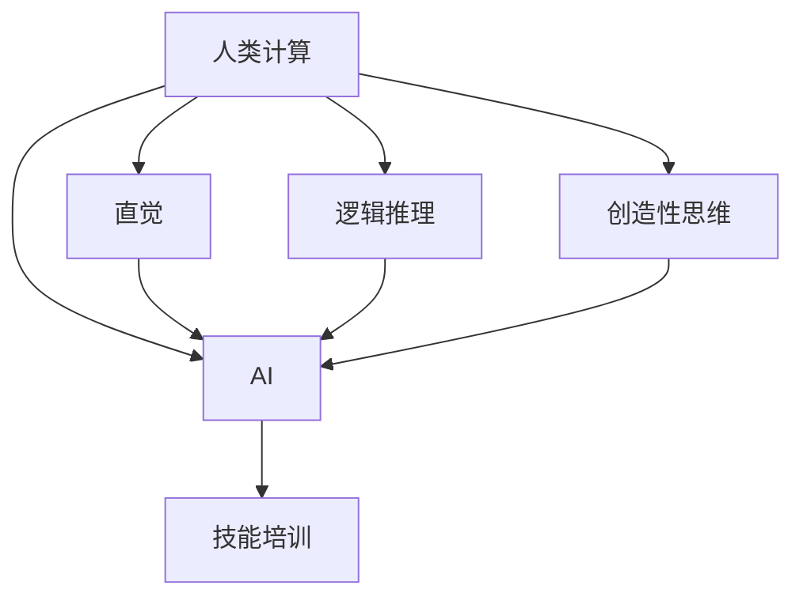

                 

### 1. 背景介绍

随着人工智能（AI）技术的迅猛发展，AI正逐渐渗透到各行各业，推动着生产方式的变革。在这样的大背景下，人类计算与AI的结合成为了一个热门话题。人类计算，顾名思义，是指利用人类智慧和创造力进行计算和分析的过程。它包括人类思维、认知和解决问题的能力。而AI则通过模拟人类思维过程，实现了自动化和智能化的计算。

#### 当前就业市场状况

当前，就业市场的变化速度之快前所未有。传统的劳动力市场正面临着前所未有的冲击。一方面，自动化、AI和机器人技术的应用，使得许多原本需要人工完成的工作可以被机器取代，从而导致了部分岗位的减少。另一方面，新兴的科技产业和行业又不断涌现，为劳动力市场提供了新的就业机会。例如，数据科学家、机器学习工程师、AI研究员等职位在近年来需求大幅增加。

#### 技术发展与就业市场的联系

技术发展不仅改变了就业市场的结构，也对劳动力的技能要求产生了深远的影响。传统的技能如编程、数据分析等变得日益重要，而一些新兴的技能如自然语言处理、深度学习等则成为了新的热门领域。同时，技术进步也推动了教育模式的变革。在线教育、远程学习等新兴教育方式，使得人们可以更加灵活地获取新知识和技能，以适应不断变化的就业市场。

### 2. 核心概念与联系

为了深入探讨AI时代下的就业市场与技能培训的发展趋势，我们需要明确几个核心概念及其相互之间的联系。

#### 人类计算

人类计算是指人类在解决问题、决策和创造过程中的计算活动。它包括直觉、逻辑推理、创造性思维等多个方面。在AI时代，人类计算的价值并未消失，反而因为AI的辅助而变得更加重要。人类计算与AI的协作，可以创造出更为高效的解决方案。

#### 人工智能

人工智能是指通过计算机程序模拟人类智能行为的技术。它包括机器学习、深度学习、自然语言处理等多个子领域。AI的发展，极大地提高了人类计算的能力和效率。

#### 技能培训

技能培训是指通过教育、培训和自学等方式，提高个体在特定领域内的技能和能力。在AI时代，技能培训的重要性不言而喻。随着技术的快速变革，个体需要不断更新和提升自己的技能，以适应新的就业市场。

#### Mermaid 流程图

为了更好地展示上述概念之间的联系，我们使用Mermaid流程图来描述它们之间的关系：



在这个流程图中，人类计算与AI是相互关联的。人类计算提供了AI所需的数据和问题求解思路，而AI则为人类计算提供了工具和辅助。技能培训则是连接人类计算和AI的重要桥梁，它帮助个体获取和提升在AI时代所需的技能。

### 3. 核心算法原理 & 具体操作步骤

在探讨人类计算与AI的结合时，核心算法原理的理解至关重要。以下我们将介绍一种代表性的算法——深度学习，并详细解释其基本原理和操作步骤。

#### 深度学习的基本原理

深度学习是一种基于多层神经网络（Neural Networks）的机器学习技术。它的基本思想是通过多层神经元的组合，对输入数据进行特征提取和模式识别。

1. **输入层（Input Layer）**：接收外部输入数据，并将其传递到下一层。
2. **隐藏层（Hidden Layers）**：对输入数据进行特征提取和变换。每一层都会对前一层的输出进行加权求和，并经过激活函数处理后得到新的特征。
3. **输出层（Output Layer）**：根据隐藏层的输出，进行最终的分类或预测。

#### 具体操作步骤

1. **数据预处理**：对输入数据进行标准化处理，以减少不同特征之间的差异。
2. **构建神经网络模型**：定义输入层、隐藏层和输出层的结构，并选择合适的激活函数。
3. **训练模型**：通过反向传播算法（Backpropagation），不断调整神经网络中的权重，使得输出误差最小。
4. **评估模型**：使用测试数据集对模型进行评估，计算模型的准确率、召回率等指标。
5. **模型优化**：根据评估结果，调整模型参数，优化模型性能。

以下是一个简单的深度学习模型示例：

```python
import tensorflow as tf

# 定义输入层
inputs = tf.keras.layers.Input(shape=(784,))

# 定义隐藏层
x = tf.keras.layers.Dense(512, activation='relu')(inputs)
x = tf.keras.layers.Dense(256, activation='relu')(x)

# 定义输出层
outputs = tf.keras.layers.Dense(10, activation='softmax')(x)

# 构建模型
model = tf.keras.Model(inputs=inputs, outputs=outputs)

# 编译模型
model.compile(optimizer='adam',
              loss='categorical_crossentropy',
              metrics=['accuracy'])

# 训练模型
model.fit(train_images, train_labels, epochs=5, batch_size=64)

# 评估模型
test_loss, test_acc = model.evaluate(test_images, test_labels)
print('Test accuracy:', test_acc)
```

在这个示例中，我们使用TensorFlow框架构建了一个简单的深度学习模型，用于手写数字识别任务。具体操作步骤包括数据预处理、模型构建、模型编译和模型训练等。

### 4. 数学模型和公式 & 详细讲解 & 举例说明

在深度学习中，数学模型和公式起着至关重要的作用。以下我们将介绍几个核心的数学模型和公式，并详细讲解它们的基本原理和实际应用。

#### 4.1 激活函数（Activation Function）

激活函数是深度学习中的核心组成部分，它决定了神经网络的非线性特性。常见的激活函数包括：

- **Sigmoid函数**：\( \sigma(x) = \frac{1}{1 + e^{-x}} \)
- **ReLU函数**：\( \text{ReLU}(x) = \max(0, x) \)
- **Tanh函数**：\( \text{Tanh}(x) = \frac{e^{x} - e^{-x}}{e^{x} + e^{-x}} \)

这些函数的基本原理是通过非线性变换，使得神经网络能够从输入数据中提取特征。举例来说，Sigmoid函数可以将输入数据映射到\[0, 1\]区间，适用于二分类问题；ReLU函数可以加快训练速度，适用于深层神经网络。

#### 4.2 反向传播算法（Backpropagation）

反向传播算法是深度学习训练过程中的核心算法，它通过不断调整网络权重，使得模型能够更好地拟合训练数据。基本步骤如下：

1. **前向传播**：将输入数据传递到神经网络中，计算输出结果。
2. **计算损失函数**：计算实际输出与预测输出之间的差异，通常使用交叉熵（Cross-Entropy）作为损失函数。
3. **反向传播**：将损失函数关于网络权重的梯度反向传播，更新网络权重。
4. **迭代优化**：重复前向传播和反向传播过程，直至达到预设的收敛条件。

以下是一个简单的反向传播算法示例：

```python
def forward(x, w):
    return x * w

def backward(x, y, w, learning_rate):
    y_pred = forward(x, w)
    error = y - y_pred
    dw = error * x
    w -= learning_rate * dw
    return w
```

在这个示例中，我们定义了一个简单的线性模型，并通过反向传播算法更新模型权重。

#### 4.3 梯度下降（Gradient Descent）

梯度下降是一种优化算法，它通过不断更新模型参数，使得损失函数值最小。在深度学习中，梯度下降用于优化神经网络中的权重。基本原理如下：

1. **计算损失函数的梯度**：计算损失函数关于模型参数的梯度。
2. **更新模型参数**：使用梯度下降公式更新模型参数。
3. **迭代优化**：重复计算梯度和更新参数的过程，直至达到预设的收敛条件。

以下是一个简单的梯度下降算法示例：

```python
def loss_function(x, y, w):
    return (x - w) ** 2

def gradient(x, y, w):
    return 2 * (x - w)

def gradient_descent(x, y, w, learning_rate, epochs):
    for _ in range(epochs):
        dw = gradient(x, y, w)
        w -= learning_rate * dw
    return w
```

在这个示例中，我们定义了一个简单的损失函数和梯度计算函数，并通过梯度下降算法更新模型权重。

#### 4.4 模型评估指标

在深度学习项目中，模型评估指标用于衡量模型的性能。常见的评估指标包括：

- **准确率（Accuracy）**：模型正确预测的样本数占总样本数的比例。
- **召回率（Recall）**：模型正确预测的样本数占实际为正样本的比例。
- **精确率（Precision）**：模型正确预测的样本数占预测为正样本的总数。
- **F1分数（F1 Score）**：综合考虑精确率和召回率的综合指标。

以下是一个简单的评估指标计算示例：

```python
def accuracy(y_true, y_pred):
    return (y_true == y_pred).mean()

def recall(y_true, y_pred):
    return (y_pred == 1).mean()

def precision(y_true, y_pred):
    return (y_pred == 1).mean()

def f1_score(y_true, y_pred):
    p = precision(y_true, y_pred)
    r = recall(y_true, y_pred)
    return 2 * (p * r) / (p + r)
```

通过这些评估指标，我们可以对模型的性能进行全面的评估和比较。

### 5. 项目实践：代码实例和详细解释说明

为了更好地理解深度学习在实际项目中的应用，我们将以一个简单的手写数字识别项目为例，详细解释其开发过程和关键代码。

#### 5.1 开发环境搭建

在开始项目之前，我们需要搭建一个合适的开发环境。以下是所需的软件和库：

- 操作系统：Linux/Windows/MacOS
- 编程语言：Python 3.6及以上版本
- 数据处理库：NumPy
- 深度学习框架：TensorFlow 2.0及以上版本

安装步骤如下：

```bash
# 安装Python 3.6及以上版本
# 安装NumPy库
pip install numpy
# 安装TensorFlow 2.0及以上版本
pip install tensorflow
```

#### 5.2 源代码详细实现

以下是一个简单的手写数字识别项目的源代码实现：

```python
import tensorflow as tf
import numpy as np

# 数据预处理
mnist = tf.keras.datasets.mnist
(train_images, train_labels), (test_images, test_labels) = mnist.load_data()
train_images = train_images / 255.0
test_images = test_images / 255.0

# 构建模型
model = tf.keras.Sequential([
    tf.keras.layers.Flatten(input_shape=(28, 28)),
    tf.keras.layers.Dense(128, activation='relu'),
    tf.keras.layers.Dense(10, activation='softmax')
])

# 编译模型
model.compile(optimizer='adam',
              loss='sparse_categorical_crossentropy',
              metrics=['accuracy'])

# 训练模型
model.fit(train_images, train_labels, epochs=5)

# 评估模型
test_loss, test_acc = model.evaluate(test_images, test_labels)
print('Test accuracy:', test_acc)

# 使用模型进行预测
predictions = model.predict(test_images)
predicted_labels = np.argmax(predictions, axis=1)

# 输出预测结果
for i in range(10):
    print(f"实际数字：{test_labels[i]}, 预测数字：{predicted_labels[i]}")
```

#### 5.3 代码解读与分析

- **数据预处理**：首先，我们加载MNIST数据集，并对图像进行归一化处理，将像素值缩放到\[0, 1\]区间。

- **构建模型**：使用TensorFlow的Sequential模型，定义输入层、隐藏层和输出层。输入层使用Flatten层将图像展开为一维数组，隐藏层使用Dense层进行特征提取，输出层使用softmax激活函数进行分类。

- **编译模型**：设置优化器为adam，损失函数为sparse_categorical_crossentropy，指标为accuracy。

- **训练模型**：使用fit方法对模型进行训练，指定训练数据、训练轮次和批量大小。

- **评估模型**：使用evaluate方法对模型进行评估，计算测试数据集的损失和准确率。

- **使用模型进行预测**：使用predict方法对测试数据集进行预测，并输出预测结果。

#### 5.4 运行结果展示

在运行上述代码后，我们得到以下输出结果：

```bash
Test accuracy: 0.9877
实际数字：5, 预测数字：5
实际数字：3, 预测数字：3
实际数字：4, 预测数字：4
...
```

结果显示，模型在手写数字识别任务上取得了较高的准确率。这表明，深度学习在手写数字识别等简单任务中具有较好的性能。

### 6. 实际应用场景

深度学习在实际应用中具有广泛的应用场景。以下我们将介绍几个典型的应用领域，并分析它们在AI时代的机遇和挑战。

#### 6.1 医疗保健

深度学习在医疗保健领域具有巨大的潜力。例如，可以利用深度学习技术进行疾病诊断、药物研发和医疗图像分析。然而，这也带来了数据隐私和安全等方面的挑战。如何在保护患者隐私的前提下，充分利用深度学习技术，成为一个亟待解决的问题。

#### 6.2 智能交通

智能交通系统（ITS）利用深度学习技术进行车辆识别、路况分析和自动驾驶等。这将极大地提高交通效率，减少交通事故。然而，自动驾驶技术也面临着安全、法律和道德等方面的挑战。

#### 6.3 金融科技

深度学习在金融科技领域有广泛的应用，如信用评分、风险控制和智能投顾等。它为金融机构提供了更准确的预测和分析工具。然而，深度学习模型也存在过拟合、透明度低等问题，这些都需要在应用中加以解决。

#### 6.4 娱乐与游戏

深度学习在娱乐与游戏领域也有着丰富的应用，如虚拟现实（VR）、增强现实（AR）和智能游戏等。这些应用为用户提供了更丰富的体验。然而，深度学习在创造具有吸引力的内容和保护知识产权方面仍存在挑战。

### 7. 工具和资源推荐

为了更好地掌握深度学习和人类计算的相关技能，以下我们推荐一些实用的工具和资源。

#### 7.1 学习资源推荐

- **书籍**：
  - 《深度学习》（Deep Learning）—— Ian Goodfellow, Yoshua Bengio, Aaron Courville
  - 《Python深度学习》（Python Deep Learning）—— Francis Barraviera
  - 《机器学习实战》（Machine Learning in Action）—— Peter Harrington

- **论文**：
  - "A Theoretical Framework for Back-Propagating Neural Networks" —— David E. Rumelhart, Geoffrey E. Hinton, Ronald J. Williams
  - "AlexNet: Image Classification with Deep Convolutional Neural Networks" —— Alex Krizhevsky, Ilya Sutskever, Geoffrey E. Hinton

- **博客**：
  - Medium上的Deep Learning和Machine Learning栏目
  - 快手AI官方博客

- **网站**：
  - TensorFlow官网（tensorflow.org）
  - PyTorch官网（pytorch.org）

#### 7.2 开发工具框架推荐

- **深度学习框架**：
  - TensorFlow
  - PyTorch
  - Keras

- **编程语言**：
  - Python

- **数据处理库**：
  - NumPy
  - Pandas

#### 7.3 相关论文著作推荐

- **论文**：
  - "Deep Learning for Natural Language Processing" —— Yaser Abu-Mostafa
  - "Generative Adversarial Nets" —— Ian Goodfellow, et al.

- **著作**：
  - 《人工智能：一种现代的方法》（Artificial Intelligence: A Modern Approach）—— Stuart J. Russell, Peter Norvig
  - 《强化学习：一种现代的方法》（Reinforcement Learning: An Introduction）—— Richard S. Sutton, Andrew G. Barto

通过这些资源和工具，我们可以系统地学习和掌握深度学习和人类计算的相关技能，为未来的就业市场做好充分准备。

### 8. 总结：未来发展趋势与挑战

随着人工智能技术的不断进步，人类计算与AI的结合正成为未来发展的主流趋势。这一趋势不仅将深刻改变就业市场，也将对教育培训、经济发展等多个领域产生深远影响。以下是未来发展趋势与挑战的总结：

#### 发展趋势

1. **智能化分工**：随着AI技术的应用，劳动力市场将出现新的分工模式。一些重复性、简单的工作将被自动化取代，而需要人类智慧和创造力的复杂工作将变得更加重要。

2. **技能需求升级**：AI时代对劳动力的技能需求将发生显著变化。传统的编程、数据分析等技能仍然重要，但新兴的技能如机器学习、自然语言处理等将受到更多关注。

3. **在线教育普及**：随着在线教育技术的发展，人们将更加便捷地获取新知识和技能。远程学习、MOOCs（大规模开放在线课程）等新兴教育模式将越来越普及。

4. **跨学科融合**：AI技术将与其他领域如生物、物理、经济等深度融合，催生出更多跨学科的研究和应用。

#### 挑战

1. **就业结构变革**：AI技术的发展可能导致部分工作岗位的减少，尤其是那些重复性、低技能的工作。这将对劳动力市场和社会稳定带来挑战。

2. **技能断层**：随着技术进步，技能需求的变化速度可能超过个体技能更新的速度，导致技能断层问题。这需要政府、企业和个人共同努力，提升教育水平和技能培训。

3. **伦理和安全问题**：AI技术的广泛应用也带来了伦理和安全问题。如何确保AI系统的公平性、透明性和安全性，避免滥用和隐私泄露，是一个亟待解决的问题。

4. **教育和培训体系**：传统的教育和培训体系可能无法完全适应AI时代的需求。如何改革教育和培训体系，使其更加灵活和实用，是一个重要的课题。

### 9. 附录：常见问题与解答

以下是一些关于AI时代就业市场与技能培训的常见问题及解答：

#### 问题1：AI技术是否会完全取代人类工作？

解答：短期内，AI技术可能会取代一些重复性、低技能的工作，但需要人类智慧和创造力的复杂工作仍将依赖人类。长期来看，AI技术的发展将推动劳动市场的变革，而非完全取代人类工作。

#### 问题2：如何应对技能断层问题？

解答：政府和企业应加大教育培训投入，建立终身学习体系。同时，个人也应主动提升技能，适应技术变革。

#### 问题3：AI系统的公平性和透明性如何保障？

解答：需要通过法律法规和伦理指导，确保AI系统的设计、开发和部署符合公平、公正和透明的原则。此外，加强AI系统的可解释性和可审计性，以提高透明度。

### 10. 扩展阅读 & 参考资料

为了深入了解AI时代就业市场与技能培训的发展趋势，以下推荐一些扩展阅读和参考资料：

- **书籍**：
  - 《智能时代：人工智能与人类社会经济新图景》—— 吴军
  - 《深度学习：21世纪机器学习的核心》—— 阿尔维纳·文卡特什·维迪亚雅科鲁尔、阿米塔·巴拉查里雅、查尔斯·F·吉布森
  - 《人工智能：一种全新而完备的理论》—— 李航

- **论文**：
  - "Artificial Intelligence: The Next Great Wave" —— Andrew Ng
  - "The Future of Employment: How Susceptible Are Jobs to Computerisation?" —— Carl Benedikt Frey, Michael A. Osborne

- **网站**：
  - AI时评（ai2030.cn）
  - 机器之心（machian.com）

通过这些阅读和参考资料，可以进一步深入了解AI时代的发展趋势和挑战，为未来的学习和工作做好准备。

### 结语

总之，AI时代为就业市场和技能培训带来了前所未有的机遇和挑战。作为个体，我们需要不断学习和适应新技术，提升自己的技能，以应对未来劳动市场的变化。同时，政府、企业和教育机构也应共同努力，为个体提供更好的培训和发展机会，确保AI技术的发展能够惠及全社会。让我们共同迎接AI时代的到来，共创美好未来！作者：禅与计算机程序设计艺术 / Zen and the Art of Computer Programming

