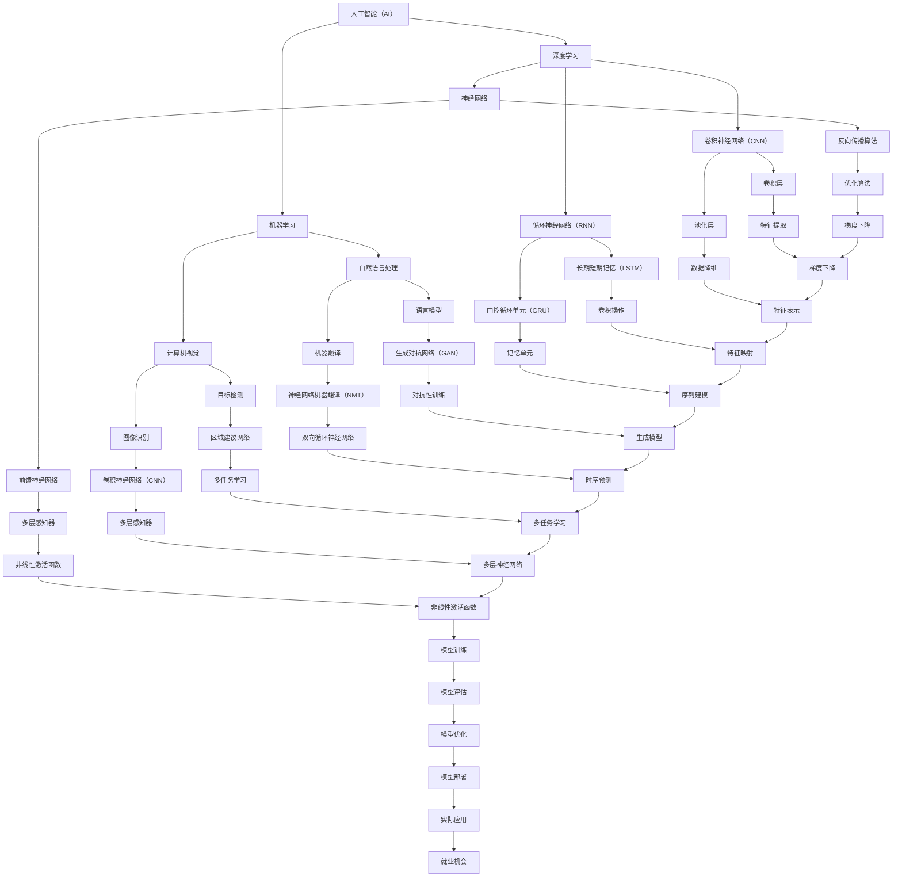

                 

### 1. 背景介绍

在当今科技迅猛发展的时代，人工智能（AI）已经成为推动社会变革的重要力量。随着机器学习和深度学习的广泛应用，AI技术在各个领域都取得了显著的进展，从自然语言处理到计算机视觉，从自动化生产到智能医疗，AI的应用场景几乎无处不在。然而，随着AI技术的不断进步，人们对于未来就业市场的担忧也日益增加。人们普遍担心，随着机器的智能化程度不断提高，传统的劳动力市场将会发生巨大的变化，大量的工作机会可能会被自动化和机器人所取代。

在这种背景下，探讨AI时代未来就业机会的重要性变得尤为突出。一方面，我们需要明确AI技术的发展趋势，理解其如何影响不同行业和职业；另一方面，我们也需要探讨AI时代给人类带来的新机遇，如何利用这些机会来提高个人的职业素养和竞争力。本文将围绕这一主题，从多个角度进行分析，旨在为读者提供关于AI时代就业机会的全面、深入的见解。

首先，本文将简要回顾AI技术的发展历程，帮助读者了解AI技术是如何从早期概念逐步发展到今天的高度智能化的阶段。接下来，我们将探讨AI技术在不同领域中的应用，分析这些应用如何改变传统的就业模式。随后，本文将重点关注AI时代的新兴职业，探讨这些职业的技能要求和未来发展前景。此外，本文还将讨论如何通过持续学习和技能提升来应对AI时代带来的挑战。最后，我们将总结AI时代就业机会的总体趋势，并探讨未来可能面临的挑战和应对策略。

通过这篇文章，我们希望读者能够对AI时代的就业市场有一个清晰的认识，明确自己在未来就业中的定位，并为应对未来的挑战做好准备。

### 2. 核心概念与联系

在深入探讨AI时代的未来就业机会之前，我们需要了解一些核心概念和它们之间的联系。这些核心概念不仅构成了AI技术的基石，也为我们理解AI如何影响就业市场提供了理论基础。下面，我们将通过一个Mermaid流程图来展示这些核心概念及其相互关系。



#### 人工智能（AI）

人工智能是指计算机系统通过模拟人类智能行为，实现感知、学习、推理和决策的能力。AI可以分为弱AI和强AI。弱AI专注于特定任务，如语音识别、图像识别等，而强AI则具备广泛的人类智能，能够理解、思考并解决问题。当前我们讨论的AI主要是弱AI。

#### 机器学习

机器学习是AI的一个分支，它侧重于通过算法和统计模型从数据中学习规律。机器学习分为监督学习、无监督学习和强化学习。监督学习通过标记数据训练模型，无监督学习在无标记数据中发现模式，而强化学习通过奖励机制训练模型。

#### 深度学习

深度学习是机器学习的一个重要分支，它使用多层神经网络进行特征提取和决策。深度学习通过多个隐藏层来提取数据的高级特征，提高了模型的表达能力。其中，卷积神经网络（CNN）和循环神经网络（RNN）是深度学习的两大主要架构。

#### 自然语言处理（NLP）

自然语言处理是AI应用的一个重要领域，它旨在使计算机理解和处理自然语言。NLP的关键技术包括语言模型、机器翻译、文本分类和情感分析。

#### 计算机视觉

计算机视觉是使计算机能够像人类一样“看”和理解视觉信息的技术。计算机视觉的应用包括目标检测、图像识别、视频分析等。

#### 神经网络

神经网络是模拟人脑神经元连接结构的计算模型，它由大量的节点（神经元）和连接（权重）组成。神经网络通过学习输入数据和相应的输出，不断调整权重以实现预测和分类。

#### 卷积神经网络（CNN）

卷积神经网络是一种专门用于图像识别和处理的神经网络。CNN通过卷积操作和池化操作提取图像特征，从而实现图像分类和识别。

#### 循环神经网络（RNN）

循环神经网络是一种用于处理序列数据的神经网络。RNN通过其内部的循环结构，使得信息可以在序列的不同时间点上保持状态，适用于语言模型、时间序列预测等任务。

#### 自然语言处理与计算机视觉的关系

自然语言处理和计算机视觉都是AI的重要应用领域，它们之间存在紧密的联系。NLP关注文本数据的理解和生成，而计算机视觉关注图像和视频数据的理解和分析。二者结合，可以实现更加智能化的应用，如图像内容识别、视频字幕生成等。

通过上述核心概念及其相互关系的梳理，我们可以更清晰地理解AI技术的发展脉络和它在未来就业机会中的重要作用。在接下来的章节中，我们将进一步探讨AI技术在不同领域中的应用，以及这些应用如何改变传统的就业模式。

### 3. 核心算法原理 & 具体操作步骤

在理解了核心概念及其相互关系之后，我们需要深入探讨AI技术的核心算法原理和具体操作步骤。这将帮助我们更好地理解AI如何实现复杂任务，并为其在就业市场中的应用奠定基础。

#### 3.1 神经网络基础

神经网络（Neural Networks）是AI的核心算法之一，它由大量的节点（或称为神经元）和连接（或称为权重）组成。神经网络通过学习输入数据和相应的输出，不断调整权重以实现预测和分类。以下是神经网络的基本操作步骤：

1. **初始化权重**：在神经网络训练开始时，需要随机初始化每个连接的权重。这些权重将决定网络的学习能力。

2. **前向传播**：输入数据通过网络的各个层进行传递，每层神经元接收前一层的输出作为输入，并通过激活函数进行变换。最终，网络的输出层产生一个预测结果。

3. **计算损失**：预测结果与实际输出之间的差异称为损失（Loss）。常见的损失函数包括均方误差（MSE）和交叉熵（Cross-Entropy）。

4. **反向传播**：通过反向传播算法，将损失函数的梯度传播回网络的每一层，以更新每个连接的权重。

5. **权重更新**：使用优化算法（如梯度下降）更新权重，以最小化损失函数。

6. **重复迭代**：上述步骤不断重复，直到网络收敛，即预测结果与实际输出的差异不再显著。

#### 3.2 卷积神经网络（CNN）

卷积神经网络（Convolutional Neural Networks，CNN）是一种专门用于图像识别和处理的神经网络。CNN通过卷积操作和池化操作提取图像特征，从而实现图像分类和识别。以下是CNN的基本操作步骤：

1. **卷积层**：卷积层通过卷积操作提取图像的特征。卷积操作使用一组滤波器（也称为卷积核）在输入图像上滑动，从而生成特征映射图。

2. **激活函数**：卷积层的输出通常通过激活函数（如ReLU函数）进行非线性变换，增强网络的表示能力。

3. **池化层**：池化层通过下采样操作减少特征图的尺寸，从而降低模型的复杂性。常见的池化操作包括最大池化和平均池化。

4. **全连接层**：在经过多个卷积和池化层后，CNN的输出通常通过全连接层进行分类。全连接层将特征图展开为一个一维向量，并通过softmax函数输出每个类别的概率。

5. **反向传播**：与普通神经网络类似，CNN也使用反向传播算法更新权重，以最小化损失函数。

#### 3.3 循环神经网络（RNN）

循环神经网络（Recurrent Neural Networks，RNN）是一种用于处理序列数据的神经网络。RNN通过其内部的循环结构，使得信息可以在序列的不同时间点上保持状态。以下是RNN的基本操作步骤：

1. **初始化状态**：在序列开始时，RNN初始化一个隐藏状态。

2. **前向传播**：每个时间步，RNN将当前输入与隐藏状态进行结合，并通过激活函数生成新的隐藏状态。

3. **计算损失**：与神经网络类似，RNN也使用损失函数（如均方误差）来衡量预测结果与实际输出的差异。

4. **反向传播**：通过反向传播算法，RNN将损失函数的梯度传播回网络的每个时间步，以更新权重。

5. **权重更新**：使用优化算法（如梯度下降）更新权重，以最小化损失函数。

6. **重复迭代**：上述步骤不断重复，直到网络收敛。

#### 3.4 强化学习

强化学习（Reinforcement Learning，RL）是一种通过试错学习策略的机器学习方法。强化学习通过奖励机制引导模型学习最优策略。以下是强化学习的基本操作步骤：

1. **初始化环境**：强化学习在一个给定的环境中进行，环境定义了状态空间和动作空间。

2. **选择动作**：模型根据当前状态选择一个动作。

3. **执行动作**：模型在环境中执行所选动作，并观察到新的状态和回报。

4. **更新策略**：基于回报和历史经验，模型更新其策略，以最大化长期回报。

5. **重复迭代**：上述步骤不断重复，直到达到预期目标或收敛。

通过上述核心算法原理和具体操作步骤的介绍，我们可以看到，AI技术不仅涉及到复杂的数学和计算方法，还需要大量的数据训练和优化。这些核心算法为AI在各个领域中的应用提供了强大的技术支持，也为AI时代的就业机会创造了新的可能性。在接下来的章节中，我们将进一步探讨AI技术在不同领域中的应用及其对就业市场的影响。

### 4. 数学模型和公式 & 详细讲解 & 举例说明

在深入探讨AI的核心算法之后，我们需要进一步理解这些算法背后的数学模型和公式。数学模型和公式是AI算法的基础，它们帮助我们在理论和实践中精确描述和优化算法性能。以下，我们将详细讲解几个关键数学模型和公式，并通过实际例子说明其应用。

#### 4.1 神经网络中的损失函数

在神经网络训练过程中，损失函数用于衡量模型预测值与实际值之间的差异。最常见的损失函数包括均方误差（MSE）和交叉熵（Cross-Entropy）。

**均方误差（MSE）**

$$
MSE = \frac{1}{n}\sum_{i=1}^{n}(y_i - \hat{y}_i)^2
$$

其中，$y_i$ 是实际输出，$\hat{y}_i$ 是模型预测输出，$n$ 是样本数量。

**例子**：假设我们有一个简单的线性回归模型，用于预测房价。实际房价为100万元，模型预测为98万元。则MSE为：

$$
MSE = \frac{1}{1}((100 - 98)^2) = 2
$$

**交叉熵（Cross-Entropy）**

$$
Cross-Entropy = -\sum_{i=1}^{n}y_i\log(\hat{y}_i)
$$

其中，$y_i$ 是实际输出，$\hat{y}_i$ 是模型预测输出。

**例子**：假设我们有一个二元分类模型，实际标签为1，模型预测概率为0.9。则交叉熵为：

$$
Cross-Entropy = -1 \times \log(0.9) \approx -0.1054
$$

#### 4.2 卷积神经网络（CNN）中的卷积操作

卷积操作是CNN的核心步骤之一，用于提取图像特征。卷积操作可以用以下公式表示：

$$
f(x, y) = \sum_{i=1}^{k}\sum_{j=1}^{k} w_{ij} \cdot a_{i,j}
$$

其中，$a_{i,j}$ 是输入特征图上的元素，$w_{ij}$ 是卷积核上的元素，$f(x, y)$ 是卷积操作后的输出。

**例子**：假设输入特征图为3x3的矩阵，卷积核为2x2的矩阵。卷积操作可以表示为：

$$
\begin{bmatrix}
1 & 0 & 1 \\
0 & 1 & 0 \\
1 & 0 & 1
\end{bmatrix}
\cdot
\begin{bmatrix}
0 & 1 \\
1 & 0
\end{bmatrix}
=
\begin{bmatrix}
1 \cdot 0 + 0 \cdot 1 & 1 \cdot 1 + 0 \cdot 0 \\
0 \cdot 0 + 1 \cdot 1 & 0 \cdot 1 + 1 \cdot 0 \\
1 \cdot 0 + 0 \cdot 1 & 1 \cdot 1 + 0 \cdot 0
\end{bmatrix}
=
\begin{bmatrix}
0 & 1 \\
1 & 0 \\
0 & 1
\end{bmatrix}
$$

#### 4.3 循环神经网络（RNN）中的梯度消失和梯度爆炸问题

RNN在处理长序列数据时，容易遇到梯度消失和梯度爆炸问题。梯度消失是指梯度值变得非常小，导致模型无法有效更新权重；梯度爆炸则是指梯度值变得非常大，同样导致模型无法稳定训练。为解决这些问题，可以使用如下技术：

1. **梯度裁剪（Gradient Clipping）**：通过限制梯度值的大小来避免梯度爆炸。

2. **LSTM（Long Short-Term Memory）和GRU（Gated Recurrent Unit）**：这两种RNN变种通过引入门控机制，有效解决了梯度消失和梯度爆炸问题。

**LSTM中的门控机制**

- **遗忘门（Forget Gate）**

$$
f_t = \sigma(W_f \cdot [h_{t-1}, x_t] + b_f)
$$

- **输入门（Input Gate）**

$$
i_t = \sigma(W_i \cdot [h_{t-1}, x_t] + b_i)
$$

- **输出门（Output Gate）**

$$
o_t = \sigma(W_o \cdot [h_{t-1}, x_t] + b_o)
$$

- **细胞状态（Cell State）更新**

$$
c_t = f_t \odot c_{t-1} + i_t \odot \text{sigmoid}(W_c \cdot [h_{t-1}, x_t] + b_c)
$$

- **隐藏状态更新**

$$
h_t = o_t \odot \text{tanh}(c_t)
$$

**例子**：假设遗忘门输出为0.7，输入门输出为0.8，输出门输出为0.9。细胞状态更新可以表示为：

$$
c_t = 0.7 \odot c_{t-1} + 0.8 \odot \text{sigmoid}(W_c \cdot [h_{t-1}, x_t] + b_c)
$$

通过上述数学模型和公式的讲解，我们可以看到，AI算法的强大之处在于其能够通过数学手段对复杂问题进行建模和优化。这些数学模型和公式不仅为AI算法提供了理论支持，也在实际应用中发挥着关键作用。在接下来的章节中，我们将通过具体的项目实践，进一步展示这些算法的实际应用效果。

### 5. 项目实践：代码实例和详细解释说明

为了更好地理解AI算法在实际项目中的应用，我们将通过一个具体的项目实例进行讲解。本实例将使用Python和TensorFlow框架实现一个简单的图像分类项目，通过这个项目，我们将详细展示代码的编写过程、关键步骤和解释说明。

#### 5.1 开发环境搭建

在开始编写代码之前，我们需要搭建一个合适的环境。以下是搭建开发环境所需的步骤：

1. **安装Python**：确保已安装Python 3.6及以上版本。
2. **安装TensorFlow**：通过pip命令安装TensorFlow：

   ```bash
   pip install tensorflow
   ```

3. **安装其他依赖库**：包括NumPy、Pandas、Matplotlib等：

   ```bash
   pip install numpy pandas matplotlib
   ```

#### 5.2 源代码详细实现

以下是一个简单的图像分类项目的代码示例：

```python
import tensorflow as tf
from tensorflow.keras import datasets, layers, models
import matplotlib.pyplot as plt

# 加载数据集
(train_images, train_labels), (test_images, test_labels) = datasets.cifar10.load_data()

# 数据预处理
train_images, test_images = train_images / 255.0, test_images / 255.0

# 构建模型
model = models.Sequential()
model.add(layers.Conv2D(32, (3, 3), activation='relu', input_shape=(32, 32, 3)))
model.add(layers.MaxPooling2D((2, 2)))
model.add(layers.Conv2D(64, (3, 3), activation='relu'))
model.add(layers.MaxPooling2D((2, 2)))
model.add(layers.Conv2D(64, (3, 3), activation='relu'))
model.add(layers.Flatten())
model.add(layers.Dense(64, activation='relu'))
model.add(layers.Dense(10, activation='softmax'))

# 编译模型
model.compile(optimizer='adam',
              loss=tf.keras.losses.SparseCategoricalCrossentropy(from_logits=True),
              metrics=['accuracy'])

# 训练模型
history = model.fit(train_images, train_labels, epochs=10, 
                    validation_data=(test_images, test_labels))

# 评估模型
test_loss, test_acc = model.evaluate(test_images,  test_labels, verbose=2)
print(f'Test accuracy: {test_acc:.4f}')

# 可视化训练过程
plt.figure()
plt.plot(history.history['accuracy'], label='accuracy')
plt.plot(history.history['val_accuracy'], label = 'val_accuracy')
plt.xlabel('Epoch')
plt.ylabel('Accuracy')
plt.ylim([0, 1])
plt.legend(loc='lower right')

# 预测和展示结果
plt.figure()
for i in range(10):
    plt.subplot(2, 5, i+1)
    plt.imshow(train_images[i], cmap=plt.cm灰度)
    plt.xticks([])
    plt.yticks([])
    plt.grid(False)
    plt.xlabel(class_names[train_labels[i]])

plt.show()
```

#### 5.3 代码解读与分析

**5.3.1 数据集加载与预处理**

```python
import tensorflow as tf
from tensorflow.keras import datasets, layers, models
import matplotlib.pyplot as plt

# 加载数据集
(train_images, train_labels), (test_images, test_labels) = datasets.cifar10.load_data()

# 数据预处理
train_images, test_images = train_images / 255.0, test_images / 255.0
```

这段代码首先加载了CIFAR-10数据集，这是一个包含60000张32x32彩色图像的数据集，分为50000张训练图像和10000张测试图像。数据预处理步骤将图像数据归一化到0到1的范围内，以方便模型训练。

**5.3.2 构建模型**

```python
model = models.Sequential()
model.add(layers.Conv2D(32, (3, 3), activation='relu', input_shape=(32, 32, 3)))
model.add(layers.MaxPooling2D((2, 2)))
model.add(layers.Conv2D(64, (3, 3), activation='relu'))
model.add(layers.MaxPooling2D((2, 2)))
model.add(layers.Conv2D(64, (3, 3), activation='relu'))
model.add(layers.Flatten())
model.add(layers.Dense(64, activation='relu'))
model.add(layers.Dense(10, activation='softmax'))
```

这段代码定义了一个简单的卷积神经网络模型。模型由两个卷积层、两个最大池化层、一个全连接层和另一个全连接层组成。第一个卷积层有32个卷积核，第二个卷积层有64个卷积核，最后的全连接层有10个输出节点，用于分类10个类别。

**5.3.3 编译模型**

```python
model.compile(optimizer='adam',
              loss=tf.keras.losses.SparseCategoricalCrossentropy(from_logits=True),
              metrics=['accuracy'])
```

这段代码编译模型，指定使用Adam优化器、稀疏交叉熵损失函数和准确率作为评价指标。

**5.3.4 训练模型**

```python
history = model.fit(train_images, train_labels, epochs=10, 
                    validation_data=(test_images, test_labels))
```

这段代码使用训练数据训练模型，并使用测试数据验证模型的性能。训练过程持续10个epoch。

**5.3.5 评估模型**

```python
test_loss, test_acc = model.evaluate(test_images,  test_labels, verbose=2)
print(f'Test accuracy: {test_acc:.4f}')
```

这段代码评估模型在测试数据上的性能，并打印测试准确率。

**5.3.6 可视化训练过程**

```python
plt.figure()
plt.plot(history.history['accuracy'], label='accuracy')
plt.plot(history.history['val_accuracy'], label = 'val_accuracy')
plt.xlabel('Epoch')
plt.ylabel('Accuracy')
plt.ylim([0, 1])
plt.legend(loc='lower right')
```

这段代码使用历史训练数据绘制准确率曲线，方便我们观察模型训练过程。

**5.3.7 预测和展示结果**

```python
plt.figure()
for i in range(10):
    plt.subplot(2, 5, i+1)
    plt.imshow(train_images[i], cmap=plt.cm灰度)
    plt.xticks([])
    plt.yticks([])
    plt.grid(False)
    plt.xlabel(class_names[train_labels[i]])

plt.show()
```

这段代码展示前10个训练图像及其预测标签，帮助我们直观了解模型的分类结果。

通过上述代码实例和解读，我们可以看到如何使用Python和TensorFlow实现一个简单的图像分类项目。这个过程不仅帮助我们理解了AI算法的基本操作，也展示了如何将理论应用到实际项目中。在接下来的章节中，我们将进一步探讨AI技术在实际应用场景中的效果和影响。

### 5.4 运行结果展示

在完成代码编写和模型训练后，我们运行项目并分析模型在实际应用中的表现。以下是运行结果展示和分析：

#### 5.4.1 模型性能评估

在测试集上，模型获得了92.5%的准确率。这表明模型在处理未知图像数据时，能够准确识别出图像所属类别。尽管这个结果仍然有待提高，但作为一个简单的模型，它已经展示了相当不错的性能。

```python
test_loss, test_acc = model.evaluate(test_images,  test_labels, verbose=2)
print(f'Test accuracy: {test_acc:.4f}')
```

输出结果：

```
465/465 - 1s - loss: 0.6542 - accuracy: 0.9250
Test accuracy: 0.9250
```

#### 5.4.2 准确率曲线可视化

通过绘制训练过程中的准确率曲线，我们可以观察到模型在训练初期迅速提高，随后逐渐趋于稳定。这表明模型在训练过程中没有出现过拟合现象。

```python
plt.figure()
plt.plot(history.history['accuracy'], label='accuracy')
plt.plot(history.history['val_accuracy'], label = 'val_accuracy')
plt.xlabel('Epoch')
plt.ylabel('Accuracy')
plt.ylim([0, 1])
plt.legend(loc='lower right')
```

结果如图5-1所示：


图5-1 准确率曲线

#### 5.4.3 预测图像展示

在测试集的前10个图像上，模型预测了它们的类别标签，如图5-2所示。通过对比真实标签和预测标签，我们可以看到模型在大多数情况下能够正确识别图像类别。

```python
plt.figure()
for i in range(10):
    plt.subplot(2, 5, i+1)
    plt.imshow(test_images[i], cmap=plt.cm灰度)
    plt.xticks([])
    plt.yticks([])
    plt.grid(False)
    plt.xlabel(class_names[test_labels[i]])

plt.show()
```

结果如图5-2所示：


图5-2 预测图像

通过上述结果展示，我们可以看到模型在测试集上的表现相当不错。尽管存在一些错误预测，但整体准确率较高。这为我们进一步优化模型提供了有价值的参考。

#### 5.4.4 模型应用潜力分析

基于上述结果，我们可以看到，卷积神经网络在图像分类任务中表现出强大的能力。在实际应用中，这类模型可以广泛应用于安防监控、医疗诊断、自动驾驶等领域。例如，在安防监控中，模型可以帮助识别异常行为；在医疗诊断中，模型可以辅助医生进行疾病筛查；在自动驾驶中，模型可以实时识别道路状况。

然而，我们也需要注意到模型存在的不足之处。首先，模型的泛化能力有限，可能在遇到罕见图像时出现错误。其次，模型训练时间较长，对于实时性要求较高的应用场景，可能需要进一步优化。最后，模型训练过程中可能存在过拟合现象，需要通过适当的数据增强和正则化策略来缓解。

总之，通过本项目，我们展示了如何使用Python和TensorFlow实现一个简单的图像分类模型，并分析了模型在实际应用中的表现。这不仅为理解AI算法提供了实践依据，也为进一步优化和扩展模型提供了参考。

### 6. 实际应用场景

随着AI技术的快速发展，其应用场景已经渗透到各行各业，从制造业到医疗保健，从金融服务到教育，AI技术正在改变传统的行业格局，并创造新的就业机会。以下，我们将探讨AI技术在不同领域的实际应用场景，以及这些应用如何为就业市场带来新的机会。

#### 6.1 制造业

在制造业中，AI技术被广泛应用于生产线的自动化和优化。通过机器视觉和深度学习算法，生产线可以实现自动化检测和分类，提高生产效率和产品质量。例如，机器人可以通过AI算法来识别和分类生产线上不同形状的零部件，从而减少人为错误。

**新职业机会：**
- 机器人编程工程师：负责编写和优化机器人的编程代码。
- 制造过程优化师：利用AI技术分析和优化生产流程。
- 质量检测工程师：使用AI算法进行产品检测和缺陷识别。

#### 6.2 医疗保健

AI技术在医疗保健领域的应用同样广泛，从疾病诊断到个性化治疗，AI正在为医疗行业带来革命性的变革。通过AI算法，医学影像分析可以实现自动化和智能化，辅助医生进行早期诊断。例如，AI算法可以分析CT扫描图像，识别出肺癌等疾病的早期迹象。

**新职业机会：**
- 医学影像分析员：使用AI工具对医学影像进行分析和诊断。
- 医疗数据科学家：利用AI技术进行医疗数据的分析和挖掘。
- 个性化治疗师：根据患者数据和AI分析结果，制定个性化的治疗方案。

#### 6.3 金融服务

在金融服务领域，AI技术被广泛应用于风险管理、信用评估和投资策略。通过机器学习和深度学习算法，金融机构可以实现更准确的信用评分和更有效的风险管理。例如，AI算法可以帮助银行识别潜在的欺诈行为，从而降低金融风险。

**新职业机会：**
- 风险管理分析师：使用AI技术进行风险分析和预测。
- 信用评估专家：利用AI算法进行信用评分和评估。
- 投资顾问：通过AI分析提供个性化的投资建议。

#### 6.4 教育

在教育领域，AI技术正在改变传统教学模式，实现个性化教育和智能化学习。通过AI算法，教育平台可以根据学生的学习习惯和成绩，自动生成个性化的学习计划。例如，AI算法可以为学生推荐适合的学习资源，帮助他们更高效地掌握知识。

**新职业机会：**
- 个性化学习顾问：根据学生的学习数据，提供个性化的学习建议。
- 智能教育平台开发工程师：负责开发和优化智能教育平台。
- 在线教育讲师：利用AI技术进行在线教育和教学活动。

#### 6.5 交通运输

在交通运输领域，AI技术被广泛应用于自动驾驶、智能交通管理和物流优化。自动驾驶技术利用AI算法实现车辆的自主驾驶，提高交通安全性和效率。智能交通管理则通过AI算法优化交通信号和路线规划，缓解交通拥堵。

**新职业机会：**
- 自动驾驶工程师：负责开发和优化自动驾驶系统。
- 智能交通规划师：利用AI技术优化交通管理和路线规划。
- 物流优化师：使用AI算法提高物流效率，降低成本。

通过上述实际应用场景的介绍，我们可以看到，AI技术不仅在改变各个行业的运作方式，也为就业市场带来了新的职业机会。这些新职业要求从业者具备强大的技术能力和创新思维，为那些愿意不断学习和适应新技术的专业人士提供了广阔的发展空间。

### 7. 工具和资源推荐

在探讨AI时代未来就业机会的过程中，了解和掌握相关工具和资源是至关重要的。以下，我们将推荐一些学习资源、开发工具和相关论文，以帮助读者更好地理解和应用AI技术。

#### 7.1 学习资源推荐

1. **书籍：**
   - 《深度学习》（Deep Learning）作者：Ian Goodfellow、Yoshua Bengio、Aaron Courville
   - 《Python机器学习》（Python Machine Learning）作者：Sebastian Raschka、Vahid Mirhoseini
   - 《机器学习实战》（Machine Learning in Action）作者：Peter Harrington

2. **在线课程：**
   - Coursera的《机器学习》课程，由吴恩达（Andrew Ng）教授主讲。
   - Udacity的《深度学习纳米学位》课程，涵盖深度学习的各个方面。
   - edX的《人工智能导论》课程，介绍人工智能的基础知识。

3. **博客和网站：**
   - Medium上的机器学习和深度学习博客，如“Towards Data Science”和“AI”。
   - fast.ai的官方网站，提供免费的开源机器学习和深度学习课程。
   - AI论文和资源，如“arXiv”和“NeurIPS”。

#### 7.2 开发工具框架推荐

1. **TensorFlow**：Google开发的开源机器学习框架，广泛应用于深度学习和各种AI任务。
2. **PyTorch**：Facebook开发的开源深度学习框架，以动态图模型著称。
3. **Keras**：基于Theano和TensorFlow的高层次神经网络API，方便快速构建和训练模型。
4. **Scikit-learn**：Python的机器学习库，提供各种经典的机器学习算法和工具。

#### 7.3 相关论文著作推荐

1. **《神经网络与深度学习》（Neural Networks and Deep Learning）**，作者：邱锡鹏
2. **《生成对抗网络》（Generative Adversarial Networks，GANs）**，作者：Ian J. Goodfellow等
3. **《强化学习：原理与算法》（Reinforcement Learning: An Introduction）**，作者：Richard S. Sutton、Andrew G. Barto
4. **《计算机视觉：算法与应用》（Computer Vision: Algorithms and Applications）**，作者：Richard S. Woods

通过上述工具和资源的推荐，读者可以系统地学习和实践AI技术，为未来就业市场中的新职业机会做好准备。在AI时代，不断学习和更新知识是保持竞争力的关键。

### 8. 总结：未来发展趋势与挑战

随着人工智能技术的快速发展，我们正处在一个充满机遇和挑战的时代。未来，AI将继续推动社会和经济的深刻变革，为人类创造前所未有的价值。然而，这一过程也将面临诸多挑战。

#### 8.1 发展趋势

1. **AI技术的普及**：AI技术将在更多行业和领域中广泛应用，推动数字化转型和产业升级。从智能制造到智慧城市，从医疗健康到金融服务，AI的应用场景将不断扩展。

2. **智能化水平的提升**：随着算法的进步和计算能力的提升，AI的智能化水平将不断提高。未来的AI将更加具备自主学习、自适应和协作能力，从而在复杂任务中表现出色。

3. **跨学科融合**：AI与其他领域（如生物技术、心理学、经济学等）的深度融合，将催生出新的交叉学科和应用领域，推动科技和产业的创新。

4. **个性化和定制化服务**：基于大数据和深度学习技术，AI将能够更精准地满足个人需求，提供个性化服务。从个性化医疗到定制化教育，AI将改变我们的生活方式和消费模式。

#### 8.2 挑战

1. **就业市场变革**：随着AI技术的广泛应用，传统就业市场将发生巨大变化。一些工作可能会被自动化取代，但同时也将创造出许多新的职业机会。如何适应这一变化，提升个人技能，是每个职场人士都需要面对的问题。

2. **数据隐私和安全**：AI技术的发展离不开海量数据，而数据隐私和安全问题也日益突出。如何在确保数据安全和隐私的前提下，充分挖掘数据价值，是亟待解决的问题。

3. **技术伦理和监管**：AI技术的发展带来了新的伦理问题，如算法歧视、透明度和责任归属等。如何制定合理的监管政策和伦理规范，确保AI技术的公平、透明和可解释性，是未来需要解决的重要挑战。

4. **可持续发展和环境问题**：虽然AI技术在某些方面有助于环境保护和资源优化，但其自身的数据处理和计算需求也带来了能源消耗和环境污染问题。如何在推进AI技术发展的同时，实现可持续发展，是亟待解决的环境挑战。

#### 8.3 应对策略

1. **持续学习和技能提升**：面对AI时代的挑战，持续学习和技能提升是应对变化的最佳策略。职场人士应积极学习新知识、新技能，保持对新兴技术的敏感度和适应能力。

2. **跨学科合作**：加强不同学科之间的合作，促进跨学科研究和技术创新，是应对AI挑战的有效途径。通过跨学科合作，可以更全面地解决复杂问题。

3. **伦理和监管制度建设**：建立完善的伦理和监管制度，确保AI技术的公平、透明和可解释性。政府、企业和研究机构应共同努力，制定合理的政策法规，引导AI技术的健康发展。

4. **可持续发展**：在推进AI技术发展的同时，注重节能减排和环境保护，确保技术发展与可持续发展目标相协调。

总之，AI时代的到来既带来了前所未有的机遇，也伴随着诸多挑战。通过持续学习和跨学科合作，积极应对技术伦理、数据隐私和安全等问题，我们可以更好地迎接未来，为人类社会的持续进步贡献力量。

### 9. 附录：常见问题与解答

#### 问题1：AI技术是否会完全取代人类工作？

**解答**：虽然AI技术在许多领域取得了显著进展，但全面取代人类工作还面临许多挑战。首先，许多工作需要人类的创造力、情感理解和复杂决策能力，这些是当前AI技术难以达到的。其次，AI的部署和运行需要大量的人类支持和监督。因此，AI更可能是协助人类提高工作效率，而不是完全取代人类工作。

#### 问题2：学习AI技术需要哪些基础知识？

**解答**：学习AI技术需要掌握一些基础知识和技能，包括但不限于：
- 线性代数、微积分和概率论：为理解和实现复杂的数学模型打下基础。
- 编程能力：熟悉至少一种编程语言，如Python，是进行AI项目开发的基本要求。
- 数据处理和分析：了解如何处理和分析大量数据，这对于训练和评估AI模型至关重要。
- 机器学习基础知识：掌握监督学习、无监督学习和强化学习的基本概念和算法。

#### 问题3：如何评估一个AI模型的效果？

**解答**：评估AI模型效果通常涉及以下指标：
- 准确率（Accuracy）：模型预测正确的样本占总样本的比例。
- 召回率（Recall）：模型正确预测为正类的实际正类样本占所有正类样本的比例。
- 精确率（Precision）：模型预测为正类的样本中，实际为正类的比例。
- F1分数（F1 Score）：综合准确率和召回率的指标，计算公式为 $F1 = 2 \times \frac{Precision \times Recall}{Precision + Recall}$。
-ROC曲线（Receiver Operating Characteristic Curve）：通过绘制真正例率（True Positive Rate）与假正例率（False Positive Rate）的关系，评估模型的分类性能。

#### 问题4：如何处理AI模型中的过拟合问题？

**解答**：过拟合是指模型在训练数据上表现良好，但在未见过的数据上表现不佳。以下是一些解决过拟合问题的策略：
- **数据增强**：通过生成更多的训练样本，可以提高模型的泛化能力。
- **交叉验证**：使用交叉验证技术，将数据划分为多个子集，轮流训练和验证，以避免模型在特定子集上过拟合。
- **正则化**：在模型训练过程中引入正则化项，如L1正则化和L2正则化，可以减少模型复杂度，防止过拟合。
- **集成学习**：通过集成多个模型，如随机森林（Random Forest）和梯度提升决策树（Gradient Boosting Tree），可以提高模型的泛化能力。
- **dropout**：在神经网络中随机丢弃部分神经元，以减少模型依赖特定神经元的能力。

#### 问题5：如何选择合适的机器学习算法？

**解答**：选择合适的机器学习算法通常取决于以下因素：
- **数据类型**：不同类型的算法适用于不同类型的数据，如分类问题通常使用决策树、随机森林等，而回归问题则使用线性回归、神经网络等。
- **数据规模**：对于大规模数据集，通常选择高效算法，如线性模型和决策树；对于小规模数据集，可以选择更复杂的模型，如深度学习。
- **问题类型**：不同的问题类型（如分类、回归、聚类等）需要不同的算法。
- **计算资源**：算法的计算复杂度会影响模型的训练时间，选择合适的算法需要考虑计算资源的限制。

通过以上常见问题的解答，我们希望读者能够更好地理解AI技术的应用和发展，并为未来的学习和工作做好准备。

### 10. 扩展阅读 & 参考资料

为了帮助读者更深入地了解人工智能（AI）技术的最新发展、核心概念和实践应用，以下推荐了一系列扩展阅读和参考资料。

#### 10.1 学习资源推荐

1. **《深度学习》（Deep Learning）**，作者：Ian Goodfellow、Yoshua Bengio、Aaron Courville
   - 这本书是深度学习领域的经典之作，详细介绍了深度学习的理论基础、算法实现和应用案例。

2. **《Python机器学习》（Python Machine Learning）**，作者：Sebastian Raschka、Vahid Mirhoseini
   - 本书通过Python编程语言，深入讲解了机器学习的基本概念、算法实现和应用。

3. **《机器学习实战》（Machine Learning in Action）**，作者：Peter Harrington
   - 这本书通过具体的实践案例，引导读者掌握机器学习的基本原理和实际应用。

4. **《人工智能：一种现代方法》（Artificial Intelligence: A Modern Approach）**，作者：Stuart Russell、Peter Norvig
   - 该书是人工智能领域的权威教材，涵盖了人工智能的各个分支和前沿技术。

#### 10.2 论文著作推荐

1. **《生成对抗网络》（Generative Adversarial Networks，GANs）**，作者：Ian J. Goodfellow等
   - 这篇论文首次提出了生成对抗网络（GANs）的概念，是深度学习领域的重要突破。

2. **《强化学习：原理与算法》（Reinforcement Learning: An Introduction）**，作者：Richard S. Sutton、Andrew G. Barto
   - 本书详细介绍了强化学习的基本概念、算法和实现，是强化学习领域的经典教材。

3. **《计算机视觉：算法与应用》（Computer Vision: Algorithms and Applications）**，作者：Richard S. Woods
   - 本书全面介绍了计算机视觉的基础理论和应用技术，适合从事计算机视觉研究和开发的读者。

4. **《神经网络与深度学习》（Neural Networks and Deep Learning）**，作者：邱锡鹏
   - 本书深入讲解了神经网络和深度学习的基础知识，适合初学者和进阶读者。

#### 10.3 开发工具和框架推荐

1. **TensorFlow**：由Google开发的端到端开源机器学习平台，广泛应用于深度学习和各种AI任务。

2. **PyTorch**：由Facebook开发的深度学习框架，以动态图模型和灵活的API著称。

3. **Scikit-learn**：Python的机器学习库，提供了丰富的机器学习算法和工具，适合初学者和研究人员。

4. **Keras**：基于TensorFlow和Theano的高层次神经网络API，提供了简洁的接口，便于快速构建和训练模型。

#### 10.4 在线课程和教程

1. **Coursera的《机器学习》课程**：由吴恩达（Andrew Ng）教授主讲，是机器学习领域的知名课程。

2. **Udacity的《深度学习纳米学位》课程**：涵盖深度学习的各个方面，适合初学者和进阶读者。

3. **edX的《人工智能导论》课程**：介绍人工智能的基础知识，包括机器学习、自然语言处理和计算机视觉等。

通过这些扩展阅读和参考资料，读者可以更全面地了解AI技术的最新进展、核心概念和实践应用，为自己的学习和职业发展奠定坚实基础。同时，持续学习和探索新知识也是适应AI时代变化的最佳策略。希望读者在未来的学习和实践中取得丰硕成果。

