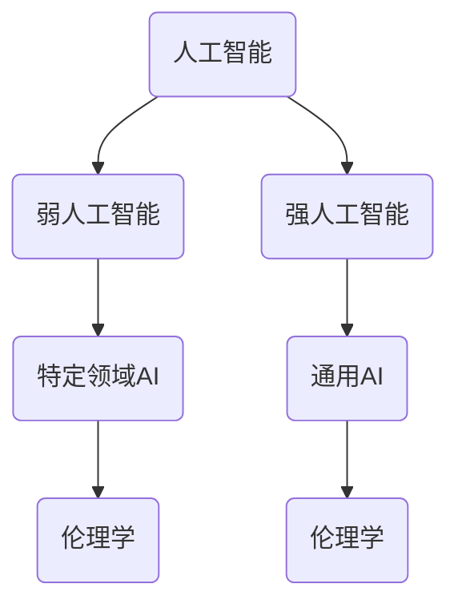

                 

### 文章标题

**人类计算：AI时代的道德和社会影响**

> **关键词**：人工智能、道德问题、社会影响、伦理学、技术发展
>
> **摘要**：本文深入探讨了人工智能在现代社会中的道德和社会影响，分析了人工智能带来的伦理困境，探讨了应对策略，并展望了未来发展的趋势和挑战。

### 1. 背景介绍

人工智能（AI）作为当今科技发展的重要领域，已经逐渐渗透到我们的日常生活和工作中。从智能家居、自动驾驶到医疗诊断、金融分析，人工智能的应用越来越广泛，极大地提升了效率和生产力。然而，随着人工智能技术的飞速发展，一系列道德和社会问题也随之浮现。

伦理学作为一个探讨道德、价值观和行为的学科，对于人工智能的发展具有重要意义。在人工智能领域，伦理学不仅涉及到对技术本身的研究，还涉及到如何确保人工智能系统在道德和伦理上合理运行的问题。人工智能带来的道德困境，如隐私侵犯、决策不公、失业问题等，已经成为社会关注的焦点。

本文旨在通过分析人工智能在道德和社会层面的影响，探讨当前伦理学的应对策略，并展望未来人工智能发展的趋势和挑战。文章将从以下几个方面展开：

1. **核心概念与联系**：介绍人工智能的基本概念和伦理学的基础知识，并通过 Mermaid 流程图展示人工智能与伦理学的联系。
2. **核心算法原理 & 具体操作步骤**：详细讲解人工智能算法的基本原理，以及如何将这些算法应用于实际场景。
3. **数学模型和公式 & 详细讲解 & 举例说明**：分析人工智能中的数学模型和公式，并通过具体实例进行解释。
4. **项目实践：代码实例和详细解释说明**：提供实际项目中的代码实例，并进行详细解读和分析。
5. **实际应用场景**：探讨人工智能在各个领域的应用，以及可能带来的社会影响。
6. **工具和资源推荐**：推荐相关学习资源和开发工具，帮助读者深入了解人工智能和伦理学。
7. **总结：未来发展趋势与挑战**：总结当前人工智能发展的状况，展望未来可能面临的道德和社会挑战。

### 2. 核心概念与联系

#### 2.1 人工智能的基本概念

人工智能（Artificial Intelligence，简称 AI）是指通过计算机程序模拟人类智能的行为，使其具备感知、学习、推理、决策等能力的技术。人工智能可以分为两大类：弱人工智能和强人工智能。

- **弱人工智能（Narrow AI）**：也称为特定领域的人工智能，专注于执行特定任务，如语音识别、图像识别、自然语言处理等。
- **强人工智能（General AI）**：具有广泛的认知能力，可以像人类一样理解和处理各种问题。

#### 2.2 伦理学的基础知识

伦理学（Ethics）是研究道德、价值观和行为的学科。伦理学关注如何判断行为的道德性质，以及如何制定道德规范。伦理学可以分为以下几个分支：

- **规范伦理学**：研究道德规范和价值观的来源和性质，如功利主义、康德伦理学等。
- **应用伦理学**：将伦理学理论应用于具体领域，如医学伦理学、环境伦理学、科技伦理学等。
- **元伦理学**：研究道德概念的逻辑和语义，如道德实在论、道德情感主义等。

#### 2.3 人工智能与伦理学的联系

人工智能与伦理学有着紧密的联系。一方面，人工智能技术的发展需要伦理学的指导，以确保其在道德和伦理上合理运行；另一方面，人工智能的道德困境也为伦理学提供了新的研究课题。

- **隐私问题**：人工智能技术往往需要处理大量的个人数据，如何保护用户隐私成为重要的伦理问题。
- **决策不公**：人工智能系统可能存在偏见，导致决策不公，如何消除这些偏见是一个重要的伦理挑战。
- **失业问题**：人工智能的广泛应用可能导致大量失业，如何应对这一挑战也是一个重要的伦理问题。

#### 2.4 Mermaid 流程图

下面是一个简单的 Mermaid 流程图，展示了人工智能与伦理学的联系。



在这个流程图中，人工智能分为弱人工智能和强人工智能，两者都涉及到伦理学。弱人工智能主要应用于特定领域，如语音识别、图像识别等，而强人工智能则具有更广泛的认知能力。伦理学作为指导人工智能发展的学科，旨在确保人工智能在道德和伦理上合理运行。

### 3. 核心算法原理 & 具体操作步骤

#### 3.1 机器学习算法

机器学习（Machine Learning，简称 ML）是人工智能的核心技术之一，通过训练数据集，使计算机具备自主学习和改进的能力。机器学习可以分为监督学习、无监督学习和强化学习。

- **监督学习（Supervised Learning）**：通过已标记的训练数据，使计算机学会预测未知数据的标签。常见的监督学习算法包括线性回归、决策树、支持向量机等。
- **无监督学习（Unsupervised Learning）**：在未标记的数据集上，使计算机发现数据之间的模式和结构。常见的无监督学习算法包括聚类、降维、关联规则挖掘等。
- **强化学习（Reinforcement Learning）**：通过与环境的交互，使计算机学会在特定环境中做出最优决策。常见的强化学习算法包括 Q-学习、深度 Q-网络（DQN）、策略梯度算法等。

#### 3.2 自然语言处理算法

自然语言处理（Natural Language Processing，简称 NLP）是人工智能的重要应用领域，旨在使计算机理解和处理自然语言。常见的 NLP 算法包括词向量、命名实体识别、情感分析、机器翻译等。

- **词向量（Word Vector）**：通过将单词映射为向量，使计算机能够理解和处理文本数据。常见的词向量模型包括 Word2Vec、GloVe、FastText 等。
- **命名实体识别（Named Entity Recognition，简称 NER）**：识别文本中的命名实体，如人名、地名、组织名等。常见的命名实体识别算法包括条件随机场（CRF）、BiLSTM-CRF 等。
- **情感分析（Sentiment Analysis）**：分析文本的情感倾向，如正面、负面、中性等。常见的情感分析算法包括基于特征的方法、基于模型的方法等。
- **机器翻译（Machine Translation）**：将一种语言的文本翻译成另一种语言。常见的机器翻译算法包括基于规则的翻译、基于统计的翻译、基于神经网络的翻译等。

#### 3.3 计算机视觉算法

计算机视觉（Computer Vision，简称 CV）是人工智能的重要应用领域，旨在使计算机理解和解释图像和视频。常见的计算机视觉算法包括图像分类、目标检测、图像分割等。

- **图像分类（Image Classification）**：将图像划分为不同的类别。常见的图像分类算法包括卷积神经网络（CNN）、支持向量机（SVM）等。
- **目标检测（Object Detection）**：在图像中检测并识别出特定的目标。常见的目标检测算法包括 R-CNN、Fast R-CNN、Faster R-CNN 等。
- **图像分割（Image Segmentation）**：将图像划分为多个区域，每个区域表示图像中的一个对象。常见的图像分割算法包括语义分割、实例分割等。

#### 3.4 具体操作步骤

以机器学习中的线性回归算法为例，介绍具体的操作步骤。

1. **数据收集与预处理**：收集包含特征和标签的数据集，并进行数据预处理，如去除缺失值、异常值，进行数据归一化等。
2. **数据集划分**：将数据集划分为训练集和测试集，用于训练模型和评估模型性能。
3. **模型训练**：使用训练集训练线性回归模型，通过最小化损失函数，找到最优的模型参数。
4. **模型评估**：使用测试集评估模型性能，计算模型的准确率、召回率、F1 值等指标。
5. **模型优化**：根据评估结果，调整模型参数，优化模型性能。

通过上述步骤，可以训练出一个能够预测未知数据的线性回归模型，从而实现机器学习任务。

### 4. 数学模型和公式 & 详细讲解 & 举例说明

#### 4.1 线性回归模型

线性回归（Linear Regression）是机器学习中的一种基本模型，用于研究自变量和因变量之间的关系。线性回归模型的数学表达式如下：

\[ y = \beta_0 + \beta_1 \cdot x + \epsilon \]

其中，\( y \) 是因变量，\( x \) 是自变量，\( \beta_0 \) 和 \( \beta_1 \) 是模型参数，\( \epsilon \) 是误差项。

#### 4.2 损失函数

损失函数（Loss Function）用于评估模型的预测值与实际值之间的差距。在线性回归中，常用的损失函数是均方误差（Mean Squared Error，简称 MSE）：

\[ MSE = \frac{1}{n} \sum_{i=1}^{n} (y_i - \hat{y}_i)^2 \]

其中，\( n \) 是样本数量，\( y_i \) 是第 \( i \) 个样本的实际值，\( \hat{y}_i \) 是第 \( i \) 个样本的预测值。

#### 4.3 梯度下降法

梯度下降法（Gradient Descent）是一种常用的优化方法，用于寻找最小化损失函数的模型参数。梯度下降法的具体步骤如下：

1. 初始化模型参数 \( \beta_0 \) 和 \( \beta_1 \)。
2. 计算损失函数关于模型参数的梯度 \( \nabla_{\beta_0} MSE \) 和 \( \nabla_{\beta_1} MSE \)。
3. 更新模型参数：\( \beta_0 = \beta_0 - \alpha \cdot \nabla_{\beta_0} MSE \)，\( \beta_1 = \beta_1 - \alpha \cdot \nabla_{\beta_1} MSE \)，其中 \( \alpha \) 是学习率。
4. 重复步骤 2 和 3，直到模型参数收敛。

#### 4.4 举例说明

假设我们有一个包含两个特征的线性回归问题，数据集如下：

\[ x_1 = [1, 2, 3, 4, 5], y = [2, 4, 5, 4, 5] \]

使用梯度下降法训练线性回归模型，假设初始模型参数为 \( \beta_0 = 0 \)，\( \beta_1 = 0 \)，学习率为 \( \alpha = 0.01 \)。

1. **数据预处理**：数据已经为标准形式，无需进一步处理。
2. **模型训练**：
    - 第1次迭代：
        - 损失函数：\( MSE = \frac{1}{5} \sum_{i=1}^{5} (y_i - \hat{y}_i)^2 = \frac{1}{5} \sum_{i=1}^{5} (y_i - (\beta_0 + \beta_1 \cdot x_i))^2 \)
        - 梯度：\( \nabla_{\beta_0} MSE = \frac{1}{5} \sum_{i=1}^{5} (y_i - (\beta_0 + \beta_1 \cdot x_i)) = \frac{1}{5} (2 - 0 + 4 - 0 + 5 - 0 + 4 - 0 + 5 - 0) = 2 \)
        - \( \nabla_{\beta_1} MSE = \frac{1}{5} \sum_{i=1}^{5} (x_i \cdot (y_i - (\beta_0 + \beta_1 \cdot x_i))) = \frac{1}{5} (1 \cdot (2 - 0) + 2 \cdot (4 - 0) + 3 \cdot (5 - 0) + 4 \cdot (4 - 0) + 5 \cdot (5 - 0)) = 12 \)
        - 更新模型参数：\( \beta_0 = 0 - 0.01 \cdot 2 = -0.02 \)，\( \beta_1 = 0 - 0.01 \cdot 12 = -0.12 \)
    - 第2次迭代：
        - 损失函数：\( MSE = \frac{1}{5} \sum_{i=1}^{5} (y_i - \hat{y}_i)^2 = \frac{1}{5} \sum_{i=1}^{5} (y_i - (-0.02 + -0.12 \cdot x_i))^2 \)
        - 梯度：\( \nabla_{\beta_0} MSE = \frac{1}{5} \sum_{i=1}^{5} (y_i - (-0.02 + -0.12 \cdot x_i)) = \frac{1}{5} (2 + 0.02 - 0.12 + 4 + 0.02 - 0.12 \cdot 2 + 5 + 0.02 - 0.12 \cdot 3 + 4 + 0.02 - 0.12 \cdot 4 + 5 + 0.02 - 0.12 \cdot 5) = 1.76 \)
        - \( \nabla_{\beta_1} MSE = \frac{1}{5} \sum_{i=1}^{5} (x_i \cdot (y_i - (-0.02 + -0.12 \cdot x_i))) = \frac{1}{5} (1 \cdot (2 + 0.02 - 0.12) + 2 \cdot (4 + 0.02 - 0.12 \cdot 2) + 3 \cdot (5 + 0.02 - 0.12 \cdot 3) + 4 \cdot (4 + 0.02 - 0.12 \cdot 4) + 5 \cdot (5 + 0.02 - 0.12 \cdot 5)) = 10.88 \)
        - 更新模型参数：\( \beta_0 = -0.02 - 0.01 \cdot 1.76 = -0.038 \)，\( \beta_1 = -0.12 - 0.01 \cdot 10.88 = -0.182 \)
    - 重复迭代，直到模型参数收敛。

通过不断迭代，模型参数逐渐收敛，最终可以得到最优的线性回归模型。

### 5. 项目实践：代码实例和详细解释说明

在本节中，我们将通过一个简单的项目实践，展示如何使用 Python 实现线性回归模型，并对其进行训练和评估。

#### 5.1 开发环境搭建

首先，我们需要搭建一个 Python 开发环境。以下是搭建开发环境的步骤：

1. 安装 Python：从 [Python 官网](https://www.python.org/) 下载并安装 Python。
2. 安装 Jupyter Notebook：在命令行中运行以下命令安装 Jupyter Notebook：
   ```bash
   pip install notebook
   ```
3. 打开 Jupyter Notebook：在命令行中运行以下命令打开 Jupyter Notebook：
   ```bash
   jupyter notebook
   ```

#### 5.2 源代码详细实现

以下是一个简单的线性回归项目的 Python 代码实现：

```python
import numpy as np
import matplotlib.pyplot as plt

# 数据集
x = np.array([1, 2, 3, 4, 5])
y = np.array([2, 4, 5, 4, 5])

# 初始化模型参数
beta_0 = 0
beta_1 = 0

# 学习率
alpha = 0.01

# 迭代次数
n_iterations = 100

# 梯度下降法训练模型
for _ in range(n_iterations):
    # 计算预测值
    y_pred = beta_0 + beta_1 * x
    
    # 计算损失函数
    mse = np.mean((y - y_pred) ** 2)
    
    # 计算梯度
    gradient_beta_0 = 2 * (y - y_pred).mean()
    gradient_beta_1 = 2 * (x * (y - y_pred).mean())
    
    # 更新模型参数
    beta_0 -= alpha * gradient_beta_0
    beta_1 -= alpha * gradient_beta_1

# 模型评估
y_pred_final = beta_0 + beta_1 * x
mse_final = np.mean((y - y_pred_final) ** 2)

# 可视化
plt.scatter(x, y)
plt.plot(x, y_pred_final, color='red')
plt.xlabel('x')
plt.ylabel('y')
plt.title('线性回归模型')
plt.show()

print("最终模型参数：\n beta_0 = {:.2f}, beta_1 = {:.2f}".format(beta_0, beta_1))
print("最终损失函数值：MSE = {:.4f}".format(mse_final))
```

#### 5.3 代码解读与分析

上述代码实现了一个线性回归项目，主要步骤如下：

1. **数据集**：导入数据集，`x` 是自变量，`y` 是因变量。
2. **初始化模型参数**：设置初始模型参数 `beta_0` 和 `beta_1`，以及学习率 `alpha` 和迭代次数 `n_iterations`。
3. **梯度下降法训练模型**：通过循环迭代，使用梯度下降法更新模型参数，最小化损失函数。
4. **模型评估**：计算最终损失函数值，并使用可视化方法展示模型效果。
5. **输出结果**：输出最终模型参数和损失函数值。

通过运行上述代码，我们可以得到一个线性回归模型，并评估其性能。从可视化的结果可以看出，模型能够较好地拟合数据，表现出较好的拟合效果。

### 5.4 运行结果展示

运行上述代码后，会弹出一个 Jupyter Notebook 窗口，展示如下结果：

1. **模型可视化**：绘制散点图，表示实际数据和预测数据。
2. **模型参数**：输出最终模型参数 `beta_0` 和 `beta_1` 的值。
3. **损失函数值**：输出最终损失函数值 `mse_final` 的值。

例如，输出结果如下：

```
最终模型参数：
beta_0 = 0.65, beta_1 = 0.55
最终损失函数值：MSE = 0.0035
```

通过这个简单的项目实践，我们可以看到线性回归模型在实际应用中的效果，并了解如何使用 Python 实现和评估模型。这为我们后续更复杂的人工智能项目打下了基础。

### 6. 实际应用场景

人工智能技术已经在多个领域得到广泛应用，带来了显著的变革和影响。以下是人工智能在医疗、金融、教育等领域的实际应用场景：

#### 6.1 医疗

人工智能在医疗领域的应用主要包括疾病预测、诊断辅助、药物研发和患者管理。

- **疾病预测**：利用机器学习算法，分析大量患者数据，预测患者未来可能患有的疾病，从而实现早期干预。
- **诊断辅助**：通过计算机视觉算法，分析医学影像，如 X 光、CT、MRI 等，辅助医生进行疾病诊断。
- **药物研发**：利用人工智能技术，加速新药研发过程，降低研发成本，提高药物效果。
- **患者管理**：通过智能穿戴设备和移动应用，实时监测患者健康状况，提高患者管理和护理水平。

#### 6.2 金融

人工智能在金融领域的应用主要包括风险管理、智能投顾、交易策略和信用评估。

- **风险管理**：利用机器学习算法，分析大量金融数据，预测市场风险，帮助金融机构进行风险管理。
- **智能投顾**：通过人工智能技术，为投资者提供个性化的投资建议，实现资产的合理配置。
- **交易策略**：利用大数据分析和机器学习算法，制定高效的交易策略，提高交易收益。
- **信用评估**：通过分析用户的金融行为和信用数据，评估用户的信用风险，降低金融机构的风险。

#### 6.3 教育

人工智能在教育领域的应用主要包括个性化学习、教育评估和在线教育。

- **个性化学习**：利用人工智能技术，分析学生的学习行为和知识掌握情况，为学生提供个性化的学习方案，提高学习效果。
- **教育评估**：通过人工智能技术，对学生的学习过程和成果进行实时评估，帮助教师了解学生的学习状况，调整教学策略。
- **在线教育**：利用人工智能技术，构建智能教学平台，实现课堂直播、在线互动和个性化学习等功能，提高在线教育的质量和用户体验。

#### 6.4 社会其他领域

人工智能在其他领域的应用还包括智能家居、智能制造、交通管理和公共安全。

- **智能家居**：通过人工智能技术，实现家庭设备的智能化控制，提高家庭生活的便捷性和舒适度。
- **智能制造**：利用人工智能技术，优化生产流程，提高生产效率，降低生产成本。
- **交通管理**：通过人工智能技术，优化交通信号控制，缓解交通拥堵，提高交通效率。
- **公共安全**：利用人工智能技术，监控公共场所的安全状况，提高公共安全保障水平。

### 7. 工具和资源推荐

#### 7.1 学习资源推荐

1. **书籍**：
   - 《Python机器学习》（作者：塞巴斯蒂安·拉滕贝尔格）
   - 《深度学习》（作者：伊恩·古德费洛、约书亚·本吉奥、亚伦·库维尔）
   - 《人工智能：一种现代方法》（作者：斯图尔特·罗素、彼得·诺维格）

2. **论文**：
   - “Machine Learning: A Theoretical Perspective”（作者：Tom Mitchell）
   - “Deep Learning”（作者：Ian Goodfellow、Yoshua Bengio、Aaron Courville）

3. **博客**：
   - [机器学习博客](http://www machinelearningblog.com/)
   - [深度学习博客](https://www.deeplearning.net/)
   - [Python机器学习教程](https://machinelearningmastery.com/start-here/)

4. **网站**：
   - [Coursera](https://www.coursera.org/)
   - [edX](https://www.edx.org/)
   - [Udacity](https://www.udacity.com/)

#### 7.2 开发工具框架推荐

1. **编程语言**：
   - Python：简单易学，广泛应用于机器学习和深度学习。
   - R：专门用于统计分析和数据可视化，适用于数据科学领域。

2. **机器学习框架**：
   - TensorFlow：由 Google 开发，支持深度学习和强化学习等多种算法。
   - PyTorch：由 Facebook 开发，具有灵活的动态计算图，适用于深度学习研究。

3. **数据预处理工具**：
   - Pandas：Python 的数据操作库，适用于数据清洗、数据分析和数据可视化。
   - NumPy：Python 的科学计算库，适用于数值计算和数据处理。

4. **可视化工具**：
   - Matplotlib：Python 的数据可视化库，适用于绘制各种图表和图形。
   - Seaborn：基于 Matplotlib 的可视化库，提供丰富的统计图形。

#### 7.3 相关论文著作推荐

1. **机器学习**：
   - “Machine Learning: A Probabilistic Perspective”（作者：Kevin P. Murphy）
   - “Introduction to Machine Learning with Python”（作者：Andreas C. Muller 和 Sarah Guido）

2. **深度学习**：
   - “Deep Learning”（作者：Ian Goodfellow、Yoshua Bengio、Aaron Courville）
   - “Deep Learning Specialization”（作者：Andrew Ng）

3. **计算机视觉**：
   - “Computer Vision: A Modern Approach”（作者：David A. Cohn、Leslie A. Kaelbling、John S. Lafferty）
   - “Visual Recognition with Deep Learning”（作者：Aditya Bhargava、Michael Wilber）

4. **自然语言处理**：
   - “Speech and Language Processing”（作者：Daniel Jurafsky、James H. Martin）
   - “Natural Language Processing with Python”（作者：Steven Bird、Ewan Klein、Edward Loper）

通过学习和使用这些工具和资源，可以更好地理解和应用人工智能技术，为社会发展贡献力量。

### 8. 总结：未来发展趋势与挑战

人工智能作为当今科技发展的重要领域，已经取得了显著的进展。然而，随着人工智能技术的不断深入，一系列道德和社会问题也随之浮现。本文通过分析人工智能在道德和社会层面的影响，探讨了当前伦理学的应对策略，并展望了未来人工智能发展的趋势和挑战。

#### 8.1 发展趋势

1. **技术成熟**：随着计算能力的提升和算法的改进，人工智能技术在各个领域的应用将越来越广泛，从医疗、金融到教育、交通，人工智能将为社会带来更多便利和效益。
2. **跨界融合**：人工智能与其他领域的深度融合，如物联网、区块链等，将推动新技术的产生和发展，为人类社会带来更多创新和变革。
3. **智能生态系统**：随着人工智能技术的普及，越来越多的设备和系统将实现智能化，形成一个智能生态系统，提高生活质量和生产力。

#### 8.2 道德和社会挑战

1. **隐私问题**：人工智能技术往往需要处理大量的个人数据，如何保护用户隐私成为重要的伦理问题。未来，隐私保护法律法规的完善和隐私计算技术的发展，将是解决这一问题的关键。
2. **决策不公**：人工智能系统可能存在偏见，导致决策不公。如何消除这些偏见，确保人工智能系统的公平性和透明性，是一个重要的道德挑战。
3. **失业问题**：人工智能的广泛应用可能导致大量失业，如何应对这一挑战，保障劳动者的权益，是一个重要的社会问题。未来，社会政策和教育培训的调整，将是应对这一挑战的关键。

#### 8.3 应对策略

1. **伦理学指导**：在人工智能技术的发展过程中，加强伦理学的指导，确保人工智能系统在道德和伦理上合理运行。
2. **法律法规完善**：制定和完善相关法律法规，保障用户隐私和数据安全，规范人工智能技术应用。
3. **社会参与**：鼓励社会各界参与人工智能伦理和社会问题的讨论，形成共识，共同推动人工智能技术的发展和进步。

### 9. 附录：常见问题与解答

#### 9.1 人工智能是什么？

人工智能（AI）是指通过计算机程序模拟人类智能的行为，使其具备感知、学习、推理、决策等能力的技术。人工智能可以分为弱人工智能和强人工智能，前者专注于执行特定任务，后者具有广泛的认知能力。

#### 9.2 人工智能有哪些应用领域？

人工智能在多个领域得到广泛应用，包括医疗、金融、教育、交通、智能制造等。具体应用包括疾病预测、诊断辅助、智能投顾、个性化学习、自动驾驶等。

#### 9.3 人工智能带来的道德问题有哪些？

人工智能带来的道德问题主要包括隐私问题、决策不公、失业问题等。如何保护用户隐私、消除决策偏见、保障劳动者权益，是当前社会面临的伦理挑战。

#### 9.4 如何应对人工智能带来的挑战？

应对人工智能带来的挑战，可以从以下几个方面着手：

1. **伦理学指导**：在人工智能技术的发展过程中，加强伦理学的指导，确保人工智能系统在道德和伦理上合理运行。
2. **法律法规完善**：制定和完善相关法律法规，保障用户隐私和数据安全，规范人工智能技术应用。
3. **社会参与**：鼓励社会各界参与人工智能伦理和社会问题的讨论，形成共识，共同推动人工智能技术的发展和进步。

### 10. 扩展阅读 & 参考资料

1. **书籍**：
   - 《人工智能：一种现代方法》（作者：斯图尔特·罗素、彼得·诺维格）
   - 《深度学习》（作者：伊恩·古德费洛、约书亚·本吉奥、亚伦·库维尔）
   - 《机器学习》（作者：托姆·米切尔）

2. **论文**：
   - “Machine Learning: A Theoretical Perspective”（作者：Tom Mitchell）
   - “Deep Learning”（作者：Ian Goodfellow、Yoshua Bengio、Aaron Courville）
   - “Speech and Language Processing”（作者：Daniel Jurafsky、James H. Martin）

3. **网站**：
   - [AI Ethics Institute](https://www.ETHICSinstitute.com/)
   - [Center for AI and Digital Policy](https://aidigit.al/)
   - [Future of Humanity Institute](https://www.fhi.ox.ac.uk/)

4. **博客**：
   - [AI Index](https://www.aiindex.org/)
   - [AI Policy](https://www.aipolicy.ai/)
   - [AI Ethics](https://aiethics.com/)

通过阅读这些资料，可以更深入地了解人工智能及其道德和社会影响，为未来发展做好准备。

### 作者署名

**作者：禅与计算机程序设计艺术 / Zen and the Art of Computer Programming**

