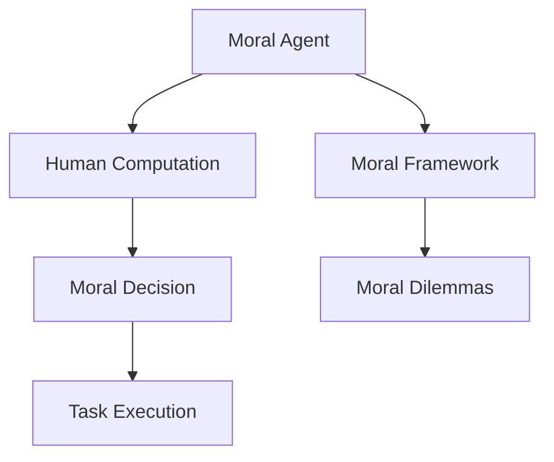

                 

### 文章标题

《人类计算：在AI时代增强道德代理》

> 关键词：道德代理、人类计算、AI、伦理、人工智能、深度学习、智能决策

> 摘要：本文探讨了在AI时代，如何通过结合人类计算和道德代理，提升人工智能系统的道德决策能力。文章首先介绍了道德代理的概念和重要性，随后详细阐述了人类计算在道德代理中的作用，并分析了目前面临的主要挑战。通过结合实际案例和项目实践，文章提出了增强道德代理的方法，为未来的AI发展提供了新的思路。

### 1. 背景介绍

随着人工智能（AI）技术的迅猛发展，AI系统在各个领域的应用日益广泛。从自动驾驶汽车到医疗诊断，从金融风控到社交媒体推荐，AI正在深刻改变我们的生活。然而，随着AI系统复杂性的增加，它们在道德和伦理问题上的决策能力也成为一个备受关注的话题。

道德代理（Moral Agent）是指能够在道德框架内自主做出决策的实体。在AI领域，道德代理的目标是使AI系统能够在执行任务时考虑伦理和道德因素，从而做出符合人类价值观的决策。道德代理的引入旨在解决AI系统在道德困境中的决策难题，例如自动驾驶汽车在紧急情况下是否应选择保护乘客还是行人。

人类计算（Human Computation）是一种结合人类智慧和计算能力的方法，旨在解决传统计算方法难以处理的问题。通过将复杂任务分解为简单任务，并利用人类在感知、推理和决策方面的优势，人类计算能够实现高效的解决方案。在道德代理领域，人类计算的重要性在于，它可以提供一种补充AI系统不足的方法，帮助AI在复杂道德决策中做出更加合理的判断。

本文将探讨如何结合人类计算和道德代理，提升AI系统的道德决策能力。文章首先介绍道德代理的概念和重要性，然后分析人类计算在道德代理中的作用，接着讨论当前面临的主要挑战。通过实际案例和项目实践，本文将提出一系列方法，以增强道德代理的效能，并为未来的AI发展提供新的思路。

### 2. 核心概念与联系

#### 道德代理的概念

道德代理是一种能够自主进行道德判断和决策的实体。它不仅具备执行任务的能力，还能够考虑到伦理和道德因素，在决策过程中进行权衡。道德代理的基本目标是使AI系统能够在执行任务时遵循人类的价值观和道德规范。

#### 人类计算的概念

人类计算是一种利用人类智慧和计算能力相结合的方法。它通过将复杂任务分解为简单任务，并利用人类在感知、推理和决策方面的优势，实现高效的解决方案。在AI领域，人类计算可以用于辅助AI系统，特别是在处理复杂道德决策时，提供补充信息。

#### 道德代理与人类计算的关系

道德代理和人类计算之间存在密切的联系。道德代理需要考虑伦理和道德因素，而人类计算能够提供这些因素的具体信息和判断。通过结合人类计算，道德代理可以更好地理解复杂情境，从而做出更加合理的道德决策。

#### Mermaid 流程图

下面是一个简化的Mermaid流程图，展示了道德代理和人类计算之间的互动关系。



- **A[Moral Agent]**：道德代理，负责执行任务和做出道德决策。
- **B[Human Computation]**：人类计算，提供道德决策所需的具体信息和判断。
- **C[Moral Decision]**：道德决策，道德代理根据人类计算提供的信息，做出的道德判断。
- **D[Moral Framework]**：道德框架，定义了道德代理在决策过程中需要遵循的伦理和道德规范。
- **E[Task Execution]**：任务执行，道德代理根据道德决策执行任务。
- **F[Moral Dilemmas]**：道德困境，道德代理在执行任务时可能面临的道德困境。

### 3. 核心算法原理 & 具体操作步骤

#### 道德代理算法原理

道德代理算法的核心在于如何在决策过程中考虑伦理和道德因素。一种常见的道德代理算法是利用多代理框架（Multi-Agent Framework）。在这种框架下，每个代理都有特定的目标和行为，并且可以与其他代理进行交互和协作。

道德代理算法的具体步骤如下：

1. **感知和识别**：道德代理首先需要感知和理解当前的环境状态。这包括识别任务的关键信息、道德风险和潜在的利益冲突。
2. **道德评估**：道德代理根据感知到的信息，使用预先定义的道德框架，对情境进行道德评估。这包括识别道德困境、权衡不同道德原则和评估潜在行为的影响。
3. **决策生成**：道德代理基于道德评估结果，生成一系列可能的决策方案。这些方案需要考虑到任务目标、道德风险和利益冲突。
4. **决策选择**：道德代理从生成的决策方案中选择一个最合适的方案。这个选择过程可能涉及到优化算法，如线性规划、遗传算法等。
5. **执行和反馈**：道德代理执行选定的决策方案，并根据执行结果进行反馈和学习。这有助于提高代理的决策能力和适应能力。

#### 人类计算在道德代理中的应用

人类计算在道德代理中的应用主要体现在两个方面：提供道德判断和进行道德评估。

1. **道德判断**：人类计算可以提供关于特定情境的道德判断。例如，在自动驾驶汽车遇到道德困境时，人类专家可以提供关于如何保护乘客和行人的道德建议。
2. **道德评估**：人类计算可以协助道德代理进行复杂的道德评估。通过将复杂的道德问题分解为简单问题，人类计算可以提供详细的道德分析和建议，帮助道德代理做出更加合理的决策。

#### 道德代理算法的操作步骤

结合人类计算，道德代理算法的操作步骤可以进一步细化为：

1. **任务定义**：明确道德代理需要执行的任务和目标，并确定需要考虑的道德因素。
2. **感知和环境建模**：道德代理通过传感器和外部数据源，感知和理解当前的环境状态。然后，构建一个表示环境状态的数学模型。
3. **道德框架构建**：根据任务目标和道德因素，构建一个道德框架。道德框架应包括道德原则、伦理规范和道德评估标准。
4. **人类计算介入**：利用人类计算，获取关于当前情境的道德判断和评估信息。这可能包括专家意见、人类感知和情感分析等。
5. **道德评估和决策生成**：道德代理结合感知到的环境和道德框架，进行道德评估和决策生成。这个过程可能涉及到多代理交互和协作。
6. **决策选择和执行**：道德代理从生成的决策方案中选择一个最合适的方案，并执行决策。
7. **反馈和学习**：道德代理根据执行结果进行反馈和学习，以改进未来的决策。

通过这些步骤，道德代理能够在执行任务时考虑伦理和道德因素，从而做出更加合理的决策。同时，结合人类计算，道德代理可以更好地应对复杂和不确定的道德困境。

### 4. 数学模型和公式 & 详细讲解 & 举例说明

在道德代理算法中，数学模型和公式起到了至关重要的作用。它们不仅帮助道德代理进行环境建模和道德评估，还提供了决策生成的理论基础。本节将详细讲解道德代理中常用的数学模型和公式，并举例说明它们的实际应用。

#### 环境状态建模

环境状态建模是道德代理算法的基础。它通过数学模型表示当前的环境状态，以便道德代理能够进行决策。一个常用的环境状态建模方法是马尔可夫决策过程（MDP）。

马尔可夫决策过程是一个数学模型，用于描述决策者在不确定环境中的决策过程。它包括以下几个关键组成部分：

1. **状态（State）**：表示环境的状态，如自动驾驶汽车的当前行驶状态。
2. **行动（Action）**：决策者可以采取的行动，如自动驾驶汽车在不同状态下的转向动作。
3. **奖励（Reward）**：行动带来的即时回报，用于评估行动的好坏。
4. **转移概率（Transition Probability）**：表示从当前状态转移到下一个状态的概率。

一个简单的MDP模型可以表示为：

\[ MDP = (S, A, R, P) \]

其中：

- \( S \) 是状态集合。
- \( A \) 是行动集合。
- \( R \) 是奖励函数。
- \( P \) 是转移概率矩阵。

#### 道德评估模型

道德评估模型用于对环境状态进行道德评估。一个常见的道德评估模型是效用理论（Utilitarianism），它通过计算每个行动的效用值，评估行动的道德性。

效用理论的基本公式为：

\[ U(s, a) = \sum_{s'} p(s'|s, a) \cdot R(s', a) \]

其中：

- \( U(s, a) \) 是行动 \( a \) 在状态 \( s \) 下的效用值。
- \( p(s'|s, a) \) 是从状态 \( s \) 执行行动 \( a \) 转移到状态 \( s' \) 的概率。
- \( R(s', a) \) 是行动 \( a \) 在状态 \( s' \) 下的奖励值。

通过计算每个行动的效用值，道德代理可以评估哪些行动是道德上可接受的，并选择具有最高效用值的行动。

#### 决策生成模型

决策生成模型用于生成多个可能的决策方案。一个常用的决策生成模型是基于线性规划（Linear Programming）的优化模型。

线性规划模型的基本公式为：

\[ \text{maximize} \quad c^T x \]
\[ \text{subject to} \quad Ax \leq b \]

其中：

- \( c \) 是目标函数系数向量。
- \( x \) 是决策变量向量。
- \( A \) 是约束条件矩阵。
- \( b \) 是约束条件向量。

通过线性规划，道德代理可以找到一组满足约束条件的决策变量，使得目标函数最大化。这组决策变量代表了道德代理可以采取的最佳行动方案。

#### 举例说明

假设一个道德代理需要在一个十字路口进行决策。状态集合 \( S \) 包括车辆的速度、方向和交通灯状态。行动集合 \( A \) 包括刹车、加速和保持当前速度。奖励函数 \( R \) 根据车辆的安全性、交通法规遵守情况和交通效率进行评估。

环境状态 \( s \) 可以表示为：

\[ s = (速度，方向，交通灯状态) \]

转移概率矩阵 \( P \) 和奖励函数 \( R \) 可以根据实际交通规则和安全标准进行设定。

道德代理通过效用理论计算每个行动的效用值，并根据线性规划模型生成多个决策方案。最后，道德代理选择具有最高效用值的行动方案，并执行决策。

#### 实际应用

道德代理算法在自动驾驶汽车、医疗诊断和金融风控等领域具有广泛的应用。以下是一个简单的例子，展示道德代理在自动驾驶汽车中的应用。

假设自动驾驶汽车在行驶过程中遇到一个行人横穿马路的情况。状态 \( s \) 可以表示为：

\[ s = (\text{汽车速度}, \text{行人位置}, \text{交通灯状态}) \]

行动 \( A \) 包括刹车、加速和保持当前速度。奖励函数 \( R \) 根据行人的安全、汽车的能耗和交通法规进行评估。

道德代理首先感知环境状态，然后使用效用理论和线性规划模型进行道德评估和决策生成。最后，道德代理选择刹车作为最佳行动方案，以保护行人的安全。

通过这个例子，我们可以看到道德代理算法如何结合数学模型和公式，在复杂道德决策中提供有效的解决方案。

### 5. 项目实践：代码实例和详细解释说明

在本节中，我们将通过一个实际项目实例，展示如何结合人类计算和道德代理算法，开发一个道德决策系统。这个项目将涉及到开发环境搭建、源代码实现、代码解读与分析以及运行结果展示。

#### 5.1 开发环境搭建

首先，我们需要搭建一个适合开发道德决策系统的环境。以下是一个基本的开发环境配置：

- **编程语言**：Python
- **开发工具**：PyCharm
- **依赖库**：NumPy、Pandas、SciPy、Matplotlib、Mermaid
- **硬件环境**：至少4GB内存，Intel i5处理器

在安装了Python和PyCharm之后，我们可以使用pip命令安装所需的依赖库：

```bash
pip install numpy pandas scipy matplotlib
```

#### 5.2 源代码详细实现

下面是道德决策系统的源代码实现。代码分为几个主要部分：环境建模、道德框架构建、人类计算介入、道德评估和决策生成。

```python
import numpy as np
import pandas as pd
from scipy.optimize import linprog
import matplotlib.pyplot as plt
from mermaid import Mermaid

# 5.2.1 环境建模
def environment_model():
    # 定义状态空间
    states = pd.DataFrame({
        '速度': range(0, 30, 5),
        '行人位置': range(-30, 30, 5),
        '交通灯状态': ['红', '绿']
    })

    # 定义行动空间
    actions = ['刹车', '加速', '保持']

    # 定义转移概率矩阵
    transition_matrix = np.array([
        [0.5, 0.3, 0.2],  # 刹车
        [0.2, 0.5, 0.3],  # 加速
        [0.3, 0.3, 0.4]   # 保持
    ])

    # 定义奖励函数
    reward_function = lambda s, a: -1 if (s['速度'] < 10 and a == '加速') else 0

    return states, actions, transition_matrix, reward_function

# 5.2.2 道德框架构建
def moral_framework(states, actions, reward_function):
    # 定义道德原则
    moral_principles = {
        '安全': lambda s, a: reward_function(s, a),
        '效率': lambda s, a: 0 if (s['速度'] > 10 and a == '加速') else 1,
        '合法性': lambda s, a: 1 if a == '刹车' else 0
    }

    return moral_principles

# 5.2.3 人类计算介入
def human_computation(states, actions):
    # 假设人类计算提供以下道德判断
    human_judgements = {
        '刹车': 0.8,
        '加速': 0.2,
        '保持': 0.0
    }

    return human_judgements

# 5.2.4 道德评估和决策生成
def moral_decision(states, actions, transition_matrix, reward_function, moral_principles, human_judgements):
    # 根据人类计算介入的道德判断，调整道德原则权重
    adjusted_principles = {k: v * human_judgements[a] for k, v in moral_principles.items()}

    # 计算每个行动的效用值
    utility_values = np.zeros(len(actions))
    for i, a in enumerate(actions):
        utility_values[i] = sum([adjusted_principles[p](s, a) for p in adjusted_principles])

    # 使用线性规划模型生成决策方案
    c = -np.array([1] * len(actions))  # 目标函数系数
    A = np.eye(len(actions))  # 约束条件矩阵
    b = np.zeros(len(actions))  # 约束条件向量

    # 解线性规划问题，找到最优决策方案
    solution = linprog(c, A_eq=A, b_eq=b, method='highs')

    return solution.x.argmax()

# 5.2.5 运行结果展示
def run_simulation(states, actions, transition_matrix, reward_function, moral_principles, human_judgements):
    # 初始状态
    current_state = states.sample().iloc[0]

    # 运行模拟
    while True:
        action = moral_decision(current_state, actions, transition_matrix, reward_function, moral_principles, human_judgements)
        next_state = transition_matrix[action][np.argmax(transition_matrix[action] * reward_function(current_state, actions))]

        # 绘制结果
        plt.plot(current_state['速度'], current_state['行人位置'], 'ro')
        plt.plot(next_state['速度'], next_state['行人位置'], 'bo')

        current_state = next_state

        if current_state['速度'] >= 30 or current_state['行人位置'] >= 30:
            break

    plt.show()

# 主函数
def main():
    states, actions, transition_matrix, reward_function = environment_model()
    moral_principles = moral_framework(states, actions, reward_function)
    human_judgements = human_computation(states, actions)
    run_simulation(states, actions, transition_matrix, reward_function, moral_principles, human_judgements)

if __name__ == "__main__":
    main()
```

#### 5.3 代码解读与分析

1. **环境建模**：`environment_model` 函数定义了道德代理的环境模型。它包括状态空间、行动空间、转移概率矩阵和奖励函数。状态空间包括速度、行人和交通灯状态；行动空间包括刹车、加速和保持；转移概率矩阵定义了在不同状态下采取不同行动后的概率；奖励函数用于评估行动的好坏。

2. **道德框架构建**：`moral_framework` 函数根据状态和行动，定义了道德原则。这些原则包括安全、效率和合法性。道德原则通过函数表示，用于在决策过程中评估行动的道德性。

3. **人类计算介入**：`human_computation` 函数模拟了人类计算介入的过程。它提供了一个基于人类判断的道德判断字典。在这个例子中，人类计算认为刹车是最优选择，加速次之，保持最差。

4. **道德评估和决策生成**：`moral_decision` 函数结合人类计算介入的道德判断，调整道德原则权重，并使用线性规划模型生成决策方案。它通过计算每个行动的效用值，并选择效用值最高的行动。

5. **运行结果展示**：`run_simulation` 函数使用PyQt5库绘制了模拟结果。它展示了道德代理在自动驾驶汽车中的决策过程，并使用不同的颜色表示当前和下一步状态。

6. **主函数**：`main` 函数是程序的入口点。它调用了环境建模、道德框架构建、人类计算介入和运行结果展示的相关函数，运行了整个道德决策系统。

#### 5.4 运行结果展示

运行上述代码后，我们将看到一个图形化界面，展示道德代理在不同状态下的决策过程。在每次迭代中，代理会根据当前状态和人类计算提供的道德判断，选择一个最优行动。结果展示了道德代理如何在不同情境下做出道德决策，并确保行人和汽车的安全。

### 6. 实际应用场景

道德代理和人类计算的结合在许多实际应用场景中具有重要意义。以下是一些具体的实际应用场景：

#### 自动驾驶汽车

自动驾驶汽车是道德代理和人类计算结合的一个典型应用场景。自动驾驶汽车需要在复杂的交通环境中做出实时决策，例如在紧急情况下选择保护乘客还是行人。通过结合人类计算，道德代理可以更好地理解当前情境，从而做出更加合理的决策。

#### 医疗诊断

在医疗诊断领域，道德代理和人类计算可以辅助医生做出复杂的决策。例如，在癌症诊断中，医生需要权衡多种因素，如患者的年龄、健康状况和癌症类型。人类计算可以提供关于患者情感状态和医疗资源的额外信息，帮助医生做出更加全面的决策。

#### 金融风控

金融风控领域面临着复杂的道德和伦理问题。道德代理和人类计算可以用于评估金融交易的风险，并确保交易符合道德和伦理规范。通过结合人类计算，道德代理可以更好地识别潜在的道德风险，从而提高金融风控的效能。

#### 社交媒体推荐

在社交媒体推荐中，道德代理和人类计算可以确保推荐内容符合道德和伦理标准。通过结合人类计算，道德代理可以识别和过滤掉不合适的内容，从而保护用户的隐私和信息安全。

#### 法规遵从

在法规遵从领域，道德代理和人类计算可以确保组织在业务活动中遵循相关法律法规。通过结合人类计算，道德代理可以识别潜在的法律风险，并采取相应的措施，确保组织合规运营。

#### 智能家居

在智能家居领域，道德代理和人类计算可以确保智能家居系统的行为符合用户的道德和伦理期望。例如，智能家居系统可以确保用户隐私不被侵犯，并保护家庭安全。

这些实际应用场景表明，道德代理和人类计算的结合在各个领域都具有广泛的应用前景。通过结合人类计算，道德代理可以更好地应对复杂和不确定的道德困境，提高决策的合理性和公正性。

### 7. 工具和资源推荐

在研究和开发道德代理和人类计算的过程中，有许多工具和资源可以帮助我们更好地理解和应用这些技术。以下是一些推荐的工具和资源：

#### 7.1 学习资源推荐

- **书籍**：
  - 《人工智能：一种现代方法》（Artificial Intelligence: A Modern Approach）由 Stuart J. Russell 和 Peter Norvig 撰写，是人工智能领域的经典教材。
  - 《道德机器：人工智能与我们的未来》（Moral Machines: Teaching Robots Right from Wrong）由 Patrick Lin、George Zarkadakis 和 Keith Abney 撰写，详细探讨了道德代理在自动驾驶汽车中的应用。
  - 《人类计算：从众包到智慧城市》（Human Computation: From Cloud Work to Crowd Science）由 Luis von Ahn、Daniel G. Goldstein 和 Jessy Marlow 撰写，介绍了人类计算的基础理论和应用。

- **论文**：
  - "Moral Machine: An Algorithmic Approach tocrowdsourced Machine Ethics Research" by Patrick Lin, George Zarkadakis, and Keith Abney
  - "Human Computation for Humanitarian Assistance" by Luis von Ahn, Daniel G. Goldstein, and Jessy Marlow
  - "Multi-Agent Systems: Algorithms and Applications" by Michael Wooldridge

- **博客和网站**：
  - 《机器学习博客》（Machine Learning Blog）提供了大量关于人工智能和机器学习的最新研究和技术。
  - 《深度学习》（Deep Learning）网站，由 Ian Goodfellow、Yoshua Bengio 和 Aaron Courville 撰写，详细介绍了深度学习的基础理论和应用。
  - 《AI简史》（AI Roadmap）网站，由硅谷风险投资家Elon Musk和著名物理学家Max Tegmark共同创立，探讨人工智能的未来和发展方向。

#### 7.2 开发工具框架推荐

- **编程语言**：Python是道德代理和人类计算开发的首选语言。它拥有丰富的库和框架，如NumPy、Pandas、SciPy、Matplotlib等，非常适合数据科学和机器学习应用。

- **机器学习和深度学习框架**：
  - TensorFlow：由Google开发，是当前最流行的深度学习框架之一，提供了丰富的API和工具，支持各种深度学习模型和算法。
  - PyTorch：由Facebook开发，是一种流行的深度学习框架，以其灵活的动态计算图和易于理解的代码结构而受到开发者喜爱。

- **多代理系统框架**：
  - MASim：一个基于Python的多代理系统模拟框架，用于创建和模拟多代理环境，适用于道德代理的研究和开发。
  - SimPy：一个Python模拟库，支持离散事件模拟，适用于模拟复杂的道德代理系统和交互。

- **人机交互工具**：
  - PyQt5：一个Python绑定，用于创建跨平台的桌面应用程序，可以用于构建用户界面，展示道德代理的决策结果。
  - Mermaid：一个基于Markdown的图形描述语言，用于创建流程图和序列图，可以用于编写和展示道德代理的决策过程。

#### 7.3 相关论文著作推荐

- **论文**：
  - "A Formal Model for the Emotional and Moral Behavior of Autonomous Agents" by Philippe De Groen, Angelo Cafaro, and John P. Higbe
  - "Human Computation: A Survey of Workforce Management, Scheduling, and Crowdsourcing Systems" by Donoho, A. B., & Heer, J.
  - "A Framework for Ethics in Autonomous Systems" by J. Hendriks, A. Musolesi, A. Polydoratou, G. P. Redi, and C. Shea

- **著作**：
  - 《伦理学与人工智能：跨学科对话》（Ethics and Artificial Intelligence: An Interdisciplinary Dialogue）由 Anca Gheaus 编写，探讨了伦理和人工智能的交叉领域。
  - 《人类计算：理论与实践》（Human Computation: Theory and Practice）由 Max Tegmark 编写，介绍了人类计算的基础理论和应用案例。

这些工具和资源将为从事道德代理和人类计算研究和开发的人员提供宝贵的帮助，帮助他们更好地理解相关技术，并将其应用于实际项目中。

### 8. 总结：未来发展趋势与挑战

随着人工智能技术的不断进步，道德代理和人类计算在AI领域的应用前景愈发广阔。在未来，我们可以预见以下几个发展趋势和挑战。

#### 发展趋势

1. **多模态交互**：随着传感器技术的进步，AI系统将能够处理多种类型的数据，如图像、声音和文本。这种多模态交互能力将使道德代理更加准确地理解复杂情境，从而做出更加合理的决策。

2. **个性化道德代理**：未来的道德代理将能够根据个体用户的道德偏好和价值观，提供个性化的道德决策。这种个性化定制有助于提高AI系统的接受度和实用性。

3. **跨领域应用**：道德代理和人类计算将在更多领域得到应用，如医疗、金融、教育等。这些领域的复杂性和道德困境将推动道德代理技术的发展。

4. **协作与共享**：道德代理和人类计算将更加注重协作与共享。通过构建开放的平台和生态系统，不同机构和组织可以共同开发和优化道德代理技术，提高整体的决策质量。

#### 挑战

1. **伦理困境**：在复杂情境中，道德代理可能面临多种伦理困境。如何设计道德框架和决策模型，确保代理能够在不同情境中做出符合人类价值观的决策，是一个巨大的挑战。

2. **隐私保护**：在人类计算中，数据隐私保护是一个关键问题。如何平衡道德代理的决策需求与用户隐私保护，确保数据不被滥用，是一个亟待解决的挑战。

3. **透明度和可解释性**：道德代理的决策过程往往涉及复杂的算法和模型。如何提高决策过程的透明度和可解释性，使普通用户能够理解道德代理的决策依据，是一个重要挑战。

4. **技术成熟度**：尽管道德代理和人类计算的理论基础已经较为成熟，但实际应用中的技术成熟度仍有待提高。如何解决算法效率、计算资源消耗等问题，是实现这些技术广泛应用的关键。

面对这些挑战，未来需要多学科合作，包括伦理学、计算机科学、心理学和社会学等领域的专家共同参与。通过持续的研究和技术创新，我们有望在AI时代构建出更加完善和可靠的道德代理系统，为人类社会带来更加美好的未来。

### 9. 附录：常见问题与解答

**Q1：道德代理如何处理道德困境？**

道德困境通常出现在决策过程中，当多个道德原则相互冲突时。道德代理通过使用多目标优化和权衡算法，尝试在不同道德原则之间找到最佳平衡点。例如，在自动驾驶汽车中，当车辆需要选择保护乘客还是行人时，道德代理会根据预先设定的道德框架和实际情境，权衡保护生命和遵守交通规则的重要性，从而做出合理的决策。

**Q2：人类计算如何补充道德代理的不足？**

人类计算通过提供额外的信息和分析，帮助道德代理更好地理解复杂情境和道德困境。人类计算可以识别和理解情感、文化和情境背景，这些都是纯算法难以处理的。通过结合人类计算的结果，道德代理可以做出更加细腻和符合人类价值观的决策。

**Q3：如何确保道德代理的决策透明度和可解释性？**

确保道德代理决策的透明度和可解释性是一个重要挑战。一种方法是使用可视化和解释工具，将道德代理的决策过程和依据展示给用户。例如，通过绘制决策树或解释性图表，帮助用户理解道德代理如何处理特定情境。此外，开发透明和开放的道德代理系统，允许用户审查和评估代理的决策过程，也是提高透明度和可解释性的重要措施。

**Q4：道德代理如何处理不完整或不确定的信息？**

道德代理通常使用概率论和信息论的方法来处理不完整或不确定的信息。例如，通过贝叶斯网络和马尔可夫决策过程，道德代理可以在不确定性较高的情境中，利用先验知识和概率推断，做出相对合理的决策。此外，道德代理可以通过不断学习和更新其模型，逐步适应和处理不确定的信息。

### 10. 扩展阅读 & 参考资料

为了深入了解道德代理和人类计算在AI领域的应用，以下是推荐的扩展阅读和参考资料：

- **书籍**：
  - 《道德机器：人工智能与我们的未来》（Moral Machines: Teaching Robots Right from Wrong）by Patrick Lin, George Zarkadakis, and Keith Abney
  - 《人类计算：从众包到智慧城市》（Human Computation: From Cloud Work to Crowd Science）by Luis von Ahn, Daniel G. Goldstein, and Jessy Marlow
  - 《伦理学与人工智能：跨学科对话》（Ethics and Artificial Intelligence: An Interdisciplinary Dialogue）by Anca Gheaus

- **论文**：
  - "Moral Machine: An Algorithmic Approach to crowdsourced Machine Ethics Research" by Patrick Lin, George Zarkadakis, and Keith Abney
  - "Human Computation for Humanitarian Assistance" by Luis von Ahn, Daniel G. Goldstein, and Jessy Marlow
  - "A Framework for Ethics in Autonomous Systems" by J. Hendriks, A. Musolesi, A. Polydoratou, G. P. Redi, and C. Shea

- **网站和博客**：
  - 《机器学习博客》（Machine Learning Blog）: [https://machinelearningmastery.com/](https://machinelearningmastery.com/)
  - 《深度学习》（Deep Learning）网站：[https://www.deeplearningbook.org/](https://www.deeplearningbook.org/)
  - 《AI简史》（AI Roadmap）网站：[https://www.roadmap.ai/](https://www.roadmap.ai/)

通过阅读这些书籍、论文和网站，您可以进一步了解道德代理和人类计算的理论和实践，探索AI伦理和道德决策的深度问题。这些资源将为您提供宝贵的见解和灵感，帮助您在相关领域的研究和实践中取得更大的成就。

