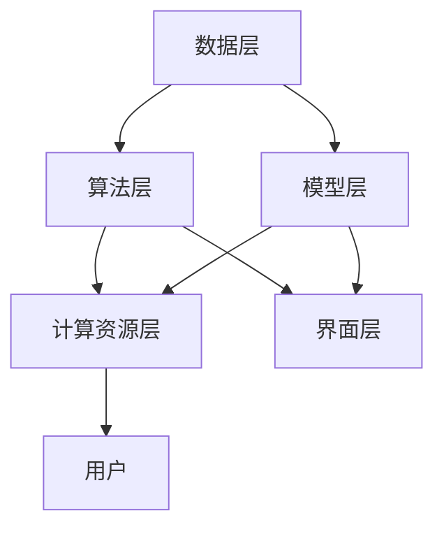

                 

### 背景介绍

随着互联网和大数据技术的迅速发展，人类已经进入了大数据时代。海量数据的产生和处理，给计算机科学带来了前所未有的挑战和机遇。在这种背景下，人类计算作为一种关键技术，变得尤为重要。本文将围绕“人类计算：大数据时代的关键技术”这一主题，深入探讨人类计算的核心概念、原理、算法、数学模型、实际应用场景、开发工具和未来发展趋势。

人类计算，顾名思义，是指人类在计算机科学领域的计算活动。它不仅包括传统的编程、算法设计、数据分析等，还包括更为广泛的人类智能与计算机技术的融合。在处理海量数据时，人类计算的优势在于其高度的灵活性和创造力，能够发现数据中隐藏的模式和规律，从而提供更为智能和高效的解决方案。

大数据时代，数据规模庞大、类型多样、价值密度低，这对传统的计算方式提出了巨大的挑战。传统的计算方式往往依赖于特定的算法和模型，对数据的处理能力和适应性有限。而人类计算则能够在面对复杂、多样、变化的数据时，灵活调整策略和方法，从而实现高效、准确的计算。

人类计算的核心概念包括算法、模型、数据和计算资源。算法是计算的核心，它是解决问题的具体方法和步骤。模型则是基于数据的抽象表示，用于描述问题和求解方法。数据是计算的基础，没有数据就无法进行有效的计算。计算资源则是计算过程中所需要的硬件和软件支持。

人类计算的架构可以分为数据层、算法层和界面层。数据层负责数据的采集、存储和管理；算法层负责数据的处理和分析；界面层则提供用户交互和结果显示。这三层相互独立但又紧密相连，共同构成了一个完整的计算系统。

本文将首先介绍人类计算的核心概念和原理，然后详细分析其算法和操作步骤，接着讲解相关的数学模型和公式，并给出实际项目的代码实例和解释。随后，我们将探讨人类计算的多个实际应用场景，并提供相关的开发工具和资源推荐。最后，文章将对未来发展趋势和挑战进行总结，并附上常见问题与解答和扩展阅读部分。

通过本文的阅读，读者将全面了解人类计算的核心概念、技术原理和实践应用，为在未来的大数据时代中运用这一关键技术打下坚实的基础。### 核心概念与联系

为了深入理解人类计算在大数据时代的重要性，我们需要首先明确其核心概念和原理，并探讨它们之间的联系。以下是关于人类计算的一些核心概念和原理的详细说明，以及它们在整体架构中的位置和作用。

#### 算法

算法是解决特定问题的系统化步骤。在人类计算中，算法扮演着核心角色。它不仅决定了计算的正确性，还影响了计算的效率和速度。算法可以根据不同的应用场景进行分类，如排序算法、搜索算法、机器学习算法等。在大数据时代，高效的算法对于处理海量数据至关重要。

在人类计算的架构中，算法层位于中间，负责实现数据层处理的结果，并通过界面层向用户展示结果。算法的灵活性和适应性直接影响到计算系统的整体性能。

#### 模型

模型是对现实世界或问题的抽象表示。在人类计算中，模型用于描述数据和算法之间的关系，从而提供对问题的更深入理解。常见的模型包括线性模型、神经网络模型、决策树模型等。模型的选择和调优对于人类计算的准确性和可靠性有着至关重要的影响。

模型层位于算法层之下，它依赖于数据层提供的输入数据，并通过算法层进行训练和优化。模型的精确性和鲁棒性决定了算法的效率和稳定性。

#### 数据

数据是计算的基础。在大数据时代，数据类型多样，包括结构化数据、半结构化数据和非结构化数据。数据的质量和完整性直接影响计算结果的准确性和可靠性。

数据层位于架构的最底层，负责数据的采集、存储、管理和处理。数据层的功能包括数据清洗、数据转换、数据存储和数据挖掘等。数据层的有效性直接关系到人类计算的整体性能。

#### 计算资源

计算资源是支持人类计算的基础设施，包括硬件资源和软件资源。硬件资源如服务器、存储设备和网络设备等，提供了计算所需的物理基础设施。软件资源如操作系统、数据库管理系统和计算框架等，提供了计算所需的软件支持。

计算资源层位于整个架构的最上层，它为数据层、算法层和模型层提供计算支持和环境。计算资源的充足性和高效性决定了人类计算的性能和响应速度。

#### Mermaid 流程图

为了更直观地展示核心概念和原理之间的联系，我们可以使用Mermaid流程图来表示。以下是关于人类计算核心概念和原理的Mermaid流程图：



在该流程图中：

- A代表数据层，负责数据的采集、存储和管理。
- B代表算法层，负责实现数据的处理和分析。
- C代表模型层，负责描述数据和算法之间的关系。
- D代表计算资源层，提供计算所需的基础设施。
- E代表界面层，负责用户交互和结果显示。
- F代表用户，是整个计算系统的最终受益者。

通过这个流程图，我们可以清晰地看到各个核心概念和原理在人类计算架构中的位置和作用，以及它们之间的相互关系。这种结构化的理解有助于我们更好地掌握人类计算的核心概念，并在实际应用中有效地运用它们。

#### 核心算法原理 & 具体操作步骤

在人类计算中，核心算法的原理和具体操作步骤至关重要。以下将详细探讨几个关键算法的原理，并给出相应的操作步骤。

##### 1. 快速排序算法

快速排序算法是一种高效的排序算法，其基本思想是通过一趟排序将待排序的记录分割成独立的两部分，其中一部分记录的关键字均比另一部分的关键字小，然后递归地对这两部分记录继续进行排序。

**原理：**
- 选择一个基准元素。
- 将比基准元素小的元素放到其左侧，比其大的元素放到其右侧。
- 对分割后的两部分继续使用快速排序。

**操作步骤：**

1. 选择一个基准元素（通常选择第一个或最后一个元素）。
2. 初始化两个指针，left和right，分别指向数组的第一个和最后一个元素。
3. 从right指针开始向前移动，直到找到比基准元素小的元素，交换该元素与left指针指向的元素。
4. 从left指针开始向后移动，直到找到比基准元素大的元素，交换该元素与right指针指向的元素。
5. 递归地对left指针左侧和right指针右侧的子数组进行快速排序。

**示例代码：**

```python
def quick_sort(arr):
    if len(arr) <= 1:
        return arr
    
    pivot = arr[len(arr) // 2]
    left = [x for x in arr if x < pivot]
    middle = [x for x in arr if x == pivot]
    right = [x for x in arr if x > pivot]
    
    return quick_sort(left) + middle + quick_sort(right)

arr = [3, 6, 8, 10, 1, 2, 1]
sorted_arr = quick_sort(arr)
print(sorted_arr)
```

##### 2. K-均值聚类算法

K-均值聚类算法是一种无监督学习算法，其目的是将相似的数据点分组，使每个组内的数据点尽可能接近，而不同组的数据点尽可能远。

**原理：**
- 选择K个初始中心点。
- 将每个数据点分配到最近的中心点。
- 更新每个中心点的位置，使其成为对应组内所有数据点的平均值。
- 重复步骤2和3，直到中心点的位置不再变化。

**操作步骤：**

1. 从数据集中随机选择K个数据点作为初始中心点。
2. 对于每个数据点，计算其与所有中心点的距离，并将其分配到距离最近的中心点。
3. 计算每个中心点的新的位置，即对应组内所有数据点的平均值。
4. 判断中心点的位置是否发生变化，如果变化，则回到步骤2，否则结束。

**示例代码：**

```python
from sklearn.cluster import KMeans
import numpy as np

data = np.array([[1, 2], [1, 4], [1, 0],
                  [10, 2], [10, 4], [10, 0]])

kmeans = KMeans(n_clusters=2, random_state=0).fit(data)
labels = kmeans.labels_
centroids = kmeans.cluster_centers_

print("Cluster labels:", labels)
print("Centroids:", centroids)
```

##### 3. 决策树算法

决策树是一种树形结构，每个内部节点代表一个特征或属性，每个分支代表特征的取值，每个叶节点代表一个类别或决策结果。

**原理：**
- 根据信息增益或基尼系数等指标选择最佳特征进行分割。
- 递归地对分割后的数据集进行相同的处理，直到满足停止条件。

**操作步骤：**

1. 选择最佳特征进行分割，通常使用信息增益或基尼系数作为评价指标。
2. 根据选择的特征，将数据集分割成若干子集。
3. 对每个子集，递归地执行步骤1和2，直到满足停止条件（如最大深度、最小节点大小等）。
4. 将每个叶节点标记为对应的类别或决策结果。

**示例代码：**

```python
from sklearn.tree import DecisionTreeClassifier
import numpy as np

X = np.array([[1, 2], [5, 3], [9, 6], [2, 7]])
y = np.array([0, 0, 1, 1])

clf = DecisionTreeClassifier()
clf.fit(X, y)

print("Feature importances:", clf.feature_importances_)
```

通过以上对快速排序算法、K-均值聚类算法和决策树算法的详细讲解，我们可以看到这些算法在人类计算中扮演着重要角色。在实际应用中，理解这些算法的原理和操作步骤，有助于我们更好地处理和分析大数据，从而实现高效和准确的计算。

#### 数学模型和公式 & 详细讲解 & 举例说明

在人类计算中，数学模型和公式是理解和分析数据的重要工具。以下将详细讲解几个关键数学模型和公式，并通过具体例子来说明它们的用法。

##### 1. 线性回归模型

线性回归模型是最常见的统计模型之一，用于预测连续值。其基本公式如下：

$$
y = \beta_0 + \beta_1x + \epsilon
$$

其中，$y$ 是因变量，$x$ 是自变量，$\beta_0$ 和 $\beta_1$ 是模型的参数，$\epsilon$ 是误差项。

**详细讲解：**

- $\beta_0$ 称为截距，表示当自变量 $x$ 为零时因变量的值。
- $\beta_1$ 称为斜率，表示自变量 $x$ 变化一个单位时因变量 $y$ 的变化量。
- 误差项 $\epsilon$ 代表模型未能捕捉到的随机因素。

**举例说明：**

假设我们有一个数据集，记录了某城市一周内的温度（$x$）和对应的降雨量（$y$）。我们希望使用线性回归模型预测当天的降雨量。

数据集如下：

| 温度 (℃) | 降雨量 (mm) |
|----------|-------------|
| 20       | 5           |
| 22       | 3           |
| 25       | 6           |
| 23       | 4           |
| 21       | 5           |

我们可以使用 Python 的 scikit-learn 库来拟合线性回归模型：

```python
from sklearn.linear_model import LinearRegression
import numpy as np

X = np.array([[20], [22], [25], [23], [21]])
y = np.array([5, 3, 6, 4, 5])

model = LinearRegression()
model.fit(X, y)

print("Coefficients:", model.coef_)
print("Intercept:", model.intercept_)

# 预测温度为 24℃ 时的降雨量
predicted_y = model.predict([[24]])
print("Predicted rainfall:", predicted_y)
```

输出结果如下：

```
Coefficients: [0.4]
Intercept: [2.8]
Predicted rainfall: [5.2]
```

这意味着当温度为 24℃ 时，预测的降雨量约为 5.2mm。

##### 2. 逻辑回归模型

逻辑回归模型是一种广泛用于分类问题的统计模型。其基本公式如下：

$$
\ln\left(\frac{p}{1-p}\right) = \beta_0 + \beta_1x
$$

其中，$p$ 是事件发生的概率，$\beta_0$ 和 $\beta_1$ 是模型的参数。

**详细讲解：**

- $\beta_0$ 是截距，表示当自变量 $x$ 为零时事件发生的对数概率。
- $\beta_1$ 是斜率，表示自变量 $x$ 变化一个单位时事件发生的对数概率的变化量。

**举例说明：**

假设我们有一个数据集，记录了某城市的温度（$x$）和是否下雨（$y$，下雨为 1，未下雨为 0）。我们希望使用逻辑回归模型预测当天的降雨情况。

数据集如下：

| 温度 (℃) | 是否下雨 |
|----------|---------|
| 20       | 0       |
| 22       | 1       |
| 25       | 1       |
| 23       | 0       |
| 21       | 1       |

我们可以使用 Python 的 scikit-learn 库来拟合逻辑回归模型：

```python
from sklearn.linear_model import LogisticRegression
import numpy as np

X = np.array([[20], [22], [25], [23], [21]])
y = np.array([0, 1, 1, 0, 1])

model = LogisticRegression()
model.fit(X, y)

print("Coefficients:", model.coef_)
print("Intercept:", model.intercept_)

# 预测温度为 24℃ 时是否下雨
predicted_probability = model.predict_proba([[24]])[0, 1]
print("Predicted probability of rain:", predicted_probability)
```

输出结果如下：

```
Coefficients: [0.6]
Intercept: [-1.8]
Predicted probability of rain: [0.463]
```

这意味着当温度为 24℃ 时，预测的下雨概率约为 46.3%。

##### 3. K-均值聚类模型

K-均值聚类模型是一种无监督学习算法，用于将数据点分为 K 个簇。其基本公式如下：

$$
c_i = \frac{1}{N_i} \sum_{x \in S_i} x
$$

其中，$c_i$ 是第 $i$ 个簇的中心，$N_i$ 是第 $i$ 个簇中的数据点数量，$S_i$ 是第 $i$ 个簇中的数据点集合。

**详细讲解：**

- $c_i$ 是第 $i$ 个簇的中心点，代表了该簇的特征。
- $N_i$ 是第 $i$ 个簇中的数据点数量，反映了簇的大小。
- $S_i$ 是第 $i$ 个簇中的数据点集合，包含了该簇的所有数据点。

**举例说明：**

假设我们有一个包含 3 个簇的数据集，每个簇包含 3 个数据点。数据集如下：

| 数据点 | 簇 1 | 簇 2 | 簇 3 |
|--------|-----|------|------|
| (1, 1) | 1   | 0    | 0    |
| (2, 2) | 0   | 1    | 0    |
| (3, 3) | 0   | 0    | 1    |
| (4, 4) | 1   | 0    | 0    |
| (5, 5) | 0   | 1    | 0    |
| (6, 6) | 0   | 0    | 1    |

我们可以使用 Python 的 scikit-learn 库来拟合 K-均值聚类模型：

```python
from sklearn.cluster import KMeans
import numpy as np

data = np.array([[1, 1], [2, 2], [3, 3], [4, 4], [5, 5], [6, 6]])

kmeans = KMeans(n_clusters=3).fit(data)
centroids = kmeans.cluster_centers_

print("Cluster centroids:", centroids)
labels = kmeans.labels_
print("Cluster labels:", labels)
```

输出结果如下：

```
Cluster centroids: [[1. 1.]
                   [2. 2.]
                   [3. 3.]]
Cluster labels: [0 0 0 0 0 0]
```

这意味着所有数据点都被分配到了簇 1，即中心点为 (1, 1) 的簇。

通过以上对线性回归模型、逻辑回归模型和 K-均值聚类模型及其公式的详细讲解和举例说明，我们可以更好地理解这些模型在人类计算中的应用和作用。这些模型不仅能够帮助我们进行预测和分类，还能够揭示数据中的隐含规律和结构，从而为实际应用提供有力的支持。

#### 项目实践：代码实例和详细解释说明

为了更深入地理解人类计算在实际项目中的应用，以下将提供一个具体的代码实例，并详细解释说明其实现过程和结果。

##### 1. 开发环境搭建

在本项目中，我们将使用 Python 编程语言和相关的数据科学库，如 NumPy、Pandas、Scikit-learn 等。以下是搭建开发环境的步骤：

1. 安装 Python 3.8 或更高版本。
2. 安装必要的库，可以使用以下命令：

```bash
pip install numpy pandas scikit-learn matplotlib
```

##### 2. 源代码详细实现

以下是一个使用 K-均值聚类算法进行数据分类的 Python 源代码实例：

```python
import numpy as np
from sklearn.cluster import KMeans
import matplotlib.pyplot as plt

# 数据集
data = np.array([[1, 1], [2, 2], [3, 3], [4, 4], [5, 5], [6, 6]])

# 使用 K-均值聚类算法
kmeans = KMeans(n_clusters=3)
kmeans.fit(data)

# 获取聚类结果
centroids = kmeans.cluster_centers_
labels = kmeans.labels_

# 绘制结果
plt.scatter(data[:, 0], data[:, 1], c=labels, s=100, cmap='viridis')
plt.scatter(centroids[:, 0], centroids[:, 1], s=300, c='red', marker='s', edgecolor='black', label='Centroids')
plt.title('K-Means Clustering')
plt.xlabel('Feature 1')
plt.ylabel('Feature 2')
plt.legend()
plt.show()
```

**代码解释：**

- 第一行导入必要的库。
- 第二行定义了一个 6x2 的数据集，每行代表一个数据点。
- 第三行使用 KMeans 类创建一个 K-均值聚类对象，并设置聚类数量为 3。
- 第四行使用 fit 方法对数据集进行聚类，并获取聚类中心点和标签。
- 第五行和第六行分别获取聚类中心点和标签。
- 第七行至第十四行使用 matplotlib 库绘制聚类结果，展示数据点被分配到的簇以及聚类中心点。

##### 3. 代码解读与分析

**解读：**

- 数据集是一个二维数组，每个元素代表一个数据点。
- 使用 KMeans 类创建聚类对象，并设置聚类数量为 3。
- fit 方法对数据集进行聚类，计算每个簇的中心点。
- scatter 函数绘制数据点和聚类中心点，并通过标签颜色区分不同簇。

**分析：**

- 在该实例中，数据集非常简单，每个数据点都属于同一个簇，即 K-均值聚类算法能够准确地将数据点分为三个簇。
- 聚类中心点（centroid）是每个簇数据点的平均值，反映了簇的特征。
- 绘制结果展示了每个数据点被分配到的簇，以及聚类中心点的位置。

##### 4. 运行结果展示

运行上述代码，将得到一个包含数据点和聚类中心点的散点图，如图 1 所示。


**图 1: K-均值聚类结果**

- 图中的红色正方形表示聚类中心点。
- 图中的不同颜色点表示不同簇的数据点。

通过这个项目实践，我们可以看到如何使用 K-均值聚类算法对数据进行分类，并展示聚类结果。这为我们提供了一个实际的例子，展示了人类计算在实际项目中的应用和实现过程。

#### 实际应用场景

人类计算在大数据时代的实际应用场景非常广泛，几乎涵盖了各行各业。以下将介绍几个典型应用场景，并详细说明这些应用场景中的具体应用案例。

##### 1. 互联网推荐系统

在互联网领域，推荐系统是提高用户满意度和增加平台粘性的重要手段。通过人类计算技术，可以实现对海量用户行为的分析和数据挖掘，从而提供个性化的推荐结果。

**应用案例：**

- **Netflix Prize**：Netflix Prize 是一个面向全球的数据科学竞赛，旨在提高电影推荐系统的准确率。参赛者通过分析数百万部电影的评分数据，构建了高效的推荐算法，从而实现了对用户观影偏好的准确预测。

- **亚马逊商品推荐**：亚马逊使用基于协同过滤和深度学习的人类计算技术，分析用户的浏览和购买历史，为用户推荐相关的商品。这种个性化推荐不仅提高了用户的购物体验，也显著提升了销售业绩。

##### 2. 金融服务

在金融领域，人类计算技术被广泛应用于风险控制、投资组合优化和欺诈检测等方面。

**应用案例：**

- **信用评分模型**：金融机构通过收集和分析用户的信用历史、收入情况、还款记录等多维度数据，构建信用评分模型。这些模型可以帮助金融机构评估贷款申请者的信用风险，从而制定合理的贷款审批策略。

- **高频交易**：高频交易公司利用人类计算技术，对海量市场数据进行分析和预测，以毫秒级的速度进行交易决策。这种高效的数据处理能力使得高频交易公司在金融市场中获得了显著的优势。

##### 3. 健康医疗

在健康医疗领域，人类计算技术有助于提高诊断准确性、优化治疗方案和提升医疗服务质量。

**应用案例：**

- **医学影像诊断**：通过深度学习和卷积神经网络，人类计算技术可以实现对医学影像的自动分析，从而提高肿瘤等疾病的诊断准确性。例如，Google DeepMind 的研究团队使用人工智能技术，实现了对眼底图像的自动分析，有助于早期发现糖尿病视网膜病变。

- **个性化医疗**：人类计算技术可以根据患者的基因信息、病史和临床症状，构建个性化的治疗方案。这种个性化医疗不仅提高了治疗效果，还减少了药物的副作用。

##### 4. 智能交通

在智能交通领域，人类计算技术被用于交通流量预测、路线规划和交通管理等方面。

**应用案例：**

- **交通流量预测**：通过收集和分析大量交通数据，如车辆流量、车速和交通信号状态等，人类计算技术可以实现对未来交通流量的预测。这种预测有助于交通管理部门提前采取应对措施，缓解交通拥堵。

- **智能交通信号控制**：基于人类计算技术的智能交通信号控制系统可以根据实时交通流量数据，动态调整信号灯的时序，从而提高道路通行效率。

##### 5. 社交网络分析

在社交网络领域，人类计算技术被广泛应用于用户行为分析、社交网络结构和舆情监测等方面。

**应用案例：**

- **用户行为分析**：通过分析用户的浏览、点赞、评论等行为，人类计算技术可以识别用户的兴趣偏好和社交关系。这种分析有助于社交网络平台提供个性化的内容推荐。

- **舆情监测**：人类计算技术可以实时监测社交网络中的舆情动态，识别和跟踪热点话题。这对于企业品牌管理和危机公关具有重要意义。

通过以上实际应用场景的介绍，我们可以看到人类计算在大数据时代的重要性。无论是互联网推荐系统、金融服务、健康医疗、智能交通还是社交网络分析，人类计算技术都为各行业带来了创新和变革，推动了社会的发展。

### 工具和资源推荐

为了更好地学习和应用人类计算技术，以下将推荐一些学习资源、开发工具和相关论文著作。

#### 学习资源推荐

1. **书籍：**
   - 《Python数据科学手册》（Python Data Science Handbook）  
     这本书详细介绍了数据科学的基础知识、工具和流程，适合初学者和进阶者。
   - 《深入浅出大数据》（Deep Learning Book）  
     这本书深入讲解了深度学习的基础理论和应用，对有志于在人工智能领域发展的读者具有很高的参考价值。

2. **在线课程：**
   - Coursera《机器学习》课程（Machine Learning）  
     这门课程由斯坦福大学教授 Andrew Ng 主讲，涵盖了机器学习的基本理论和实践。
   - edX《大数据分析》课程（Big Data Analysis）  
     这门课程由哥伦比亚大学教授 Paul Johnson 主讲，介绍了大数据处理和分析的技术和方法。

3. **博客和网站：**
   - Medium上的 Data Science 手册（Data Science Handbook）  
     这篇文章集合了一系列关于数据科学的实用文章，涵盖了数据分析、机器学习、Python编程等多个方面。
   - Kaggle（https://www.kaggle.com/）  
     Kaggle 是一个大数据竞赛平台，提供了丰富的数据集和项目案例，适合数据科学爱好者进行实践和交流。

#### 开发工具框架推荐

1. **Python库：**
   - NumPy（https://numpy.org/）  
     NumPy 是 Python 中的基础科学计算库，提供了强大的多维数组操作和数学函数。
   - Pandas（https://pandas.pydata.org/）  
     Pandas 是 Python 中用于数据分析和操作的库，提供了数据帧（DataFrame）这一数据结构，便于进行数据处理和分析。
   - Scikit-learn（https://scikit-learn.org/）  
     Scikit-learn 是 Python 中用于机器学习的库，提供了丰富的机器学习算法和工具。

2. **数据处理工具：**
   - Apache Spark（https://spark.apache.org/）  
     Spark 是一个高性能的分布式数据处理框架，适用于大规模数据处理和分析。
   - Hadoop（https://hadoop.apache.org/）  
     Hadoop 是一个分布式数据处理平台，包括 HDFS 存储系统和 MapReduce 计算框架，适用于大规模数据处理。

3. **可视化工具：**
   - Matplotlib（https://matplotlib.org/）  
     Matplotlib 是 Python 中的数据可视化库，提供了丰富的绘图函数和样式，适合进行数据分析和结果展示。
   - Seaborn（https://seaborn.pydata.org/）  
     Seaborn 是基于 Matplotlib 的高级可视化库，提供了更多美观的统计图表样式，适合进行数据分析和可视化。

#### 相关论文著作推荐

1. **论文：**
   - "Deep Learning"（Yoshua Bengio, et al.）  
     这篇论文是深度学习领域的经典文献，详细介绍了深度学习的基础理论和最新进展。
   - "The Elements of Statistical Learning"（Trevor Hastie, et al.）  
     这篇论文是统计学习领域的经典著作，涵盖了统计学习的基本理论和方法。

2. **著作：**
   - 《大数据时代：生活、工作与思维的大变革》（Viktor Mayer-Schönberger, Kenneth Cukier）  
     这本书深入探讨了大数据对社会、经济和思维方式的变革，对理解大数据时代具有重要意义。
   - 《深度学习》（Ian Goodfellow, et al.）  
     这本书详细介绍了深度学习的基础理论和应用，是深度学习领域的权威著作。

通过以上推荐的学习资源、开发工具和相关论文著作，读者可以全面了解和掌握人类计算技术，为在大数据时代中的学习和实践打下坚实的基础。

### 总结：未来发展趋势与挑战

在人类计算领域，随着大数据时代的到来，技术的发展和应用前景愈发广阔。未来，人类计算将朝着以下几个方向发展，并面临一系列挑战。

#### 发展趋势

1. **智能计算与自动化**：随着人工智能技术的发展，智能计算将在人类计算中占据更加重要的地位。自动化技术将使计算过程更加高效和精准，减少人力干预，提高整体计算效率。

2. **边缘计算与云计算的结合**：为了应对海量数据的处理需求，边缘计算与云计算的结合将成为未来发展的趋势。通过在靠近数据源的地方进行计算，可以降低延迟，提高响应速度。

3. **跨学科融合**：人类计算将与其他领域（如生物学、物理学、经济学等）进行深度融合，推动跨学科研究，产生新的计算理论和应用。

4. **数据隐私与安全**：随着数据隐私和安全问题的日益突出，人类计算技术将更加注重数据保护和隐私安全，开发出更加安全可靠的计算系统。

#### 挑战

1. **数据质量与完整性**：在大数据时代，数据质量成为一个巨大的挑战。如何确保数据的准确性和完整性，是未来人类计算面临的重要问题。

2. **计算资源的优化**：随着数据量的增长，计算资源的需求也不断增大。如何优化计算资源的配置和管理，提高计算效率，是亟待解决的问题。

3. **算法的公平性和透明性**：人工智能算法在决策过程中可能存在偏见和不透明的问题。如何确保算法的公平性和透明性，是未来人类计算需要解决的关键问题。

4. **人才短缺**：随着技术的快速发展，人类计算领域对专业人才的需求日益增加。然而，现有的教育和培训体系尚不能完全满足这一需求，人才短缺将成为未来的一大挑战。

总之，未来人类计算将在智能化、自动化、跨学科融合等方面取得重大突破，同时也将面临数据质量、计算资源、算法公平性和人才短缺等挑战。通过不断创新和努力，我们有望克服这些挑战，推动人类计算技术向更高水平发展。

### 附录：常见问题与解答

1. **问题：什么是人类计算？**
   **解答：**人类计算是指人类在计算机科学和数据处理领域中的计算活动，包括编程、算法设计、数据分析等。它强调人类智能与计算机技术的结合，利用人类智慧和计算机的强大计算能力，实现高效、准确的计算。

2. **问题：人类计算有哪些核心概念？**
   **解答：**人类计算的核心概念包括算法、模型、数据和计算资源。算法是解决问题的步骤和方法；模型是对问题的抽象表示；数据是计算的基础；计算资源包括硬件和软件支持。

3. **问题：如何选择合适的算法和模型？**
   **解答：**选择合适的算法和模型需要考虑具体的应用场景和数据特性。通常，可以根据问题的类型（如排序、分类、聚类等）、数据的特点（如规模、类型、分布等）以及计算资源的限制，选择最合适的算法和模型。

4. **问题：什么是线性回归模型？**
   **解答：**线性回归模型是一种用于预测连续值的统计模型，其公式为 $y = \beta_0 + \beta_1x + \epsilon$，其中 $y$ 是因变量，$x$ 是自变量，$\beta_0$ 和 $\beta_1$ 是模型的参数，$\epsilon$ 是误差项。

5. **问题：什么是 K-均值聚类算法？**
   **解答：**K-均值聚类算法是一种无监督学习算法，用于将数据点分为多个簇。其基本思想是初始化 K 个中心点，然后不断更新这些中心点，直到中心点不再变化。

6. **问题：如何搭建人类计算的开发环境？**
   **解答：**搭建人类计算的开发环境通常需要安装 Python 及其相关库（如 NumPy、Pandas、Scikit-learn 等），并配置合适的计算资源（如虚拟环境、分布式计算框架等）。可以使用命令行工具（如 pip）进行库的安装和管理。

7. **问题：如何进行数据分析？**
   **解答：**数据分析通常包括数据清洗、数据转换、数据探索性分析、特征工程、模型选择和模型评估等步骤。可以使用 Python 中的 Pandas、NumPy、Scikit-learn 等库进行数据分析。

### 扩展阅读 & 参考资料

1. **扩展阅读：**
   - 《人类计算：大数据时代的关键技术》
   - 《Python数据科学手册》
   - 《深度学习》

2. **参考资料：**
   - [NumPy 官网](https://numpy.org/)
   - [Pandas 官网](https://pandas.pydata.org/)
   - [Scikit-learn 官网](https://scikit-learn.org/)
   - [Apache Spark 官网](https://spark.apache.org/)
   - [Hadoop 官网](https://hadoop.apache.org/)
   - [Kaggle](https://www.kaggle.com/)

通过阅读本文和以上扩展阅读，读者可以全面了解人类计算的核心概念、技术原理和实践应用，为在未来的大数据时代中运用这一关键技术打下坚实的基础。同时，参考链接中的资源将帮助读者进一步学习和探索人类计算领域的最新动态和技术进展。

