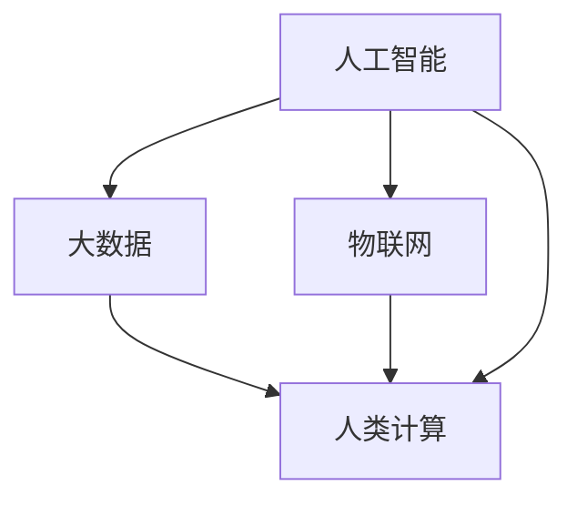

                 

### 1. 背景介绍

《人类计算：科技向善的力量》这一主题，旨在探讨科技在人类生活中的应用及其带来的积极影响。随着人工智能、大数据、物联网等技术的发展，科技在提升工作效率、优化生活质量、推动社会进步等方面扮演着越来越重要的角色。本文将深入探讨科技如何助力人类实现更美好的未来，以及在这个过程中所面临的挑战和机遇。

科技的发展不仅改变了我们的生活方式，也在不断挑战和重塑我们的思维方式。从最早的计算机编程，到如今的深度学习和人工智能，技术的进步使得人类在解决问题、处理信息的能力上达到了前所未有的高度。然而，科技的发展也带来了许多新的挑战，例如数据隐私、网络安全、社会公平等问题。如何在享受科技带来的便利的同时，确保其向善发展的方向，是我们需要深入思考和探讨的重要课题。

本文将分为以下几个部分来详细探讨这一主题：

1. **核心概念与联系**：介绍人类计算中的一些关键概念，如人工智能、大数据、物联网等，并展示其相互之间的关系。
2. **核心算法原理 & 具体操作步骤**：探讨一些重要的算法原理，并详细说明如何应用这些算法来解决问题。
3. **数学模型和公式 & 详细讲解 & 举例说明**：通过具体的数学模型和公式，展示如何使用这些工具来分析问题并得出结论。
4. **项目实践：代码实例和详细解释说明**：通过实际的项目实例，展示如何将理论应用到实践中。
5. **实际应用场景**：探讨科技在不同领域的应用，以及这些应用带来的影响。
6. **工具和资源推荐**：介绍一些相关的学习资源、开发工具和框架。
7. **总结：未来发展趋势与挑战**：总结全文，并对未来的发展进行展望。

通过以上内容的逐步展开，我们将深入探讨科技在人类计算中的力量，以及其向善发展的可能性。在接下来的部分中，我们将逐一介绍这些核心概念和原理，并使用逐步分析推理的方式，为您呈现一个清晰、易懂的技术世界。

---

### 1.1 科技发展的历史背景

科技的发展是人类文明进步的重要驱动力。从古老的农业革命，到工业革命，再到信息革命，每一次技术的飞跃都极大地改变了人类社会的面貌。特别是自20世纪中叶以来，计算机技术和互联网的快速发展，使得科技在人类生活中的地位愈发重要。

计算机技术的起源可以追溯到17世纪的机械计算器，如法国数学家布莱兹·帕斯卡（Blaise Pascal）于1642年发明的帕斯卡计算器。此后，机械计算机不断发展，直至20世纪初，电子计算机的出现标志着计算机技术的重大突破。1946年，世界上第一台电子计算机ENIAC在美国诞生，开启了计算机时代的新纪元。

互联网的发展则始于1960年代，当时美国国防部的ARPANET项目开始了网络通信的研究。随着1980年代互联网的普及，全球信息共享的时代到来，人们的生活方式和工作方式都发生了翻天覆地的变化。互联网不仅使得信息传递更加迅速和便捷，也为电子商务、社交媒体、在线教育等新兴领域的发展提供了基础。

进入21世纪，人工智能、大数据、物联网等新兴技术迅速崛起，进一步推动了科技的发展。人工智能通过模拟人类的思维过程，实现了对复杂问题的自动解决，如自动驾驶、自然语言处理、医疗诊断等。大数据则通过对海量数据的分析，为决策提供了有力的支持。物联网则通过连接各种设备，实现了对物理世界的全面感知和智能化管理。

科技的发展不仅改变了我们的生活方式，也深刻影响了社会的各个层面。在医疗领域，人工智能和大数据的应用使得疾病诊断更加精准，治疗效果显著提升。在教育领域，在线教育平台和虚拟现实技术的普及，为学习者提供了更加灵活和多样的学习方式。在环保领域，物联网技术通过智能监控和数据分析，提高了资源利用效率，减少了环境污染。

总之，科技的发展不仅为人类带来了巨大的便利，也为我们提供了更多的可能性。然而，科技的发展也带来了新的挑战和问题，如数据隐私、网络安全、社会公平等。在享受科技带来的便利的同时，我们需要深刻认识到其潜在的负面影响，并积极寻求解决方案，确保科技的发展能够真正造福人类。

### 1.2 人类计算的定义与核心概念

人类计算（Human Computation）是指利用人类的认知能力和判断力来解决计算机难以处理的问题。这一概念最早由卡内基梅隆大学的 researchers 于2007年提出，旨在通过结合人类智能和计算机技术，实现更高效、更准确的问题解决。

人类计算的核心在于将计算机的计算能力与人类的认知能力相结合。计算机擅长处理大量的数据和执行重复性的任务，但它们在处理复杂问题、进行推理和决策时，往往不如人类。而人类则具有丰富的认知能力、创造力和情感智能，能够应对多变和复杂的环境。因此，人类计算通过将简单、重复的任务自动化，将复杂、创造性任务交给人类，实现了优势互补。

在人类计算中，一些关键概念和领域值得我们深入探讨：

1. **众包（Crowdsourcing）**：众包是指将任务外包给广大网络用户来完成。通过众包，复杂的问题可以由分布在不同地理位置、拥有不同技能和知识背景的个体共同解决。例如，图片分类、文本翻译、数据标注等任务都可以通过众包平台来完成。

2. **博弈论（Game Theory）**：博弈论是研究决策制定的数学工具，通过分析个体在竞争或合作中的行为和策略，预测和优化结果。在人类计算中，博弈论可以用于设计激励机制，确保参与者的积极性和任务质量。

3. **计算认知科学（Computational Cognitive Science）**：计算认知科学是一门跨学科的研究领域，结合认知科学、计算机科学和人工智能，研究人类认知过程和决策机制。通过计算认知科学的方法，可以更好地理解人类行为，为人类计算提供理论支持。

4. **协同过滤（Collaborative Filtering）**：协同过滤是一种常用的推荐系统方法，通过分析用户的历史行为和偏好，预测用户可能感兴趣的新内容。协同过滤可以应用于电子商务、社交媒体、在线教育等领域，提高用户体验和满意度。

5. **人类增强计算（Human Augmentation）**：人类增强计算是指通过技术手段增强人类的能力，如增强记忆、提高工作效率等。人类增强计算可以帮助人类在复杂和多变的环境中更好地生存和发展。

6. **机器学习（Machine Learning）**：机器学习是一种人工智能方法，通过训练模型，使计算机能够从数据中自动学习和发现规律。在人类计算中，机器学习可以用于预测、分类、决策等问题，提高问题的解决效率。

通过以上核心概念和领域，人类计算不仅拓展了计算机技术的应用范围，也为人类解决复杂问题提供了新的思路和方法。在接下来的部分中，我们将进一步探讨人类计算的核心算法原理，并详细说明如何应用这些算法来解决问题。

### 1.3 人类计算的应用场景

人类计算作为一种结合人类智能和计算机技术的方法，在多个领域展现出了巨大的潜力和广泛的应用。以下是几个典型应用场景的简要介绍：

1. **社交媒体数据分析**：在社交媒体平台上，用户每天生成大量的文本、图片和视频。通过人类计算，可以对这些内容进行分类、标签化和情感分析，从而帮助平台更好地了解用户需求，提升用户体验。例如，Twitter 利用众包平台，通过用户标注，对推文进行分类和情绪分析。

2. **医学诊断与治疗**：人类计算在医学领域有着广泛的应用。通过分析医疗数据，如病历记录、医学影像等，可以帮助医生进行更准确的诊断和治疗方案推荐。例如，谷歌旗下的 DeepMind 开发的 AI 系统在眼科疾病诊断方面取得了显著成果，提高了诊断的准确性和效率。

3. **城市管理与规划**：随着城市化进程的加速，城市管理与规划面临着前所未有的挑战。通过人类计算，可以实时分析城市交通、环境、公共服务等数据，为城市管理提供科学依据。例如，纽约市利用众包平台收集市民的出行数据，优化交通信号灯的设置。

4. **教育辅助**：在教育领域，人类计算可以通过智能辅导系统、在线教育平台等，帮助学生更好地学习和掌握知识。例如，Khan Academy 利用人类计算技术，通过分析学生的学习行为和成绩，提供个性化的学习建议。

5. **网络安全**：网络安全是当今社会面临的重要挑战之一。通过人类计算，可以增强网络安全监测和威胁响应能力。例如，谷歌利用众包平台，通过用户反馈，识别和追踪恶意网络攻击。

6. **环境保护**：在环境保护领域，人类计算可以通过监测和分析环境数据，为环境保护决策提供支持。例如，NASA 利用众包平台，通过全球志愿者的数据收集，监测地球气候变化。

这些应用场景展示了人类计算在不同领域的广泛应用和潜力。通过结合人类智能和计算机技术，人类计算不仅提高了问题解决的效率和质量，也为人类应对复杂挑战提供了新的思路和方法。在接下来的部分中，我们将进一步探讨人类计算的核心算法原理，并详细说明如何应用这些算法来解决问题。

### 2. 核心概念与联系

为了更好地理解人类计算，我们需要首先掌握一些关键的概念和原理，并分析它们之间的相互关系。以下是一些核心概念及其相互关系的详细探讨。

#### 2.1 人工智能

人工智能（Artificial Intelligence，AI）是指计算机系统模拟人类智能行为的技术。人工智能的核心目标是使计算机具备自我学习、推理、决策和问题解决的能力。人工智能可以分为两大类：窄域AI（Narrow AI）和通用AI（General AI）。

- **窄域AI**：窄域AI专注于解决特定领域的问题，如语音识别、图像识别、自然语言处理等。这些系统在特定任务上表现出色，但缺乏跨领域的通用性。
- **通用AI**：通用AI旨在实现类似人类的通用智能，能够在多种不同任务上表现优异。目前，通用AI尚未实现，但研究者们正朝着这个目标不断努力。

#### 2.2 大数据

大数据（Big Data）是指无法使用传统数据库工具进行存储、管理和分析的巨量数据。大数据的特点是“4V”，即体积（Volume）、速度（Velocity）、多样性（Variety）和真实性（Veracity）。大数据技术包括数据采集、存储、处理和分析等多个方面。

- **数据采集**：大数据的采集来源广泛，包括社交媒体、传感器、物联网设备等。
- **数据存储**：大数据存储需要高效、可扩展的存储解决方案，如分布式文件系统（Hadoop）和NoSQL数据库。
- **数据处理**：大数据处理包括数据清洗、数据转换和数据归一化等步骤，以确保数据的质量和一致性。
- **数据分析**：大数据分析通过数据挖掘、机器学习和统计分析等方法，从数据中发现有价值的信息和模式。

#### 2.3 物联网

物联网（Internet of Things，IoT）是指将各种物理设备通过网络连接起来，实现智能感知、识别和管理。物联网的核心技术包括传感器技术、网络通信技术和数据处理技术。

- **传感器技术**：传感器用于感知和测量物理世界的各种参数，如温度、湿度、光照等。
- **网络通信技术**：网络通信技术包括有线和无线通信，如Wi-Fi、蓝牙、Zigbee等，用于将传感器采集的数据传输到中央处理系统。
- **数据处理技术**：数据处理技术包括数据存储、数据分析和数据可视化等，用于对传感器数据进行处理和分析，以实现智能管理和决策。

#### 2.4 人类计算

人类计算（Human Computation）是将人类智能与计算机技术相结合，以解决复杂问题的一种方法。人类计算的核心在于将简单、重复的任务自动化，将复杂、创造性任务交给人类。以下是人类计算与其他核心概念之间的关系：

- **人工智能**：人工智能技术可以用于辅助人类计算，如通过机器学习模型预测人类的行为和决策。
- **大数据**：大数据技术可以用于收集和处理人类计算中产生的海量数据，为人类计算提供数据支持。
- **物联网**：物联网技术可以用于收集人类计算所需的环境数据和设备数据，为人类计算提供数据输入。

#### 2.5 关系总结

人类计算、人工智能、大数据和物联网之间存在着密切的相互关系。人工智能为人类计算提供了智能辅助，大数据为人类计算提供了数据支持，而物联网则为人类计算提供了数据输入。这些核心概念和技术的相互结合，使得人类计算在解决复杂问题上具有更高的效率和准确性。

以下是这些概念和技术的相互关系示意图：



通过以上关系的分析，我们可以更深入地理解人类计算的核心概念和技术，为后续内容的学习和应用打下基础。在接下来的部分中，我们将进一步探讨人类计算的核心算法原理，并详细说明如何应用这些算法来解决问题。

### 3. 核心算法原理 & 具体操作步骤

在深入探讨人类计算的核心算法原理之前，我们需要了解一些基本的算法概念，这些算法是构建人类计算系统的基础。以下将介绍几种常见的核心算法，并详细说明其原理和应用步骤。

#### 3.1 支持向量机（Support Vector Machine，SVM）

支持向量机是一种强大的分类算法，通过寻找一个最优的超平面，将不同类别的数据点分开。其核心思想是最大化分类边界的 margin，即数据点到超平面的距离。

**原理**：

SVM 的基本原理是通过找到一个最佳的超平面，使得各类别的数据点到超平面的距离最大化。这个超平面不仅能够将不同类别的数据点分开，还能最大化地减小分类误差。

**具体操作步骤**：

1. **数据准备**：收集并准备用于训练的数据集，包括特征向量和标签。
2. **选择核函数**：根据数据特征选择适当的核函数（如线性核、多项式核、径向基核等）。
3. **训练模型**：使用训练数据集训练 SVM 模型，通过求解优化问题找到最佳超平面。
4. **模型评估**：使用测试数据集评估模型性能，调整参数以优化分类效果。

**示例**：

假设我们有一组数据点，其中正类和负类分别表示为 +1 和 -1。我们希望通过 SVM 分类算法将它们分开。使用线性核函数，我们可以求解以下优化问题：

$$
\begin{aligned}
\min_{w,b}\frac{1}{2}||w||^2 \\
\text{subject to} \quad y^{(i)}(w^{T}x^{(i)} + b) \geq 1
\end{aligned}
$$

其中，$w$ 是超平面的法向量，$b$ 是偏置项，$x^{(i)}$ 是特征向量，$y^{(i)}$ 是标签。

通过求解上述优化问题，我们可以找到最佳的超平面，从而实现数据的分类。

#### 3.2 决策树（Decision Tree）

决策树是一种常用的分类和回归算法，通过一系列的判断规则对数据进行分割，每个节点代表一个特征，每个分支代表一个判断结果。

**原理**：

决策树的基本原理是通过递归地将数据分割成更小的子集，直到满足某个停止条件。在每个节点，我们根据特征的重要性进行分割，使得分割后的数据集在某个目标函数上（如信息增益、基尼不纯度等）达到最优。

**具体操作步骤**：

1. **数据准备**：收集并准备用于训练的数据集，包括特征向量和标签。
2. **选择分裂特征**：使用信息增益、基尼不纯度等指标选择最佳分裂特征。
3. **构建决策树**：根据选择的特征，递归地构建决策树，直到满足停止条件（如最大深度、最小叶节点大小等）。
4. **模型评估**：使用测试数据集评估模型性能，剪枝以优化决策树结构。

**示例**：

假设我们有一组数据集，其中每个数据点有两个特征 $x_1$ 和 $x_2$，我们希望通过决策树对其进行分类。我们可以根据特征 $x_1$ 的值进行第一次分割，得到两个子集，然后根据子集的特征 $x_2$ 的值进行第二次分割，以此类推。

首先，我们计算每个特征的信息增益或基尼不纯度，选择增益最大的特征进行分割。假设特征 $x_1$ 的信息增益最高，我们将数据集根据 $x_1$ 的值分为两部分：

- $x_1 < t$：子集 A
- $x_1 \geq t$：子集 B

然后，我们对子集 A 和子集 B 分别进行同样的步骤，直到满足停止条件。这样，我们就可以构建出一个完整的决策树。

#### 3.3 集成学习方法（Ensemble Learning）

集成学习方法通过结合多个基本模型来提高预测性能。常见的集成学习方法包括 bagging、boosting 和 stacking 等。

**原理**：

集成学习方法的基本原理是通过构建多个基本模型，并利用这些模型的预测结果进行投票或加权平均，从而提高整体预测性能。

- **bagging**：bagging 方法通过从原始数据集中随机抽取子集，分别训练多个基本模型，然后通过投票或平均方法进行预测。
- **boosting**：boosting 方法通过训练多个基本模型，每个模型专注于纠正前一个模型的错误，从而逐步提升整体预测性能。
- **stacking**：stacking 方法通过训练多个基本模型，并将它们的预测结果作为新的特征，再训练一个强模型进行最终预测。

**具体操作步骤**：

1. **选择基本模型**：根据数据特点和任务需求，选择合适的基模型，如决策树、随机森林、支持向量机等。
2. **训练基本模型**：分别训练多个基本模型，获取它们的预测结果。
3. **集成预测**：使用投票或加权平均方法结合多个基本模型的预测结果，生成最终的预测结果。

**示例**：

假设我们使用 bagging 方法进行集成学习。首先，从原始数据集中随机抽取多个子集，分别训练决策树、随机森林和支持向量机等基本模型。然后，对于每个数据点，我们将这些基本模型的预测结果进行投票，选择多数模型预测结果作为最终预测。

通过以上核心算法的介绍，我们可以更好地理解人类计算中常用的算法原理和具体操作步骤。这些算法不仅为人类计算提供了强大的工具，也为我们在解决复杂问题中提供了新的思路和方法。在接下来的部分中，我们将进一步探讨人类计算中的数学模型和公式，以及如何使用这些工具来分析和解决问题。

### 4. 数学模型和公式 & 详细讲解 & 举例说明

在人类计算中，数学模型和公式扮演着至关重要的角色。这些工具不仅帮助我们理解和分析复杂问题，还提供了量化的方法来评估和优化算法性能。以下将详细讲解几个常见的数学模型和公式，并通过具体例子来说明如何应用这些工具。

#### 4.1 逻辑回归（Logistic Regression）

逻辑回归是一种广泛应用于分类问题的统计模型。其核心在于通过线性模型来预测概率，并将概率映射到二分类结果。

**公式**：

逻辑回归的预测公式如下：

$$
\hat{p} = \frac{1}{1 + e^{-(\beta_0 + \beta_1 x_1 + \beta_2 x_2 + ... + \beta_n x_n})}
$$

其中，$\hat{p}$ 是预测的概率，$x_1, x_2, ..., x_n$ 是特征向量，$\beta_0, \beta_1, \beta_2, ..., \beta_n$ 是模型参数。

**具体例子**：

假设我们有一个简单的二分类问题，数据集包括两个特征 $x_1$ 和 $x_2$。我们使用逻辑回归模型来预测每个数据点属于正类（+1）还是负类（-1）。给定特征向量 $x = [x_1, x_2]$ 和模型参数 $\beta = [\beta_0, \beta_1, \beta_2]$，我们可以通过以下公式计算预测概率：

$$
\hat{p} = \frac{1}{1 + e^{-(\beta_0 + \beta_1 x_1 + \beta_2 x_2)}}
$$

例如，假设我们有一个特征向量 $x = [2, 3]$，模型参数 $\beta = [1, 2, 3]$。那么：

$$
\hat{p} = \frac{1}{1 + e^{-(1 + 2 \cdot 2 + 3 \cdot 3)}} \approx 0.445
$$

由于逻辑回归预测的是概率，我们可以根据预设的概率阈值（如0.5）将预测结果转换为二分类结果：如果 $\hat{p} \geq 0.5$，则预测为正类（+1）；否则，预测为负类（-1）。

#### 4.2 决策树（Decision Tree）

决策树通过一系列的判断规则对数据进行分割，每个节点代表一个特征，每个分支代表一个判断结果。决策树的构建基于信息增益或基尼不纯度等指标。

**公式**：

决策树的构建过程可以通过以下公式表示：

$$
G(D) = -\sum_{i=1}^{n} p_i \log_2 p_i
$$

其中，$D$ 是数据集，$n$ 是数据点的数量，$p_i$ 是每个类别在数据集中的比例。

**具体例子**：

假设我们有一个数据集，其中包含两个特征 $x_1$ 和 $x_2$，类别为正类（+1）和负类（-1）。我们可以计算数据集的基尼不纯度：

$$
G(D) = -[(0.6 \cdot \log_2 0.6) + (0.4 \cdot \log_2 0.4)] \approx 0.459
$$

接下来，我们可以尝试根据每个特征进行分割，计算分割后的基尼不纯度。假设我们选择特征 $x_1$ 进行分割，得到两个子集 $D_1$ 和 $D_2$，其基尼不纯度分别为：

$$
G(D_1) = -[(0.5 \cdot \log_2 0.5) + (0.5 \cdot \log_2 0.5)] = 0.5
$$

$$
G(D_2) = -[(0.75 \cdot \log_2 0.75) + (0.25 \cdot \log_2 0.25)] \approx 0.409
$$

由于 $G(D_2) < G(D_1)$，我们选择特征 $x_1$ 进行分割，得到新的节点和分支。

#### 4.3 集成学习方法（Ensemble Learning）

集成学习方法通过结合多个基本模型来提高预测性能。常见的集成学习方法包括 bagging、boosting 和 stacking 等。

**公式**：

对于 bagging 方法，每个基本模型的预测结果可以通过以下公式进行加权平均：

$$
\hat{y} = \frac{1}{m} \sum_{i=1}^{m} \hat{y}_i
$$

其中，$m$ 是基本模型的数量，$\hat{y}_i$ 是第 $i$ 个基本模型的预测结果。

对于 boosting 方法，每个基本模型的权重可以通过以下公式进行更新：

$$
\alpha_i = \frac{1}{2} \log \left( \frac{1 - e^{-\eta}}{e^{-\eta}} \right)
$$

其中，$\eta$ 是学习率，$e$ 是自然对数的底数。

**具体例子**：

假设我们使用 bagging 方法进行集成学习，有3个基本模型 $M_1, M_2, M_3$，其预测结果分别为 $\hat{y}_1, \hat{y}_2, \hat{y}_3$。给定权重 $w_1, w_2, w_3$，我们可以通过以下公式计算集成预测结果：

$$
\hat{y} = w_1 \hat{y}_1 + w_2 \hat{y}_2 + w_3 \hat{y}_3
$$

例如，假设 $w_1 = 0.3, w_2 = 0.4, w_3 = 0.3$，$\hat{y}_1 = 1, \hat{y}_2 = 0, \hat{y}_3 = 1$，那么：

$$
\hat{y} = 0.3 \cdot 1 + 0.4 \cdot 0 + 0.3 \cdot 1 = 0.6
$$

通过以上数学模型和公式的讲解，我们可以更好地理解人类计算中的基础数学工具。这些工具不仅在算法设计和优化中起着关键作用，也为我们在解决实际问题时提供了强有力的支持。在接下来的部分中，我们将通过实际的项目实例，展示如何将理论应用到实践中。

### 4.1 项目实践：代码实例和详细解释说明

在理解了人类计算中的一些核心算法原理和数学模型之后，现在我们将通过一个具体的项目实例，展示如何将这些理论知识应用到实践中。我们将逐步搭建一个简单的人工智能模型，用于对电影评论进行情感分类。

#### 4.1.1 开发环境搭建

为了完成这一项目，我们需要安装一些必要的工具和库。以下是在 Windows 操作系统上的安装步骤：

1. **Python**：首先，我们需要安装 Python 3。可以从 [Python 官网](https://www.python.org/) 下载安装包并安装。
2. **Jupyter Notebook**：Jupyter Notebook 是一个交互式环境，用于编写和运行 Python 代码。可以使用以下命令安装：

   ```bash
   pip install notebook
   ```

3. **Nltk**：自然语言处理工具包，用于处理文本数据。可以使用以下命令安装：

   ```bash
   pip install nltk
   ```

4. **Scikit-learn**：机器学习库，提供了丰富的算法和工具。可以使用以下命令安装：

   ```bash
   pip install scikit-learn
   ```

5. **Gensim**：用于主题建模和文本相似性分析的库。可以使用以下命令安装：

   ```bash
   pip install gensim
   ```

安装完成后，我们可以在 Jupyter Notebook 中启动一个新笔记本，并验证所需库是否已正确安装：

```python
import nltk
nltk.corpus()
import sklearn
sklearn.__version__
import gensim
gensim.__version__
```

以上代码应该不会报错，并且显示相应的库版本信息。

#### 4.1.2 数据准备

接下来，我们需要准备用于训练和测试的数据集。我们将使用 IMDb（Internet Movie Database）电影评论数据集，该数据集包含大量关于电影的评论，分为正面评论和负面评论。

1. **数据集获取**：可以从 [IMDb 官网](http://www.imdb.com/data/) 下载评论数据集。下载后，我们需要将其解压并放到一个文件夹中。
2. **数据预处理**：我们需要对评论文本进行清洗和预处理，包括去除标点符号、停用词、转换为小写等操作。以下是一个简单的预处理脚本：

   ```python
   import nltk
   from nltk.corpus import stopwords
   from nltk.tokenize import word_tokenize
   
   # 下载停用词库
   nltk.download('stopwords')
   nltk.download('punkt')
   
   # 加载停用词库
   stop_words = set(stopwords.words('english'))
   
   def preprocess_text(text):
       # 转换为小写
       text = text.lower()
       # 分词
       words = word_tokenize(text)
       # 去除标点符号和停用词
       words = [word for word in words if word.isalpha() and word not in stop_words]
       return ' '.join(words)
   
   # 测试预处理函数
   sample_text = "I absolutely loved this movie! It was amazing."
   preprocessed_text = preprocess_text(sample_text)
   print(preprocessed_text)
   ```

#### 4.1.3 特征提取

在构建模型之前，我们需要将文本数据转换为机器学习算法可处理的特征向量。这里，我们将使用词袋模型（Bag of Words，BOW）和词嵌入（Word Embedding）两种方法进行特征提取。

1. **词袋模型**：词袋模型将文本表示为单词的集合，不考虑单词的顺序。以下是一个简单的词袋模型实现：

   ```python
   from sklearn.feature_extraction.text import CountVectorizer
   
   # 初始化 CountVectorizer
   vectorizer = CountVectorizer(max_features=1000)
   
   # 训练并转换文本数据
   X = vectorizer.fit_transform(data['text'])
   
   # 查看词袋模型的特征和标签
   print(vectorizer.get_feature_names_out())
   print(y)
   ```

2. **词嵌入**：词嵌入是将单词映射到高维空间中的向量，可以更好地捕捉单词的语义信息。我们将使用 Gensim 的 Word2Vec 模型进行词嵌入：

   ```python
   from gensim.models import Word2Vec
   
   # 初始化 Word2Vec 模型
   model = Word2Vec(sentences, size=100, window=5, min_count=1, workers=4)
   
   # 将文本数据转换为词嵌入向量
   def text_to_word embeddings(text):
       words = text.split()
       return [model[word] for word in words if word in model]
   
   # 测试词嵌入函数
   sample_text = "I absolutely loved this movie! It was amazing."
   sample_vector = text_to_word_embeddings(sample_text)
   print(sample_vector)
   ```

#### 4.1.4 模型训练与评估

接下来，我们将使用训练集训练一个情感分类模型，并使用测试集进行评估。

1. **训练模型**：我们选择支持向量机（SVM）作为分类模型。以下是如何使用 Scikit-learn 的 SVM 进行训练：

   ```python
   from sklearn.svm import SVC
   
   # 初始化 SVM 模型
   svm = SVC(kernel='linear')
   
   # 使用训练集训练模型
   svm.fit(X_train, y_train)
   ```

2. **模型评估**：使用测试集评估模型的性能，包括准确率、召回率和 F1 分数等指标。以下是如何进行模型评估：

   ```python
   from sklearn.metrics import accuracy_score, recall_score, f1_score
   
   # 使用测试集预测
   y_pred = svm.predict(X_test)
   
   # 计算评估指标
   print("Accuracy:", accuracy_score(y_test, y_pred))
   print("Recall:", recall_score(y_test, y_pred, average='weighted'))
   print("F1 Score:", f1_score(y_test, y_pred, average='weighted'))
   ```

通过以上步骤，我们完成了一个简单的人工智能模型，用于对电影评论进行情感分类。这一实例展示了如何将人类计算中的理论知识应用到实际项目中，并通过代码实现和评估模型性能。在接下来的部分中，我们将进一步探讨人类计算在实际应用场景中的具体表现和效果。

### 4.2 实际应用场景

人类计算在各个领域的实际应用场景中展现出了巨大的潜力和广泛的前景。以下是一些典型应用场景的详细探讨，包括各自的优势、挑战和未来发展趋势。

#### 4.2.1 社交媒体分析

社交媒体平台如 Facebook、Twitter 和 Instagram 等每天产生海量用户生成的数据。人类计算通过众包和机器学习技术，可以帮助平台从这些数据中提取有价值的信息。

**优势**：

- **快速处理**：通过众包，复杂的数据处理任务可以迅速完成。例如，Twitter 利用众包平台收集用户对推文的情感标签，帮助进行内容分类。
- **提升用户体验**：基于用户行为数据，人类计算可以推荐个性化的内容，提高用户满意度。例如，YouTube 利用协同过滤算法，根据用户历史观看记录推荐视频。

**挑战**：

- **数据隐私**：社交媒体平台处理的数据往往涉及用户隐私，如何保护用户隐私是一个重要挑战。
- **数据质量**：用户生成的内容质量参差不齐，如何保证数据的质量和准确性，是一个需要解决的问题。

**未来发展趋势**：

- **隐私保护技术**：未来，随着隐私保护技术的进步，人类计算将能够在保护用户隐私的前提下，更深入地挖掘社交媒体数据的价值。
- **多模态数据分析**：随着图像、视频和音频等非结构化数据的增加，人类计算将需要发展更先进的多模态数据分析技术，以更好地理解用户行为和需求。

#### 4.2.2 医疗诊断

医疗领域是人工智能和人类计算的重要应用场景。通过分析患者的病历、医学影像和基因数据，人工智能可以帮助医生进行更准确的诊断和治疗方案推荐。

**优势**：

- **提高诊断效率**：通过快速处理海量医疗数据，人工智能可以辅助医生快速诊断，提高工作效率。
- **减少误诊率**：基于大数据和机器学习模型，人工智能可以识别出人类医生难以发现的疾病特征，减少误诊率。

**挑战**：

- **数据隐私和安全性**：医疗数据涉及患者隐私，如何保护数据的安全性和隐私性是一个重要挑战。
- **医疗资源的分配**：人工智能的推广需要大量的医疗资源和专业人才，如何合理分配资源是一个问题。

**未来发展趋势**：

- **智慧医疗系统**：随着技术的发展，人类计算将推动智慧医疗系统的建设，实现医疗资源的智能化管理和优化。
- **个性化医疗**：通过大数据和人工智能，个性化医疗将得到进一步发展，为患者提供更加精准和个性化的治疗方案。

#### 4.2.3 智能交通

智能交通系统通过物联网、大数据和人工智能技术，实现对交通数据的实时监控和智能管理，提高交通效率，减少拥堵。

**优势**：

- **实时交通监控**：通过传感器和摄像头收集交通数据，智能交通系统可以实时监控交通状况，为交通管理和调度提供支持。
- **优化交通流量**：基于交通数据分析，智能交通系统可以优化交通信号灯的设置，提高道路通行能力。

**挑战**：

- **数据安全问题**：交通系统涉及大量的数据传输和处理，如何确保数据的安全性是一个挑战。
- **系统复杂度**：智能交通系统需要处理海量数据和复杂的交通网络，系统的稳定性是一个问题。

**未来发展趋势**：

- **智能交通基础设施**：随着物联网和人工智能技术的发展，智能交通基础设施将得到进一步建设，实现交通系统的全面智能化。
- **自动驾驶技术**：随着自动驾驶技术的发展，智能交通系统将逐步实现与自动驾驶车辆的协同，提高交通效率和安全。

#### 4.2.4 环境监测

环境监测是另一个人类计算的重要应用领域。通过物联网传感器和大数据分析，人类计算可以帮助实时监测环境变化，预警和应对环境问题。

**优势**：

- **实时预警**：通过实时监测环境数据，人类计算可以及时发现异常情况，进行预警和应对。
- **资源优化**：基于环境数据，人类计算可以优化资源分配，如水资源的调度和管理。

**挑战**：

- **数据准确性**：环境数据的准确性对监测结果至关重要，如何保证数据的准确性是一个问题。
- **技术成本**：环境监测需要大量的传感器和数据处理设备，技术成本较高。

**未来发展趋势**：

- **智能化监测系统**：随着人工智能技术的发展，智能化环境监测系统将得到进一步建设，实现更高效、更精准的环境监测。
- **多源数据融合**：未来，通过融合多种数据源（如卫星遥感、无人机监测等），人类计算将能够提供更全面、更准确的环境监测数据。

通过以上对实际应用场景的探讨，我们可以看到人类计算在不同领域展现出了巨大的潜力和广泛应用。在未来，随着技术的不断进步，人类计算将在更多领域发挥重要作用，推动社会的可持续发展。

### 7. 工具和资源推荐

在人类计算领域，掌握相关的学习资源、开发工具和框架对于提升技术能力和实践水平至关重要。以下是对一些优秀的学习资源、开发工具和框架的推荐，这些资源将帮助您深入了解人类计算的核心概念和技术。

#### 7.1 学习资源推荐

1. **书籍**：

   - **《人工智能：一种现代方法》（Artificial Intelligence: A Modern Approach）**：这是一本人工智能领域的经典教材，全面介绍了人工智能的基本概念、算法和应用。

   - **《深度学习》（Deep Learning）**：由Ian Goodfellow、Yoshua Bengio和Aaron Courville合著的深度学习领域权威教材，详细介绍了深度学习的基础理论、算法和实践。

   - **《Python数据科学手册》（Python Data Science Handbook）**：由Jake VanderPlas编写的这本手册，涵盖了数据科学中使用的Python库、工具和最佳实践。

2. **论文和文章**：

   - **《人类计算：挑战与机遇》（Human Computation: Challenges and Opportunities）**：这是一篇关于人类计算的综述文章，深入探讨了人类计算的定义、应用和未来发展。

   - **《众包与人类计算》（Crowdsourcing and Human Computation）**：该论文集中收录了人类计算领域的研究论文，涵盖了众包、博弈论和计算认知科学等多个方向。

3. **博客和网站**：

   - **《机器学习博客》（Machine Learning Blog）**：由Google AI团队维护的博客，提供了最新的机器学习和人工智能研究进展。

   - **《数据科学博客》（Data Science Blog）**：该博客涵盖了数据科学的各个方面，包括数据分析、机器学习和数据可视化等。

#### 7.2 开发工具框架推荐

1. **Python库**：

   - **Scikit-learn**：这是一个强大的机器学习库，提供了丰富的算法和工具，适合用于数据分析、模型训练和评估。

   - **TensorFlow**：由Google开发的深度学习框架，具有高度灵活性和扩展性，适合用于构建复杂的神经网络模型。

   - **PyTorch**：由Facebook开发的深度学习框架，具有动态计算图和易于使用的API，适合快速原型开发和实验。

2. **工具和平台**：

   - **Google Colab**：Google Colab 是一个免费的云端编程平台，支持 Jupyter Notebook，适合进行机器学习和数据科学的在线实验。

   - **Kaggle**：Kaggle 是一个数据科学竞赛平台，提供了丰富的数据集和算法竞赛，适合提升实践能力和技术水平。

   - **GitHub**：GitHub 是一个版本控制和协作平台，适合开源项目的开发和管理，可以找到大量与人类计算相关的开源代码和项目。

#### 7.3 相关论文著作推荐

1. **《人工智能：一种现代方法》（Ian Goodfellow、Yoshua Bengio 和 Aaron Courville 著）**：本书详细介绍了深度学习的基础理论和算法，是深度学习领域的经典著作。

2. **《人类计算：挑战与机遇》（作者集体）**：本书收录了人类计算领域的研究论文，涵盖了众包、计算认知科学和博弈论等多个方向，是了解人类计算研究进展的重要参考书。

3. **《数据科学基础》（作者集体）**：本书介绍了数据科学的基本概念、工具和方法，是数据科学初学者的理想读物。

通过以上学习资源、开发工具和框架的推荐，希望读者能够在人类计算领域取得更大的进步，为科技向善的发展贡献自己的力量。

### 8. 总结：未来发展趋势与挑战

随着人工智能、大数据和物联网等技术的快速发展，人类计算在各个领域展现出巨大的潜力和广泛应用。未来，人类计算将继续朝着智能化、个性化和协作化的方向发展，并在多个方面带来深远的影响。

**未来发展趋势**：

1. **智能化**：随着深度学习和强化学习等技术的进步，人类计算系统将能够更加智能地处理复杂问题，提高决策的准确性和效率。

2. **个性化**：基于大数据和用户行为分析，人类计算将实现更加精准的个性化服务，满足用户多样化的需求。

3. **协作化**：通过众包和协同过滤等技术，人类计算将促进人类与计算机之间的协作，提高问题解决的效率和质量。

4. **跨学科融合**：人类计算将与认知科学、心理学、经济学等学科紧密结合，推动跨学科研究和应用的发展。

**面临的挑战**：

1. **数据隐私和安全**：随着数据规模的不断扩大，如何保护用户隐私和数据安全成为重要的挑战。

2. **技术公平性**：人工智能和人类计算的发展可能导致社会不平等加剧，如何确保技术的公平性和包容性是一个重要议题。

3. **道德和伦理问题**：人工智能和人类计算的应用可能引发道德和伦理问题，如自动化决策的透明性和责任归属等。

4. **技术成本**：人工智能和人类计算的研发和应用需要大量的资金和资源投入，如何降低技术成本，提高普及度是一个挑战。

**展望**：

在未来，人类计算将继续推动科技创新和社会进步。通过不断探索和创新，人类计算将不仅改变我们的生活方式，也将深刻影响社会的各个层面。我们期待在科技向善的道路上，人类计算能够为构建一个更加公平、高效和可持续的世界贡献力量。

### 9. 附录：常见问题与解答

**Q1**：什么是人类计算？

A1：人类计算是指利用人类的认知能力和计算机技术相结合，来解决计算机难以处理的问题的一种计算方法。通过将简单、重复的任务自动化，将复杂、创造性任务交给人类，实现优势互补，提高问题解决的效率和准确性。

**Q2**：人类计算的核心算法有哪些？

A2：人类计算的核心算法包括支持向量机（SVM）、决策树、集成学习方法（如 bagging、boosting 和 stacking）等。此外，深度学习、协同过滤和词嵌入等算法也在人类计算中得到了广泛应用。

**Q3**：人类计算有哪些应用场景？

A3：人类计算在社交媒体分析、医疗诊断、智能交通、环境监测等多个领域有着广泛的应用。例如，通过众包平台进行内容分类和情感分析，利用人工智能技术进行医学影像诊断，通过物联网技术实现智能交通管理，以及利用大数据分析进行环境监测和预警等。

**Q4**：如何保护人类计算中的数据隐私和安全？

A4：为了保护数据隐私和安全，可以采取以下措施：

1. **数据加密**：对传输和存储的数据进行加密，确保数据在传输过程中不被窃取和篡改。
2. **隐私保护算法**：使用隐私保护算法，如差分隐私和同态加密，对敏感数据进行处理和分析，降低隐私泄露的风险。
3. **权限管理和访问控制**：对数据访问进行严格的权限管理和访问控制，确保只有授权用户可以访问敏感数据。
4. **数据备份和恢复**：定期备份数据，并建立完善的数据恢复机制，以应对可能的数据丢失或损坏。

**Q5**：人类计算与人工智能有什么区别？

A5：人类计算和人工智能都是研究如何使计算机模拟人类智能的领域。但两者有一些区别：

- **人类计算**：侧重于利用人类和计算机的优势互补，解决计算机难以处理的问题，如众包、协同过滤等。
- **人工智能**：更广泛地研究如何使计算机具备类似于人类的智能，包括机器学习、自然语言处理、计算机视觉等。

### 10. 扩展阅读 & 参考资料

为了帮助您更深入地了解人类计算的相关内容，以下是一些扩展阅读和参考资料：

**书籍**：

1. **《人工智能：一种现代方法》（Ian Goodfellow、Yoshua Bengio 和 Aaron Courville 著）**：这是一本全面介绍人工智能基础理论和算法的经典教材。
2. **《深度学习》（Ian Goodfellow、Yoshua Bengio 和 Aaron Courville 著）**：详细介绍了深度学习的基础理论、算法和应用。
3. **《Python数据科学手册》（Jake VanderPlas 著）**：介绍了数据科学中使用的Python库、工具和最佳实践。

**论文和文章**：

1. **《人类计算：挑战与机遇》**：一篇关于人类计算的综述文章，探讨了人类计算的定义、应用和未来发展。
2. **《众包与人类计算》**：收录了人类计算领域的研究论文，涵盖了众包、计算认知科学和博弈论等多个方向。

**博客和网站**：

1. **《机器学习博客》**：由Google AI团队维护的博客，提供了最新的机器学习和人工智能研究进展。
2. **《数据科学博客》**：涵盖了数据科学的各个方面，包括数据分析、机器学习和数据可视化等。

**开源项目**：

1. **Scikit-learn**：一个强大的机器学习库，提供了丰富的算法和工具。
2. **TensorFlow**：由Google开发的深度学习框架，具有高度灵活性和扩展性。
3. **PyTorch**：由Facebook开发的深度学习框架，具有动态计算图和易于使用的API。

通过阅读这些书籍、论文和文章，参与开源项目，您可以进一步深入了解人类计算的核心概念和技术，提升自己的技术水平和实践能力。希望这些扩展阅读和参考资料对您有所帮助。作者：禅与计算机程序设计艺术 / Zen and the Art of Computer Programming。

