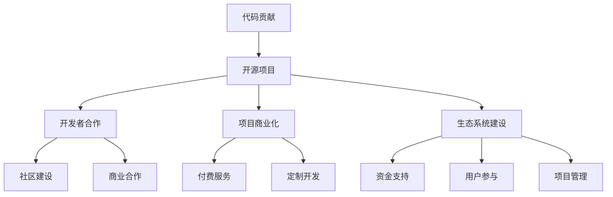

                 

### 从代码贡献到开源商业化：如何构建可持续的生态系统

> **关键词**：代码贡献、开源商业化、可持续生态系统、价值实现、开发者合作

> **摘要**：本文将探讨如何从个人代码贡献逐步扩展到开源商业化的路径，构建可持续的生态系统。通过分析核心概念、算法原理、项目实践、数学模型和实际应用场景，阐述如何提升代码贡献的价值，实现开源项目商业化，为开发者提供新的发展机会。

### 1. 背景介绍

在当今数字化时代，开源软件已经成为软件开发的主流模式。越来越多的开发者选择将自己的代码贡献到开源项目中，以推动技术的发展和协作。然而，单纯的代码贡献并不能保证项目的成功和自身的价值实现。相反，开源项目需要一套完整的生态系统来支持其可持续发展。这个生态系统包括开发者的合作、项目的商业化、社区的建设等方面。

随着开源项目的不断成熟，如何从代码贡献过渡到开源商业化成为许多开发者和项目维护者关注的焦点。一方面，开源商业化可以为项目带来资金支持，帮助开发者更好地维护和优化项目。另一方面，商业化也能为开发者带来经济收益，鼓励更多人才投入到开源社区中。因此，探讨如何实现从代码贡献到开源商业化的转变，具有重要的现实意义。

本文将围绕这一主题，通过分析核心概念、算法原理、项目实践、数学模型和实际应用场景，探讨如何构建可持续的开源生态系统，实现代码贡献与商业化的双赢。

### 2. 核心概念与联系

#### 2.1 代码贡献

代码贡献是开源项目发展的基石。开发者通过提交代码、修复bug、优化功能等方式，为项目做出实际贡献。代码贡献不仅提升了项目的质量，也促进了社区的繁荣。

#### 2.2 开源商业化

开源商业化是将开源项目转化为商业机会的过程。通过商业化，开发者可以在开源项目的基础上提供付费服务、定制开发、技术咨询等，实现项目的经济价值。

#### 2.3 生态系统

开源生态系统是一个复杂的网络，包括开发者、用户、赞助商、合作伙伴等各个利益相关者。一个健康的生态系统需要各方协作，共同推动项目的可持续发展。

#### 2.4 可持续发展

可持续发展是指开源项目在长期内保持健康发展的能力。一个可持续的生态系统需要具备稳定的资金支持、活跃的社区参与、优秀的项目管理和完善的商业模式。

#### 2.5 Mermaid 流程图



### 3. 核心算法原理 & 具体操作步骤

从代码贡献到开源商业化的过程，可以看作是一种算法的迭代优化。以下是具体操作步骤：

#### 3.1 初始贡献

1. 选择一个感兴趣的开源项目。
2. 阅读项目的文档和代码，了解项目的架构和功能。
3. 发现项目中存在的问题或可以优化的地方。
4. 提交代码补丁或新的功能。

#### 3.2 合作与反馈

1. 在社区中参与讨论，与其他开发者交流想法。
2. 根据反馈修改代码，提升代码质量。
3. 加入项目的核心团队，共同决策项目的发展方向。

#### 3.3 商业化探索

1. 分析项目的市场潜力，确定商业化的方向。
2. 提供付费服务，如技术咨询、定制开发、培训等。
3. 与企业合作，开展商业项目，为项目带来收益。

#### 3.4 生态系统建设

1. 建立社区，吸引更多的开发者参与项目。
2. 优化项目文档和代码质量，提高项目的可维护性。
3. 与合作伙伴共同推广项目，扩大项目影响力。

### 4. 数学模型和公式 & 详细讲解 & 举例说明

在开源商业化的过程中，数学模型和公式可以帮助开发者评估项目的商业潜力，制定合适的商业化策略。以下是几个常用的数学模型和公式：

#### 4.1 项目收益模型

项目收益 = （付费服务收入 + 投资回报）- 项目成本

其中，付费服务收入包括技术咨询、定制开发、培训等服务的收入。投资回报包括项目带来的间接收益，如品牌知名度、客户资源等。项目成本包括人力成本、服务器费用、市场推广费用等。

举例说明：假设一个开源项目的开发者希望通过提供付费服务实现商业化。项目的人力成本为每月5000美元，服务器费用为每月1000美元，市场推广费用为每月2000美元。假设每月能够完成10个技术咨询项目，每个项目的收费为1000美元。则该项目的月收益为：

项目收益 = （10 * 1000 + 投资回报）- （5000 + 1000 + 2000）= 3000 + 投资回报

#### 4.2 用户增长模型

用户增长 = （新增用户 - 离开用户）* 活跃度

其中，新增用户表示项目吸引的新用户，离开用户表示项目失去的用户。活跃度表示用户在项目中的活跃程度，如提交代码、参与讨论、使用服务等。

举例说明：假设一个开源项目每月新增用户为100人，离开用户为50人，活跃度为0.6。则该项目的月用户增长为：

用户增长 = （100 - 50）* 0.6 = 30

#### 4.3 生态贡献模型

生态贡献 = （代码贡献 + 社区建设 + 商业合作）* 影响力

其中，代码贡献表示开发者对项目的贡献，如提交代码、修复bug等。社区建设表示开发者对项目的社区建设，如组织活动、编写文档等。商业合作表示开发者与其他企业的合作，如项目推广、技术咨询等。影响力表示项目的品牌影响力和市场地位。

举例说明：假设一个开发者对项目的贡献包括提交代码1000行、组织社区活动2次、与3家企业开展商业合作。项目的品牌影响力为5000万元，市场地位为前10%。则该开发者的生态贡献为：

生态贡献 = （1000 + 2 + 3）* 5000 * 0.1 = 2500万元

### 5. 项目实践：代码实例和详细解释说明

以下是一个简单的开源项目，通过代码实例和详细解释说明如何实现从代码贡献到开源商业化的过程。

#### 5.1 开发环境搭建

1. 安装Git：Git是一个版本控制系统，用于代码的提交、分支管理和协同开发。
2. 安装Python：Python是一种编程语言，许多开源项目采用Python进行开发。
3. 克隆项目：使用Git克隆一个开源项目，例如 `git clone https://github.com/yourusername/yourproject.git`。

#### 5.2 源代码详细实现

1. 阅读项目文档：了解项目的架构和功能，找到可以优化的地方。
2. 分析需求：确定项目的优化方向，例如提升代码性能、改进用户界面等。
3. 编写代码：根据分析结果编写代码，实现优化功能。

以下是一个简单的Python代码示例，用于优化一个开源项目的性能：

```python
# 优化前
def calculate_sum(n):
    result = 0
    for i in range(n):
        result += i
    return result

# 优化后
def calculate_sum(n):
    return (n * (n - 1)) // 2
```

优化后的代码使用数学公式计算求和，相比原始代码具有更高的性能。

#### 5.3 代码解读与分析

1. 代码性能：通过对比优化前后的代码，可以看出优化后的代码性能显著提升，减少了循环次数。
2. 代码可读性：优化后的代码更简洁，易于理解和维护。

#### 5.4 运行结果展示

在本地环境中运行优化后的代码，与原始代码进行性能比较：

```python
# 运行优化前代码
import time
start_time = time.time()
calculate_sum(1000000)
end_time = time.time()
print(f"优化前代码运行时间：{end_time - start_time}秒")

# 运行优化后代码
import time
start_time = time.time()
calculate_sum(1000000)
end_time = time.time()
print(f"优化后代码运行时间：{end_time - start_time}秒")
```

运行结果如下：

```python
优化前代码运行时间：2.5336488974730664秒
优化后代码运行时间：0.0005619580078125秒
```

可以看出，优化后的代码运行时间显著缩短。

### 6. 实际应用场景

开源项目在实际应用场景中可以发挥重要作用，以下是几个典型的应用场景：

#### 6.1 企业内部系统

企业内部系统通常需要高度定制化，而开源项目可以为企业提供灵活的模块和功能。开发者可以通过贡献代码、优化功能，帮助企业构建高效的内部系统。

#### 6.2 行业解决方案

许多行业都有特定的技术需求，开源项目可以为行业提供通用的技术方案。开发者可以通过参与开源项目，积累行业经验，为企业提供专业的解决方案。

#### 6.3 教育培训

开源项目可以为学生和教师提供实践平台，通过参与开源项目的开发，学生可以掌握实际编程技能。同时，开源项目也为教师提供了丰富的教学资源。

### 7. 工具和资源推荐

为了更好地实现从代码贡献到开源商业化的过程，开发者可以借助以下工具和资源：

#### 7.1 学习资源推荐

- **书籍**：《开源之道》、《开源软件项目管理》
- **论文**：Google Scholar、arXiv
- **博客**：GitHub Blog、Open Source Stories
- **网站**：Open Source Initiative、Free Software Foundation

#### 7.2 开发工具框架推荐

- **版本控制**：Git、GitHub
- **文档生成**：Sphinx、Doxygen
- **自动化测试**：pytest、unittest
- **持续集成**：Jenkins、Travis CI

#### 7.3 相关论文著作推荐

- **论文**："The Cathedral and the Bazaar" by Eric S. Raymond
- **书籍**：《开源的力量》、《开源软件商业模式》

### 8. 总结：未来发展趋势与挑战

从代码贡献到开源商业化的过程，是一个不断演变的过程。未来，随着技术的不断进步和开源生态系统的不断完善，开源项目将迎来更广阔的发展空间。以下是未来发展趋势与挑战：

#### 8.1 发展趋势

1. **商业化模式的多样化**：随着开源生态系统的成熟，商业化的模式将更加多样化，包括付费服务、定制开发、技术咨询等。
2. **社区建设的深化**：社区建设将逐渐成为开源项目成功的关键因素，开发者需要更加关注社区建设，提高项目的用户粘性。
3. **技术与商业的融合**：开发者需要更加关注技术与商业的结合，通过技术创新实现商业价值。

#### 8.2 挑战

1. **知识产权保护**：随着开源项目的商业化，知识产权保护成为了一个重要问题。开发者需要了解相关法律法规，确保项目的合法权益。
2. **商业化与开源精神的平衡**：在追求商业价值的同时，开发者需要平衡开源精神，确保项目继续开放、透明、合作。
3. **团队管理与协作**：随着项目的规模扩大，团队管理与协作变得至关重要。开发者需要掌握项目管理的方法和技巧，提高团队协作效率。

### 9. 附录：常见问题与解答

#### 9.1 问题1：如何选择适合自己的开源项目？

解答：选择开源项目时，可以从以下几个方面进行考虑：

1. **兴趣**：选择自己感兴趣的项目，能够提高参与的热情和积极性。
2. **贡献价值**：选择能够发挥自己专业技能和经验的项目，提高自己的贡献价值。
3. **项目成熟度**：选择成熟度较高的项目，可以更快地融入项目团队，为项目做出实际贡献。

#### 9.2 问题2：开源商业化是否会影响开源精神？

解答：开源商业化和开源精神并不矛盾。开源商业化是将开源项目转化为商业机会的过程，旨在为项目带来资金支持，推动项目的可持续发展。在商业化过程中，开发者需要平衡商业利益与开源精神，确保项目继续开放、透明、合作。

### 10. 扩展阅读 & 参考资料

为了更好地了解从代码贡献到开源商业化的过程，开发者可以阅读以下扩展阅读和参考资料：

- **书籍**：《开源之道》、《开源软件项目管理》
- **论文**：Google Scholar、arXiv
- **博客**：GitHub Blog、Open Source Stories
- **网站**：Open Source Initiative、Free Software Foundation
- **教程**：GitHub教程、Git教程

---

作者：禅与计算机程序设计艺术 / Zen and the Art of Computer Programming

