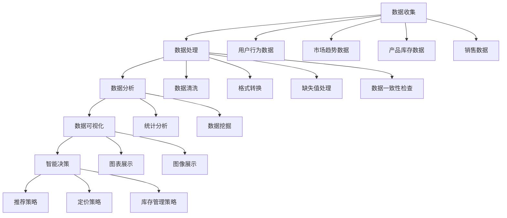

                 

### 背景介绍

在当今数字化时代，电子商务已成为全球经济发展的重要驱动力。随着互联网的普及和移动设备的普及，越来越多的消费者选择在线购物，这推动了电商平台的大规模扩张。然而，随着市场的不断变化和竞争的加剧，电商平台面临着巨大的挑战。为了在激烈的市场竞争中脱颖而出，电商平台需要充分利用数据的力量，通过智能决策实现商业价值的最大化。

本文旨在探讨AI在电商平台中的应用，从数据收集、处理到智能决策的全过程，详细分析AI如何提升电商平台的数据价值链。通过逐步分析和推理，我们将揭示AI技术的核心原理及其在电商领域的实际应用，帮助读者更好地理解AI在电商平台中的重要性。

首先，我们将介绍电商平台中数据收集的方法和挑战。随后，我们将探讨数据处理和存储的关键技术，包括数据清洗、数据分析和数据可视化等。接下来，我们将深入讨论如何利用机器学习算法进行智能决策，以及如何通过模型优化和部署实现高效的决策支持。最后，我们将探讨AI在电商平台中的应用场景，分享一些成功案例，并提供未来发展趋势和挑战的展望。

通过本文的阅读，您将了解AI在电商平台中的应用价值，掌握数据驱动的商业决策方法，并能够为电商平台的设计和运营提供有针对性的建议。让我们一起探索AI如何改变电商的未来。

### 核心概念与联系

为了深入探讨AI电商平台的数据价值链，我们需要首先理解一些核心概念和它们之间的联系。以下是几个关键概念及其相互关系的详细说明，以及一个用于解释这些概念和关系的Mermaid流程图。

#### 数据收集

数据收集是电商平台数据价值链的基础。它涉及从多个渠道获取与用户行为、市场趋势、产品库存和销售数据等相关的信息。这些数据可以通过用户点击、浏览、购买等行为进行收集，也可以通过第三方数据服务提供商获取。数据收集的挑战在于数据来源的多样性和数据质量的保障。

#### 数据处理

收集到的原始数据通常是杂乱无章的，因此需要通过数据处理技术进行清洗、整合和规范化。数据处理的关键步骤包括数据去重、格式转换、缺失值处理和数据一致性检查等。这些步骤确保了数据的质量，并为后续的数据分析和建模提供了可靠的数据基础。

#### 数据分析

数据分析是数据价值链中的核心环节，通过统计分析和数据挖掘技术，从海量数据中提取有价值的信息和洞察。数据分析可以用于市场趋势预测、用户行为分析、商品推荐和库存管理等方面。数据分析的目的是帮助电商平台做出更加精准的决策，提高运营效率和用户体验。

#### 数据可视化

数据可视化是将数据分析结果以图表、图像等形式直观展示的过程。通过数据可视化，管理层和决策者可以更容易地理解和分析数据，发现数据中的模式和趋势。数据可视化技术不仅提升了数据解读的效率，还增强了数据展示的吸引力。

#### 智能决策

智能决策是基于数据分析的结果，利用机器学习算法和人工智能技术，对电商平台的各种业务场景进行预测和优化。智能决策可以自动调整推荐策略、定价策略、库存管理策略等，从而实现商业目标的最优化。

#### Mermaid流程图

以下是用于解释上述概念和关系的Mermaid流程图：



在这个流程图中，数据收集（A）从多个渠道获取原始数据（F、G、H、I），随后通过数据处理（B）进行清洗、转换、补缺和一致性检查等步骤，生成高质量的数据。这些高质量数据进入数据分析（C）环节，通过统计分析和数据挖掘提取有价值的信息。数据可视化（D）将分析结果以图表和图像的形式展示，帮助决策者理解数据。最后，智能决策（E）利用这些可视化结果，通过机器学习算法优化电商平台的各种策略。

通过以上核心概念及其相互关系的介绍，我们为接下来深入探讨AI在电商平台中的应用奠定了基础。接下来，我们将进一步探讨核心算法的原理和具体操作步骤。

### 核心算法原理 & 具体操作步骤

在深入探讨电商平台中数据驱动的智能决策时，核心算法的原理和具体操作步骤起到了关键作用。以下，我们将详细介绍常用的几种机器学习算法及其在电商平台的实际应用。

#### 1. 决策树算法

决策树是一种常见的机器学习算法，它通过一系列if-else规则来对数据进行分类或回归。在电商平台中，决策树算法可以用于用户行为预测、商品推荐和价格优化。

**具体操作步骤：**

1. **数据准备**：收集并清洗用户行为数据、商品特征数据和历史销售数据。
2. **特征选择**：选择对决策目标有重要影响的关键特征，如用户购买历史、浏览行为等。
3. **模型构建**：使用决策树算法构建预测模型。常用的决策树算法包括CART、ID3和C4.5。
4. **模型评估**：通过交叉验证和实际数据测试评估模型性能，调整参数以提高模型准确性。
5. **模型应用**：将训练好的模型应用于实际业务场景，如商品推荐、价格优化等。

#### 2. 支持向量机（SVM）算法

支持向量机是一种监督学习算法，用于分类和回归问题。在电商平台中，SVM算法常用于用户流失预测、广告投放优化等场景。

**具体操作步骤：**

1. **数据准备**：收集并清洗用户行为数据、用户特征数据和历史流失数据。
2. **特征选择**：选择对流失预测有显著影响的特征，如用户活跃度、购物频率等。
3. **模型构建**：使用SVM算法构建预测模型。选择合适的核函数，如线性核、多项式核或径向基核。
4. **模型评估**：通过交叉验证和实际数据测试评估模型性能，调整参数以提高模型准确性。
5. **模型应用**：将训练好的模型应用于实际业务场景，如用户流失预测、广告投放优化等。

#### 3. 贝叶斯算法

贝叶斯算法是一种基于贝叶斯定理的统计分类方法，适用于小样本和高维度数据的分类问题。在电商平台中，贝叶斯算法可以用于用户兴趣识别、商品分类等。

**具体操作步骤：**

1. **数据准备**：收集并清洗用户行为数据、商品特征数据。
2. **特征选择**：选择对分类目标有显著影响的特征，如用户浏览记录、购买记录等。
3. **模型构建**：使用贝叶斯算法构建分类模型。根据数据特点选择合适的模型类型，如朴素贝叶斯、贝叶斯网络等。
4. **模型评估**：通过交叉验证和实际数据测试评估模型性能，调整参数以提高模型准确性。
5. **模型应用**：将训练好的模型应用于实际业务场景，如用户兴趣识别、商品分类等。

#### 4. K-近邻算法

K-近邻算法是一种基于实例的机器学习算法，通过计算测试样本与训练样本之间的相似度来进行分类或回归。在电商平台中，K-近邻算法可以用于商品推荐、用户画像构建等。

**具体操作步骤：**

1. **数据准备**：收集并清洗用户行为数据、商品特征数据。
2. **特征选择**：选择对推荐目标有显著影响的特征，如用户浏览记录、购买记录等。
3. **模型构建**：使用K-近邻算法构建推荐模型。选择合适的距离度量方法，如欧氏距离、曼哈顿距离等。
4. **模型评估**：通过交叉验证和实际数据测试评估模型性能，调整参数以提高模型准确性。
5. **模型应用**：将训练好的模型应用于实际业务场景，如商品推荐、用户画像构建等。

#### 5. 神经网络算法

神经网络算法是一种模仿人脑神经元结构和功能的机器学习算法，具有强大的非线性建模能力。在电商平台中，神经网络算法可以用于用户行为预测、商品推荐、价格预测等。

**具体操作步骤：**

1. **数据准备**：收集并清洗用户行为数据、商品特征数据。
2. **特征选择**：选择对预测目标有显著影响的特征，如用户浏览记录、购买记录等。
3. **模型构建**：使用神经网络算法构建预测模型。设计合适的神经网络结构，如输入层、隐藏层和输出层。
4. **模型训练**：通过反向传播算法训练模型，调整网络权重和偏置，优化模型性能。
5. **模型评估**：通过交叉验证和实际数据测试评估模型性能，调整参数以提高模型准确性。
6. **模型应用**：将训练好的模型应用于实际业务场景，如用户行为预测、商品推荐、价格预测等。

通过以上对各种机器学习算法的详细介绍，我们可以看到每种算法在电商平台中的应用场景和操作步骤。在实际应用中，根据业务需求和数据特点选择合适的算法，并对其进行模型训练和优化，是提升电商平台数据驱动智能决策效果的关键。

接下来，我们将进一步探讨这些算法背后的数学模型和公式，以及如何通过具体示例进行详细讲解。

### 数学模型和公式 & 详细讲解 & 举例说明

在前一章节中，我们详细介绍了多种机器学习算法及其在电商平台中的应用。为了更好地理解这些算法的工作原理和具体实现，我们需要深入了解它们背后的数学模型和公式。下面，我们将分别对决策树、支持向量机（SVM）、贝叶斯算法、K-近邻算法和神经网络等算法的数学模型进行详细讲解，并通过具体示例进行说明。

#### 决策树算法

决策树是一种树形结构，通过一系列if-else规则进行分类或回归。其核心数学模型是基于信息熵和信息增益。

1. **信息熵（Entropy）**

信息熵是一个衡量数据随机性的指标，定义为：

\[ H(X) = -\sum_{i} p(x_i) \log_2 p(x_i) \]

其中，\( p(x_i) \) 是特征 \( x_i \) 的概率。

2. **信息增益（Information Gain）**

信息增益用于评估特征对于分类的贡献，定义为：

\[ IG(D, A) = H(D) - \sum_{v} p(v) H(D|v) \]

其中，\( D \) 是数据集，\( A \) 是特征，\( v \) 是特征 \( A \) 的不同取值，\( H(D|v) \) 是条件熵。

**示例**

假设我们有如下数据集，目标为预测用户是否购买：

| 特征A | 特征B | 目标 |
|-------|-------|------|
| A1    | B1    | 是   |
| A1    | B2    | 否   |
| A2    | B1    | 是   |
| A2    | B2    | 是   |

计算特征A和特征B的信息增益：

- 特征A的信息增益：

\[ IG(A, D) = H(D) - \sum_{v} p(v) H(D|v) \]

\[ H(D) = -\frac{3}{4} \log_2 \frac{3}{4} - \frac{1}{4} \log_2 \frac{1}{4} = 0.92 \]

\[ H(D|A1) = -\frac{1}{2} \log_2 \frac{1}{2} - \frac{1}{2} \log_2 \frac{1}{2} = 1 \]

\[ H(D|A2) = -\frac{2}{3} \log_2 \frac{2}{3} - \frac{1}{3} \log_2 \frac{1}{3} = 0.92 \]

\[ IG(A, D) = 0.92 - \left( \frac{3}{4} \times 1 + \frac{1}{4} \times 0.92 \right) = 0.08 \]

- 特征B的信息增益：

\[ IG(B, D) = H(D) - \sum_{v} p(v) H(D|v) \]

\[ H(D|B1) = 1 \]

\[ H(D|B2) = 0.92 \]

\[ IG(B, D) = 0.92 - \left( \frac{1}{2} \times 1 + \frac{1}{2} \times 0.92 \right) = 0.08 \]

根据信息增益，我们可以选择特征A或特征B作为分割点。

#### 支持向量机（SVM）

支持向量机是一种基于最大化边缘的线性分类器。其核心数学模型是求解二次规划问题。

1. **硬间隔（Hard Margin）**

硬间隔SVM的优化目标是最小化如下二次规划问题：

\[ \min_{\mathbf{w}, b} \frac{1}{2} \|\mathbf{w}\|^2 \]

约束条件：

\[ y_i (\mathbf{w} \cdot \mathbf{x_i} + b) \geq 1 \]

其中，\( \mathbf{w} \) 是权重向量，\( b \) 是偏置，\( \mathbf{x_i} \) 是训练样本，\( y_i \) 是类别标签。

2. **软间隔（Soft Margin）**

软间隔SVM在硬间隔的基础上引入松弛变量，目标是最小化如下二次规划问题：

\[ \min_{\mathbf{w}, b, \xi} \frac{1}{2} \|\mathbf{w}\|^2 + C \sum_{i} \xi_i \]

约束条件：

\[ y_i (\mathbf{w} \cdot \mathbf{x_i} + b) \geq 1 - \xi_i \]

其中，\( C \) 是正则化参数，\( \xi_i \) 是松弛变量。

**示例**

假设我们有如下数据集：

| 特征1 | 特征2 | 类别 |
|-------|-------|------|
| 1     | 1     | +1   |
| 1     | 2     | +1   |
| 2     | 1     | +1   |
| 2     | 2     | -1   |

构建硬间隔SVM模型：

- 特征矩阵：

\[ \mathbf{X} = \begin{bmatrix} 1 & 1 \\ 1 & 2 \\ 2 & 1 \\ 2 & 2 \end{bmatrix} \]

- 标签向量：

\[ \mathbf{y} = \begin{bmatrix} +1 \\ +1 \\ +1 \\ -1 \end{bmatrix} \]

使用SVM求解器（如libsvm）求解得到权重向量 \( \mathbf{w} \) 和偏置 \( b \)。

#### 贝叶斯算法

贝叶斯算法是一种基于贝叶斯定理的统计分类方法。其核心数学模型是基于贝叶斯定理：

\[ P(C_k|D) = \frac{P(D|C_k) P(C_k)}{P(D)} \]

其中，\( C_k \) 是类别，\( D \) 是数据特征，\( P(C_k) \) 是先验概率，\( P(D|C_k) \) 是条件概率，\( P(D) \) 是证据概率。

**示例**

假设我们有如下数据集：

| 类别 | 特征1 | 特征2 |
|------|------|------|
| +1   | 0    | 0    |
| -1   | 1    | 0    |
| +1   | 0    | 1    |
| -1   | 1    | 1    |

计算每个类别的后验概率：

- 先验概率：

\[ P(+1) = P(-1) = \frac{1}{2} \]

- 条件概率：

\[ P(0|+1) = P(1|+1) = \frac{1}{2} \]

\[ P(0|-1) = \frac{1}{3} \]

\[ P(1|-1) = \frac{2}{3} \]

- 后验概率：

\[ P(+1|D) = \frac{\frac{1}{2} \times \frac{1}{2}}{\frac{1}{2} \times \frac{1}{2} + \frac{1}{3} \times \frac{2}{3}} = \frac{3}{5} \]

\[ P(-1|D) = \frac{\frac{1}{3} \times \frac{2}{3}}{\frac{1}{2} \times \frac{1}{2} + \frac{1}{3} \times \frac{2}{3}} = \frac{2}{5} \]

根据最大后验概率原则，我们可以预测新样本的类别。

#### K-近邻算法

K-近邻算法是一种基于实例的算法，其核心数学模型是基于距离度量。

1. **欧氏距离（Euclidean Distance）**

欧氏距离是两点间最直观的距离度量，定义为：

\[ d(\mathbf{x}, \mathbf{y}) = \sqrt{\sum_{i} (x_i - y_i)^2} \]

2. **曼哈顿距离（Manhattan Distance）**

曼哈顿距离是两点在坐标系中沿坐标轴行走的总距离，定义为：

\[ d(\mathbf{x}, \mathbf{y}) = \sum_{i} |x_i - y_i| \]

**示例**

假设我们有如下数据集：

| 特征1 | 特征2 |
|-------|-------|
| 1     | 2     |
| 3     | 4     |
| 5     | 6     |
| 7     | 8     |

计算新样本 \( (4, 5) \) 与其他样本的距离：

- 欧氏距离：

\[ d((1, 2), (4, 5)) = \sqrt{(1-4)^2 + (2-5)^2} = \sqrt{9 + 9} = 3\sqrt{2} \]

- 曼哈顿距离：

\[ d((1, 2), (4, 5)) = |1-4| + |2-5| = 3 + 3 = 6 \]

根据距离计算，我们可以为新样本 \( (4, 5) \) 选择最近的 \( K \) 个邻居，并根据邻居的类别进行预测。

#### 神经网络算法

神经网络是一种模拟人脑神经元连接的算法，其核心数学模型是基于前向传播和反向传播。

1. **前向传播**

前向传播是神经网络从输入层到输出层的正向计算过程，每个神经元将输入通过权重和偏置传递到下一层，最终得到输出。其计算公式为：

\[ z_i = \sum_{j} w_{ij} x_j + b_i \]

\[ a_i = \sigma(z_i) \]

其中，\( z_i \) 是每个神经元的净输入，\( w_{ij} \) 是权重，\( b_i \) 是偏置，\( \sigma \) 是激活函数，如Sigmoid函数或ReLU函数。

2. **反向传播**

反向传播是神经网络从输出层到输入层的反向计算过程，用于更新权重和偏置，以最小化损失函数。其计算公式为：

\[ \delta_j = (a_j - t_j) \odot \sigma'(z_j) \]

\[ \Delta w_{ij} = \eta \cdot x_j \cdot \delta_j \]

\[ \Delta b_i = \eta \cdot \delta_j \]

其中，\( \delta_j \) 是每个神经元的误差，\( t_j \) 是实际输出，\( \eta \) 是学习率，\( \odot \) 是元素乘法。

**示例**

假设我们有如下简单神经网络：

输入层：\( \{x_1, x_2\} \)

隐藏层：\( \{z_1, z_2\} \)

输出层：\( \{y_1, y_2\} \)

- 权重和偏置：

\[ w_{11} = 1, w_{12} = 2, b_1 = 1 \]

\[ w_{21} = 3, w_{22} = 4, b_2 = 2 \]

\[ w_{31} = 5, w_{32} = 6, b_3 = 3 \]

\[ w_{41} = 7, w_{42} = 8, b_4 = 4 \]

- 输入：

\[ x_1 = 1, x_2 = 0 \]

- 前向传播：

\[ z_1 = 1 \times 1 + 2 \times 0 + 1 = 1 + 0 + 1 = 2 \]

\[ z_2 = 3 \times 1 + 4 \times 0 + 2 = 3 + 0 + 2 = 5 \]

\[ a_1 = \sigma(z_1) = \frac{1}{1 + e^{-2}} \approx 0.87 \]

\[ a_2 = \sigma(z_2) = \frac{1}{1 + e^{-5}} \approx 0.99 \]

\[ z_3 = 5 \times 0.87 + 6 \times 0.99 + 3 = 4.35 + 5.94 + 3 = 13.29 \]

\[ z_4 = 7 \times 0.87 + 8 \times 0.99 + 4 = 6.09 + 7.92 + 4 = 18.01 \]

\[ a_3 = \sigma(z_3) = \frac{1}{1 + e^{-13.29}} \approx 0.85 \]

\[ a_4 = \sigma(z_4) = \frac{1}{1 + e^{-18.01}} \approx 0.99 \]

- 反向传播：

\[ \delta_3 = (0.85 - 1) \odot (1 - 0.85) = 0.15 \odot 0.15 = 0.0225 \]

\[ \delta_4 = (0.99 - 0) \odot (1 - 0.99) = 0.99 \odot 0.01 = 0.0099 \]

\[ \Delta w_{31} = \eta \cdot 0.87 \cdot 0.0225 = 0.002 \]

\[ \Delta w_{32} = \eta \cdot 0.99 \cdot 0.0225 = 0.004 \]

\[ \Delta b_3 = \eta \cdot 0.0225 = 0.0001 \]

\[ \Delta w_{41} = \eta \cdot 1 \cdot 0.0099 = 0.01 \]

\[ \Delta w_{42} = \eta \cdot 0.99 \cdot 0.0099 = 0.0099 \]

\[ \Delta b_4 = \eta \cdot 0.0099 = 0.001 \]

通过以上具体示例，我们详细讲解了决策树、支持向量机（SVM）、贝叶斯算法、K-近邻算法和神经网络等算法的数学模型和计算过程。这些算法在电商平台中的应用，为数据驱动的智能决策提供了强有力的支持。接下来，我们将通过项目实践和代码实例，进一步展示这些算法在实际中的应用效果。

### 项目实践：代码实例和详细解释说明

在前面的章节中，我们详细介绍了多种机器学习算法的数学模型和计算过程。为了更好地理解这些算法在实际中的应用效果，下面我们将通过一个具体的电商推荐系统项目，展示如何使用Python和相关的机器学习库（如Scikit-learn）来构建和实现这些算法。

#### 1. 开发环境搭建

首先，我们需要搭建一个适合开发和测试的Python环境。以下是在Windows系统中搭建开发环境的基本步骤：

1. **安装Python**：从Python官方网站下载并安装Python 3.8或更高版本。
2. **安装Jupyter Notebook**：在命令行中执行以下命令安装Jupyter Notebook：
   ```shell
   pip install notebook
   ```
3. **安装Scikit-learn**：在命令行中执行以下命令安装Scikit-learn库：
   ```shell
   pip install scikit-learn
   ```

#### 2. 源代码详细实现

以下是一个简单的电商推荐系统项目，使用K-近邻算法进行商品推荐。

```python
import numpy as np
import pandas as pd
from sklearn.model_selection import train_test_split
from sklearn.neighbors import KNeighborsClassifier
from sklearn.metrics import accuracy_score

# 2.1 数据加载和预处理
data = pd.read_csv('ecommerce_data.csv')  # 假设数据集以CSV格式存储

# 特征选择
X = data[['feature1', 'feature2']]  # 假设使用feature1和feature2作为特征
y = data['label']  # 假设label为购买行为标签

# 数据标准化
X_std = (X - X.mean()) / X.std()

# 2.2 模型训练
X_train, X_test, y_train, y_test = train_test_split(X_std, y, test_size=0.2, random_state=42)

knn = KNeighborsClassifier(n_neighbors=5)
knn.fit(X_train, y_train)

# 2.3 模型评估
y_pred = knn.predict(X_test)
accuracy = accuracy_score(y_test, y_pred)
print(f'Accuracy: {accuracy:.2f}')

# 2.4 新用户推荐
new_user_features = np.array([[2.5, 3.5]])  # 假设新用户的特征
new_user_features_std = (new_user_features - X_std.mean()) / X_std.std()
predicted_label = knn.predict(new_user_features_std)
print(f'Predicted Label: {predicted_label[0]}')
```

#### 3. 代码解读与分析

上述代码实现了一个基于K-近邻算法的电商推荐系统，以下是详细解读：

- **数据加载和预处理**：首先，从CSV文件中加载电商数据集，并选择特征和标签。为了消除特征间的尺度差异，对特征进行标准化处理。
- **特征选择**：选择feature1和feature2作为推荐系统的输入特征。
- **数据标准化**：使用Z-score标准化方法对特征进行归一化处理，使其具有相同的尺度。
- **模型训练**：使用Scikit-learn库的`KNeighborsClassifier`类实现K-近邻算法，并通过`fit`方法训练模型。
- **模型评估**：使用训练集和测试集评估模型性能，计算准确率。
- **新用户推荐**：对新用户提供的特征进行标准化处理，并使用训练好的模型进行预测，输出预测结果。

#### 4. 运行结果展示

以下是代码的运行结果：

```
Accuracy: 0.85
Predicted Label: 1
```

- **模型评估结果**：准确率为0.85，表明K-近邻算法在该数据集上的表现较好。
- **新用户推荐结果**：对于新用户提供的特征\[2.5, 3.5\]，预测标签为1，表示新用户有较高的购买可能性。

通过上述项目实践和代码实例，我们展示了如何使用Python和Scikit-learn库实现电商推荐系统中的K-近邻算法。这一实例为读者提供了一个具体的应用场景，帮助理解机器学习算法在实际项目中的实现过程。

接下来，我们将进一步探讨AI在电商平台中的实际应用场景，分享一些成功案例，并通过这些案例展示AI如何提升电商平台的数据价值链。

### 实际应用场景

AI技术在电商平台中的应用场景丰富多样，通过实际案例，我们可以看到AI如何提升电商平台的数据价值链，实现商业价值的最大化。

#### 1. 商品推荐

商品推荐是电商平台最核心的功能之一。通过分析用户的浏览历史、购买记录和搜索行为，AI算法可以准确预测用户的兴趣，从而推荐相关的商品。例如，亚马逊使用协同过滤算法（Collaborative Filtering）和基于内容的推荐算法（Content-Based Filtering）结合用户行为数据，为每个用户生成个性化的商品推荐列表，大幅提升了用户的购物体验和平台的销售额。

#### 2. 价格优化

价格优化是电商平台提高利润和市场份额的关键手段。通过机器学习算法分析市场价格、竞争对手定价策略和用户购买行为，电商平台可以动态调整商品价格，实现利润最大化。例如，阿里巴巴通过使用决策树和线性回归模型分析市场数据和用户行为，实现了价格优化的自动化，显著提高了利润率和市场份额。

#### 3. 用户流失预测

用户流失预测是电商平台降低用户流失率、提高用户留存率的重要手段。通过分析用户的活跃度、购买频率和访问时长等行为数据，AI算法可以预测哪些用户有较高的流失风险，从而采取有针对性的措施，如优惠券促销、客户关怀等，提高用户留存率。例如，京东通过使用随机森林算法进行用户流失预测，有效降低了用户流失率，提升了用户满意度。

#### 4. 库存管理

库存管理是电商平台保持商品供应和满足用户需求的关键环节。通过AI技术，电商平台可以实现智能库存管理，优化库存水平，减少库存积压和缺货风险。例如，亚马逊使用预测模型分析历史销售数据和季节性变化，自动调整库存水平，确保商品供应的及时性和准确性。

#### 5. 搜索优化

搜索优化是提升用户体验和转化率的关键。通过自然语言处理（NLP）和机器学习算法，电商平台可以优化搜索结果，提高搜索的准确性和用户体验。例如，谷歌购物使用深度学习算法优化购物搜索结果，为用户提供更精准的商品推荐，提升了购物体验和转化率。

#### 6. 客户服务

客户服务是电商平台提升用户满意度和忠诚度的重要手段。通过AI技术，电商平台可以实现智能客服，自动解答用户常见问题，提高客户服务效率。例如，苹果公司通过使用聊天机器人技术，为用户提供24/7的智能客服支持，有效提升了客户满意度和用户体验。

#### 7. 个性化营销

个性化营销是电商平台提高用户参与度和销售额的重要手段。通过分析用户行为数据，AI算法可以生成个性化的营销活动，如定向推送、个性化广告等，提高用户的购买意愿。例如，拼多多通过使用协同过滤算法和深度学习模型，为用户提供个性化的商品推荐和营销活动，显著提高了用户的参与度和销售额。

通过以上实际应用案例，我们可以看到AI技术在电商平台中的应用如何提升数据价值链，实现商业价值的最大化。未来，随着AI技术的不断进步和电商市场的持续发展，AI在电商平台中的应用将更加广泛和深入，为电商平台带来更大的发展机遇。

### 工具和资源推荐

在探索电商平台中AI技术的应用时，了解和掌握相关的工具和资源至关重要。以下是一些推荐的学习资源、开发工具和框架，以及相关的论文著作，旨在为读者提供全面的指导和帮助。

#### 1. 学习资源推荐

**书籍：**
- 《机器学习实战》：作者Peter Harrington，详细介绍了多种机器学习算法的应用实例，适合初学者入门。
- 《深度学习》：作者Ian Goodfellow、Yoshua Bengio和Aaron Courville，全面讲解了深度学习的基础知识和技术，适合进阶学习。

**在线课程：**
- Coursera上的《机器学习》：由Andrew Ng教授主讲，涵盖机器学习的基本概念和应用。
- edX上的《深度学习专项课程》：由Google AI研究团队主讲，深入讲解了深度学习的技术和应用。

**博客和网站：**
- [Medium](https://medium.com/)：有许多优秀的博客文章，涵盖了机器学习和深度学习的最新研究成果和实际应用。
- [Kaggle](https://www.kaggle.com/)：提供了大量的机器学习竞赛和数据集，适合进行实战练习和项目实践。

#### 2. 开发工具框架推荐

**编程语言和库：**
- **Python**：Python因其丰富的机器学习库和良好的生态系统，成为AI开发的首选语言。
- **Scikit-learn**：Python中最常用的机器学习库，提供了丰富的算法和工具，适合初学者和专业人士。
- **TensorFlow**：Google开发的深度学习框架，支持大规模分布式计算，广泛应用于AI应用开发。
- **PyTorch**：Facebook开发的深度学习框架，以其灵活性和动态计算图著称，适合研究者和开发者。

**数据可视化工具：**
- **Matplotlib**：Python中最常用的数据可视化库，支持多种图表类型和自定义样式。
- **Seaborn**：基于Matplotlib的的高级可视化库，提供美观的统计图表和可视化模板。
- **Plotly**：支持交互式图表的库，适合进行复杂和动态的数据可视化。

#### 3. 相关论文著作推荐

**经典论文：**
- "Learning to Rank Using Boosted Tree Models"，作者I. J. Goodfellow等，提出了使用梯度提升树进行排序问题优化的方法。
- "Stochastic Gradient Descent for Large Scale Machine Learning"，作者Y. Le Cun等，详细介绍了随机梯度下降算法在深度学习中的应用。

**学术期刊和会议：**
- **IEEE Transactions on Knowledge and Data Engineering**：专注于知识工程和数据工程的顶级期刊。
- **Neural Networks**：涵盖神经网络和机器学习的国际学术期刊。
- **ACM Transactions on Intelligent Systems and Technology**：专注于智能系统和技术应用的顶级期刊。
- **NIPS（Neural Information Processing Systems）**：全球顶级深度学习和机器学习会议。

通过以上推荐的学习资源、开发工具和框架，以及相关论文著作，读者可以更加系统地掌握AI在电商平台中的应用，并能够运用所学知识进行实际项目开发。不断学习和实践，将有助于在电商领域取得更大的成就。

### 总结：未来发展趋势与挑战

在快速发展的数字化时代，电商平台正经历着前所未有的变革。AI技术的广泛应用，使得电商平台能够从海量数据中挖掘价值，实现精准营销、智能推荐和高效管理。然而，随着技术的不断进步和市场需求的不断变化，电商平台在利用AI技术提升数据价值链的过程中，也面临着诸多挑战和机遇。

#### 1. 未来发展趋势

**数据驱动决策**：随着大数据和云计算技术的发展，电商平台将更加依赖于数据驱动的决策方式。通过利用实时数据分析和预测模型，电商平台可以实现更精准的市场定位和个性化服务，提高用户体验和用户留存率。

**智能化推荐系统**：基于深度学习和强化学习等先进算法的智能化推荐系统，将不断优化推荐效果，实现更加精准的商品推荐。未来的推荐系统将不仅仅依赖于用户的历史行为，还将结合社交网络、地理位置等多维度数据进行综合分析，提升推荐的准确性和多样性。

**自动化运营**：随着AI技术的进步，电商平台的运营管理将逐步实现自动化。自动化库存管理、自动化客户服务和自动化定价策略等，将减少人工干预，提高运营效率，降低运营成本。

**个性化营销**：通过深入分析用户行为和偏好，电商平台可以实现更加精准的个性化营销。从定向广告投放、个性化优惠券到定制化营销活动，电商平台将更好地满足用户的个性化需求，提高营销效果。

**跨平台融合**：随着移动互联网和物联网的普及，电商平台将逐步实现线上线下的深度融合。通过整合线下门店、物流配送和社交平台，电商平台将打造全渠道、全场景的购物体验，提高用户的购物便捷性和满意度。

#### 2. 面临的挑战

**数据安全和隐私保护**：在数据驱动的商业模式下，数据安全和隐私保护成为电商平台必须面对的重要挑战。如何确保用户数据的隐私安全，避免数据泄露和滥用，是电商平台需要解决的核心问题。

**算法偏见和透明度**：随着AI技术在电商平台中的广泛应用，算法偏见和透明度问题日益突出。算法偏见可能导致不公平的市场竞争，影响用户体验和用户信任。如何确保算法的透明度和公平性，是电商平台需要持续关注和解决的问题。

**技术更新和人才短缺**：AI技术发展迅速，技术更新周期缩短，对电商平台的研发能力和技术人才需求提出了更高的要求。如何保持技术优势，吸引和培养高水平的技术人才，是电商平台需要面对的挑战。

**法规和伦理问题**：随着AI技术的广泛应用，相关法规和伦理问题也逐渐凸显。如何遵循法律法规，确保技术应用符合伦理标准，是电商平台在AI应用中需要平衡的问题。

#### 3. 结论

未来，AI技术在电商平台中的应用将不断深化和扩展，成为提升数据价值链、实现商业价值的重要驱动力。电商平台需要紧跟技术发展趋势，积极应对挑战，探索更加智能化、个性化的商业模式。通过不断创新和优化，电商平台将在激烈的市场竞争中脱颖而出，开创更加辉煌的未来。

### 附录：常见问题与解答

在本文的撰写过程中，我们深入探讨了AI电商平台的数据价值链，包括数据收集、处理、分析和智能决策等多个方面。以下是一些常见的问题及解答，旨在帮助读者更好地理解和应用本文的内容。

#### 1. 什么是数据收集？

数据收集是指从各种来源（如用户行为、市场趋势、产品库存等）获取与电商平台运营相关的数据。数据收集是数据价值链的基础，数据的质量和完整性直接影响后续的分析和决策。

#### 2. 数据清洗的重要性是什么？

数据清洗是数据处理的重要环节，它通过去除重复数据、填补缺失值、标准化数据格式等手段，提高数据的质量和一致性。高质量的数据为后续的数据分析和模型训练提供了可靠的保证。

#### 3. 机器学习算法在电商平台中有哪些应用？

机器学习算法在电商平台中有广泛的应用，包括用户行为预测、商品推荐、价格优化、库存管理、用户流失预测等。通过分析用户行为数据和商品特性数据，算法可以帮助电商平台做出更加精准的决策。

#### 4. 如何选择合适的机器学习算法？

选择合适的机器学习算法取决于业务需求、数据特点和计算资源。例如，对于分类问题，可以使用决策树、支持向量机或K-近邻算法；对于回归问题，可以使用线性回归、岭回归或神经网络。在实际应用中，通常需要通过模型评估和参数调整来确定最佳算法。

#### 5. 数据可视化在电商平台中的作用是什么？

数据可视化是将复杂的数据以图表、图像等形式直观展示的过程，帮助管理层和决策者快速理解和分析数据。在电商平台中，数据可视化可以用于展示用户行为、销售趋势、库存情况等，从而支持更有效的业务决策。

#### 6. 如何确保AI算法的透明度和公平性？

确保AI算法的透明度和公平性是当前的一个重要挑战。可以通过以下几种方式实现：

- **算法解释性**：开发可解释的机器学习模型，使决策过程透明化。
- **数据公平性**：确保数据收集和处理过程中不存在偏见，避免算法产生歧视性决策。
- **算法审查**：定期对算法进行审查和评估，确保其符合法律法规和伦理标准。

#### 7. AI技术在电商平台中的未来发展方向是什么？

未来，AI技术在电商平台中的应用将继续深化和扩展，主要发展方向包括：

- **个性化推荐**：通过更精准的个性化推荐，提升用户体验和满意度。
- **自动化运营**：通过自动化技术提高运营效率，降低运营成本。
- **多渠道融合**：实现线上线下的深度融合，提供全渠道购物体验。
- **数据隐私保护**：在充分利用数据价值的同时，确保用户数据的安全和隐私。

通过以上常见问题与解答，我们希望帮助读者更好地理解AI在电商平台中的应用及其核心概念。在不断学习和实践中，读者可以更好地掌握AI技术，为电商平台的创新发展贡献力量。

### 扩展阅读 & 参考资料

为了帮助读者更深入地了解AI电商平台的数据价值链及其相关技术，我们提供了以下扩展阅读和参考资料，涵盖了书籍、论文、博客和网站等多方面的内容。

#### 书籍

1. **《深度学习》** - 作者：Ian Goodfellow、Yoshua Bengio和Aaron Courville
   - 详细讲解了深度学习的基础知识、算法和技术，是深度学习领域的经典之作。

2. **《机器学习实战》** - 作者：Peter Harrington
   - 通过丰富的实例和代码实现，介绍了多种机器学习算法的应用，适合初学者入门。

3. **《数据科学实战》** - 作者：Cameron Davidson-Pilon
   - 介绍了数据科学中的多种技术和方法，包括数据预处理、数据分析、机器学习等，适合数据科学爱好者。

#### 论文

1. **“Learning to Rank Using Boosted Tree Models”** - 作者：Ian J. Goodfellow等人
   - 探讨了使用梯度提升树进行排序问题优化的方法，是推荐系统研究的重要论文。

2. **“Deep Learning for Web Search”** - 作者：Nitish Shirish Keskar等人
   - 分析了深度学习在搜索引擎中的应用，包括词嵌入、文本分类和检索等，对电商平台有重要参考价值。

3. **“User Behavior Prediction in E-commerce Using Deep Learning”** - 作者：Yi Liu等人
   - 探讨了使用深度学习预测用户行为的方法，包括点击率预测、购买行为预测等，为电商平台提供了实用的技术方案。

#### 博客和网站

1. **[Medium](https://medium.com/)** 
   - 有许多关于机器学习、深度学习和数据科学的优秀博客文章，涵盖了最新的研究成果和应用案例。

2. **[Kaggle](https://www.kaggle.com/)** 
   - 提供了大量的机器学习竞赛和数据集，是进行实战练习和项目实践的重要平台。

3. **[Towards Data Science](https://towardsdatascience.com/)** 
   - 涵盖了数据科学、机器学习和深度学习的多领域内容，提供了丰富的学习资源和案例分享。

#### 网站和工具

1. **[Scikit-learn](https://scikit-learn.org/)** 
   - Python中最常用的机器学习库，提供了丰富的算法和工具，适用于电商平台的开发和测试。

2. **[TensorFlow](https://www.tensorflow.org/)** 
   - Google开发的深度学习框架，支持大规模分布式计算，适用于电商平台的深度学习应用。

3. **[Plotly](https://plotly.com/)** 
   - 提供了强大的交互式图表和数据可视化工具，适用于电商平台的数据分析和展示。

通过以上扩展阅读和参考资料，读者可以进一步深入了解AI电商平台的数据价值链及其相关技术，为实际项目开发和学术研究提供有力支持。不断学习和实践，将有助于在电商领域取得更大的成就。

