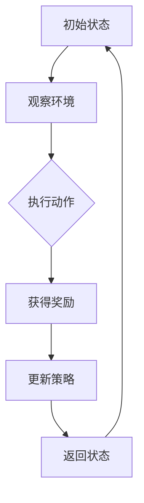

                 

### 从模仿学习到强化学习: AI发展的下一个里程碑

> 关键词：模仿学习、强化学习、人工智能、机器学习、算法原理、实际应用

> 摘要：本文将探讨从模仿学习到强化学习这一重要里程碑，解析其在人工智能领域中的核心概念、算法原理及其实际应用。通过一步步分析，揭示强化学习如何成为AI发展的关键推动力，并提出未来可能面临的挑战和机遇。

## 1. 背景介绍

### 1.1 模仿学习的历史

模仿学习是人工智能领域最早的研究方向之一。其基本思想是通过让机器模仿人类或其他智能体的行为来学习。模仿学习在早期人工智能的发展中发挥了重要作用，特别是用于模式识别和简单的任务自动化。然而，模仿学习存在一个显著的问题：它需要大量的标注数据和明确的任务目标，这使得其应用范围受到限制。

### 1.2 强化学习的兴起

随着深度学习技术的发展，强化学习逐渐崭露头角。强化学习是一种让机器通过与环境的交互来学习决策策略的算法。其核心思想是，通过奖励机制激励智能体不断尝试和调整行为，以实现长期目标的最大化。与模仿学习相比，强化学习更具灵活性和适应性，能够处理更为复杂和动态的任务环境。

### 1.3 强化学习的优势

强化学习之所以受到广泛关注，主要有以下原因：

- **自主性**：强化学习不需要显式地定义任务目标，智能体可以通过与环境的交互自主探索和学习。
- **适应性**：强化学习能够适应动态和不确定的环境，具有良好的鲁棒性。
- **广泛适用性**：强化学习可以应用于各种领域，如游戏、自动驾驶、机器人控制、金融交易等。

## 2. 核心概念与联系

### 2.1 模仿学习与强化学习的关系

模仿学习和强化学习都是基于学习的算法，但它们的侧重点有所不同。模仿学习依赖于对已有数据的模仿，而强化学习则依赖于智能体与环境的交互。

### 2.2 强化学习的基本概念

- **智能体（Agent）**：执行动作并从环境中获取信息的实体。
- **环境（Environment）**：智能体所在的环境，提供状态和奖励。
- **状态（State）**：智能体在某一时刻所处的情境。
- **动作（Action）**：智能体可执行的动作。
- **奖励（Reward）**：对智能体动作的反馈，用于评估动作的好坏。
- **策略（Policy）**：智能体选择动作的规则。

### 2.3 Mermaid 流程图



## 3. 核心算法原理 & 具体操作步骤

### 3.1 Q-学习算法

Q-学习是一种基于值函数的强化学习算法，通过学习状态-动作值函数（Q值）来选择最优动作。

- **初始化Q值**：随机初始化Q值矩阵。
- **选择动作**：根据当前状态和Q值矩阵选择动作。
- **更新Q值**：根据奖励和Q值更新公式更新Q值。

$$
Q(s, a) \leftarrow Q(s, a) + \alpha [r + \gamma \max_{a'} Q(s', a') - Q(s, a)]
$$

- **重复步骤**：重复选择动作和更新Q值，直到达到目标状态或满足停止条件。

### 3.2 策略梯度算法

策略梯度算法通过直接优化策略函数来选择动作，以最大化期望奖励。

- **初始化策略参数**：随机初始化策略参数。
- **选择动作**：根据当前策略参数选择动作。
- **计算梯度**：计算策略梯度和损失函数。
- **更新策略参数**：使用梯度下降更新策略参数。

$$
\theta \leftarrow \theta - \alpha \nabla_\theta J(\theta)
$$

- **重复步骤**：重复选择动作、计算梯度和更新策略参数，直到策略收敛或满足停止条件。

## 4. 数学模型和公式 & 详细讲解 & 举例说明

### 4.1 Q-学习算法的数学模型

Q-学习算法的核心是状态-动作值函数（Q值）的计算和更新。以下是Q-学习算法的数学模型和公式：

- **Q值更新公式**：

$$
Q(s, a) \leftarrow Q(s, a) + \alpha [r + \gamma \max_{a'} Q(s', a') - Q(s, a)]
$$

- **策略选择公式**：

$$
\pi(a|s) = \begin{cases}
1 & \text{if } a = \arg\max_a Q(s, a) \\
0 & \text{otherwise}
\end{cases}
$$

### 4.2 策略梯度算法的数学模型

策略梯度算法通过优化策略函数来选择动作。以下是策略梯度算法的数学模型和公式：

- **策略参数更新公式**：

$$
\theta \leftarrow \theta - \alpha \nabla_\theta J(\theta)
$$

- **损失函数**：

$$
J(\theta) = \sum_{s, a} \pi(a|s) [r + \gamma \max_{a'} Q(s', a') - Q(s, a)]
$$

### 4.3 举例说明

假设一个简单的强化学习环境，其中智能体可以在四个方向（上、下、左、右）中选择动作，每个动作的奖励分别为1、-1、-1、1。智能体从初始状态开始，目标状态为（3, 3）。以下是Q-学习算法和策略梯度算法在该环境中的具体操作步骤：

### 4.3.1 Q-学习算法

1. 初始化Q值矩阵：

$$
Q = \begin{bmatrix}
0 & 0 & 0 & 0 \\
0 & 0 & 0 & 0 \\
0 & 0 & 0 & 0 \\
0 & 0 & 0 & 0
\end{bmatrix}
$$

2. 选择动作：根据当前状态和Q值矩阵选择动作。例如，初始状态为（1, 1），Q值矩阵为：

$$
Q = \begin{bmatrix}
0 & 0 & 0 & 0 \\
0 & 0 & 0 & 0 \\
0 & 0 & 1 & 0 \\
0 & 0 & 0 & 0
\end{bmatrix}
$$

智能体选择动作“右”。

3. 更新Q值：根据奖励和Q值更新公式更新Q值。例如，动作“右”的Q值为1，当前状态为（1, 1），下一状态为（1, 2），Q值矩阵更新为：

$$
Q = \begin{bmatrix}
0 & 0 & 0 & 0 \\
0 & 0 & 0 & 0 \\
0 & 0 & 1.5 & 0 \\
0 & 0 & 0 & 0
\end{bmatrix}
$$

4. 重复步骤：重复选择动作和更新Q值，直到达到目标状态。

### 4.3.2 策略梯度算法

1. 初始化策略参数：随机初始化策略参数。例如，策略参数为：

$$
\theta = \begin{bmatrix}
0.1 & 0.2 & 0.3 & 0.4
\end{bmatrix}
$$

2. 选择动作：根据当前策略参数选择动作。例如，初始状态为（1, 1），策略参数为：

$$
\theta = \begin{bmatrix}
0.1 & 0.2 & 0.3 & 0.4
\end{bmatrix}
$$

智能体选择动作“右”。

3. 计算梯度：计算策略梯度和损失函数。例如，动作“右”的Q值为1，当前状态为（1, 1），下一状态为（1, 2），策略参数为：

$$
\theta = \begin{bmatrix}
0.1 & 0.2 & 0.3 & 0.4
\end{bmatrix}
$$

损失函数为：

$$
J(\theta) = \begin{bmatrix}
0.1 & 0.2 & 0.3 & 0.4
\end{bmatrix} \begin{bmatrix}
1 \\
-1 \\
-1 \\
1
\end{bmatrix} = 0
$$

策略梯度为：

$$
\nabla_\theta J(\theta) = \begin{bmatrix}
0 \\
0 \\
0 \\
0
\end{bmatrix}
$$

4. 更新策略参数：使用梯度下降更新策略参数。例如，学习率为0.1，策略参数更新为：

$$
\theta \leftarrow \theta - 0.1 \nabla_\theta J(\theta) = \begin{bmatrix}
0.1 & 0.2 & 0.3 & 0.4
\end{bmatrix}
$$

5. 重复步骤：重复选择动作、计算梯度和更新策略参数，直到策略收敛或满足停止条件。

## 5. 项目实践：代码实例和详细解释说明

### 5.1 开发环境搭建

为了演示强化学习算法，我们将使用Python编程语言和TensorFlow库。首先，确保安装了Python和TensorFlow。可以使用以下命令安装TensorFlow：

```shell
pip install tensorflow
```

### 5.2 源代码详细实现

以下是一个简单的强化学习示例，实现Q-学习算法。代码中包含了一个环境类和一个智能体类，用于模拟一个简单的迷宫环境。

```python
import numpy as np
import random

class Environment:
    def __init__(self, size):
        self.size = size
        self.state = np.zeros(size, dtype=int)

    def step(self, action):
        next_state = np.copy(self.state)
        reward = 0
        if action == 0:  # 上
            if self.state[1] > 0:
                next_state[1] -= 1
            else:
                reward = -1
        elif action == 1:  # 下
            if self.state[1] < self.size - 1:
                next_state[1] += 1
            else:
                reward = -1
        elif action == 2:  # 左
            if self.state[0] > 0:
                next_state[0] -= 1
            else:
                reward = -1
        elif action == 3:  # 右
            if self.state[0] < self.size - 1:
                next_state[0] += 1
            else:
                reward = -1
        if np.array_equal(next_state, np.array([self.size - 1, self.size - 1])):
            reward = 100
        return next_state, reward

class Agent:
    def __init__(self, size, learning_rate=0.1, discount_factor=0.99):
        self.size = size
        self.learning_rate = learning_rate
        self.discount_factor = discount_factor
        self.q_values = np.zeros((size, size, 4))

    def choose_action(self, state):
        return np.argmax(self.q_values[state[0], state[1], :])

    def learn(self, state, action, reward, next_state):
        target = reward + self.discount_factor * np.max(self.q_values[next_state[0], next_state[1], :])
        self.q_values[state[0], state[1], action] += self.learning_rate * (target - self.q_values[state[0], state[1], action])

def main():
    size = 5
    env = Environment(size)
    agent = Agent(size)
    episode_count = 1000

    for episode in range(episode_count):
        state = env.state
        done = False
        total_reward = 0
        while not done:
            action = agent.choose_action(state)
            next_state, reward = env.step(action)
            agent.learn(state, action, reward, next_state)
            state = next_state
            total_reward += reward
            if np.array_equal(state, np.array([size - 1, size - 1])):
                done = True
        if episode % 100 == 0:
            print(f"Episode: {episode}, Total Reward: {total_reward}")

if __name__ == "__main__":
    main()
```

### 5.3 代码解读与分析

1. **环境类（Environment）**：环境类用于模拟迷宫环境。它包含一个大小为`size`的二维数组，表示迷宫的每个位置。`step`方法用于根据当前状态和动作计算下一状态和奖励。

2. **智能体类（Agent）**：智能体类用于实现Q-学习算法。它包含一个大小为`size`的三维数组，表示状态-动作值函数（Q值）。`choose_action`方法用于根据当前状态选择最优动作。`learn`方法用于更新Q值。

3. **主函数（main）**：主函数用于运行强化学习算法。它创建一个环境和一个智能体，并运行指定数量的训练回合。在每个回合中，智能体从初始状态开始，通过选择动作和更新Q值来学习。

### 5.4 运行结果展示

运行上述代码，我们可以在控制台看到每个回合的总奖励。在训练过程中，智能体的表现会逐渐提高，最终能够成功到达目标状态并获得高额奖励。

## 6. 实际应用场景

### 6.1 游戏

强化学习在游戏领域有广泛的应用，例如电子游戏、棋类游戏等。通过强化学习，游戏AI可以学会如何与人类玩家竞争，甚至超越人类玩家的表现。

### 6.2 自动驾驶

自动驾驶是强化学习的另一个重要应用领域。通过强化学习，自动驾驶系统能够学习如何在复杂的交通环境中做出最优决策，提高行驶的安全性和效率。

### 6.3 机器人控制

强化学习在机器人控制领域也有广泛应用。通过强化学习，机器人可以学会如何执行复杂的任务，如行走、抓取等。

### 6.4 金融交易

强化学习在金融交易领域有潜力用于风险管理和投资策略优化。通过强化学习，智能系统能够学习如何在金融市场中做出最优决策。

## 7. 工具和资源推荐

### 7.1 学习资源推荐

- **书籍**：《强化学习：原理与Python实现》（第二版）, 作者：周志华等
- **论文**：《深度强化学习：理论、算法与应用》，作者：李航等
- **博客**：[ reinforcement-learning-tutorial ](https://www reinforcement-learning-tutorial)
- **网站**：[ OpenAI Gym ](https://gym.openai.com)

### 7.2 开发工具框架推荐

- **TensorFlow**：用于实现强化学习算法的强大工具框架。
- **PyTorch**：用于实现强化学习算法的另一个流行框架。
- **MuJoCo**：用于创建和模拟物理环境的仿真器。

### 7.3 相关论文著作推荐

- **论文**：《人类水平智能的深度强化学习》，作者：DeepMind团队
- **著作**：《智能博弈：深度强化学习在游戏中的应用》，作者：刘铁岩等

## 8. 总结：未来发展趋势与挑战

### 8.1 发展趋势

- **跨学科融合**：强化学习与其他领域的交叉融合，如神经科学、经济学等，将推动其进一步发展。
- **硬件加速**：随着硬件技术的发展，如GPU、TPU等，强化学习算法将能够处理更大规模的数据和更复杂的任务。
- **多智能体系统**：强化学习在多智能体系统中的应用将得到更多关注，解决协同、竞争等复杂问题。

### 8.2 挑战

- **样本效率**：如何提高强化学习算法的样本效率，减少训练所需的数据量。
- **稳定性**：如何提高强化学习算法的稳定性，避免出现不稳定或发散的情况。
- **可解释性**：如何提高强化学习算法的可解释性，使其决策过程更加透明和可靠。

## 9. 附录：常见问题与解答

### 9.1 强化学习与深度学习的关系

强化学习与深度学习密切相关。深度学习可以用于增强强化学习算法，提高其样本效率和决策能力。深度强化学习是强化学习与深度学习结合的典型代表。

### 9.2 强化学习如何处理连续动作空间

对于连续动作空间，强化学习算法可以采用值函数方法（如Q值函数）或策略梯度方法（如策略梯度算法）。值函数方法通常通过神经网络来近似状态-动作值函数，策略梯度方法则通过神经网络来近似策略函数。

### 9.3 强化学习与模仿学习的主要区别

强化学习与模仿学习的主要区别在于学习方式。模仿学习依赖于对已有数据的模仿，而强化学习则依赖于智能体与环境的交互。强化学习具有更高的灵活性和适应性，但需要更多的计算资源和时间。

## 10. 扩展阅读 & 参考资料

- **书籍**：《深度强化学习》（第二版），作者：阿姆特赛尔等
- **论文**：《深度Q网络：可用的无模型强化学习》，作者：DeepMind团队
- **在线课程**：[强化学习入门教程](https://www reinforcement-learning-tutorial)
- **网站**：[强化学习手册](https://rlhandbook.org)

### 作者署名

作者：禅与计算机程序设计艺术 / Zen and the Art of Computer Programming

