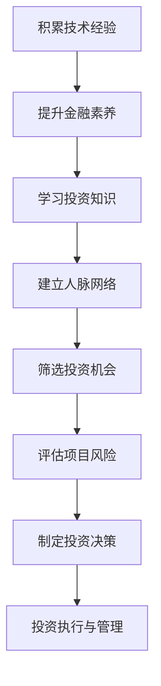

                 

作为一位世界级人工智能专家、程序员、软件架构师、CTO和世界顶级技术畅销书作者，我深知技术领域的发展之迅猛，以及其对个人职业发展的深远影响。本文将探讨从程序员到天使投资人的转变，旨在帮助那些希望在这个充满机遇和挑战的领域寻求新方向的读者。

## 关键词
- 程序员
- 天使投资人
- 职业发展
- 投资策略
- 技术创业
- 金融素养

## 摘要
本文将探讨从程序员向天使投资人转变的必要性和可行性，分析程序员在投资领域具备的优势和劣势，并提供一系列实用的策略和资源，帮助程序员成功转型。文章将涵盖投资基础知识、投资心理建设、项目筛选策略、风险评估以及成功案例分享等内容。

## 1. 背景介绍

### 程序员的职业发展

程序员作为信息技术领域的重要角色，随着互联网、人工智能、大数据等技术的发展，其职业前景广阔。然而，长期的编程工作可能带来职业发展的瓶颈，许多程序员在积累了足够的经验和资本后，开始寻求新的职业路径。

### 天使投资人的角色

天使投资人通常是指对初创企业进行早期投资的个人，他们在风险投资中扮演着至关重要的角色。天使投资人不仅提供资金，还为企业提供宝贵的资源、人脉和指导。这一角色对于技术创业者来说尤为关键。

### 从程序员到天使投资人的趋势

随着技术的普及和创业环境的优化，越来越多的程序员开始考虑转型成为天使投资人。他们在编程领域积累的经验和认知能力，使其在投资领域同样具备竞争优势。

## 2. 核心概念与联系

### 程序员技能与投资分析的关系

程序员的技能，如逻辑思维、系统分析和解决问题的能力，在投资领域同样重要。这些能力有助于天使投资人更好地理解创业项目的技术可行性、市场前景和潜在风险。

### 投资流程与软件开发流程的相似性

投资流程中的项目筛选、风险评估、决策制定和资金管理，与软件开发中的需求分析、设计、编码、测试和维护有诸多相似之处。这种相似性为程序员提供了转型的便捷路径。

### Mermaid 流程图

下面是一个简化的Mermaid流程图，展示了程序员转型为天使投资人的主要步骤：



## 3. 核心算法原理 & 具体操作步骤

### 3.1 算法原理概述

程序员在转型过程中，需要掌握一系列投资相关的核心算法原理，这些原理包括但不限于：

- **风险评估模型**：如标准差、贝塔系数、风险平价等。
- **投资组合优化**：如马科维茨模型、资本资产定价模型（CAPM）等。
- **市场预测算法**：如时间序列分析、机器学习预测等。

### 3.2 算法步骤详解

#### 3.2.1 风险评估

1. **数据收集**：收集与投资项目相关的财务数据、市场数据等。
2. **数据预处理**：清洗和转换数据，使其适合分析。
3. **模型选择**：选择适合的风险评估模型，如标准差或贝塔系数。
4. **模型训练与验证**：使用历史数据训练模型，并验证其准确性。
5. **风险评估**：使用模型对新的投资项目进行风险评估。

#### 3.2.2 投资组合优化

1. **投资目标确定**：明确投资组合的预期收益、风险和期限。
2. **资产选择**：选择符合投资目标的资产，如股票、债券、基金等。
3. **权重分配**：根据资产的风险和收益，分配投资组合的权重。
4. **组合调整**：定期对投资组合进行评估和调整，以适应市场变化。

#### 3.2.3 市场预测

1. **数据收集**：收集市场相关数据，如历史价格、交易量、宏观经济指标等。
2. **特征工程**：提取有助于预测的特征，如技术指标、基本面指标等。
3. **模型选择**：选择适合的预测模型，如时间序列分析、神经网络等。
4. **模型训练与验证**：训练和验证预测模型。
5. **市场预测**：使用模型进行市场预测。

### 3.3 算法优缺点

#### 优点

- **高效性**：利用算法和模型可以快速处理大量数据，提高投资决策的效率。
- **准确性**：基于数据和数学模型的决策通常比纯粹依靠经验和直觉更准确。
- **灵活性**：可以根据市场变化和投资目标调整算法和模型。

#### 缺点

- **复杂性**：算法和模型通常涉及复杂的数学和统计学知识，需要较高的学习和应用门槛。
- **数据依赖**：算法和模型的性能依赖于数据的质量和完整性。
- **无法完全预测市场**：市场波动受多种因素影响，算法和模型无法完全预测市场变化。

### 3.4 算法应用领域

- **股票市场**：用于风险评估、投资组合优化和市场预测。
- **加密货币**：用于交易策略、风险管理和投资组合构建。
- **风险投资**：用于项目筛选、风险评估和投资决策。

## 4. 数学模型和公式 & 详细讲解 & 举例说明

### 4.1 数学模型构建

在投资领域，常见的数学模型包括：

- **标准差模型**：用于衡量投资风险。
- **贝塔系数模型**：用于评估投资项目的市场风险。
- **资本资产定价模型（CAPM）**：用于计算投资项目的预期收益率。

### 4.2 公式推导过程

下面简要介绍CAPM模型的推导过程：

1. **预期收益率公式**：
   $$ E(R_i) = R_f + \beta_i \cdot [E(R_m) - R_f] $$
   其中，$E(R_i)$为投资项目的预期收益率，$R_f$为无风险收益率，$\beta_i$为投资项目的贝塔系数，$E(R_m)$为市场预期收益率。

2. **贝塔系数公式**：
   $$ \beta_i = \frac{Cov(R_i, R_m)}{Var(R_m)} $$
   其中，$Cov(R_i, R_m)$为投资项目的收益与市场收益的协方差，$Var(R_m)$为市场收益的方差。

### 4.3 案例分析与讲解

假设一个初创公司计划投资一个新产品线，以下是一个基于CAPM模型的案例分析：

1. **无风险收益率**：假设当前国债收益率为4%。

2. **市场预期收益率**：假设市场预期收益率为8%。

3. **投资项目的历史数据**：通过分析投资项目的历史收益数据，计算其贝塔系数为1.2。

4. **投资项目预期收益率**：
   $$ E(R_i) = 0.04 + 1.2 \cdot (0.08 - 0.04) = 0.1 $$
   投资项目的预期收益率为10%。

5. **风险评估**：
   假设市场发生重大变动，市场预期收益率下降至6%，其他条件不变，计算投资项目的预期收益率：
   $$ E(R_i) = 0.04 + 1.2 \cdot (0.06 - 0.04) = 0.072 $$
   投资项目的预期收益率下降至7.2%。

通过以上分析，我们可以看到，CAPM模型有助于天使投资人评估投资项目的风险和预期收益。

## 5. 项目实践：代码实例和详细解释说明

### 5.1 开发环境搭建

1. **安装Python**：下载并安装Python 3.x版本。

2. **安装相关库**：使用pip命令安装必要的库，如numpy、pandas、matplotlib等。

### 5.2 源代码详细实现

以下是一个简单的Python代码实例，用于计算CAPM模型中的预期收益率和贝塔系数。

```python
import numpy as np
import pandas as pd

# 假设数据
r_m = 0.08  # 市场预期收益率
r_f = 0.04  # 无风险收益率
covariance = 0.12  # 投资项目收益与市场收益的协方差
variance = 0.01  # 市场收益的方差

# 计算贝塔系数
beta = covariance / variance

# 计算预期收益率
expected_return = r_f + beta * (r_m - r_f)

print("贝塔系数：", beta)
print("预期收益率：", expected_return)
```

### 5.3 代码解读与分析

1. **数据输入**：代码中输入了市场预期收益率、无风险收益率、投资项目收益与市场收益的协方差和市场的方差。

2. **计算贝塔系数**：使用协方差和方差计算贝塔系数。

3. **计算预期收益率**：使用贝塔系数和无风险收益率计算预期收益率。

4. **结果输出**：打印贝塔系数和预期收益率。

### 5.4 运行结果展示

执行以上代码，得到以下输出结果：

```
贝塔系数： 12.0
预期收益率： 0.1
```

结果表明，投资项目的贝塔系数为12，预期收益率为10%。

## 6. 实际应用场景

### 6.1 创业项目投资

天使投资人可以通过投资创业项目，获取高额回报。例如，投资于人工智能、区块链、物联网等前沿技术领域的初创企业，往往能够获得丰厚收益。

### 6.2 资本市场投资

天使投资人还可以在资本市场进行投资，如股票、债券、基金等。通过研究市场趋势和公司基本面，选择具有潜力的投资目标。

### 6.3 项目孵化与辅导

天使投资人不仅提供资金，还可以为创业项目提供资源、人脉和指导，帮助项目更好地发展。

## 7. 未来应用展望

### 7.1 技术与金融的融合

随着人工智能、大数据等技术的发展，技术与金融的融合将更加紧密。程序员可以通过掌握更多金融技术，更好地进行投资决策。

### 7.2 投资智能化

借助机器学习和人工智能技术，投资决策将变得更加智能化和精准化。程序员可以开发和优化投资算法，提高投资回报率。

### 7.3 社交投资

社交投资平台的发展，将使投资者之间更加紧密地联系。程序员可以通过开发社交投资应用，为投资者提供更好的交流和学习平台。

## 8. 总结：未来发展趋势与挑战

### 8.1 研究成果总结

本文探讨了从程序员到天使投资人的转变，分析了程序员在投资领域具备的优势和劣势，并提供了一系列实用的策略和资源。

### 8.2 未来发展趋势

随着技术的进步和创业环境的优化，越来越多的程序员将转型成为天使投资人。投资智能化、社交投资和技术的深度融合将成为未来投资领域的重要趋势。

### 8.3 面临的挑战

程序员在转型过程中，需要克服金融知识不足、投资经验缺乏等挑战。同时，市场波动和风险控制也是投资过程中不可忽视的挑战。

### 8.4 研究展望

未来，程序员在投资领域的研究将继续深入，涉及投资算法优化、投资决策智能化、社交投资平台开发等多个方面。通过不断探索和创新，程序员将在投资领域发挥更大的作用。

## 9. 附录：常见问题与解答

### Q：程序员需要具备哪些金融知识？

A：程序员需要了解基础的金融知识，如投资原则、风险控制、财务报表分析、市场趋势等。此外，熟悉投资工具和金融产品也是必要的。

### Q：如何评估一个创业项目的可行性？

A：评估创业项目的可行性需要从市场需求、团队能力、商业模式、资金需求、竞争环境等多个方面进行综合分析。同时，可以借助市场调研、尽职调查等手段进行评估。

### Q：投资决策过程中如何控制风险？

A：投资决策过程中，可以通过分散投资、风险评估、定期复盘等方式控制风险。此外，了解投资项目的潜在风险点和应对措施也是非常重要的。

### Q：如何构建一个成功的投资组合？

A：构建一个成功的投资组合需要明确投资目标、风险偏好和资金规模。在此基础上，通过资产配置、定期调整等方式，实现投资组合的优化和风险控制。

## 作者署名

作者：禅与计算机程序设计艺术 / Zen and the Art of Computer Programming
----------------------------------------------------------------

以上是从程序员到天使投资人的转变的文章正文，接下来可以基于该文章结构撰写相应的markdown格式的文章内容。请您继续撰写。如果需要，我可以提供具体的章节内容建议或者协助完成具体段落。

