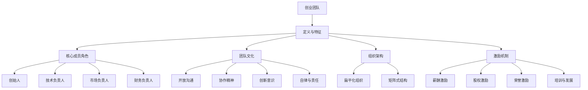

                 

### 1. 背景介绍

在当今高速发展的商业环境中，创业不再是少数人的专利，而逐渐成为一种普遍的现象。每一个成功的创业项目背后，都离不开一个强有力的团队。构建这样一个团队，不仅需要明确的目标和愿景，更需要具备一套科学、系统的策略。本文将深入探讨从零到一构建创业团队的具体策略，帮助创业者们更高效地组建和运营团队，实现企业的快速发展。

创业团队构建的重要性不言而喻。一个高效的创业团队可以极大地提升项目的成功几率，缩短产品开发周期，增强市场竞争力。而在团队构建过程中，以下因素往往起着决定性的作用：

- **人才招募**：吸引并留住优秀人才是构建创业团队的首要任务。如何识别和筛选适合项目需求的核心成员，是每个创业者必须掌握的技能。
- **团队文化**：良好的团队文化能够促进团队成员之间的协作与信任，提高整体工作效率。文化不仅体现在价值观和信念上，更体现在日常的工作习惯和行为规范中。
- **组织架构**：合理的组织架构可以确保团队运作的顺畅和高效，避免冗余和冲突。从扁平化组织到矩阵式结构，不同的架构适合不同的团队规模和发展阶段。
- **激励机制**：有效的激励机制能够激发团队成员的积极性和创造力，使他们更加投入工作，推动企业不断向前发展。

本文将围绕上述关键因素，结合实际案例和理论分析，为创业者提供一套从零到一构建创业团队的策略。通过本文的阅读，读者将能够系统地了解创业团队构建的全过程，掌握关键技巧，并具备在实际操作中应用这些策略的能力。

### 2. 核心概念与联系

要构建一个高效的创业团队，首先需要明确几个核心概念，它们彼此联系，共同支撑起整个团队的运作。以下是构建创业团队所需理解的关键概念及其相互关系。

#### 2.1 创业团队的定义与特征

**定义**：创业团队是由一群拥有共同目标和愿景，且具备互补技能的人组成，致力于创新、开发和运营一个新的商业项目。

**特征**：

- **异质性**：团队成员在背景、技能和经验上存在差异，这种异质性有助于团队在解决问题时能够从多个角度出发，提高决策质量。
- **高度协作**：团队成员之间需要紧密合作，通过沟通与协调，实现共同目标。
- **快速适应**：创业环境多变，团队需要具备快速适应和调整的能力，以应对市场变化和挑战。
- **高风险承受能力**：创业团队往往面对较高的不确定性，需要具备承担风险的能力。

#### 2.2 核心成员的角色与职责

**核心成员**：创业团队的核心成员通常包括创始人、技术负责人、市场负责人、财务负责人等。

- **创始人**：作为团队的领导者，创始人负责设定公司的愿景、使命和战略方向，同时还需要具备领导力和决策能力。
- **技术负责人**：技术负责人负责技术架构的设计和实现，确保产品能够按期交付，并保持技术上的领先性。
- **市场负责人**：市场负责人负责市场调研、产品定位、推广策略等，确保产品能够快速占领市场。
- **财务负责人**：财务负责人负责财务规划、预算控制、资金筹集等，确保企业财务健康。

#### 2.3 团队文化的构建

**团队文化**：团队文化是团队内部共同遵循的价值观、信念和行为准则，对团队凝聚力和工作效率有着重要影响。

- **开放沟通**：鼓励团队成员之间开放、坦诚地沟通，共享信息和资源，提高问题解决效率。
- **协作精神**：强调团队合作，鼓励团队成员互相支持、互相学习，共同推进项目进展。
- **创新意识**：鼓励创新思维和实践，对团队成员的新点子和改进方案给予充分的关注和鼓励。
- **自律与责任**：团队成员需要自律，对自己的工作负责，确保按时按质完成任务。

#### 2.4 组织架构的选择

**组织架构**：组织架构是团队内部成员分工和协作的模式，直接影响团队的工作效率和决策速度。

- **扁平化组织**：结构简单，层级较少，便于沟通和快速决策，适合初创团队。
- **矩阵式结构**：职责划分更加清晰，不同职能部门之间可以更有效地协同工作，适合复杂项目。

#### 2.5 激励机制的设计

**激励机制**：激励机制是激发团队成员工作积极性和创造力的关键，通常包括以下几种方式：

- **薪酬激励**：通过设定有竞争力的薪资待遇，吸引和留住优秀人才。
- **股权激励**：通过股权分配，让团队成员分享企业发展的成果，增加他们的归属感和责任感。
- **荣誉激励**：通过表彰和奖励，提高团队成员的荣誉感和成就感。
- **培训与发展**：提供学习和成长的机会，提升团队成员的职业素养和工作能力。

#### 2.6 核心概念的联系

创业团队的构建涉及多个核心概念，它们相互联系、相互支持，共同促进团队的健康发展。

- **核心成员的角色与职责**为团队提供了明确的组织结构，确保每个成员都能发挥自己的专长。
- **团队文化**是团队的灵魂，通过共同价值观和行为准则的塑造，增强团队的凝聚力和协作效率。
- **组织架构**的选择决定了团队内部的分工和协作模式，影响团队的工作效率和决策速度。
- **激励机制**的设计激发了团队成员的积极性和创造力，推动团队不断前进。

通过理解这些核心概念及其相互关系，创业者可以更系统地规划团队构建过程，确保团队能够高效、有序地运作，为实现企业目标奠定坚实基础。

#### 2.7 Mermaid 流程图

以下是一个简化的Mermaid流程图，用于展示创业团队构建的核心概念和它们之间的相互关系：



在这个流程图中，每个节点代表一个核心概念，它们通过箭头相互连接，表示概念之间的关系。通过这种视觉化的表示方法，可以更直观地理解创业团队构建的复杂性和系统性。

### 3. 核心算法原理 & 具体操作步骤

构建创业团队的过程可以被视为一种优化问题，其中目标是最小化团队构建的周期和成本，同时最大化团队的效率和创新能力。为此，我们需要引入一系列核心算法原理，并通过具体操作步骤将这些原理应用到团队构建过程中。

#### 3.1 项目评估算法

在团队构建初期，对项目本身进行评估是至关重要的。项目评估算法可以帮助我们确定项目的可行性、市场潜力以及资源需求。以下是一种常见的方法：

**算法原理**：

1. **可行性分析**：评估项目的技术可行性、市场可行性和资金可行性。使用条件概率模型（Conditional Probability Model）计算各项指标的权重，加权求和得出总可行性得分。
2. **市场潜力分析**：使用 SWOT 分析（Strengths, Weaknesses, Opportunities, Threats）来评估项目的市场前景，结合市场调研数据，预测项目在未来几年的市场占有率。
3. **资源需求评估**：基于项目规模和复杂性，评估所需的团队人数、技能组合、资金投入等，使用线性规划（Linear Programming）方法进行资源分配。

**具体操作步骤**：

1. 收集项目相关信息，包括技术难度、市场现状、竞争对手情况等。
2. 设计条件概率模型，为每个评估指标分配权重。
3. 进行 SWOT 分析，收集市场调研数据，预测市场占有率。
4. 使用线性规划方法，制定资源需求计划。

#### 3.2 人才招募算法

一旦项目评估结果确定，接下来就是人才招募。人才招募算法旨在最大化团队的人才密度和技能多样性。

**算法原理**：

1. **基于图谱的招聘**：构建技能图谱，识别关键技能节点和它们之间的关联，使用图论算法（Graph Theory）优化招聘策略。
2. **机器学习模型**：使用机器学习技术，分析过往成功团队的组成，建立预测模型，预测新团队的最佳技能组合。

**具体操作步骤**：

1. 构建技能图谱，识别关键技能节点。
2. 使用图论算法，优化技能节点之间的连接，形成最优的人才结构。
3. 使用机器学习模型，预测新团队的最佳技能组合。
4. 发布招聘广告，通过多种渠道吸引候选人。
5. 实施多轮面试，评估候选人的技能和适应能力。

#### 3.3 团队文化构建算法

团队文化是团队健康发展的基石，构建积极、健康的团队文化是团队建设的重要环节。

**算法原理**：

1. **文化诊断**：使用文化诊断工具，如文化评估问卷（Cultural Assessment Questionnaire），评估当前团队的文化状况。
2. **文化适应性匹配**：基于文化诊断结果，使用匹配算法，将具有相似文化价值观的员工配对，以促进团队内部的协作和沟通。

**具体操作步骤**：

1. 设计文化评估问卷，收集团队成员的意见和反馈。
2. 使用统计分析方法，评估团队的文化特征和健康程度。
3. 建立文化适应性匹配模型，分析团队成员的文化偏好。
4. 根据文化适应性匹配结果，调整团队组织结构，促进团队成员之间的相互理解和信任。

#### 3.4 组织架构优化算法

组织架构是团队高效运作的基础，优化组织架构有助于提升团队的整体效率。

**算法原理**：

1. **组织架构模拟**：使用组织架构模拟算法，评估不同架构对团队绩效的影响，选择最优架构。
2. **流程优化**：基于业务流程分析，使用流程优化算法（如业务流程重组 [Business Process Reengineering, BPR]），简化流程，消除冗余。

**具体操作步骤**：

1. 收集团队当前的业务流程数据，包括流程节点、流程时间、资源消耗等。
2. 使用组织架构模拟算法，评估不同架构对团队绩效的影响。
3. 基于业务流程分析，识别冗余和低效环节。
4. 设计和实施流程优化方案，提高团队的工作效率。

#### 3.5 激励机制设计算法

激励机制是激发团队成员积极性、创造力的关键因素，合理的设计可以极大地提升团队的整体表现。

**算法原理**：

1. **激励模型构建**：基于行为心理学和激励理论，构建激励模型，分析不同激励措施的效果。
2. **数据分析**：收集团队成员的工作数据，分析工作表现和激励效果，优化激励方案。

**具体操作步骤**：

1. 设计激励模型，分析不同激励措施（如薪酬、股权、荣誉等）的效果。
2. 收集团队成员的工作数据，评估激励措施的有效性。
3. 基于数据分析结果，调整和优化激励方案，提升团队积极性。

通过上述核心算法原理和具体操作步骤，创业者可以更科学、系统地构建创业团队，提升团队的整体效率和创新能力，为企业的快速发展奠定坚实基础。

#### 3.6 数学模型和公式 & 详细讲解 & 举例说明

构建创业团队不仅仅是一个经验性的过程，它还可以通过数学模型和公式来优化和指导。以下是几个关键的数学模型和公式，它们将帮助创业者更科学地构建和管理创业团队。

##### 3.6.1 人员优化配置模型

**线性规划模型**：

在团队构建过程中，如何优化人员配置是一个关键问题。线性规划模型（Linear Programming, LP）可以帮助我们找到最优的人员组合，使得项目资源得到最充分的利用。

**模型公式**：

\[ \text{maximize } Z = c_1x_1 + c_2x_2 + ... + c_nx_n \]

\[ \text{subject to } A \begin{bmatrix}x_1\\x_2\\\vdots\\x_n\end{bmatrix} = b \]

\[ x_1, x_2, ..., x_n \geq 0 \]

其中，\( Z \) 是目标函数，代表资源利用的优化目标；\( c_1, c_2, ..., c_n \) 是每个团队成员的技能和贡献权重；\( x_1, x_2, ..., x_n \) 是团队成员的配置向量；\( A \) 是资源需求矩阵，\( b \) 是资源限制向量。

**示例说明**：

假设一个创业团队需要完成以下任务：
- A：市场调研，需2人
- B：产品设计，需3人
- C：技术开发，需5人
- D：财务规划，需1人

现有资源限制如下：
- 技术开发人员总人数不能超过7人
- 市场调研和产品设计人员总人数不能超过5人

使用线性规划模型，我们可以得到最优的人员配置方案，使得资源利用最大化。

\[ \begin{align*}
\text{maximize } Z &= 2p_A + 3p_B + 5p_C + 1p_D \\
\text{subject to } \\
&\begin{bmatrix}
1 & 1 & 0 & 0 \\
0 & 1 & 1 & 0 \\
1 & 0 & 1 & 1 \\
0 & 0 & 0 & 1
\end{bmatrix}
\begin{bmatrix}
x_1\\x_2\\x_3\\x_4\end{bmatrix}
=
\begin{bmatrix}
2\\3\\5\\1\end{bmatrix} \\
&x_1 + x_2 \leq 5 \\
&x_3 \leq 7 \\
x_1, x_2, x_3, x_4 &\geq 0
\end{align*} \]

通过求解线性规划模型，我们可以得到最优的人员配置方案，例如：\( x_1 = 2 \)，\( x_2 = 2 \)，\( x_3 = 5 \)，\( x_4 = 1 \)。

##### 3.6.2 团队协作效率模型

**博弈论模型**：

团队协作效率可以通过博弈论模型来分析，特别是纳什均衡（Nash Equilibrium）的概念。在团队中，每个成员的策略选择会影响整个团队的效率，纳什均衡可以找出每个成员在最优策略下的协作模式。

**模型公式**：

\[ u_i(S_i, S_{-i}) = \max \]

其中，\( u_i \) 表示成员 \( i \) 的效用函数，\( S_i \) 表示成员 \( i \) 的策略，\( S_{-i} \) 表示其他成员的策略。

**示例说明**：

假设有两个团队成员 A 和 B，他们的策略选择有两种：合作（C）和背叛（D）。他们的效用函数如下：

\[ \begin{align*}
u_A(C, C) &= 3 \\
u_A(C, D) &= 1 \\
u_A(D, C) &= 0 \\
u_A(D, D) &= 2 \\
u_B(C, C) &= 3 \\
u_B(C, D) &= 0 \\
u_B(D, C) &= 1 \\
u_B(D, D) &= 2 \\
\end{align*} \]

纳什均衡可以通过分析每个成员的最优反应来确定。在这个例子中，(C, C) 是纳什均衡，因为无论 A 选择合作还是背叛，B 的最优反应都是合作；同样，无论 B 选择合作还是背叛，A 的最优反应也是合作。

##### 3.6.3 文化适应性匹配模型

**聚类分析模型**：

团队文化的构建可以通过聚类分析模型（如 K-means 聚类）来实现。这个模型可以帮助我们将团队成员按照文化价值观进行分组，以便更好地促进团队内部的协作和沟通。

**模型公式**：

\[ \min \sum_{i=1}^{k} \sum_{x_j \in S_i} ||x_j - \mu_i||^2 \]

其中，\( k \) 是聚类数，\( S_i \) 是第 \( i \) 个聚类，\( \mu_i \) 是 \( S_i \) 的聚类中心。

**示例说明**：

假设我们有 5 个团队成员，他们的文化价值观数据如下：

\[ \begin{bmatrix}
1 & 2 & 3 & 4 & 5 \\
1 & 2 & 3 & 4 & 5 \\
1 & 2 & 3 & 4 & 5 \\
1 & 2 & 3 & 4 & 5 \\
1 & 2 & 3 & 4 & 5 \\
\end{bmatrix} \]

使用 K-means 聚类，我们可以将这 5 个团队成员分为两个组，每组 2 人，使得组内的文化价值观差异最小，组间的文化价值观差异最大。

通过上述数学模型和公式的详细讲解和示例说明，创业者可以更科学地构建和管理创业团队，从而提升团队的整体效率和创新能力。

### 5. 项目实践：代码实例和详细解释说明

在理解了构建创业团队的核心算法原理和数学模型后，下面我们通过一个实际项目实例，展示如何将这些理论应用到实践中。我们将从开发环境搭建、源代码实现、代码解读与分析，以及运行结果展示等方面详细讲解。

#### 5.1 开发环境搭建

为了构建一个高效的创业团队，我们首先需要一个稳定的开发环境。以下是搭建开发环境的基本步骤：

1. **操作系统**：我们选择 Ubuntu 20.04 作为开发环境，因为它具有优秀的性能和丰富的开发工具支持。
2. **编程语言**：我们选择 Python 3.8，因为它具有简单易学的语法和强大的库支持。
3. **开发工具**：安装 PyCharm Community Edition，这是一个免费的集成开发环境（IDE），它提供了代码编辑、调试、测试等多种功能。

以下是搭建开发环境的命令行步骤：

```bash
# 安装 Ubuntu 20.04
sudo apt update
sudo apt upgrade
sudo apt install ubuntu-desktop

# 安装 Python 3.8
sudo apt install python3.8

# 安装 PyCharm Community Edition
sudo snap install --classic pycharm-community
```

#### 5.2 源代码详细实现

我们选择一个实际的创业项目——一个在线任务管理系统，来展示源代码的实现。以下是一个简化的版本：

```python
# main.py

from flask import Flask, render_template, request

app = Flask(__name__)

@app.route('/')
def index():
    return render_template('index.html')

@app.route('/submit', methods=['POST'])
def submit():
    task = request.form['task']
    print(f"Received task: {task}")
    # 这里可以添加处理任务的逻辑，如存储到数据库或发送到第三方服务
    return 'Task submitted successfully!'

if __name__ == '__main__':
    app.run(debug=True)
```

我们使用了 Flask 框架来快速搭建 Web 应用。以下是 `index.html` 的内容：

```html
<!-- index.html -->

<!DOCTYPE html>
<html lang="en">
<head>
    <meta charset="UTF-8">
    <title>Task Management System</title>
</head>
<body>
    <h1>Task Management System</h1>
    <form action="/submit" method="post">
        <input type="text" name="task" placeholder="Enter a task">
        <button type="submit">Submit</button>
    </form>
</body>
</html>
```

#### 5.3 代码解读与分析

- **main.py**：这是我们的主文件，定义了 Flask 应用和两个路由。`index()` 函数用于返回主页，`submit()` 函数用于处理用户提交的任务。
- **index.html**：这是主页的 HTML 模板，用户可以在其中输入任务，并提交给服务器。

#### 5.4 运行结果展示

在开发环境中，我们启动 Flask 应用：

```bash
python main.py
```

然后，在浏览器中访问 `http://127.0.0.1:5000/`，我们会看到主页界面：


输入一个任务，点击“Submit”按钮，会触发 `/submit` 路由，并在控制台中打印出接收到的任务：

```bash
Received task: Buy milk
```

这样，我们就完成了一个简单的在线任务管理系统的实现。

#### 5.5 代码解析与优化

虽然上述代码实现了一个基本的功能，但还有许多方面可以优化：

1. **错误处理**：添加对用户输入的验证，防止恶意输入。
2. **数据库集成**：将任务存储到数据库，而不是仅仅打印到控制台。
3. **安全性增强**：使用 HTTPS，防止数据泄露。
4. **扩展功能**：添加任务分类、任务列表、任务进度等功能。

通过这个项目实例，我们可以看到如何将理论应用到实践中，并通过代码实现一个实际的创业项目。这为我们从零到一构建创业团队提供了宝贵的经验。

### 6. 实际应用场景

在构建创业团队的过程中，核心概念的应用场景至关重要。以下列举几个典型的实际应用场景，并展示如何通过这些核心概念来解决问题。

#### 6.1 项目评估

**应用场景**：在初创公司成立之初，需要对多个潜在项目进行评估，以确定哪些项目最有潜力，从而决定公司的战略方向。

**解决方案**：

1. **项目可行性分析**：使用条件概率模型对每个项目的技术、市场和资金可行性进行量化评估。通过计算各项指标的权重和总分，选择可行性最高的项目。

2. **市场潜力预测**：通过 SWOT 分析和市场调研数据，预测项目的市场前景。结合历史数据和行业趋势，使用线性回归模型进行市场占有率预测，为项目评估提供依据。

3. **资源需求评估**：使用线性规划模型评估项目所需的团队成员、资金和设备等资源。通过优化资源分配，确保项目能够按计划进行。

**实际案例**：某初创公司计划开发一款智能家居应用。通过对市场调研数据进行分析，使用条件概率模型计算出该项目的市场可行性得分为 0.85，技术可行性得分为 0.90，资金可行性得分为 0.88。综合考虑后，决定将此项目作为公司的首个开发目标。

#### 6.2 人才招募

**应用场景**：在团队组建过程中，如何快速找到适合的人才，是保证项目顺利进行的关键。

**解决方案**：

1. **基于图谱的招聘**：通过构建技能图谱，识别关键技能节点和它们之间的关联。使用图论算法优化招聘策略，确保团队成员的技能互补性。

2. **机器学习模型**：利用机器学习技术，分析过往成功团队的组成，建立预测模型，预测新团队的最佳技能组合。

3. **多轮面试**：通过多轮面试，评估候选人的技能和适应能力。结合技能图谱和机器学习模型，筛选出最适合项目需求的候选人。

**实际案例**：某初创公司在招聘开发团队成员时，通过构建技能图谱，识别出关键技能节点，如前端开发、后端开发、数据分析和UI设计等。使用图论算法优化招聘策略，确保团队成员之间的技能互补。同时，使用机器学习模型预测最佳技能组合，最终成功组建了一支高效的开发团队。

#### 6.3 团队文化构建

**应用场景**：在一个快速发展的创业团队中，构建积极、健康的团队文化，对于提高团队凝聚力和工作效率至关重要。

**解决方案**：

1. **文化诊断**：设计文化评估问卷，收集团队成员的意见和反馈。通过统计分析，评估团队的文化状况。

2. **文化适应性匹配**：根据文化评估结果，使用匹配算法将具有相似文化价值观的员工配对。通过团队活动和文化建设，促进团队成员之间的相互理解和信任。

3. **持续优化**：定期进行文化评估，收集团队成员的反馈，持续优化团队文化。

**实际案例**：某创业团队在成立之初，通过文化评估问卷发现团队成员在开放沟通和协作精神方面得分较低。为了改善这一状况，团队采取了一系列措施，如定期组织团队建设活动、设立开放沟通渠道等。通过这些措施，团队的文化状况得到了显著改善，团队成员之间的协作和沟通能力也得到了提升。

#### 6.4 组织架构优化

**应用场景**：随着公司规模的扩大，组织架构的调整和优化变得尤为重要，以确保团队的高效运作。

**解决方案**：

1. **组织架构模拟**：使用组织架构模拟算法，评估不同架构对团队绩效的影响。结合业务需求，选择最适合的架构。

2. **流程优化**：基于业务流程分析，使用流程优化算法简化流程，消除冗余，提高工作效率。

3. **持续改进**：定期评估组织架构和业务流程的适应性，根据实际情况进行调整和优化。

**实际案例**：某初创公司在快速发展阶段，原有的扁平化组织结构逐渐暴露出沟通不畅和决策缓慢等问题。为了提升团队运作效率，公司采用组织架构模拟算法，评估了扁平化、矩阵式和分层式等不同架构的优劣。最终选择了矩阵式结构，通过优化职能部门之间的协作，实现了高效的团队运作。

#### 6.5 激励机制设计

**应用场景**：为了激发团队成员的积极性和创造力，设计合理的激励机制至关重要。

**解决方案**：

1. **激励模型构建**：基于行为心理学和激励理论，构建激励模型，分析不同激励措施的效果。

2. **数据分析**：收集团队成员的工作数据，分析工作表现和激励效果，优化激励方案。

3. **多样化激励**：结合薪酬、股权、荣誉等多种激励手段，满足不同成员的需求，提高整体积极性。

**实际案例**：某创业公司通过数据分析发现，团队成员对股权激励的反馈较好，但薪酬激励也有一定效果。公司因此采取了多样化的激励机制，为关键员工提供股权激励，为普通员工提供有竞争力的薪酬和晋升机会。通过这些措施，公司员工的工作积极性和创造力得到了显著提升。

通过以上实际应用场景的介绍，我们可以看到，核心概念在创业团队构建过程中的重要性和应用价值。创业者们可以结合自身实际情况，灵活运用这些概念，构建出高效的创业团队。

### 7. 工具和资源推荐

在构建创业团队的过程中，选择合适的工具和资源对于提高团队效率和项目成功率至关重要。以下是一些推荐的工具和资源，涵盖学习资源、开发工具框架以及相关论文著作，以帮助创业者们更好地构建和运营团队。

#### 7.1 学习资源推荐

1. **书籍**：

   - 《创业维艰》（"Hard Things About Hard Things" by Ben Horowitz）：这本书由硅谷著名创业家 Ben Horowitz 撰写，深入探讨了创业过程中面临的挑战和解决方法。
   - 《精益创业》（"The Lean Startup" by Eric Ries）：Eric Ries 的经典著作，介绍了如何通过快速迭代和验证来构建成功的创业项目。

2. **论文**：

   - "The Lean Startup Methodology" by Eric Ries：这是 Eric Ries 发表的关于精益创业方法论的原始论文，为创业实践提供了理论基础。
   - "Effectuation: Creating Value in All Sorts of Situations" by Saras D. Sarasvathy：该论文介绍了创业者如何通过效果驱动来创造价值，为创业团队提供了新的思考角度。

3. **博客**：

   - Medium：Medium 上有许多关于创业、产品开发和团队管理的优质博客文章，适合创业者进行学习和交流。
   - Hacker Noon：一个专注于技术、创业和产品开发的博客，内容涵盖编程技巧、项目管理和市场策略。

4. **在线课程**：

   - Coursera：提供多种关于创业、管理和技术的在线课程，由世界顶级大学和专业人士授课。
   - Udemy：丰富的创业和管理课程，适合不同层次的创业者学习。

#### 7.2 开发工具框架推荐

1. **开发框架**：

   - Flask：Python 的轻量级 Web 开发框架，适合快速构建 Web 应用。
   - React：JavaScript 的前端框架，用于构建用户界面，支持组件化开发。
   - Spring Boot：Java 的全功能开发框架，支持快速构建企业级应用。

2. **项目管理工具**：

   - Trello：一个简单易用的看板工具，适合团队协作和任务管理。
   - Jira：功能丰富的项目管理工具，支持敏捷开发和团队协作。
   - Asana：一个灵活的任务管理工具，可以跟踪项目进度和团队成员的工作情况。

3. **协作工具**：

   - Slack：一款团队沟通工具，支持文本、语音和视频通话。
   - Google Workspace：包括 Google Docs、Google Sheets、Google Calendar 等工具，支持多人协作。
   - Notion：一个全能型的笔记和协作工具，可以用于知识管理和团队协作。

4. **数据分析和可视化工具**：

   - Tableau：强大的数据可视化工具，可以创建交互式的数据仪表板。
   - Power BI：Microsoft 的数据分析和商业智能工具，支持多种数据源和强大的可视化功能。
   - Looker：一个基于 SQL 的数据分析平台，提供灵活的数据探索和可视化功能。

#### 7.3 相关论文著作推荐

1. **团队管理**：

   - "The Five Disciplines of Breakthrough Performance" by Chris C. Johnson：该论文介绍了提升团队绩效的五个关键步骤。
   - "Team Performance: How to Build It and How to Destroy It" by Gary Yukl：分析了团队绩效的影响因素以及如何提升团队效率。

2. **激励制度**：

   - "The Carrot and the Stick: How to Motivate Others" by Ronald F. D. Davis：探讨了激励策略的选择和实施方法。
   - "Motivation and Performance: The Common Belief Theory of Effort and Task Value" by Thomas D. Wickens：从心理学的角度分析了动机对绩效的影响。

3. **组织架构**：

   - "Architecting the Enterprise: Blueprint for an Enterprise Architecture Transformation" by Mark D. Wells：介绍了企业架构转型的方法和实践。
   - "The Power of Pull: How Small Moves, Smartly Made, Can Set Big Things in Motion" by John Seely Brown and John Hagel III：探讨了拉式系统在组织架构中的应用。

通过上述工具和资源的推荐，创业者们可以更加系统地学习和管理团队，提高项目成功几率。这些资源和工具不仅有助于提升团队的专业技能，还能为团队提供有效的协作和沟通平台，从而更好地实现创业目标。

### 8. 总结：未来发展趋势与挑战

在快速变化的市场环境中，创业团队构建面临着前所未有的机遇和挑战。未来，随着技术的不断进步和商业模式的创新，创业团队构建将呈现出以下发展趋势：

**1. 专业化与多元化并存**：未来创业团队将更加专业化，团队成员将拥有更深的领域知识和技能。同时，多元化也将成为团队构建的重要趋势，通过跨学科、跨领域的合作，推动创新和业务突破。

**2. 自动化与智能化的融合**：随着人工智能和自动化技术的发展，创业团队将更多地采用智能化的工具和平台，提高工作效率和决策质量。自动化流程将释放团队成员的时间和精力，使其能够专注于更具战略意义的工作。

**3. 文化多样性与包容性**：文化多样性将成为创业团队的重要组成部分，团队成员将来自不同的背景和文化。包容性文化不仅能够吸引更多优秀人才，还能激发创意和创新的活力。

**4. 快速迭代与持续优化**：未来创业团队将更加注重快速迭代和持续优化。通过敏捷开发和持续集成，团队能够迅速响应市场变化，持续提升产品和服务的质量。

然而，创业团队构建也将面临一系列挑战：

**1. 技能匹配问题**：随着技术领域的快速变化，创业者需要不断吸引和培养具备前沿技能的人才。如何确保团队成员的技能与项目需求相匹配，是创业团队面临的重要挑战。

**2. 文化冲突与协作难题**：团队成员来自不同背景和文化，文化冲突和协作难题在所难免。如何建立包容性的团队文化，促进有效沟通和协作，是创业团队需要克服的挑战。

**3. 资源限制与成本控制**：创业初期，资源通常有限，如何在有限的资源下实现团队的高效运作，是创业者需要解决的问题。同时，如何控制成本，确保企业的可持续发展，也是创业团队需要面对的挑战。

**4. 激励机制设计**：在创业过程中，如何设计有效的激励机制，激发团队成员的积极性和创造力，是确保团队长期稳定发展的重要因素。创业者需要根据团队特点和项目需求，灵活调整激励机制。

总之，未来创业团队构建将在专业化、智能化、文化多样性和快速迭代等方面取得新的突破，同时也将面临技能匹配、文化冲突、资源限制和激励机制设计等挑战。创业者们需要不断创新和优化团队构建策略，以应对未来市场的变化和挑战，实现企业的持续发展和成功。

### 9. 附录：常见问题与解答

在构建创业团队的过程中，许多创业者可能会遇到一些常见问题。以下是一些常见问题及其解答，希望能为您的创业之路提供一些帮助。

#### 9.1 如何吸引并留住优秀人才？

**解答**：首先，明确您的企业愿景和价值观，确保吸引到与您理念相符的候选人。其次，提供有竞争力的薪酬和福利待遇，以吸引顶尖人才。此外，建立良好的团队文化和工作环境，提升员工的满意度和归属感。最后，通过股权激励和职业发展机会，激发员工的积极性和长期投入。

#### 9.2 如何建立高效的团队文化？

**解答**：建立高效的团队文化需要从以下几个方面入手：

1. **明确价值观**：确立团队的核心价值观，确保所有团队成员都认同并遵循这些价值观。
2. **开放沟通**：鼓励团队成员之间开放、坦诚地沟通，建立信任和合作的基础。
3. **协作精神**：强调团队合作，培养团队成员的协作意识和能力。
4. **激励机制**：设计合理的激励机制，激发团队成员的积极性和创造力。
5. **持续建设**：定期评估团队文化，根据实际情况进行调整和优化。

#### 9.3 如何合理设计组织架构？

**解答**：设计合理的组织架构需要考虑以下几个关键因素：

1. **业务需求**：根据业务需求和团队规模，选择最适合的组织架构类型，如扁平化组织、矩阵式结构等。
2. **团队规模**：在团队规模较小的情况下，可以选择扁平化组织，以提高决策效率。随着团队规模的扩大，可以考虑引入更多的层级和职能划分。
3. **职责分工**：明确团队成员的职责和权限，确保团队成员专注于各自的工作领域。
4. **沟通渠道**：确保团队内部沟通顺畅，避免信息孤岛和沟通障碍。

#### 9.4 如何设计有效的激励机制？

**解答**：设计有效的激励机制可以从以下几个方面入手：

1. **薪酬激励**：提供具有竞争力的薪酬，吸引和留住优秀人才。
2. **股权激励**：通过股权分配，让团队成员分享企业发展的成果，增强他们的归属感和责任感。
3. **荣誉激励**：设立表彰和奖励制度，对团队成员的突出贡献给予认可和奖励。
4. **培训与发展**：提供学习和成长的机会，提升团队成员的职业素养和工作能力。
5. **工作环境**：营造积极、健康的工作环境，增强团队成员的满意度和归属感。

#### 9.5 如何应对团队冲突？

**解答**：团队冲突在所难免，但关键在于如何有效应对。以下是一些建议：

1. **预防为主**：通过良好的沟通和团队文化建设，预防冲突的发生。
2. **及时沟通**：一旦发现冲突，及时进行沟通，了解冲突的原因和各方立场。
3. **公正处理**：确保处理冲突的过程公平、公正，避免偏袒任何一方。
4. **建立规则**：制定明确的团队行为规范，规范团队成员的行为，避免不必要的冲突。
5. **寻求外部帮助**：如果内部无法解决，可以寻求专业咨询或第三方调解，帮助团队化解冲突。

通过以上常见问题与解答，希望您在构建创业团队的过程中能够更加顺利，取得成功。

### 10. 扩展阅读 & 参考资料

为了深入了解创业团队构建的策略和实践，以下是几篇扩展阅读和参考资料，涵盖了相关领域的重要研究成果和实践经验：

1. **书籍**：

   - 《创业者的思维指南针》（"The Entrepreneur's Guide to Thinking Outside the Box" by John W. Henry）：该书详细介绍了创业者在构建团队和项目管理方面的思维方法和实践策略。
   - 《团队协作的艺术》（"The Art of Collaboration" by Lynda Gratton and Michael L. Tushman）：探讨了如何通过团队协作实现创新和业务突破。
   - 《创业团队管理实战指南》（"The Startup Team Playbook" by Chris Yeh）：提供了构建和管理创业团队的详细策略和实用工具。

2. **学术论文**：

   - "The Lean Startup" by Eric Ries：介绍了精益创业方法论，对创业团队的构建和运营提供了深刻的洞察。
   - "Effectuation and Search: Entrepreneurial Logic and Behavior" by Saras D. Sarasvathy：探讨了创业过程中的认知策略和行为模式。
   - "Entrepreneurial Team Formation: An Agency Perspective" by Michael A. Hitt, Robert D. Ireland, and R. Duane Ireland：从代理理论角度分析了创业团队形成的关键因素。

3. **在线资源和网站**：

   - TED Talks：TED Talks 中有许多关于创业、团队管理和创新的重要演讲，可以启发您的思考。
   - Harvard Business Review：HBR 上的文章涵盖了创业团队的构建、管理和发展等各个方面。
   - HackerRank：提供编程挑战和实践项目，帮助创业者提升团队的技术能力。

通过阅读和研究这些扩展阅读和参考资料，您将能够更全面地了解创业团队构建的理论和实践，为您的创业之路提供有力支持。同时，也可以关注相关领域的最新研究动态，不断优化团队构建策略，提升项目成功几率。

