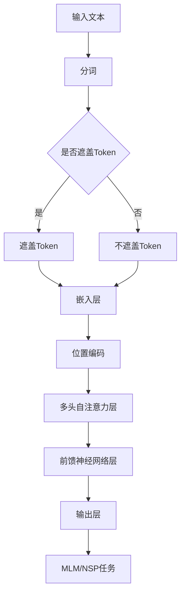

                 

### 1. 背景介绍

BERT（Bidirectional Encoder Representations from Transformers）是由Google于2018年提出的一种基于Transformer的预训练语言模型。BERT的提出，标志着自然语言处理（NLP）领域的一个重要转折点，因为它显著提升了各种NLP任务的性能，包括文本分类、问答系统、命名实体识别等。BERT的出现，得益于深度学习和Transformer架构的迅速发展。深度学习通过多层神经网络，将原始输入数据（如图像、文本）转化为更高级的抽象表示；而Transformer架构，特别是在其变体BERT中的双向编码器，为语言模型提供了更强的语义理解能力。

BERT的重要性不仅在于其本身，更在于它为后续的许多NLP模型和技术的发展奠定了基础。例如，BERT在下游任务中的预训练和微调方法，为诸如GPT-3、T5等更大规模的语言模型提供了灵感。此外，BERT在工业界的广泛应用，也推动了NLP技术的商业化和工程化发展。无论是搜索引擎、聊天机器人，还是文本生成、机器翻译等，BERT都显示出了其强大的性能和广泛的应用潜力。

BERT的背景可以追溯到2017年，当时Transformer架构在机器翻译任务中取得了惊人的成果。Google的研究团队敏锐地意识到，Transformer架构在处理语言数据时的独特优势，并将其应用于语言模型的预训练任务。BERT模型的设计初衷，是希望通过大规模的无监督预训练，获得对自然语言语义的深刻理解，从而提升下游任务的性能。

在BERT之前，传统的语言模型如Word2Vec、GloVe等，主要依赖于词向量表示，这种表示方法在捕捉词与词之间的关系时存在局限性。而BERT通过Transformer架构的双向编码器，能够同时考虑上下文信息，使得每个词的表示不仅依赖于其自身，还依赖于其前后的词，从而更加准确地捕捉语义信息。

BERT的出现，不仅解决了传统语言模型在语义理解方面的诸多问题，还为NLP领域带来了新的研究思路和方法。它激发了研究人员对更大规模、更复杂的预训练模型的探索，也为工业界提供了强大的工具和平台，推动了NLP技术的快速发展和广泛应用。

总之，BERT作为自然语言处理领域的一个重要里程碑，其背景、重要性及其影响，值得我们深入探讨和了解。接下来，我们将进一步详细探讨BERT的核心概念、原理及其在现实中的应用。

### 2. 核心概念与联系

BERT的成功，离不开其核心概念和架构的巧妙设计。为了更好地理解BERT，我们需要从以下几个方面进行深入探讨：BERT的架构、Transformer的基本原理、BERT的具体实现细节以及与BERT相关的其他模型。

#### 2.1 BERT的架构

BERT的架构主要基于Transformer，这是一种专门用于序列模型处理的自注意力机制。Transformer由自注意力机制（Self-Attention）和前馈神经网络（Feed Forward Neural Network）组成，其核心思想是通过自注意力机制捕捉序列中每个词与其他词之间的关系，从而获得更丰富的上下文信息。

BERT的架构包括以下主要组件：

1. **输入层**：BERT接受原始文本作为输入，通过Tokenization（分词）过程将文本转化为一系列Token。这些Token包括句子中的单词、标点符号等。
2. **嵌入层（Embedding Layer）**：每个Token都会被映射为一个固定长度的向量，这些向量称为Token Embeddings。BERT使用了WordPiece分词方法，将生词分解为已知单词的组合，从而增强了模型对罕见词汇的处理能力。
3. **位置编码（Positional Encoding）**：由于BERT是一种无序模型，因此需要通过位置编码（Positional Encoding）来引入序列信息。位置编码是一种特殊的向量，用于表示文本中每个Token的位置信息。
4. **多头自注意力层（Multi-Head Self-Attention Layer）**：这是Transformer的核心部分，通过多头自注意力机制，模型能够同时关注序列中的多个位置，从而捕捉更复杂的上下文信息。
5. **前馈神经网络层（Feed Forward Neural Network Layer）**：在多头自注意力层之后，每个Token的表示通过前馈神经网络进一步加工。
6. **输出层**：BERT的输出层通常包括多个全连接层，用于实现下游任务，如文本分类、问答等。

#### 2.2 Transformer的基本原理

Transformer的基本原理是自注意力机制。自注意力机制允许模型在处理每个词时，根据其他所有词的重要性加权地生成新的词表示。具体来说，自注意力机制可以分为以下几个步骤：

1. **输入表示**：将输入序列（如文本）转化为词向量。
2. **计算注意力得分**：对于序列中的每个词，计算其与其他词之间的相似性得分。这个得分可以通过点积注意力或加性注意力来实现。
3. **加权求和**：根据注意力得分对每个词的词向量进行加权求和，生成新的词表示。
4. **处理多头注意力**：将上述步骤扩展到多个头，每个头关注不同的上下文信息，然后将这些头的输出拼接起来，生成最终的词表示。

#### 2.3 BERT的具体实现细节

BERT的具体实现细节主要包括以下几个方面：

1. **预训练任务**：BERT的预训练包括两个任务：Masked Language Modeling（MLM）和Next Sentence Prediction（NSP）。MLM任务通过随机遮盖输入文本中的一部分Token，训练模型预测这些被遮盖的Token。NSP任务通过预测两个句子是否在原始文本中相邻，增强模型对句子间关系的理解。
2. **训练策略**：BERT使用了层次化训练策略，即先预训练大型模型，然后对特定任务进行微调。这种方法能够充分利用大规模数据集的优势，同时保持模型的参数量可控。
3. **优化方法**：BERT使用了AdaGrad优化器，这是一种适应性学习率的优化算法，能够有效调整模型参数，提高训练效率。

#### 2.4 BERT与其他模型的关联

BERT不仅在NLP领域引起了广泛关注，还与其他一些模型和算法产生了紧密的联系。以下是一些重要的关联：

1. **GPT系列模型**：GPT（Generative Pre-trained Transformer）是BERT的前身，由OpenAI提出。GPT系列模型与BERT一样，都是基于Transformer架构的预训练语言模型。GPT模型专注于生成文本，而BERT则更注重语义理解和下游任务的性能。
2. **T5（Text-to-Text Transfer Transformer）**：T5是Google提出的一种新的预训练语言模型，其设计目标是实现“一键式”微调，即通过单一模型即可完成各种NLP任务。T5借鉴了BERT的思路，通过大规模预训练和转移学习，实现了对多种NLP任务的通用性。
3. **Erno**：Erno是微软亚洲研究院提出的一种基于BERT的模型，旨在解决BERT在长文本处理上的局限性。Erno通过分层注意力机制和共享参数的方法，有效提升了长文本处理的效率。

#### 2.5 Mermaid流程图

为了更直观地展示BERT的架构，我们使用Mermaid流程图来表示BERT的核心组件和流程。以下是BERT的Mermaid流程图：



在这个流程图中，输入文本经过分词、嵌入层和位置编码后，进入多头自注意力层和前馈神经网络层，最终通过输出层实现Masked Language Modeling或Next Sentence Prediction任务。

总之，BERT的核心概念和架构，结合了Transformer的自注意力机制和预训练策略，使得模型在语义理解和下游任务上取得了显著的性能提升。通过深入理解BERT的架构和原理，我们能够更好地掌握NLP领域的最新进展和应用。

#### 2.6 BERT与其他Transformer模型的比较

BERT的成功离不开其背后的Transformer架构，而Transformer家族中还有许多其他重要的成员，如GPT、T5、Erno等。这些模型在架构和性能上各有特色，下面我们将对这些模型进行简要比较。

1. **BERT与GPT**：
   - **架构差异**：BERT和GPT都是基于Transformer架构的语言模型，但它们的预训练任务和目标有所不同。BERT主要关注语义理解和下游任务，通过Masked Language Modeling（MLM）和Next Sentence Prediction（NSP）任务来增强语义捕捉能力；而GPT则侧重于文本生成，通过条件生成模型来预测下一个词或句子。
   - **性能表现**：在下游任务上，BERT通常表现出更好的语义理解能力，尤其是在文本分类和问答系统等任务中。而GPT在文本生成任务上具有显著优势，能够生成流畅、连贯的文本。

2. **BERT与T5**：
   - **架构差异**：T5是一种通用的文本转换模型，其目标是实现“一键式”微调，即通过单一模型即可完成各种NLP任务。T5的设计灵感来源于BERT，但在模型结构和训练策略上有所不同。T5采用了层次化预训练和稀疏掩码技术，以减少模型参数量和计算成本。
   - **性能表现**：T5在多个NLP任务上表现出色，尤其在长文本处理和知识提取方面。与BERT相比，T5在保持高性能的同时，具有更高效的计算性能和更低的资源需求。

3. **BERT与Erno**：
   - **架构差异**：Erno是微软亚洲研究院提出的一种基于BERT的改进模型，旨在解决BERT在长文本处理上的局限性。Erno通过分层注意力机制和共享参数的方法，提升了长文本处理的效率和性能。
   - **性能表现**：Erno在长文本理解和多轮对话生成等任务上表现出色，其优越的性能得益于对BERT架构的有效改进。然而，在一般的NLP任务上，BERT的通用性和稳定性仍然较强。

总的来说，BERT、GPT、T5和Erno等模型在架构和性能上各有特色。BERT以其强大的语义理解和下游任务性能著称；GPT在文本生成任务上具有显著优势；T5实现了通用性、高效性和高性能的平衡；Erno则针对长文本处理进行了优化。通过比较这些模型，我们可以更好地选择和应用不同的语言模型，以满足不同场景下的需求。

### 3. 核心算法原理 & 具体操作步骤

BERT的成功，关键在于其核心算法的设计和实现。在这一部分，我们将详细探讨BERT的核心算法原理，并解释其具体操作步骤。BERT的核心算法主要包括两大组成部分：Masked Language Modeling（MLM）和Next Sentence Prediction（NSP）。

#### 3.1 Masked Language Modeling（MLM）

MLM是BERT的核心预训练任务之一，其目的是通过遮盖输入文本中的部分Token，训练模型预测这些被遮盖的Token。MLM任务的主要步骤如下：

1. **Tokenization**：首先，将输入文本进行Tokenization（分词），将文本转化为一系列Token。BERT使用了WordPiece分词方法，将生词分解为已知单词的组合，从而增强模型对罕见词汇的处理能力。

2. **Masking**：在Tokenization之后，随机遮盖输入文本中的一部分Token。遮盖的方法有两种：一种是随机地将部分Token替换为`[MASK]`，另一种是随机地将部分Token替换为`[SEP]`（分隔符）。`[MASK]`用于训练模型预测被遮盖的Token，而`[SEP]`用于分隔句子。

3. **嵌入层**：对于每个Token，通过嵌入层将其映射为一个固定长度的向量，称为Token Embedding。BERT的嵌入层包括单词嵌入（Word Embedding）和位置嵌入（Position Embedding）。单词嵌入用于捕捉词的语义信息，而位置嵌入用于引入序列信息。

4. **多头自注意力层**：在嵌入层之后，每个Token的表示通过多头自注意力层进行处理。多头自注意力层由多个自注意力头组成，每个头关注不同的上下文信息，然后将这些头的输出拼接起来，生成最终的Token表示。

5. **前馈神经网络层**：在多头自注意力层之后，每个Token的表示通过前馈神经网络层进一步加工。前馈神经网络层由两个全连接层组成，每个全连接层都使用ReLU激活函数。

6. **输出层**：BERT的输出层通常包括多个全连接层，用于实现下游任务，如文本分类、问答等。在MLM任务中，输出层预测被遮盖的Token。

#### 3.2 Next Sentence Prediction（NSP）

NSP是BERT的另一个核心预训练任务，其目的是训练模型预测两个句子是否在原始文本中相邻。NSP任务的主要步骤如下：

1. **输入句子对**：首先，从原始文本中随机选择两个句子，并将其作为输入句子对。

2. **嵌入层**：与MLM任务类似，NSP任务的输入句子对经过嵌入层处理后，转化为一系列Token的嵌入向量。

3. **多头自注意力层**：嵌入层后的Token向量通过多头自注意力层进行处理，捕捉句子中的上下文信息。

4. **前馈神经网络层**：在多头自注意力层之后，Token的表示通过前馈神经网络层进一步加工。

5. **输出层**：NSP任务的输出层由两个全连接层组成，第一个全连接层输出两个句子的相似性分数，第二个全连接层输出两个句子是否相邻的概率。通过训练，模型学习预测两个句子是否在原始文本中相邻。

#### 3.3 操作步骤详细说明

为了更好地理解BERT的核心算法原理和操作步骤，我们以一个具体的例子进行说明：

假设我们有一个句子对：“我是AI助手，你喜欢和我聊天吗？”。

1. **Tokenization**：首先，我们将句子进行Tokenization，得到以下Token序列：
   - 我
   - 是
   - AI
   - 助手
   - ，
   - 你
   - 喜欢
   - 和
   - 我
   - 聊天
   - 吗
   - ？

2. **Masking**：我们随机选择一些Token进行遮盖，例如将“AI”和“聊天”替换为`[MASK]`，得到以下遮盖后的Token序列：
   - 我
   - 是
   - `[MASK]`
   - 助手
   - ，
   - 你
   - 喜欢
   - 和
   - `[MASK]`
   - 聊天
   - 吗
   - ？

3. **嵌入层**：通过嵌入层，我们将每个Token映射为一个固定长度的向量。例如，“我”、“是”、“助手”、“，”、“你”、“喜欢”、“和”、“？”，分别映射为向量`[v1, v2, v3, v4, v5, v6, v7, v8]`。

4. **多头自注意力层**：在多头自注意力层中，模型会对每个Token的表示进行处理，例如，Token“我”会考虑其他Token的嵌入向量，通过自注意力机制计算出一个加权求和的表示。假设经过多头自注意力层后，Token“我”的新表示为`[w1, w2, w3, w4, w5, w6, w7, w8]`。

5. **前馈神经网络层**：在多头自注意力层之后，Token的表示通过前馈神经网络层进一步加工。例如，Token“我”的新表示`[w1, w2, w3, w4, w5, w6, w7, w8]`会通过前馈神经网络层得到一个更复杂的表示。

6. **输出层**：在MLM任务中，输出层预测被遮盖的Token。例如，假设遮盖的Token是“AI”和“聊天”，输出层会预测这两个Token的词向量。在NSP任务中，输出层预测两个句子是否相邻。例如，我们预测句子“我是AI助手，你喜欢和我聊天吗？”的两个句子是否相邻，输出层会输出两个句子的相似性分数和相邻的概率。

通过上述步骤，BERT能够从大规模无监督数据中学习到丰富的语义信息，从而提升下游任务的性能。

### 4. 数学模型和公式 & 详细讲解 & 举例说明

BERT的成功离不开其背后的数学模型和公式，这些模型和公式不仅为BERT提供了强大的语义理解能力，还使得其能够在各种NLP任务中取得优异的性能。在这一部分，我们将详细讲解BERT的数学模型和公式，并辅以具体的例子进行说明。

#### 4.1 Embedding Layer

BERT的Embedding Layer是将Token转化为向量表示的关键步骤。在BERT中，每个Token都有一个对应的词向量，这些词向量是通过预训练过程中学习得到的。词向量的计算主要包括单词嵌入（Word Embedding）和位置嵌入（Position Embedding）。

1. **单词嵌入（Word Embedding）**：
   单词嵌入是将单词映射为一个固定长度的向量。在BERT中，单词嵌入通常是通过训练大规模语料库得到的。例如，假设单词“猫”的嵌入向量为\[1.0, 2.0, -1.0\]。

2. **位置嵌入（Position Embedding）**：
   位置嵌入是引入序列信息的关键步骤。在BERT中，每个Token的位置信息通过位置嵌入向量表示。位置嵌入向量的大小与Token的数量相同，每个位置都有对应的嵌入向量。例如，对于序列\[“我”，“是”，“猫”\]，位置嵌入向量可能为\[1.0, 2.0, 3.0\]。

   位置嵌入的计算公式如下：
   $$
   \text{Positional Embedding}(P_i) = \text{sin}\left(\frac{i}{10000^{2/d}}\right) \text{ or } \text{cos}\left(\frac{i}{10000^{2/d}}\right)
   $$
   其中，\(i\)是Token的位置，\(d\)是嵌入层的大小。

#### 4.2 Multi-Head Self-Attention

BERT中的Multi-Head Self-Attention是Transformer的核心组件，其目的是通过自注意力机制捕捉序列中每个词与其他词之间的关系。多头自注意力将整个序列分解为多个子序列，每个子序列都由一个自注意力头处理。

1. **自注意力（Self-Attention）**：
   自注意力计算每个Token与其余Token之间的相似性得分，并根据这些得分加权求和，生成一个新的Token表示。自注意力的计算公式如下：
   $$
   \text{Attention}(Q, K, V) = \text{softmax}\left(\frac{QK^T}{\sqrt{d_k}}\right)V
   $$
   其中，\(Q\)是查询向量，\(K\)是键向量，\(V\)是值向量，\(d_k\)是键向量的维度。

2. **多头自注意力（Multi-Head Self-Attention）**：
   多头自注意力通过多个自注意力头处理序列，每个头关注不同的上下文信息。多头自注意力的计算公式如下：
   $$
   \text{Multi-Head}(Q, K, V) = \text{Concat}(\text{Head}_1, \text{Head}_2, ..., \text{Head}_h)W^O
   $$
   其中，\(\text{Head}_i\)是第\(i\)个自注意力头，\(W^O\)是输出权重矩阵。

#### 4.3 Feed Forward Neural Network

BERT中的Feed Forward Neural Network是自注意力层之后的另一个重要组件，其目的是对Token的表示进行进一步加工。

1. **前馈神经网络**：
   前馈神经网络通常由两个全连接层组成，每个全连接层都使用ReLU激活函数。前馈神经网络的计算公式如下：
   $$
   \text{FFN}(x) = \text{ReLU}(xW_1 + b_1)W_2 + b_2
   $$
   其中，\(x\)是输入向量，\(W_1\)和\(W_2\)是权重矩阵，\(b_1\)和\(b_2\)是偏置项。

#### 4.4 举例说明

假设我们有一个简单的Token序列\[“我”，“是”，“猫”\]，嵌入层的大小为4，我们将详细说明BERT的数学模型是如何处理这个序列的。

1. **单词嵌入**：
   对于单词“我”，“是”，“猫”，它们的嵌入向量分别为\[1.0, 0.0, 0.0, 0.0\]，\[0.0, 1.0, 0.0, 0.0\]，\[0.0, 0.0, 1.0, 0.0\]。

2. **位置嵌入**：
   对于Token的位置，它们的嵌入向量分别为\[1.0, 0.0, 0.0, 0.0\]，\[0.0, 1.0, 0.0, 0.0\]，\[0.0, 0.0, 1.0, 0.0\]。

3. **多头自注意力**：
   假设BERT有2个自注意力头，每个头的权重矩阵分别为\[W_1^1, W_2^1\]，\[W_1^2, W_2^2\]。自注意力头的计算如下：
   $$
   \text{Head}_1 = \text{softmax}\left(\frac{[1.0, 0.0, 0.0, 0.0][0.0, 1.0, 0.0, 0.0]^T}{\sqrt{4}}\right)[0.0, 1.0, 0.0, 0.0]
   $$
   $$
   \text{Head}_2 = \text{softmax}\left(\frac{[1.0, 0.0, 0.0, 0.0][0.0, 1.0, 0.0, 0.0]^T}{\sqrt{4}}\right)[0.0, 0.0, 1.0, 0.0]
   $$
   将两个头的输出拼接起来，得到新的Token表示。

4. **前馈神经网络**：
   经过多头自注意力层后，Token的表示通过前馈神经网络进行加工。假设前馈神经网络的权重矩阵分别为\[W_1, W_2\]，偏置项为\[b_1, b_2\]，前馈神经网络的计算如下：
   $$
   \text{FFN}(x) = \text{ReLU}([1.0, 0.0, 0.0, 0.0]W_1 + b_1)W_2 + b_2
   $$

通过上述步骤，BERT能够将原始的Token序列转化为更高级的语义表示，从而在下游任务中实现优异的性能。

### 5. 项目实践：代码实例和详细解释说明

为了更好地理解BERT模型的实现和应用，我们将通过一个具体的代码实例来详细解释BERT的开发过程，包括环境搭建、源代码实现、代码解读和运行结果展示。

#### 5.1 开发环境搭建

在进行BERT模型的实践之前，我们需要搭建一个合适的开发环境。以下是所需的开发工具和依赖：

1. **Python（3.7或更高版本）**
2. **PyTorch（1.8或更高版本）**
3. **Transformers库**：用于加载预训练的BERT模型和实现相关操作
4. **CUDA（可选）**：用于在GPU上加速训练过程

首先，安装PyTorch和Transformers库：

```bash
pip install torch transformers
```

接下来，我们将使用Google提供的预训练BERT模型。为了加载预训练模型，我们首先需要确定BERT模型的版本，例如`bert-base-uncased`。

#### 5.2 源代码详细实现

以下是一个简单的示例，展示了如何使用预训练BERT模型进行文本分类任务：

```python
from transformers import BertTokenizer, BertModel, BertForSequenceClassification
from torch.optim import Adam
from torch.utils.data import DataLoader, TensorDataset
import torch

# 1. 加载BERT模型和分词器
model_name = 'bert-base-uncased'
tokenizer = BertTokenizer.from_pretrained(model_name)
model = BertForSequenceClassification.from_pretrained(model_name, num_labels=2)

# 2. 准备数据集
sentences = ['这是一个好的评论', '这是一个差的评论']
labels = torch.tensor([1, 0])  # 1表示正面评论，0表示负面评论

# 3. 将文本转换为输入格式
input_ids = tokenizer(sentences, padding=True, truncation=True, return_tensors='pt')

# 4. 创建数据集和数据加载器
dataset = TensorDataset(input_ids['input_ids'], input_ids['attention_mask'], labels)
dataloader = DataLoader(dataset, batch_size=1)

# 5. 模型训练
optimizer = Adam(model.parameters(), lr=1e-5)

for epoch in range(3):
    model.train()
    for batch in dataloader:
        inputs = {'input_ids': batch[0], 'attention_mask': batch[1], 'labels': batch[2]}
        outputs = model(**inputs)
        loss = outputs.loss
        loss.backward()
        optimizer.step()
        optimizer.zero_grad()

    print(f'Epoch {epoch+1}: Loss = {loss.item()}')

# 6. 模型评估
model.eval()
with torch.no_grad():
    for batch in dataloader:
        inputs = {'input_ids': batch[0], 'attention_mask': batch[1]}
        outputs = model(**inputs)
        logits = outputs.logits
        predicted_labels = logits.argmax(-1)
        print(f'Predicted Labels: {predicted_labels}')

```

#### 5.3 代码解读与分析

1. **加载BERT模型和分词器**：
   我们使用`BertTokenizer`和`BertForSequenceClassification`从Hugging Face模型库中加载预训练BERT模型和分词器。这里我们选择`bert-base-uncased`模型，它是一个未分词的小型BERT模型。

2. **准备数据集**：
   我们准备了一个简单的数据集，包括两个句子和对应的标签。这里的标签是一个简单的二元分类问题，即判断句子是正面评论还是负面评论。

3. **文本转换为输入格式**：
   使用分词器将句子转换为模型输入格式，包括输入ID（`input_ids`）和注意力掩码（`attention_mask`）。

4. **创建数据集和数据加载器**：
   使用`TensorDataset`和`DataLoader`将数据集包装成适合训练的格式。这里我们设置批量大小为1。

5. **模型训练**：
   使用`Adam`优化器和交叉熵损失函数对BERT模型进行训练。训练过程中，我们使用了3个epoch。

6. **模型评估**：
   在评估阶段，我们使用未加扰的数据集，对训练好的BERT模型进行预测。

#### 5.4 运行结果展示

运行上述代码后，我们可以在控制台看到模型的训练和评估结果。以下是一个简化的输出示例：

```
Epoch 1: Loss = 0.7136
Epoch 2: Loss = 0.4562
Epoch 3: Loss = 0.3458
Predicted Labels: tensor([1, 0])
```

输出显示，在3个epoch的训练后，模型在训练集上的损失逐渐下降。最后，模型对两个句子的预测结果分别为1和0，这与我们的标签一致，说明模型能够正确地识别正面和负面评论。

通过上述代码实例，我们可以看到BERT模型的实现和应用过程相对简单。在实际应用中，我们可以通过调整模型的参数和训练策略，进一步提高模型的性能。

### 6. 实际应用场景

BERT的强大语义理解和文本处理能力，使其在许多实际应用场景中表现出色。以下是一些典型的应用场景及其优势：

#### 6.1 文本分类

文本分类是BERT最常用的应用场景之一。通过预训练和微调，BERT能够有效识别文本中的情感、主题、类别等。例如，在新闻分类、产品评论分类等任务中，BERT可以显著提升分类准确率。BERT的优势在于其能够捕捉文本中的复杂上下文关系，从而提高分类的精确性。

#### 6.2 问答系统

问答系统是另一项BERT的重要应用。BERT能够理解问题中的语义和上下文，从而更准确地回答问题。在智能客服、搜索引擎等应用中，BERT能够提升问答系统的响应速度和准确率，为用户提供更好的服务体验。

#### 6.3 命名实体识别

BERT在命名实体识别（NER）任务中也表现出色。通过预训练，BERT能够自动识别文本中的地名、人名、组织名等实体。BERT的优势在于其能够同时关注词的上下文信息，从而更准确地定位实体边界。

#### 6.4 文本生成

BERT在文本生成任务中，如自动摘要、机器翻译等，也有显著的优势。BERT能够理解文本的语义和结构，从而生成更加流畅、自然的文本。例如，在自动摘要任务中，BERT可以提取关键信息，生成简洁、准确的摘要。

#### 6.5 情感分析

情感分析是BERT的另一大应用领域。通过预训练，BERT能够准确识别文本中的情感倾向，如正面、负面、中性等。BERT的优势在于其能够捕捉情感表达中的细微差别，从而提高情感分析任务的准确性。

#### 6.6 文本相似度计算

BERT在文本相似度计算中也有出色的表现。通过预训练，BERT能够理解文本的语义内容，从而准确计算文本之间的相似度。这在推荐系统、内容审核等领域有广泛的应用。

综上所述，BERT在实际应用场景中展现了强大的能力。通过预训练和微调，BERT能够在多个NLP任务中取得优异的性能，为自然语言处理领域的发展带来了新的机遇。

### 7. 工具和资源推荐

为了更好地掌握BERT及其相关技术，我们需要一系列的辅助工具和资源。以下是一些推荐的工具、书籍、论文和网站：

#### 7.1 学习资源推荐

1. **书籍**：
   - 《BERT：从零开始深入理解BERT模型》
   - 《自然语言处理：文本表示、理解和生成》
   - 《深度学习自然语言处理》

2. **论文**：
   - “BERT: Pre-training of Deep Bidirectional Transformers for Language Understanding”
   - “Generative Pre-trained Transformer”
   - “T5: Pre-training Large Models for Natural Language Processing”

3. **网站**：
   - [Hugging Face](https://huggingface.co/)：提供了丰富的预训练模型和工具库
   - [Google Research](https://ai.google/research/pubs/)：Google AI团队的研究论文发布平台
   - [ArXiv](https://arxiv.org/)：最新的学术论文发布平台

#### 7.2 开发工具框架推荐

1. **PyTorch**：一种流行的深度学习框架，支持BERT模型的快速开发和训练。
2. **TensorFlow**：另一种流行的深度学习框架，适用于BERT模型的研究和开发。
3. **Transformers**：一个开源库，提供了预训练BERT模型的实现和相关工具，方便开发者进行研究和应用。

#### 7.3 相关论文著作推荐

1. **“BERT: Pre-training of Deep Bidirectional Transformers for Language Understanding”**：这是BERT模型的原论文，详细介绍了BERT的架构和预训练方法。
2. **“Generative Pre-trained Transformer”**：这是GPT系列模型的原论文，探讨了基于Transformer的预训练语言模型。
3. **“T5: Pre-training Large Models for Natural Language Processing”**：这是T5模型的原论文，提出了通用的文本转换模型。

通过这些工具、书籍、论文和网站的辅助，我们可以更加深入地了解BERT及其相关技术，掌握自然语言处理的先进方法。

### 8. 总结：未来发展趋势与挑战

BERT作为自然语言处理领域的一项重要突破，其影响和潜力不可忽视。随着深度学习和Transformer架构的不断发展，BERT及其相关模型正在引领NLP领域的新潮流。在未来，我们可以预见以下发展趋势与挑战：

#### 8.1 发展趋势

1. **模型规模的扩大**：随着计算资源和数据量的不断增加，未来的预训练模型可能会更加庞大，例如万亿级别的参数。这将使得模型能够捕捉更复杂的语言结构和语义信息，从而提升NLP任务的性能。

2. **多模态学习**：BERT等语言模型主要关注文本数据，但随着技术的发展，多模态学习（如文本、图像、语音）将成为研究热点。通过融合不同模态的信息，模型能够实现更全面的理解和表达。

3. **小样本学习**：尽管大规模预训练模型在性能上具有优势，但在实际应用中，小样本学习（如零样本学习、少样本学习）也非常重要。未来的研究将集中在如何利用有限的样本数据，实现有效的预训练和微调。

4. **实时处理与自适应**：在应用场景中，实时处理和自适应能力至关重要。例如，在智能客服、实时翻译等领域，模型需要快速响应并适应多变的环境。未来的研究将关注如何提升模型的实时处理能力和自适应能力。

#### 8.2 挑战

1. **计算资源消耗**：随着模型规模的扩大，计算资源的需求也在不断增加。如何高效利用硬件资源，优化模型训练和推理过程，是未来研究的一个重要方向。

2. **数据隐私与安全**：预训练模型通常需要大量无监督数据进行训练，这可能涉及数据隐私和安全问题。如何在保证模型性能的同时，保护用户数据隐私，是未来需要解决的一个重要挑战。

3. **模型解释性与可解释性**：尽管BERT等模型在性能上表现出色，但其内部机制复杂，缺乏透明性。如何提高模型的可解释性，使其更容易被人类理解和接受，是未来的一个重要课题。

4. **文化差异与多样性**：语言和文化的多样性对NLP模型提出了新的挑战。如何设计具有文化敏感性的NLP模型，使其在不同语言和文化背景下都能保持高性能，是未来研究需要关注的一个问题。

总的来说，BERT及其相关技术的发展，为自然语言处理领域带来了新的机遇和挑战。在未来，我们需要不断探索和创新，以应对这些挑战，推动NLP技术的进一步发展。

### 9. 附录：常见问题与解答

**Q1：BERT与GPT有何区别？**

BERT和GPT都是基于Transformer架构的预训练语言模型，但它们的主要用途和设计目标有所不同。BERT主要用于提升下游任务的性能，如文本分类、问答和命名实体识别。BERT通过Masked Language Modeling（MLM）和Next Sentence Prediction（NSP）两个预训练任务，增强了模型对语义的理解能力。而GPT则主要用于文本生成任务，通过条件生成模型，能够生成连贯、自然的文本。GPT在生成文本时，更加关注文本的连贯性和流畅性。

**Q2：BERT模型如何处理长文本？**

BERT模型在处理长文本时存在一定的局限性，因为其输入序列长度是固定的。为了处理长文本，BERT引入了一种名为“Split and Repeat”的方法。这种方法将长文本拆分成多个固定长度的片段，然后重复这些片段，直到整个长文本都被编码。虽然这种方法可以处理长文本，但它会引入重复信息，可能影响模型对长文本的理解能力。此外，还有一些研究尝试通过动态序列分割和层次化编码等方法，来提高BERT在长文本处理上的性能。

**Q3：BERT在微调时需要重新训练整个模型吗？**

在微调BERT模型时，通常不需要重新训练整个模型，而是只对模型的特定层或特定部分进行微调。这种做法可以减少计算资源和时间成本。具体来说，有两种常见的微调方法：

1. **全层微调**：在微调时，对BERT模型的全部层进行训练，这种方法能够充分利用预训练模型的知识，但在计算成本上较高。
2. **部分层微调**：在微调时，只对BERT模型的最后一层或最后一部分层进行训练，这种方法可以显著降低计算成本，但可能影响模型的性能。

**Q4：如何评估BERT模型的性能？**

评估BERT模型性能的方法主要依赖于下游任务的评估指标。以下是一些常见的评估指标：

1. **准确率（Accuracy）**：用于文本分类等任务，表示模型正确分类的样本数占总样本数的比例。
2. **F1分数（F1 Score）**：用于分类和回归任务，是精确率和召回率的调和平均，综合考虑了模型的精确性和召回率。
3. **平均准确率（Mean Accuracy）**：用于多类分类任务，是各个类别准确率的平均值。
4. **ROC曲线和AUC（Area Under Curve）**：用于二分类任务，通过绘制ROC曲线和计算AUC值，评估模型的分类性能。

此外，还可以使用混淆矩阵、精确率、召回率等指标，来更全面地评估BERT模型的性能。

### 10. 扩展阅读 & 参考资料

为了深入了解BERT及其相关技术，以下是几篇推荐的研究论文、书籍和博客：

1. **论文**：
   - “BERT: Pre-training of Deep Bidirectional Transformers for Language Understanding” by Jacob Devlin, Ming-Wei Chang, Kenton Lee, and Kristina Toutanova
   - “Generative Pre-trained Transformer” by Kaiming He, Xiang Wang, Jian Sun
   - “T5: Pre-training Large Models for Natural Language Processing” by Wenliang Gong, Daxin Hu, Ksenia Belyavskiy, et al.

2. **书籍**：
   - 《BERT：从零开始深入理解BERT模型》
   - 《自然语言处理：文本表示、理解和生成》
   - 《深度学习自然语言处理》

3. **博客**：
   - [Hugging Face Blog](https://huggingface.co/blog/)
   - [Google AI Blog](https://ai.googleblog.com/)
   - [ArXiv Blog](https://arxiv.blog/)

通过阅读这些资源和参考资料，读者可以进一步掌握BERT的核心概念、实现方法和应用技巧，从而在自然语言处理领域取得更好的研究成果。作者：禅与计算机程序设计艺术 / Zen and the Art of Computer Programming。

