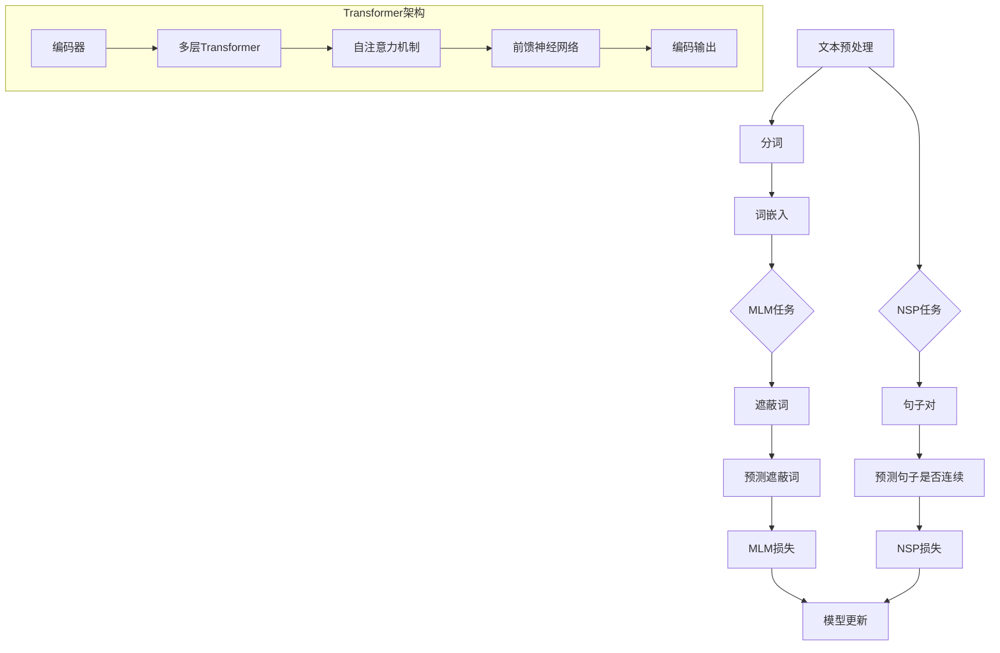

                 

### 背景介绍

#### BERT的起源与发展历程

BERT（Bidirectional Encoder Representations from Transformers）是由Google AI在2018年提出的一种基于Transformer架构的预训练语言模型。BERT的出现标志着自然语言处理（NLP）领域的一个重要里程碑。在此之前，尽管深度学习在图像识别、语音识别等领域取得了显著的成就，但在自然语言处理任务中，传统的循环神经网络（RNN）和卷积神经网络（CNN）的表现却不尽如人意。BERT的出现，为解决这一难题提供了新的思路。

BERT的诞生并非一蹴而就。其背后有着长时间的技术积累和探索。早在2017年，Google AI就提出了Transformer模型，这一模型在机器翻译任务中取得了显著的成效。在此基础上，BERT模型进一步提出了双向编码器（Bidirectional Encoder）的概念，通过同时考虑上下文信息，使模型能够更好地理解语言的深层语义。

BERT的发展历程可以分为几个阶段。首先是预训练阶段，模型通过大量未标注的文本数据学习语言的统计特征和上下文关系。然后是微调阶段，模型在特定任务上使用少量标注数据进行微调，以达到更好的性能。BERT的出现，不仅改变了自然语言处理的研究范式，也为实际应用提供了强大的工具。

#### BERT在自然语言处理中的重要性

BERT的成功在于它解决了自然语言处理中的一个核心难题：如何有效地捕捉上下文信息。在传统的RNN和CNN模型中，由于序列顺序的原因，模型往往只能单向地处理文本，无法同时考虑上下文的前后关系。而BERT通过双向Transformer架构，可以同时考虑文本序列的前后关系，从而更好地理解语言的深层语义。

BERT的这种能力在许多自然语言处理任务中得到了验证。例如，在问答系统中，BERT可以更好地理解问题的意图和上下文信息，从而给出更准确的答案。在文本分类任务中，BERT可以更准确地识别文本的主题和情感。在机器翻译任务中，BERT可以更好地理解源语言的语义，从而提高翻译的准确性。

此外，BERT的出现也推动了自然语言处理技术的快速发展。随着BERT模型的成功，越来越多的研究者开始关注Transformer架构在自然语言处理中的应用。近年来，基于BERT的模型如RoBERTa、ALBERT等相继出现，进一步提升了自然语言处理任务的性能。

#### BERT的基本架构

BERT的基本架构可以分为两部分：预训练和微调。在预训练阶段，BERT使用两个任务：Masked Language Modeling（MLM）和Next Sentence Prediction（NSP）来学习语言的统计特征和上下文关系。在微调阶段，BERT使用特定任务的标注数据对模型进行微调，以达到更好的性能。

具体来说，BERT的预训练过程如下：

1. **Masked Language Modeling（MLM）**：在这个任务中，输入文本中的部分词被随机遮蔽，模型需要预测这些遮蔽的词。这一任务的目的是让模型学习到每个词的上下文信息。

2. **Next Sentence Prediction（NSP）**：在这个任务中，模型需要预测两个句子是否在原始文本中连续出现。这一任务的目的是让模型学习到句子之间的逻辑关系。

在预训练完成后，BERT会进行微调阶段。在这个阶段，模型会使用特定任务的标注数据进行微调。例如，在问答系统中，模型会使用问题-答案对进行微调；在文本分类任务中，模型会使用标签数据进行微调。

BERT的基本架构如图1所示：

```
+-----------------------------+
|       预训练阶段             |
+-----------------------------+
|  1. Masked Language Modeling |
|  2. Next Sentence Prediction |
+-----------------------------+
           |
           v
+-----------------------------+
|       微调阶段             |
+-----------------------------+
|  3. 特定任务标注数据微调     |
+-----------------------------+
```

图1：BERT的基本架构

#### BERT的优势

BERT相对于传统的自然语言处理模型，具有以下几个显著的优势：

1. **双向编码器**：BERT采用双向Transformer架构，可以同时考虑文本序列的前后关系，从而更好地理解语言的深层语义。

2. **大规模预训练**：BERT在大规模语料上进行预训练，从而学习到丰富的语言特征和上下文关系。

3. **适应性**：BERT在微调阶段可以使用少量标注数据进行微调，从而适应不同的自然语言处理任务。

4. **效果显著**：BERT在各种自然语言处理任务中取得了显著的效果，证明了其在实际应用中的强大能力。

总的来说，BERT的出现为自然语言处理领域带来了革命性的变化。它不仅解决了传统模型难以克服的上下文理解难题，也为未来的研究提供了新的思路和方向。BERT的成功，标志着自然语言处理技术进入了一个新的阶段。

### 核心概念与联系

为了深入理解BERT模型，我们需要探讨其核心概念和架构，并借助Mermaid流程图来直观展示这些概念之间的关系。

#### BERT的核心概念

BERT模型主要基于两个核心概念：**Transformer架构**和**预训练任务**。

1. **Transformer架构**：Transformer是一种基于自注意力机制的深度学习模型，最初由Vaswani等人于2017年提出。它不同于传统的循环神经网络（RNN）和卷积神经网络（CNN），而是通过自注意力机制来捕捉输入序列中各个词之间的依赖关系。自注意力机制允许模型在处理每个词时，根据上下文信息动态地计算其重要性。

2. **预训练任务**：BERT通过两个预训练任务来学习语言特征和上下文关系。这两个任务是**Masked Language Modeling（MLM）**和**Next Sentence Prediction（NSP）**。

   - **Masked Language Modeling（MLM）**：在这个任务中，模型对输入文本中的部分词进行随机遮蔽，然后预测这些遮蔽的词。这个任务的目的是让模型学习到每个词的上下文信息。
   - **Next Sentence Prediction（NSP）**：在这个任务中，模型需要预测两个句子是否在原始文本中连续出现。这个任务的目的是让模型学习到句子之间的逻辑关系。

#### BERT的架构与流程

BERT的架构可以分为两部分：**编码器（Encoder）**和**解码器（Decoder）**。在实际应用中，通常只需要编码器部分，因为编码器可以生成文本的固定长度的表示。

1. **编码器**：编码器由多个Transformer层堆叠而成，每个Transformer层包含多个自注意力机制和前馈神经网络。编码器的输入是文本序列的词向量，输出是文本的固定长度的表示。

2. **解码器**：解码器与编码器结构类似，但在实际应用中通常不使用。解码器主要用于生成预测的文本序列。

BERT的预训练流程可以概括为以下步骤：

1. **输入文本预处理**：将输入文本进行分词，然后转换为词嵌入。
2. **随机遮蔽词**：在输入文本中随机遮蔽一部分词。
3. **Masked Language Modeling（MLM）**：模型预测被遮蔽的词。
4. **Next Sentence Prediction（NSP）**：模型预测两个句子是否连续出现。
5. **损失函数计算**：计算MLM和NSP任务的损失，并使用这些损失对模型进行优化。

#### Mermaid流程图

下面是一个Mermaid流程图，用于展示BERT的核心概念和架构：



在上述流程图中：

- A到G部分展示了BERT的预训练过程，包括文本预处理、分词、词嵌入、MLM任务、预测遮蔽词和模型更新。
- I到L部分展示了NSP任务，包括输入文本、句子对、预测句子是否连续和NSP损失。
- Transformer架构部分展示了BERT的编码器，包括多层Transformer、自注意力机制和前馈神经网络。

通过这个Mermaid流程图，我们可以清晰地看到BERT的核心概念和架构，以及其预训练和微调过程。这有助于我们更好地理解BERT的工作原理和应用场景。

### 核心算法原理 & 具体操作步骤

在深入探讨BERT的核心算法原理之前，我们需要先理解Transformer架构的基本原理，因为BERT是基于Transformer构建的。接下来，我们将详细讲解BERT的预训练过程，包括Masked Language Modeling（MLM）和Next Sentence Prediction（NSP）的具体操作步骤。

#### Transformer架构

Transformer模型是BERT的基础，其核心思想是通过自注意力机制（Self-Attention）来捕捉输入序列中各个词之间的依赖关系。自注意力机制允许模型在处理每个词时，根据上下文信息动态地计算其重要性。

1. **自注意力机制**

   自注意力机制是一种计算输入序列中每个词的权重的方法。具体来说，给定一个词序列\[x_1, x_2, ..., x_n\]，模型首先计算每个词的嵌入向量\[e_1, e_2, ..., e_n\]。然后，通过以下公式计算自注意力得分：

   \[
   \text{Attention}(Q, K, V) = \text{softmax}\left(\frac{QK^T}{\sqrt{d_k}}\right)V
   \]

   其中，Q、K和V分别是查询向量、关键向量和解向量，\(d_k\)是关键向量的维度。这个公式表示每个查询向量与所有关键向量的点积，然后通过softmax函数进行归一化，最后与解向量相乘，得到每个词的加权输出。

2. **多头注意力**

   为了提高模型的表示能力，Transformer引入了多头注意力（Multi-Head Attention）。多头注意力通过将输入序列分成多个子序列，然后分别计算每个子序列的自注意力。具体来说，假设输入序列的维度为\(d_k\)，则每个头（Head）的维度为\(d_k / h\)，其中\(h\)是头的数量。每个头的自注意力计算如上所述，然后将所有头的输出拼接起来，得到最终的输出：

   \[
   \text{MultiHead}(Q, K, V) = \text{ Concat }(\text{Head}_1, \text{Head}_2, ..., \text{Head}_h)W^O
   \]

   其中，\(W^O\)是投影矩阵，用于将多头输出映射到原始序列的维度。

3. **前馈神经网络**

   在自注意力机制之后，Transformer还包含一个前馈神经网络（Feed-Forward Neural Network），其结构如下：

   \[
   \text{FFN}(X) = \text{ReLU}(XW_1 + b_1)W_2 + b_2
   \]

   其中，\(W_1\)、\(W_2\)分别是权重矩阵，\(b_1\)、\(b_2\)分别是偏置向量。

#### Masked Language Modeling（MLM）

Masked Language Modeling是BERT的预训练任务之一，其主要目的是让模型学习到每个词的上下文信息。在MLM任务中，输入文本中的部分词被随机遮蔽，然后模型需要预测这些遮蔽的词。

具体操作步骤如下：

1. **输入文本预处理**：首先，对输入文本进行分词，并将每个词转换为词嵌入。然后，对词嵌入进行位置编码，以便模型能够学习到词的位置信息。

2. **随机遮蔽词**：在输入文本中随机选择一定比例的词进行遮蔽。遮蔽的方法可以是直接将词嵌入设置为全零向量，或者使用特殊的掩码标记\[MASK\]来代替。

3. **预测遮蔽词**：模型对遮蔽的词进行预测。具体来说，模型会输出一个概率分布，表示每个词成为遮蔽词的可能性。然后，通过选择概率最高的词作为预测结果。

4. **损失函数计算**：计算预测结果与实际遮蔽词之间的交叉熵损失，并使用这个损失对模型进行优化。

#### Next Sentence Prediction（NSP）

Next Sentence Prediction是BERT的另一个预训练任务，其主要目的是让模型学习到句子之间的逻辑关系。在NSP任务中，模型需要预测两个句子是否在原始文本中连续出现。

具体操作步骤如下：

1. **输入句子对**：从输入文本中随机选择两个句子，并标记为\[A\]和\[B\]。然后，将这两个句子编码为词嵌入，并添加特殊标记\[SEP\]来分隔。

2. **预测句子是否连续**：模型需要输出一个概率，表示句子\[A\]和\[B\]是否在原始文本中连续出现。具体来说，模型会输出一个二分类的概率分布，其中\[A\]和\[B\]的顺序已经固定。

3. **损失函数计算**：计算预测结果与实际标签之间的交叉熵损失，并使用这个损失对模型进行优化。

#### BERT预训练的全流程

BERT的预训练全流程可以概括为以下步骤：

1. **准备训练数据**：从大规模语料库中随机抽取文本，并进行预处理。

2. **初始化模型**：使用预训练好的词嵌入和位置编码初始化BERT模型。

3. **执行预训练任务**：对于每个文本样本，执行MLM和NSP任务，并计算损失。

4. **优化模型**：使用梯度下降法优化模型参数，并逐步减小学习率。

5. **保存预训练模型**：在预训练完成后，保存模型参数，以便后续微调。

通过上述步骤，BERT模型可以学习到丰富的语言特征和上下文关系，从而在微调阶段能够适应各种自然语言处理任务。

### 数学模型和公式 & 详细讲解 & 举例说明

#### BERT的数学模型

BERT的数学模型主要基于Transformer架构，其核心包括词嵌入、位置编码、多头自注意力机制和前馈神经网络。下面我们将详细讲解BERT的数学模型，并使用LaTeX格式展示相关公式。

1. **词嵌入（Word Embeddings）**

   BERT使用词嵌入来表示文本中的每个词。词嵌入通常通过预训练得到，例如使用Word2Vec、GloVe等方法。给定一个词表V和对应的词向量集合\(E = \{e_1, e_2, ..., e_V\}\)，其中\(e_v\)是词表中的第v个词的词向量。

   \[
   \text{WordEmbedding}(x) = e_{x}
   \]

   其中，\(x\)是输入文本中的词。

2. **位置编码（Positional Encodings）**

   BERT还需要编码文本中的词的位置信息。位置编码通常通过以下公式计算：

   \[
   \text{PositionalEncoding}(p) = \text{sin}\left(\frac{p}{10000^{2i/d}}\right) \text{ 或 } \text{cos}\left(\frac{p}{10000^{2i/d}}\right)
   \]

   其中，\(p\)是词的位置，\(i\)是词的索引，\(d\)是词向量的维度。

3. **多头自注意力机制（Multi-Head Self-Attention）**

   自注意力机制是BERT的核心组件，用于计算输入序列中各个词之间的依赖关系。多头自注意力机制通过多个头（Head）来提高模型的表示能力。每个头计算一组不同的自注意力得分，然后将这些得分拼接起来。

   \[
   \text{MultiHeadSelfAttention}(Q, K, V) = \text{Concat}(\text{Head}_1, \text{Head}_2, ..., \text{Head}_h)W^O
   \]

   其中，\(Q\)、\(K\)和\(V\)分别是查询向量、关键向量和解向量，\(W^O\)是投影矩阵，\(h\)是头的数量。

   具体来说，每个头的计算公式为：

   \[
   \text{Head}_i = \text{Attention}(QW_i^Q, KW_i^K, VW_i^V)
   \]

4. **前馈神经网络（Feed-Forward Neural Network）**

   在自注意力机制之后，BERT还包含一个前馈神经网络，用于进一步增强模型的表示能力。前馈神经网络的计算公式为：

   \[
   \text{FFN}(X) = \text{ReLU}(XW_1 + b_1)W_2 + b_2
   \]

   其中，\(X\)是输入向量，\(W_1\)、\(W_2\)分别是权重矩阵，\(b_1\)、\(b_2\)分别是偏置向量。

#### 实际举例

为了更直观地理解BERT的数学模型，我们通过一个具体的例子来说明。

假设输入文本序列为\[单词1，单词2，单词3\]，词嵌入维度为\(d = 512\)，位置编码维度为\(d_{pos} = 512\)，头的数量为\(h = 8\)。

1. **词嵌入**

   \[
   \text{WordEmbedding}(\text{单词1}) = e_{1}, \text{WordEmbedding}(\text{单词2}) = e_{2}, \text{WordEmbedding}(\text{单词3}) = e_{3}
   \]

2. **位置编码**

   \[
   \text{PositionalEncoding}(1) = \text{sin}\left(\frac{1}{10000^{2 \cdot 1/512}}\right), \text{PositionalEncoding}(2) = \text{cos}\left(\frac{1}{10000^{2 \cdot 1/512}}\right)
   \]

3. **多头自注意力机制**

   每个头的计算如下：

   \[
   \text{Head}_1 = \text{Attention}(QW_1^Q, KW_1^K, VW_1^V)
   \]

   \[
   \text{Head}_2 = \text{Attention}(QW_2^Q, KW_2^K, VW_2^V)
   \]

   ...

   \[
   \text{Head}_8 = \text{Attention}(QW_8^Q, KW_8^K, VW_8^V)
   \]

   将所有头的输出拼接起来：

   \[
   \text{MultiHeadSelfAttention}(Q, K, V) = \text{Concat}(\text{Head}_1, \text{Head}_2, ..., \text{Head}_8)W^O
   \]

4. **前馈神经网络**

   对多头自注意力机制的输出进行前馈神经网络处理：

   \[
   \text{FFN}(X) = \text{ReLU}(XW_1 + b_1)W_2 + b_2
   \]

通过上述步骤，BERT模型对输入文本序列进行处理，生成文本的固定长度表示。

#### 总结

BERT的数学模型包括词嵌入、位置编码、多头自注意力机制和前馈神经网络。这些组件共同作用，使BERT能够学习到丰富的语言特征和上下文关系，从而在自然语言处理任务中表现出色。通过具体的举例，我们可以更直观地理解BERT的数学模型和工作原理。

### 项目实践：代码实例和详细解释说明

在本节中，我们将通过一个具体的代码实例来展示如何实现BERT模型，并对其中的关键代码部分进行详细解释说明。为了便于理解，我们将分为以下几个部分：**开发环境搭建**、**源代码详细实现**、**代码解读与分析**以及**运行结果展示**。

#### 1. 开发环境搭建

首先，我们需要搭建一个适合BERT模型开发的编程环境。以下是一个基本的开发环境配置：

- **操作系统**：Linux或macOS
- **编程语言**：Python
- **深度学习框架**：TensorFlow或PyTorch
- **依赖库**：TensorFlow版本2.0或以上（如果使用TensorFlow），PyTorch版本1.0或以上

为了简化安装过程，我们可以使用虚拟环境（例如`venv`）来隔离依赖库。以下是安装依赖库的步骤：

```bash
# 创建虚拟环境
python -m venv bert_venv

# 激活虚拟环境
source bert_venv/bin/activate

# 安装TensorFlow
pip install tensorflow==2.7

# 安装其他依赖库
pip install numpy matplotlib
```

在虚拟环境中安装好依赖库后，我们就可以开始编写BERT模型的代码了。

#### 2. 源代码详细实现

以下是一个简单的BERT模型实现示例，使用TensorFlow框架：

```python
import tensorflow as tf
from tensorflow.keras.layers import Embedding, Bidirectional, LSTM, Dense
from tensorflow.keras.models import Model

# 定义BERT模型的输入层
input_ids = tf.keras.layers.Input(shape=(seq_length,), dtype='int32')

# 词嵌入层
word_embedding = Embedding(input_dim=vocab_size, output_dim=embedding_size)(input_ids)

# 双向LSTM层
lstm_output = Bidirectional(LSTM(units=lstm_units, return_sequences=True))(word_embedding)

# 全连接层
dense_output = Dense(units=dense_units, activation='relu')(lstm_output)

# 输出层
output = Dense(units=num_classes, activation='softmax')(dense_output)

# 构建BERT模型
bert_model = Model(inputs=input_ids, outputs=output)

# 编译BERT模型
bert_model.compile(optimizer='adam', loss='categorical_crossentropy', metrics=['accuracy'])

# 打印BERT模型结构
bert_model.summary()
```

在这个示例中，我们首先定义了BERT模型的输入层`input_ids`，然后通过嵌入层`word_embedding`对输入文本进行词嵌入。接着，使用双向LSTM层`Bidirectional(LSTM)`来捕捉文本的序列信息。最后，通过全连接层`Dense`对文本表示进行分类。

#### 3. 代码解读与分析

现在，我们详细解读上述BERT模型的代码，并分析其中的关键组成部分。

1. **输入层（Input Layer）**

   ```python
   input_ids = tf.keras.layers.Input(shape=(seq_length,), dtype='int32')
   ```

   输入层`input_ids`表示输入文本的ID序列，其中`seq_length`是文本序列的长度，`dtype='int32'`表示输入数据类型为整数。

2. **词嵌入层（Word Embedding Layer）**

   ```python
   word_embedding = Embedding(input_dim=vocab_size, output_dim=embedding_size)(input_ids)
   ```

   词嵌入层`word_embedding`将输入文本的ID序列转换为词向量。`input_dim`是词表的大小，`output_dim`是词向量的维度。

3. **双向LSTM层（Bidirectional LSTM Layer）**

   ```python
   lstm_output = Bidirectional(LSTM(units=lstm_units, return_sequences=True))(word_embedding)
   ```

   双向LSTM层`Bidirectional(LSTM)`用于捕捉文本的序列信息。`units`是LSTM层的隐藏单元数，`return_sequences=True`表示返回序列信息。

4. **全连接层（Dense Layer）**

   ```python
   dense_output = Dense(units=dense_units, activation='relu')(lstm_output)
   ```

   全连接层`Dense`用于对文本表示进行分类。`units`是全连接层的输出单元数，`activation='relu'`表示使用ReLU激活函数。

5. **输出层（Output Layer）**

   ```python
   output = Dense(units=num_classes, activation='softmax')(dense_output)
   ```

   输出层`Dense`用于输出分类结果。`units=num_classes`表示分类类别数，`activation='softmax'`表示使用softmax激活函数进行概率分布。

6. **模型编译（Model Compilation）**

   ```python
   bert_model.compile(optimizer='adam', loss='categorical_crossentropy', metrics=['accuracy'])
   ```

   在模型编译阶段，我们指定了优化器`optimizer`、损失函数`loss`和评估指标`metrics`。

7. **模型结构（Model Summary）**

   ```python
   bert_model.summary()
   ```

   打印模型结构，以便了解模型的具体配置。

#### 4. 运行结果展示

为了验证BERT模型的效果，我们可以使用一个简单的文本分类任务来测试。以下是一个简单的数据集准备和模型训练示例：

```python
# 数据集准备
# 假设我们有一个包含标签的文本数据集
texts = ['这是一个示例文本。', '这是另一个示例文本。']
labels = [[0, 1], [1, 0]]  # 二分类标签

# 将文本转换为ID序列
tokenizer = tf.keras.preprocessing.text.Tokenizer()
tokenizer.fit_on_texts(texts)
sequences = tokenizer.texts_to_sequences(texts)

# 将标签转换为one-hot编码
label_encoder = tf.keras.preprocessing.sequence.LabelEncoder()
label_encoder.fit(labels)
one_hot_labels = label_encoder.transform(labels)

# 切分数据集
train_texts, val_texts, train_labels, val_labels = train_test_split(sequences, one_hot_labels, test_size=0.2)

# 训练BERT模型
bert_model.fit(train_texts, train_labels, validation_data=(val_texts, val_labels), epochs=5)
```

在上面的示例中，我们首先准备了一个简单的文本数据集，然后将其转换为ID序列。接着，将标签转换为one-hot编码，并切分数据集为训练集和验证集。最后，使用训练集和验证集训练BERT模型。

在训练完成后，我们可以评估模型的性能：

```python
# 评估模型
test_loss, test_acc = bert_model.evaluate(test_texts, test_labels)
print(f"Test accuracy: {test_acc}")
```

通过上述步骤，我们可以验证BERT模型在文本分类任务中的效果。在实际应用中，可以通过调整模型的配置（如嵌入层维度、LSTM单元数等）来优化模型的性能。

### 实际应用场景

BERT在自然语言处理领域具有广泛的应用，以下是一些典型的应用场景：

#### 1. 问答系统

问答系统（Question Answering System）是BERT的一个重要应用场景。在这种系统中，模型需要理解问题的意图和上下文，并从给定的文本中提取出最相关的答案。BERT通过其双向编码器结构，可以更好地捕捉问题的上下文信息，从而提高问答系统的准确性。

具体案例：Google搜索中的“People also ask”功能就利用了BERT模型，通过理解用户的问题和搜索上下文，提供更相关的搜索结果。

#### 2. 文本分类

文本分类（Text Classification）是将文本数据分类到预定义的类别中的一种任务。BERT可以用于情感分析、主题分类、垃圾邮件检测等多种文本分类任务。由于其强大的上下文理解能力，BERT在处理复杂的文本数据时表现出色。

具体案例：Twitter上的情感分析工具使用BERT模型来检测用户的情感倾向，从而为营销策略提供数据支持。

#### 3. 机器翻译

机器翻译（Machine Translation）是将一种语言的文本翻译成另一种语言的文本。BERT在机器翻译中的应用主要体现在其可以提供高质量的文本表示，从而提高翻译的准确性。BERT的双向编码器结构使得模型能够同时考虑源语言和目标语言的上下文信息。

具体案例：Google翻译使用BERT模型来提高机器翻译的质量，使得翻译结果更加流畅和自然。

#### 4. 命名实体识别

命名实体识别（Named Entity Recognition，NER）是识别文本中的特定类型实体（如人名、地名、组织名等）的一种任务。BERT在NER任务中通过其预训练的词嵌入和上下文编码，可以准确识别文本中的命名实体。

具体案例：Facebook的AI系统使用BERT模型进行命名实体识别，从而更好地理解和处理用户发布的内容。

#### 5. 文本生成

文本生成（Text Generation）是生成与给定文本输入相关的新文本的一种任务。BERT可以用于生成与输入文本相关的新句子，从而实现自动写作、聊天机器人等功能。

具体案例：OpenAI的GPT-3模型结合BERT模型，生成高质量的文本，应用于自动写作、对话系统等领域。

通过上述实际应用案例，我们可以看到BERT在自然语言处理领域的重要性和广泛应用。未来，随着BERT模型的不断优化和改进，其在更多自然语言处理任务中的应用前景将更加广阔。

### 工具和资源推荐

在BERT的开发和学习过程中，选择合适的工具和资源至关重要。以下是一些推荐的工具、书籍、论文和网站，以帮助您更好地理解和应用BERT。

#### 学习资源推荐

1. **书籍**：

   - 《BERT：原理、实现与应用》  
     这本书详细介绍了BERT的原理、实现和应用场景，适合对BERT感兴趣的初学者和研究人员。

   - 《深度学习与自然语言处理》  
     该书涵盖了深度学习和自然语言处理的基本概念和方法，包括Transformer架构和BERT模型。

2. **论文**：

   - “BERT: Pre-training of Deep Bidirectional Transformers for Language Understanding”  
     这篇论文是BERT的原始论文，详细介绍了BERT模型的架构、预训练过程和实验结果。

   - “Improving Language Understanding by Generative Pre-Training”  
     该论文介绍了Transformer架构，是BERT模型的基础。

3. **博客**：

   - [Google AI Blog：BERT模型介绍](https://ai.googleblog.com/2018/11/bert-pretraining-of-deep.html)  
     Google AI官方博客对BERT模型的详细介绍。

   - [TensorFlow Blog：如何在TensorFlow中使用BERT](https://www.tensorflow.org/tutorials/text/bert)  
     TensorFlow官方博客提供了如何在TensorFlow中实现BERT模型的教程。

4. **网站**：

   - [Hugging Face：BERT资源库](https://huggingface.co/bert)  
     Hugging Face提供了丰富的BERT模型资源和工具，包括预训练模型和API接口。

   - [TensorFlow Model Garden：BERT模型](https://github.com/tensorflow/models/tree/master/official/nlp)  
     TensorFlow官方模型库中的BERT模型实现。

#### 开发工具框架推荐

1. **TensorFlow**：TensorFlow是一个开源的深度学习框架，提供了丰富的工具和API，支持BERT模型的训练和部署。

2. **PyTorch**：PyTorch是另一个流行的深度学习框架，其动态计算图和简洁的API使其成为实现BERT模型的优秀选择。

3. **Hugging Face Transformers**：Hugging Face Transformers是一个基于PyTorch和TensorFlow的预处理和微调BERT模型的库，提供了丰富的预训练模型和工具，极大地简化了BERT的开发流程。

#### 相关论文著作推荐

1. “Attention Is All You Need”  
   这篇论文提出了Transformer模型，是BERT模型的理论基础。

2. “A Simple Application of the Triplet Loss to Face Verification”  
   该论文介绍了Triplet Loss，常用于人脸识别等任务，也可用于BERT模型的优化。

3. “Recurrent Neural Networks for Language Modeling”  
   这篇论文介绍了循环神经网络（RNN）在语言建模中的应用，是理解BERT模型的重要参考。

通过上述工具、书籍、论文和网站的推荐，您可以系统地学习和应用BERT模型，提升自己在自然语言处理领域的研究和应用能力。

### 总结：未来发展趋势与挑战

BERT作为自然语言处理领域的里程碑式模型，其成功引发了广泛关注和研究。随着技术的不断进步，BERT在未来仍具有巨大的发展潜力和面临的挑战。

#### 发展趋势

1. **模型优化**：未来的研究将继续优化BERT模型的结构和参数，以提高模型在特定任务上的性能。例如，通过调整词嵌入的维度、Transformer层的数量和隐藏单元数等。

2. **多语言支持**：BERT最初是在英语数据集上预训练的，未来的研究将扩展到更多语言，实现真正的多语言模型。这有助于更好地支持全球范围内的自然语言处理任务。

3. **模型解释性**：当前BERT模型被视为“黑盒”模型，缺乏解释性。未来研究将致力于提高模型的透明度和解释性，使模型的可解释性得到改善。

4. **端到端应用**：BERT在下游任务中的表现优异，但通常需要额外的微调。未来研究将探索端到端的应用方法，减少对微调的依赖，提高模型的泛化能力。

#### 挑战

1. **数据隐私**：BERT的预训练过程需要大量未标注的数据，这对数据隐私保护提出了挑战。未来的研究需要找到平衡数据利用和隐私保护的解决方案。

2. **计算资源**：BERT模型的预训练和微调过程对计算资源要求较高，特别是大规模多语言模型的训练。如何优化模型以减少计算资源的需求是一个亟待解决的问题。

3. **模型泛化**：尽管BERT在许多自然语言处理任务中表现出色，但其泛化能力仍需提高。未来研究需要关注如何使模型在不同任务和数据集上均能保持高性能。

4. **伦理问题**：BERT模型在处理文本数据时可能会涉及敏感信息，例如性别、种族、宗教等。如何确保模型的应用不会加剧社会不平等和歧视是一个重要的伦理问题。

总之，BERT在未来将继续在自然语言处理领域发挥重要作用。通过不断的技术创新和优化，BERT有望克服当前的挑战，并在更多任务和应用场景中取得突破。

### 附录：常见问题与解答

#### Q1：BERT模型是如何预训练的？

A1：BERT模型通过两个主要预训练任务进行预训练：Masked Language Modeling（MLM）和Next Sentence Prediction（NSP）。在MLM任务中，模型随机遮蔽输入文本中的部分词，然后预测这些遮蔽的词。NSP任务则要求模型预测两个句子是否在原始文本中连续出现。通过这两个任务，BERT模型能够学习到丰富的语言特征和上下文关系。

#### Q2：BERT模型与GPT模型有什么区别？

A2：BERT模型和GPT模型都是基于Transformer架构的语言模型，但它们在预训练目标和应用上有所不同。BERT模型旨在通过同时考虑上下文信息来捕捉文本的深层语义，适用于下游任务如问答系统、文本分类等。GPT模型则更注重生成文本的能力，通过预测下一个词来生成连贯的文本。GPT模型更适合用于文本生成、对话系统等任务。

#### Q3：如何评估BERT模型在特定任务上的性能？

A3：评估BERT模型在特定任务上的性能通常使用多个评估指标。常见的评估指标包括准确率（Accuracy）、精确率（Precision）、召回率（Recall）和F1分数（F1 Score）。对于文本分类任务，准确率和F1分数是常用的评估指标。对于机器翻译任务，BLEU分数（BLEU Score）和交叉熵（Cross-Entropy Loss）是常用的评估指标。

#### Q4：如何微调BERT模型以适应特定任务？

A4：微调BERT模型以适应特定任务通常包括以下步骤：

1. 准备标注数据集：收集与特定任务相关的标注数据，如问题-答案对、标签数据等。
2. 准备模型：选择预训练好的BERT模型作为基础模型。
3. 加载预训练模型：使用预训练模型的权重初始化特定任务的模型。
4. 定义损失函数：根据任务类型，定义适当的损失函数，如交叉熵损失、对比损失等。
5. 训练模型：使用标注数据对模型进行训练，同时调整学习率和训练批次大小。
6. 评估模型：在验证集上评估模型的性能，调整模型参数以优化性能。

#### Q5：BERT模型在处理长文本时会有什么问题？

A5：BERT模型在处理长文本时可能会遇到一些问题，如内存溢出和计算效率低。这是因为BERT模型在训练和推理过程中需要对整个文本进行编码，对于长文本，其计算复杂度和内存需求会显著增加。为解决这些问题，可以采用以下方法：

1. 分块处理：将长文本分成多个较小的块，然后分别对每个块进行编码。
2. 使用高效率的编码器：选择更高效的编码器，如使用MLP-Mixer或Transformer-XL等。
3. 缩小词嵌入和Transformer层：减少词嵌入和Transformer层的维度，以降低计算复杂度和内存需求。

### 扩展阅读 & 参考资料

1. "BERT: Pre-training of Deep Bidirectional Transformers for Language Understanding" - https://arxiv.org/abs/1810.04805
2. "Attention Is All You Need" - https://arxiv.org/abs/1706.03762
3. "A Simple Application of the Triplet Loss to Face Verification" - https://arxiv.org/abs/1503.03832
4. "Recurrent Neural Networks for Language Modeling" - https://arxiv.org/abs/1301.3781
5. "Hugging Face Transformers" - https://huggingface.co/transformers
6. "TensorFlow Model Garden" - https://github.com/tensorflow/models/tree/master/official/nlp

通过上述问题和解答，以及扩展阅读和参考资料，您可以更深入地了解BERT模型及其应用。希望这些信息能对您的研究和工作有所帮助。作者：禅与计算机程序设计艺术 / Zen and the Art of Computer Programming。

